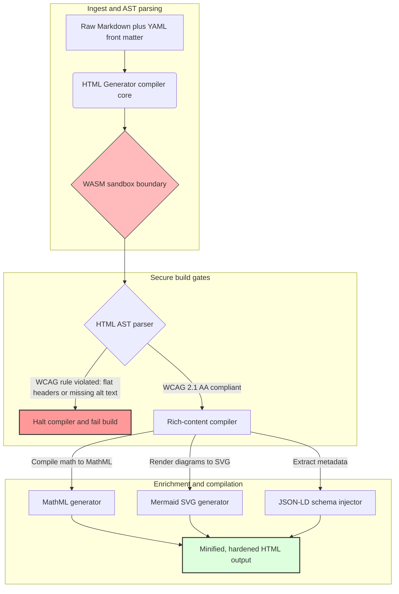

---

# Front Matter (YAML)

author: "contact@sebastienrousseau.com (Sebastien Rousseau)"
banner_alt: "גאומטריה אדריכלית תחת אור מובנה — מסמל את תפקידו של HTML Generator כצינור Markdown-ל-HTML מבוקר-קומפילציה לתשתית פרסום נגישה, מוכנה ל-SEO ומבודדת"
banner_height: "1597"
banner_width: "2584"
banner: "https://cloudcdn.pro/stocks/images/markus-winkler-IrRbSND5EUc-unsplash-1200.webp"
cdn: "https://cloudcdn.pro"
charset: "UTF-8"
cname: "sebastienrousseau.com"
copyright: "© Copyright 2025 - 2026 - Sebastien Rousseau. All rights reserved."
date: "June 20, 2026"
description: "HTML Generator היא ספריית Rust טהורה המתרגמת Markdown ל-HTML תואם WCAG, מוכן ל-SEO ומועשר ב-JSON-LD — נגישות-כ-קוד, תמיכה ב-MathML ו-Mermaid, וביצוע בסביבת WebAssembly מבודדת לפרסום ארגוני בטוח."
format-detection: "telephone=no"
hreflang: "he"
icon: "https://cloudcdn.pro/clients/sebastienrousseau/v1/logos/sebastienrousseau.svg"
id: "https://sebastienrousseau.com/2026-06-20-html-generator-accessible-seo-structured-markdown-rust-2026"
image_alt: "דיוקן שחור-לבן של סבסטיין רוסו"
image_height: "162"
image_width: "162"
image: "https://cloudcdn.pro/stocks/images/sebastienrousseau.webp"
keywords: "html-generator, Rust Markdown ל-HTML, נגישות כקוד, WCAG 2.1 AA, HTML מוכן ל-SEO, JSON-LD, MathML, Mermaid, WebAssembly, EAA, DORA, ADA Title III, פרסום נגיש, ניתוח מבודד, קוד פתוח"
language: "he-IL"
last_reviewed: "2026-06-20"
layout: "report"
locale: "he_IL"
logo_alt: "לוגו של סבסטיין רוסו"
logo_height: "44"
logo_width: "44"
logo: "https://cloudcdn.pro/clients/sebastienrousseau/v1/logos/sebastienrousseau.svg"
menu: ""
measurementID: "G-169G4ET5HQ"
name: "Sebastien Rousseau"
permalink: "https://sebastienrousseau.com/2026-06-20-html-generator-accessible-seo-structured-markdown-rust-2026"
rating: "general"
referrer: "no-referrer"
robots: "index, follow"
schema: "FAQPage, Article"
seo_title: "נגישות-כ-קוד: Markdown ל-HTML ברמת AAA עם Rust ב-2026"
short_name: "sebastienrousseau"
subtitle: "שינוי פרסום ארגוני באינטרנט, תיעוד מוצרים ופורטלי לקוחות מקבצי טקסט בלתי נגישים לנכסים דיגיטליים מובנים, תואמים ומבודדים."
tags: "html-generator, Rust, Markdown, נגישות, WCAG, SEO, JSON-LD, MathML, Mermaid, WebAssembly, EAA, DORA, ADA, גילוי-AI, RAG, קוד פתוח, תשתית בנקאית"
theme-color: "0, 83, 191"
title: "המרת Markdown ל-HTML נגיש, מוכן ל-SEO ומובנה עם Rust ב-2026"
url: "https://sebastienrousseau.com/2026-06-20-html-generator-accessible-seo-structured-markdown-rust-2026"
viewport: "width=device-width, initial-scale=1, shrink-to-fit=no"

# RSS - The RSS feed front matter (YAML).
atom_link: "https://sebastienrousseau.com/2026-06-20-html-generator-accessible-seo-structured-markdown-rust-2026/rss.xml"
category: "Technology"
docs: https://validator.w3.org/feed/docs/rss2.html
generator: "Static Site Generator (SSG) (version 0.0.40)"
item_description: "HTML Generator היא ספריית Rust טהורה המתרגמת Markdown ל-HTML תואם WCAG, מוכן ל-SEO ומועשר ב-JSON-LD — נגישות-כ-קוד, תמיכה ב-MathML ו-Mermaid, וביצוע בסביבת WebAssembly מבודדת לפרסום ארגוני בטוח."
item_guid: "https://sebastienrousseau.com/2026-06-20-html-generator-accessible-seo-structured-markdown-rust-2026/rss.xml"
item_link: "https://sebastienrousseau.com/2026-06-20-html-generator-accessible-seo-structured-markdown-rust-2026/rss.xml"
item_pub_date: "Sat, 20 Jun 2026 06:06:06 +0000"
item_title: "המרת Markdown ל-HTML נגיש, מוכן ל-SEO ומובנה עם Rust ב-2026"
last_build_date: "Sat, 20 Jun 2026 06:06:06 +0000"
managing_editor: "contact@sebastienrousseau.com (Sebastien Rousseau)"
pub_date: "Sat, 20 Jun 2026 06:06:06 +0000"
ttl: "60"
type: "article"
webmaster: "contact@sebastienrousseau.com"

# Apple - The Apple front matter (YAML).
apple_mobile_web_app_orientations: "portrait"
apple_touch_icon_sizes: "192x192"
apple-mobile-web-app-capable: "yes"
apple-mobile-web-app-status-bar-inset: "black"
apple-mobile-web-app-status-bar-style: "black-translucent"
apple-mobile-web-app-title: "Markdown ל-HTML ברמת AAA עם Rust"
apple-touch-fullscreen: "yes"

# MS Application - The MS Application front matter (YAML).

msapplication-navbutton-color: "0, 83, 191"

# Twitter Card - The Twitter Card front matter (YAML).

twitter_card: "summary_large_image"
twitter_creator: "@wwdseb"
twitter_description: "HTML Generator היא ספריית Rust טהורה המתרגמת Markdown ל-HTML תואם WCAG, מוכן ל-SEO ומועשר ב-JSON-LD — נגישות-כ-קוד, תמיכה ב-MathML ו-Mermaid, וביצוע בסביבת WebAssembly מבודדת לפרסום ארגוני בטוח."
twitter_image: "https://cloudcdn.pro/clients/sebastienrousseau/v1/logos/sebastienrousseau.svg"
twitter_image_alt: "לוגו של סבסטיין רוסו"
twitter_site: "@wwdseb"
twitter_title: "נגישות-כ-קוד: Markdown ל-HTML ברמת AAA עם Rust"
twitter_url: "https://sebastienrousseau.com/2026-06-20-html-generator-accessible-seo-structured-markdown-rust-2026"

# Humans.txt - The Humans.txt front matter (YAML).
author_website: "https://sebastienrousseau.com"
author_twitter: "@wwdseb"
author_location: "London, UK"
thanks: "תודה שקראת!"
site_last_updated: "2026-06-20"
site_standards: "HTML5, CSS3, RSS, Atom, JSON, XML, YAML, Markdown, TOML"
site_components: "Kaishi, Kaishi Builder, Kaishi CLI, Kaishi Templates, Kaishi Themes"
site_software: "Static Site Generator, Rust"

---

# המרת Markdown ל-HTML נגיש, מוכן ל-SEO ומובנה עם Rust ב-2026

<!-- lead-start -->
<aside class="post-lead" aria-label="תקציר המאמר">

<strong>בקצרה.</strong> HTML Generator הוא קומפיילר Markdown-ל-HTML בסביבת Rust טהורה, המאכף WCAG 2.1 AA בזמן בנייה, מחדיר JSON-LD תואם-סכמה, מרנדר MathML ו-Mermaid SVG באופן נטיבי, ומבצע ניתוח בתוך סביבת WebAssembly מבודדת — והופך את הפרסום למישור שליטה מבוקר-קומפילציה לנגישות, SEO ואבטחת ICT.

<strong>נקודות מפתח</strong>

<ul class="post-lead-takeaways">
  <li><strong>תשובה מהירה.</strong> מהו HTML Generator במשפט אחד?</li>
  <li><strong>סיכום מנהלים.</strong> רינדור Markdown נראה טריוויאלי; קבלת HTML ברמת פרסום היא בעיית תאימות.</li>
  <li><strong>01. מדוע קומפיילר HTML מונחה-נגישות חשוב ב-2026.</strong> ה-EAA ו-ADA Title III העבירו את הנגישות מהיגיינת הנדסה לחבות נאמנות.</li>
  <li><strong>02. עדשת הארכיטקטורה של HTML Generator 2026.</strong> צינור קומפילציה רב-שלבי ומבוקר, מ-Markdown גולמי לפלט HTML מוגן.</li>
</ul>

<strong>קריאה נוספת:</strong> <a href="https://sebastienrousseau.com/2026-06-18-noyalib-safe-yaml-rust-ai-mcp-financial-infrastructure-2026">מדוע YAML זקוק לסטק Rust בטוח יותר עבור AI, MCP ותשתיות פיננסיות ב-2026</a>, Static Site Generator מאובטח-כברירת-מחדל לפרסום בעידן ה-AI ב-2026, <a href="https://sebastienrousseau.com/2026-06-11-cloudcdn-open-source-blueprint-ai-native-edge-2026">CloudCDN: תכנית פתוחה לקצה AI-נטיב ב-2026</a>.

</aside>
<!-- lead-end -->

ב-2026, תוכן אינטרנטי נצרך לא פחות על-ידי סורקי חיפוש המבוססים על AI, מנועי חיפוש מגובי LLM וצינורות Retrieval-Augmented Generation (RAG) — מאשר על-ידי קוראים אנושיים. HTML שטוח או בלתי-תקני פוגע ביכולת הגילוי המכאני, בעוד שאי-עמידה בתקנות גלובליות מחמירות כגון [חוק הנגישות האירופי (EAA)](https://www.accessibility-act.eu/) ו-[ADA Title III האמריקאי](https://www.ada.gov/topics/title-iii/) היא כיום חבות אזרחית חד-משמעית. [HTML Generator](https://github.com/sebastienrousseau/html-generator) היא ספריית Rust בעלת ביצועים גבוהים, שנועדה לסגור פערים אלה — ברמת הקומפיילר, לא בתיקונים שלאחר הפריסה.

## תשובה מהירה

**מהו HTML Generator במשפט אחד?** HTML Generator הוא קומפיילר Markdown-ל-HTML בקוד פתוח, בסביבת Rust טהורה, המאכף [WCAG 2.1 AA](https://www.w3.org/TR/WCAG21/) בזמן בנייה, מייצר ציוני דרך סמנטיים ותכונות ARIA באופן אוטומטי, מחדיר מטא-נתוני [JSON-LD](https://json-ld.org/) תואמי-סכמה מתוך חזית YAML, מרנדר דיאגרמות Mermaid ומתמטיקה ל-SVG נגיש ו-MathML, ומריץ הכול בתוך סביבת [WebAssembly](https://webassembly.org/) מבודדת — והופך את הפרסום הארגוני למישור שליטה מבוקר-קומפילציה ברמה נאמנותית.

## סיכום מנהלים

רינדור Markdown נראה טריוויאלי. HTML ברמת פרסום הוא בעיית תאימות. ביוני 2026, כל נקודת מגע ארגונית — פורטלי יחסי משקיעים, הגשות רגולטוריות, תיעוד לקוחות, תיעוד API, נכסי שיווק — מנותחת הן על-ידי בני אדם והן על-ידי מכונות. שתי לחצים מתנגשים בכל עמוד: [EAA](https://www.accessibility-act.eu/) ו-[ADA Title III](https://www.ada.gov/topics/title-iii/) הופכים את הנגישות לחשיפה משפטית ברמת הדירקטוריון, בעוד שעיבוד AI וצינורות RAG מתגמלים פלט מובנה וקריא-מכונה. ספריות Markdown סטנדרטיות מייצרות HTML שטוח שנכשל בשני השערים. HTML Generator מתייחס לייצור מסמכים כצינור קומפילציה מבוקר: אימות WCAG הוא שגיאת בנייה, JSON-LD מגיע מחזית YAML ללא חותמת ידנית, MathML ו-Mermaid מרונדרים בצורה נגישה, והמנוע כולו נשלח כיעד WebAssembly כך שניתוח מסמכים לא מהימנים נשאר מבודד מהמארח.

## נקודות מפתח

- **נגישות-כ-קוד היא הבסיס החדש.** ה-EAA מחייב נגישות לשירותים דיגיטליים לצרכנים. HTML Generator מעריך את עץ המסמך בזמן קומפילציה, מייצר ציוני דרך סמנטיים ותכונות ARIA באופן אוטומטי — תיקונים פחותים לאחר הפריסה, תקציבי תיקון מופחתים, ואין טקסט חלופי חסר שמגיע לסביבת ייצור.
- **נתונים מובנים לגילוי AI.** חיפוש מודרני ו-RAG תלויים במטא-נתונים הקריאים-מכונה. הקומפיילר מנתח חזית YAML ומחדיר [JSON-LD תואם Schema.org](https://schema.org/) ישירות לכותרת המסמך, מה שהופך את התוכן לפרשני לחלוטין על-ידי [Google Rich Results](https://developers.google.com/search/docs/appearance/structured-data/intro-structured-data), [Bing Webmaster](https://www.bing.com/webmasters) וסורקים מגובי LLM.
- **מצוינות בתוכן טכני.** פרסום טכני אינו טקסט שטוח. HTML Generator מקמפל הרחבות מתמטיות גולמיות של Markdown ל-[MathML](https://www.w3.org/Math/) נגיש, ומרנדר דיאגרמות [Mermaid.js](https://mermaid.js.org/) ל-SVG רספונסיבי — שניהם שומרים על מבנה תואם WCAG במקום לרדת לתמונות אטומות.
- **בידוד WebAssembly.** ניתוח Markdown לא מהימן הוא סיכון אבטחה. על-ידי מיקוד ל-[WASM](https://webassembly.org/), HTML Generator מבצע בתוך סביבה מבודדת המונעת ביצוע קוד שרירותי ומגינה על מערכת המארח — ומספק ישירות את חובות אבטחת ICT לפי [DORA Article 6](https://eur-lex.europa.eu/legal-content/EN/TXT/?uri=CELEX%3A32022R2554).
- **הגנה נאמנותית לדירקטוריונים.** אי-תאימות טכנית עברה לחדר הדירקטורים. אימוץ מנוע HTML מבוקר-קומפילציה כמניין מגן על דירקטורים ועל ההנהלה הבכירה מחשיפה אישית אזרחית ורגולטורית תחת DORA, EAA ו-ADA Title III.

**קריאה נוספת:** [מדוע YAML זקוק לסטק Rust בטוח יותר עבור AI, MCP ותשתיות פיננסיות ב-2026](https://sebastienrousseau.com/2026-06-18-noyalib-safe-yaml-rust-ai-mcp-financial-infrastructure-2026/), Static Site Generator מאובטח-כברירת-מחדל לפרסום בעידן ה-AI ב-2026, [CloudCDN: תכנית פתוחה לקצה AI-נטיב ב-2026](https://sebastienrousseau.com/2026-06-11-cloudcdn-open-source-blueprint-ai-native-edge-2026/).

## 01. מדוע קומפיילר HTML מונחה-נגישות חשוב ב-2026

נכסי האינטרנט הארגוניים, ספריות תיעוד ומרכזי עזרה למוצרים הם נקודות מגע דיגיטליות קריטיות. הם נתונים כיום לשני לחצים עצימים ומצטלבים.

הראשון הוא **עיבוד וגילוי על-ידי AI**. תוכן מעובד יותר ויותר על-ידי מודלים של שפה גדולים וצינורות Retrieval-Augmented Generation. HTML שטוח או בלתי-תקני מבלבל את ניתוח הסורקים, והופך מחקר ותיעוד ארגוני לבלתי-נראה לפרדיגמות חיפוש מודרניות — כולל [Google Search Generative Experience](https://blog.google/products/search/generative-ai-search/), גלישה של [ChatGPT](https://chat.openai.com/) וסוכני RAG ארגוניים.

השני הוא **חוקי נגישות גלובליים מחמירים**. תחת [חוק הנגישות האירופי](https://www.accessibility-act.eu/) (שחל במלואו מיוני 2025) ו-[ADA Title III האמריקאי](https://www.ada.gov/topics/title-iii/), פלטפורמות פרסום ארגוניות חייבות להבטיח נגישות דיגיטלית מלאה. אי-עמידה ב-[WCAG 2.1 AA](https://www.w3.org/TR/WCAG21/) אינה עוד רשלנות הנדסית; היא חבות אזרחית ורגולטורית שהניבה פסקי דין בסך מיליוני דולרים.

[HTML Generator](https://github.com/sebastienrousseau/html-generator) מתמודד עם שני הלחצים ישירות. זוהי ספריית Rust בטוחה לתהליכים מרובים, שנועדה להמיר Markdown ל-HTML נגיש, מוכן ל-SEO ומובנה. על-ידי התייחסות לייצור מסמכים כצינור קומפילציה מבוקר, המנוע מספק **החזר גבוה על עמידות (RoR)** — מגן על מאזנים מתביעות נגישות תוך מיקסום קריאות-מכונה לגילוי AI.

## 02. עדשת הארכיטקטורה של HTML Generator 2026

המסגרת תוכננה כצינור קומפילציה מאובטח ורב-שלבי, הממיר טקסט Markdown גולמי לנכסים סטטיים נגישים מאוד ומאומתים קריפטוגרפית.

### טבלה 1: שכבות ארכיטקטורה של HTML Generator ופחתת סיכונים

| שכבה | החלטת עיצוב | מדוע זה חשוב | סיכון אם מטופל בצורה שגויה |
| ---- | ---- | ---- | ---- |
| **שכבת קלט** | מנתח Markdown בתוספת חזית YAML | פוגש כותבים היכן שהם; מפריד פרוזה ממטא-נתונים מובניים. | מטא-נתונים לא עקביים, מפות אתר שבורות, פערים באינדוקס. |
| **שכבת מבנה** | תוכן עניינים אוטומטי וציוני דרך סמנטיים עם תגי ARIA | מייצר עצי מסמך ניווטיים ונגישים לפי עיצוב. | HTML שטוח השובר קוראי מסך ומפר WCAG. |
| **שכבת תוכן עשיר** | רינדור נטיבי של MathML ו-Mermaid.js SVG | מקמפל נוסחאות ודיאגרמות ל-SVG ו-MathML נגישים. | עיכוב רינדור JS בצד-לקוח ופלט שבור לטכנולוגיות עזר. |
| **שכבת SEO ונתונים** | ייצור JSON-LD ומטא-נתונים מובנים משולב | מחדיר JSON-LD תואם [Schema.org](https://schema.org/) ישירות לכותרת. | מנועי חיפוש וסורקי AI קוראים שגוי את המחבר, ההקשר, הרישיון. |
| **שכבת זמן-ריצה** | קומפיילר Rust נטיבי עם יעד WebAssembly | מאפשר ביצוע מאובטח ומבודד בשרתים, צמתי קצה ודפדפנים. | ביצוע קוד שרירותי במהלך ניתוח Markdown לא מהימן. |

## 03. אותות אבטחת אינטרנט ונגישות מרכזיים

כדי לאמת שנכסי פרסום הפונים לציבור עומדים בביקורות רגולטוריות ואבטחה מודרניות, על מנהלי טכנולוגיה בכירים לנטר מדדים ספציפיים וניתנים לכימות.

### טבלה 2: אותות אבטחת אינטרנט ונגישות

| אות | מדד / ספסל תפעולי | הפניה ל-EAA / DORA / W3C | יישום טכני |
| ---- | ---- | ---- | ---- |
| **תאימות נגישות** | 100% מהעמודים המקומפלים מאומתים מול כללי WCAG 2.1 AA. | [EAA](https://www.accessibility-act.eu/) ו-[ADA Title III](https://www.ada.gov/topics/title-iii/) | מנתח HTML בזמן בנייה המעריך תגי alt לתמונות וציוני דרך סמנטיים. |
| **סביבת ביצוע WASM** | 100% מקלטי Markdown הלא-מהימנים מקומפלים בזמן-ריצה מבודד של WebAssembly. | [DORA Article 6](https://eur-lex.europa.eu/legal-content/EN/TXT/?uri=CELEX%3A32022R2554) (אבטחת ICT) | בידוד סביבת הניתוח משרת המארח. |
| **כיסוי מטא-נתונים מובנים** | 100% ממאמרים שפורסמו הוחדר להם כותרות JSON-LD תקינות ותואמות-סכמה. | מפרטי [Schema.org](https://schema.org/) | ניתוח חזית אוטומטי והמרה לאובייקטי JSON-LD. |
| **תפוקת קומפילציה** | יעד עמודים-לשנייה מעל 10,000 על חומרה סחורתית. | החזר על עמידות (RoR) | קומפיילר Rust AST מקבילי ביותר. |
| **אימות קטעים עשירים** | אפס שגיאות ניתוח ב-[Google Rich Results](https://search.google.com/test/rich-results) ו-[Schema validator](https://validator.schema.org/). | הנחיות Google Search | אימות מבני של JSON-LD שנוצר במהלך צינור הבנייה. |

## 04. המיתוס של רינדור Markdown פשוט

אי-הבנה נפוצה בקרב מנהלי טכנולוגיה היא שהמרת Markdown ל-HTML היא תרגיל של החלפת טקסט פשוטה. ספריות סטנדרטיות רבות מתרגמות עיצוב Markdown ל-HTML שטוח ולא-מובנה. הפלט מרונדר לקורא רואה בדפדפן, אך הוא מייצג מלכודת תאימות.

ל-HTML שטוח בדרך-כלל חסרות שלוש דברים.

1. **היררכיות כותרות נכונות.** Markdown סטנדרטי אינו אוכף סדר כותרות. קפיצה מ-`<h1>` ל-`<h4>` מפרה WCAG 2.1 AA ושוברת ניווט מסמכים לקוראי מסך.
2. **סמנטיקת טבלה מפורשת.** טבלאות Markdown סטנדרטיות לרוב לא מרונדרות עם תכונות `<th>` scope ו-`<tbody>` הנדרשות לניתוח נגיש.
3. **מטא-נתונים קריאי-מכונה.** ב-HTML סטנדרטי חסרים ווי JSON-LD שעליהם תלויים פלטפורמות חיפוש AI ומערכות עיבוד RAG.

HTML Generator פותר זאת על-ידי ניתוח Markdown ל-**Abstract Syntax Tree (AST)**. המנוע מעריך את מבנה המסמך לפני פליטת HTML, מאמת קינון כותרות, מחדיר תכונות ARIA מתאימות, וקובע שכל נכס מדיה נושא טקסט חלופי — והופך את הנגישות מביקורת ידנית לאינווריאנט מובטח בזמן קומפילציה.

## 05. עיצוב צינור בנייה של נגישות-כ-קוד

כדי למנוע מנכסים בלתי-נגישים או לא-מאונדקסים להגיע אי-פעם לפריסה ציבורית, נגישות חייבת להיות שער קומפיילר קפדני. הצינור הבא מראה כיצד HTML Generator מעריך Markdown, מריץ אימות מבודד ב-WebAssembly, ופולט HTML מוקשח ומובנה.

## 06. ספר ההפעלה של הדירקטוריון והחבות הנאמנותית

תאימות לנגישות ואבטחת אינטרנט מודרנית הן נושאים שאינם ניתנים לפשרה בדירקטוריון. ההנהלה הבכירה חייבת לגשת לתשתית פרסום דרך עדשת סיכון משפטי, שימור פיננסי וחשיפה רגולטורית.

- **חוק הנגישות האירופי (EAA).** מטיל מנדטי תאימות מחייבים משפטית ישירות על פורטלים דיגיטליים ציבוריים ופרטיים. אי-תאימות עשויה לגרור קנסות כספיים חמורים, תביעות אזרחיות ונסיגה מיידית של הנכס מהשוק האירופי. על-ידי שילוב נגישות-כ-קוד, הדירקטוריונים יכולים לאשר שקוד לא-תואם לא יכול להישלח — והופכים תיקון תגובתי למגן משפטי מובני.
- **DORA Article 6 (סביבות ICT מאובטחות).** קובע כללים מחמירים לאבטחת סביבת ICT. על-ידי בידוד קומפילציית Markdown בתוך סביבת WebAssembly מבודדת, ארגונים מבטיחים שניתוח תיעוד שהועלה על-ידי לקוח או הזנות שותפים לא יכול לחשוף שרתי מארח לביצוע קוד שרירותי, ומגן על פורטלים בנקאיים קריטיים.
- **הפחתת עלויות בביקורות תאימות.** תאימות נגישות מסורתית מסתמכת על ביקורות יקרות ורטרוספקטיביות לאחר הפריסה — עשרות אלפי דולרים מדי שנה לאתר. יישום אימות WCAG כחסימת זמן קומפילציה מבטל את אותם עלויות רטרוספקטיביות, ומעביר תקציב תאימות מהגנה לחדשנות.

## 07. המשמעות לפי סוג בנק / ארגון

### בנקים בעלי חשיבות מערכתית גלובלית (G-SIBs)

G-SIBs מפעילים נכסי ציבור רב-לשוניים עצומים המפרסמים אלפי מאמרי מחקר, גילויים רגולטוריים ומסמכי יחסי משקיעים על-פני תחומי שיפוט מרובים. האתגר שלהם הוא קנה-מידה ושוויון רב-לשוני. יעד ה-WebAssembly של HTML Generator ומנוע Rust בתפוקה גבוהה מאפשרים לספריות מחקר מקומיות בקנה-מידה גדול להתעדכן, להתקמפל ולהיפרס גלובלית בתוך שניות — ללא פיגור רינדור או נסיגה בנגישות.

### בנקים לעסקאות ובנקים ארגוניים

עבור בנקי עסקאות, פורטלי לקוחות, מרכזי תיעוד ומדריכי API למפתחים הם נקודות מגע דיגיטליות קריטיות. קומפילציה של אותם נכסים דרך HTML Generator מבטיחה שלערוצים הפונים ללקוח אין חשיפת XSS, אין וקטורי חטיפת תלות ואין פגמי נגישות — ושומר על האמון המוסדי ומצמצם את שטח תביעות.

### בנקים אזוריים ופינטקים

בנקים אזוריים ופינטקים זריזים מתחרים על חוויה דיגיטלית ללא תקציבי הנדסה של G-SIB. HTML Generator מעניק לצוותים אלה צינור פרסום ברמה ארגונית מהקופסה, ומאפשר לנכסים קטנים יותר לשלוח נכסים נגישים, מוכנים ל-SEO ומבודדים שעומדים בבדיקה הן מרגולטורים והן מלקוחות ארגוניים פוטנציאליים.

## 08. מפת הדרכים לתשתית פרסום

נכסי האינטרנט הציבוריים הפונים לארגון הם מרכיב ליבה של עמידות תפעולית. הסתמכות על מנועי אינטרנט דינמיים, פגיעים ומבוססי-מסד-נתונים — או נכסים סטטיים לא-חתומים — היא סיכון עסקי בלתי-מקובל.

כדי לאבטח נקודות מגע דיגיטליות ציבוריות ולהגן על מאזנים מתביעות נגישות, מנהלי טכנולוגיה ואבטחה בכירים צריכים לבצע מפת דרכים ברורה.

1. **מעבר לארכיטקטורות סטטיות.** ייסוף פלטפורמות CMS דינמיות מדור קודם עבור נכסי מחקר, שיווק ותיעוד. העברת תוכן לצינורות מבוקרי-קומפילציה כמו HTML Generator.
2. **אכיפת נגישות בזמן בנייה.** יישום נגישות-כ-קוד. כישלון אוטומטי של צינורות קומפילציה בכל הפרת WCAG 2.1 AA.
3. **בידוד ניתוח ב-WebAssembly.** שמירה על כל ניתוח מסמכים ותוכן בתוך זמן-ריצה WASM כך שקלט לא-מהימן לא יגע במערכות מארח.
4. **הזרקת מטא-נתוני JSON-LD עשירים.** הבטחה שכל נכס שפורסם נושא כותרות JSON-LD תואמות-סכמה כדי למקסם גילוי AI.

## 09. שאלות נפוצות

**כיצד HTML Generator מאכף נגישות?**

הוא מנתח את Abstract Syntax Tree של ה-HTML שנוצר בזמן בנייה, ומעריך את המסמך מול כללי [WCAG 2.1 AA](https://www.w3.org/TR/WCAG21/). אם כלל מופר — תכונת alt חסרה, קפיצת כותרת, פקד טופס ללא תווית — הקומפיילר עוצר את הבנייה, ומטפל בנגישות כאינווריאנט זמן-קומפילציה ולא כמשימת ביקורת לאחר הפריסה.

**מדוע בידוד WebAssembly חשוב?**

[WebAssembly](https://webassembly.org/) מאפשר למנוע ניתוח ה-Markdown לפעול בתוך סביבה מבודדת, מופרדת משרת המארח. אפילו כאשר גורם עוין מעלה מסמך Markdown מעוצב לניצול פגיעויות מנתח, הביצוע נלכד — מגן על מערכות מארח ומספק את חובות אבטחת ICT לפי DORA Article 6.

**כיצד JSON-LD מועיל לגילוי חיפוש ב-2026?**

[JSON-LD](https://json-ld.org/) מספק מטא-נתונים מובנים וקריאי-מכונה בכותרת המסמך. [Google Rich Results](https://developers.google.com/search/docs/appearance/structured-data/intro-structured-data), סורקי Bing וסוכני חיפוש מגובי LLM מזהים מחבר, רישיון, תאריך פרסום והקשר סמנטי מיד — עוקפים את האמביגויות של HTML סטנדרטי ומגדילים את שטח הפנים בגילוי מונחה AI.

**מי הוא הקהל של HTML Generator?**

בוני אתרים סטטיים, צוותי תיעוד, כותבים טכניים, מפתחי Rust ומהנדסי פלטפורמה שמשלחים נכסים קריטיים לנגישות או פונים לרגולטורים. זהו גם שכבת עיבוד תוכן בת-קיימא בתוך צינורות פרסום מאובטחים גדולים יותר כגון [Static Site Generator (SSG)](https://github.com/sebastienrousseau/static-site-generator).

## 10. מקורות

- קונסורציום האינטרנט העולמי (W3C), 2024. [הנחיות לנגישות תוכן אינטרנט (WCAG) 2.1 ⧉](https://www.w3.org/TR/WCAG21/ "Web Content Accessibility Guidelines 2.1").
- Schema.org, 2026. [מפרטי נתונים מובנים של Schema.org ⧉](https://schema.org/ "Schema.org structured-data specifications").
- הפרלמנט האירופי ומועצת האיחוד האירופי, 2022. [תקנה (EU) 2022/2554 בדבר עמידות תפעולית דיגיטלית לסקטור הפיננסי (DORA) ⧉](https://eur-lex.europa.eu/legal-content/EN/TXT/?uri=CELEX%3A32022R2554 "DORA Regulation").
- הנציבות האירופית, 2025. [חוק הנגישות האירופי ⧉](https://www.accessibility-act.eu/ "European Accessibility Act").
- משרד המשפטים האמריקאי, 2024. [ADA Title III ⧉](https://www.ada.gov/topics/title-iii/ "ADA Title III").
- קבוצת הקהילה של WebAssembly, 2026. [מפרט WebAssembly ⧉](https://webassembly.org/ "WebAssembly").
- GitHub, 2026. [מאגר HTML Generator ⧉](https://github.com/sebastienrousseau/html-generator "HTML Generator open-source repository").

<!-- enrich-start -->
<aside class="author-card" aria-label="אודות הכותב"><strong class="author-card-name"><a href="/about/index.html">Sebastien Rousseau</a></strong>טכנולוג בנקאי בכיר הכותב על AI יישומי, תשתיות תשלומים, כסף מסומן, ISO 20022, אבטחה פוסט-קוונטית, שירותים פיננסיים cloud-native, תשתיות קוד-פתוח ושווקים דיגיטליים מוסדרים.20+ שנים ב-HSBC Commercial &amp; Investment Bank, PayPal, Barclays, Shazam, AKQA, Virgin Group. <a href="/about/index.html">פרופיל מלא</a> &middot; <a href="https://www.linkedin.com/in/sebastienrousseau/" rel="external noopener">LinkedIn</a> &middot; <a href="https://github.com/sebastienrousseau" rel="external noopener">GitHub</a></aside>

עודכן לאחרונה <time datetime="2026-06-20">2026-06-20</time>.

<!-- enrich-end -->
