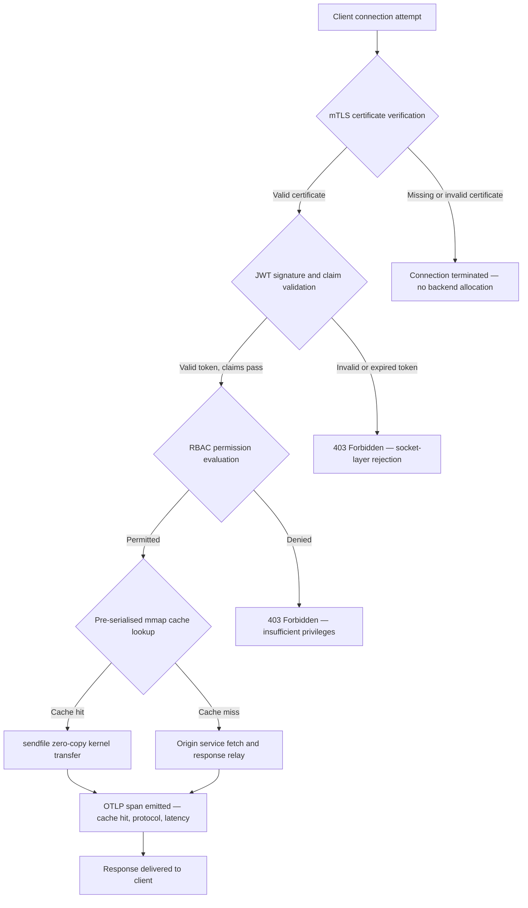

---

# Front Matter (YAML)

author: "contact@sebastienrousseau.com (Sebastien Rousseau)"
banner_alt: "נוף עירוני מופשט של לוחות מעגלים בלילה — ממחיש את קצה הבנקאות שבו מפגשים העברות אפס-העתקה ברמת הגרעין, לחיצות ידיים של mTLS ואימות JWT בקובץ בינארי יחיד מקושר סטטית"
banner_height: "1597"
banner_width: "2584"
banner: "https://cloudcdn.pro/stocks/images/bit-cloud-GlqbGLCPnQ4.webp"
cdn: "https://cloudcdn.pro"
charset: "UTF-8"
cname: "sebastienrousseau.com"
copyright: "© Copyright 2025 - 2026 - Sebastien Rousseau. All rights reserved."
date: "June 20, 2026"
description: "http-handle הוא קובץ בינארי של Rust המקושר סטטית המספק 180,000 בקשות לשנייה בקצה הבנקאי ללא תלויות זמן ריצה, עם אימות mTLS ו-JWT משולב, HTTP/2 ו-HTTP/3 המנוהלים דרך ALPN, ויכולת תצפית OTLP — וסוגר את פערי האבטחה והחוסן שמותירים Nginx ו-Envoy פתוחים."
format-detection: "telephone=no"
hreflang: "he"
icon: "https://cloudcdn.pro/clients/sebastienrousseau/v1/logos/sebastienrousseau.svg"
id: "https://sebastienrousseau.com/2026-06-20-http-handle-zero-dependency-edge-ingress-banking-rust-2026"
image_alt: "דיוקן בשחור-לבן של סבסטיאן רוסו"
image_height: "162"
image_width: "162"
image: "https://cloudcdn.pro/stocks/images/sebastienrousseau.webp"
keywords: "http-handle, כניסה לקצה Rust, פרוקסי ללא תלויות, תשתית בנקאית, mTLS JWT, sendfile אפס-העתקה, ALPN HTTP3, ציות DORA, באזל III, תצפית OTLP, בינארי סטטי, ARM64 בנקאי, אפס אמון בנקאי, כניסה קלת-משקל, אבטחת Rust בנקאי"
language: "he-IL"
last_reviewed: "2026-06-20"
layout: "report"
locale: "he_IL"
logo_alt: "לוגו של סבסטיאן רוסו"
logo_height: "44"
logo_width: "44"
logo: "https://cloudcdn.pro/clients/sebastienrousseau/v1/logos/sebastienrousseau.svg"
menu: ""
measurementID: "G-169G4ET5HQ"
name: "Sebastien Rousseau"
permalink: "https://sebastienrousseau.com/2026-06-20-http-handle-zero-dependency-edge-ingress-banking-rust-2026"
rating: "general"
referrer: "no-referrer"
robots: "index, follow"
schema: "FAQPage, Article"
seo_title: "http-handle: כניסת Rust ללא תלויות לבנקאות ב-180k בקשות/שניה"
short_name: "sebastienrousseau"
subtitle: "כיצד קובץ בינארי יחיד של Rust המקושר סטטית מספק 180,000 בקשות לשנייה עם mTLS, JWT ו-ALPN בקצה הבנקאי — ומה משמעות הדבר לציות DORA ובאזל III."
tags: "http-handle, Rust, banking, edge-ingress, mTLS, JWT, ALPN, HTTP3, DORA, Basel-III, zero-copy, sendfile, ARM64, zero-trust, OTLP, observability, open-source, infrastructure"
theme-color: "0, 83, 191"
title: "http-handle: כניסת קצה בעלת ביצועים גבוהים וללא תלויות לבנקאות ב-2026"
url: "https://sebastienrousseau.com/2026-06-20-http-handle-zero-dependency-edge-ingress-banking-rust-2026"
viewport: "width=device-width, initial-scale=1, shrink-to-fit=no"

# RSS - The RSS feed front matter (YAML).
atom_link: "https://sebastienrousseau.com/2026-06-20-http-handle-zero-dependency-edge-ingress-banking-rust-2026/rss.xml"
category: "Technology"
docs: https://validator.w3.org/feed/docs/rss2.html
generator: "Static Site Generator (SSG) (version 0.0.40)"
item_description: "http-handle הוא קובץ בינארי של Rust המקושר סטטית המספק 180,000 בקשות לשנייה בקצה הבנקאי ללא תלויות זמן ריצה, עם אימות mTLS ו-JWT משולב, HTTP/2 ו-HTTP/3 המנוהלים דרך ALPN, ויכולת תצפית OTLP — וסוגר את פערי האבטחה והחוסן שמותירים Nginx ו-Envoy פתוחים."
item_guid: "https://sebastienrousseau.com/2026-06-20-http-handle-zero-dependency-edge-ingress-banking-rust-2026/rss.xml"
item_link: "https://sebastienrousseau.com/2026-06-20-http-handle-zero-dependency-edge-ingress-banking-rust-2026/rss.xml"
item_pub_date: "Sat, 20 Jun 2026 07:07:07 +0000"
item_title: "http-handle: כניסת קצה בעלת ביצועים גבוהים וללא תלויות לבנקאות ב-2026"
last_build_date: "Sat, 20 Jun 2026 07:07:07 +0000"
managing_editor: "contact@sebastienrousseau.com (Sebastien Rousseau)"
pub_date: "Sat, 20 Jun 2026 07:07:07 +0000"
ttl: "60"
type: "article"
webmaster: "contact@sebastienrousseau.com"

# Apple - The Apple front matter (YAML).
apple_mobile_web_app_orientations: "portrait"
apple_touch_icon_sizes: "192x192"
apple-mobile-web-app-capable: "yes"
apple-mobile-web-app-status-bar-inset: "black"
apple-mobile-web-app-status-bar-style: "black-translucent"
apple-mobile-web-app-title: "קצה בנקאי ללא תלויות"
apple-touch-fullscreen: "yes"

# MS Application - The MS Application front matter (YAML).

msapplication-navbutton-color: "0, 83, 191"

# Twitter Card - The Twitter Card front matter (YAML).

twitter_card: "summary_large_image"
twitter_creator: "@wwdseb"
twitter_description: "http-handle הוא קובץ בינארי של Rust המקושר סטטית המספק 180,000 בקשות לשנייה בקצה הבנקאי ללא תלויות זמן ריצה, עם mTLS, JWT ויכולת תצפית OTLP."
twitter_image: "https://cloudcdn.pro/clients/sebastienrousseau/v1/logos/sebastienrousseau.svg"
twitter_image_alt: "Logo of Sebastien Rousseau"
twitter_site: "@wwdseb"
twitter_title: "http-handle: כניסת Rust ללא תלויות לבנקאות ב-180k בקשות/שניה"
twitter_url: "https://sebastienrousseau.com/2026-06-20-http-handle-zero-dependency-edge-ingress-banking-rust-2026"

# Humans.txt - The Humans.txt front matter (YAML).
author_website: "https://sebastienrousseau.com"
author_twitter: "@wwdseb"
author_location: "London, UK"
thanks: "Thanks for reading!"
site_last_updated: "2026-06-20"
site_standards: "HTML5, CSS3, RSS, Atom, JSON, XML, YAML, Markdown, TOML"
site_components: "Kaishi, Kaishi Builder, Kaishi CLI, Kaishi Templates, Kaishi Themes"
site_software: "Static Site Generator, Rust"

---

# http-handle: כניסת קצה בעלת ביצועים גבוהים וללא תלויות לבנקאות ב-2026

<!-- lead-start -->
<aside class="post-lead" aria-label="תקציר המאמר">

<strong>בקצרה.</strong> http-handle הוא קובץ בינארי של Rust בקוד פתוח המקושר סטטית, המחליף את Nginx ו-Envoy בקצה הבנקאי. הוא מספק 180,000 בקשות לשנייה בצמתי ARM64 באמצעות העברות אפס-העתקה של Linux <code>sendfile(2)</code>, אוכף אימות mTLS ו-JWT בשכבת שקע הרשת לפני הרצת קוד יישום כלשהו, משא ומתן אוטומטי על HTTP/2 ו-HTTP/3 באמצעות ALPN, ופולט מדדי OpenTelemetry באופן מקורי — הכל ללא תלויות זמן ריצה מעבר ל-<code>libc</code>.

<strong>עיקרי הדברים</strong>

<ul class="post-lead-takeaways">
  <li><strong>בעיית הפרוקסי הכבד.</strong> Nginx ו-Envoy נושאים עצי תלויות המרחיבים את משטח ה-CVE ומסבכים את מחזורי תיקון סיכוני ICT של DORA.</li>
  <li><strong>ביצועי אפס-העתקה בקנה מידה.</strong> בלוקי מטמון mmap מסודרים מראש והעברות גרעין <code>sendfile(2)</code> מקיימים 180,000 בקשות/שניה ב-ARM64 עם תקורת פרוקסי מתחת למילישנייה.</li>
  <li><strong>אבטחה ברמת השקע, לא ברמת היישום.</strong> אימות תעודת לקוח mTLS, אימות JWT והערכת RBAC מושלמים לפני שמוקצה משאב אחד לבקשה.</li>
  <li><strong>התאמה רגולטורית מובנית.</strong> משטח ההתקפה המצומצם ופריסת בינארי יחיד הניתנת לביקורת מתייחסים ישירות לסעיפים 5 ו-6 של DORA, סיכון תפעולי של באזל III ושרשראות אחריות SM&CR.</li>
</ul>

<strong>קריאה נוספת:</strong> <a href="https://sebastienrousseau.com/2026-06-18-noyalib-safe-yaml-rust-ai-mcp-financial-infrastructure-2026">מדוע YAML זקוק לערימת Rust בטוחה יותר עבור AI, MCP ותשתית פיננסית ב-2026</a>, <a href="https://sebastienrousseau.com/2026-06-11-cloudcdn-open-source-blueprint-ai-native-edge-2026">CloudCDN: תוכנית קוד פתוח לקצה המותאם ל-AI ב-2026</a>, <a href="https://sebastienrousseau.com/2026-05-16-best-cloud-infrastructure-architecture-2026">ארכיטקטורת תשתית ענן מיטבית לבנקים ומוסדות פיננסיים ב-2026</a>.

</aside>
<!-- lead-end -->

לקצה הבנקאי יש בעיית תלויות. כל מופע של Nginx או Envoy המנתב תעבורה בין לקוח לשירות בנקאי מרכזי נושא עץ תלויות: בניות OpenSSL, מודולי Lua, ספריות gRPC ושכבות קונטיינר — כל אחד מהם CVE פוטנציאלי, כל אחד דורש מחזור תיקון ייעודי, כל אחד מוסיף שונות לזמן האחזור המסבכת את מדידת ה-SLA. במסגרת [חוק החוסן התפעולי הדיגיטלי (DORA)](https://eur-lex.europa.eu/eli/reg/2022/2554/oj), מורכבות זו היא עכשיו אחריות רגולטורית כמו גם תפעולית.

[http-handle](https://github.com/sebastienrousseau/http-handle) נוקט גישה שונה. זהו קובץ בינארי יחיד של Rust המקושר סטטית ללא תלויות זמן ריצה מעבר ל-`libc`. הוא מספק 180,000 בקשות לשנייה בצמתי ARM64, אוכף TLS הדדי ואימות JWT בשכבת שקע הרשת, ומנהל משא ומתן אוטומטי על HTTP/2 ו-HTTP/3 — הכל בתוך טביעת פריסה של פחות מ-20 MB RAM.

## תשובה מהירה

**מהו http-handle במשפט אחד?** http-handle הוא קובץ בינארי של Rust בקוד פתוח המקושר סטטית המחליף קונטיינרי פרוקסי כבדים בקצה הבנקאי, מספק 180,000 בקשות/שניה ב-ARM64 באמצעות העברות גרעין אפס-העתקה של `sendfile(2)` מ-Linux, אוכף mTLS, JWT ו-RBAC בשכבת השקע לפני נגיעה במשאב אחורי כלשהו, ופולט מדדי [OpenTelemetry](https://opentelemetry.io/) מקוריים — ללא תלויות ספריית זמן ריצה מעבר ל-`libc`.

## סיכום מנהלים

בנקים הפעילו את Nginx ו-Envoy בקצה שלהם במשך עשור. שניהם מסוגלים; אף אחד מהם לא תוכנן לסביבה הרגולטורית של 2026. תמונות קונטיינר עמוסות תלויות מייצרות תורי CVE שצוותי ציות אינם יכולים לפנות מהר מספיק, וכל עדכון גרסת ספרייה נושא סיכון נסיגה. סעיפים 5 ו-6 של DORA דורשים שסיכון ICT ינוהל בעיצוב, לא יתוקן לאחר הגילוי. מסגרות סיכון תפעולי של באזל III מעניקות עונש לארכיטקטורות שבהן נקודות כשל מתרבות עם מורכבות המערכת.

http-handle מבטל את בעיית התלויות במקורה. הבינארי מקומפל פעם אחת, סטטית, ללא דרישות ספרייה חיצוניות בזמן הריצה. משטח ההתקפה מתכווץ לספריית Rust הסטנדרטית בתוספת `libc`. אכיפת האבטחה — אימות תעודת mTLS, אימות טענות JWT ובקרת גישה מבוססת תפקידים — מתבצעת בשקע הרשת לפני כל הקצאת אחורי, מכווצת את היקף Zero Trust לביטוי המינימלי האפשרי שלו. הביצועים נובעים מהארכיטקטורה: בלוקי מטמון ממופים לזיכרון שסורלו מראש בשילוב עם העברות גרעין `sendfile(2)` מסירים נתונים לחלוטין ממסלול ההעתקה CPU-לזיכרון, ומקיימים 180,000 בקשות/שניה בחומרת ARM64. התוצאה היא שכבת כניסה העומדת בדרישות החוסן של DORA, תומכת בטיעוני הפחתת סיכון תפעולי של באזל III, ומעניקה למנהיגי IT בכירים תחת SM&CR שרשרת אחריות של רכיב אחד הניתנת לאימות עבור תשתית הקצה.

## עיקרי הדברים

- **בינאריים קטנים יותר, תורי CVE קצרים יותר.** בינארי יחיד המקושר סטטית כולל חבילה אחת לתיקון, מהדורה אחת לאימות וארטיפקט אחד לביקורת. Nginx עם סט מודולים סטנדרטי מגיע עם יותר מ-30 תלויות ספרייה משותפת; כל אחת נושאת מחזור חיי פגיעות משלה.
- **אפס-העתקה אינה אופטימיזציה — זו אילוץ עיצובי.** ב-180,000 בקשות/שניה, כל העתקת נתונים במרחב המשתמש מביאה שונות לזמן האחזור הניתנת למדידה. `sendfile(2)` מעביר תוכן מתאר קובץ — או אזור ממופה לזיכרון — למתאר קובץ שקע רשת, לחלוטין בגרעין. בשילוב עם בלוקי מטמון תגובה מוצמדים ל-mmap, המעבד לעולם אינו נוגע במסלול הנתונים עבור תגובות מאוחסנות במטמון.
- **היקף האבטחה שייך לשקע.** אימות JWT ותעודות mTLS ב-middleware יישום פירושו שה-backend כבר הקצה חוטים וזיכרון לפני דחיית הבקשה. אימות בשכבת השקע מבטיח שבקשות לא מאומתות אינן צורכות כל משאב אחורי.
- **OTLP סוגר את פער התצפית.** אינטגרציה מקורית של OpenTelemetry פירושה שכל בקשה, כל החלטת אימות וכל משא ומתן פרוטוקול מייצרים טלמטריה מובנית ללא סוכן סייד-קאר. לוחות מחוונים בנקאיים קיימים בולעים מעקבי OTLP ישירות.

**קריאה נוספת:** [מדוע YAML זקוק לערימת Rust בטוחה יותר עבור AI, MCP ותשתית פיננסית ב-2026](https://sebastienrousseau.com/2026-06-18-noyalib-safe-yaml-rust-ai-mcp-financial-infrastructure-2026/), [CloudCDN: תוכנית קוד פתוח לקצה המותאם ל-AI ב-2026](https://sebastienrousseau.com/2026-06-11-cloudcdn-open-source-blueprint-ai-native-edge-2026/), [ארכיטקטורת תשתית ענן מיטבית לבנקים ומוסדות פיננסיים ב-2026](https://sebastienrousseau.com/2026-05-16-best-cloud-infrastructure-architecture-2026/).

## 01. בעיית הפרוקסי הכבד בבנקאות

Nginx ו-Envoy בנו את קצה האינטרנט המודרני. שניהם ניתנים להגדרה, נבדקו בקרב ונתמכים על ידי קהילות גדולות. הם גם בחירות ארכיטקטוניות שנעשו לפני שקיים DORA, לפני שמסגרות סיכון תפעולי של באזל III דרשו הפחתת מורכבות הניתנת לכימות, ולפני שצמתי ענן ARM64 שינו את הכלכלה של מחשוב בתפוקה גבוהה.

התוצאה המעשית היא פער בין מה שבנקים צריכים לבין מה שקונטיינרי פרוקסי כבדים מספקים.

**משטח תלויות.** פריסת Envoy סטנדרטית מושכת אליה OpenSSL, Abseil, Protobuf, gRPC, Lua ועשרות ספריות משניות. כל אחת נושאת מחזור חיי CVE עצמאי. כאשר מסד הנתונים הלאומי לפגיעויות מפרסם ייעוץ OpenSSL קריטי, כל מופע Envoy בנכסים הופך לשעון ציות: הערך, תקן, בדוק, פרס מחדש ואשר מחדש — בכל סביבה שבה הבינארי פועל. לפי סעיף 6 של DORA, על בנקים להוכיח שתהליכי ניהול סיכוני ICT הם פרופורציונליים, מתועדים וניתנים לאימות. עץ תלויות של ספריות מרובות הופך את ההדגמה הזו ליקרה לתחזוקה.

**תקורת זיכרון.** תהליך עובד Nginx המוגדר באופן מינימלי צורך 40–80 MB זיכרון תושב בעומס מתון. בקנה מידה — מאות צמתי כניסה בין מערכות מסחר, ממשקי API של תשלומים ופורטלים מול לקוחות — תקורה זו מצטברת לעלות תשתית הניתנת למדידה ללא יתרון ביצועים תואם על פני חלופה של בינארי יחיד מהונדס היטב.

**מהירות תיקון.** שרשראות אספקה של תמונות קונטיינר מכניסות עיכוב של ימים מרובים בין פרסום CVE לבין תיקון מאומת המגיע לייצור. תמונת הבסיס חייבת להיבנות מחדש, שכבת היישום מחוצנת מחדש, מטריצת הבדיקות המלאה מופעלת מחדש וצינור הפריסה מבוצע מחדש. עבור מערכות בנקאיות קריטיות הפועלות בחלונות דיווח על אירועים של DORA, מחזור זה הוא סיכון מבני.

http-handle מתייחס לשלושתם. בינארי אחד. משטח CVE אחד. ארטיפקט אחד לתיקון. פחות מ-20 MB RAM לצומת כניסה בייצור.

## 02. עדשת הארכיטקטורה של http-handle 2026

הבינארי מובנה כחמש שכבות תלויות זו בזו, כל אחת מתוכננת לבטל קטגוריית סיכון ספציפית שארכיטקטורות פרוקסי מסורתיות צוברות.

### טבלה 1: שכבות ארכיטקטורת http-handle והפחתת סיכון

| שכבה | החלטת עיצוב | מדוע זה חשוב | סיכון בטיפול שגוי |
| ---- | ---- | ---- | ---- |
| **ליבת השרת** | בינארי Rust יחיד, מקושר סטטית, אפס תלויות מעבר ל-`libc` | ארטיפקט אחד לתיקון; מבטל התפשטות CVE של ספריות בכל הנכסים | התקפות בלבול תלויות; צבירת פגיעויות ספריות |
| **מנוע האצה** | בלוקי מטמון mmap שסורלו מראש והעברות גרעין אפס-העתקה `sendfile(2)` | 180,000 בקשות/שניה ב-ARM64 עם תקורת פרוקסי מתחת למילישנייה; אין נתונים שנכנסים למרחב המשתמש עבור תגובות מאוחסנות במטמון | דליפות מיפוי זיכרון; צווארי בקבוק במרחב הגרעין בעת ביטול מטמון |
| **אבטחה קריפטוגרפית** | mTLS מקורי עם תמיכה בטעינה מחדש חמה של תעודות ומשא ומתן ALPN | מבטיח תקינות נתונים ותאימות פרוטוקול; רוטציית תעודות ללא נפילת חיבורים | פקיעת תוקף תעודה הגורמת להפסקות שירות; ברירות מחדל חלשות של חבילת צפנים |
| **מישור מדיניות גישה** | אימות JWT בשכבת שקע והערכת טענות RBAC | בקשות לא מאומתות אינן צורכות משאבי אחור; Zero Trust נאכף בגבול הגרעין | התקפות בלבול אלגוריתמי JWT; תצורת RBAC שגויה המעניקה גישה בעלת הרשאות יתר |
| **תצפית** | אינטגרציה מקורית של [OpenTelemetry (OTLP)](https://opentelemetry.io/docs/specs/otlp/) | טלמטריה מובנית ללא סוכני סייד-קאר; בליעה ישירה לנכסי ניטור בנקאיים קיימים | נקודות עיוורות בזמן הפסקות; נתיבי ביקורת בלתי שלמים לדיווח על אירועי DORA |

## 03. אותות מפתח של ביצועים ואבטחה

בנקים המפעילים http-handle בקצה חייבים למכשר חמישה אותות הניתנים לכימות כדי לעמוד בדרישות הדיווח התפעולי של DORA וממשל SLA פנימי.

### טבלה 2: מדדים תפעוליים ואסמכתאות רגולטוריות

| אות | מדד | אסמכתא רגולטורית | יישום טכני |
| ---- | ---- | ---- | ---- |
| **תפוקה** | ≥ 180,000 בקשות/שניה בצמתי ARM64 ב-P99 ≤ 1 ms תקורת פרוקסי | סיכון תפעולי באזל III — הפחתת מורכבות מערכת | `sendfile(2)` + בלוקי מטמון mmap שסורלו מראש; ללא העתקת נתונים במרחב המשתמש עבור הצלחות מטמון |
| **משטח התקפה** | אפס תלויות ספריית זמן ריצה; ארטיפקט בינארי אחד לכל מהדורה | [סעיף 6 DORA](https://eur-lex.europa.eu/eli/reg/2022/2554/oj) — ניהול סיכוני ICT בעיצוב | קומפילציה סטטית עם `cargo build --release --target aarch64-unknown-linux-musl` |
| **זמן אחזור אימות** | לחיצת יד mTLS + אימות JWT שהסתיימו לפני הבייט הראשון של תגובת אחור | [סעיף 5 DORA](https://eur-lex.europa.eu/eli/reg/2022/2554/oj) — הגנת אבטחת ICT | יירוט בשכבת שקע; הערכת טענות JWT ב-Rust סמוך לגרעין לפני ניתוב אחורי |
| **זמינות תעודות** | טעינה מחדש חמה של תעודות mTLS עם אפס חיבורים שנפלו בעת רוטציה | אחריות הנהלה בכירה SM&CR לזמינות קצה | משגיח תעודות מונע inotify; החלפה אטומית של מתאר קובץ בעת טעינה מחדש |
| **כיסוי תצפית** | 100% מהבקשות מייצרות מקטעי OTLP עם תוצאת אימות, גרסת פרוטוקול ומצב מטמון | סעיף 17 DORA — זיהוי ודיווח על אירועים | מייצא OTLP מקורי; אין צורך בסייד-קאר; גרסאות גRPC או HTTP/Protobuf הניתנות להגדרה |

## 04. מנוע אפס-ההעתקה: mmap ו-sendfile(2)

ביצועי הרשת בבנקאות בתדירות גבוהה — תשלומים בזמן אמת, ממשקי API של נתוני שוק, שירותי אסימון אימות — מוגבלים על ידי אילוץ אחד יותר מכל אחר: עלות העברת בייטים מאחסון לשקע הרשת.

שרתי HTTP קונבנציונליים קוראים תוכן קובץ לחוצץ במרחב המשתמש, ואז כותבים אותו לשקע. רצף זה דורש שתי העתקות זיכרון ושני מתגי הקשר בין מרחב המשתמש למרחב הגרעין עבור כל תגובה. ב-180,000 בקשות לשנייה, התקורה הצבורה משמעותית.

http-handle מבטל את שתי ההעתקות.

**בלוקי מטמון ממופים לזיכרון.** כאשר השירות מתחיל, הוא מסדר תוכן תגובה סטטי לאזורים ממופים לזיכרון באמצעות `mmap(2)`. אזורים אלה מוצמדים במטמון דפי הגרעין. כאשר מגיעה בקשה עבור משאב מאוחסן במטמון, התגובה כבר ממופה לזיכרון הגרעין — ללא קריאת דיסק, ללא הקצאת חוצץ.

**העברת גרעין `sendfile(2)`.** קריאת המערכת של Linux `sendfile(2)` מעבירה נתונים ישירות ממתאר קובץ — או אזור ממופה לזיכרון — למתאר קובץ שקע רשת, לחלוטין בתוך הגרעין. שום בייט אינו נכנס למרחב המשתמש. תפקיד ה-CPU מצטמצם להוצאת קריאת המערכת וטיפול באירוע ההשלמה. בצמתי ARM64 עם ארכיטקטורה זו, http-handle מקיים 180,000 בקשות/שניה בתקורת פרוקסי מתחת למילישנייה תחת עומס מתמשך.

לבנקים המריצים התאמה אצוורית בסוף חודש, דיווח נזילות תוך-יומי, או תעבורת ממשק API לניקוד הונאה בזמן אמת, ההשלכה ההנדסית ישירה: פחות צמתי ARM64 לכל שכבת תעבורה, עלות תשתית נמוכה יותר וסיכון חוסן DORA קטן יותר מחסרי קיבולת.

## 05. מישור מדיניות הגישה של mTLS ו-JWT

בבנקאות, אימות בקצה אינו תכונה — זוהי דרישה רגולטורית. DORA מחייב שבקרות אבטחת ICT יהיו פרופורציונליות, מתועדות וניתנות לאימות. SM&CR מטיל אחריות אישית על החלטות אבטחת תשתיות על מנהלים בכירים בשם. השאלה אינה אם לאמת בקצה, אלא באיזו שכבה.

http-handle אוכף מדיניות Zero Trust בשלושה שלבים לפני שמוקצה משאב אחורי כלשהו.

**שלב 1: אימות תעודת לקוח mTLS.** בעת לחיצת יד TLS, http-handle מבקש ומאמת את תעודת הלקוח כנגד מאגר אמון הניתן להגדרה. חיבורים ללא תעודה תקפה מסתיימים בלחיצת היד. לא מתחיל חוט יישום, לא מוקצה מאגר זיכרון. ה-backend לעולם אינו רואה את הבקשה.

**שלב 2: אימות טענות JWT.** עבור חיבורים שעוברים mTLS, http-handle מחלץ ומאמת את ה-JSON Web Token מכותרת ה-`Authorization` בשכבת השקע. אימות חתימה, בדיקות תפוגה ואימות מנפיק מתרחשים לפני שהבקשה מגיעה לשכבת הניתוב. התקפות בלבול אלגוריתמי — שבהן שרת מקבל אלגוריתם סימטרי כאשר מצופה מפתח אסימטרי — נחסמות על ידי רשימת היתרים מפורשת של אלגוריתמים בתצורה.

**שלב 3: הערכת טענות RBAC.** טענות JWT מאומתות ממופות לטבלת תפקידים בזיכרון. בקשות הנושאות הרשאות בלתי מספיקות מקבלות תגובת 403 במישור מדיניות הגישה. שירות ה-backend לעולם אינו מופעל עבור תעבורה לא מורשית.

רצף זה חשוב תפעולית. במודל המסורתי — שבו אימות פועל ב-middleware יישום — תוקף יכול לרוקן מאגרי חוטי אחור עם בקשות לא מאומתות לפני שמוצא דחייה אחת. אימות בשכבת שקע קורס את וקטור ההתקפה הזה לחלוטין.

## 06. ניתוב ALPN ושרשרת חזרה HTTP/3

תעבורת בנקאות מגיעה בתנאי רשת מגוונים: סיב אופטי ארגוני למחלקות מסחר, 5G ללקוחות בנקאות ניידת, קישוריות לוויינית לפעולות מרוחקות ופרוקסי בדיקת TLS בסביבות מוסדרות. כניסה בפרוטוקול יחיד יוצרת אילוץ של מכנה משותף נמוך ביותר.

http-handle משתמש ב-[Application-Layer Protocol Negotiation (ALPN)](https://www.rfc-editor.org/rfc/rfc7301) לבחירה אוטומטית של הפרוטוקול האופטימלי לכל חיבור.

**HTTP/2** הוא ברירת המחדל לתעבורת דפדפן ו-API על TCP. זרמים מרובים על חיבור יחיד מבטלים את חסימת ראש הקו שה-HTTP/1.1 מכניס בתבניות בקשות מקביליות.

**HTTP/3 (QUIC)** מופעל כאשר הרשת תומכת ב-UDP והלקוח מפרסם `h3` בהרחבת ה-ALPN שלו. ריבוב הזרמים העצמאי ומיגרציית החיבור של QUIC הופכים אותו לטוב יותר באופן מהותי ללקוחות בנקאות ניידת ברשתות סלולריות עמוסות שבהן חיבורי TCP נופלים ומתחברים מחדש בתדירות.

**חזרה חלקה.** אם משא ומתן ALPN נכשל — מכיוון שפרוקסי ביניים מסיר את ההרחבה או לקוח מדור ישן משמיט אותה — http-handle חוזר ל-HTTP/1.1 תוך שמירה על כל כותרות האבטחה, אכיפת mTLS ואימות JWT. שום תכונת אבטחה אינה מתדרדרת בעת חזרת פרוטוקול.

## 07. מחזור חיי הבקשה אפס-ההעתקה

התרשים הבא מציג את מסלול הבקשה המלא מחיבור הלקוח ועד מסירת התגובה, כולל שערי האימות ונקודות פליטת התצפית.

המסלול הקריטי עבור תגובות מהמטמון עובר שלושה שערי אבטחה וקריאת מערכת אחת. לא מוקצה חוצץ במרחב המשתמש עבור גוף התגובה. מקטע ה-OTLP לוכד את תוצאת האימות, גרסת הפרוטוקול שנוהלה ב-ALPN, מצב המטמון וזמן האחזור מקצה לקצה ברשומה מובנית יחידה.

## 08. התאמה רגולטורית: DORA, באזל III ו-SM&CR

### סעיפים 5 ו-6 של DORA — ניהול סיכוני ICT והגנה

[סעיף 5 של DORA](https://eur-lex.europa.eu/eli/reg/2022/2554/oj) מחייב ישויות פיננסיות לקיים מסגרות ניהול סיכוני ICT. סעיף 6 מחייב אותן ליישם אמצעי הגנה ומניעה פרופורציונליים לפרופיל הסיכון של מערכות ה-ICT שלהן.

בינארי יחיד המקושר סטטית עומד בשתי הדרישות ביעילות רבה יותר מערימת קונטיינרים של ספריות מרובות. משטח ההתקפה הוא ניתן לכימות — ארטיפקט אחד, תלות אחת (`libc`), משטח CVE אחד — ואמצעי ההגנה הם מבניים ולא פרוצדורליים: אכיפת mTLS ו-JWT אינה ניתנת לעקיפה על ידי תצורה שגויה מכיוון שהיא מתבצעת בשכבת השקע לפני הפעלת כל לוגיקת יישום הניתנת להגדרה.

### באזל III — דרישות הון לסיכון תפעולי

[מסגרת הסיכון התפעולי של באזל III](https://www.bis.org/bcbs/basel3.htm) קושרת דרישות הון רגולטוריות לצמצום סיכון הניתן להוכחה. בנקים המסוגלים לתעד ירידה ניתנת למדידה במורכבות המערכת ובספירת נקודות כשל ICT, יש להם טיעון הניתן לכימות להפחתת הקצאת הון לסיכון תפעולי. החלפת ערימת פרוקסי של קונטיינרים מרובים בצמתי כניסה של בינארי יחיד היא בדיוק סוג הפחתת המורכבות התומכת בטיעון זה — בתנאי שצוות ההנדסה מסוגל לייצר תיעוד אישור.

ארטיפקטי המהדורה הניתנים לביקורת של http-handle — בניות הניתנות לשחזור, מניפסטי תלויות תואמי SBOM ויומני תפעול מבוססי OTLP — תומכים בשרשרת התיעוד שדיוני הון של באזל III דורשים.

### SM&CR — אחריות מנהלים בכירים

[משטר המנהלים הבכירים ואישור (SM&CR)](https://www.fca.org.uk/firms/senior-managers-certification-regime) מטיל אחריות אישית על מנהלים בכירים בשם על יציבת אבטחת ICT של מערכות תחת אחריותם. כניסה של בינארי יחיד הטוענת מחדש תעודות ללא הפרעת שירות, מייצרת יומני ביקורת מובנים דרך OTLP, ויש לה ארטיפקט מגרסה קבועה לכל פריסה, מעניקה למנהל הבכיר בשם שרשרת אבטחה הניתנת לאימות ולתיעוד. ערימת קונטיינרים של ספריות מרובות אינה עושה זאת.

## 09. משמעות הדבר לפי תפקיד

### דירקטוריון ומנכ"לים

אופטימיזציית הון רגולטורי במסגרות סיכון תפעולי של באזל III תלויה בצמצום מורכבות הניתן להוכחה. החלפת Nginx או Envoy בבינארי יחיד המקושר סטטית מפחיתה את ספירת נקודות כשל ICT בדרך הניתנת לביקורת ולהצגה לרגולטורים פרודנציאליים. משטח ה-CVE המצומצם תומך גם בניהול משא ומתן מחדש על פרמיות ביטוח סייבר — חתמי ביטוח מתמחרים על מדדי משטח התקפה הניתנים להוכחה, ובינארי כניסה בתלות יחידה הוא נקודת נתונים קונקרטית.

### מנהלי אבטחת מידע ראשיים ומנהלי סיכון ראשיים

ציות DORA דורש שאמצעי הגנת ICT יהיו פרופורציונליים וניתנים לאימות. אכיפת mTLS ו-JWT בשכבת שקע מספקת שער אימות הניתן לאימות ולא ניתן לעקיפה בקצה. רוטציית תעודות עם טעינה מחדש חמה מבטלת את סיכון חלון השירות שעדכוני תעודות מסורתיים נושאים. מודל הקומפילציה ללא תלויות פירושו שכאשר מתפרסם ייעוץ קריטי של `libc`, ניתן לבנות מחדש, לבדוק ולפרוס מחדש את כל הנכסים מארטיפקט מקור Rust יחיד תוך שעות ולא ימים.

### הנדסה וניהול IT

180,000 בקשות/שניה בצומת ARM64 סטנדרטי משנה את שיחת קביעת גודל התשתית עבור ממשקי API של תשלומים ושירותי אימות. אינטגרציה מקורית של OTLP מסירה את הצורך ב-exporters של Prometheus, סוכני סייד-קאר או שולחי יומנים מותאמים אישית. מודל הפריסה של Kubernetes הוא pod סטנדרטי — פחות מ-20 MB RAM, ללא הרשאות קונטיינר בעלות הרשאות, ללא גישה לרשת מארח. טעינה מחדש חמה של תעודות פועלת ללא תקורת restart מתגלגל של Kubernetes.

## שאלות נפוצות

**כיצד http-handle מטפל ברוטציית תעודות תחת עומס?**
הבינארי מנטר נתיבי קבצי תעודות באמצעות משגיח inotify. כאשר מתגלים קבצי תעודה ומפתח חדשים, הוא מבצע החלפה אטומית של הקשר TLS הפעיל — חיבורים קיימים מסתיימים תוך שימוש בתעודה הקודמת בעוד חיבורים חדשים משתמשים מיד בתעודה שנרוטציה. לא נופל חיבור אחד. לא נדרש חלון שירות.

**האם http-handle יכול לפעול בתוך אשכול Kubernetes כבקר כניסה?**
כן. הבינארי פועל כ-pod עצמאי עם הערת שירות כניסה סטנדרטית. דרישות המשאבים הן פחות מ-20 MB RAM בתפוקה מלאה, ללא הרשאות קונטיינר בעלות הרשאות וללא דרישת גישה לרשת מארח. הוא יכול גם לפעול כסייד-קאר ברשתות שירות שבהן אכיפת mTLS בשכבת הסייד-קאר מועדפת על אימות שער מרכזי.

**מה תרומת זמן האחזור הניתנת למדידה של הפרוקסי עצמו?**
עבור תגובות מהמטמון, תקורת הפרוקסי — מקבלת שקע ועד השלמת `sendfile(2)` — היא מתחת למילישנייה בחומרת ARM64. עבור תגובות החמצת מטמון הדורשות fetch upstream, התקורה היא אותו מספר מתחת למילישנייה בתוספת זמן תגובת המקור. הפרוקסי עצמו אינו מוסיף זמן אחזור בתור מכיוון שאימות מתרחש בסנכרון בשכבת השקע ללא הקצאת מאגר חוטים לפני השלמת אימות האישורים.

**כיצד http-handle משתלב בארכיטקטורת Zero Trust לצד שער API קיים?**
http-handle פועל בגבול OSI Layer 4/7: הוא אוכף mTLS בשכבת התחבורה ומאמת JWT בשכבת היישום לפני ניתוב לשירותים upstream. הוא יכול לשבת מול שער API מלא — לספוג תעבורה לא מאומתת לפני שהיא מגיעה לשכבת העיבוד היקרה יותר של השער — או להחליף את השער לחלוטין עבור שירותים שמדיניות הגישה שלהם ניתנת לביטוי מלא בטענות JWT.

**האם פלט הבינארי ניתן לשחזור למטרות ביקורת שרשרת אספקה?**
כן. הבנייה ניתנת לשחזור עם גרסת שרשרת כלים של Rust מוצמדת ו-`Cargo.lock` נעול. יצירת SBOM דרך `cargo cyclonedx` מייצרת רשימת חומרים תואמת CycloneDX לכל מהדורה. שני הארטיפקטים ניתנים לפרסום בשרשרת כלי ניתוח הרכב תוכנה הפנימית של הבנק ועומדים בדרישות תיעוד סיכון שרשרת האספקה של DORA.

## סיכום

הקצה הבנקאי אינו זקוק ליותר תכונות — הוא זקוק לפחות רכיבים, שכל אחד מהם עושה פחות ועושה זאת באופן הניתן לאימות. http-handle מצמצם את שכבת הכניסה למינימום הבלתי ניתן לצמצום שלה: בינארי Rust יחיד האוכף אימות בשקע, מעביר נתונים ללא העתקתם, ומדווח על כל מה שהוא עושה בטלמטריה מובנית. לבנקים המנווטים בלוחות זמנים לציות DORA, סקירות אופטימיזציית הון של באזל III ודרישות אחריות SM&CR, הפשטות הזו אינה העדפה הנדסית — זהו טיעון רגולטורי.

[קוד המקור של http-handle](https://github.com/sebastienrousseau/http-handle) זמין תחת רישיון כפול MIT ו-Apache 2.0.

---

*מקורות*

Basel Committee on Banking Supervision (2011). *Basel III: A global regulatory framework for more resilient banks and banking systems*. Bank for International Settlements. Available at: [https://www.bis.org/publ/bcbs189.pdf](https://www.bis.org/publ/bcbs189.pdf)

European Parliament and Council (2022). Regulation (EU) 2022/2554 on digital operational resilience for the financial sector (DORA). Available at: [https://eur-lex.europa.eu/legal-content/EN/TXT/?uri=CELEX:32022R2554](https://eur-lex.europa.eu/legal-content/EN/TXT/?uri=CELEX:32022R2554)

Financial Conduct Authority (2015). *Senior Managers and Certification Regime (SM&CR)*. Available at: [https://www.fca.org.uk/firms/senior-managers-certification-regime](https://www.fca.org.uk/firms/senior-managers-certification-regime)

Internet Engineering Task Force (2014). *RFC 7301: Transport Layer Security (TLS) Application-Layer Protocol Negotiation Extension*. Available at: [https://www.rfc-editor.org/rfc/rfc7301](https://www.rfc-editor.org/rfc/rfc7301)

OpenTelemetry Authors (2024). *OpenTelemetry Protocol Specification (OTLP)*. Available at: [https://opentelemetry.io/docs/specs/otlp/](https://opentelemetry.io/docs/specs/otlp/)
