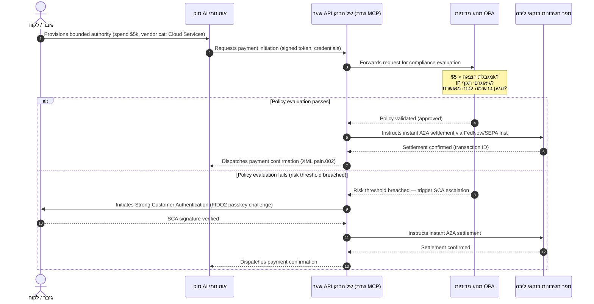

# תחזית התשלומים הגלובלית של 2026: מודל תפעולי, סיכון והכנסה בעולם סוכני, בלתי נראה ובזמן אמת

מחזור התשלומים הגלובלי של 2026 מוגדר על ידי שלושה כוחות מתכנסים — מסחר סוכני, תשלומים מוטמעים בלתי נראים, וביצוע בזמן אמת — היושבים על גבי ספר חשבונות מאוחד בטוקניזציה תחת Project Agorá ומעבר SWIFT לכתובת מובנית מחייב בנובמבר 2026.

<!-- lead-start -->
<aside class="post-lead" aria-label="Article summary">

<strong>TL;DR.</strong> נוף התשלומים של 2026 עבר מהגירת מסרים למודל תפעולי רב-ממדי שבו סיכון והכנסה נקבעים על ידי ביצוע בזמן אמת. הניתוח מסנתז את תחזיות 2026 של J.P. Morgan, Global Payments, HSBC וה-Payments Association לתוכנית תפעולית בעלת ארבעה עמודי תווך לבנקים G-SIB, המכסה מסחר סוכני יזום-מודל, ממשקי API אוצריים פעילים ללא הפסקה, ספרי חשבונות מאוחדים בטוקניזציה תחת BIS Project Agorá, ומועד הסיום של 14/15 בנובמבר 2026 למעבר ה-SWIFT לכתובת מובנית.

<strong>תובנות עיקריות</strong>

<ul class="post-lead-takeaways">
  <li><strong>מסחר סוכני פותח חזית של אחריות מואצלת.</strong> סוכני AI אוטונומיים צפויים לתווך 3-5 טריליון דולר במסחר שנתי עד 2030. בנקים חייבים להגדיר שמירת סף ב-MCP, האצלת SCA תחת PSD3/PSR, ובעלות KYC/AML בתוך שרשראות תשלום רב-סוכניות.</li>
  <li><strong>נזילות פעילה ללא הפסקה היא כעת קו בסיס תפעולי ורגולטורי.</strong> ממשקי API אוצריים 24/7 וחשבונות וירטואליים ממזערים מזומן כלוא ומעלים את רף החוסן. עבור ממשקי API לאוצרות בזמן אמת בעלי חשיבות מערכתית, זמינות חמש תשיעיות (99.999 %) הופכת ליעד הנדסי פנימי שהבנקים מציבים לעצמם כדי להוכיח עמידות ברמת DORA לרגולטורים. DORA עצמה אינה קובעת רף אוניברסלי של חמש תשיעיות; היא מכסה ניהול סיכוני ICT, דיווח אירועים, מבחני עמידות, סיכון צד שלישי ופיקוח על ספקי ICT קריטיים.</li>
  <li><strong>הטוקניזציה התקדמה לספרי חשבונות מאוחדים מוסדרים.</strong> Project Agorá הוא המסגרת הציבורית-פרטית הגדולה ביותר לפיקדונות מוטמעי-טוקן של בנקים מסחריים ולעתודות בנקים מרכזיים. בנקים זקוקים למסע טוקניזציה בן חמישה שלבים, עם טיפול פרודנציאלי מפורש.</li>
  <li><strong>מעבר 14/15 בנובמבר 2026 לכתובת מובנית הוא בעל מועד מחייב.</strong> Swift CBPR+ מסירה את בלוק `<AdrLine>` הבלתי-מובנה החל מ-14 בנובמבר 2026; ספרי הכללים של EPC SEPA מאפשרים כתובת בלתי-מובנית רק עד 15 בנובמבר 2026. שדות כתובת דואר לא מובנים בהודעות CBPR+ ו-SEPA יפעילו דחיות מיידיות. נדרש ממשל נתונים נקי בכל צוותי המוצר, הטכנולוגיה והציות.</li>
</ul>

<strong>לקריאה נוספת:</strong> <a href="https://sebastienrousseau.com/2026-06-23-iso-20022-pain001-programmable-liquidity-autonomic-treasury-2026">מ-Pain.001 לנזילות מתוכנתת: ISO 20022 כמערכת העצבים האוטונומית של האוצר ב-2026</a>, <a href="https://sebastienrousseau.com/2026-06-24-cross-border-iso-20022-open-finance-tokenised-deposits-treasury-2026">חוצה גבולות 2026: ISO 20022, פיננסים פתוחים ופיקדונות מוטמעי-טוקן באוצר תאגידי</a>, <a href="https://sebastienrousseau.com/2026-06-25-quantum-dawn-cib-kyberlib-quantum-resilient-payments-stack-2026">שחר קוונטי ל-CIB: מ-KyberLib למחסנית תשלומים עמידה קוונטית</a>.

</aside>
<!-- lead-end -->

עבור בנקי עסקאות גלובליים, מחזור 2026-2028 הוא חלון מבני. תשתית תשלומים מודרנית אינה עוד שירות מנהלי — היא ליבת אסטרטגיית הטכנולוגיה ברמת בנק. בתוך בנקים G-SIB ובמוסדות אזוריים גדולים, טכנולוגיה, רגולציה וציפיות לקוחות התכנסו למישור תפעולי אחד.

שלושה כוחות מגדירים את המחזור הזה, וכל אחד מהם ממופה ישירות לדאגה ברמת הנהלה.

- **מסחר סוכני** — הפצת ערוצים, עיצוב מוצר, הקצאת אחריות וניהול סיכוני מודל תחת בחינה פיקוחית.
- **תשלומים בלתי נראים** — חוויית לקוח, עם סיכון לאי-תיווך כאשר בנקים נכשלים בהטמעת ספר החשבונות שלהם בחזיתות תאגידיות וב-front-end של סוחרים.
- **ביצוע בזמן אמת** — מהירות הון, עם שינוי נגזר בניהול נזילות, סיכון אשראי, חוסן תפעולי והגנה מפני הונאה.

הסיכון הפיננסי מהותי. הונאה מתרחבת במהירות ובתחכום; מועדי הרגולציה מחייבים; והבנקים שמודרניים באופן יזום את מערכות הליבה שלהם פותחים הזדמנויות הכנסה משמעותיות מעמלות. עלות חוסר המעש היא ההפך: דחיות עסקאות מיידיות, צווארי בקבוק תפעוליים, קנסות רגולטוריים ושחיקת נתח שוק מהירה.

## סולם הוודאות — מה מתוארך, מה מוסדר ומה תחזית

לא כל פריט בדוח הזה נושא את אותה רמת ודאות. השאלה ברמת הדירקטוריון היא אילו דלתאות הן מועדים מחייבים, אילו הן ציפיות פיקוחיות, ואילו הן עדיין תחזיות שוק — כי התשובה משנה את שיחת התקציב.

| קטגוריה | דוגמאות |
| --- | --- |
| **מועדים מחייבים** | Swift CBPR+ מעבר לכתובת מובנית (14 בנובמבר 2026); ספרי הכללים של EPC SEPA (15 בנובמבר 2026) |
| **חובות רגולטוריות** | DORA — סיכוני ICT + מבחני עמידות + פיקוח על צד שלישי (EU); האצלת SCA תחת PSD3/PSR; MRM תחת SR 11-7 + PRA SS1/23 |
| **שינויי שוק בעלי הסתברות גבוהה** | ממשקי API לאוצרות בזמן אמת, הגנת הונאה מבוססת AI, נזילות מבוססת API, הונאה ביומטרית מונעת דיפ-פייק |
| **אופציות אסטרטגיות** | פיקדונות מוטמעי-טוקן, ספרי חשבונות מאוחדים תחת Project Agorá, מסדרונות מסחר סוכני, FX רציף (Wire 365) |
| **תחזיות** | תזרימי מסחר סוכני שנתיים של `$3-$5 trillion` עד 2030 (קו בסיס של McKinsey) |

יש להתייחס לשתי השורות הראשונות כעובדות ציות המניעות שורת תקציב גם אם הבנק לא לוכד את הצד החיובי. יש להתייחס לשתי השורות האחרונות כאופציות אסטרטגיות — בעלות שכנוע גבוה בכיוון, אך שבהן עיתוי הביצוע הוא בחירת דירקטוריון ולא רישום ביומן הרגולטור.

## התכנסות של רשויות תשלומים גלובליות

הדוח הזה מסנתז את תחזיות התשלומים והמסחר של 2026 מארבעה קולות תעשייתיים סמכותיים — [J.P. Morgan Payments](https://www.jpmorgan.com/payments/newsroom/payments-outlook-2026-trends-report-released "J.P. Morgan Payments — Outlook 2026"), [Global Payments](https://investors.globalpayments.com/news-events/press-releases/detail/497/global-payments-releases-its-2026-commerce-and-payment "Global Payments — 2026 Commerce and Payment Trends Report"), HSBC, וה-Payments Association — ומשלש אותם מול [G20 Roadmap for Enhancing Cross-Border Payments](https://www.fsb.org/2026/03/fsb-kicks-off-new-implementation-phase-to-enhance-cross-border-payments-through-public-private-partnership/ "FSB — cross-border payments implementation phase, March 2026").

כל ארגון ניגש למערכת האקולוגית מזווית שוק שונה, אך הממצאים שלהם מתכנסים לשלושה משתנים קבועים.

1. **רכבות תשלום מיידיות מבוססות API הן קו הבסיס.** מודלים מורשתיים של עיבוד אצווה מודרים מתעבורות חוצות גבולות ועתירות ערך; מהירות העסקאות במגזרים אלו מוכתבת על ידי מסרים בזמן אמת הפעילים ללא הפסקה.
2. **AI הוא גם איום וגם הגנה.** כלים גנרטיביים ודיפ-פייקים מרחיבים הונאת עסקאות, ומחייבים הגנות נגד בזמן אמת מבוססות למידת מכונה רב-שכבתית.
3. **טוקניזציה היא תשתית מוכנה לייצור.** ספרי חשבונות מתאחדים כדי לארח התחייבויות מסחריות מוטמעות-טוקן ומטבעות דיגיטליים סיטונאיים של בנקים מרכזיים.

| דוח | קהל יעד עיקרי | מיקוד | עמוד תווך מרכזי | השלכה בנקאית |
| --- | --- | --- | --- | --- |
| **J.P. Morgan Payments** | Corporate treasurers, G-SIBs | Real-time liquidity, fraud | APIs, AI biometrics | Rebuild liquidity, FX, and risk systems for continuous 365-day settlement. |
| **Global Payments** | Merchants, e-commerce | POS evolution, omnichannel | Agentic commerce, frictionless checkout | Build secure, API-gated merchant payment corridors for autonomous AI agents. |
| **HSBC Insights** | Multinational corporates | ERP integrations (SAP/Oracle), real-time cash | Treasury-as-a-Service, cash visibility | Monetise transactional API suites and embed real-time cash ledger reporting at source. |
| **The Payments Association** | Fintechs, payment institutions | Stablecoins, tokenisation, global regulation | Regulated digital assets, policy compliance | Prepare balance sheets for tokenised deposits and navigate PSD3/PSR liability structures. |

ארבע התחזיות מגדירות למעשה את מחסנית התפעול של המגזר הפרטי הפועלת על גבי תשתית המדיניות של G20 במגזר הציבורי, ומתרגמות כוונת מדיניות להחלטות קונקרטיות בנושאי נזילות, טוקניזציה, נתונים ובקרת הונאה בתוך בנקים.

## עמוד תווך 1 — מסחר סוכני ותשלומים בלתי נראים

מסחר סוכני הוא המעבר מקופה click-to-buy מונעת אדם ליזימת עסקה אוטונומית, מונעת-מודל. תחזיות תעשייתיות מתכנסות ל-3-5 טריליון דולר של מסחר שנתי המתווך על ידי סוכנים אוטונומיים עד 2030 — נתח חד-ספרתי נמוך מנפח התשלומים הגלובלי המבוצע ללא אדם הלוחץ על 'קנייה'.

למערכת האקולוגית הקמעונאית והמסחרית יש פער מקביל. רוב ברור של צרכנים מצפים כעת לתשלומים כמעט נטולי חיכוך, אך פחות ממחצית הסוחרים תיעדפו קופה בלחיצה אחת או קטלוגי מוצרים נגישים-API. סוכני AI אינם יכולים לנווט במסכי קופה רב-עמודיים מורשתיים שתוכננו לעיניים אנושיות; הם זקוקים ללחיצות יד API מובנות, מכונה-למכונה.

### עדיפויות בנקאיות והשפעה תפעולית

- **בעלות KYC ו-AML.** בנקים חייבים להגדיר מי מחזיק בהתחייבות הציות בתוך שרשרת עסקאות סוכנית. אם סוכן AI אישי של צרכן מתחיל עסקה דרך קופה סוכנית של סוחר, הבנק חייב לאמת שהסמכות התחומה המקורית קשורה קריפטוגרפית לבעל החשבון הראשי.
- **עיצוב מחדש של אחריות וביטולי עסקאות.** סכמות כרטיסים ורכבות תשלום A2A תוכננו סביב אישור אנושי. כאשר סוכן AI מבצע רכישה שגויה — רכש מלאי תעשייתי שגוי בשל שגיאת פירוש נתונים, למשל — בנקים חייבים להקצות אחריות באופן ברור בין צרכן, ספק סוכן וסוחר.
- **דירוג סיכון של תזרימים סוכניים.** מנועי ניתוב תשלומים חייבים לדרג סיכון של תשלומים סוכניים באופן דינמי, ולהחיל דרישות עתודה גבוהות יותר או שיעורי עמלת מעבר על עסקאות שאינן יזומות-אדם עד שקיים מסלול יציב של היסטוריית סליקה.

### פעולה תחומה וסמכות תחומה

כדי לצמצם "פעולה בלתי תחומה" — סוכן רכש ארגוני המריץ לולאת רכישה רקורסיבית אינסופית עקב תקלת תוכנה — בנקים חייבים לפרוס **שערי API של סמכות תחומה**. השערים אוכפים מגבלות ברמת מדיניות בשלושה ממדים.

1. **מגבלות פיננסיות מדורגות** — הוצאות סוכן המוגבלות לפי גודל עסקה, ערך מצטבר יומי וקטגוריית סוחר.
2. **אמצעי הגנה מודעי-הקשר** — אותות משניים (זמן ביום, מיקום IP, תדירות עסקה) מוערכים לפני שספר החשבונות משחרר כספים.
3. **הסלמת human-in-the-loop** — אישור אנושי חובה המופעל באמצעות אימות לקוח חזק (SCA) תחת PSD3 / PSR בכל פעם שעסקה חורגת מספי סיכון.

רצף ה-Mermaid להלן מציג את ארכיטקטורת היעד שבנקים רבים יזהו כתזרים תשלום סוכני בסמכות תחומה.

### Model Context Protocol (MCP)

כדי לחבר מודלי AI מקומיים לשכבות ביצוע בממשל בנקאי, התעשייה מתקננת סביב [Model Context Protocol (MCP)](https://modelcontextprotocol.io "Model Context Protocol — open standard for LLM tool integration") — פרוטוקול פתוח המאפשר ל-LLMs לקרוא לכלים ו-APIs מוגדרים בבירור וניתנים לביקורת ללא גישה גולמית למערכות ליבה.

עטיפת ממשקי API בנקאיים (יזימת תשלום, בדיקת יתרה, אימות צד) בתוך שרת MCP מרחיקה LLMs מטבלאות מסד נתונים ובקרות root במערכת. המודל מתקשר עם ספר החשבונות רק דרך נקודות קצה מובנות, מבוקרות ומוגבלות בקצב — אבטחה הנאכפת בגבול ביצוע הכלי הסוכני ולא טמונה בתוך המודל.

## עמוד תווך 2 — טרנספורמציית אוצר ונזילות חדשה

מהירות בנקאות העסקאות ב-2026 נקבעת על ידי המעבר מעיבוד אצווה בסוף יום לפעולות אוצר פעילות ללא הפסקה ובזמן אמת. תאגידים רב-לאומיים אינם מקבלים עוד מזומן כלוא — נזילות היושבת ללא תנועה בחשבונות מקומיים בסופי שבוע או בחגים בגלל שמערכות הסליקה סגורות.

### העילה הכלכלית לנזילות בזמן אמת

J.P. Morgan ו-HSBC מדווחים שניהם שתאגידים עם יכולות מתקדמות של מזומן ונתונים בזמן אמת מסוגלים באופן מהותי יותר לעלות על עמיתיהם בצמיחת הכנסה ויעילות הון, בעיקר על ידי הפחתת נזילות כלואה ואופטימיזציה של מחזורי הון חוזר.

כדי ללכוד ערך זה, בנקים מספקים **מוצרי API של Treasury-as-a-Service (TaaS)** המאפשרים ל-ERPs תאגידיים (SAP, Oracle) להתחבר ישירות לספר החשבונות של הבנק.

- **ממשקי API של יתרות בזמן אמת** באמצעות סכמת `camt.052` — מחליפים פרוטוקולי העברת קבצים בדיווח עמדת מזומן מיידי, מונע אירועים.
- **ממשקי API ליזימת תשלום בכמות** באמצעות `pain.001` — ביצוע ישיר straight-through של אצוות תשלומי ספקים מספר ה-ERP.
- **ממשקי API של FX רציפים** — מנועי אוצר נועלים שערי מט"ח אלגוריתמיים בזמן אמת לסליקה חוצה גבולות, ומבטלים סיכון פערי שוק לילה.
- **ממשקי API של חשבונות וירטואליים** — תאגידים יוצרים ומחסלים באופן דינמי אלפי תת-חשבונות להתאמת חייבים אוטומטית והפרדת ספרי חשבונות.

### חוסן תפעולי ו-DORA

הצעת נזילות פעילה ללא הפסקה משנה את פרופיל הסיכון של הבנק. עבור ממשקי API לאוצרות בזמן אמת בעלי חשיבות מערכתית, זמינות חמש תשיעיות (99.999 %) הופכת ליעד הנדסי פנימי שהבנקים מציבים לעצמם כדי להוכיח עמידות ברמת DORA לרגולטורים. DORA עצמה אינה קובעת רף אוניברסלי של חמש תשיעיות; היא מכסה ניהול סיכוני ICT, דיווח אירועים, מבחני עמידות, סיכון צד שלישי ופיקוח על ספקי ICT קריטיים.

תחת [Digital Operational Resilience Act (DORA)](https://eur-lex.europa.eu/legal-content/EN/TXT/?uri=CELEX%3A32022R2554 "Regulation (EU) 2022/2554 — Digital Operational Resilience Act"), זה אינו KPI של IT — זו דרישה רגולטורית מחייבת. רגולטורים מצפים מבנקים להוכיח ששטח ה-API של האוצר בזמן אמת ומסד הנתונים של ספר החשבונות יכולים לספוג מתקפות סייבר חמורות-אך-סבירות, השבתות רשת ושיבושי hyperscaler ללא הפרעה לתשלומים קריטיים או פגיעה בנזילות מערכתית. הדבר דורש ארכיטקטורות מסד נתונים רב-ענן active-active מבוזרות גיאוגרפית, שכבות זיהוי איומים בזמן אמת ו-failover אוטומטי — נראים בקו עלות השינוי, לא רק בתיק הביקורת.

### FX רציף וחדשנות חוצת גבולות

האוצר בזמן אמת אינו יכול לחיות בתוך גבול מטבע יחיד. בנקים G-SIB פורסים תשתית FX רציפה — פלטפורמת [Wire 365](https://www.jpmorgan.com/insights/payments/fx-cross-border/wire-365-global-clearing "J.P. Morgan — Wire 365 global clearing reinvented") של J.P. Morgan מעבדת תשלומים חוצי גבולות והמרות FX בכל יום בשנה, מעבר לשעות RTGS מסורתיות של בנקים מרכזיים. השכבה הזו משתלבת ישירות במערכות פיקדונות מוטמעי-טוקן וספר חשבונות מאוחד הנדונים בעמוד תווך 3.

## עמוד תווך 3 — פיקדונות מוטמעי-טוקן וספר החשבונות המאוחד

הטוקניזציה התקדמה מטייסי הוכחת היתכנות מבודדים לתשתית מוניטרית ברמת בנק בקנה מידה. המיקוד עבר מסטייבלקוינים פרטיים וקריפטו-נכסים ספקולטיביים ל-**פיקדונות מוטמעי-טוקן של בנקים מסחריים** ו-**מטבעות דיגיטליים סיטונאיים של בנקים מרכזיים (wCBDCs)** הפועלים על ספרי חשבונות מאוחדים ניתנים לתכנות.

מסגרת הייחוס היא [Project Agorá](https://www.bis.org/about/bisih/topics/fmis/agora.htm "BIS Project Agorá — tokenisation of wholesale cross-border payments") — שיתוף פעולה ציבורי-פרטי מרכזי המנוהל על ידי BIS ו-IIF, המעורב בו שמונה בנקים מרכזיים ומעל 40 מוסדות פיננסיים פרטיים (לפי עמוד BIS Agorá, עודכן ב-27 במאי 2026). הפרויקט בוחן כיצד פיקדונות מוטמעי-טוקן של בנקים מסחריים משתלבים עם CBDCs סיטונאיים מוטמעי-טוקן על ספר חשבונות משותף ניתן לתכנות כדי לבטל חיכוך סליקה חוצה גבולות, לתאם בדיקות ציות ולאפשר סופיות אטומית 24/7.

### מסע הטוקניזציה בן חמישה שלבים

עבור בנקים G-SIB ובנקים אזוריים גדולים, הטוקניזציה היא מסע מדורג מאופטימיזציה פנימית לאינטראופרביליות בשוק פתוח.

1. **נזילות אוצר פנימית** — טוקניזציה של יתרות מזומן תאגידיות פנימיות (למשל JPM Coin או ספרי חשבונות פרטיים מקבילים של בנקים) כדי לאפשר העברה ונטו חוצה גבולות מיידית 24/7 בין סניפי הבנק עצמו.
2. **מסדרונות רב-בנקיים תחומים** — קונסורציות סגורות ומוסדרות (ארגז החול של Project Agorá) לבחינת סליקה בינבנקאית ומצב ספר חשבונות משותף בין מוסדות נפרדים.
3. **FX רציף ניתן לתכנות** — חוזים חכמים על ספר החשבונות המאוחד מבצעים FX מיידי Payment-versus-Payment (PvP), ומבטלים סיכון סליקה בין אזורי זמן.
4. **נכסי עולם אמיתי (RWAs) מוטמעים-טוקן** — רגל המזומן המוטמעת-טוקן משתלבת עם ניירות ערך, חוב או ספרי סחר מוטמעי-טוקן לסופיות Delivery-versus-Payment (DvP) מיידית, ומקטינה נעילת הון מימים למילישניות.
5. **אינטראופרביליות ציבורית/היברידית מוסדרת** — עוטפי שער מאובטחים מאפשרים לנזילות מוסדית לתקשר בבטחה עם רשתות ציבוריות פתוחות.

### השלכות פרודנציאליות ומאזניות

יש לנווט מזומן מוטמע-טוקן במסגרות פרודנציאליות בזהירות. מפקחים מדגישים שפיקדון מוטמע-טוקן חייב להיות שווה ערך כלכלית לפיקדון מסחרי בנקאי מסורתי — כלומר התחייבות לא מובטחת במאזן הבנק עם אותה כיסוי ביטוח פיקדונות.

מבחינה תפעולית, פיקדונות מוטמעי-טוקן מציגים סיכונים שמודלי לחץ נזילות קלאסיים לא נבנו לדמות. חוזים חכמים מבצעים משיכות מתוכנתות במהירויות ובנפחים שהנחות מורשתיות אינן לוכדות. תחת Basel III, בנקים חייבים להבטיח שמנוע הסיכון יכול לדגם זרימות מזומן ניתנות לתכנות וששפר החשבונות המוטמע-טוקן מתאם נקי עם מערכות RTGS מורשתיות לאורך מחזור הנזילות היומי.

### סטייבלקוינים מול פיקדונות מוטמעי-טוקן — עמדה מנואנסת

סטייבלקוינים פרטיים מגובים-במלואם (USDC וכו') ממשיכים ללכוד נתח שוק בהעברות כספים קמעונאיות חוצות גבולות ובמסחר מבוזר, אך חסרים את יכולת יצירת האשראי וסופיות הסליקה של המערכת הבנקאית המסחרית.

במקום להתחרות על רכבות תשלום קמעונאיות, בנקי עסקאות מבססים משמורת, מנפיקים את מכשירי ההתחייבות המוטמעים-טוקן המוסדרים שלהם, ובונים שערי on-/off-ramp מאובטחים. לקוחות תאגידיים מקבלים גמישות תכנות תוך שמירת ההון בתוך הפרימטר המוסדר.

### שאלות שהדירקטוריון צריך לשאול על כסף מוטמע-טוקן

- **השתתפות בספר חשבונות מאוחד.** מהי מפת הדרכים האסטרטגית הפעילה שלנו להשתתפות ביוזמות סיטונאיות ציבוריות-פרטיות של ספר חשבונות מאוחד כמו Project Agorá?
- **מאזן ודיגום סיכון.** האם מנועי הסיכון ומסגרות הלימות ההון שלנו עדכנו בדיקות לחץ כדי להביא בחשבון את מהירות זרימות הטוקן המופעלות-על-ידי-חוזה-חכם?
- **מקטעי לקוחות מנייעים-ראשוניים.** אילו ממקטעי לקוחות האוצר התאגידי והבנקאות המסחרית שלנו יפיקו תועלת מיידית מסליקת DvP/PvP מוטמעת-טוקן הניתנת לתכנות?

## עמוד תווך 4 — נתונים מובנים והגנה מפני הונאה

ציות תשתית ב-2026 נשלט על ידי **מעבר 14/15 בנובמבר 2026 לכתובת מובנית** שנקבע תחת [SWIFT Standards Release (SR) 2026](https://www.swift.com/standards/iso-20022/removal-unstructured-address "SWIFT — Removal of unstructured address, November 2026"). Swift CBPR+ מסירה את בלוק `<AdrLine>` הבלתי-מובנה החל מ-14 בנובמבר 2026; ספרי הכללים של EPC SEPA מאפשרים כתובת בלתי-מובנית רק עד 15 בנובמבר 2026. מהמועדים הללו, רשתות התשלום CBPR+ ו-SEPA יפסיקו לקבל בלוקי כתובת דואר טקסט חופשי לא מובנים במלואם (`<AdrLine>`) בהודעות תשלום. כל הודעה חוצה גבולות או מקומית הנושאת כתובת לא מובנית במקום שבו צפויים אלמנטים מובנים תתעכב או תידחה על ידי הרשת.

רוב המוסדות יודעים את התאריך. רבים מתייחסים אליו כאל תרגיל מיפוי שטחי בשכבת הממשק. המציאות היא אתגר עמוק יותר של איכות נתונים וממשל נתונים. כדי להימנע משיעורי דחייה קטסטרופליים, פעולות תשלום זקוקות למסגרת ממשל בין-תפקודית ברורה.

- **מוצר ותפעול.** לכידת נתונים במקור. פורטלים דיגיטליים פונים-לקוח, ממשקי onboarding ושדות קלט של ERP תאגידי חייבים לאכוף שדות כתובת מובנים (`<StrtNm>`, `<PstCd>`, `<TwnNm>`, `<Ctry>`) בנקודת יזימת התשלום.
- **טכנולוגיה.** ניתוח, מיפוי, אימות סכמה. מנועי אימות חוסמים קבצים מורשתיים לפני שהם מגיעים לממשק SWIFT. מודלי למידת מכונה הפרוסים מקומית מנתחים בלוקי כתובת לא מובנים מורשתיים לתגיות תואמות-XML תחת `<PstlAdr>`.
- **ציות וסיכון.** סינון סנקציות, ניטור עסקאות ולוגיקת AML מעודכנים לקלוט את שדות ה-XML המובנים — מורידים שיעורי תוצאות חיוביות שווא וחקירות ידניות.

### העילה העסקית לנתונים מובנים

מטופלת כעלות ציות, תוכנית הנתונים המובנים יקרה. מטופלת כמאפשרת הכנסה, היא משלמת על עצמה.

1. **קבלת החלטות אשראי מתקדמת.** נתוני חשבונית, העברת כספים וחייב סופי מובנים מאפשרים לבנקים לבנות תוכניות מימון הון חוזר אוטומטיות ומדויקות וגורם חשבוניות שרשרת אספקה ללקוחות תאגידיים.
2. **התאמת חייבים אוטומטית.** חשיפת מזהי צד וחשבונית מובנים תומכת במוצרי פרימיום של פיוס מזומן ואיגום חשבונות וירטואליים, ומייצרת הכנסת עמלת עסקה חדשה.
3. **אנליטיקה תיכנותית של עסקאות.** בנקים אורזים ומוכרים לוחות מחוונים גרגיריים של אנליטיקת נזילות בזמן אמת ודפוסי רכישה ל-CFOs וגזברים תאגידיים.

### הגנה מפני הונאה בשכבות AI

ככל שמהירויות העסקאות מאיצות לזמן אמת, טכניקות הונאה התרחבו. [דוח הונאת זהויות 2026 של Entrust](https://www.entrust.com/resources/reports/identity-fraud-report "Entrust 2026 Identity Fraud Report") ממקם דיפ-פייקים כ-**אחד מכל חמישה ניסיונות הונאה ביומטרית**; ניתוח קודם של Entrust מיקם דיפ-פייקים ספציפית ב-**40 % מניסיונות ההונאה הביומטרית בווידאו**. כך או כך, מדיה סינתטית משמשת בהיקף הולך וגדל לעקוף בקרות זיהוי קול ופנים ב-onboarding ובתזרימי תשלום.

ההגנה היא **מודל הונאת AI בן שלוש שכבות**.

1. **שכבת זהות.** מפתחות גישה [FIDO2](https://fidoalliance.org/fido2/ "FIDO Alliance — FIDO2 specification") מאומתים ביומטרית, חיבור מכשיר חומרה חתום קריפטוגרפית, וארנקי זהות דיגיטלית מבוזרים לאבטחת גישה לתשלום.
2. **שכבה התנהגותית.** ביומטריה התנהגותית רציפה — קצב ניווט סשן, קצב הקלדה, כיוון מכשיר — לזיהוי ביצוע בוט אוטומטי או ניסיונות חטיפת סשן.
3. **שכבת עסקאות.** השדות המובנים של ISO 20022 מזינים מנועי סיכון בזמן אמת מבוססי למידת מכונה, מצליבים מטא-נתוני עסקה עם מודיעין קונסורציום ברמת רשת משותפת לזיהוי עסקאות חשודות בתוך מילישניות מיזימה.

כדי לספק את המפקחים, מודלי ה-AI של שכבת העסקאות משלבים **פרמטרים מחמירים של יכולת הסבר** ופועלים תחת תוכנית ייעודית של ניהול סיכוני מודל (MRM). רגולטורים מצפים מבנקים להסביר את נקודות הנתונים והלוגיקה האלגוריתמית הספציפיות שהפעילו חסימה אוטומטית או התראת הונאה, בהתאם ל-[US Federal Reserve SR 11-7](https://www.federalreserve.gov/frrs/guidance/supervisory-guidance-on-model-risk-management.htm "US Federal Reserve — Supervisory Guidance on Model Risk Management, SR 11-7") ול-[PRA SS1/23](https://www.bankofengland.co.uk/prudential-regulation/publication/2023/may/model-risk-management-principles-for-banks-ss "Bank of England PRA SS1/23 — Model Risk Management principles for banks") של בנק אנגליה.

## אג'נדת חדר הדירקטוריון ל-2026-2028

לביצוע ארבעת עמודי התווך, גופי הניהול של בנקים G-SIB ובנקים אזוריים צריכים לארגן השקעות תפעוליות וטכנולוגיות לאורך מפת דרכים ברורה בת שלושה אופקים.

### אופק 1 — ציות מיידי וחיזוק ליבה (0-12 חודשים)

- **מיקוד.** תקנון איכות נתוני ISO 20022 והבטחת מסלולי עסקה בזמן אמת בסיסיים.
- **מדד הצלחה (KPI).** אפס דחיות כתובת לא מובנית ב-SWIFT וב-SEPA לאחר מעבר 14/15 בנובמבר 2026.
- **בעלים מנהלי.** מנהל תפעולי ראשי / ראש פעולות תשלום.
- **סוג תפוקה.** מהלך ללא חרטות. עדכוני סכמת מסד נתונים ליבה ומנוע אימות SWIFT SR 2026.

### אופק 2 — אוטומציה ואמצעי הגנה סוכניים (12-24 חודשים)

- **מיקוד.** שערי API סוכניים תחומים וארכיטקטורת הגנת הונאה רציפה.
- **מדד הצלחה (KPI).** 100 % מעסקאות ה-API מכונה-למכונה והיזומות-AI מאומתות באמצעות חיבור חומרה FIDO2 ומנועי מדיניות של סמכות תחומה.
- **בעלים מנהלי.** מנהל מערכות מידע ראשי / מנהל סיכונים ראשי.
- **סוג תפוקה.** מהלך ללא חרטות (הגנת הונאה) בתוספת אופציה אסטרטגית (מסחר סוכני). פריסת MCP וה-AI ההונאתי בן שלוש השכבות.

### אופק 3 — טוקניזציית פלטפורמה וספרי חשבונות מאוחדים (24-36 חודשים)

- **מיקוד.** מעבר נכסי אוצר לפיקדונות מוטמעי-טוקן והשתתפות בספרי חשבונות חוצי גבולות משותפים.
- **מדד הצלחה (KPI).** לפחות 15 % מנפח סליקת האוצר התאגידי עתיר הערך מעובד באופן ילידי באמצעות מכשירי פיקדונות מוטמעי-טוקן או הסדרי ספר חשבונות מאוחד (למשל מסדרונות Project Agorá).
- **בעלים מנהלי.** גזבר קבוצה / ראש בנקאות עסקאות.
- **סוג תפוקה.** אופציה אסטרטגית. תשתית ספר חשבונות ניתן לתכנות, כללי נזילות בחוזים חכמים, מתאמי סליקת DvP/PvP.

## מה לעשות ביום שני בבוקר — רשימה בת שישה סעיפים לבנקים

מפת הדרכים בת שלושת האופקים היא תוכנית המחזור. רשימת הביקורת להלן היא מה ש-CIO, COO או ראש בנקאות עסקאות יכולים להניח על השולחן עד סוף שבוע העבודה הבא, ללא קשר לרמת הבשלות של שאר התוכנית.

1. **למפות חשיפה לכתובת בלתי-מובנית** לפי ערוץ וסוג הודעה. כל מסלול קובץ מורשת, כל נקודת קצה מורשת של API, כל ERP תאגידי שעדיין פולט `<AdrLine>` בטקסט חופשי. תפוקה: ספירה, בעלים ומועד תיקון לכל מקור.
2. **לבסס טקסונומיית סיכון של תשלום סוכני.** לסווג זרימות שאינן יזומות-אדם לפי שיטת יזימה (סוכן צרכן, סוכן סוחר, סוכן רכש תאגידי), סוג צד נגדי ורכבת תשלום. תפוקה: טקסונומיה בעמוד אחד וכרטיס למנוע הניתוב.
3. **להגדיר מגבלות מדיניות של סמכות מואצלת לתשלומים יזומי-AI.** מגבלות מדורגות לפי גודל עסקה, קטגוריית סוחר וגיאוגרפיה. תפוקה: טיוטת מפרט מדיניות-כקוד שמנוע ה-OPA יכול לאכוף.
4. **למפות ממשקי API לאוצרות קריטיים-DORA ותלויות צד שלישי.** אילו ממשקי API נמצאים בתרחישי חמורים-אך-סבירים; באילו צדדים שלישיים הם תלויים; אילו חוזים כבר עומדים ב-DORA Article 28. תפוקה: שורת רישום צד שלישי קריטי-ICT לכל API.
5. **לזהות שני מקרי שימוש לפיקדונות מוטמעי-טוקן עם ערך אוצרי מדיד.** קיזוז פנימי בין סניפים ומסדרון יחיד צמוד ל-Project Agorá הם השניים הראשונים הריאליסטיים. תפוקה: עילה עסקית מתומחרת לכל אחד, עם בעלים ומועד החלטה של 90 יום.
6. **ליצור מסגרת בקרה לסיכון מודל עבור הונאה והחלטות סוכניות.** למפות כל מודל ML במסלולי ההונאה והתשלום הסוכני לציפיות SR 11-7 / PRA SS1/23: מטרה מתועדת, שושלת נתונים, יכולת הסבר, ניטור, מסלול עקיפה. תפוקה: מטריצת בקרת MRM בעמוד אחד לכל מודל.

תכלית הרשימה אינה שמשהו בה חדשני. תכליתה היא שהיא קטנה דיה כדי להתחיל השבוע, נצפית דיה כדי להיות מעקבת בוועדת ההנהלה הבאה, ומתואמת מבנית עם ארבעת עמודי התווך כך שהעבודה המוקדמת מזינה את התוכנית במקום להתחרות בה.

## שאלות נפוצות

**האם מסחר סוכני באמת יגיע ל-3-5 טריליון דולר עד 2030?**
קו הבסיס של McKinsey מצביע על 5 טריליון דולר במכירות מסחר סוכני עד 2030, עם טווח תחזיות עצמאיות המתקבצות בין 3 טריליון ל-5 טריליון דולר. השונות משקפת באיזה מידה סוחרים שולחים ממשקי API לקופה הניתנים לקריאה במכונה ובאיזו מהירות בנקים מאפשרים לסוכנים לבצע עסקאות תחת האצלת SCA — צוואר הבקבוק נמצא בצד הבנק והסוחר, לא בצד יכולת הסוכן.

**האם מעבר ה-SWIFT של 14/15 בנובמבר 2026 חל גם על תזרימי SEPA מקומיים?**
כן. דרישת הכתובת המובנית חלה על CBPR+ חוצה גבולות ועל הודעות תשלום SEPA. בנקים המפעילים את שתי רכבות התשלום זקוקים לסכמת כתובת קנונית יחידה במעלה הזרם של ממשק ה-SWIFT, לא לשני מיפויים מקבילים.

**האם פיקדון מוטמע-טוקן זהה לסטייבלקוין?**
לא. פיקדון מוטמע-טוקן הוא התחייבות לא מובטחת במאזן של בנק מוסדר, עם אותו כיסוי ביטוח פיקדונות כמו פיקדון מסורתי. סטייבלקוין הוא בדרך כלל מכשיר מגובה-במלואו המונפק על ידי גוף שאינו בנק, ללא יכולת יצירת אשראי. עיצוב Project Agorá מניח שפיקדונות מוטמעי-טוקן יושבים לצד CBDCs סיטונאיים על ספר חשבונות משותף ניתן לתכנות; סטייבלקוינים אינם מופיעים ברגל הסליקה הסיטונאית.

**כיצד Project Agorá קשור לפיילוטי wCBDC קיימים?**
Agorá הוא המסגרת המשלבת. ניסויי wCBDC לאומיים מכסים את רגל הכסף של הבנק המרכזי; Agorá מביא פיקדונות מסחריים מוטמעי-טוקן לאותו ספר חשבונות ניתן לתכנות כך שהסליקה החוצה גבולות אטומית בין שני סוגי הכסף. שבעת הבנקים המרכזיים המשתתפים ויותר מ-40 מוסדות פרטיים הופכים אותו לזירת העיצוב הציבורית-פרטית הגדולה ביותר לארכיטקטורת כסף סיטונאי מוטמע-טוקן.

**מהי עמדת הציות המינימלית של DORA לממשק API של TaaS?**
פריסת active-active מבוזרת גיאוגרפית, תרחישי סייבר חמורים-אך-סבירים מתועדים עם בעלים נקובים תחת SM&CR (UK), ו-failover בדוק שאינו מפריע לתשלומים קריטיים. בלי זה, מוצר ה-TaaS הוא חבות רגולטורית לפני שהוא קו הכנסה.

## הפניות

- Bank for International Settlements (BIS) Innovation Hub. (2026). *Project Agorá: exploring tokenisation of wholesale cross-border payments*. [BIS Project Agorá](https://www.bis.org/about/bisih/topics/fmis/agora.htm).
- Deutsche Bank. (2026). *Digital Money: a perspective on stablecoins, tokenised deposits and CBDCs*. [Deutsche Bank Flow](https://flow.db.com/publications/flow-white-papers-and-guides/digital-money-a-perspective-on-stablecoins-tokenised-deposits-and-cbdcs).
- European Parliament and Council. (2022). *Regulation (EU) 2022/2554 on Digital Operational Resilience (DORA)*. [DORA Regulation](https://eur-lex.europa.eu/legal-content/EN/TXT/?uri=CELEX%3A32022R2554).
- Financial Stability Board. (2026). *FSB kicks off new implementation phase to enhance cross-border payments*. [FSB statement](https://www.fsb.org/2026/03/fsb-kicks-off-new-implementation-phase-to-enhance-cross-border-payments-through-public-private-partnership/).
- Global Payments. (2025). *2026 Commerce and Payment Trends Report — press release*. [Global Payments press release](https://investors.globalpayments.com/news-events/press-releases/detail/497/global-payments-releases-its-2026-commerce-and-payment).
- J.P. Morgan Payments. (2026). *Payments Outlook 2026 Trends Report Released*. [J.P. Morgan Newsroom](https://www.jpmorgan.com/payments/newsroom/payments-outlook-2026-trends-report-released).
- J.P. Morgan Insights. (2026). *5 Payment Trends to Watch for in 2026*. [J.P. Morgan Trends](https://www.jpmorgan.com/insights/payments/trends-innovation/five-payment-trends-in-2026).
- J.P. Morgan FX & Cross-Border. (2026). *Wire 365: Global Clearing Reinvented*. [J.P. Morgan FX Wire 365](https://www.jpmorgan.com/insights/payments/fx-cross-border/wire-365-global-clearing).
- SWIFT. (2026). *ISO 20022 milestone for November 2026: unstructured addresses to be removed*. [SWIFT ISO 20022 Milestone](https://www.swift.com/news-events/news/iso-20022-milestone-november-2026-unstructured-addresses-be-removed).
- SWIFT Standards. (2026). *Removal of unstructured address*. [SWIFT Standards](https://www.swift.com/standards/iso-20022/removal-unstructured-address).
- Bank of England. (2023). *Supervisory Statement (SS1/23) — Model Risk Management principles for banks*. [Bank of England PRA SS1/23](https://www.bankofengland.co.uk/prudential-regulation/publication/2023/may/model-risk-management-principles-for-banks-ss).
- US Federal Reserve. (2011). *Supervisory Guidance on Model Risk Management (SR 11-7)*. [SR 11-7](https://www.federalreserve.gov/frrs/guidance/supervisory-guidance-on-model-risk-management.htm).
- McKinsey & Company. (2025). *McKinsey forecast: $5 trillion in agentic commerce sales by 2030* (via Digital Commerce 360). [McKinsey agentic forecast](https://www.digitalcommerce360.com/2025/10/20/mckinsey-forecast-5-trillion-agentic-commerce-sales-2030/).
- HSBC Business. (2026). *HSBC Business Insights*. [HSBC Insights](https://www.business.hsbc.com/en-gb/insights).
- Bright Defense. (2026). *Deepfake Statistics: A Growing Security Concern*. [Deepfake fraud statistics](https://www.brightdefense.com/resources/deepfake-statistics/).
- European Banking Authority. (2019). *Guidelines on outsourcing arrangements (EBA/GL/2019/02)*. [EBA Outsourcing Guidelines](https://www.eba.europa.eu/regulation-and-policy/internal-governance/guidelines-on-outsourcing-arrangements).

<!-- enrich-start -->
<aside class="author-card" aria-label="About the author"><strong class="author-card-name"><a href="/about/index.html">Sebastien Rousseau</a></strong>טכנולוג בנקאי בכיר הכותב על AI יישומי, מהגרת ISO 20022, קריפטוגרפיה פוסט-קוונטית לשירותים פיננסיים והטרנספורמציה המבנית של תשלומים סיטונאיים.מעל 20 שנה ב-HSBC Commercial &amp; Investment Bank, PayPal, Barclays, Shazam, AKQA, Virgin Group. <a href="/about/index.html">פרופיל מלא</a> &middot; <a href="https://www.linkedin.com/in/sebastienrousseau/" rel="external noopener">LinkedIn</a> &middot; <a href="https://github.com/sebastienrousseau" rel="external noopener">GitHub</a></aside>

נסקר לאחרונה <time datetime="2026-06-25">2026-06-25</time>.

<!-- enrich-end -->
