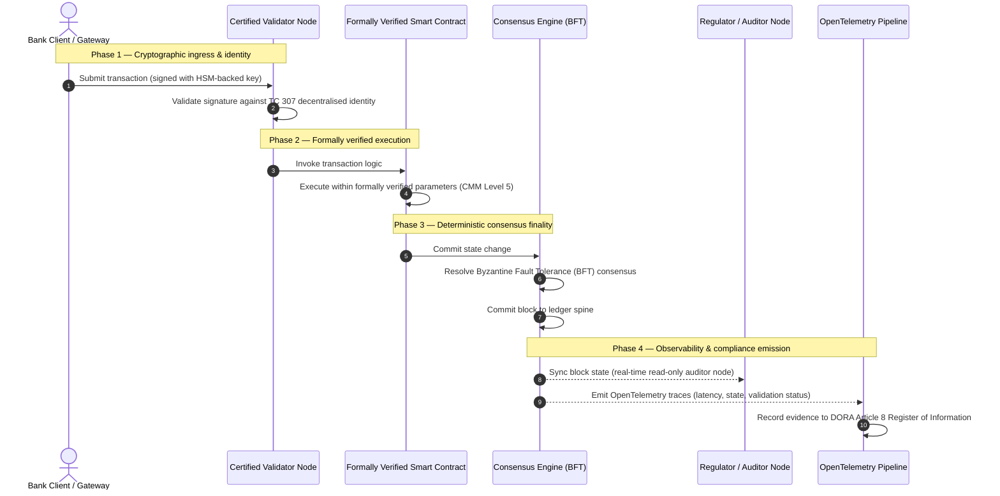

# מהראיה לאמת: מדוע בלוקצ'יינים מוסמכים יגדירו את העידן הבא של האמון הבנקאי

## תקציר אסטרטגי (העיקר)

הבנקאות הסיטונאית והעסקאות הגלובליות ניצבות ב-2026 בנקודת מפנה היסטורית. ככל שהשירותים הפיננסיים עוברים לרשתות סליקה דיגיטליות מלידה ובזמן אמת, והבינה המלאכותית מכניסה אי-דטרמיניזם הסתברותי, מודלי ההבטחה המסורתיים — האנלוגיים והרטרוספקטיביים (כגון ביקורות סטטיות מבוססות ישות) — כבר אינם עומדים בדרישות המודרניות של ניהול סיכונים וחובות נאמנות.

הוועדה הטכנית ISO/IEC TC 307 ביססה בסיס מתוקנן לטכנולוגיות פנקס מבוזר. אולם אימוץ מוסדי אמיתי מחייב מעבר מהנחיה תיאורית להבטחת בלוקצ'יין מנחה הניתנת להסמכה עצמאית. באמצעות ניקוד ממשל הפנקס, שלמות הקונצנזוס, בטיחות החוזים החכמים וזריזות ההצפנה מול מודל בגרות יכולות (CMM) קפדני בן חמש רמות, בנקים יכולים לעבור מהנחות מקוטעות ותלויות-ספק לאמת פיננסית ניתנת להסמכה ולביקורת בידי הדירקטוריון.

## תובנות מרכזיות

* **פער החיכוך הנאמנותי**: כיום אנו יודעים להסמיך את הבנק (Basel III), את הענן (ISO 27001) ואת מערכות ממשל הבינה המלאכותית (ISO 42001), אך עדיין איננו יודעים להסמיך את הפנקס המבוזר שקובע יותר ויותר מהי אמת. אסימטריה זו היא פגיעות תפעולית מרכזית.  
* **DORA אוכפת אחריות נאמנותית ישירה**: על פי סעיף 5 ל-DORA, דירקטוריוני הבנקים נושאים באחריות אישית ישירה ובלתי ניתנת להאצלה לחוסן התפעולי של כל פריסות הצד השלישי והפנקסים, עם סנקציות אישיות חמורות במסגרת משטר SM&CR על כשלים.  
* **עמוד השדרה של ביקורת הבינה המלאכותית**: היכן שלמידת מכונה מייצרת תוצאות הסתברותיות בלתי ניתנות לשחזור, בלוקצ'יין מוסמך מספק לכידת מצב דטרמיניסטית. תיעוד גרסאות מודלים, קלטים והחלטות אימות על השרשרת עומד ב-ISO 42001 ובתקני ניהול סיכון המודל.  
* **מדד הבלוקצ'יינים המוסמכים**: מדד זה מפרמל ממשל, קונצנזוס, חוזים חכמים ותצפיתיות לכרטיס ניקוד ניתן לאימות ומוכן לביקורת בסולם CMM מ-0 עד 5, ומתרגם מדדים הנדסיים להצהרות תיאבון סיכון מאושרות בידי הדירקטוריון.

## 01. פער החיכוך הנאמנותי בבנקאות הדיגיטלית

בבנקאות הקלאסית, האמון הוא יחסי, מוסדי ורטרוספקטיבי. הוא נשען על מבקרים חיצוניים עצמאיים הבוחנים את המצב הפיננסי בנקודות זמן קבועות ומיישבים פערים בין ממגורות פנקסים דו-צדדיות. בשווקים המונעים בידי API ובזמן אמת של 2026, מודל זה מכניס זמני השהיה אוסרניים וסיכונים מבניים.

כאשר עסקאות נסלקות מיידית, מאגרי נזילות תוך-יומיים מנוהלים דינמית בידי שערי API, ובעלות על נכסים מטוקנת על פני פנקסים משותפים, ביקורות רטרוספקטיביות הופכות לתרגילים פורנזיים במקום לבקרות מונעות. נאמנים אינם יכולים עוד להסתמך רק על הסמכת הישות המשפטית. עליהם להסמיך את המצע הדיגיטלי עצמו.

כיום בנקים פועלים תחת אסימטריה ארכיטקטונית זועקת:

1. **תשתית ענן מוסמכת**: צמתי חומרה, מכולות מווירטולות ומרכזי נתונים פיזיים מאומתים מול בקרות ISO/IEC 27001 ו-SOC 2 Type II.  
2. **תהליכי ניהול מוסמכים**: מדיניות סיכון תפעולי, תוכניות המשכיות עסקית ופריסות אלגוריתמיות נשלטות במסגרות סיכון קפדניות.  
3. **מנועי פנקס לא מוסמכים**: מנגנוני הקונצנזוס המבוזר, שרשראות האספקה של צמתי האימות, גבולות החוזים החכמים ומודלי ממשל הרשת נותרים להנחות לא מוסמכות, מותאמות אישית או ספציפיות לקונסורציום.

אסימטריה זו היא נקודת כשל קריטית. בנק יכול להריץ יישום מאומת בתוך מכולת ענן מאובטחת ומוסמכת ISO 27001, אך אם מכולה זו כותבת לפנקס מבוזר עם בקרת מאמתים מרוכזת, פרמטרי קונצנזוס פגיעים או חוזים חכמים לא מבוקרים, שלמות העסקה נפגעת. כדי לגשר על פער זה, מנוע הפנקס עצמו חייב להפוך לאובייקט הבטחה הניתן להסמכה.

## 02. בסיס התִקנון ISO/IEC TC 307

העבודה היסודית הנחוצה לתקנון פנקסים מבוזרים מתבצעת בידי הוועדה הטכנית ISO/IEC TC 307 (טכנולוגיות בלוקצ'יין ופנקס מבוזר). במקום להתייחס לבלוקצ'יין כפרוטוקול טכני מבודד, TC 307 ניגשת אליו כאל תשתית אמון מוסדית, ומארגנת את עבודתה סביב חמישה עמודי תווך מרכזיים:

1. **טקסונומיה ואוצר מילים (ISO 22739)**: מבססת נומנקלטורה משותפת, ומבטיחה הגדרות משפטיות ותפעוליות עקביות בין תחומי שיפוט, סכימות פיננסיות ומוסדות.  
2. **ארכיטקטורת ייחוס (ISO/TR 23245)**: מגדירה את הגבולות, השכבות, זרימות הנתונים והרכיבים הפונקציונליים של מערכת פנקס מבוזר תואמת.  
3. **אבטחה, פרטיות וחוזים חכמים (ISO/TR 23244 / ISO 23613)**: מבססת הנחיות אבטחה בסיסיות למערכות נכסים דיגיטליים ומפרטת שיטות מיטביות למיתון פגיעויות חוזים חכמים ולממשל מחזור חייהם.  
4. **מסגרות יכולת פעולה הדדית**: מטפלת במנגנוני חילופי הנתונים והנכסים בין רשתות פנקס הטרוגניות, ומונעת היווצרות ממגורות מטוקנות מבודדות.  
5. **זהות מבוזרת ועוגני אמון**: משלבת מזהים קריפטוגרפיים מבוססי-פנקס עם תשתיות מפתח ציבורי פורמליות (PKI) ומרשמים מורשי-מדינה.

בסך הכול, TC 307 מסמנת את מעבר ה-DLT מבחירה הנדסית מותאמת אישית לדיסציפלינה ארכיטקטונית מתוקננת. עם זאת, TC 307 נותרת תיאורית בעיקרה. היא מגדירה כיצד נראית מצוינות (הנחיה), אך אינה מספקת את פרוטוקול האימות המנחה (הבטחה) שקציני סיכון ומפקחים זקוקים לו כדי לאשר פריסות ייצור של פונקציות קריטיות או חשובות (CIF).

## 03. הנחיה מול הבטחה: ההבחנה הנאמנותית

משתתפי השוק הפיננסי אינם פורסים טכנולוגיה משום שהיא חדשנית או אלגנטית; הם פורסים אותה כאשר ניתן לנהל, לבקר, להגן ולהתאים אותה לדרישות עתודות ההון. לכן התִקנון בבנקאות מתפרק באופן טבעי לשתי שכבות:

* **הנחיה (המסגרת)**: משרטטת שיטות מיטביות, יעדי ייחוס והנחיות ארכיטקטוניות (למשל ISO/IEC TC 307, מסגרות NIST).  
* **הבטחה (ההוכחה)**: מספקת ראיות עצמאיות, מתמשכות וניתנות לאימות בידי צד שלישי שהמסגרת מיושמת ופועלת כמתוכנן (למשל הסמכת ISO 27001, ביקורות SOC 2, בחינות רגולטוריות).

הסתמכות על קונצנזוס פנקס לא מוסמך תוך הסמכת תשתית הענן היא פרצה רגולטורית קריטית. בלוקצ'יין "בלתי ניתן לשינוי" אינו בהכרח "מהימן מוסדית". אי-שינויות מבטיחה רק שהנתונים שהוזנו נותרים ללא שינוי; היא אינה מאמתת אם צמתי האימות מאובטחים, אם פרוטוקול הקונצנזוס עמיד בפני קנוניה, אם לוגיקת החוזים החכמים תקינה מתמטית, או אם ניהול המפתחות הקריפטוגרפיים עומד במנדטים הפוסט-קוונטיים.

כדי לסגור פער זה, מדד הבלוקצ'יינים המוסמכים 2026 מפרמל דרישות אלו למודל בגרות יכולות (CMM) בר-כימות, הממופה לרגולציות הבנקאיות הגלובליות.

## 04. מדד הבלוקצ'יינים המוסמכים 2026

כדי לאפשר להנהלה הבכירה להעריך ולהסמיך את פלטפורמות הפנקס שלה, מדד זה מבנה את תשתית הפנקס המבוזר לחמש שכבות תפעוליות ניתנות לביקורת, המנוקדות בסולם CMM מ-0 עד 5.

## טבלה 1: ארכיטקטורת מדד הבלוקצ'יינים המוסמכים

| שכבת המדד | רמת בגרות (CMM) | מדד טכני ותפעולי | ייחוס בקרה רגולטורי / נאמנותי |
| ---- | ---- | ---- | ---- |
| **ממשל פנקס** | **רמה 0**: קונסורציום אד-הוק**רמה 3**: בדיקה וסבב מאמתים אוטומטיים**רמה 5**: עיגון זהות קריפטוגרפי מבוזר רב-משתתפים | % צמתי האימות המופעלים בידי ישויות פיננסיות שנבדקו; זמן פתרון ממוצע למחלוקות מאמתים; פיזור גיאוגרפי של צמתים | **DORA סעיף 5** (ממשל וארגון); **CPMI-IOSCO PFMI עיקרון 2** (ממשל) ו**עיקרון 3** (מסגרת לניהול מקיף של סיכונים) |
| **שלמות קונצנזוס** | **רמה 0**: צומת יחיד או PoW אטום**רמה 3**: BFT מבוקר עם סופיות דטרמיניסטית**רמה 5**: קונצנזוס רב-תחומי, מאומת פורמלית, עם ניטור השהיה מתמשך | השהיית קונצנזוס מרבית נסבלת; סף עמידות לקנוניה; SLA זמינות בעת פיצול צמתים מדומה | **DORA סעיף 6** (מסגרת ניהול סיכוני ICT); **CPMI-IOSCO PFMI עיקרון 8** (סופיות סליקה) |
| **זהות והצפנה** | **רמה 0**: מפתחות RSA / ECDSA חלשים**רמה 3**: חתימה מרובה עם ניהול מפתחות מגובה HSM**רמה 5**: מפתחות היברידיים בטוחים קוונטית (FIPS 203 ML-KEM) ושערי פרטיות באפס ידע | % עסקאות הפנקס החתומות במפתחות מגובי HSM; ציון מוכנות למעבר PQC; השהיית הוכחות ZK | **NIST FIPS 203 / 204**; **ISO/IEC 27001** (ניהול אבטחת מידע) |
| **הבטחת חוזים חכמים** | **רמה 0**: סקריפטי Solidity לא מבוקרים**רמה 3**: אימות מהדר אוטומטי וביקורת חיצונית**רמה 5**: חוזים חכמים בלתי ניתנים לשינוי ומאומתים פורמלית עם שדרוגי מפסק | % החוזים החכמים עם אימות פורמלי מתמטי; מספר אזהרות מהדר; כיסוי סריקות פגיעויות | **הנחיות EBA למיקור חוץ** (סעיפים 81, 113-117); **DORA סעיף 30** (סעיפים חוזיים מינימליים) |
| **ביקורת ותצפיתיות** | **רמה 0**: איסוף לוגים ידני**רמה 3**: עקבות OTel מובנות וצמתי מבקר לקריאה בלבד**רמה 5**: התאמה אוטומטית ומתמשכת למרשם סעיף 8 | % העסקאות המכוסות בעקבות OpenTelemetry; השהיה מאישור בלוק לסנכרון צומת מבקר | **BCBS 239** (צבירת נתוני סיכון); **DORA סעיף 8** (מרשם מידע / סכימות ITS) |

## טבלה 2: אותות אמון מרכזיים הממופים לתקנים בנקאיים גלובליים

| אות / מדד השוואה | מדד | השפעה על פלטפורמות בנקאיות | מקור רגולטורי |
| ---- | ---- | ---- | ---- |
| **התקדמות ISO/IEC TC 307** | מעבר מדוחות טכניים ISO/TR לסכמות הסמכה פורמליות | מבסס את המסגרת המתוקננת הראשונה להסמכת מנועי פנקס מבוזר | **ISO/IEC JTC 1 / SC 44** (טכנולוגיות פנקס מבוזר) |
| **שלב אב-הטיפוס של פרויקט Agorá** | למעלה מ-40 בנקים מסחריים משתתפים; בדיקת פנקס מאוחד לפיקדונות מטוקנים | מעביר סליקה חוצת-גבולות מהעברת הודעות (SWIFT) לסליקה אטומית מטוקנת | **מרכז החדשנות של בנק ההסדרים הבינלאומיים (BIS)** |
| **ביקורת צד שלישי DORA סעיף 30** | 100% מספקי הצמתים ומארחי התשתית מבוקרים לפי קריטריוני אבטחה | מבטל "צמתי אימות צל"; מחייב שקיפות מלאה של שרשרת האספקה | **רשויות הפיקוח האירופיות (ESA)** |
| **ISO/IEC 42001 (ממשל בינה מלאכותית)** | לוגי מודל ואימון של בינה מלאכותית הפכו לבלתי ניתנים לשינוי קריפטוגרפית על השרשרת | מנצל את הבלוקצ'יין כמרשם ראיות בלתי ניתן לשינוי ("עמוד שדרה של ביקורת") ללמידת מכונה | **ISO/IEC 42001:2023** (טכנולוגיית מידע — בינה מלאכותית) |
| **הלימות הון Basel III** | הפחתת כריות הון לסיכון תפעולי בהתבסס על הפחתת מורכבות מתועדת | מסגרות סיכון תפעולי מתוקננות מזכות ישירות את חוסן הפנקס המאומת | **ועדת בזל לפיקוח בנקאי (BCBS)** |

## 05. "עמוד השדרה של הביקורת" של הבינה המלאכותית: אינטליגנציה הסתברותית על תשתית דטרמיניסטית

אחד התפקידים האסטרטגיים החזקים ביותר של בלוקצ'יין מוסמך ב-2026 הוא לשמש כ**"עמוד שדרה של ביקורת"** לפריסות בינה מלאכותית. מערכות פיננסיות מודרניות הופכות הסתברותיות יותר ויותר. ניקוד אשראי, זיהוי הונאות בזמן אמת, מסחר אלגוריתמי ואינטראקציות לקוח אוטונומיות מונעים בידי מודלי למידת מכונה המתפתחים, נסחפים ומסתגלים לאורך זמן. מודלים אלו אינם דטרמיניסטיים: בהינתן אותו קלט בשני זמנים שונים, הם עשויים להניב פלטים שונים בשל משקלים דינמיים ואימון מתמשך.

אי-דטרמיניזם זה מציב אתגר ממשל עמוק תחת **ISO/IEC 42001 (ממשל בינה מלאכותית)** ותקני ניהול סיכון המודל (MRM) (כגון **SR 11-7 של הבנק הפדרלי של ארה"ב** ו**SS1/23 של ה-PRA הבריטי**): *כיצד מבקרים, מסבירים ומגנים על החלטות שאינן ניתנות לשחזור מדויק?*

פנקס מבוזר מוסמך מספק את משקל הנגד הדטרמיניסטי. היכן שמודלי בינה מלאכותית פועלים הסתברותית, הבלוקצ'יין המוסמך מתעד את הפרמטרים שלהם דטרמיניסטית, ומבסס עמוד שדרה ראייתי בלתי ניתן לשינוי:

* **גרסאות מודל ועיגון משקלים**: כל גרסת מודל שנפרסה, המשקלים המשויכים לה וסכומי הביקורת של נתוני האימון שלה מגובבים ונכתבים לפנקס בזמן הבנייה, בעמידה בדרישות שרשרת האספקה **SLSA Level 3**.  
* **תיעוד קלט הקשרי**: כאשר מודל בינה מלאכותית מבצע החלטה קריטית (למשל אישור הלוואה או סימון עסקה), הקלטים ההקשריים המדויקים וגיבובי המודל נכתבים לפנקס, ויוצרים היסטוריה עמידה בפני חבלה.  
* **יכולת ביקורת ללא גישה לקוד**: אם רגולטור שואל "מדוע המודל שלכם דחה בקשת אשראי זו ב-3 ביוני?", הבנק אינו נדרש לחשוף את הקוד הקנייני שלו ואף לא לנסות לשחזר את מצב המודל המדויק. הוא מציג את הרשומה החתומה קריפטוגרפית על השרשרת של הקלטים, המשקלים ומצב האימות.

בעיגון ההחלטות ההסתברותיות של מודלי למידת מכונה לקונצנזוס הדטרמיניסטי של בלוקצ'יין מוסמך, המוסד יוצר ציר זמן של פעולות אוטומטיות הניתן להגנה, לשחזור ולאימות עצמאי.

## 06. הדמיית צינור הקונצנזוס-לביקורת המוסמך

דיאגרמת הרצף הבאה ממחישה את מחזור החיים של עסקה העוברת דרך פלטפורמת בלוקצ'יין מוסמכת, ומראה כיצד שערי אימות, שלמות קונצנזוס, ביצוע חוזים חכמים ופליטת טלמטריה משתלבים לייצור ראיות רגולטוריות מוכנות לדירקטוריון:

הנתיב הקריטי של רצף עסקאות זה מחייב שכל צעד אימות, ביצוע וקונצנזוס יהיה חתום קריפטוגרפית, ומבטיח מקור מקצה לקצה. צומת המבקר של הרגולטור מסנכרן את מצב הבלוקים בזמן אמת, ומבטל את הצורך בהתאמה פיננסית ידנית ורטרוספקטיבית.

## 07. ספר המשחקים של הדירקטוריון למנהלים בכירים

כדי לנווט בהצלחה את המעבר מאמון ארגוני לאמון תשתיתי, מנהלי בנקים והנהלה בכירה צריכים לבצע מיד ארבע הנחיות מפתח:

1. **חייבו ביקורות פנקס בניהול סיכוני מיזם (ERM)**: אכפו מדיניות שלפיה אף פלטפורמת פנקס מבוזר — פרטית, ציבורית או קונסורציום — לא תיפרס לפונקציות קריטיות או חשובות (CIF) ללא ביקורת מול **ארכיטקטורת מדד הבלוקצ'יינים המוסמכים** בת חמש השכבות (CMM רמה 3 לכל הפחות).  
2. **שלבו בלוקצ'יינים כעמוד שדרה ראייתי של בינה מלאכותית לפי ISO 42001**: הנחו את מנהל הסיכונים הראשי ואת ארכיטקט הבינה המלאכותית המוביל לשלב את כל מודלי למידת המכונה בעלי ההשפעה הגבוהה עם בלוקצ'יין מוסמך, וליצור מרשם ביקורת עמיד בפני חבלה של גרסאות מודלים, משקלים, קלטים והחלטות.  
3. **בקרו את שרשרת האספקה של צמתי האימות (DORA סעיף 30)**: דרשו שאגף הרכש יבקר את כל הצדדים השלישיים המארחים צמתי אימות או מנהלים אחסון ענן לרשתות DLT, תוך אכיפת אותם תקני אבטחת סייבר וחוסן תפעולי החלים על צמתי הענן הפנימיים של הבנק.  
4. **התאימו ארכיטקטורות פנקס ל-CPMI-IOSCO ול-BCBS 239**: הנחו את צוות הנדסת הפלטפורמה להתאים את טלמטריית הפלט של הפנקס ישירות לדרישות דיווח הנתונים של **BCBS 239**, ולהבטיח שפרמטרי הקונצנזוס וסופיות הסליקה יעמדו בקפדנות ב**עקרונות 8 ו-9 של CPMI-IOSCO**.

## 08. שאלות נפוצות

**האם ISO/IEC TC 307 הוא תקן הסמכה?**  
לא. ISO/IEC TC 307 היא ועדה טכנית המבססת אוצר מילים, ארכיטקטורות ייחוס והנחיות אבטחה. אף שהיא מגדירה "כיצד נראית מצוינות" (הנחיה), על התעשייה לתפעל מסמכים אלו לסכמות הסמכה פורמליות וניתנות לביקורת (הבטחה) כדי לספק את המפקחים הבנקאיים.

**כיצד בלוקצ'יין מוסמך תומך בעמידה ב-DORA?**  
על פי סעיף 5 ל-DORA, דירקטוריוני בנקים נושאים באחריות אישית ישירה לחוסן טכנולוגי. בלוקצ'יין מוסמך מספק ראיות קריפטוגרפיות ניתנות לאימות לשלמות קונצנזוס, לבקרת שרשרת אספקת המאמתים ולבטיחות חוזים חכמים, ומעניק לחברי הדירקטוריון את "הצעדים הסבירים" הניתנים לתיעוד הנחוצים להגנה מפני תביעות אחריות אישית במסגרת SM&CR.

מה ההבדל בין ביקורת פנקס מסורתית לביקורת בלוקצ'יין מוסמך?  
ביקורת מסורתית היא רטרוספקטיבית: היא מאמתת רישומים ידניים וקבצים סטטיים לאחר שהעסקאות נסלקו. ביקורת בלוקצ'יין מוסמך היא מתמשכת ובזמן אמת; צמתי האימות, מנוע הקונצנזוס BFT והחוזים החכמים המאומתים פורמלית מוסמכים לבצע עסקאות דטרמיניסטית, ופולטים טלמטריה מובנית (OpenTelemetry) המאמתת ברציפות את בריאות המערכת.

האם ניתן להסמיך בלוקצ'יינים ציבוריים לשימוש בנקאי?  
ברוב תחומי השיפוט, בלוקצ'יינים ציבוריים חסרי-הרשאה לחלוטין אינם עומדים ברגולציות הבנקאיות בשל היעדר אימות זהות מאמתים, עלויות עסקה בלתי צפויות וסופיות בלתי דטרמיניסטית (למשל פיצולי proof-of-work/stake הסתברותיים). בלוקצ'יינים מוסמכים בבנקאות משתמשים בדרך כלל בארכיטקטורות ארגוניות מורשות או בארכיטקטורות ציבוריות-היברידיות מוסדרות בחומרה, שבהן מפעילי צמתי האימות הם ישויות פיננסיות מזוהות ומבוקרות.

## 09. מקורות

* ועדת בזל לפיקוח בנקאי (BCBS), 2013. *Principles for effective risk data aggregation and reporting (BCBS 239)*. בזל: בנק ההסדרים הבינלאומיים. זמין ב: [https://www.bis.org/publ/bcbs239.pdf](https://www.bis.org/publ/bcbs239.pdf).  
* Committee on Payments and Market Infrastructures ו-Technical Committee of the International Organization of Securities Commissions (CPMI-IOSCO), 2012. *Principles for financial market infrastructures*. בזל: בנק ההסדרים הבינלאומיים. זמין ב: [https://www.bis.org/cpmi/publ/d101a.pdf](https://www.bis.org/cpmi/publ/d101a.pdf).  
* הרשות הבנקאית האירופית (EBA), 2019. *EBA/GL/2019/02 — Guidelines on outsourcing arrangements*. פריז: EBA. זמין ב: [https://www.eba.europa.eu/regulation-and-policy/internal-governance/guidelines-on-outsourcing-arrangements](https://www.eba.europa.eu/regulation-and-policy/internal-governance/guidelines-on-outsourcing-arrangements).  
* הפרלמנט האירופי ומועצת האיחוד האירופי, 2022. *תקנה (EU) 2022/2554 בדבר חוסן תפעולי דיגיטלי למגזר הפיננסי (DORA)*. בריסל: כתב העת הרשמי של האיחוד האירופי. זמין ב: [https://eur-lex.europa.eu/legal-content/EN/TXT/?uri=CELEX%3A32022R2554](https://eur-lex.europa.eu/legal-content/EN/TXT/?uri=CELEX%3A32022R2554).  
* ISO/IEC JTC 1/SC 42, 2023. *ISO/IEC 42001:2023 — Information technology — Artificial intelligence — Management system*. ז'נבה: הארגון הבינלאומי לתקינה. זמין ב: [https://www.iso.org/standard/81230.html](https://www.iso.org/standard/81230.html).  
* הוועדה הטכנית ISO/IEC 307, 2020. *ISO/IEC 22739:2020 — Blockchain and distributed ledger technologies — Vocabulary*. ז'נבה: הארגון הבינלאומי לתקינה. זמין ב: [https://www.iso.org/standard/73771.html](https://www.iso.org/standard/73771.html).  
* National Institute of Standards and Technology (NIST), 2026. *First Three Finalized Post-Quantum Encryption Standards (FIPS 203, 204, and 205)*. גייתרסבורג: U.S. Department of Commerce. זמין ב: [https://www.nist.gov/news-events/news/2024/08/nist-releases-first-3-finalized-post-quantum-encryption-standards](https://www.nist.gov/news-events/news/2024/08/nist-releases-first-3-finalized-post-quantum-encryption-standards).
