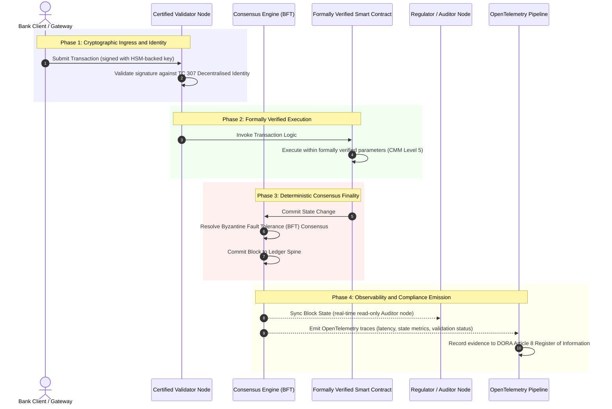

# מראיות לאמת: מדוע בלוקצ'יין מוסמך יגדיר את העידן הבא של אמון בבנקאות

**בלתי ניתן לשינוי אין פירושו מהימן.** ככל שהבנקאות הסיטונאית עוברת לסליקה בזמן אמת ולבינה מלאכותית הסתברותית, הפנקס שקובע מהי האמת הפך לשכבה האחת שהבנקים עדיין אינם יכולים להסמיך. הם מסמיכים את הישות תחת Basel III, את הענן תחת ISO 27001 ואת הבינה המלאכותית שלהם תחת ISO 42001, אך הפנקס המבוזר, הממשל שלו, הקונצנזוס, ההצפנה והחוזים החכמים, נותרים נתונים להנחות ספציפיות לספק. דוח זה טוען כי סגירת הפער הנאמנותי הזה מחייבת מעבר מהנחיית ISO/IEC TC 307 להבטחה מנחה: ניקוד הפנקס מול מדד בלוקצ'יין מוסמך בן חמש רמות שהופך מדדים הנדסיים לאמת ניתנת לביקורת דירקטוריון ובת-הגנה תחת DORA.

<!-- lead-start -->
<aside class="post-lead" aria-label="תקציר המאמר">

<strong>לסיכום.</strong> בנקים מסמיכים את הישות, את הענן ואת הבינה המלאכותית שלהם, אך לא את הפנקס שהולך וקובע מהי האמת. ISO/IEC TC 307 מספק הנחיה, לא הבטחה. מדד בלוקצ'יין מוסמך בן חמש רמות מנקד ממשל פנקס, שלמות קונצנזוס, זהות והצפנה, הבטחת חוזים חכמים ונראוּת מול מודל בשלות יכולת, סוגר את הפער הנאמנותי ומעניק לבינה מלאכותית הסתברותית עמוד שדרה של ביקורת דטרמיניסטי.

<strong>מסקנות עיקריות</strong>

<ul class="post-lead-takeaways">
  <li><strong>הפער החיכוכי הנאמנותי.</strong> את הבנק (Basel III), את הענן (ISO 27001) ואת מערכת ממשל הבינה המלאכותית (ISO 42001) ניתן להסמיך; את הפנקס המבוזר שקובע מהי האמת עדיין לא. אי-סימטריה זו היא פגיעוּת תפעולית חיה.</li>
  <li><strong>DORA הופך זאת לאישי.</strong> תחת DORA Article 5, דירקטוריוני בנקים נושאים באחריות ישירה ובלתי ניתנת להאצלה לחוסן של פריסות צד שלישי ופנקס, עם עונשים אישיים תחת SM&amp;CR בגין כשל.</li>
  <li><strong>עמוד השדרה של ביקורת לבינה מלאכותית.</strong> למידת מכונה אינה ניתנת לשחזור; בלוקצ'יין מוסמך לוכד גרסאות מודל, קלטים והחלטות אימות באופן דטרמיניסטי על השרשרת, ועומד בתקני ISO 42001 ובתקני ניהול סיכוני מודל.</li>
  <li><strong>מדד הבלוקצ'יין המוסמך.</strong> ממשל, קונצנזוס, הצפנה, חוזים חכמים ונראוּת הופכים לכרטיס ניקוד CMM בסולם 0 עד 5 שמתרגם מדדים הנדסיים להצהרות תיאבון סיכון מאושרות דירקטוריון.</li>
</ul>

<strong>קריאה נוספת:</strong> <a href="https://sebastienrousseau.com/2026-07-02-certified-blockchains-banking-trust-tc307-assurance-2026">בלוקצ'יין מוסמך ואמון בבנקאות: הבטחת TC 307</a>, <a href="https://sebastienrousseau.com/2026-07-24-global-payments-outlook-operating-model-risk-revenue">תחזית התשלומים הגלובלית לשנת 2026</a>.

</aside>
<!-- lead-end -->

> **תקציר מנהלים**
>
> - **הבנקאות הסיטונאית נמצאת בנקודת מפנה.** סליקה בזמן אמת ובינה מלאכותית הסתברותית שוברות את מודל ההבטחה האנלוגי והרטרוספקטיבי: ביקורות סטטיות מבוססות-ישות שוב אינן עומדות בדרישות המודרניות של ניהול סיכונים או נאמנות.
> - **TC 307 הוא קו בסיס, לא תעודה.** ISO/IEC TC 307 תיקנן את אוצר המילים, ארכיטקטורת הייחוס והנחיות האבטחה עבור פנקסים מבוזרים, אך הוא תיאורי. הוא מגדיר כיצד נראה טוב; הוא אינו מספק את האימות המנחה שקציני סיכונים ומפקחים זקוקים לו כדי לאשר פריסה בייצור.
> - **הבטחה פירושה ניקוד הפנקס.** ממשל, שלמות קונצנזוס, בטיחות חוזים חכמים וזריזות קריפטוגרפית, המנוקדים מול מודל בשלות יכולת מחמיר בן חמש רמות, מעבירים בנקים מהנחות טלאיות וספציפיות לספק לאמת פיננסית ניתנת להסמכה ולביקורת דירקטוריון.
> - **הפנקס הוא עמוד השדרה של הביקורת עבור בינה מלאכותית.** עיגון גרסאות מודל, קלטים והחלטות אימות לקונצנזוס דטרמיניסטי מעניק ללמידת מכונה שאינה ניתנת לשחזור רשומת ראיות בת-הגנה ובת-שחזור תחת ISO 42001, SR 11-7 ו-PRA SS1/23.

## הפער החיכוכי הנאמנותי בבנקאות הדיגיטלית

בבנקאות הקלאסית, האמון הוא יחסי, מוסדי ורטרוספקטיבי. הוא תלוי במבקרים עצמאיים, צד שלישי, הבוחנים את המצב הפיננסי בנקודות זמן סטטיות, ומיישבים אי-התאמות בין ממגורות פנקס דו-צדדיות. בשווקים של 2026, המונעים על ידי API ופועלים בזמן אמת, מודל זה מציג השהיות בלתי-נסבלות וסיכונים מבניים.

כאשר עסקאות נסלקות באופן מיידי, מאגרי נזילות תוך-יומיים מנוהלים דינמית על ידי שערי API, ובעלוּת על נכסים מטוקנת על פני פנקסים משותפים, ביקורות רטרוספקטיביות הופכות לתרגילים פורנזיים במקום לבקרות מונעות. נאמנים אינם יכולים עוד להסתמך אך ורק על הסמכת הישות התאגידית. עליהם להסמיך את המצע הדיגיטלי עצמו.

כיום, בנקים פועלים תחת אי-סימטריה ארכיטקטונית בולטת:

1. **תשתית ענן מוסמכת**: צמתי חומרה, מכולות מווירטואליות ומרכזי נתונים פיזיים מאומתים מול בקרות ISO/IEC 27001 ו-SOC 2 Type II.  
2. **תהליכי ניהול מוסמכים**: מדיניות סיכון תפעולי, תוכניות המשכיות עסקית ופריסות אלגוריתמיות מנוהלות תחת מסגרות סיכון מחמירות.  
3. **מנועי פנקס לא-מוסמכים**: מנגנוני הקונצנזוס המבוזרים המרכזיים, שרשראות האספקה של צמתים מאמתים, גבולות החוזים החכמים ומודלי ממשל הרשת נותרים נתונים להנחות לא-מוסמכות, מותאמות אישית או ספציפיות-לקונסורציום.

אי-סימטריה זו היא נקודת כשל מרכזית. בנק יכול להריץ יישום מאומת בתוך מכולת ענן מאובטחת ומוסמכת-ISO 27001, אך אם אותה מכולה כותבת לפנקס מבוזר עם בקרת מאמתים ריכוזית, פרמטרי קונצנזוס פגיעים או חוזים חכמים שלא עברו ביקורת, שלמות העסקה נפגעת. כדי לגשר על פער זה, מנוע הפנקס עצמו חייב להפוך לאובייקט הבטחה בר-הסמכה.

## קו הבסיס לתקינה של ISO/IEC TC 307

העבודה הבסיסית הנדרשת לתקינת פנקסים מבוזרים מתבססת על ידי הוועדה הטכנית ISO/IEC Technical Committee 307 (TC 307\) (בלוקצ'יין וטכנולוגיות פנקס מבוזר). במקום להתייחס לבלוקצ'יין כפרוטוקול טכני מבודד, TC 307 מתייחסת אליו כתשתית אמון מוסדית, ומארגנת את עבודתה סביב חמישה עמודי תווך מרכזיים:

1. **טקסונומיה ואוצר מילים (ISO 22739\)**: קובע מינוח משותף, ומבטיח הגדרות משפטיות ותפעוליות עקביות על פני תחומי שיפוט, סכמות פיננסיות ומוסדות שונים.  
2. **ארכיטקטורת ייחוס (ISO/TR 23245\)**: מגדירה את הגבולות, השכבות, זרימות הנתונים והרכיבים הפונקציונליים של מערכת פנקס מבוזר תואמת.  
3. **אבטחה, פרטיות וחוזים חכמים (ISO/TR 23244 / ISO 23613\)**: קובע הנחיות אבטחה בסיסיות למערכות נכסים דיגיטליים ומפרט שיטות עבודה מומלצות למיתון פגיעוּיות של חוזים חכמים ולממשל מחזור חיים.  
4. **מסגרות יכולת פעולה הדדית**: מטפלות במנגנוני חילופי הנתונים והנכסים בין רשתות פנקס הטרוגניות, ומונעות היווצרות של ממגורות מטוקנות מבודדות.  
5. **זהות מבוזרת ועוגני אמון**: משלב מזהים קריפטוגרפיים מבוססי-פנקס עם תשתיות מפתח ציבורי פורמליות (PKI) ומרשמים מורשי-מדינה.

יחדיו, TC 307 מסמנת את המעבר של DLT מבחירה הנדסית מותאמת אישית לדיסציפלינה ארכיטקטונית מתוקננת. עם זאת, TC 307 נותרה בעיקרה תיאורית. היא מגדירה כיצד נראה טוב (הנחיה), אך אינה מספקת את פרוטוקול האימות המנחה (הבטחה) שקציני סיכונים ומפקחים דורשים כדי לאשר פריסות ייצור של פונקציות קריטיות או חשובות (CIFs).

## הנחיה מול הבטחה: ההבחנה הנאמנותית

משתתפי השוק הפיננסי אינם פורסים טכנולוגיה משום שהיא חדשנית או אלגנטית; הם פורסים אותה כאשר ניתן לנהל אותה, לבקר אותה, להגן עליה וליישב אותה עם דרישות עתודות ההון. זו הסיבה שהתקינה בבנקאות מתפרקת באופן טבעי לשתי שכבות:

* **הנחיה (המסגרת)**: מתווה שיטות עבודה מומלצות, יעדי ייחוס והנחיות ארכיטקטוניות (למשל, ISO/IEC TC 307, מסגרות NIST).  
* **הבטחה (ההוכחה)**: מספקת ראיות עצמאיות, רציפות וניתנות לאימות על ידי צד שלישי לכך שהמסגרת מיושמת ופועלת כפי שתוכננה (למשל, הסמכת ISO 27001, ביקורות SOC 2, בחינות רגולטוריות).

הסתמכות על קונצנזוס פנקס לא-מוסמך תוך הסמכת תשתית ענן היא פער רגולטורי קריטי. בלוקצ'יין ש"בלתי ניתן לשינוי" אינו בהכרח "מהימן מוסדית". אי-שינוּיוּת מבטיחה רק שהנתונים שהוזנו אינם משתנים; היא אינה מאמתת שהצמתים המאמתים מאובטחים, שפרוטוקול הקונצנזוס עמיד בפני קנוניה, שלוגיקת החוזה החכם תקינה מתמטית, או שניהול המפתחות הקריפטוגרפיים תואם למנדטים פוסט-קוונטיים.

כדי לסגור פער זה, מדד הבלוקצ'יין המוסמך של 2026 מפרמל דרישות אלו למודל בשלות יכולת (CMM) בר-כימוּת הממופה לתקנות בנקאות גלובליות.

## מדד הבלוקצ'יין המוסמך של 2026

כדי לאפשר להנהלה הבכירה להעריך ולהסמיך את פלטפורמות הפנקס שלהם, מדד זה מבנה את תשתית הפנקס המבוזר לחמש שכבות תפעוליות ניתנות לביקורת, המנוקדות בסולם CMM מ-0 עד 5.

### טבלה 1: ארכיטקטורת מדד הבלוקצ'יין המוסמך

| שכבת מדד | רמת בשלות יכולת (CMM) | מדד טכני ותפעולי | ייחוס בקרה רגולטורית / נאמנותית |
| ---- | ---- | ---- | ---- |
| **ממשל פנקס** | **רמה 0**: קונסורציום אד-הוק**רמה 3**: בדיקת מאמתים ורוטציה אוטומטיות**רמה 5**: עיגון זהות קריפטוגרפית מבוזר ורב-צדדי | % מהצמתים המאמתים המופעלים על ידי ישויות פיננסיות שנבדקו; זמן ממוצע ליישוב מחלוקות מאמתים; פיזור גיאוגרפי של צמתים | **DORA Article 5** (ממשל וארגון); **CPMI-IOSCO PFMI Principle 2** (ממשל) ו-**Principle 3** (מסגרת לניהול מקיף של סיכונים) |
| **שלמות קונצנזוס** | **רמה 0**: צומת בודד או POW אטום**רמה 3**: BFT מבוקר עם סופיות דטרמיניסטית**רמה 5**: קונצנזוס רב-תחומי, מאומת פורמלית עם ניטור השהיה רציף | השהיית קונצנזוס מרבית נסבלת; סף עמידוּת בפני קנוניה; SLA לזמינות תחת חלוקת צמתים מדומה | **DORA Article 6** (מסגרת ניהול סיכוני ICT); **CPMI-IOSCO PFMI Principle 8** (סופיות הסליקה) |
| **זהות והצפנה** | **רמה 0**: מפתחות RSA / ECDSA חלשים**רמה 3**: חתימה מרובה עם ניהול מפתחות נתמך-HSM**רמה 5**: מפתחות היברידיים עמידי-קוונטים (FIPS 203 ML-KEM) ושערי פרטיות של אפס-ידע | % מעסקאות הפנקס החתומות במפתחות נתמכי-HSM; ציון מוכנות למעבר PQC; השהיית הוכחת ZK | **NIST FIPS 203 / 204**; **ISO/IEC 27001** (ניהול אבטחת מידע) |
| **הבטחת חוזים חכמים** | **רמה 0**: סקריפטי solidity שלא עברו ביקורת**רמה 3**: אימות מהדר אוטומטי וביקורת חיצונית**רמה 5**: חוזים חכמים מאומתים פורמלית ובלתי ניתנים לשינוי עם שדרוגי מפסק-זרם | % מהחוזים החכמים עם אימות פורמלי מתמטי; מספר אזהרות המהדר; כיסוי סריקת פגיעוּיות | **EBA Guidelines on Outsourcing Arrangements** (Paragraphs 81, 113-117); **DORA Article 30** (סעיפים חוזיים מינימליים) |
| **ביקורת ונראוּת** | **רמה 0**: גירוד יומנים ידני**רמה 3**: מעקבי OTel מובְנים וצמתי מבקר לקריאה בלבד**רמה 5**: יישוב אוטומטי ורציף למרשם Article 8 | % מהעסקאות המכוסות במעקבי OpenTelemetry; השהיה מ-block-commit של הפנקס לסנכרון צומת-המבקר | **BCBS 239** (צבירת נתוני סיכון); **DORA Article 8** (מרשם מידע / ITS Schemas) |

### טבלה 2: אותות אמון מרכזיים ממופים לתקני בנקאות גלובליים

| אות / מדד ייחוס | מדד | השפעה על פלטפורמות בנקאות | מקור רגולטורי |
| ---- | ---- | ---- | ---- |
| **התקדמות ISO/IEC TC 307** | מעבר מדוחות טכניים ISO/TR לסכמות הסמכה פורמליות | קובע את המסגרת המתוקננת הראשונה להסמכת מנועי פנקס מבוזר | **ISO/IEC JTC 1 / SC 44** (טכנולוגיות פנקס מבוזר) |
| **שלב האב-טיפוס של Project Agorá** | 40+ בנקים מסחריים משתתפים; בדיקת פנקס מאוחד של פיקדונות מטוקנים | הסטת סליקה חוצת-גבולות ממסרים (SWIFT) לסליקה מטוקנת אטומית | **Bank for International Settlements (BIS) Innovation Hub** |
| **ביקורת צד שלישי לפי DORA Article 30** | 100% מספקי הצמתים ומארחי התשתית מבוקרים מול קריטריוני אבטחה | מבטל "צמתים מאמתים צללים"; מחייב שקיפות מלאה של שרשרת האספקה | **European Supervisory Authorities (ESA)** |
| **ISO/IEC 42001 (ממשל בינה מלאכותית)** | מודל בינה מלאכותית ויומני אימון בלתי-ניתנים-לשינוי קריפטוגרפית על השרשרת | מעסיק בלוקצ'יין כפנקס הראיות הבלתי ניתן לשינוי ("עמוד שדרה של ביקורת") ללמידת מכונה | **ISO/IEC 42001:2023** (טכנולוגיית מידע, בינה מלאכותית) |
| **הלימוּת הון לפי Basel III** | הפחתת כריות הון לסיכון תפעולי בהתבסס על הפחתת מורכבות מתועדת | מסגרות סיכון תפעולי מתוקננות מזכות ישירות חוסן פנקס מאומת | **Basel Committee on Banking Supervision (BCBS)** |

## "עמוד השדרה של הביקורת" לבינה מלאכותית: אינטליגנציה הסתברותית על תשתית דטרמיניסטית

אחד התפקידים האסטרטגיים העוצמתיים ביותר של בלוקצ'יין מוסמך ב-2026 הוא לשמש כ**"עמוד שדרה של ביקורת"** לפריסות בינה מלאכותית. מערכות פיננסיות מודרניות הופכות הסתברותיות יותר ויותר. ניקוד אשראי, זיהוי הונאות בזמן אמת, מסחר אלגוריתמי ואינטראקציות אוטונומיות עם לקוחות מונעים על ידי מודלי למידת מכונה המתפתחים, נודדים ומסתגלים לאורך זמן. מודלים אלו אינם דטרמיניסטיים: בהינתן אותו קלט בשתי נקודות זמן שונות, הם עשויים להפיק פלטים שונים בשל משקלים דינמיים ואימון רציף.

אי-דטרמיניזם זה מציג אתגר ממשל עמוק תחת תקני **ISO/IEC 42001 (ממשל בינה מלאכותית)** ו**ניהול סיכוני מודל (MRM)** (כגון **US Federal Reserve SR 11-7** ו-**UK PRA SS1/23**): *כיצד מבקרים, מסבירים ומגינים על החלטות שאינן ניתנות לשחזור מדויק?*

פנקס מבוזר מוסמך מספק את משקל הנגד הדטרמיניסטי. בעוד מודלי בינה מלאכותית פועלים באופן הסתברותי, הבלוקצ'יין המוסמך מתעד את הפרמטרים שלהם באופן דטרמיניסטי, ומבסס עמוד שדרה של ראיות שאינו ניתן לשינוי:

* **גרסאוּת מודל ועיגון משקלים**: כל גרסת מודל שנפרסת, המשקלים המשויכים לה וסכומי הביקורת של נתוני האימון שלה עוברים גיבוב ונכתבים לפנקס בזמן ה-build, ועומדים בדרישות שרשרת האספקה של **SLSA Level 3**.  
* **תיעוד קלט הקשרי**: כאשר מודל בינה מלאכותית מבצע החלטה קריטית (למשל, אישור הלוואה או סימון עסקה), הקלטים ההקשריים המדויקים וגיבובי המודל נכתבים לפנקס, ויוצרים היסטוריה שחבלה בה ניכרת.  
* **יכולת ביקורת ללא גישה לקוד**: אם רגולטור שואל, "מדוע המודל שלכם דחה בקשת אשראי זו ב-3 ביוני?", הבנק אינו צריך לחשוף קוד קנייני או לנסות לשחזר את מצב המודל המדויק. הוא מציג את רשומת הפנקס על השרשרת, החתומה קריפטוגרפית, של הקלטים, המשקלים ומצב האימות.

על ידי עיגון ההחלטות ההסתברותיות של מודלי למידת מכונה לקונצנזוס הדטרמיניסטי של בלוקצ'יין מוסמך, המוסד יוצר ציר זמן של פעולות אוטומטיות שהוא בר-הגנה, בר-שחזור וניתן לאימות עצמאי.

## המחשת צינור הקונצנזוס-לביקורת המוסמך

דיאגרמת הרצף הבאה ממחישה את מחזור החיים של עסקה העוברת דרך פלטפורמת בלוקצ'יין מוסמכת, וממחישה כיצד שערי אימות, שלמות קונצנזוס, ביצוע חוזה חכם ופליטת טלמטריה משתלבים כדי להפיק ראיות רגולטוריות מוכנות לדירקטוריון:

הנתיב הקריטי עבור רצף עסקאות זה מחייב שכל שלב אימות, ביצוע וקונצנזוס יהיה חתום קריפטוגרפית, ומבטיח מקוריוּת מקצה לקצה. צומת המבקר של הרגולטור מסנכרן את מצב הבלוק בזמן אמת, ומבטל את הצורך ביישוב פיננסי ידני ורטרוספקטיבי.

## מדריך הפעולה לחדר הדירקטוריון עבור מנהלים בכירים

כדי לנהל בהצלחה את המעבר מאמון ארגוני לאמון תשתיתי, מנהלי בנקים ומנהלים בכירים צריכים לבצע באופן מיידי ארבע הנחיות מרכזיות:

1. **חייבו ביקורות פנקס בניהול סיכוני מיזם (ERM)**: אכפו מדיניות שלפיה אף פלטפורמת פנקס מבוזר, בין אם פרטית, ציבורית או מבוססת-קונסורציום, לא תיפרס עבור פונקציות קריטיות או חשובות (CIFs) אלא אם עברה ביקורת מול **ארכיטקטורת מדד הבלוקצ'יין המוסמך** בת חמש השכבות (CMM Level 3 מינימום).  
2. **שלבו בלוקצ'יין כעמוד השדרה הראייתי של הבינה המלאכותית לפי ISO 42001**: הנחו את מנהל הסיכונים הראשי ואת ארכיטקט הבינה המלאכותית הראשי לשלב את כל מודלי למידת המכונה בעלי ההשפעה הגבוהה עם בלוקצ'יין מוסמך, וליצור פנקס ביקורת שחבלה בו ניכרת של גרסאות מודל, משקלים, קלטים והחלטות.  
3. **בקרו את שרשרת האספקה של הצמתים המאמתים (DORA Article 30\)**: דרשו מחטיבת הרכש לבקר את כל ישויות הצד השלישי המארחות צמתים מאמתים או מנהלות אירוח ענן עבור רשתות DLT, וחייבו ציות לאותם תקני אבטחת סייבר וחוסן תפעולי החלים על צמתי הענן הפנימיים של הבנק.  
4. **התאימו את ארכיטקטורות הפנקס ל-CPMI-IOSCO ול-BCBS 239**: הנחו את צוות הנדסת הפלטפורמה להתאים את טלמטריית פלט הפנקס ישירות לדרישות דיווח הנתונים של **BCBS 239**, וודאו שפרמטרי הקונצנזוס וסופיות הסליקה תואמים באופן מחמיר ל-**CPMI-IOSCO Principles 8 and 9**.

## שאלות נפוצות

**האם ISO/IEC TC 307 הוא תקן הסמכה?**  
לא. ISO/IEC TC 307 הוא ועדה טכנית הקובעת אוצר מילים, ארכיטקטורות ייחוס והנחיות אבטחה. בעוד הוא מגדיר "כיצד נראה טוב" (הנחיה), על התעשייה להפעיל מסמכים אלו לכדי סכמות הסמכה פורמליות וניתנות לביקורת (הבטחה) כדי לספק את מפקחי הבנקאות.

**כיצד בלוקצ'יין מוסמך תומך בציות ל-DORA?**  
תחת DORA Article 5, דירקטוריוני בנקים נושאים באחריות אישית וישירה לחוסן טכנולוגי. בלוקצ'יין מוסמך מספק ראיות קריפטוגרפיות ניתנות לאימות לשלמות הקונצנזוס, לבקרת שרשרת האספקה של המאמתים ולבטיחות החוזים החכמים, ומעניק לחברי הדירקטוריון את "הצעדים הסבירים" הניתנים לתיעוד הנדרשים להגנה מפני תביעות אחריות אישית תחת SM\&CR.

**מהו ההבדל בין ביקורת פנקס מסורתית לביקורת בלוקצ'יין מוסמך?**  
ביקורת מסורתית היא רטרוספקטיבית, ומאמתת רישומים ידניים וקבצים סטטיים לאחר שהעסקאות נסלקו. ביקורת בלוקצ'יין מוסמך היא רציפה ובזמן אמת; הצמתים המאמתים, מנוע הקונצנזוס BFT והחוזים החכמים המאומתים פורמלית מוסמכים לבצע עסקאות באופן דטרמיניסטי, ולפלוט טלמטריה מובנית (OpenTelemetry) המאמתת ברציפות את תקינות המערכת.

**האם ניתן להסמיך בלוקצ'יין ציבורי לשימוש בנקאי?**  
ברוב תחומי השיפוט, בלוקצ'יין ציבורי טהור וללא הרשאות אינו עומד בתקנות בנקאות בשל היעדר אימות זהות מאמתים, עלויות gas/עסקה בלתי צפויות, וסופיות לא-דטרמיניסטית (למשל, פיצולי proof-of-work/stake הסתברותיים). בלוקצ'יין מוסמך בבנקאות מנצל בדרך כלל ארכיטקטורות ארגוניות עם הרשאות או ארכיטקטורות היברידיות-ציבוריות מפוקחות בקפדנות, שבהן מפעילי הצמתים המאמתים הם ישויות פיננסיות מזוהות ומבוקרות.

## הפניות

* ועדת באזל לפיקוח על הבנקים (BCBS), 2013\. *עקרונות לצבירת נתוני סיכון ולדיווח אפקטיביים (BCBS 239\)*. באזל: הבנק להסדרים בינלאומיים. זמין בכתובת: [ועדת באזל לפיקוח על הבנקים (BCBS), 2013\.](https://www.bis.org/publ/bcbs239.pdf "ועדת באזל לפיקוח על הבנקים (BCBS), 2013\.").  
* הוועדה לתשלומים ולתשתיות שוק והוועדה הטכנית של הארגון הבינלאומי של רשויות ניירות ערך (CPMI-IOSCO), 2012\. *עקרונות לתשתיות שוק פיננסי*. באזל: הבנק להסדרים בינלאומיים. זמין בכתובת: [הוועדה לתשלומים ולתשתיות שוק והוועדה הטכנית של הארגון הבינלאומי של רשויות ניירות ערך (CPMI-IOSCO), 2012\.](https://www.bis.org/cpmi/publ/d101a.pdf "הוועדה לתשלומים ולתשתיות שוק והוועדה הטכנית של הארגון הבינלאומי של רשויות ניירות ערך (CPMI-IOSCO), 2012\.").  
* הרשות הבנקאית האירופית (EBA), 2019\. *EBA/GL/2019/02, הנחיות בנוגע להסדרי מיקור חוץ*. פריז: EBA. זמין בכתובת: [הרשות הבנקאית האירופית (EBA), 2019\.](https://www.eba.europa.eu/regulation-and-policy/internal-governance/guidelines-on-outsourcing-arrangements "הרשות הבנקאית האירופית (EBA), 2019\.").  
* הפרלמנט האירופי ומועצת האיחוד האירופי, 2022\. *תקנה (EU) 2022/2554 בנושא חוסן תפעולי דיגיטלי למגזר הפיננסי (DORA)*. בריסל: כתב העת הרשמי של האיחוד האירופי. זמין בכתובת: [הפרלמנט האירופי ומועצת האיחוד האירופי, 2022\.](https://eur-lex.europa.eu/legal-content/EN/TXT/?uri=CELEX%3A32022R2554 "הפרלמנט האירופי ומועצת האיחוד האירופי, 2022\.").  
* ISO/IEC JTC 1/SC 42, 2023\. *ISO/IEC 42001:2023, טכנולוגיית מידע, בינה מלאכותית, מערכת ניהול*. ז'נבה: הארגון הבינלאומי לתקינה. זמין בכתובת: [ISO/IEC JTC 1/SC 42, 2023\.](https://www.iso.org/standard/81230.html "ISO/IEC JTC 1/SC 42, 2023\.").  
* הוועדה הטכנית ISO/IEC Technical Committee 307, 2020\. *ISO/IEC 22739:2020, בלוקצ'יין וטכנולוגיות פנקס מבוזר, אוצר מילים*. ז'נבה: הארגון הבינלאומי לתקינה. זמין בכתובת: [הוועדה הטכנית ISO/IEC Technical Committee 307, 2020\.](https://www.iso.org/standard/73771.html "הוועדה הטכנית ISO/IEC Technical Committee 307, 2020\.").  
* המכון הלאומי לתקנים וטכנולוגיה (NIST), 2026\. *שלושת תקני ההצפנה הפוסט-קוונטיים הראשונים שהושלמו (FIPS 203, 204, and 205\)*. גייתרסבורג: משרד המסחר של ארה"ב. זמין בכתובת: [המכון הלאומי לתקנים וטכנולוגיה (NIST), 2026\.](https://www.nist.gov/news-events/news/2024/08/nist-releases-first-3-finalised-post-quantum-encryption-standards "המכון הלאומי לתקנים וטכנולוגיה (NIST), 2026\.").

