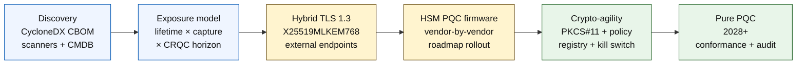

# 2026 में क्वांटम-सेफ बैंकिंग सूचकांक: पोस्ट-क्वांटम क्रिप्टोग्राफी, QKD, क्रिप्टो-एजिलिटी और हार्वेस्ट-नाउ-डिक्रिप्ट-लेटर जोखिम

<!-- lead-start: manual -->
<aside class="post-lead" aria-label="लेख सारांश">

<strong>संक्षेप में।</strong> 2026 में क्वांटम-सेफ बैंकिंग एक डिलीवरी कार्यक्रम है, जिसकी समय-सीमा दो वक्रों के प्रतिच्छेदन से तय होती है — आज संस्थान जो डेटा रखता है उसकी गोपनीयता अवधि, और एक क्रिप्टोग्राफ़िकली रेलेवेंट क्वांटम कंप्यूटर (CRQC) के आगमन का क्षितिज। NIST FIPS 203 / 204 / 205 अगस्त 2024 से अंतिम हैं; CNSA 2.0 ने US संघीय अंत-स्थिति 2033 पर रखी है; दीर्घजीवी डेटा पर हार्वेस्ट-नाउ-डिक्रिप्ट-लेटर पहले से ही हो रहा है। बोर्ड-स्तरीय क्वांटम स्कोरकार्ड चार सटीक प्रतिशत ट्रैक करता है: इन्वेंट्री पूर्णता, HNDL एक्सपोज़र, NIST माइग्रेशन प्रगति, क्रिप्टो-एजिलिटी तैयारी।

<strong>मुख्य निष्कर्ष</strong>

<ul class="post-lead-takeaways">
  <li><strong>एल्गोरिथम बहस 13 अगस्त 2024 को समाप्त हो गई।</strong> ML-KEM (FIPS 203), ML-DSA (FIPS 204), SLH-DSA (FIPS 205) ही उत्तर हैं। 2026 में अभी भी आंतरिक मूल्यांकन चलाकर "विजेता चुनने" वाले बैंक 18 महीने पीछे हैं।</li>
  <li><strong>हार्वेस्ट-नाउ-डिक्रिप्ट-लेटर पहले से लागू है।</strong> CRQC के विश्वसनीय आगमन से आगे की गोपनीयता अवधि वाली कोई भी चीज़ — 30-वर्षीय बंधक, जीवन-बीमा अंडरराइटिंग, MiFID II / GDPR लेन-देन रिकॉर्डिंग, M&amp;A अवधारण अभिलेखागार — अभी हाइब्रिड क्वांटम-सेफ की-एनकैप्सुलेशन पर जानी चाहिए, न कि CRQC की घोषणा का इंतज़ार किया जाए।</li>
  <li><strong>इन्वेंट्री ही गेटिंग मैच्योरिटी है।</strong> क्रिप्टोग्राफिक बिल ऑफ़ मटीरियल्स (CBOM) — प्रोटोकॉल, लाइब्रेरी, सर्टिफ़िकेट, HSM पार्टीशन, वेंडर डिपेंडेंसी, एप्लिकेशन ओनर, डेटा-वर्गीकरण अवधि — बाक़ी सब के लिए पूर्व-शर्त है। कवरेज नहीं, ताज़गी ट्रैक करें।</li>
  <li><strong>हाइब्रिड TLS 1.3 ही 2026 की तैनाती है।</strong> X25519MLKEM768 हाइब्रिड की-शेयर वही है जो Chrome / Firefox / Cloudflare / Akamai आज वास्तव में नेगोशिएट करते हैं। शुद्ध ML-KEM TLS HSM फ़र्मवेयर और CA तैयारी का इंतज़ार कर रहा है।</li>
  <li><strong>क्रिप्टो-एजिलिटी ही टिकाऊ डिलीवरेबल है।</strong> PKCS#11 एब्स्ट्रैक्शन, लेबल वाली कीज़, व्यवसायिक सेवा को अनुमत एल्गोरिथम सेट से मैप करने वाली नीति रजिस्ट्री। इसके बिना अगला एल्गोरिथम संक्रमण फिर से बहु-वर्षीय कार्यक्रम बनेगा।</li>
</ul>
</aside>
<!-- lead-end -->

2026 में क्वांटम-सेफ बैंकिंग का मतलब परिचालन माइग्रेशन है, अटकलें नहीं। NIST ने पहले तीन पोस्ट-क्वांटम क्रिप्टोग्राफी मानकों को अंतिम रूप दे दिया है, और बैंकों को अब समझना होगा कि कौन-कौन सी प्रणालियाँ RSA, ECC, TLS, हस्ताक्षर, HSMs, सर्टिफ़िकेट, भुगतान चैनल, अभिलेखागार और दीर्घजीवी गोपनीय डेटा पर निर्भर हैं। सूचकांक का प्रश्न सीधा है: क्या संस्थान ख़तरे के परिचालन-रूप लेने से पहले क्रिप्टोग्राफी बदल सकता है?

---

> **एग्ज़ीक्यूटिव सारांश / मुख्य निष्कर्ष**
>
> - **NIST मानक अब ठोस हैं।** FIPS 203 की-एनकैप्सुलेशन के लिए ML-KEM को परिभाषित करता है, FIPS 204 हस्ताक्षरों के लिए ML-DSA को, और FIPS 205 SLH-DSA को स्टेटलेस हैश-आधारित हस्ताक्षर मानक के रूप में।
> - **इन्वेंट्री ही पहली मैच्योरिटी गेट है।** बैंक उसे माइग्रेट नहीं कर सकता जिसे वह खोज नहीं पाता: सर्टिफ़िकेट, कीज़, प्रोटोकॉल, एप्लिकेशन, वेंडर, HSMs, APIs, अभिलेखागार और एम्बेडेड सिस्टम मैप होने चाहिए।
> - **क्रिप्टो-एजिलिटी ही टिकाऊ उद्देश्य है।** लक्ष्य एक-बार का एल्गोरिथम बदलाव नहीं है; पूरी एप्लिकेशन को फिर से डिज़ाइन किए बिना क्रिप्टोग्राफिक प्रिमिटिव्स बदलने की क्षमता है।
> - **दीर्घजीवी डेटा तात्कालिकता बदलता है।** हार्वेस्ट-नाउ-डिक्रिप्ट-लेटर जोखिम का अर्थ है कि आज पकड़ा गया डेटा बाद में पढ़ा जा सकता है, बशर्ते वह काफ़ी समय तक मूल्यवान बना रहे।
> - **QKD विशेष पूरक है।** क्वांटम की डिस्ट्रिब्यूशन उच्चतम-मूल्य चैनलों के लिए प्रासंगिक हो सकता है, लेकिन यह संस्थान-व्यापी PQC माइग्रेशन का स्थान नहीं ले सकता।
>
---

## 2026 ही वह वर्ष क्यों है जब यह सूचकांक मायने रखता है

2024-2025 के तीन बदलावों ने क्वांटम-सेफ को शोध-निगरानी से बैंक के मापे जा सकने वाले कार्यक्रम में बदल दिया। पहला, NIST ने 13 अगस्त 2024 को प्राथमिक पोस्ट-क्वांटम मानकों को अंतिम रूप दिया: [FIPS 203 (ML-KEM) ⧉](https://nvlpubs.nist.gov/nistpubs/FIPS/NIST.FIPS.203.pdf "FIPS 203 — Module-Lattice-Based Key-Encapsulation Mechanism"), [FIPS 204 (ML-DSA) ⧉](https://nvlpubs.nist.gov/nistpubs/FIPS/NIST.FIPS.204.pdf "FIPS 204 — Module-Lattice-Based Digital Signature Standard"), [FIPS 205 (SLH-DSA) ⧉](https://nvlpubs.nist.gov/nistpubs/FIPS/NIST.FIPS.205.pdf "FIPS 205 — Stateless Hash-Based Digital Signature Standard")। एल्गोरिथम-चयन की बहस उसी दिन समाप्त हो गई; 2026 में अब भी "कौन-सी योजना जीतेगी" वाली आंतरिक धाराएँ चलाने वाले बैंक 18 महीने पीछे हैं।

दूसरा, [NSA की CNSA 2.0 ⧉](https://media.defense.gov/2022/Sep/07/2003071834/-1/-1/0/CSA_CNSA_2.0_ALGORITHMS_.PDF "Commercial National Security Algorithm Suite 2.0") ने US संघीय अंत-स्थिति 2033 पर तय की, जिसमें सॉफ़्टवेयर और फ़र्मवेयर साइनिंग के लिए 2027 से और ब्राउज़र तथा ऑपरेटिंग सिस्टम के लिए 2030 से मध्यवर्ती कटऑफ़ हैं। US संघीय काउंटरपार्टी एक्सपोज़र वाला कोई भी बैंक — FedNow, Treasury परिचालन, संघीय ग्राहक खाते — संघीय डेटा को छूने वाली प्रणालियों के लिए उसी परिधि के भीतर है। घड़ी अब अमूर्त नहीं रही।

तीसरा, [हार्वेस्ट-नाउ-डिक्रिप्ट-लेटर (HNDL) ⧉](https://csrc.nist.gov/Projects/post-quantum-cryptography "NIST Post-Quantum Cryptography programme") तात्कालिकता का भार उठाने वाला जोखिम तर्क है। चतुर विरोधी प्रमुख वित्तीय केंद्रों पर पहले से ही TLS-संरक्षित भुगतान संदेश, SWIFT लिफ़ाफ़े, KYC दस्तावेज़ और दीर्घजीवी अभिलेख सायफ़रटेक्स्ट पकड़ रहे हैं। 2026 में पकड़ा गया डेटा केवल डिक्रिप्शन के क्षण तक गोपनीयता-संवेदनशील रहना चाहिए — 30-वर्षीय बंधक, जीवन-बीमा अंडरराइटिंग, MiFID II / GDPR लेन-देन रिकॉर्डिंग और M&A अवधारण अभिलेखागार के लिए, वह खिड़की क्रिप्टोग्राफ़िकली रेलेवेंट क्वांटम कंप्यूटर (CRQC) के हर विश्वसनीय अनुमान से कहीं आगे तक खिंचती है। विरोधी को आज क्वांटम कंप्यूटर की ज़रूरत नहीं है। उसे डेटा का महत्व समाप्त होने से पहले एक चाहिए।

क्वांटम-सेफ बैंकिंग सूचकांक मापता है कि क्या आपका संस्थान उस प्रतिच्छेदन के आने से पहले माइग्रेशन डिलीवर कर सकता है। काम अब यह नहीं है कि माइग्रेट करना है या नहीं; यह है कि माइग्रेशन एक बचाव-योग्य समयरेखा पर पूरा होता है या नहीं।

## 2026 की सूचकांक संरचना

| सूचकांक परत | 2026 दिशा | तैयारी मीट्रिक | ग़लत प्रबंधन का जोखिम |
|---|---|---|---|
| **इन्वेंट्री** | क्रिप्टोग्राफिक संपत्तियाँ, प्रोटोकॉल, सर्टिफ़िकेट, वेंडर और डेटा वर्ग मैप करें | इन्वेंट्री किए गए एस्टेट का प्रतिशत | अज्ञात क्वांटम-संवेदनशील निर्भरताएँ |
| **एक्सपोज़र** | गोपनीयता अवधि और लेन-देन क्रिटिकलिटी से प्रणालियों का वर्गीकरण | मूल्य और अवधि के अनुसार उच्च-जोखिम संपत्तियाँ | ग़लत प्राथमिकता वाला माइग्रेशन |
| **माइग्रेशन** | NIST मानकों से संरेखित हाइब्रिड और PQC-तैयार पैटर्न अपनाएँ | ML-KEM और ML-DSA तैयारी | समयसीमा के तहत आपातकालीन रि-प्लेटफ़ॉर्मिंग |
| **क्रिप्टो-एजिलिटी** | एप्लिकेशन लॉजिक को क्रिप्टोग्राफिक प्रिमिटिव्स से अलग करें | नीति-नियंत्रित क्रिप्टो कवरेज | एस्टेट भर में हार्ड-कोडेड एल्गोरिथम |
| **एश्योरेंस** | इंटरऑपरेबिलिटी, प्रदर्शन, HSM समर्थन, सर्टिफ़िकेट और वेंडर तैयारी का परीक्षण | टेस्ट पास दर और अपवाद बैकलॉग | टूटे चैनल या कमज़ोर फ़ॉलबैक नियंत्रण |

### बोर्ड-स्तरीय क्वांटम स्कोरकार्ड

विश्वसनीय क्वांटम तैयारी स्कोरकार्ड के लिए केवल परियोजना स्थितियों के बजाय सटीक प्रतिशत ट्रैक करने की आवश्यकता है:

1. **इन्वेंट्री पूर्णता:** पूरी तरह से मैप किए गए क्रिप्टोग्राफिक बिल ऑफ़ मटीरियल्स (CBOM) वाले स्तर-1 एप्लिकेशन का प्रतिशत।
2. **HNDL एक्सपोज़र:** हाइब्रिड क्वांटम-सेफ की-एनकैप्सुलेशन के बिना नेटवर्क पर प्रेषित दीर्घजीवी गोपनीय डेटा (जैसे, PII, व्यापार रहस्य) की मात्रा।
3. **NIST माइग्रेशन प्रगति:** FIPS 203 (ML-KEM) और FIPS 204 (ML-DSA) मानकों पर माइग्रेट की गई असममित एन्क्रिप्शन कीज़ और डिजिटल हस्ताक्षरों का प्रतिशत।
4. **क्रिप्टो-एजिलिटी तैयारी:** उन क्रिटिकल प्रणालियों का प्रतिशत जहाँ क्रिप्टोग्राफिक एल्गोरिथम कोड री-कम्पाइलेशन के बिना केंद्रीकृत नीति के माध्यम से बदले जा सकते हैं।

## ट्रैक करने योग्य वर्तमान संकेत

| संकेत | बैंकों के लिए इसका क्या अर्थ है | स्रोत |
|---|---|---|
| **FIPS 203 ML-KEM** | सामान्य एन्क्रिप्शन की-स्थापना के लिए प्राथमिक NIST मानक | [NIST ⧉](https://www.nist.gov/news-events/news/2024/08/nist-releases-first-3-finalized-post-quantum-encryption-standards "पहले तीन अंतिम पोस्ट-क्वांटम एन्क्रिप्शन मानक") |
| **FIPS 204 ML-DSA** | डिजिटल हस्ताक्षरों के लिए प्राथमिक NIST मानक | [NIST ⧉](https://www.nist.gov/news-events/news/2024/08/nist-releases-first-3-finalized-post-quantum-encryption-standards "पहले तीन अंतिम पोस्ट-क्वांटम एन्क्रिप्शन मानक") |
| **FIPS 205 SLH-DSA** | हैश-आधारित हस्ताक्षर विकल्प और बैकअप डिज़ाइन | [NIST ⧉](https://www.nist.gov/news-events/news/2024/08/nist-releases-first-3-finalized-post-quantum-encryption-standards "पहले तीन अंतिम पोस्ट-क्वांटम एन्क्रिप्शन मानक") |
| **तत्काल एकीकरण प्रोत्साहित** | NIST स्पष्ट रूप से प्रशासकों को मानकों को एकीकृत करना शुरू करने को कहता है क्योंकि पूर्ण एकीकरण में समय लगता है | [NIST ⧉](https://www.nist.gov/news-events/news/2024/08/nist-releases-first-3-finalized-post-quantum-encryption-standards "पहले तीन अंतिम पोस्ट-क्वांटम एन्क्रिप्शन मानक") |
| **बैंक क्वांटम कार्यक्रम विस्तार में हैं** | प्रमुख बैंक PQC संक्रमण तैयार करते हुए क्वांटम तकनीकों का अन्वेषण कर रहे हैं | [Quantum Insider ⧉](https://thequantuminsider.com/2026/03/27/15-plus-global-banks-probing-the-wonderful-world-of-quantum-technologies/ "क्वांटम तकनीकों का अन्वेषण कर रहे वैश्विक बैंकों का अवलोकन") |

## माइग्रेशन क्रिप्टोग्राफी के लेजर से शुरू होता है

माइग्रेशन क्रम इस बिंदु पर अच्छी तरह से समझा गया है। हर गेट ऐसा साक्ष्य उत्पन्न करता है जो अगले को चलाता है; एक गेट को छोड़ना या संकुचित करना ही वह आपातकालीन रि-प्लेटफ़ॉर्मिंग जोखिम पैदा करता है जो सूचकांक संरचना के विफलता स्तंभ में दिखता है।

पहली डिलीवरेबल कोई नया एल्गोरिथम नहीं है; वह एक क्रिप्टोग्राफिक बिल ऑफ़ मटीरियल्स (CBOM) है। बैंकों को एक जीवंत इन्वेंट्री चाहिए जो व्यवसायिक सेवाओं को एल्गोरिथम, लाइब्रेरी, सर्टिफ़िकेट, की लंबाई, HSMs, डेटा अवधि, वेंडर और परिचालन ओनर से जोड़े। उस लेजर के बिना, क्वांटम-सेफ माइग्रेशन अनुमान बन जाता है।

CBOM रिकॉर्ड सेट हर क्रिप्टोग्राफिक प्रिमिटिव के लिए पकड़ना चाहिए: प्रोटोकॉल या इंटरफ़ेस (TLS 1.3, IPsec, SSH, कस्टम भुगतान-संदेश प्रारूप), एल्गोरिथम और पैरामीटर सेट (RSA-2048, ECDH P-256, ML-KEM-768, ML-DSA-65), लाइब्रेरी और संस्करण (OpenSSL 3.4, BoringSSL कमिट हैश, वेंडर SDK बिल्ड), हार्डवेयर सीमा (HSM पार्टीशन, TPM, सुरक्षित एनक्लेव, या कोई नहीं), लागू होने पर सर्टिफ़िकेट पहचान, एप्लिकेशन ओनर और डेटा-वर्गीकरण अवधि। 2025-2026 में उत्पादन में उतर रहे टूल — IBM Quantum Safe Inventory, ओपन-सोर्स [CycloneDX CBOM विनिर्देश ⧉](https://cyclonedx.org/capabilities/cbom/ "CycloneDX Cryptography Bill of Materials"), CryptoNext / Sandbox / PQShield से एंटरप्राइज़ स्कैनर — मौजूदा CMDB पाइपलाइनों में एकीकृत होते हैं। कोई भी अकेला पूर्ण नहीं है; वेंडर टूलिंग और समर्पित हेडकाउंट के साथ भी 12-18 महीने के CBOM निर्माण चक्र की अपेक्षा करें।

ट्रैक करने योग्य मीट्रिक ताज़गी है, कवरेज नहीं। दो महीने पुराना CBOM बिल्कुल न होने से बदतर है क्योंकि वह सुरक्षा टीम को इस बारे में झूठा भरोसा देता है कि क्या माइग्रेट हो चुका है।

## पहले हाइब्रिड, हमेशा एजाइल

अधिकांश बैंक एक साथ सब कुछ नहीं बदलेंगे। यथार्थवादी पैटर्न हाइब्रिड तैनाती है, जहाँ शास्त्रीय और पोस्ट-क्वांटम तंत्र साथ चलते हैं जबकि वेंडर, प्रोटोकॉल, सर्टिफ़िकेट और परिचालन टूलिंग परिपक्व होते हैं। दीर्घकालिक लक्ष्य क्रिप्टो-एजिलिटी है: नीति-नियंत्रित क्रिप्टोग्राफिक विकल्प जिन्हें व्यवसायिक एप्लिकेशन का पुनर्निर्माण किए बिना बदला जा सकता है।

[इंटरैक्टिव कंपोनेंट डालें: हार्वेस्ट-नाउ-डिक्रिप्ट-लेटर (HNDL) जोखिम कैलकुलेटर — एक स्लाइडर-आधारित टूल जहाँ अधिकारी डेटा शेल्फ़-लाइफ़ बनाम अनुमानित क्वांटम समयरेखा डालकर अपना एक्सपोज़र विंडो देखते हैं।]

> **मुख्य अंतर्दृष्टि:** यदि आपके डेटा को 10 वर्षों तक गोपनीय रहना है, और एक क्रिप्टोग्राफ़िकली रेलेवेंट क्वांटम कंप्यूटर (CRQC) 7 वर्ष दूर है, तो आपकी माइग्रेशन समय-सीमा 7 वर्षों में नहीं है — वह 3 वर्ष पहले थी।

व्यवहार में इसका अर्थ है बाहरी-मुखी एंडपॉइंट्स के लिए हाइब्रिड `X25519MLKEM768` की-शेयर के साथ TLS 1.3 (Chrome / Firefox / Cloudflare / Akamai सभी आज इसे समर्थन करते हैं), HSM और CA बुनियादी ढाँचे के पकड़ने तक शास्त्रीय हस्ताक्षर श्रृंखलाएँ, और एक PKCS#11 एब्स्ट्रैक्शन परत जो नीति रजिस्ट्री को व्यवसायिक एप्लिकेशन को री-कम्पाइल किए बिना एल्गोरिथम घुमाने देती है। क्रिप्टो-एजिलिटी ही तय करती है कि अगला एल्गोरिथम संक्रमण (कब, यह नहीं कि क्या) छह सप्ताह का रोटेशन होगा या एक और सात-वर्षीय कार्यक्रम।

## QKD कहाँ फिट होता है

क्वांटम की डिस्ट्रिब्यूशन सूचकांक में एक उच्च-संवेदनशीलता चैनल विकल्प के रूप में आता है, विशेष रूप से वित्तीय-बाज़ार बुनियादी ढाँचे, केंद्रीय-बैंक कनेक्टिविटी और अत्यंत संवेदनशील संस्थागत प्रवाहों के लिए। इसे PQC के पूरक के रूप में देखा जाना चाहिए, उद्यम-व्यापी माइग्रेशन में देरी के बहाने के रूप में नहीं।

## बैंक प्रकार के अनुसार इसका क्या अर्थ है

### वैश्विक प्रणालीगत रूप से महत्वपूर्ण बैंक

कठिन समस्या पैमाना है: हज़ारों TLS एंडपॉइंट्स, सैकड़ों HSM पार्टीशन्स, दर्जनों आंतरिक सर्टिफ़िकेट प्राधिकरण, एम्बेडेड क्रिप्टोग्राफिक प्रिमिटिव्स वाले सैकड़ों व्यवसायिक एप्लिकेशन, और वेंडर SDKs जिन्हें बैंक संशोधित नहीं कर सकता। निवेश एक और पायलट नहीं है; यह CBOM टूलिंग है, हर नए बिल्ड में जोड़ी गई PKCS#11 एब्स्ट्रैक्शन परत है, वह HSM समेकन योजना है जो PQC फ़र्मवेयर पर एक वेंडर को आगे रखती है और बाक़ी पर बहु-वर्षीय पूँछ स्वीकार करती है, और वह नीति रजिस्ट्री है जो FIPS 203 / 204 / 205 माइग्रेशन पूरा होने के बहुत बाद तक टिकाऊ क्रिप्टो-एजिलिटी सतह बनती है।

### लेन-देन और कॉर्पोरेट बैंक

माइग्रेशन का दायरा G-SIB स्तर से संकीर्ण है लेकिन HNDL एक्सपोज़र तीव्र है: SWIFT सीमा-पार मैसेजिंग, कॉर्पोरेट-काउंटरपार्टी PII ले जाने वाला संरचित भुगतान डेटा, व्यापार-वित्त दस्तावेज़ रखने वाले दस्तावेज़-विनिमय प्लेटफ़ॉर्म, और दीर्घ-अवधारण रिपोर्टिंग अभिलेखागार। हर ग्राहक-मुखी एंडपॉइंट पर हाइब्रिड TLS और अवधारण अभिलेखागार के लिए PQC एट-रेस्ट को प्राथमिकता दें। HSM-वेंडर जवाबदेही पर ज़ोर दें — कॉर्पोरेट-बैंकिंग प्लेटफ़ॉर्म टीम के पास सीधा खरीद लाभ होता है जो थोक प्रौद्योगिकी टीम के पास अक्सर नहीं होता।

### क्षेत्रीय बैंक

वह वेंडर स्टैक ख़रीदें जिसमें पहले से क्रिप्टो-एजिलिटी प्रिमिटिव्स हैं। ऐसा कोर बैंकिंग प्लेटफ़ॉर्म चुनें जिसका वेंडर CBOM प्रकाशित करता है और ML-KEM / ML-DSA समर्थन समयरेखा के लिए प्रतिबद्ध है। पुष्टि करें कि वेंडर का HSM रोडमैप बैंक की माइग्रेशन समय-सीमा से मेल खाता है। शून्य से क्रिप्टो-एजिलिटी बनाने के लिए आवश्यक इंजीनियरिंग क्षमता बहु-वर्षीय है; वेंडर वह लागत कई ग्राहकों में बाँटता है और बैंक लाभ का उत्तराधिकारी बनता है। मान्यता कार्य — यह जाँचना कि वेंडर के दावे संस्थान की MRM प्रक्रिया के पार उतरें — वैध आंतरिक दायरा है।

### फ़िनटेक, PSPs और बुनियादी ढाँचा प्रदाता

2026 में बैंकों को बेचने वाले वेंडरों के लिए प्रतिस्पर्धात्मक प्रश्न "क्या आप PQC का समर्थन करते हैं" नहीं है। यह है "क्या आप अपने प्लेटफ़ॉर्म के लिए एक CycloneDX CBOM, एक HSM-वेंडर समर्थन मैट्रिक्स और एक लिखित एल्गोरिथम-रोटेशन SLA पैदा कर सकते हैं।" जो वेंडर हाँ में उत्तर देंगे वे 2026-2027 में टियर-1 खरीद गेट पास करेंगे। जो नहीं कर पाएँगे वे नवीनीकरण चक्र किसी प्रतिस्पर्धी के हाथों गँवाएँगे जो कर सकता है।

## निष्कर्ष

2026 में क्वांटम-सेफ बैंकिंग शोध-निगरानी बिंदु नहीं है; यह एक डिलीवरी कार्यक्रम है जिसकी समय-सीमा दो वक्रों के प्रतिच्छेदन से तय होती है — आज संस्थान जो डेटा रखता है उसकी गोपनीयता अवधि, और एक क्रिप्टोग्राफ़िकली रेलेवेंट क्वांटम कंप्यूटर के आगमन का क्षितिज। 2030 में नियामकों और काउंटरपार्टियों के सामने विश्वसनीय दिखने वाले संस्थान वे हैं जिन्होंने 2024 में CBOM निर्माण शुरू किया, 2026 के अंत तक हर बाहरी एंडपॉइंट पर हाइब्रिड TLS तैनात किया, और पहले दिन से ही हर नए बिल्ड में क्रिप्टो-एजिलिटी इंजीनियर की। जिन्होंने नहीं किया वे यह जानेंगे कि उस डेटा के लिए उनकी माइग्रेशन विंडो पहले ही बंद हो चुकी है या नहीं जिसे उनका विरोधी आज हार्वेस्ट कर रहा है।

माइग्रेशन को उसी तरह मापें जैसे आप किसी भी परिचालन कार्यक्रम को मापते हैं: दायरा ज्ञात, अनुक्रमण प्राथमिकता वाला, समय-सीमाएँ प्रतिबद्ध, अपवाद रजिस्टर ईमानदार। आप अपने एस्टेट को जितनी कठोरता से देखेंगे, माइग्रेशन विंडो उतनी ही छोटी महसूस होगी।

## अक्सर पूछे जाने वाले प्रश्न

**बैंक को सबसे पहले किसकी इन्वेंट्री बनानी चाहिए?**

बाहरी रूप से उजागर TLS, भुगतान चैनल, ग्राहक प्रमाणीकरण, अंतर-बैंक कनेक्टिविटी, HSM-समर्थित सेवाएँ, दीर्घ-अवधि अभिलेखागार, और लंबे उपयोगी जीवन वाले गोपनीय डेटा को संभालने वाली प्रणालियों से शुरू करें।

**क्या PQC केवल साइबर सुरक्षा का मुद्दा है?**

नहीं। यह भुगतान, पहचान, क़ानूनी साक्ष्य, लेन-देन हस्ताक्षर, ग्राहक विश्वास, डेटा अवधारण, वेंडर प्रबंधन और परिचालन लचीलापन को प्रभावित करता है।

**क्रिप्टो-एजिलिटी का क्या अर्थ है?**

क्रिप्टो-एजिलिटी का अर्थ है हार्ड-कोडेड एप्लिकेशन परिवर्तनों के बजाय नीति और प्लेटफ़ॉर्म नियंत्रणों के माध्यम से क्रिप्टोग्राफिक प्रिमिटिव्स बदलने की क्षमता।

**क्या बैंकों को और मानकों का इंतज़ार करना चाहिए?**

नहीं। NIST ने प्रशासकों को पहले अंतिम मानकों को एकीकृत करना शुरू करने के लिए प्रोत्साहित किया है क्योंकि पूर्ण एकीकरण में समय लगता है।

## संदर्भ

- NIST, (2026). [पहले तीन अंतिम पोस्ट-क्वांटम एन्क्रिप्शन मानक ⧉](https://www.nist.gov/news-events/news/2024/08/nist-releases-first-3-finalized-post-quantum-encryption-standards "पहले तीन अंतिम पोस्ट-क्वांटम एन्क्रिप्शन मानक")।

<!-- enrich-start -->
<aside class="author-card" aria-label="लेखक के बारे में"><strong class="author-card-name"><a href="/about/index.html">सेबास्तियन रूसो</a></strong>वरिष्ठ बैंकिंग प्रौद्योगिकीविद् जो प्रयोज्य AI, भुगतान बुनियादी ढाँचा, टोकनाइज़्ड धन, ISO 20022, पोस्ट-क्वांटम सुरक्षा, क्लाउड-नेटिव वित्तीय सेवाओं और विनियमित डिजिटल बाज़ारों पर लिखते हैं।HSBC Commercial &amp; Investment Bank, PayPal, Barclays, Shazam, AKQA, Virgin Group में 20+ वर्षों का अनुभव। <a href="/about/index.html">पूर्ण प्रोफ़ाइल</a> &middot; <a href="https://www.linkedin.com/in/sebastienrousseau/" rel="external noopener">LinkedIn</a> &middot; <a href="https://github.com/sebastienrousseau" rel="external noopener">GitHub</a></aside>

अंतिम समीक्षा <time datetime="2026-06-04">2026-06-04</time>।

<!-- enrich-end -->
