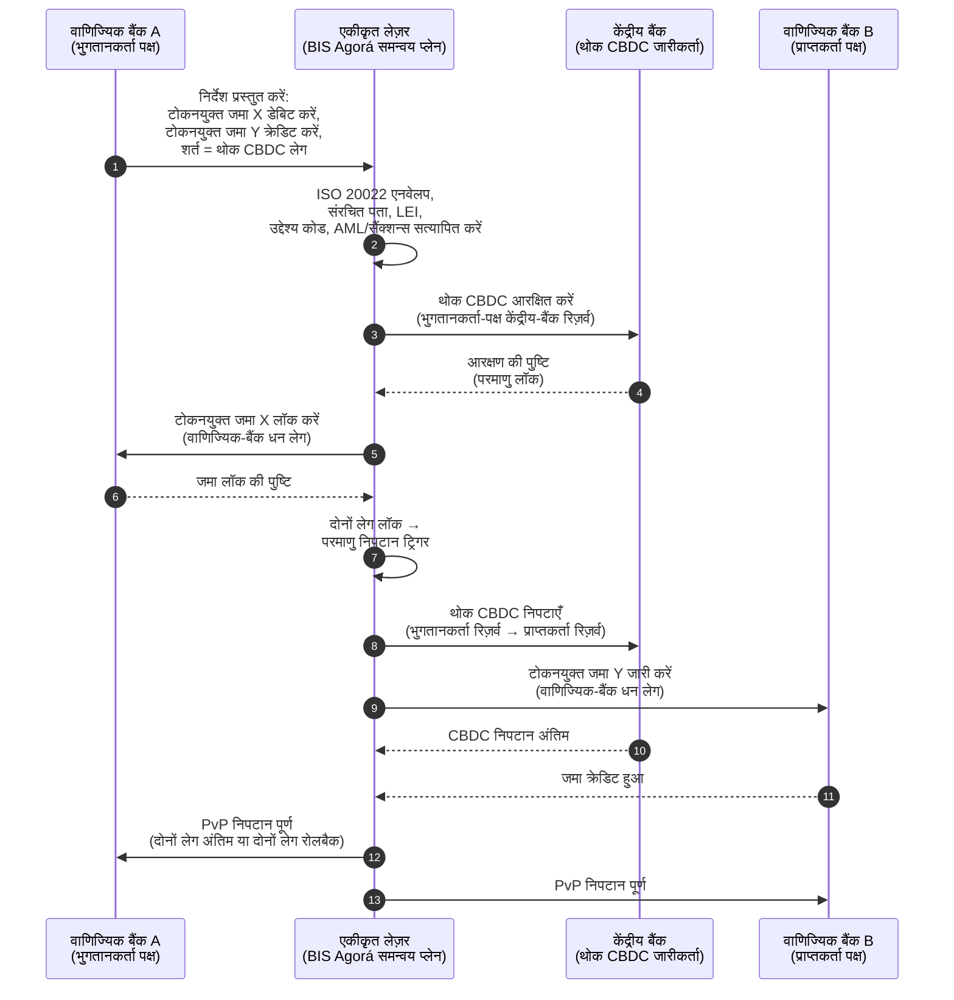

<!-- lead-start: manual -->
<aside class="post-lead" aria-label="लेख सारांश">

<strong>संक्षेप में।</strong> 2026 में थोक भुगतान दो संरचनात्मक बदलावों के चौराहे पर खड़े हैं: ISO 20022 संरचित भुगतान डेटा को संचालन मॉडल में मजबूर कर रहा है, और टोकनयुक्त जमा + BIS Project Agorá सीमा पार निपटान को परमाणु, प्रोग्रामेबल, हमेशा-ऑन रेल्स की ओर ले जा रहे हैं। 2026 में बैंक के लिए सवाल अब "क्या हमने संदेश माइग्रेट किए" नहीं है, बल्कि "क्या हमारे भुगतान संचालन मापने योग्य, रूट किए गए और पर्यवेक्षणीय हैं" — और सूचकांक इसे चार सटीक प्रतिशतों में तोड़ता है: संरचित-डेटा पूर्णता, रेल-रूटिंग इष्टतमता, निपटान-अंतिमता विलंब और Agorá-कॉरिडोर कवरेज।

<strong>मुख्य निष्कर्ष</strong>

<ul class="post-lead-takeaways">
  <li><strong>नवंबर 2026 कड़ी समय-सीमा है, सलाह नहीं।</strong> SWIFT SR 2026 में असंरचित-पता समर्थन हटाता है; निर्दिष्ट फ़ील्ड में शहर और देश के बिना भुगतान क्लियर होना बंद हो जाते हैं। मरम्मत लागत, अस्वीकृति दर और संचालन क्षमता सब "मेट्रिक" से "नियामक-दृश्य मुद्रा" में बदल जाते हैं।</li>
  <li><strong>विनियमित थोक के लिए टोकनयुक्त जमा स्टेबलकॉइन से बेहतर हैं।</strong> वे बैंक-जमाकर्ता संबंध और केंद्रीय-बैंक निपटान परिसंपत्ति को संरक्षित रखते हुए प्रोग्रामेबिलिटी उजागर करते हैं। स्टेबलकॉइन किनारे पर भूमिका निभाते हैं; टोकनयुक्त जमा कोर को थामते हैं।</li>
  <li><strong>BIS Project Agorá कॉरिडोर का संदर्भ है।</strong> यदि किसी बैंक का सीमा पार उत्पाद 2027 तक Agorá कॉरिडोर के भीतर नहीं चल सकता, तो वह उस रेल पर प्रतिस्पर्धा कर रहा है जिसे बाकी बाज़ार पहले ही छोड़ रहा है।</li>
  <li><strong>रियल-टाइम रेल ऑर्केस्ट्रेशन ही संचालन मॉडल है।</strong> 2026 का मल्टी-रेल निर्णय (FedNow / RTP / TIPS / SEPA Inst / ऑन-चेन) "कौन-सी रेल" नहीं है — यह नीति रजिस्ट्री, तरलता प्रोफ़ाइल और रूटिंग इंजन है जो प्रति भुगतान रेल चुनता है।</li>
  <li><strong>मापें या मापे जाएँ।</strong> चार प्रतिशत — संरचित-डेटा पूर्णता, रेल-रूटिंग इष्टतमता, निपटान-अंतिमता विलंब, Agorá-कॉरिडोर कवरेज — 2026/27 ऑडिट विंडो से पहले भुगतान मुद्रा को पर्यवेक्षी-तैयार साक्ष्य में बदलते हैं।</li>
</ul>
</aside>
<!-- lead-end -->

# 2026 में थोक भुगतान सूचकांक: ISO 20022, टोकनयुक्त जमा, रियल-टाइम रेल्स और सीमा पार निपटान

2026 में थोक भुगतान दो एक साथ चल रहे बदलावों से नए सिरे से आकार ले रहे हैं: संरचित भुगतान डेटा और प्रोग्रामेबल निपटान। SWIFT का नवंबर 2026 का संरचित-पता मील का पत्थर डेटा गुणवत्ता को संचालन मॉडल में मजबूर करता है, जबकि BIS Project Agorá और टोकनयुक्त जमा परख रहे हैं कि क्या सीमा पार निपटान अधिक परमाणु, पारदर्शी और हमेशा-ऑन बन सकता है।

---

> **कार्यकारी सारांश / मुख्य निष्कर्ष**
>
> - **नवंबर 2026 एक कड़ा डेटा मील का पत्थर है।** SWIFT कहता है कि असंरचित पते वाले भुगतान SR 2026 बदलाव के बाद समर्थित नहीं होंगे।
> - **संरचित डेटा उत्पाद बुनियादी ढाँचा बन जाता है।** शहर और देश कम-से-कम निर्दिष्ट फ़ील्ड में होने चाहिए, जो भुगतान-डेटा गुणवत्ता को क्लाइंट, संचालन और अनुपालन का मुद्दा बना देता है।
> - **टोकनयुक्त जमा थोक डिज़ाइन विकल्प हैं।** Project Agorá एकीकृत लेज़र मॉडल में टोकनयुक्त वाणिज्यिक बैंक जमा और टोकनयुक्त केंद्रीय बैंक रिज़र्व का अन्वेषण करता है।
> - **सूचकांक को निपटान गुणवत्ता मापनी चाहिए, केवल गति नहीं।** अंतिमता, पारदर्शिता, मरम्मत दर, तरलता उपयोग, अनुपालन डेटा और क्लाइंट दृश्यता तत्काल निष्पादन जितनी ही महत्वपूर्ण हैं।
> - **सीमा पार भुगतान सार्वजनिक-निजी एजेंडा बने हुए हैं।** FSB सार्वजनिक और निजी-क्षेत्र समन्वय के साथ कार्यान्वयन के माध्यम से G20 रोडमैप को आगे बढ़ाना जारी रखता है।
>
---

## 2026 ही वह वर्ष क्यों है जब यह सूचकांक मायने रखता है

स्टैनफ़ोर्ड AI Index इसलिए उपयोगी है क्योंकि वह तेज़ी से बदलते प्रौद्योगिकी क्षेत्र को मापने योग्य चीज़ की तरह बरतता है: शोध आउटपुट, तकनीकी प्रदर्शन, ज़िम्मेदार तैनाती, अर्थशास्त्र, क्षेत्र अपनाव, नीति और जन भावना — सब एक ही फ़्रेम में लाए जाते हैं ([Stanford HAI ⧉](https://hai.stanford.edu/ai-index/2026-ai-index-report "The 2026 AI Index Report"))। बैंकों और वित्तीय संस्थानों को अब बुनियादी ढाँचे के लिए वही अनुशासन चाहिए। एजेंटिक AI, क्वांटम-सुरक्षित सुरक्षा, क्लाउड-नेटिव लचीलापन और थोक भुगतान अब अलग-अलग नवाचार ट्रैक नहीं हैं; वे एक ही संचालन मॉडल में मिल रहे हैं।

बैंक के लिए व्यावहारिक प्रश्न यह नहीं है कि क्या प्रत्येक क्षेत्र महत्वपूर्ण है। यह है कि क्या संस्थान एक साथ सभी में तत्परता माप सकता है। एक बैंक एजेंटिक AI तैनात कर सकता है और फिर भी कमज़ोर रह सकता है यदि उसकी क्रिप्टोग्राफी माइग्रेशन-तैयार नहीं है। वह क्लाउड प्लेटफ़ॉर्म आधुनिक कर सकता है और फिर भी विफल हो सकता है यदि भुगतान डेटा असंरचित बना रहे। वह टोकनाइज़ेशन पायलट चला सकता है और फिर भी प्रणालीगत जोखिम पैदा कर सकता है यदि निपटान, तरलता, पहचान और ऑडिट लॉग परतें एक साथ डिज़ाइन नहीं की गई हैं।

## 2026 सूचकांक संरचना

| सूचकांक परत | 2026 दिशा | तत्परता मेट्रिक | गलत संभालने पर जोखिम |
|---|---|---|---|
| **ISO 20022 डेटा** | असंरचित टेक्स्ट से शासित संरचित फ़ील्ड की ओर | संरचित-पता तत्परता और अस्वीकृति दर | भुगतान अस्वीकृतियाँ और मैन्युअल मरम्मत |
| **रेल ऑर्केस्ट्रेशन** | RTGS, इंस्टेंट, संवाददाता, स्टेबलकॉइन और टोकनयुक्त रेल्स में रूट करना | लागत, गति, अंतिमता और क्षेत्राधिकार-जागरूक रूटिंग | दोहराए गए नियंत्रणों के साथ खंडित रेल्स |
| **टोकनयुक्त निपटान** | जहाँ घर्षण कम होता है वहाँ टोकनयुक्त जमा और केंद्रीय बैंक धन का उपयोग करें | DvP, PvP, परमाणु निपटान कवरेज | व्यवसाय कार्यप्रवाह मूल्य के बिना पायलट परिसंपत्तियाँ |
| **तरलता** | इंट्राडे तरलता, फँसी नकदी और निपटान विंडो का अनुकूलन | बचाई गई तरलता और निपटान-विफलता में कमी | तरलता पर तेज़ निकासी |
| **अनुपालन** | भुगतान डेटा में AML, सैंक्शन्स, FATF और ऑडिट आवश्यकताएँ अंतर्निहित करें | स्ट्रेट-थ्रू अनुपालन और व्याख्यात्मकता | मज़बूत नियंत्रणों के बिना समृद्ध डेटा |

## वैश्विक प्राथमिकताओं से जुड़े मुख्य थोक-भुगतान संकेत

2026 का संकेत-सेट कोई शोध एजेंडा नहीं है। यह डिलीवरी चेकलिस्ट है जिस पर बैंक के मुख्य भुगतान अधिकारी पहले से ही मापे जा रहे हैं। उपचार कार्य तीन जगहों पर सामने आता है: संदेश एनवेलप, रेल ऑर्केस्ट्रेशन परत, और निपटान लेज़र।

| संकेत | G20 / SWIFT / BIS संदर्भ | तकनीकी प्लेटफ़ॉर्म कार्यान्वयन |
|---|---|---|
| **65% भुगतान संदेशों में अभी भी असंरचित पते हैं** | [SWIFT SR 2026 — संरचित-पता मील का पत्थर, नवंबर 2026 ⧉](https://www.swift.com/news-events/news/iso-20022-milestone-november-2026-unstructured-addresses-be-removed "ISO 20022 November 2026 structured address milestone") | संदेश के SWIFTNet अडैप्टर तक पहुँचने से पहले भुगतान मिडलवेयर में स्कीमा सत्यापन; कॉर्पोरेट-चैनल + संवाददाता-बैंक इनग्रेस पर स्वचालित पता पार्सिंग। |
| **FSB G20 लक्ष्य: 2027 तक 75% सीमा पार भुगतान 1 घंटे के भीतर पूरे हों** | [FSB सीमा पार भुगतान रोडमैप, 2026 कार्यान्वयन चरण ⧉](https://www.fsb.org/2026/03/fsb-kicks-off-new-implementation-phase-to-enhance-cross-border-payments-through-public-private-partnership/ "FSB cross-border payments implementation phase") | पूर्व-सहमत तरलता विंडो के साथ रियल-टाइम FX-रूपांतरण गेटवे; क्लाइंट पोर्टल में T+0 पुष्टि हुक; रेल-रूटिंग इंजन जो किसी भी ऐसे कॉरिडोर को बाहर करता है जो 1 घंटे के एनवेलप को पूरा नहीं कर सकता। |
| **FSB G20 लक्ष्य: औसत सीमा पार लेनदेन लागत 1% से कम, खुदरा 3% से कम** | [FSB G20 मात्रात्मक लक्ष्य ⧉](https://www.fsb.org/2026/03/fsb-kicks-off-new-implementation-phase-to-enhance-cross-border-payments-through-public-private-partnership/ "FSB cross-border payments implementation phase") | प्रत्येक कॉरिडोर पर लागत-आवंटन टेलीमेट्री (FX स्प्रेड, संवाददाता शुल्क, लिफ्टिंग लागत); मार्जिन नीति रजिस्ट्री जो उद्धरण से पहले गैर-अनुपालक मूल्य निर्धारण को सामने लाती है। |
| **BIS Project Agorá सात केंद्रीय बैंकों + 41 वाणिज्यिक बैंकों में प्रोटोटाइप चरण में प्रवेश करता है** | [BIS Project Agorá ⧉](https://www.bis.org/about/bisih/topics/fmis/agora.htm "Project Agorá") | एकीकृत-लेज़र एकीकरण विनिर्देश: टोकनयुक्त-जमा लेज़र नोड + थोक-CBDC निपटान प्लेन + KYC/AML हुक; बैंक के कॉरिडोर शेयर के अनुसार आकार वाले ऑन-चेन तरलता पूल। |
| **Deutsche Bank "डिजिटल मुद्रा" फ़्रेमवर्क क्लाइंट संरचना में स्पष्ट होता है** | [Deutsche Bank — डिजिटल मुद्रा: स्टेबलकॉइन, टोकनयुक्त जमा और CBDCs ⧉](https://flow.db.com/publications/flow-white-papers-and-guides/digital-money-a-perspective-on-stablecoins-tokenised-deposits-and-cbdcs "Digital Money: stablecoins, tokenised deposits and CBDCs") | वॉलेट-निरपेक्ष निपटान API जो प्रति भुगतान स्टेबलकॉइन / टोकनयुक्त-जमा / CBDC चयन को अमूर्त करता है; प्रोग्रामेबल शर्तें बैंक की नीति रजिस्ट्री के विरुद्ध मूल्यांकित होती हैं, क्लाइंट की नहीं। |

## भुगतान डेटा का मोड़ बिंदु

ISO 20022 मैसेजिंग-फ़ॉर्मेट परियोजना से डेटा-गुणवत्ता संचालन मॉडल बन चुका है। यदि लाभार्थी, ऋणी, लेनदार, एजेंट, शहर, देश, उद्देश्य और पक्ष डेटा कमज़ोर हैं, तो बैंक अस्वीकृतियाँ, मरम्मत, सैंक्शन्स घर्षण, क्लाइंट निराशा और कमज़ोर एनालिटिक्स झेलेगा।

**SR 2026 इसे कड़े अनुबंध में बदलता है, सलाह में नहीं।** SWIFT Standards Release 2026 (नवंबर 2026) नेटवर्क परत पर संरचित-पता नियम लागू करता है — जिन संदेशों के `<PstlAdr>` तत्व में `<TwnNm>` और `<Ctry>` नहीं होंगे, उन्हें SWIFTNet सत्यापन स्टैक प्राप्ति पर अस्वीकार करेगा, मरम्मत के लिए फ़्लैग नहीं करेगा। मरम्मत कतार अब बैक-ऑफिस लागत-पंक्ति नहीं रहती, बल्कि क्लाइंट-दृश्य विलंब वाली निपटान-विफलता घटना बन जाती है। SR 2026 को "सख़्त मार्गदर्शन" मानकर चल रही संचालन टीमें ग़लत रनबुक से काम कर रही हैं।

### ISO 20022 के तहत संरचित भुगतान डेटा अनुपालन

उपचार सतह सँकरी और स्पष्ट रूप से परिभाषित है। नीचे दिए गए XML तत्व वही हैं जहाँ नवंबर 2026 का SWIFTNet सत्यापन स्टैक वास्तव में संदेशों को विफल करता है; बाक़ी सब उसी का परिणाम है।

| डेटा तत्व | ISO 20022 XML टैग | नवंबर 2026 SWIFT आवश्यकता | तकनीकी उपचार रणनीति |
|---|---|---|---|
| **संरचित पता** | `<PstlAdr>` जिसमें `<TwnNm>` + `<Ctry>` हो | अनिवार्य। असंरचित `<AdrLine>` टेक्स्ट प्राप्तकर्ता SWIFTNet अडैप्टर पर नेटवर्क अस्वीकृति को ट्रिगर करता है। | भुगतान आरंभ पर स्वचालित पता पार्सिंग; कॉर्पोरेट-चैनल फ़ॉर्म पुनर्लेखन; प्रत्येक प्रतिपक्ष पर अगले डेबिट से पहले बैक-बुक सफ़ाई। |
| **लीगल एंटिटी आइडेंटिफ़ायर (LEI)** | `<OrgId>` के अंतर्गत `<Id>` | ग़ैर-व्यक्तिगत वित्तीय प्रतिपक्ष सत्यापन के लिए अत्यधिक अनुशंसित; कई CBPR+ कॉरिडोर में अनिवार्य। | कॉर्पोरेट ऑनबोर्डिंग पर LEI लुकअप + GLEIF क्रॉस-चेक; संदर्भ-डेटा सेवाओं के माध्यम से बैक-बुक प्रतिपक्षों के लिए स्वचालित संवर्धन। |
| **भुगतान उद्देश्य कोड** | `<Purp>` जिसमें `<Cd>` हो | स्वचालित AML / सैंक्शन्स स्क्रीनिंग के लिए कई क्षेत्रीय रियल-टाइम कॉरिडोर (CBPR+, SEPA Inst, TIPS) में अनिवार्य। | विरासत बैंक-आंतरिक लेनदेन कोड को मानक ISO 20022 ExternalPurposeCode सूची से मैप करें; कॉर्पोरेट-चैनल UI में उद्देश्य चयन उजागर करें; अज्ञात कोड पर डिफ़ॉल्ट-इनकार। |
| **अंतिम पक्ष** | `<UltmtDbtr>` / `<UltmtCdtr>` | G20 FATF ट्रैवल-रूल + सैंक्शन्स पैरामीटर को संतुष्ट करने के लिए अंतिम लाभार्थी संदर्भ उजागर करें; कई भुगतान-प्रकार कोड के लिए अनिवार्य। | लेज़र उप-खातों से एंड-टू-एंड पक्ष नाम निकालें; KYC ग्राफ़ से मिलान करें; प्रत्येक पुष्टि पर अंतिम पक्ष सामने लाएँ। |
| **रेमिटेंस सूचना (संरचित)** | `<RmtInf><Strd>` जिसमें `<RfrdDocInf>` हो | CBPR+ चरण 2 के तहत मिलान-योग्य चालान-संबद्ध कॉर्पोरेट भुगतान के लिए आवश्यक। | कॉर्पोरेट पोर्टल में उद्धरण-समय पर संरचित रेमिटेंस कैप्चर करें; उच्च-मूल्य प्रवाह के लिए मुक्त-टेक्स्ट फ़ॉलबैक अस्वीकार करें। |

## टोकनयुक्त जमा और थोक CBDC

टोकनयुक्त जमा वाणिज्यिक-बैंक धन मॉडल को संरक्षित रखते हुए प्रोग्रामेबिलिटी जोड़ते हैं। थोक केंद्रीय बैंक धन निपटान अंतिमता को संरक्षित रखता है। दिलचस्प डिज़ाइन पैटर्न संयोजन है: क्लाइंट संबंधों और क्रेडिट मध्यस्थता के लिए वाणिज्यिक बैंक धन, अंतिम निपटान और प्रणालीगत विश्वास के लिए केंद्रीय बैंक धन।

Project Agorá इस संयोजन को ठोस बनाता है। नीचे दी गई संरचना BIS की संदर्भ-पैटर्न है — एक परमाणु, payment-versus-payment (PvP) सीमा पार निपटान, जो वाणिज्यिक-बैंक जमा लेज़र और थोक-CBDC निपटान प्लेन दोनों का उपयोग करता है और जिसे एकीकृत लेज़र के माध्यम से समन्वित किया जाता है।

निपटान निर्माण से ही परमाणु है: या तो दोनों लेग कमिट होते हैं या दोनों रोलबैक होते हैं। थोक-CBDC लेग पर निपटान अंतिमता वाणिज्यिक-बैंक टोकनयुक्त-जमा हस्तांतरण को संवाददाता जोखिम के बिना प्रभावी बनाती है। एकीकृत लेज़र समन्वय प्लेन है, अपने आप में भुगतान प्रणाली नहीं — केंद्रीय बैंक अभी भी निपटान परिसंपत्ति जारी करता है और वाणिज्यिक बैंक अभी भी जमा देयता बुक करता है।

## नया थोक भुगतान उत्पाद

उत्पाद अब केवल भुगतान नहीं है। यह निष्पादन, डेटा, तरलता, अनुपालन, अनुरेखणीयता और अपवाद प्रबंधन का बंडल है। जो बैंक इन क्षमताओं को APIs और क्लाइंट डैशबोर्ड के माध्यम से उजागर कर सकते हैं, वे बुनियादी ढाँचे के अनुपालन को क्लाइंट मूल्य में बदल देंगे।

## बैंक प्रकार के अनुसार इसका क्या अर्थ है

### वैश्विक प्रणालीगत रूप से महत्वपूर्ण बैंक

वैश्विक बैंकों को इस सूचकांक को एंटरप्राइज़ संरचना स्कोरकार्ड की तरह बरतना चाहिए। प्राथमिकता एक और प्रूफ़ ऑफ़ कॉन्सेप्ट नहीं है; यह साक्ष्य है कि स्वायत्त कार्यप्रवाह, क्रिप्टोग्राफ़िक माइग्रेशन, क्लाउड निर्भरता और भुगतान आधुनिकीकरण को एक ही जोखिम और मूल्य प्रणाली के रूप में शासित किया जा सकता है।

### ट्रांज़ैक्शन बैंक और कॉर्पोरेट बैंक

ट्रांज़ैक्शन बैंकों को थोक भुगतान, संरचित डेटा, तरलता, टोकनयुक्त जमा और एजेंटिक ट्रेज़री सेवाओं पर ध्यान केंद्रित करना चाहिए। सबसे मूल्यवान क्लाइंट प्रस्ताव अकेले तेज़ धन संचलन नहीं है; यह कम जाँचों और बेहतर कार्यशील-पूँजी दृश्यता के साथ व्याख्यात्मक, ऑडिट-योग्य, प्रोग्रामेबल धन संचलन है।

### क्षेत्रीय बैंक

क्षेत्रीय बैंकों को कार्यक्रम के बिखराव से बचने के लिए सूचकांक का उपयोग करना चाहिए। उन्हें हर सीमा पर अग्रणी होने की ज़रूरत नहीं है, लेकिन उन्हें AI शासन, पोस्ट-क्वांटम इन्वेंट्री, क्लाउड एग्ज़िट साक्ष्य और भुगतान डेटा तत्परता पर विश्वसनीय स्थिति चाहिए।

### फ़िनटेक, PSPs और बुनियादी ढाँचा प्रदाता

फ़िनटेक और बुनियादी ढाँचा प्रदाताओं को अपने उत्पाद रोडमैप को मापने योग्य बैंक तत्परता के साथ संरेखित करना चाहिए। सर्वोत्तम प्रस्ताव एकीकरण जोखिम कम करेंगे, साक्ष्य मज़बूत करेंगे और बैंकों के लिए जटिल बुनियादी ढाँचे को शासित करना आसान बनाएँगे।

## निष्कर्ष

सूचकांक-शैली रिपोर्ट का मूल्य यह है कि वह खंडित प्रौद्योगिकी एजेंडे को मापने योग्य संचालन मॉडल में बदल देती है। 2026 में वित्तीय बुनियादी ढाँचे के विजेता वे संस्थान नहीं होंगे जिनके पास सबसे अधिक पायलट हैं। वे संस्थान होंगे जो एक साथ स्वायत्तता, सुरक्षा, लचीलापन, निपटान, अर्थशास्त्र और शासन में तत्परता सिद्ध कर सकते हैं।

## अक्सर पूछे जाने वाले प्रश्न

**ISO 20022 अभी भी 2026 का मुद्दा क्यों है?**

क्योंकि माइग्रेशन तब तक पूर्ण नहीं है जब तक भुगतान डेटा संरचित, शासित, स्रोत पर कैप्चर और चैनलों, क्लाइंटों और बाज़ार बुनियादी ढाँचों में उपयोग योग्य नहीं है।

**टोकनयुक्त जमा क्या है?**

टोकनयुक्त जमा वाणिज्यिक बैंक धन का डिजिटल प्रतिनिधित्व है, जो बैंक-जमाकर्ता संबंध को संरक्षित रखते हुए प्रोग्रामेबल निपटान सक्षम करने के लिए डिज़ाइन किया गया है।

**क्या टोकनयुक्त जमा स्टेबलकॉइन की जगह लेते हैं?**

हर जगह नहीं। स्टेबलकॉइन कुछ डिजिटल-परिसंपत्ति और सीमा पार संदर्भों में उपयोगी रह सकते हैं, जबकि टोकनयुक्त जमा विनियमित थोक बैंकिंग के लिए संरचनात्मक रूप से आकर्षक हैं।

**बैंकों को क्या मापना चाहिए?**

संरचित-डेटा तत्परता, भुगतान अस्वीकृतियाँ, मरम्मत लागत, निपटान समय, तरलता उपयोग, रेल रूटिंग परिणाम और क्लाइंट दृश्यता मापें।

## संदर्भ

- SWIFT, (2026)। [ISO 20022 नवंबर 2026 संरचित-पता मील का पत्थर ⧉](https://www.swift.com/news-events/news/iso-20022-milestone-november-2026-unstructured-addresses-be-removed "ISO 20022 November 2026 structured address milestone")।
- BIS Innovation Hub, (2026)। [Project Agorá ⧉](https://www.bis.org/about/bisih/topics/fmis/agora.htm "Project Agorá")।
- FSB, (2026)। [सीमा पार भुगतान कार्यान्वयन चरण ⧉](https://www.fsb.org/2026/03/fsb-kicks-off-new-implementation-phase-to-enhance-cross-border-payments-through-public-private-partnership/ "Cross-border payments implementation phase")।
- Deutsche Bank, (2026)। [डिजिटल मुद्रा: स्टेबलकॉइन, टोकनयुक्त जमा और CBDCs ⧉](https://flow.db.com/publications/flow-white-papers-and-guides/digital-money-a-perspective-on-stablecoins-tokenised-deposits-and-cbdcs "Digital Money: stablecoins, tokenised deposits and CBDCs")।

<!-- enrich-start -->
<aside class="author-card" aria-label="लेखक के बारे में"><strong class="author-card-name"><a href="/about/index.html">सेबास्तियन रूसो</a></strong>वरिष्ठ बैंकिंग प्रौद्योगिकीविद् जो प्रयोज्य AI, भुगतान बुनियादी ढाँचा, टोकनाइज़्ड धन, ISO 20022, पोस्ट-क्वांटम सुरक्षा, क्लाउड-नेटिव वित्तीय सेवाओं और विनियमित डिजिटल बाज़ारों पर लिखते हैं।HSBC Commercial &amp; Investment Bank, PayPal, Barclays, Shazam, AKQA, Virgin Group में 20+ वर्षों का अनुभव। <a href="/about/index.html">पूर्ण प्रोफ़ाइल</a> &middot; <a href="https://www.linkedin.com/in/sebastienrousseau/" rel="external noopener">LinkedIn</a> &middot; <a href="https://github.com/sebastienrousseau" rel="external noopener">GitHub</a></aside>

अंतिम समीक्षा <time datetime="2026-06-06">2026-06-06</time>।

<!-- enrich-end -->
