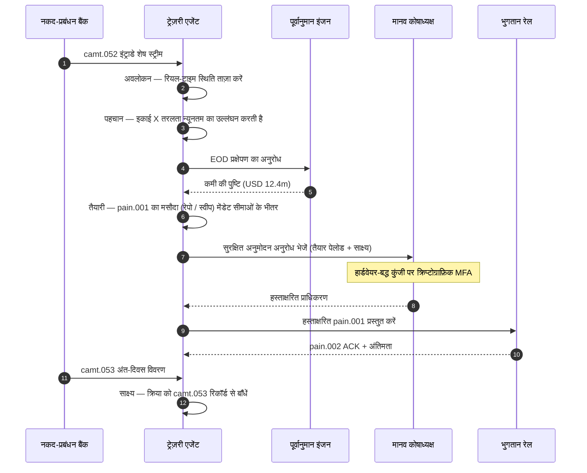

# 2026 में स्वायत्त ट्रेज़री सूचकांक: एजेंटिक ट्रेज़री, प्रोग्राम-योग्य तरलता, टोकनाइज़्ड जमा और रियल-टाइम नकद नियंत्रण

<!-- lead-start -->
<aside class="post-lead" aria-label="लेख सारांश">

<strong>संक्षेप में।</strong> 2026 का स्वायत्त ट्रेज़री सूचकांक — एजेंटिक कार्यप्रवाहों, प्रोग्राम-योग्य तरलता कवरेज, टोकनाइज़्ड जमा एकीकरण, रियल-टाइम भुगतान ऑर्केस्ट्रेशन और स्वचालित नकद नियंत्रण को एक ही परिचालन-मॉडल ताने-बाने के रूप में मापता है।

<strong>मुख्य निष्कर्ष</strong>

<ul class="post-lead-takeaways">
  <li><strong>ट्रेज़री एक रियल-टाइम ऑपरेटिंग सिस्टम बन रही है।</strong> स्थैतिक नकद पूर्वानुमान और बैच स्वीप अब मापन की इकाई नहीं हैं; रियल-टाइम डेटा पर चलने वाले एजेंटिक कार्यप्रवाह हैं।</li>
  <li><strong>प्रोग्राम-योग्य तरलता अब व्यावहारिक है।</strong> टोकनाइज़्ड जमा + रियल-टाइम रेल प्रति-घटना तरलता प्रावधान को कार्यप्रवाह प्रिमिटिव बनाते हैं, तिमाही पहल नहीं।</li>
  <li><strong>टोकनाइज़्ड जमा कोषाध्यक्ष की पसंदीदा डिजिटल मुद्रा हैं।</strong> बैंक-मुद्रा अर्थशास्त्र, प्रोग्रामेबिलिटी और इंट्राडे निश्चितता — स्थिर-मुद्रा के जारीकर्ता-जोखिम और रिज़र्व प्रश्नों के बिना।</li>
  <li><strong>कंट्रोल प्लेन ही नई ऑडिट सतह है।</strong> मेंडेट, सीमाएँ, मैनुअल ओवरराइड पथ और प्रत्यावर्तन साक्ष्य प्लेटफ़ॉर्म प्रिमिटिव के रूप में चलने चाहिए, प्रति-क्रिया मैनुअल अनुमोदन के रूप में नहीं।</li>
  <li><strong>CFO स्कोरकार्ड प्रति-निर्णय है, प्रति-तिमाही नहीं।</strong> नकद की लागत, इंट्राडे तरलता बफ़र में कमी, FX दक्षता और पूर्वानुमान सटीकता कार्यप्रवाह गति पर मापी जाती हैं।</li>
</ul>

<strong>संबंधित पठन:</strong> <a href="https://sebastienrousseau.com/hi/2026-05-25-programmable-liquidity-ai-tokenised-deposits-real-time-treasury-2026/index.html">2026 में प्रोग्राम-योग्य तरलता: AI, टोकनाइज़्ड जमा और रियल-टाइम ट्रेज़री ऑर्केस्ट्रेशन</a>, <a href="https://sebastienrousseau.com/hi/2026-05-21-tokenised-deposits-banking-services-status-2026/index.html">2026 में टोकनाइज़्ड जमा: बैंकिंग सेवाएँ, स्थिर-मुद्रा प्रतिस्पर्धा और प्रोग्राम-योग्य वाणिज्यिक बैंक-मुद्रा की स्थिति</a>।

</aside>
<!-- lead-end -->

स्वायत्त ट्रेज़री एजेंटिक AI, थोक भुगतान, टोकनाइज़्ड जमा और रियल-टाइम तरलता का स्वाभाविक मिलन-बिंदु है। 2026 में सर्वश्रेष्ठ ट्रेज़री वास्तुकला केवल नकद का पूर्वानुमान नहीं करेगी; वह खातों, मुद्राओं, रेलों और निपटान परिसंपत्तियों के पार सीमित तरलता क्रियाओं की अनुशंसा करेगी, उन्हें समझाएगी, और अंततः निष्पादित करेगी।

---

> **कार्यकारी सारांश / मुख्य निष्कर्ष**
>
> - **ट्रेज़री रिपोर्टिंग से नियंत्रण की ओर बढ़ रही है।** रियल-टाइम शेष, पूर्वानुमान, भुगतान स्थिति और तरलता संचलन एक ही कार्यप्रवाह का अंग बन रहे हैं।
> - **एजेंटिक AI एक नया ट्रेज़री इंटरफ़ेस बनाता है।** एजेंट स्थितियों की निगरानी कर सकते हैं, विसंगतियाँ उजागर कर सकते हैं, वित्तपोषण क्रियाएँ तैयार कर सकते हैं और परिभाषित मेंडेट के भीतर निर्णय बढ़ा सकते हैं।
> - **प्रोग्राम-योग्य मुद्रा नकद चरण को बदल देती है।** टोकनाइज़्ड जमा और थोक CBDC प्रयोग परमाण्विक निपटान, सशर्त भुगतान और सदा-चालू तरलता के लिए नई संभावनाएँ खोलते हैं।
> - **सूचकांक को प्राधिकार मापना चाहिए।** प्रश्न यह नहीं है कि क्या एजेंट किसी क्रिया का सुझाव दे सकता है; प्रश्न यह है कि क्या प्राधिकार, सीमाएँ, अनुमोदन और साक्ष्य स्पष्ट हैं।
> - **ट्रेज़री मूल्य मापने योग्य है।** बचाई गई तरलता, घटाई गई मैनुअल जाँचें, टली हुई निपटान विफलताएँ और मुक्त हुई कार्यशील पूँजी सफलता को परिभाषित करनी चाहिए।
>
---

## 2026 इस सूचकांक के मायने रखने का वर्ष क्यों है

Stanford AI सूचकांक उपयोगी है क्योंकि वह एक तेज़ी से बदलते प्रौद्योगिकी क्षेत्र को मापने योग्य वस्तु मानता है: अनुसंधान उत्पादन, तकनीकी प्रदर्शन, ज़िम्मेदार परिनियोजन, अर्थशास्त्र, क्षेत्र-अंगीकरण, नीति और जन-भावना — सबको एक ही फ्रेम में लाया जाता है ([Stanford HAI ⧉](https://hai.stanford.edu/ai-index/2026-ai-index-report "2026 AI सूचकांक रिपोर्ट"))। बैंकों और वित्तीय संस्थानों को अब अवसंरचना के लिए वही अनुशासन चाहिए। एजेंटिक AI, क्वांटम-सुरक्षित सुरक्षा, क्लाउड-नेटिव लचीलापन और थोक भुगतान अब अलग-अलग नवाचार पथ नहीं हैं; वे एक ही परिचालन मॉडल में मिल रहे हैं।

बैंक के लिए व्यावहारिक प्रश्न यह नहीं है कि प्रत्येक क्षेत्र महत्वपूर्ण है या नहीं। प्रश्न यह है कि क्या संस्थान सभी क्षेत्रों में एक साथ तत्परता माप सकता है। एक बैंक एजेंटिक AI परिनियोजित कर सकता है और फिर भी नाज़ुक रह सकता है यदि उसकी क्रिप्टोग्राफी माइग्रेशन-तैयार नहीं है। वह क्लाउड प्लेटफ़ॉर्म आधुनिक बना सकता है और फिर भी विफल हो सकता है यदि भुगतान डेटा असंरचित बना रहता है। वह टोकनीकरण पायलट चला सकता है और फिर भी प्रणालीगत जोखिम बना सकता है यदि निपटान, तरलता, पहचान और ऑडिट परतें एक साथ डिज़ाइन नहीं की गई हैं।

## 2026 सूचकांक वास्तुकला

| सूचकांक परत | 2026 दिशा | तत्परता मेट्रिक | कुप्रबंधन पर जोखिम |
|---|---|---|---|
| **दृश्यता** | खाता, भुगतान, तरलता और एक्सपोज़र डेटा का एकीकरण | रियल-टाइम नकद स्थितियों का कवरेज | खंडित नकद दृश्यता |
| **पूर्वानुमान** | शेष, प्रवाह और वित्तपोषण आवश्यकताओं के पूर्वानुमान के लिए AI का उपयोग | पूर्वानुमान सटीकता और अपवाद दर | कमज़ोर डेटा में मिथ्या विश्वास |
| **स्वायत्तता** | अनुशंसाओं और क्रियाओं के लिए एजेंटों को सीमित प्राधिकार | मेंडेट कवरेज और अनुमोदन गुणवत्ता | अनधिकृत या अस्पष्टीकृत क्रिया |
| **प्रोग्रामेबिलिटी** | जहाँ मूल्य जुड़े वहाँ टोकनाइज़्ड जमा और स्मार्ट शर्तों का उपयोग | सशर्त भुगतान और परमाण्विक निपटान उपयोग-मामले | प्रौद्योगिकी-नीत ट्रेज़री पायलट |
| **नियंत्रण** | सीमाएँ, प्रतिबंध, FX, तरलता और ऑडिट नियंत्रण अंतर्निहित | प्रति ट्रेज़री क्रिया नियंत्रण साक्ष्य | निष्पादन के बाद मैनुअल अभिशासन |

## ट्रैक करने योग्य वर्तमान संकेत

| संकेत | बैंकों के लिए इसका अर्थ | स्रोत |
|---|---|---|
| **वित्तीय सेवाओं में 52% एजेंटिक AI अंगीकरण** | ट्रेज़री अब अभिशासित प्लेटफ़ॉर्म के माध्यम से एजेंटिक कार्यप्रवाह अवशोषित कर सकती है | [Cambridge CCAF ⧉](https://www.jbs.cam.ac.uk/faculty-research/centres/alternative-finance/publications/2026-global-ai-in-financial-services-report/ "वित्तीय सेवाओं में AI पर 2026 वैश्विक रिपोर्ट") |
| **Project Agorá सशर्त भुगतान** | टोकनीकरण सशर्त और सदा-चालू भुगतान क्षमताएँ सक्षम कर सकता है | [BIS ⧉](https://www.bis.org/about/bisih/topics/fmis/agora.htm "Project Agorá") |
| **Bank of England — Digital Securities Sandbox** | DLT-निर्गत बॉन्ड और इक्विटी डिलीवरी-बनाम-भुगतान (DvP) आधार पर निपटान करते हैं — परिसंपत्ति चरण और नकद चरण (थोक CBDC या टोकनाइज़्ड वाणिज्यिक-बैंक जमा) एक ही परमाण्विक लेनदेन में निपटते हैं, जिससे मूलधन प्रतिपक्ष जोखिम समाप्त हो जाता है | [Bank of England ⧉](https://www.bankofengland.co.uk/financial-stability/digital-securities-sandbox "Digital Securities Sandbox") |
| **SWIFT संरचित पता समय-सीमा** | ट्रेज़री डेटा स्रोत पर ही सही ढंग से अभिग्रहीत होना चाहिए | [SWIFT ⧉](https://www.swift.com/news-events/news/iso-20022-milestone-november-2026-unstructured-addresses-be-removed "ISO 20022 नवंबर 2026 संरचित पता पड़ाव") |
| **बड़े FI AI मूल्य मापने में संघर्ष कर रहे हैं** | ट्रेज़री स्वचालन को ठोस आर्थिक मेट्रिक्स चाहिए | [Cambridge CCAF ⧉](https://www.jbs.cam.ac.uk/faculty-research/centres/alternative-finance/publications/2026-global-ai-in-financial-services-report/ "वित्तीय सेवाओं में AI पर 2026 वैश्विक रिपोर्ट") |

## ट्रेज़री एजेंट मेंडेट

ट्रेज़री एजेंट को सामान्य-प्रयोजन सहायक के रूप में डिज़ाइन नहीं किया जाना चाहिए। उसे एक मेंडेट चाहिए: खातों का अवलोकन करना, अपवादों का पता लगाना, वित्तपोषण अंतरालों का पूर्वानुमान करना, क्रियाएँ तैयार करना, अनुमोदन माँगना, सीमाओं के भीतर निष्पादन करना और साक्ष्य उत्पन्न करना। प्रत्येक चरण का प्राधिकार मॉडल भिन्न होना चाहिए।

नियंत्रण लूप अवलोकन → पहचान → पूर्वानुमान → तैयारी → अनुमोदन-अनुरोध चलाता है — और रुक जाता है। एजेंट क्रिप्टोग्राफ़िक प्राधिकरण सीमा को स्वयं कभी नहीं लाँघता। नीचे दिया गया आरेख एक पूर्ण चक्र का अनुसरण करता है: `camt.052` टेलीमेट्री में एक बहु-मिलियन-डॉलर इंट्राडे तरलता की कमी सामने आती है, एजेंट अंत-दिवस स्थिति का पूर्वानुमान करता है, एक रेपो या इंटरकंपनी स्वीप को पूरी तरह से निर्मित `pain.001` के रूप में तैयार करता है, और उसे हार्डवेयर-बद्ध कुंजी पर बहु-कारक क्रिप्टोग्राफ़िक हस्ताक्षर के लिए मानव कोषाध्यक्ष को सौंप देता है। एजेंट फिर हस्ताक्षरित पेलोड प्रस्तुत करता है; अंतिमता `pain.002` ACK और अगले `camt.053` रिकॉर्ड के रूप में आती है।

सीमा ही मुख्य बिंदु है — प्रत्येक क्रिया जो वास्तविक धन को संचालित करती है, एक क्रिप्टोग्राफ़िक गेट के पीछे बैठती है जिसे एजेंट अपने दम पर पार नहीं कर सकता।

## प्रोग्राम-योग्य तरलता

प्रोग्राम-योग्य तरलता शर्तों के अधीन मूल्य संचलन की क्षमता है: यदि सीमा का उल्लंघन हो, यदि संपार्श्विक पात्र हो, यदि प्रतिपक्ष स्क्रीनिंग में उत्तीर्ण हो, यदि निपटान अंतिमता उपलब्ध हो, या यदि इंट्राडे तरलता बफ़र बहुत निम्न हो। टोकनाइज़्ड जमा और थोक निपटान प्लेटफ़ॉर्म इन प्रतिमानों को अधिक व्यावहारिक बनाते हैं।

प्रोग्राम-योग्य का अर्थ मानक से बाहर नहीं है। निष्पादन पथ `pain.001` है — ISO 20022 कस्टमर क्रेडिट ट्रांसफ़र इनिशिएशन। एजेंट की तैयार क्रिया एक पूरी तरह से निर्मित `pain.001` पेलोड है जो बैंक को उसी चैनल में राउट की जाती है जिसमें कोई कॉर्पोरेट ERP प्रयोग करता, उसी स्कीमा के विरुद्ध मान्य की जाती है, उन्हीं फ़्रॉड और सैंक्शन इंजनों द्वारा स्कोर की जाती है, और उन्हीं `pain.002` स्थिति रिपोर्टों पर स्वीकृत की जाती है। सशर्तता परत (सीमा, संपार्श्विक पात्रता, अंतिमता उपलब्धता, बफ़र न्यूनतम) संदेश के ऊपर रहती है — यह यह तय करती है कि *क्या* `pain.001` भेजा जाए, *किस रूप में* नहीं। जो ट्रेज़री प्लेटफ़ॉर्म शर्तों को व्यक्त करने के लिए कस्टम पेलोड गढ़ते हैं वे बैंक-उपभोग्य पथ से बाहर होकर द्विपक्षीय एकीकरण में वापस गिर जाएँगे।

## ट्रेज़री कंट्रोल रूम

परिचालन मॉडल एक कंट्रोल रूम जैसा दिखना चाहिए: स्थितियाँ, पूर्वानुमान, भुगतान अवस्थाएँ, सीमा उपयोग, अपवाद, अनुमोदन और साक्ष्य — सब एक ही इंटरफ़ेस में। सूचकांक को उन ट्रेज़री स्टैक को दंडित करना चाहिए जो दलों से ईमेल, स्प्रेडशीट, बैंक पोर्टल और असंबद्ध डैशबोर्ड जोड़ने की माँग करते हैं।

उस इंटरफ़ेस के पीछे का डेटा-प्लेन ISO 20022 कैश मैनेजमेंट है। इंट्राडे स्थिति `camt.052` है — बैंक-टू-कस्टमर अकाउंट रिपोर्ट — जो प्रत्येक नकद-प्रबंधन बैंक से एजेंट की अवलोकन परत में बैंक द्वारा प्रकाशित आवृत्ति पर स्ट्रीम होती है (टियर-1 GTB प्रदाताओं के लिए मिनटों में, लंबी पूँछ के लिए चक्र-अंत पर)। अंत-दिवस समाधान `camt.053` है — बैंक-टू-कस्टमर स्टेटमेंट — वह ऑडिट-योग्य रिकॉर्ड जिसके विरुद्ध एजेंट के पूर्वानुमान को अगली सुबह आंका जाता है। जो ट्रेज़री प्लेटफ़ॉर्म PDF स्टेटमेंट पढ़ते हैं या बैंक पोर्टल स्क्रीन-स्क्रैप करते हैं वे सूचकांक के 「स्तर 4」 तक नहीं पहुँच सकते; इंट्राडे टेलीमेट्री को संरचित `camt.052` के रूप में आना ही होगा ताकि पूर्वानुमान लूप समय पर बंद होकर कार्रवाई कर सके।

## बैंक प्रकार के अनुसार इसका अर्थ

### वैश्विक प्रणालीगत महत्व वाले बैंक

वैश्विक बैंकों को इस सूचकांक को उद्यम वास्तुकला स्कोरकार्ड के रूप में देखना चाहिए। प्राथमिकता एक और प्रूफ़-ऑफ़-कॉन्सेप्ट नहीं है; प्राथमिकता वह साक्ष्य है कि स्वायत्त कार्यप्रवाह, क्रिप्टोग्राफ़िक माइग्रेशन, क्लाउड निर्भरता और भुगतान आधुनिकीकरण को एक ही जोखिम-व-मूल्य प्रणाली के रूप में अभिशासित किया जा सके।

### लेन-देन बैंक और कॉर्पोरेट बैंक

लेन-देन बैंकों को थोक भुगतान, संरचित डेटा, तरलता, टोकनाइज़्ड जमा और एजेंटिक ट्रेज़री सेवाओं पर ध्यान केंद्रित करना चाहिए। सबसे मूल्यवान क्लाइंट प्रस्ताव केवल तेज़ मुद्रा संचलन नहीं है; वह व्याख्या-योग्य, ऑडिट-योग्य, प्रोग्राम-योग्य मुद्रा संचलन है जिसमें कम जाँचें और बेहतर कार्यशील-पूँजी दृश्यता हो।

### क्षेत्रीय बैंक

क्षेत्रीय बैंकों को कार्यक्रम-विस्तार से बचने के लिए सूचकांक का उपयोग करना चाहिए। उन्हें प्रत्येक मोर्चे का नेतृत्व करने की आवश्यकता नहीं है, लेकिन उन्हें AI अभिशासन, पोस्ट-क्वांटम सूची, क्लाउड निकास साक्ष्य और भुगतान डेटा तत्परता पर विश्वसनीय स्थितियाँ चाहिए।

### फिनटेक, PSP और अवसंरचना प्रदाता

फिनटेक और अवसंरचना प्रदाताओं को अपने उत्पाद रोडमैप को मापने योग्य बैंक तत्परता के साथ संरेखित करना चाहिए। सर्वश्रेष्ठ प्रस्ताव एकीकरण जोखिम घटाएँगे, साक्ष्य को सुदृढ़ करेंगे और जटिल अवसंरचना को बैंकों के लिए अभिशासित करना सरल बनाएँगे।

## निष्कर्ष

सूचकांक-शैली रिपोर्ट का मूल्य यह है कि वह एक खंडित प्रौद्योगिकी कार्यसूची को मापने योग्य परिचालन मॉडल में परिवर्तित करती है। 2026 में वित्तीय अवसंरचना के विजेता सबसे अधिक पायलट वाले संस्थान नहीं होंगे। वे वे संस्थान होंगे जो स्वायत्तता, सुरक्षा, लचीलापन, निपटान, अर्थशास्त्र और अभिशासन में एक साथ तत्परता सिद्ध कर सकते हैं।

## अक्सर पूछे जाने वाले प्रश्न

**स्वायत्त ट्रेज़री क्या है?**

स्वायत्त ट्रेज़री परिभाषित नियंत्रणों के भीतर ट्रेज़री क्रियाओं की निगरानी, अनुशंसा और संभावित निष्पादन के लिए AI एजेंटों, रियल-टाइम डेटा और प्रोग्राम-योग्य भुगतान का उपयोग है।

**क्या ट्रेज़री एजेंटों को भुगतान निष्पादित करने की अनुमति दी जानी चाहिए?**

केवल संकीर्ण मेंडेट, सुदृढ़ सीमाओं, स्पष्ट अनुमोदन और पूर्ण ऑडिट-योग्यता के भीतर। निष्पादन प्राधिकार परिपक्वता के माध्यम से अर्जित किया जाना चाहिए।

**टोकनाइज़्ड जमा ट्रेज़री की कैसे सहायता करते हैं?**

वे प्रोग्राम-योग्य निपटान, परमाण्विक निष्पादन और संभावित रूप से बेहतर इंट्राडे तरलता नियंत्रण का समर्थन कर सकते हैं, साथ ही वाणिज्यिक-बैंक मुद्रा संबंधों को संरक्षित कर सकते हैं।

**पहला कार्यान्वयन कदम क्या है?**

स्वायत्तता प्रदान करने से पहले रियल-टाइम दृश्यता और डेटा गुणवत्ता का निर्माण करें। एजेंट उस नकद को सुरक्षित रूप से अनुकूलित नहीं कर सकते जिसे वे सटीक रूप से देख नहीं सकते।

## संदर्भ

- Cambridge Centre for Alternative Finance, (2026). [वित्तीय सेवाओं में AI पर 2026 वैश्विक रिपोर्ट ⧉](https://www.jbs.cam.ac.uk/faculty-research/centres/alternative-finance/publications/2026-global-ai-in-financial-services-report/ "वित्तीय सेवाओं में AI पर 2026 वैश्विक रिपोर्ट").
- SWIFT, (2026). [ISO 20022 नवंबर 2026 संरचित पता पड़ाव ⧉](https://www.swift.com/news-events/news/iso-20022-milestone-november-2026-unstructured-addresses-be-removed "ISO 20022 नवंबर 2026 संरचित पता पड़ाव").
- BIS Innovation Hub, (2026). [Project Agorá ⧉](https://www.bis.org/about/bisih/topics/fmis/agora.htm "Project Agorá").
- Bank of England, (2026). [UK के डिजिटल वित्तीय भविष्य को आकार देना ⧉](https://www.bankofengland.co.uk/speech/2025/january/sasha-mills-speech-at-the-tokenisation-summit "UK के डिजिटल वित्तीय भविष्य को आकार देना").

<!-- enrich-start -->
<aside class="author-card" aria-label="लेखक के बारे में"><strong class="author-card-name"><a href="/about/index.html">सेबास्तियन रूसो</a></strong>वरिष्ठ बैंकिंग प्रौद्योगिकीविद् जो प्रयोज्य AI, भुगतान अवसंरचना, टोकनीकृत मुद्रा, ISO 20022, पोस्ट-क्वांटम सुरक्षा, क्लाउड-नेटिव वित्तीय सेवाओं और विनियमित डिजिटल बाज़ारों पर लिखते हैं।HSBC Commercial &amp; Investment Bank, PayPal, Barclays, Shazam, AKQA, Virgin Group में 20+ वर्षों का अनुभव। <a href="/about/index.html">पूर्ण प्रोफ़ाइल</a> &middot; <a href="https://www.linkedin.com/in/sebastienrousseau/" rel="external noopener">LinkedIn</a> &middot; <a href="https://github.com/sebastienrousseau" rel="external noopener">GitHub</a></aside>

अंतिम समीक्षा <time datetime="2026-06-07">2026-06-07</time>।

<!-- enrich-end -->
