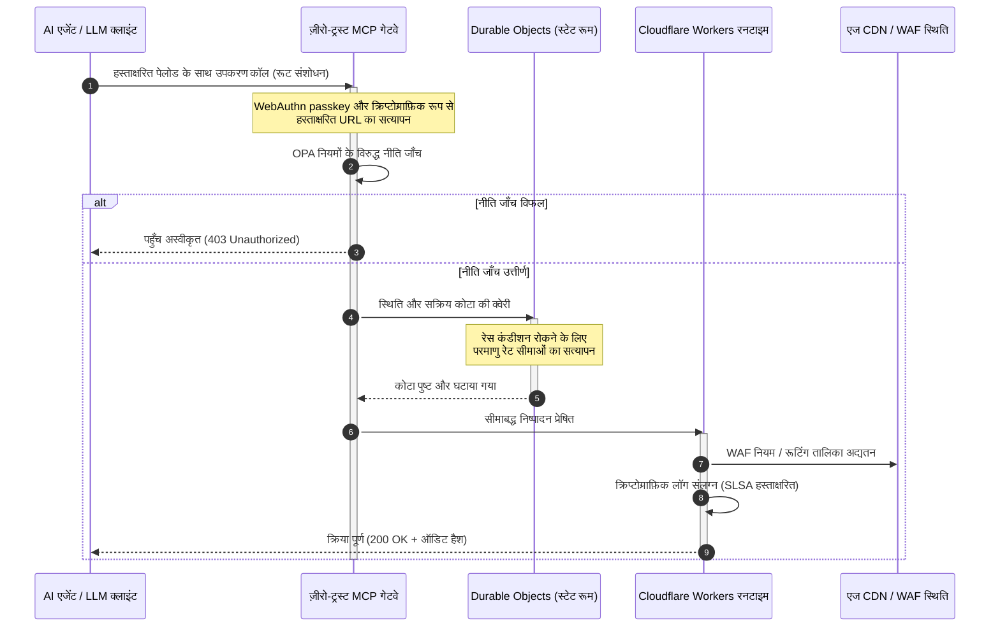

# CloudCDN: 2026 में AI-नेटिव एज का ओपन सोर्स ब्लूप्रिंट

<!-- lead-start: manual -->
<aside class="post-lead" aria-label="लेख सारांश">

<strong>संक्षेप में।</strong> 2026 में उद्यम प्रौद्योगिकी को वैश्विक रूप से वितरित सर्वरलेस निष्पादन और एजेंटिक AI का संगम परिभाषित करता है। मानक CDN — स्थैतिक फ़ाइल कैशिंग और बुनियादी ट्रैफ़िक रूटिंग के लिए बने — सक्रिय, वास्तविक-समय डेटा ऑर्केस्ट्रेशन के युग में संरचनात्मक रूप से अप्रचलित हैं। CloudCDN एक ओपन सोर्स ब्लूप्रिंट है जो एज को सक्रिय नियंत्रण तल में रूपांतरित करता है: सर्वरलेस रनटाइम, Cloudflare Durable Objects के माध्यम से स्थितियुक्त समन्वय, और एक ज़ीरो-ट्रस्ट Model Context Protocol (MCP) गेटवे जो स्वायत्त AI एजेंटों को सीमाबद्ध, क्रिप्टोग्राफ़िक रूप से सुरक्षित परिचालन दायरों के भीतर वेब अवसंरचना संचालित करने देता है।

<strong>मुख्य निष्कर्ष</strong>

<ul class="post-lead-takeaways">
  <li><strong>स्थैतिक कैश से सीमाबद्ध नियंत्रण तल तक।</strong> CloudCDN परिचालन सीमा को एज पर ले जाता है और CDN नोड्स को सक्रिय नीति द्वारों में बदल देता है, जो एक मिलीसेकंड से कम में सुरक्षा, रूटिंग और पहुँच-नियंत्रण निर्णय निष्पादित करते हैं।</li>
  <li><strong>स्थितियुक्त एज समन्वय।</strong> Cloudflare Durable Objects वैश्विक स्तर पर परमाणु, वास्तविक-समय रेट लिमिटिंग और स्थिति समन्वय प्रवर्तित करते हैं — न कोई वितरित रेस कंडीशन, न एज क्षेत्रों के बीच प्रणालीगत कोटा दुरुपयोग।</li>
  <li><strong>MCP के माध्यम से सुरक्षित एजेंटिक अवसंरचना प्रबंधन।</strong> एक ज़ीरो-ट्रस्ट गेटवे 42 विशेषीकृत MCP उपकरण उद्भासित करता है, जिससे AI एजेंट क्रिप्टोग्राफ़िक रूप से हस्ताक्षरित सीमाओं के तहत अवसंरचना का निरीक्षण, विन्यास और संचालन कर सकते हैं।</li>
  <li><strong>आपूर्ति-शृंखला सुरक्षा पाइपलाइन के डिलिवरेबल के रूप में।</strong> Sigstore/Cosign के माध्यम से SLSA Level 3 बिल्ड उत्पत्ति-प्रमाण और हर रिलीज़ पर 100% कवरेज वाले 3,185 यूनिट परीक्षण।</li>
  <li><strong>डैशबोर्ड नहीं, बोर्ड-स्तरीय साक्ष्य।</strong> एज टेलीमेट्री सीधे DORA अनुच्छेद 5 की बोर्ड जवाबदेही, BCBS 239 जोखिम रिपोर्टिंग और Basel III परिचालन-जोखिम पूँजी नियमों से मैप होती है।</li>
</ul>

<strong>संबंधित पठन:</strong> <a href="/2026-05-16-best-cloud-infrastructure-architecture-2026/">2026 की सर्वश्रेष्ठ क्लाउड अवसंरचना वास्तुकला</a> · <a href="/2026-06-05-cloud-native-banking-index-dora-resilience-platform-engineering-2026/">क्लाउड नेटिव बैंकिंग इंडेक्स 2026</a> · <a href="/2026-06-03-agentic-ai-index-banks-autonomy-governance-auditability-2026/">बैंकों के लिए एजेंटिक AI इंडेक्स 2026</a>।

</aside>
<!-- lead-end -->

CDN की बहस समाप्त हो चुकी है। एज अब कैश नहीं है; वह AI-नेटिव सॉफ़्टवेयर का नियंत्रण तल है। जैसे-जैसे एजेंट उपकरण कॉल करते हैं, डेटा स्थानांतरित करते हैं, कैश पर्ज करते हैं, हस्ताक्षरित URL माँगते हैं और कार्यप्रवाह समन्वित करते हैं, अपारदर्शी डैशबोर्ड और स्वामित्व वाले नियंत्रण तलों का पुराना मॉडल असुविधा भर नहीं रहता — वह नियामक दायित्व बन जाता है। CloudCDN एक भिन्न मॉडल का पक्ष रखता है: एक खुला, निरीक्षण योग्य, एजेंट-नियंत्रणीय एज प्लेटफ़ॉर्म जो सुरक्षा, सुगम्यता, प्रदर्शन और ऑडिट योग्यता को विक्रेता वादों के बजाय प्रवर्तनीय डिफ़ॉल्ट के रूप में मानता है।

इस लेख का ओपन सोर्स संदर्भ बिंदु है [cloudcdn.pro ⧉](https://github.com/sebastienrousseau/cloudcdn.pro "cloudcdn.pro")। रिपॉज़िटरी एक मल्टी-टेनेंट, AI-नेटिव CDN है जिसे अंत-से-अंत तक पढ़ा और स्वतंत्र रूप से तैनात किया जा सकता है: Cloudflare PoPs पर 100ms से कम TTFB, MCP नियंत्रण, Durable Objects रेट लिमिटिंग, WCAG-AA सुगम्यता, हस्ताक्षरित URL, passkeys, SLSA Level 3 और 100% कवरेज पर 3,185 परीक्षण।

---

> **कार्यकारी सारांश / मुख्य निष्कर्ष**
>
> - **एज परिचालन सीमा बन जाता है।** CloudCDN मानक CDN नोड्स को सक्रिय नीति द्वारों में बदल देता है जो एक मिलीसेकंड से कम में सुरक्षा, रूटिंग और पहुँच नियंत्रण निष्पादित करते हैं।
> - **Durable Objects रेट लिमिटिंग को परमाणु बनाते हैं।** वास्तविक-समय, वैश्विक रूप से सुसंगत कोटा प्रवर्तन उस रेस-कंडीशन खिड़की को बंद कर देता है जिसे अंततः-सुसंगत लिमिटर हमलावरों और दोषपूर्ण एजेंटों के लिए खुला छोड़ देते हैं।
> - **एजेंट 42 सीमाबद्ध MCP उपकरणों के माध्यम से अवसंरचना संचालित करते हैं।** हर आह्वान निष्पादन से पहले WebAuthn passkeys, हस्ताक्षरित पेलोड और OPA नीति के विरुद्ध सत्यापित होता है।
> - **आपूर्ति शृंखला उत्पाद का अंग है।** Sigstore/Cosign के माध्यम से SLSA Level 3 उत्पत्ति-प्रमाण हर रिलीज़ को उसके ऑडिटेड स्रोत से क्रिप्टोग्राफ़िक रूप से जोड़ता है।
> - **टेलीमेट्री ही अनुपालन साक्ष्य है।** एज संचालन DORA अनुच्छेद 5, BCBS 239 और Basel III परिचालन-जोखिम पूँजी से मैप होते हैं — सीधे, बाद की रिपोर्टिंग के माध्यम से नहीं।
>
---

## यह ओपन सोर्स परियोजना 2026 में क्यों मायने रखती है

2026 में उद्यम IT स्थैतिक अवसंरचना प्रावधान से वास्तविक-समय, घटना-चालित डेटा ऑर्केस्ट्रेशन की ओर बढ़ चुका है। दो बाज़ार शक्तियाँ इस बदलाव को चलाती हैं।

पहली है एजेंटिक AI का प्रसार। स्वायत्त मॉडल और सॉफ़्टवेयर एजेंट अब जटिल परिचालन कार्य निष्पादित करते हैं — स्वचालित ख़तरा शमन, रूटिंग निर्णय, वास्तविक-समय लेजर संतुलन। वे डैशबोर्ड उपयोग नहीं करते। वे उपकरण कॉल करते हैं।

दूसरी है [डिजिटल परिचालन लचीलापन अधिनियम (DORA) ⧉](https://eur-lex.europa.eu/legal-content/EN/TXT/?uri=CELEX%3A32022R2554 "वित्तीय क्षेत्र के लिए डिजिटल परिचालन लचीलेपन पर विनियम (EU) 2022/2554") का सक्रिय प्रवर्तन। बैंकिंग संस्थान अब अपारदर्शी, स्वामित्व वाले तृतीय-पक्ष CDN पर निर्भर नहीं रह सकते। नियामक सॉफ़्टवेयर आपूर्ति शृंखला में पूर्ण दृश्यता, सत्यापन योग्य निकास क्षमता और अपरिवर्तनीय क्रिप्टोग्राफ़िक ऑडिट निशान की माँग करते हैं।

केंद्रीकृत सर्वर वास्तुकलाएँ ऐसी विलंबता लागत थोपती हैं जिसे वास्तविक-समय ऑर्केस्ट्रेशन वहन नहीं कर सकता। स्वामित्व वाले CDN ब्लैक बॉक्स की तरह काम करते हैं और संस्थानों को ऐसी आपूर्ति-शृंखला सेंधमारी के सामने रखते हैं जिसे वे देख तक नहीं सकते, साक्ष्य देना तो दूर। CloudCDN उस अंतर को एक पारदर्शी, ज़ीरो-ट्रस्ट, ओपन सोर्स ब्लूप्रिंट से भरता है जो एज को सक्रिय नियंत्रण तल में बदल देता है। प्रौद्योगिकी अधिशासियों के लिए यह बातचीत को अनुपालन की लागत से Return on Resilience की ओर ले जाता है: स्वचालित, ऑडिट-तैयार परिचालन पाइपलाइनों से संरक्षित पूँजी।

## वास्तुकला दृष्टि

CloudCDN वास्तुकला पाँच परतों में संरचित है और केंद्रीकृत मिडलवेयर की जगह स्थानीयकृत, स्थितियुक्त एज प्रिमिटिव रखती है:

| परत | डिज़ाइन निर्णय | यह क्यों मायने रखता है | कुप्रबंधन पर जोखिम |
|---|---|---|---|
| **एज रनटाइम** | Cloudflare Workers और Pages | केंद्रीकृत VM विलंबता समाप्त करता है; वैश्विक स्तर पर एक मिलीसेकंड से कम में नीतियाँ निष्पादित करता है | नीति अनुशासन के बिना प्रदर्शन लाभ अराजक एज बहाव पैदा करते हैं |
| **स्थिति समन्वय** | Durable Objects | क्षेत्रों के बीच रेट सीमाओं और साझा स्थिति के लिए परमाणु, वास्तविक-समय सुसंगति की गारंटी देता है | वितरित रेस कंडीशन, API संसाधन दुरुपयोग, परिधि कोटा का उल्लंघन |
| **एजेंट इंटरफ़ेस** | ज़ीरो-ट्रस्ट MCP गेटवे | 42 विशेषीकृत MCP उपकरण उद्भासित करता है ताकि AI एजेंट शासित सीमाओं के तहत अवसंरचना संचालित करें | असीमित उपकरण आह्वान और अनधिकृत विन्यास परिवर्तन |
| **पहुँच नियंत्रण** | WebAuthn passkeys और हस्ताक्षरित URL | ऑडिट योग्य संचालन के लिए स्थैतिक पासवर्ड की जगह क्रिप्टोग्राफ़िक हस्ताक्षर रखता है | कमज़ोर रूप से जिम्मेदार ठहराए गए परिवर्तन; क्रेडेंशियल चोरी से परिधि में सेंध |
| **गुणवत्ता द्वार** | SLSA Level 3 और 100% परीक्षण कवरेज | बिल्ड स्रोत का गणितीय सत्यापन करता है; दुर्भावनापूर्ण निर्भरता इंजेक्शन रोकता है | सॉफ़्टवेयर आपूर्ति शृंखला से प्रविष्ट दुर्भावनापूर्ण कोड |

## नज़र रखने योग्य परिचालन संकेत

एज की तैयारी मापनीय है। ये वे मात्रात्मक संकेतक हैं जो इरादे के बजाय निष्पादन क्षमता प्रमाणित करते हैं:

| संकेत | मीट्रिक / बेंचमार्क | नियामक संदर्भ | प्लेटफ़ॉर्म कार्यान्वयन |
|---|---|---|---|
| **42 MCP उपकरण** | स्वचालित प्रबंधन के लिए सीमाबद्ध उपकरण-रजिस्ट्री गणना | COBIT 2019 (BAI06) | MCP गेटवे जो OPA नीतियों के विरुद्ध एजेंट हस्ताक्षर सत्यापित करता है |
| **Durable Objects** | शून्य-रिसाव, एक मिलीसेकंड से कम में परमाणु कोटा प्रवर्तन | DORA अनुच्छेद 6 | वैश्विक API कोटा स्थिति ट्रैक करते Durable Objects |
| **Passkeys और हस्ताक्षरित URL** | 100% व्यवस्थापक सत्र FIDO2 WebAuthn से सत्यापित | DORA अनुच्छेद 30 | एज राउटर में अंतर्निहित क्रिप्टोग्राफ़िक हस्ताक्षर जाँच |
| **SLSA Level 3** | क्रिप्टोग्राफ़िक रूप से हस्ताक्षरित बिल्ड मैनिफ़ेस्ट (Sigstore) | DORA अनुच्छेद 30 | हस्ताक्षरित बिल्ड मेटाडेटा बनाती GitHub Actions पाइपलाइनें |
| **3,185 यूनिट परीक्षण** | 100% कवरेज; हर रिलीज़ पर रिग्रेशन द्वार | NIST CSF 2.0 (PR.DS-01) | किसी भी परीक्षण विफलता पर तैनाती रोकती CI पाइपलाइनें |

## CDN एक सक्रिय नियंत्रण तल बन जाता है

पारंपरिक CDN निष्क्रिय, स्थैतिक सामग्री त्वरण के इर्द-गिर्द डिज़ाइन किए गए थे। CloudCDN इस मॉडल को पुनर्परिभाषित करता है। Cloudflare Workers और Durable Objects के एकीकरण के साथ एज एक सक्रिय, स्थितियुक्त नीति द्वार के रूप में काम करता है।

जब कोई AI एजेंट या स्वचालित प्रक्रिया अवसंरचना विन्यास परिवर्तन या रूटिंग समायोजन का अनुरोध करती है, तो वह किसी असुरक्षित, केंद्रीकृत डेटाबेस से बात नहीं करती। अनुरोध निकटतम एज नोड पर रोका जाता है और निष्पादन से पहले पहचान, नीति और कोटा जाँच से गुज़ारा जाता है:

उस अनुक्रम का हर चरण एक जिम्मेदार ठहराने योग्य, हस्ताक्षरित अभिलेख बनाता है। यही अंतर है सामग्री तेज़ करने वाले CDN और शासित किए जा सकने वाले नियंत्रण तल के बीच।

## ओपन सोर्स विश्वास मॉडल को क्यों बदलता है

मुख्य सूचना सुरक्षा अधिकारियों के लिए अपारदर्शी स्वामित्व वाले CDN एक संचयी जोखिम हैं। बंद-स्रोत एज नेटवर्क ब्लैक बॉक्स हैं: यदि विक्रेता को आंतरिक सेंधमारी झेलनी पड़े, तो बैंक के पास सार्वजनिक प्रकटीकरण तक शून्य दृश्यता रहती है।

CloudCDN उस विषमता की जगह तीन तंत्रों पर बना, पूर्णतः ऑडिट योग्य ओपन सोर्स विश्वास मॉडल रखता है:

1. **गणितीय बिल्ड उत्पत्ति-प्रमाण।** SLSA Level 3 के तहत हर रिलीज़ अपनी ओपन सोर्स GitHub रिपॉज़िटरी से क्रिप्टोग्राफ़िक रूप से जुड़ी होती है। CISO सत्यापित कर सकता है — गणितीय रूप से, अनुबंध के भरोसे नहीं — कि Cloudflare के वैश्विक एज नोड्स पर चल रही बाइनरी में ठीक वही ऑडिटेड स्रोत कोड है।
2. **निरंतर, सार्वजनिक सुरक्षा ऑडिट।** कोडबेस स्वचालित स्कैन, सार्वजनिक भेद्यता प्रकटीकरण और सहकर्मी-समीक्षित कोड ऑडिट से गुज़रता है। अस्पष्टता कोई नियंत्रण नहीं है; समीक्षा है।
3. **कोई विक्रेता लॉक-इन नहीं (DORA अनुच्छेद 28)।** DORA बैंकों से महत्वपूर्ण तृतीय-पक्ष प्रदाताओं से स्पष्ट, परीक्षित निकास रणनीति प्रमाणित करने की माँग करता है। चूँकि CloudCDN ओपन सोर्स है और मानक सर्वरलेस प्रिमिटिव पर बना है, संस्थान एज विन्यास Cloudflare से अन्य सर्वरलेस रनटाइम या निजी Kubernetes क्लस्टरों में स्थानांतरित कर सकते हैं — और वह क्षमता नियामक के सामने प्रमाणित कर सकते हैं।

## बैंक-ग्रेड एज पैटर्न

CloudCDN वैश्विक वित्तीय क्षेत्र के अनुपालन मानकों के लिए अभियांत्रित है और तकनीकी एज संचालन को सीधे उन ढाँचों से मैप करता है जिनकी पर्यवेक्षक वास्तव में जाँच करते हैं:

- **मॉडल जोखिम प्रबंधन ([US Fed SR 11-7 ⧉](https://www.federalreserve.gov/supervisionreg/srletters/sr1107.htm "Supervisory Guidance on Model Risk Management") / UK PRA SS1/23)।** परिचालन कार्य निष्पादित करने वाले स्वायत्त मॉडल मॉडल-जोखिम अभिशासन के अंतर्गत आते हैं। CloudCDN का MCP गेटवे एजेंटिक उपकरणों को मात्रात्मक मॉडल की तरह मानता है: कठोर नीति सीमाएँ, वास्तविक-समय लॉगिंग और उच्च-प्रभाव क्रियाओं के लिए अनिवार्य ह्यूमन-इन-द-लूप ओवरराइड।
- **BCBS 239 (जोखिम डेटा एकत्रीकरण)।** एज पर लेनदेन डेटा को कैप्चर, टैग और संरचित करने से परिचालन मीट्रिक वास्तविक समय में बनते हैं — डेटा अखंडता, समयबद्धता और नियामक अनुरेखणीयता की BCBS 239 आवश्यकताओं के अनुरूप।
- **DORA अनुच्छेद 5 (बोर्ड जवाबदेही)।** परिचालन लचीलेपन का अंतिम व्यक्तिगत दायित्व बोर्ड पर है। CloudCDN एज टेलीमेट्री को परिमाणित, सत्यापन योग्य साक्ष्य में बदल देता है जिसे गैर-तकनीकी निदेशक व्यक्तिगत-दायित्व ऑडिट में ले जा सकते हैं।
- **Basel III परिचालन-जोखिम पूँजी।** बैंक परिचालन जोखिम के विरुद्ध नियामक पूँजी रखते हैं। स्वचालित DR फ़ेलओवर और SLSA Level 3 उत्पत्ति-प्रमाण संस्थान का परिचालन जोखिम प्रोफ़ाइल घटाते हैं — बैलेंस शीट पर पूँजी संरक्षित करते हुए, केवल ऑडिट संतुष्ट करते हुए नहीं।

## बैंक प्रकार के अनुसार इसका अर्थ

### वैश्विक प्रणालीगत रूप से महत्वपूर्ण बैंक (G-SIB)

G-SIB कई क्षेत्राधिकारों में विशाल लेनदेन मात्राएँ चलाते हैं। प्राथमिकता है खंडित विरासती परिधि नियंत्रणों की जगह एकल, एकीकृत एज तल रखना। CloudCDN पैटर्न तैनात करने से G-SIB सुरक्षा नीतियाँ, API गेटवे और एजेंटिक अभिशासन वैश्विक रूप से मानकीकृत कर सकता है — और DORA-अनुरूप साक्ष्य पाइपलाइनें तिमाही भागदौड़ के बजाय संचालन के उप-उत्पाद के रूप में बना सकता है।

### ट्रांज़ैक्शन और कॉर्पोरेट बैंक

ट्रांज़ैक्शन बैंकों के लिए ग्राहक-मुखी उत्पाद निष्पादन गति, सुरक्षा और डेटा पारदर्शिता का समुच्चय है। CloudCDN पैटर्न इन बैंकों को कॉर्पोरेट ट्रेज़रर्स के सामने सुरक्षित API डैशबोर्ड और वास्तविक-समय नकदी-ट्रैकिंग सेवाएँ उद्भासित करने देता है — एक लचीली एज मुद्रा जो उद्यम जमाओं की रक्षा करती है।

### क्षेत्रीय और छोटे बैंक

क्षेत्रीय बैंक G-SIB जैसे ही ख़तरा अभिकर्ताओं का सामना करते हैं, पर अभियांत्रिकी बजट के बिना। एक ओपन सोर्स, बैंक-ग्रेड एज ब्लूप्रिंट नियंत्रण तैयार रूप में देता है: स्वामित्व लाइसेंस लागत के बिना तत्काल नियामक संरेखण, और उसे सिद्ध करने के लिए स्रोत कोड।

## बोर्डरूम प्लेबुक

परिचालन लचीलापन अब बैक-ऑफ़िस की अदृश्य IT मीट्रिक नहीं है; यह व्यक्तिगत दायित्व से जुड़ी बोर्डरूम प्राथमिकता है। 2026 में नियामकों, ग्राहकों और शेयरधारकों का भरोसा बनाए रखने वाले संस्थान प्रौद्योगिकी को सत्यापन योग्य, अवलोकनीय परिसंपत्ति की तरह बरतते हैं।

वरिष्ठ प्रौद्योगिकी नेताओं के लिए रोडमैप छोटा है:

1. **साक्ष्य को उत्पाद के रूप में अनिवार्य करें।** एज पर स्वचालित, स्व-प्रलेखित पाइपलाइनों के लिए बजट रखें — संचालन से उत्पन्न साक्ष्य, ऑडिटर के लिए जोड़े गए नहीं।
2. **स्थितियुक्त एज नियंत्रण अपनाएँ।** रेट लिमिटिंग, WAF और पहचान सत्यापन को केंद्रीकृत सर्वरों से हटाकर परमाणु एज प्रिमिटिव पर ले जाएँ।
3. **क्रिप्टोग्राफ़िक एजेंटिक सीमाएँ स्थापित करें।** हर स्वचालित उपकरण आह्वान के लिए passkey और OPA सत्यापन वाले ज़ीरो-ट्रस्ट MCP गेटवे प्रवर्तित करें।
4. **ओपन सोर्स बिल्ड ऑडिट अनिवार्य करें।** SLSA Level 3 बिल्ड उत्पत्ति-प्रमाण को तैनाती की शर्त बनाएँ, आकांक्षा नहीं।

## अक्सर पूछे जाने वाले प्रश्न

**क्या CloudCDN DORA ऑडिट के लिए तैयार है?**

हाँ। CloudCDN ऐसे स्वचालित अनुपालन साक्ष्य बनाने के लिए अभियांत्रित है जो Register of Information के ITS टेम्पलेट्स (RT.01 से RT.15) और DORA अनुच्छेद 30 के संविदात्मक खंडों से सीधे मैप होते हैं।

**रेट लिमिटिंग के लिए Durable Objects का लाभ क्या है?**

पारंपरिक वितरित रेट लिमिटर अंततः-सुसंगति पर टिके होते हैं, जो ऐसी विलंबता खिड़की छोड़ती है जिसका हमलावर या दोषपूर्ण एजेंट दुरुपयोग कर सकते हैं। Durable Objects वैश्विक स्तर पर तत्काल, परमाणु सुसंगति की गारंटी देते हैं और रेस-कंडीशन खिड़की पूरी तरह बंद कर देते हैं।

**CloudCDN को AI-नेटिव क्या बनाता है?**

इसके MCP-नियंत्रित संचालन और एजेंट-जागरूक नियंत्रण मॉडल। अवसंरचना 42 शासित उपकरणों के माध्यम से क्रिप्टोग्राफ़िक पहचान और नीति सीमाओं के साथ संचालित होती है — स्वायत्त कार्यप्रवाहों के लिए डिज़ाइन की गई, केवल मानव डैशबोर्ड के लिए नहीं।

**क्या ओपन सोर्स कोड ज़ीरो-डे एक्सप्लॉइट का जोखिम बढ़ाता है?**

नहीं। स्वामित्व वाले, बंद-स्रोत CDN अस्पष्टता के सहारे सुरक्षा पर निर्भर हैं। CloudCDN का कोडबेस निरंतर स्वचालित परीक्षण, सार्वजनिक सहकर्मी समीक्षा और SLSA Level 3 सत्यापन से गुज़रता है — एक सत्यापन योग्य रूप से उच्चतर विश्वास सीमा।

## संदर्भ

- यूरोपीय संसद और यूरोपीय संघ की परिषद, (2022). [वित्तीय क्षेत्र के लिए डिजिटल परिचालन लचीलेपन पर विनियम (EU) 2022/2554 (DORA) ⧉](https://eur-lex.europa.eu/legal-content/EN/TXT/?uri=CELEX%3A32022R2554 "वित्तीय क्षेत्र के लिए डिजिटल परिचालन लचीलेपन पर विनियम (EU) 2022/2554 (DORA)")। ब्रुसेल्स: यूरोपीय संघ का आधिकारिक जर्नल।
- बेसल बैंकिंग पर्यवेक्षण समिति (BCBS), (2013). [प्रभावी जोखिम डेटा एकत्रीकरण और जोखिम रिपोर्टिंग के सिद्धांत (BCBS 239) ⧉](https://www.bis.org/publ/bcbs239.htm "प्रभावी जोखिम डेटा एकत्रीकरण और जोखिम रिपोर्टिंग के सिद्धांत (BCBS 239)")। बेसल: Bank for International Settlements।
- Board of Governors of the Federal Reserve System, (2011). [Supervisory Guidance on Model Risk Management (SR Letter 11-7) ⧉](https://www.federalreserve.gov/supervisionreg/srletters/sr1107.htm "Supervisory Guidance on Model Risk Management (SR Letter 11-7)")। वॉशिंगटन D.C.: Federal Reserve।
- Cloudflare, (2026). [Durable Objects प्रलेखन: स्थितियुक्त एज समन्वय ⧉](https://developers.cloudflare.com/durable-objects/ "Durable Objects प्रलेखन")। सैन फ़्रांसिस्को: Cloudflare।
- Cloudflare, (2026). [MCP, प्रमाणीकरण और Durable Objects के साथ AI एजेंट बनाना ⧉](https://blog.cloudflare.com/building-ai-agents-with-mcp-authn-authz-and-durable-objects/ "MCP, प्रमाणीकरण और Durable Objects के साथ AI एजेंट बनाना")।
- GitHub, (2026). [cloudcdn.pro रिपॉज़िटरी ⧉](https://github.com/sebastienrousseau/cloudcdn.pro "cloudcdn.pro रिपॉज़िटरी")।

<!-- enrich-start -->
<aside class="author-card" aria-label="लेखक के बारे में"><strong class="author-card-name"><a href="/about/index.html">सेबास्तियन रूसो</a></strong>वरिष्ठ बैंकिंग प्रौद्योगिकीविद् जो प्रयोज्य AI, भुगतान अवसंरचना, टोकनीकृत मुद्रा, ISO 20022, पोस्ट-क्वांटम सुरक्षा, क्लाउड-नेटिव वित्तीय सेवाओं, ओपन सोर्स अवसंरचना और विनियमित डिजिटल बाज़ारों पर लिखते हैं।HSBC Commercial &amp; Investment Bank, PayPal, Barclays, Shazam, AKQA, Virgin Group में 20+ वर्षों का अनुभव। <a href="/about/index.html">पूर्ण प्रोफ़ाइल</a> &middot; <a href="https://www.linkedin.com/in/sebastienrousseau/" rel="external noopener">LinkedIn</a> &middot; <a href="https://github.com/sebastienrousseau" rel="external noopener">GitHub</a></aside>

अंतिम समीक्षा <time datetime="2026-06-11">2026-06-11</time>।

<!-- enrich-end -->
