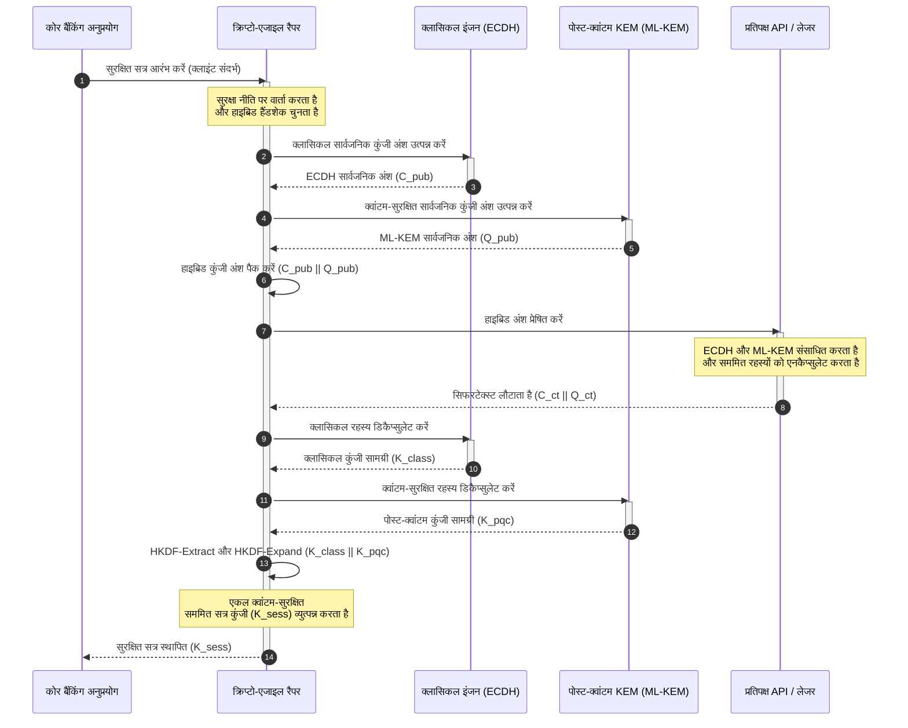

# KyberLib और 2026 का पोस्ट-क्वांटम बैंकिंग माइग्रेशन: मानकों से कोड तक

<!-- lead-start: manual -->
<aside class="post-lead" aria-label="लेख सारांश">

<strong>संक्षेप में।</strong> बैंकिंग अवसंरचना 2026 में एक ऐसे प्रणालीगत खतरे का सामना कर रही है जिसका अंतिम बिंदु ज्ञात है: क्वांटम-स्तरीय संगणना उस RSA और ECC कुंजी विनिमय को तोड़ देगी जो आज के ट्रांज़िट ट्रैफ़िक की रक्षा करता है। संघीय मानकों और पर्यवेक्षी नीति-पत्रों ने जागरूकता बढ़ा दी है; तकनीकी क्रियान्वयन अब भी बिखरा हुआ है। <a href="https://github.com/sebastienrousseau/kyberlib">KyberLib</a> एक ओपन सोर्स इंजीनियरिंग ब्लूप्रिंट है जो पोस्ट-क्वांटम विमर्श को ठोस, मेमोरी-सुरक्षित Rust कोड में ले आता है — NIST-मानकीकृत ML-KEM (FIPS 203) को क्रिप्टो-एजाइल अमूर्तन सीमाओं के पीछे लागू करते हुए — ताकि संस्थान "Store Now, Decrypt Later" हमलों के उनके अभिलेखागार तक पहुँचने से पहले ट्रांसपोर्ट सुरक्षा और कुंजी एनकैप्सुलेशन उन्नत कर सकें।

<strong>मुख्य निष्कर्ष</strong>

<ul class="post-lead-takeaways">
  <li><strong>नीति से निरीक्षण योग्य कोड तक।</strong> KyberLib पोस्ट-क्वांटम क्रिप्टोग्राफी को अमूर्त रणनीतिक रोडमैप से ठोस, उच्च-प्रदर्शन, ऑडिट योग्य Rust कार्यान्वयन में ले आती है।</li>
  <li><strong>मानकीकृत FIPS 203 ML-KEM क्रियान्वयन।</strong> यह पुस्तकालय ML-KEM लागू करती है — NIST FIPS 203 के अंतर्गत अंतिम रूप दिया गया कुंजी-स्थापना एल्गोरिथम — जिससे अनुरूपता वैश्विक नियामक अपेक्षाओं से संरेखित रहती है।</li>
  <li><strong>डिज़ाइन से ही क्रिप्टो-एजिलिटी।</strong> स्थिर अमूर्तन सीमाएँ बैंकिंग अनुप्रयोगों को महँगे, त्रुटि-प्रवण अनुप्रयोग पुनर्लेखन के बिना क्रिप्टोग्राफिक प्रिमिटिव्स बदलने देती हैं।</li>
  <li><strong>Rust-आधारित मेमोरी सुरक्षा।</strong> कंपाइल-टाइम ओनरशिप नियम उन बफ़र ओवरफ़्लो और मेमोरी लीक को समाप्त करते हैं जो लेगेसी C-आधारित क्रिप्टोग्राफिक पुस्तकालयों को त्रस्त करते हैं — वह भी शून्य-लागत-अमूर्तन गति पर।</li>
  <li><strong>न्यासी दायित्व का शमन।</strong> अवलोकन योग्य, परीक्षण योग्य माइग्रेशन साक्ष्य निदेशकों को वह "उचित कदम" रिकॉर्ड देता है जिसकी DORA अनुच्छेद 5 की व्यक्तिगत-जवाबदेही ऑडिट माँग करती हैं।</li>
</ul>

<strong>संबंधित पठन:</strong> <a href="/2026-05-18-quantum-cryptography-standards-developments-2026/">क्वांटम क्रिप्टोग्राफी मानक 2026</a> · <a href="/2026-05-28-dora-ai-act-data-sovereignty-banking-compliance-stack-2026/">DORA + AI अधिनियम अनुपालन स्टैक</a> · <a href="/2026-05-20-cloud-native-banking-financial-institutions-2026/">क्लाउड-नेटिव बैंकिंग</a>।

</aside>
<!-- lead-end -->

पोस्ट-क्वांटम माइग्रेशन अब नियोजन अभ्यास नहीं रहा। 2026 में यह एक सक्रिय परिचालन आवश्यकता है, और नियामक मंशा तथा इंजीनियरिंग क्रियान्वयन के बीच का अंतराल ही वह जगह है जहाँ जोखिम अब बैठा है। [KyberLib ⧉](https://github.com/sebastienrousseau/kyberlib "kyberlib") उस अंतराल का एक हिस्सा बंद करती है: एक उत्पादन-उन्मुख, मेमोरी-सुरक्षित Rust पुस्तकालय जो अंतिम FIPS 203 पैरामीटरों के अनुसार ML-KEM लागू करती है और उसे उन क्रिप्टो-एजाइल सीमाओं में लपेटती है जिनकी किसी बैंक की लेन-देन संपदा को वास्तव में आवश्यकता है।

---

> **कार्यकारी सारांश / मुख्य निष्कर्ष**
>
> - **खतरा पहले से परिचालन में है।** विरोधी आज ही "Store Now, Decrypt Later" हार्वेस्टिंग चला रहे हैं; जिस दिन क्रिप्टोग्राफिक रूप से सक्षम क्वांटम कंप्यूटर आएगा, डेटा गोपनीयता पूर्वव्यापी रूप से विफल हो जाएगी।
> - **मानक अंतिम हो चुके हैं।** NIST FIPS 203 (ML-KEM) और FIPS 204 (ML-DSA) ऑडिट समितियों को स्पष्ट, परीक्षण योग्य कसौटी देते हैं — "मानकों की प्रतीक्षा" वाला बचाव अब उपलब्ध नहीं है।
> - **KyberLib इंजीनियरिंग ब्लूप्रिंट है।** मेमोरी-सुरक्षित Rust, HSM और स्मार्ट कार्ड के लिए `no_std` संकलन, और ऐसे हाइब्रिड हैंडशेक पैटर्न जो क्लासिकल अंतर-संचालनीयता बनाए रखते हैं।
> - **क्रिप्टो-एजिलिटी ही टिकाऊ उद्देश्य है।** स्थिर अमूर्तन सीमाएँ अनुप्रयोग पुनर्लेखन के बिना प्रिमिटिव्स बदलने देती हैं — यही वह सबक है जो किसी भी एकल एल्गोरिथम से अधिक समय तक टिकता है।
> - **दायित्व बोर्ड पर है।** DORA अनुच्छेद 5 निदेशकों पर व्यक्तिगत ज़िम्मेदारी डालता है; निरीक्षण योग्य, अवलोकन योग्य माइग्रेशन कोड ही वह साक्ष्य है जो उसे संतुष्ट करता है।
>
---

## यह ओपन सोर्स परियोजना 2026 में क्यों मायने रखती है

असममित क्रिप्टोग्राफी जैसे-जैसे अप्रचलन की ओर बढ़ रही है, खतरा क्रिप्टोग्राफिक रूप से सक्षम क्वांटम कंप्यूटर के बनने की प्रतीक्षा नहीं करता। विरोधी **"Store Now, Decrypt Later" (SNDL)** हमले अभी क्रियान्वित कर रहे हैं — कॉर्पोरेट बैंक लेन-देन, व्यापार रहस्यों और संस्थागत संचार की एन्क्रिप्टेड ट्रांज़िट धाराओं को इस इरादे से एकत्र करते हुए कि क्वांटम क्षमताएँ परिपक्व होते ही उन्हें डिक्रिप्ट किया जा सके। किसी बैंक के लिए, आज तार पर होने वाला हर क्लासिकल हैंडशेक एक ऐसा गोपनीयता उल्लंघन है जिसकी विस्फोट-तिथि स्थगित है।

नियामकों ने ठोस दायित्वों के साथ उत्तर दिया है:

1. **DORA अनुच्छेद 6 (ICT जोखिम प्रबंधन)** संस्थानों से अपेक्षा करता है कि वे अपनी क्रिप्टोग्राफिक संपदा भर में कमज़ोरियों का मानचित्रण, पहचान और शमन करें — उस असममित कुंजी विनिमय सहित जो ऐसे मिडलवेयर में दबा है जिसकी किसी ने इन्वेंट्री नहीं बनाई।
2. **NIST FIPS 203 और 204** कुंजी एनकैप्सुलेशन (ML-KEM) और डिजिटल हस्ताक्षर (ML-DSA) के लिए आधिकारिक पोस्ट-क्वांटम मानक स्थापित करते हैं, जिससे ऑडिट समितियों को एक मानकीकृत कसौटी मिलती है जिसके सापेक्ष माइग्रेशन प्रगति मापी जाती है।

इस माइग्रेशन को लाइव परिचालन में व्यवधान डाले बिना क्रियान्वित करने के लिए नीति-पत्रों से आगे बढ़कर **निरीक्षण योग्य, ओपन सोर्स क्रिप्टोग्राफिक अवसंरचना** तक पहुँचना आवश्यक है। [KyberLib ⧉](https://github.com/sebastienrousseau/kyberlib "kyberlib") ठीक यही देती है: FIPS 203 के अनुरूप एक मेमोरी-सुरक्षित Rust पुस्तकालय जो पोस्ट-क्वांटम संक्रमण को एक मापन योग्य, सत्यापन योग्य इंजीनियरिंग पाइपलाइन में बदल देती है — और प्रौद्योगिकी निवेश की चर्चा को एक मूर्त Return on Resilience की ओर मोड़ती है।

## वास्तुकला दृष्टिकोण

KyberLib स्थिर API सीमाओं के पीछे बैठती है, और किसी बैंक के कोर लेन-देन अनुप्रयोगों को निम्न-स्तरीय क्रिप्टोग्राफिक प्रिमिटिव्स के बदलावों से अलगाव देती है।

| परत | डिज़ाइन निर्णय | यह क्यों मायने रखता है | कुप्रबंधन पर जोखिम |
|---|---|---|---|
| **प्रिमिटिव** | FIPS 203 ML-KEM कुंजी एनकैप्सुलेशन | क्लासिकल Diffie-Hellman और RSA कुंजी विनिमय को लैटिस-आधारित संरचनाओं से प्रतिस्थापित करता है | अंतिम FIPS 203 पैरामीटरों से असंगति, जो अनुपालन ऑडिट विफल कराती है |
| **भाषा** | मेमोरी-सुरक्षित Rust कार्यान्वयन | C/C++ में व्याप्त मेमोरी-करप्शन कमज़ोरियों (बफ़र ओवरफ़्लो, use-after-free) को समाप्त करता है | निर्भरता फैलाव जो बिल्ड-चेन अखंडता से समझौता करता है |
| **अमूर्तन** | स्थिर क्रिप्टो-एजाइल सीमाएँ | मानकों के विकसित होते ही अनुप्रयोग एकीकृत इंटरफ़ेस के पीछे एल्गोरिथम बदल लेते हैं | हार्ड-कोडेड प्रिमिटिव्स जो हर भावी माइग्रेशन में मैनुअल पुनर्लेखन थोपते हैं |
| **परिनियोजन** | हाइब्रिड एन्क्रिप्शन हैंडशेक | पोस्ट-क्वांटम KEM को क्लासिकल एल्गोरिथमों के साथ दोहरे-आवरण वाले लिफ़ाफ़े में जोड़ता है | लेगेसी अंतर-संचालनीयता की हानि या मौन कॉन्फ़िगरेशन बहाव |
| **आश्वासन** | SLSA Level 3 उद्गम-प्रमाण और निरीक्षण योग्य परीक्षण | कोड स्रोत और उद्गम की गारंटी देता है; उदाहरणों का पंक्ति-दर-पंक्ति ऑडिट हो सकता है | सुरक्षा रंगमंच — ब्लैक-बॉक्स पुस्तकालय जिनकी कार्यान्वयन त्रुटियाँ उत्पादन में उभरती हैं |

## ट्रैक करने योग्य परिचालन संकेत

पर्यवेक्षी बोर्डों और नियामकों के समक्ष पोस्ट-क्वांटम अनुपालन प्रदर्शित करने का अर्थ है विशिष्ट, परिमाणन योग्य मेट्रिक ट्रैक करना:

| संकेत | मेट्रिक | नियामक संदर्भ | प्लेटफ़ॉर्म कार्यान्वयन |
|---|---|---|---|
| **FIPS 203 ML-KEM अनुरूपता** | अंतिम पैरामीटरों (ML-KEM-512/768/1024) के साथ 100% अनुपालन | NIST FIPS 203 | KyberLib मॉड्यूलों के भीतर संकलित, पैरामीटर-सत्यापित लैटिस क्रिप्टोग्राफी |
| **क्रिप्टोग्राफिक इन्वेंट्री** | सभी सिस्टमों में असममित कुंजी-विनिमय उपयोग की संपूर्ण इन्वेंट्री | NIST SP 1800-38 | सक्रिय सिफर सूट को केंद्रीय रजिस्ट्री में लॉग करने वाले स्वचालित स्कैनिंग एजेंट |
| **हाइब्रिड कुंजी विनिमय** | हाइब्रिड लिफ़ाफ़े में निष्पादित होने वाले ट्रांसपोर्ट-स्तर हैंडशेक का प्रतिशत | DORA अनुच्छेद 6 | क्लासिकल TLS 1.3 हैंडशेक को PQC एनकैप्सुलेशन में लपेटने वाले नेटवर्क प्रॉक्सी |
| **`no_std` संकलन** | सीमित लक्ष्यों के लिए Rust की स्टैंडर्ड लाइब्रेरी के बिना संकलन की क्षमता | DORA अनुच्छेद 30 | Hardware Security Modules हेतु KyberLib में शर्त-आधारित `no_std` संकलन |
| **क्रिप्टो-एजिलिटी सूचकांक** | API गेटवे भर में किसी क्रिप्टोग्राफिक प्रिमिटिव को बदलने में लगने वाला समय, मिनटों में | UK PRA SS1/23 | रनटाइम चरों के माध्यम से एल्गोरिथम आवंटन प्रबंधित करने वाली अमूर्त रूटिंग रजिस्ट्रियाँ |

## पोस्ट-क्वांटम क्रिप्टोग्राफी के लिए Rust क्यों मायने रखता है

ML-KEM जैसे पोस्ट-क्वांटम एल्गोरिथमों के कार्यान्वयन में बहुपद वलयों (polynomial rings) पर जटिल, निम्न-स्तरीय गणितीय संक्रियाएँ चाहिए। ऐतिहासिक रूप से उन संक्रियाओं को उत्पादन गति पर चलाने का अर्थ था हाथ से लिखा C/C++ या असेंबली — मेमोरी करप्शन के लिए एक बड़ी आक्रमण सतह, और वह भी ठीक उस कोड में जिसे ग़लत करने का जोखिम बैंक सबसे कम उठा सकता है।

Rust क्रिप्टोग्राफिक इंजीनियरिंग की सुरक्षा मुद्रा को तीन ठोस तरीकों से बदलता है:

1. **कंपाइल-टाइम मेमोरी सुरक्षा।** Rust का ओनरशिप मॉडल गारंटी देता है कि बफ़र ओवरफ़्लो, डबल फ़्री और use-after-free त्रुटियाँ संकलन के समय ही रोक दी जाती हैं। पोस्ट-क्वांटम पुस्तकालयों के लिए यह विशेष रूप से अहम है, जहाँ कुंजी आकार और सिफरटेक्स्ट अपने क्लासिकल समकक्षों से उल्लेखनीय रूप से बड़े होते हैं।
2. **नियतात्मक, शून्य-लागत अमूर्तन।** Rust बिना गार्बेज कलेक्टर के नेटिव मशीन कोड में संकलित होता है, इसलिए निष्पादन गति और मेमोरी फ़ुटप्रिंट सुरक्षा बनाए रखते हुए C-आधारित पुस्तकालयों की बराबरी करते हैं या उनसे आगे निकलते हैं।
3. **`no_std` संगतता।** KyberLib Rust की स्टैंडर्ड लाइब्रेरी के बिना संकलित होती है, इसलिए वह सीमित, बेयर-मेटल परिवेशों में चलती है — Hardware Security Modules और स्मार्ट कार्ड सहित — जिससे बैंक-स्तरीय क्रिप्टोग्राफी भौतिक सुरक्षा सीमाओं के भीतर रहती है।

## क्रिप्टो-एजाइल वास्तुकला का डिज़ाइन

क्रिप्टोग्राफिक माइग्रेशन की क्लासिक विफलता-विधि है हार्ड-कोडिंग: एल्गोरिथम-विशिष्ट धारणाएँ सीधे अनुप्रयोग तर्क में अंतर्निहित, जो हर संक्रमण पर कष्टपूर्वक फिर से खोजी जाती हैं। 2026 का टिकाऊ उद्देश्य है **क्रिप्टो-एजिलिटी** — एक अमूर्तन परत जो एल्गोरिथमों को स्थिर इंटरफ़ेस के पीछे बदले जा सकने वाले मॉड्यूल मानती है, ताकि अगला माइग्रेशन संपदा-व्यापी पुनर्लेखन के बजाय एक कॉन्फ़िगरेशन परिवर्तन हो।

नीचे का अनुक्रम दिखाता है कि KyberLib का क्रिप्टो-एजाइल रैपर हाइब्रिड (क्लासिकल प्लस पोस्ट-क्वांटम) कुंजी-विनिमय हैंडशेक का समन्वय कैसे करता है:

हाइब्रिड लिफ़ाफ़ा ही परिचालन की दृष्टि से महत्वपूर्ण विवरण है। जब तक पोस्ट-क्वांटम प्रिमिटिव्स वर्षों की उत्पादन परख संचित नहीं कर लेते, सत्र कुंजी क्लासिकल और पोस्ट-क्वांटम दोनों रहस्यों से व्युत्पन्न होती है: चैनल पुनर्प्राप्त करने के लिए हमलावर को ECDH **और** ML-KEM दोनों तोड़ने होंगे। जिन प्रतिपक्षों ने माइग्रेट नहीं किया है, वे काम करते रहते हैं; जिन्होंने किया है, उन्हें तुरंत लैटिस-आधारित सुरक्षा मिलती है।

## बोर्डरूम प्लेबुक

पोस्ट-क्वांटम सुरक्षा बैक-ऑफ़िस एन्क्रिप्शन का विषय नहीं है; यह व्यक्तिगत दाँव वाला बोर्डरूम अभिशासन मुद्दा है। वरिष्ठ प्रबंधकों को इस माइग्रेशन को न्यासी ज़िम्मेदारी के चश्मे से देखना चाहिए:

- **DORA अनुच्छेद 5 (अभिशासन और संगठन)** ICT सुरक्षा की व्यक्तिगत ज़िम्मेदारी निदेशक मंडल पर डालता है। ओपन सोर्स, अवलोकन योग्य परीक्षण ही वह प्रत्यक्ष साक्ष्य हैं जो व्यक्तिगत-दायित्व ऑडिट माँगती है — "हमने एक निरीक्षण योग्य FIPS 203 कार्यान्वयन चुना और ये रहीं उसकी अनुरूपता रन" एक बचाव योग्य उत्तर है; "हमारे विक्रेता ने हमें आश्वस्त किया" नहीं है।
- **मॉडल जोखिम प्रबंधन (US Fed SR 11-7 / UK PRA SS1/23)** क्रिप्टोग्राफिक रैपर वास्तुकलाओं पर उतना ही लागू होता है जितना मूल्य-निर्धारण मॉडलों पर। अमूर्तन परतों को MRM सत्यापन से गुज़रना चाहिए, जिसमें चरम व्यवधान परिदृश्यों के अंतर्गत प्रदर्शन भी शामिल है।
- **Basel III परिचालन-जोखिम पूँजी** प्रदर्शित नियंत्रण परिपक्वता को पुरस्कृत करती है। परीक्षित हाइब्रिड हैंडशेक संस्थान का दीर्घकालिक परिचालन जोखिम प्रोफ़ाइल घटाते हैं, पूँजी प्रीमियम कम करते हैं और सक्रिय ट्रेज़री परिनियोजन के लिए बैलेंस-शीट क्षमता मुक्त करते हैं।

## बैंक प्रकार के अनुसार इसका अर्थ

### वैश्विक प्रणालीगत रूप से महत्वपूर्ण बैंक (G-SIBs)

G-SIB लेगेसी-बहुल लेन-देन संपदाएँ चलाते हैं, इसलिए उनकी बाध्यकारी सीमा है खोज: यह जानना कि असममित कुंजी विनिमय वास्तव में कहाँ होता है। NIST SP 1800-38 मार्गदर्शन के अंतर्गत सतत क्रिप्टोग्राफिक इन्वेंट्री पहले आती हैं; इसके बाद KyberLib वह मानकीकृत, मेमोरी-सुरक्षित पुस्तकालय देती है जिससे इन्वेंट्री द्वारा उजागर हर आधुनिक नोड पर पोस्ट-क्वांटम कुंजी एनकैप्सुलेशन क्रियान्वित हो सके।

### ट्रांज़ैक्शन और कॉर्पोरेट बैंक

भुगतान रेलों भर में गोपनीयता ही फ़्रैंचाइज़ है। चूँकि KyberLib बेयर-मेटल `no_std` लक्ष्यों पर संकलित होती है, ट्रांज़ैक्शन बैंक पोस्ट-क्वांटम हैंडशेक सीधे एज भुगतान-रूटिंग और तरलता-प्रबंधन हार्डवेयर के भीतर परिनियोजित कर सकते हैं — केवल अनुप्रयोग स्तर में नहीं।

### क्षेत्रीय और छोटे बैंक

क्षेत्रीय संस्थानों को वही राज्य-प्रायोजित हार्वेस्टिंग झेलनी पड़ती है, पर G-SIB जैसे शोध बजट के बिना। एक निरीक्षण योग्य, ओपन सोर्स Rust कार्यान्वयन उन्हें ब्लैक-बॉक्स विक्रेता रोडमैप पर मोल-भाव किए बिना, तुरंत NIST FIPS 203 अनुरूपता का टर्न-की मार्ग देता है।

## रोडमैप से संकलित होते कोड तक

पोस्ट-क्वांटम संक्रमण एक सक्रिय इंजीनियरिंग कार्य है, और 2026 के दौरान पर्यवेक्षकों, प्रतिपक्षों और कॉर्पोरेट ट्रेज़रर्स का भरोसा वही संस्थान बनाए रखेंगे जो अमूर्त रोडमैप से अवलोकन योग्य, संकलित होते कोड की ओर बढ़ते हैं। कार्यकारी जनादेश सीधे इसी से निकलता है: लेगेसी कुंजी-विनिमय बिंदुओं का ऑडिट करें, उच्चतम-मूल्य चैनलों पर हाइब्रिड हैंडशेक परिनियोजित करें, और वे स्थिर अमूर्तन सीमाएँ बनाएँ जो हर भावी प्रिमिटिव बदलाव को नियमित कार्य बना दें। KyberLib इन तीनों चरणों में से प्रत्येक को स्लाइडवेयर प्रतिबद्धता के बजाय एक मापन योग्य परिचालन क्षमता बनाती है।

## अक्सर पूछे जाने वाले प्रश्न

**क्या KyberLib अंतिम NIST मानकों के अनुरूप है?**

हाँ। KyberLib FIPS 203 में अंतिम रूप दिए गए ML-KEM पैरामीटरों के इर्द-गिर्द डिज़ाइन की गई है, जिससे संकलित पुस्तकालय संघीय और वैश्विक नियामक अपेक्षाओं से संरेखित रहती है।

**क्या पोस्ट-क्वांटम पुस्तकालय के लिए विशेष हार्डवेयर चाहिए?**

नहीं। KyberLib का Rust कार्यान्वयन मानक सिस्टम वास्तुकलाओं पर संकलित होता है। इसकी `no_std` क्षमता इसे अतिरिक्त रूप से उन विशेष Hardware Security Modules और स्मार्ट कार्डों पर चलने देती है जहाँ कुंजियों की भौतिक अभिरक्षा आवश्यक है।

**"Store Now, Decrypt Later" वर्तमान अनुपालन को कैसे प्रभावित करता है?**

यदि ट्रांसपोर्ट परत क्लासिकल RSA या ECC पर निर्भर है, तो विरोधी आज ट्रैफ़िक एकत्र कर सकते हैं और क्वांटम क्षमता परिपक्व होते ही उसे डिक्रिप्ट कर सकते हैं। अभी परिनियोजित हाइब्रिड कुंजी विनिमय एकत्रित डेटा को लैटिस-आधारित सुरक्षा के पीछे रखता है।

**सीधे पोस्ट-क्वांटम प्रिमिटिव्स पर जाने के बजाय हाइब्रिड हैंडशेक क्यों?**

हाइब्रिड लिफ़ाफ़े सत्र कुंजी को क्लासिकल और पोस्ट-क्वांटम दोनों रहस्यों से व्युत्पन्न करते हैं, इसलिए सुरक्षा तब तक कायम रहती है जब तक दोनों न टूटें। इससे अप्रवासित प्रतिपक्षों के साथ अंतर-संचालनीयता बनी रहती है, जबकि नए प्रिमिटिव्स उत्पादन परख संचित करते हैं।

## संदर्भ

- National Institute of Standards and Technology, (2024). [FIPS 203: मॉड्यूल-लैटिस-आधारित कुंजी-एनकैप्सुलेशन मैकेनिज़्म मानक ⧉](https://www.nist.gov/news-events/news/2024/08/nist-releases-first-3-finalized-post-quantum-encryption-standards "NIST FIPS 203 घोषणा").
- Board of Governors of the Federal Reserve System, (2011). [मॉडल जोखिम प्रबंधन पर पर्यवेक्षी मार्गदर्शन (SR Letter 11-7) ⧉](https://www.federalreserve.gov/supervisionreg/srletters/sr1107.htm "Federal Reserve SR 11-7").
- European Parliament and Council of the European Union, (2022). [वित्तीय क्षेत्र के लिए डिजिटल परिचालन लचीलेपन पर विनियमन (EU) 2022/2554 (DORA) ⧉](https://eur-lex.europa.eu/legal-content/EN/TXT/?uri=CELEX%3A32022R2554 "DORA विनियमन").
- NIST National Cybersecurity Center of Excellence, (2025). [पोस्ट-क्वांटम क्रिप्टोग्राफी की ओर माइग्रेशन (NIST SP 1800-38) ⧉](https://www.nccoe.nist.gov/projects/migration-post-quantum-cryptography "NIST SP 1800-38").
- GitHub, (2026). [kyberlib ओपन सोर्स भंडार ⧉](https://github.com/sebastienrousseau/kyberlib "kyberlib भंडार").

<!-- enrich-start -->
<aside class="author-card" aria-label="लेखक के बारे में"><strong class="author-card-name"><a href="/about/index.html">सेबास्तियन रूसो</a></strong>वरिष्ठ बैंकिंग प्रौद्योगिकीविद् जो प्रयोज्य AI, भुगतान अवसंरचना, टोकनीकृत मुद्रा, ISO 20022, पोस्ट-क्वांटम सुरक्षा, क्लाउड-नेटिव वित्तीय सेवाओं, ओपन सोर्स अवसंरचना और विनियमित डिजिटल बाज़ारों पर लिखते हैं।HSBC Commercial &amp; Investment Bank, PayPal, Barclays, Shazam, AKQA, Virgin Group में 20+ वर्षों का अनुभव। <a href="/about/index.html">पूर्ण प्रोफ़ाइल</a> &middot; <a href="https://www.linkedin.com/in/sebastienrousseau/" rel="external noopener">LinkedIn</a> &middot; <a href="https://github.com/sebastienrousseau" rel="external noopener">GitHub</a></aside>

अंतिम समीक्षा <time datetime="2026-06-12">12 जून 2026</time>।

<!-- enrich-end -->
