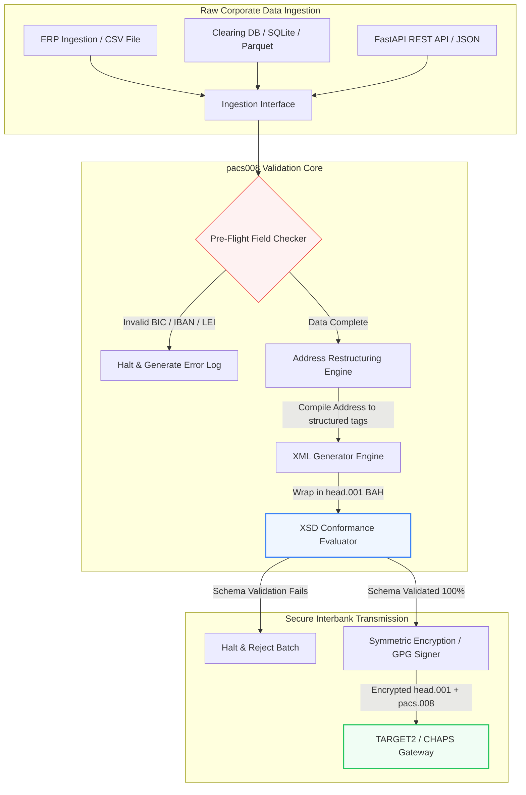

---

# Front Matter (YAML)

author: "contact@sebastienrousseau.com (Sebastien Rousseau)"
banner_alt: "वॉयस असिस्टेंट और लैपटॉप के साथ कार्यालय कर्मचारी — pacs.008 स्वचालन द्वारा प्रोग्राम योग्य बनाए गए संरचित, मशीन-पठनीय अंतर-बैंक भुगतान संदेशों का प्रतीक"
banner_height: "1597"
banner_width: "2584"
banner: "https://cloudcdn.pro/stocks/images/tyler-prahm-lmV3gJSAgbo.webp"
cdn: "https://cloudcdn.pro"
charset: "UTF-8"
cname: "sebastienrousseau.com"
copyright: "© Copyright 2025 - 2026 - Sebastien Rousseau. All rights reserved."
date: "June 15, 2026"
description: "pacs008 एक ओपन सोर्स पाइथन लाइब्रेरी है जो ISO 20022 pacs.008 FI-to-FI ग्राहक क्रेडिट ट्रांसफर निर्माण और सत्यापन को स्वचालित करती है — संरचित पते, BAH head.001 आवरण, BIC/LEI/IBAN चेकसम, UETR पर OpenTelemetry अनुरेखण — नवंबर 2026 SWIFT कटओवर के लिए निर्मित।"
format-detection: "telephone=no"
hreflang: "hi"
icon: "https://cloudcdn.pro/clients/sebastienrousseau/v1/logos/sebastienrousseau.svg"
id: "https://sebastienrousseau.com/2026-06-15-pacs008-automation-iso-20022-interbank-payments-2026"
image_alt: "Black and White Portrait of Sebastien Rousseau"
image_height: "162"
image_width: "162"
image: "https://cloudcdn.pro/stocks/images/sebastienrousseau.webp"
keywords: "pacs008, ISO 20022 pacs.008, FI-to-FI ग्राहक क्रेडिट ट्रांसफर, संरचित पता, SWIFT CBPR+, BAH head.001, TARGET2, CHAPS, Fedwire, DORA, BCBS 239, Basel III, UETR, LEI सत्यापन, SEPA VoP"
language: "hi-IN"
last_reviewed: "2026-06-15"
layout: "report"
locale: "hi_IN"
logo_alt: "Logo for Sebastien Rousseau"
logo_height: "44"
logo_width: "44"
logo: "https://cloudcdn.pro/clients/sebastienrousseau/v1/logos/sebastienrousseau.svg"
menu: ""
measurementID: "G-169G4ET5HQ"
name: "Sebastien Rousseau"
permalink: "https://sebastienrousseau.com/2026-06-15-pacs008-automation-iso-20022-interbank-payments-2026"
rating: "general"
referrer: "no-referrer"
robots: "index, follow"
schema: "FAQPage, Article"
seo_title: "ISO 20022 युग के लिए pacs.008 स्वचालन"
short_name: "sebastienrousseau"
subtitle: "pacs.008 संदेश वह बिंदु है जहाँ अंतर-बैंक भुगतान डेटा, संरचित पते, अनुपालन, रूटिंग और निपटान संचालन मिलते हैं।"
tags: "pacs008, ISO 20022, अंतर-बैंक भुगतान, थोक भुगतान, Python"
theme-color: "0, 83, 191"
title: "2026 में ISO 20022 अंतर-बैंक युग के लिए pacs.008 स्वचालन का निर्माण"
url: "https://sebastienrousseau.com/2026-06-15-pacs008-automation-iso-20022-interbank-payments-2026"
viewport: "width=device-width, initial-scale=1, shrink-to-fit=no"

# RSS - The RSS feed front matter (YAML).
atom_link: "https://sebastienrousseau.com/2026-06-15-pacs008-automation-iso-20022-interbank-payments-2026/rss.xml"
category: "Finance"
docs: https://validator.w3.org/feed/docs/rss2.html
generator: "Static Site Generator (SSG) (version 0.0.26)"
item_description: "pacs008 अंतर-बैंक भुगतान युग में ISO 20022 FI-to-FI ग्राहक क्रेडिट ट्रांसफर संदेशों के स्वचालन के लिए एक ओपन सोर्स पाइथन आधार प्रदान करता है।"
item_guid: "https://sebastienrousseau.com/2026-06-15-pacs008-automation-iso-20022-interbank-payments-2026/rss.xml"
item_link: "https://sebastienrousseau.com/2026-06-15-pacs008-automation-iso-20022-interbank-payments-2026/rss.xml"
item_pub_date: "Mon, 15 Jun 2026 06:06:06 +0000"
item_title: "2026 में ISO 20022 अंतर-बैंक युग के लिए pacs.008 स्वचालन का निर्माण"
last_build_date: "Mon, 15 Jun 2026 06:06:06 +0000"
managing_editor: "contact@sebastienrousseau.com (Sebastien Rousseau)"
pub_date: "Mon, 15 Jun 2026 06:06:06 +0000"
ttl: "60"
type: "article"
webmaster: "contact@sebastienrousseau.com"

# Apple - The Apple front matter (YAML).
apple_mobile_web_app_orientations: "portrait"
apple_touch_icon_sizes: "192x192"
apple-mobile-web-app-capable: "yes"
apple-mobile-web-app-status-bar-inset: "black"
apple-mobile-web-app-status-bar-style: "black-translucent"
apple-mobile-web-app-title: "ISO 20022 युग के लिए pacs.008 स्वचालन"
apple-touch-fullscreen: "yes"

# MS Application - The MS Application front matter (YAML).

msapplication-navbutton-color: "0, 83, 191"

# Twitter Card - The Twitter Card front matter (YAML).

twitter_card: "summary_large_image"
twitter_creator: "@wwdseb"
twitter_description: "pacs008 अंतर-बैंक भुगतान युग में ISO 20022 FI-to-FI ग्राहक क्रेडिट ट्रांसफर संदेशों के स्वचालन के लिए एक ओपन सोर्स पाइथन आधार प्रदान करता है।"
twitter_image: "https://cloudcdn.pro/clients/sebastienrousseau/v1/logos/sebastienrousseau.svg"
twitter_image_alt: "Logo of Sebastien Rousseau"
twitter_site: "@wwdseb"
twitter_title: "ISO 20022 युग के लिए pacs.008 स्वचालन"
twitter_url: "https://sebastienrousseau.com/2026-06-15-pacs008-automation-iso-20022-interbank-payments-2026"

excerpt: "pacs008 एक ओपन सोर्स पाइथन टूलकिट है जो ISO 20022 FI-to-FI ग्राहक क्रेडिट ट्रांसफर संदेशों को प्रोग्राम योग्य बनाता है — संरचित पते, सत्यापन, रूटिंग, अनुपालन हुक और SWIFT नवंबर 2026 की समय सीमा डिफ़ॉल्ट के रूप में अंतर्निहित।"

# Humans.txt - The Humans.txt front matter (YAML).
author_website: "https://sebastienrousseau.com"
author_twitter: "@wwdseb"
author_location: "London, UK"
thanks: "पढ़ने के लिए धन्यवाद!"
site_last_updated: "2026-06-15"
site_standards: "HTML5, CSS3, RSS, Atom, JSON, XML, YAML, Markdown, TOML"
site_components: "Kaishi, Kaishi Builder, Kaishi CLI, Kaishi Templates, Kaishi Themes"
site_software: "Static Site Generator, Rust"

---

# 2026 में ओपन सोर्स पाइथन के साथ ISO 20022 pacs.008 अंतर-बैंक भुगतान का स्वचालन

<!-- lead-start -->
<aside class="post-lead" aria-label="लेख सारांश">

<strong>संक्षेप में।</strong> SWIFT CBPR+ दिशानिर्देशों के तहत, 14 नवंबर 2026 की संरचित-पता समय सीमा TARGET2, CHAPS, Fedwire, Lynx और SEPA पर असंरचित डाक पतों को निष्क्रिय कर देती है। pacs008 एक ओपन सोर्स पाइथन लाइब्रेरी है जो ISO 20022 FI-to-FI ग्राहक क्रेडिट ट्रांसफर (pacs.008) संदेश निर्माण और सत्यापन को स्वचालित करती है, भुगतानों को Business Application Header (BAH head.001) में लपेटती है, और संदेश के क्लियरिंग नेटवर्क तक पहुँचने से पहले डेटा-पथ में संरचित-पता अनुपालन को अंतर्निहित कर देती है।

<strong>मुख्य निष्कर्ष</strong>

<ul class="post-lead-takeaways">
  <li><strong>संरचित-पता समय सीमा अंतिम है।</strong> 14 नवंबर 2026 के बाद, असंरचित पता ब्लॉक सेवानिवृत्त हो जाएँगे। pacs008 डेटा संकलन पर संरचित डाक पता तत्वों (<code>&lt;TwnNm&gt;</code>, <code>&lt;Ctry&gt;</code>, <code>&lt;PstCd&gt;</code>) को लागू करता है ताकि सीमा-स्तरीय अस्वीकरण रोके जा सकें।</li>
  <li><strong>एकीकृत संदेश संचालन।</strong> मूल pacs.008 भुगतान पेलोड को अनुपालन-योग्य Business Application Header (head.001) लिफ़ाफ़े में लपेटता है, जो एक मानक राउंड-ट्रिप प्रोसेसिंग मॉडल प्रदान करता है।</li>
  <li><strong>एल्गोरिथमिक अखंडता।</strong> ISO 7064 Modulo 97-10 चेकसम गणनाओं का उपयोग करते हुए BIC और Legal Entity Identifier (LEI) के लिए अंतर्निहित सत्यापनकर्ता।</li>
  <li><strong>DORA-स्तरीय अनुरेखण योग्यता।</strong> वास्तविक-समय ऑडिट लॉग और क्रिप्टोग्राफिक ऑडिट हस्ताक्षरों के लिए Unique End-to-End Transaction Reference (UETR) पर पूर्ण OpenTelemetry इंस्ट्रूमेंटेशन।</li>
  <li><strong>बोर्ड-स्तरीय फिड्यूशियरी संरक्षण।</strong> अंतर-बैंक संदेश सटीकता को DORA अनुच्छेद 5, BCBS 239 रिपोर्टिंग और Basel III परिचालन-जोखिम पूँजी बचत के साथ संरेखित करता है।</li>
</ul>

<strong>संबंधित पठन:</strong> <a href="https://sebastienrousseau.com/2026-05-19-global-wholesale-payments-economics-2026">2026 में वैश्विक थोक भुगतान: ISO 20022, RTGS नवीनीकरण और अंतर-संचालनीयता की अर्थव्यवस्था</a>, <a href="https://sebastienrousseau.com/2026-05-27-ai-operating-system-payments-fraud-routing-resilience-compliance-2026">भुगतान के ऑपरेटिंग सिस्टम के रूप में AI: 2026 में धोखाधड़ी, रूटिंग, लचीलापन और अनुपालन</a>, <a href="https://sebastienrousseau.com/2026-05-12-iso-20022-pacs008-structured-address-deadline">नवंबर 2026 pacs.008 संरचित-पता समय सीमा: एक छह-महीने का दृष्टिकोण</a>.

</aside>
<!-- lead-end -->

विरासत वित्तीय डेटा और संरचित अंतर-बैंक संदेश के बीच की खाई को एक ऑडिट योग्य, स्कीमा-सत्यापित पाइथन पाइपलाइन के माध्यम से पाटना।

इस लेख का ओपन सोर्स संदर्भ बिंदु है [pacs008 ⧉](https://github.com/sebastienrousseau/pacs008 "pacs008 — ओपन सोर्स पाइथन लाइब्रेरी")। रिपॉजिटरी को ISO 20022 pacs.008 FI-to-FI ग्राहक क्रेडिट ट्रांसफर XML संदेशों के स्वचालन के लिए एक पाइथन लाइब्रेरी के रूप में स्थापित किया गया है।

## यह ओपन सोर्स परियोजना 2026 में क्यों मायने रखती है

वैश्विक अंतर-बैंक भुगतान-क्लियरिंग अवसंरचना लगभग आधी सदी का सबसे गहन आधुनिकीकरण कर रही है।

जून 2026 में, वित्तीय-सेवा क्षेत्र **14 नवंबर 2026 की SWIFT संरचित-पता समय सीमा** के तेज़ी से निकट पहुँच रहा है। इस तिथि के बाद, SWIFT CBPR+ दिशानिर्देश, साथ ही TARGET2, CHAPS, Fedwire और कैनेडियन Lynx, आधिकारिक रूप से असंरचित डाक-पता लाइनों (केवल `<PstlAdr>` ब्लॉकों के भीतर `<AdrLine>` का उपयोग) को निष्क्रिय कर देंगे। सभी भाग लेने वाले वित्तीय संस्थानों को पते या तो हाइब्रिड प्रारूप में (संरचित `<TwnNm>` और `<Ctry>`, शेष विवरण के लिए अधिकतम दो `<AdrLine>` तत्वों के साथ) या पूर्ण संरचित प्रारूप में (सड़क नाम, भवन संख्या और पोस्टल कोड के लिए व्यक्तिगत तत्व) प्रेषित करने होंगे। इस मानदंड को पूरा न करने वाले किसी भी संदेश को नेटवर्क सीमा पर अस्वीकार कर दिया जाएगा।

वित्तीय संस्थानों के लिए, यह संक्रमण बड़ी परिचालन बाध्यताएँ उत्पन्न करता है:

1. **सीमा-अस्वीकरण दंड।** संरचित-पता मानदंडों को पूरा करने में विफल भुगतान तत्काल नेटवर्क अस्वीकरण का सामना करेंगे, जो लेन-देन में देरी, तरलता अवरोध और परिचालन बैकलॉग को जन्म देगा।
2. **SEPA Verification of Payee (VoP)।** अनिवार्य करता है कि SEPA क्षेत्र के भीतर सभी Payment Service Provider (PSP) क्रेडिट ट्रांसफर निष्पादित करने से पहले लाभार्थी के नाम और IBAN के मिलान को सत्यापित करें, संदेश आरंभीकरण में एक और सत्यापन द्वार जोड़ते हुए।

[pacs008](https://github.com/sebastienrousseau/pacs008) इस समस्या का समाधान करता है। यह एक ओपन सोर्स, हल्की पाइथन लाइब्रेरी है जो कच्चे वित्तीय डेटा को पूर्ण रूप से सत्यापित, स्कीमा-अनुपालन ISO 20022 pacs.008 अंतर-बैंक ग्राहक क्रेडिट ट्रांसफर संदेशों में स्वचालित रूप से रूपांतरित करती है। विरासत-से-संरचित डेटा खाई को पाटकर, pacs008 उच्च Return on Resilience (RoR) प्रदान करता है, कार्यशील पूँजी को संरक्षित करता है और वैश्विक रेलों पर वास्तविक-समय निष्पादन सुरक्षित करता है।

## मैंने pacs008 को इस तरह क्यों बनाया

`pacs008` और उसकी ऊपरी धारा की सहोदर लाइब्रेरी `pain001` मैंने ही लिखी हैं, और
मेरा कामकाजी जीवन थोक भुगतान तथा API उत्पाद प्रबंधन में बीतता है। यही संयोजन इस
लाइब्रेरी के स्वरूप का कारण है, इसलिए इन निर्णयों को कोड में निहित छोड़ने के बजाय
स्पष्ट रूप से रख देना उचित है।

**सत्यापन निर्माण के बाद नहीं, पहले चलता है।** अधिकांश भुगतान परिसंपत्तियों में
सहज प्रवृत्ति यही होती है कि पहले संदेश बना लिया जाए और फिर उसकी जाँच हो, क्योंकि
समीक्षा प्रक्रिया इसी तरह गढ़ी गई है: एक फ़ाइल बनती है, कोई उसे देखता है, अपवाद
कतार में चले जाते हैं। यह क्रम इस बात की गारंटी देता है कि दोष उस बिंदु पर मिलेंगे
जहाँ सबसे कम लाभ है — संदेश जोड़ने का काम पूरा हो जाने के बाद, और प्रायः उसके
संस्थान से बाहर चले जाने के बाद। पहले सत्यापन का अर्थ है कि अननुरूप पता या
त्रुटिपूर्ण IBAN नेटवर्क अस्वीकृति के बजाय बिल्ड विफलता बन जाता है।

**लाइसेंस MIT इसलिए है कि बैंकों को सत्यापन तर्क पढ़ना होता है, उस पर भरोसा नहीं
करना होता।** एक बंद सत्यापक संस्थान से कहता है कि वह उपयोग दिशानिर्देशों के किसी
और के पाठ को आँख मूँदकर स्वीकार कर ले। जिस दल पर नियामक दायित्व है, उससे यह माँगना
उचित नहीं। इस लाइब्रेरी का हर नियम जाँचा, चुनौती दिया और फ़ोर्क किया जा सकता है।

**सत्यापन आधिकारिक XSD स्कीमा के विरुद्ध होता है, पुनर्कार्यान्वयन के विरुद्ध
नहीं।** ISO 20022 नियमों का हाथ से लिखा अनुमान उसी क्षण नेटवर्क के वास्तविक
अनुबंध से हट जाता है जब कोई भी पक्ष बदलता है। स्कीमा ही अनुबंध है; बाकी सब सत्य का
दूसरा स्रोत है जो असहमत होने की प्रतीक्षा में है।

**यह समीक्षा चरण नहीं, CI को लक्ष्य करता है।** जिस सत्यापक को चलाना किसी व्यक्ति
को याद रखना पड़े, वह सत्यापक समयसीमा के दबाव में चलना बंद कर देता है — ठीक तभी जब
वह सबसे अधिक मायने रखता है।

लाइब्रेरी जो जान-बूझकर नहीं करती, वह भी उतना ही सोचा-समझा है। यह संदेश-स्तर का
उपकरण है। यह न भुगतान इंजन की जगह लेती है, न प्रतिबंध जाँच प्रणाली की, और न ही उस
ग्राहक मास्टर-डेटा सुधार की जो संस्थान को स्रोत पर करना होता है। यह उस सुधार को
प्रवर्तनीय बनाती है; आपकी ओर से वह काम नहीं करती।

## pacs008 2026 वास्तुकला दृष्टिकोण

pacs008 लाइब्रेरी को एक पृथक सत्यापन और निर्माण इंजन के रूप में संरचित किया गया है, जो सुनिश्चित करता है कि कच्चे इनपुट व्यवस्थित रूप से पार्स किए जाएँ, समृद्ध किए जाएँ और मानक लिफ़ाफ़ों में लपेटे जाएँ:

| परत | डिज़ाइन निर्णय | यह क्यों मायने रखता है | कुप्रबंधन पर जोखिम |
|---|---|---|---|
| **Input Layer** | CSV, JSON, SQLite और Parquet का अंतर्ग्रहण | बैंकिंग एकीकरण दलों को वहीं मिलता है जहाँ उनका डेटा पहले से रहता है, प्लेटफ़ॉर्म प्रवास को रोकता है। | कच्चे, असत्यापित या भ्रष्ट डेटा पेलोड का अंतर्ग्रहण। |
| **Validation Layer** | आधिकारिक XSD स्कीमा और कस्टम व्यावसायिक नियमों के विरुद्ध पूर्व-उड़ान सत्यापन | भुगतान फ़ाइल के क्लियरिंग नेटवर्क पर प्रेषित होने से पहले निष्पादन रोकता है और त्रुटियाँ चिह्नित करता है। | अमान्य XML फ़ाइलें जो तत्काल नेटवर्क अस्वीकरण और क्लियरिंग देरी को ट्रिगर करती हैं। |
| **BAH Envelope Layer** | स्वचालित Business Application Header (head.001) आवरण | `<MsgDefIdr>` टैग के आधार पर संदेश प्रेषण और रूटिंग को मानकीकृत करता है। | आवश्यक बाहरी लिफ़ाफ़े के बिना कच्चे pacs.008 पेलोड को प्रेषित करना, जिससे सिस्टम अस्वीकरण होता है। |
| **Serialization Layer** | मानक XML और ISO-अनुपालन JSON (TS 23029) समर्थन | XML और JSON पेलोड के बीच सीधा अनुवाद सक्षम करता है, आधुनिक REST API और Kafka स्ट्रीमिंग का समर्थन करता है। | आधिकारिक ISO दिशानिर्देशों का उल्लंघन करते खंडित डेटा प्रतिनिधित्व। |
| **Observability Layer** | UETR पर OpenTelemetry अनुरेखण | विस्तृत निष्पादन पथ और लॉग कैप्चर करता है, वास्तविक-समय ऑडिट योग्यता प्रदान करता है। | अनुरेखण अंतराल जो परिचालन दृश्यता और ऑडिटिंग को अवरुद्ध करते हैं। |

## मुख्य अंतर-बैंक संकेत और नियामक मील के पत्थर

लेन-देन परिचालन लचीलापन प्रदर्शित करने के लिए, वरिष्ठ प्रौद्योगिकी और जोखिम प्रबंधकों को विशिष्ट, मात्रात्मक अनुपालन संकेतकों को ट्रैक करना चाहिए:

| संकेत | मेट्रिक / परिचालन बेंचमार्क | G20 / SWIFT / DORA संदर्भ | तकनीकी प्लेटफ़ॉर्म कार्यान्वयन |
|---|---|---|---|
| **संरचित-पता अनुपालन** | निर्धारित `<TwnNm>` और `<Ctry>` के साथ पूर्ण संरचित `<PstlAdr>` फ़ील्ड का उपयोग करने वाले pacs.008 संदेशों का %। | SWIFT SR 2026 समय सीमा | pacs008 में पूर्व-उड़ान स्कीमा जाँच जो असंरचित पता लाइनों को अस्वीकार करती है। |
| **SEPA Verification of Payee** | संदेश निष्पादन से पहले लाभार्थी के नाम और IBAN के बीच मिलान सत्यापन। | SEPA VoP विनियमन | IBAN/BIC पर पूर्व-सत्यापन क्वेरी निष्पादित करने वाले अंतर्निहित VoP सहायक वर्ग। |
| **BAH head.001 एकीकरण** | Business Application Header में सफलतापूर्वक लपेटे गए आउटगोइंग भुगतान पेलोड का प्रतिशत। | TARGET2 / CBPR+ दिशानिर्देश | बाहरी XML लिफ़ाफ़े को स्वचालित रूप से संकलित करने वाला BAH आवरण उपतंत्र। |
| **LEI Modulo चेकसम** | देनदार और लेनदार `<LEI>` ब्लॉकों पर ISO 7064 Modulo 97-10 चेक-डिजिट सत्यापन। | Bank of England अधिदेश | 20-वर्ण पहचानकर्ता की अखंडता को सत्यापित करने वाला एल्गोरिथमिक जाँचकर्ता। |
| **UETR ट्रैकिंग सटीकता** | वैध Unique End-to-End Transaction Reference के साथ इंजेक्ट किए गए उत्पन्न भुगतानों का 100%। | SWIFT UETR विनिर्देश | 36-वर्ण UUIDv4 संदर्भ कोड का स्वचालित निर्माण और अनुरेखण। |

## अंतर-बैंक स्वचालन के लिए पाइथन आदर्श ऑन-रैंप क्यों है

2026 में आधुनिक भुगतान हब और ट्रेज़री संचालन दल डेटा रूपांतरण, वित्तीय मॉडलिंग और ERP डेटाबेस एकीकरण के लिए पाइथन पर भारी निर्भर हैं।

एक ओपन सोर्स पाइथन लाइब्रेरी का लाभ उठाकर, संस्थान महत्वपूर्ण लाभ प्राप्त करते हैं:

1. **कम संज्ञानात्मक भार और उच्च अंतर-संचालनीयता।** पाइथन एक सुसंगत पुल के रूप में कार्य करता है। यह डेवलपर्स को सरल स्क्रिप्ट लिखने की अनुमति देता है जो विरासत डेटाबेस से कच्चे भुगतान निर्देश खींचती हैं, उन्हें जटिल अंतर्राष्ट्रीय बैंकिंग नियमों के विरुद्ध सत्यापित करती हैं, और एक एकल, एकीकृत कार्यप्रवाह के भीतर अनुपालन XML आउटपुट करती हैं।
2. **"ब्लैक-बॉक्स" अपारदर्शी अनुवादकों का उन्मूलन।** स्वामित्व वाले बैंकिंग पोर्टल अक्सर कस्टम भुगतान-फ़ाइल अनुवादकों के लिए उच्च लाइसेंसिंग शुल्क लेते हैं। ये अनुवादक स्वामित्व वाले ब्लैक बॉक्स हैं, जिससे सुरक्षा दलों के लिए यह ऑडिट करना असंभव हो जाता है कि डेटा कैसे संसाधित किया जाता है या कुंजियाँ कहाँ संग्रहीत हैं। pacs008 जैसी एक ओपन सोर्स, निरीक्षण योग्य लाइब्रेरी पूर्ण कोड पारदर्शिता सुनिश्चित करती है।
3. **निर्बाध CI/CD एकीकरण।** pacs008 सीधे सतत एकीकरण और परिनियोजन पाइपलाइनों में एकीकृत होती है, जिससे डेवलपर्स अपने मानक सॉफ़्टवेयर वितरण जीवनचक्र के हिस्से के रूप में भुगतान-फ़ाइल परीक्षण को स्वचालित कर सकते हैं।

## एक सीमित अंतर-बैंक पाइपलाइन डिज़ाइन करना

अंतर-बैंक क्लियरिंग में एक प्रमुख भेद्यता "अनियंत्रित बैच निर्माण" है — स्पष्ट, सीमित सत्यापन लूप के बिना फ़ाइलें उत्पन्न करना। pacs008 को एक कड़ाई से नियंत्रित, बहु-चरणीय लेन-देन पाइपलाइन के भीतर मुख्य सत्यापन इंजन के रूप में कार्य करने के लिए डिज़ाइन किया गया है।

नीचे दिया गया परिचालन प्रवाह दिखाता है कि कच्चा लेन-देन डेटा एक BAH लिफ़ाफ़े में लपेटी गई क्रिप्टोग्राफिक रूप से सुरक्षित, स्कीमा-अनुपालन pacs.008 फ़ाइल उत्पन्न करने के लिए pacs008 पाइपलाइन से कैसे गुज़रता है:

## बोर्डरूम प्लेबुक और फिड्यूशियरी दायित्व

अंतर-बैंक भुगतान स्वचालन एक बोर्ड-स्तरीय जोखिम-प्रबंधन और कॉर्पोरेट-शासन मुद्दा है। वरिष्ठ प्रबंधकों को फिड्यूशियरी ज़िम्मेदारी और परिचालन-जोखिम न्यूनीकरण के दृष्टिकोण से लेन-देन डेटा गुणवत्ता को संबोधित करना चाहिए:

- **DORA अनुच्छेद 5 (बोर्ड जवाबदेही)।** संस्थान के ICT संचालन की लचीलापन और सुरक्षा के लिए बोर्ड सदस्यों पर सीधा, व्यक्तिगत दायित्व रखता है। चूँकि अंतर-बैंक क्लियरिंग एक महत्वपूर्ण कॉर्पोरेट कार्य है, बोर्डों को यह प्रदर्शित करना होगा कि उन्होंने परिचालन व्यवधानों या देरी से भुगतानों को रोकने के लिए मज़बूत, सत्यापित और स्वचालित लेन-देन नियंत्रण लागू किए हैं।
- **BCBS 239 (जोखिम डेटा एकत्रीकरण और रिपोर्टिंग)।** माँग करता है कि वित्तीय लेन-देन रिपोर्टिंग सटीक, पूर्ण और वास्तविक समय में उत्पन्न हो। pacs008 संस्थानों को भुगतान डेटा को स्रोत पर साफ़-संरचित और सत्यापित सुनिश्चित करके BCBS 239 अनुपालन प्राप्त करने में मदद करता है, उन डेटा अंतराल और मैन्युअल मेल-मिलाप त्रुटियों को समाप्त करता है जो विरासत स्प्रेडशीट को परेशान करती हैं।
- **परिचालन-जोखिम पूँजी प्रभार का शमन (Basel III)।** Basel III दिशानिर्देशों के तहत, उच्च भुगतान त्रुटि दर और मैन्युअल हस्तक्षेप ओवरहेड बैंक की परिचालन-जोखिम पूँजी आवश्यकताओं को बढ़ाते हैं, उस पूँजी को बाँधते हैं जिसे अन्यथा ऋण या निवेश के लिए तैनात किया जा सकता था। भुगतान पाइपलाइन को स्वचालित करना इन पूँजी प्रीमियमों को सीधे न्यूनतम करता है, बैलेंस-शीट मूल्य को संरक्षित करता है।

## बैंक प्रकार के अनुसार इसका अर्थ

### Global Systemically Important Banks (G-SIBs)

G-SIBs विशाल, सीमा-पार कॉर्पोरेट लेन-देन मात्राओं का प्रबंधन करते हैं। उनकी प्राथमिक चुनौती क्लियरिंग नेटवर्क से टकराने से पहले असंरचित विरासत डेटा का सुधार है। pacs008 को अपने कॉर्पोरेट बैंकिंग गेटवे में एकीकृत करके, G-SIBs अपने कॉर्पोरेट क्लाइंट को स्वचालित सत्यापन उपयोगिताएँ प्रदान कर सकते हैं, मैन्युअल भुगतान मरम्मत के ओवरहेड को कम कर सकते हैं और SWIFT नेटवर्क पर वास्तविक-समय निष्पादन को सुरक्षित कर सकते हैं।

### Transaction और Corporate Banks

लेन-देन बैंकों के लिए, भुगतान डेटा गुणवत्ता एक प्रतिस्पर्धात्मक विभेदक है। कॉर्पोरेट ट्रेज़री क्लाइंट को pacs008 जैसा एक ओपन सोर्स, निरीक्षण योग्य सत्यापन उपकरण प्रदान करके, ये बैंक ऑनबोर्डिंग को तेज़ कर सकते हैं, भुगतान फ़ाइल अस्वीकरण को न्यूनतम कर सकते हैं और बेहतर स्ट्रेट-थ्रू प्रोसेसिंग दरों के माध्यम से ग्राहक विश्वास का निर्माण कर सकते हैं।

### क्षेत्रीय और छोटे बैंक

क्षेत्रीय बैंकों को G-SIBs के विशाल प्रौद्योगिकी बजट के बिना अंतर्राष्ट्रीय भुगतान मानकों के साथ अनुपालन बनाए रखना होगा। pacs008 एक हल्का, लागत-प्रभावी और पूरी तरह अनुपालन पाइथन-आधारित समाधान प्रदान करता है, जो छोटे संस्थानों को महँगे स्वामित्व मिडलवेयर लाइसेंस के बिना आधुनिक, संरचित भुगतान आरंभीकरण क्षमताएँ प्रदान करने में सक्षम बनाता है।

## निष्कर्ष: अंतर-बैंक क्लियरिंग रोडमैप

आगामी SWIFT नवंबर 2026 संरचित-पता समय सीमा कॉर्पोरेट ट्रेज़री संचालन के लिए एक कठोर सीमा का प्रतिनिधित्व करती है। विरासत स्प्रेडशीट, मैन्युअल डेटा प्रविष्टि और असंरचित भुगतान फ़ाइलों पर निर्भर रहना एक सक्रिय व्यावसायिक जोखिम है।

लेन-देन निरंतरता को सुरक्षित करने और परिचालन ओवरहेड को न्यूनतम करने के लिए, वरिष्ठ प्रौद्योगिकी और वित्त प्रबंधकों को आज एक स्पष्ट क्लियरिंग रोडमैप निष्पादित करना चाहिए:

1. **स्रोत पर सत्यापन लागू करें।** अनिवार्य करें कि सभी भुगतान निर्देश कॉर्पोरेट ERP सीमा छोड़ने से पहले आधिकारिक ISO 20022 XSD स्कीमा के अनुसार सत्यापित और प्रारूपित हों।
2. **डेटा पाइपलाइन का ऑडिट करें।** मैन्युअल स्प्रेडशीट प्रसंस्करण से दूर हटें और pacs008 का उपयोग करते हुए स्वचालित, निरीक्षण योग्य पाइथन-आधारित कार्यप्रवाह लागू करें।
3. **हाइब्रिड सुरक्षा लागू करें।** सुनिश्चित करें कि उत्पन्न भुगतान फ़ाइलें प्रेषण से पहले क्रिप्टोग्राफिक रूप से हस्ताक्षरित और एन्क्रिप्टेड हों, ज़ीरो-ट्रस्ट नेटवर्क अपेक्षाओं को संतुष्ट करते हुए।
4. **फिड्यूशियरी प्राथमिकताओं के साथ संरेखित करें।** भुगतान स्वचालन और डेटा गुणवत्ता मेट्रिक्स को औपचारिक रूप से बोर्ड को रिपोर्ट करें, इस निवेश को DORA के तहत एक महत्वपूर्ण परिचालन-जोखिम न्यूनीकरण कार्यक्रम के रूप में प्रस्तुत करते हुए।

## अक्सर पूछे जाने वाले प्रश्न

**क्या pacs008 आगामी SWIFT SR 2026 पता नियमों के साथ अनुपालन करता है?**

हाँ। pacs008 को कठोर SWIFT नवंबर 2026 संरचित-पता मील के पत्थर का समर्थन करने के लिए डिज़ाइन किया गया है, जो डाक-पता तत्वों (नगर, देश, पोस्टकोड) के निर्दिष्ट ISO 20022 XML फ़ील्ड में अनिवार्य पृथक्करण को लागू करता है।

**क्या pacs008 भुगतान पेलोड को Business Application Header में लपेट सकता है?**

हाँ। चूँकि pacs008 मूल रूप से Business Application Header (BAH head.001) आवरण का समर्थन करता है, यह TARGET2, CHAPS और CBPR+ नेटवर्क द्वारा अपेक्षित बाहरी लिफ़ाफ़े को स्वचालित रूप से संकलित करता है।

**स्वामित्व फ़ाइल अनुवादकों की तुलना में एक ओपन सोर्स लाइब्रेरी को क्यों प्राथमिकता दी जाती है?**

स्वामित्व अनुवादक अपारदर्शी ब्लैक बॉक्स हैं, जिससे सुरक्षा ऑडिट असंभव हो जाते हैं। pacs008 जैसी एक ओपन सोर्स, सहकर्मी-समीक्षित लाइब्रेरी पूर्ण कोड पारदर्शिता प्रदान करती है, जिससे सुरक्षा दल यह सत्यापित कर सकते हैं कि प्रसंस्करण के दौरान कोई संवेदनशील भुगतान डेटा उजागर नहीं होता।

**pacs008 किन पहचानकर्ताओं को सत्यापित करता है?**

pacs008 ISO 7064 Modulo 97-10 चेकसम गणनाओं का उपयोग करते हुए Bank Identifier Codes (BICs) और Legal Entity Identifiers (LEIs) के लिए अंतर्निहित सत्यापनकर्ताओं, साथ ही IBAN चेक-डिजिट सत्यापन और UETR विशिष्टता जाँच के साथ शिप करता है।

## संदर्भ

- SWIFT, (2024). *ISO 20022 November 2026 Structured Address Milestone*. La Hulpe: SWIFT. उपलब्ध: [SWIFT ISO 20022 मील का पत्थर ⧉](https://www.swift.com/standards/iso-20022/iso-20022-bytes/call-action-november-2026 "SWIFT ISO 20022 मील का पत्थर").
- Basel Committee on Banking Supervision (BCBS), (2013). *Principles for effective risk data aggregation and risk reporting (BCBS 239)*. Basel: Bank for International Settlements. उपलब्ध: [BCBS 239 सिद्धांत ⧉](https://www.bis.org/publ/bcbs239.htm "BCBS 239 सिद्धांत").
- European Parliament and Council of the European Union, (2022). *Regulation (EU) 2022/2554 on digital operational resilience for the financial sector (DORA)*. Brussels: Official Journal of the European Union. उपलब्ध: [DORA विनियमन ⧉](https://eur-lex.europa.eu/legal-content/EN/TXT/?uri=CELEX%3A32022R2554 "DORA विनियमन").
- GitHub, (2026). *pacs008 ओपन सोर्स रिपॉजिटरी*. उपलब्ध: [pacs008 रिपॉजिटरी ⧉](https://github.com/sebastienrousseau/pacs008 "pacs008 रिपॉजिटरी").

<!-- enrich-start -->
<aside class="author-card" aria-label="लेखक के बारे में"><strong class="author-card-name"><a href="/about/index.html">सेबास्तियन रूसो</a></strong>वरिष्ठ बैंकिंग प्रौद्योगिकीविद् जो प्रयोज्य AI, ISO 20022 प्रवास, वित्तीय सेवाओं के लिए पोस्ट-क्वांटम क्रिप्टोग्राफी और थोक भुगतान के संरचनात्मक परिवर्तन पर लिखते हैं।HSBC Commercial &amp; Investment Bank, PayPal, Barclays, Shazam, AKQA, Virgin Group में 20+ वर्षों का अनुभव। <a href="/about/index.html">पूर्ण प्रोफ़ाइल</a> &middot; <a href="https://www.linkedin.com/in/sebastienrousseau/" rel="external noopener">LinkedIn</a> &middot; <a href="https://github.com/sebastienrousseau" rel="external noopener">GitHub</a></aside>

अंतिम समीक्षा <time datetime="2026-06-15">2026-06-15</time>।

<aside class="related-posts" aria-labelledby="related-heading">
<h2 id="related-heading" class="related-heading">संबंधित पठन</h2>

<article class="related-card"><footer class="related-body"><h3><a href="https://sebastienrousseau.com/2026-05-19-global-wholesale-payments-economics-2026">2026 में वैश्विक थोक भुगतान: ISO 20022, RTGS नवीनीकरण और अंतर-संचालनीयता की अर्थव्यवस्था</a></h3>
<time datetime="2026-05-19">2026-05-19</time>
</footer></article>
<article class="related-card"><footer class="related-body"><h3><a href="https://sebastienrousseau.com/2026-05-27-ai-operating-system-payments-fraud-routing-resilience-compliance-2026">भुगतान के ऑपरेटिंग सिस्टम के रूप में AI: 2026 में धोखाधड़ी, रूटिंग, लचीलापन और अनुपालन</a></h3>
<time datetime="2026-05-27">2026-05-27</time>
</footer></article>
<article class="related-card"><footer class="related-body"><h3><a href="https://sebastienrousseau.com/2026-05-12-iso-20022-pacs008-structured-address-deadline">नवंबर 2026 pacs.008 संरचित-पता समय सीमा: एक छह-महीने का दृष्टिकोण</a></h3>
<time datetime="2026-05-12">2026-05-12</time>
</footer></article>

</aside>
<!-- enrich-end -->
