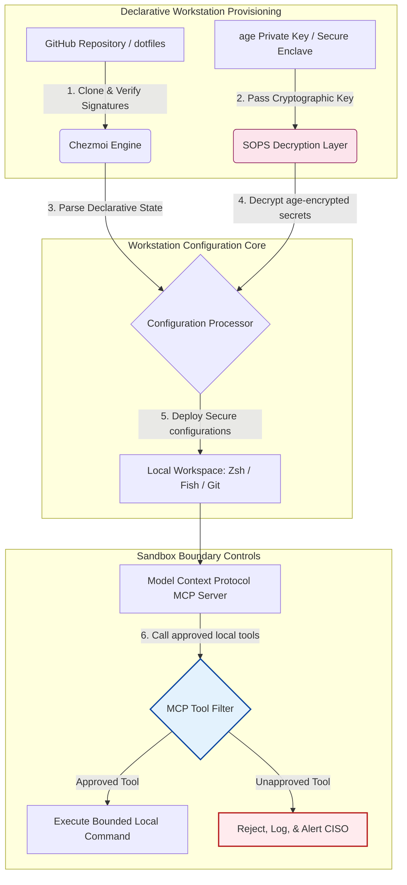

---

# Front Matter (YAML)

author: "contact@sebastienrousseau.com (Sebastien Rousseau)"
banner_alt: "मद्धम प्रकाश में डेवलपर वर्कस्टेशन — MCP सर्वर, SLSA हस्ताक्षर, age/SOPS रहस्यों और मल्टी-शेल समानता के लिए AI-जागरूक, पुनरुत्पादनीय, सुरक्षित dotfiles का प्रतीक"
banner_height: "1597"
banner_width: "2584"
banner: "https://cloudcdn.pro/stocks/images/almas-salakhov-Vq2ap8aFFEs.webp"
cdn: "https://cloudcdn.pro"
charset: "UTF-8"
cname: "sebastienrousseau.com"
copyright: "© Copyright 2025 - 2026 - Sebastien Rousseau. All rights reserved."
date: "June 16, 2026"
description: "AI-जागरूक dotfiles MCP युग में सुरक्षित, पुनरुत्पादनीय वर्कस्टेशन का स्वरूप हैं — Chezmoi के माध्यम से घोषणात्मक कॉन्फ़िगरेशन, SOPS/age रहस्य, SLSA Level 3 उत्पत्ति-प्रमाण, मल्टी-शेल समानता और स्थानीय AI एजेंटों के लिए परिबद्ध सैंडबॉक्स सीमाएँ।"
format-detection: "telephone=no"
hreflang: "hi"
icon: "https://cloudcdn.pro/clients/sebastienrousseau/v1/logos/sebastienrousseau.svg"
id: "https://sebastienrousseau.com/2026-06-16-ai-aware-dotfiles-secure-reproducible-workstation-2026"
image_alt: "Black and White Portrait of Sebastien Rousseau"
image_height: "162"
image_width: "162"
image: "https://cloudcdn.pro/stocks/images/sebastienrousseau.webp"
keywords: "dotfiles, Chezmoi, MCP, Model Context Protocol, SLSA, SOPS, age एन्क्रिप्शन, घोषणात्मक कॉन्फ़िगरेशन, डेवलपर वर्कस्टेशन, DORA Article 5, NIST CSF 2.0, आपूर्ति श्रृंखला सुरक्षा, एजेंटिक AI, मल्टी-शेल समानता, Zsh, Fish, Nushell"
language: "hi-IN"
last_reviewed: "2026-06-16"
layout: "report"
locale: "hi_IN"
logo_alt: "Logo for Sebastien Rousseau"
logo_height: "44"
logo_width: "44"
logo: "https://cloudcdn.pro/clients/sebastienrousseau/v1/logos/sebastienrousseau.svg"
menu: ""
measurementID: "G-169G4ET5HQ"
name: "Sebastien Rousseau"
permalink: "https://sebastienrousseau.com/2026-06-16-ai-aware-dotfiles-secure-reproducible-workstation-2026"
rating: "general"
referrer: "no-referrer"
robots: "index, follow"
schema: "FAQPage, Article"
seo_title: "सुरक्षित डेवलपर वर्कस्टेशन के लिए AI-जागरूक dotfiles"
short_name: "sebastienrousseau"
subtitle: "डेवलपर वर्कस्टेशन अब AI आपूर्ति श्रृंखला का हिस्सा है; dotfiles को सुरक्षा, पुनरुत्पादनीयता, गुप्त स्वच्छता और MCP-जागरूक कार्यप्रवाहों की आवश्यकता है।"
tags: "dotfiles, डेवलपर टूल्स, MCP, SLSA, सुरक्षित वर्कस्टेशन, chezmoi, macOS, Linux, WSL"
theme-color: "0, 83, 191"
title: "2026 में AI-जागरूक dotfiles: MCP, SLSA और मल्टी-शेल समानता के लिए सुरक्षित, पुनरुत्पादनीय डेवलपर वर्कस्टेशन"
url: "https://sebastienrousseau.com/2026-06-16-ai-aware-dotfiles-secure-reproducible-workstation-2026"
viewport: "width=device-width, initial-scale=1, shrink-to-fit=no"

# RSS - The RSS feed front matter (YAML).
atom_link: "https://sebastienrousseau.com/2026-06-16-ai-aware-dotfiles-secure-reproducible-workstation-2026/rss.xml"
category: "Technology"
docs: https://validator.w3.org/feed/docs/rss2.html
generator: "Static Site Generator (SSG) (version 0.0.26)"
item_description: "macOS, Linux और WSL पर सुरक्षित, पुनरुत्पादनीय डेवलपर वर्कस्टेशन के लिए घोषणात्मक dotfiles का विश्लेषण — MCP जागरूकता, SLSA, age, SOPS और मल्टी-शेल समानता के साथ।"
item_guid: "https://sebastienrousseau.com/2026-06-16-ai-aware-dotfiles-secure-reproducible-workstation-2026/rss.xml"
item_link: "https://sebastienrousseau.com/2026-06-16-ai-aware-dotfiles-secure-reproducible-workstation-2026/rss.xml"
item_pub_date: "Tue, 16 Jun 2026 06:06:06 +0000"
item_title: "2026 में AI-जागरूक dotfiles: MCP, SLSA और मल्टी-शेल समानता के लिए सुरक्षित, पुनरुत्पादनीय डेवलपर वर्कस्टेशन"
last_build_date: "Tue, 16 Jun 2026 06:06:06 +0000"
managing_editor: "contact@sebastienrousseau.com (Sebastien Rousseau)"
pub_date: "Tue, 16 Jun 2026 06:06:06 +0000"
ttl: "60"
type: "article"
webmaster: "contact@sebastienrousseau.com"

# Apple - The Apple front matter (YAML).
apple_mobile_web_app_orientations: "portrait"
apple_touch_icon_sizes: "192x192"
apple-mobile-web-app-capable: "yes"
apple-mobile-web-app-status-bar-inset: "black"
apple-mobile-web-app-status-bar-style: "black-translucent"
apple-mobile-web-app-title: "सुरक्षित डेवलपर वर्कस्टेशन के लिए AI-जागरूक dotfiles"
apple-touch-fullscreen: "yes"

# MS Application - The MS Application front matter (YAML).

msapplication-navbutton-color: "0, 83, 191"

# Twitter Card - The Twitter Card front matter (YAML).

twitter_card: "summary_large_image"
twitter_creator: "@wwdseb"
twitter_description: "macOS, Linux और WSL पर सुरक्षित, पुनरुत्पादनीय डेवलपर वर्कस्टेशन के लिए घोषणात्मक dotfiles का विश्लेषण — MCP जागरूकता, SLSA, age, SOPS और मल्टी-शेल समानता के साथ।"
twitter_image: "https://cloudcdn.pro/clients/sebastienrousseau/v1/logos/sebastienrousseau.svg"
twitter_image_alt: "Logo of Sebastien Rousseau"
twitter_site: "@wwdseb"
twitter_title: "सुरक्षित डेवलपर वर्कस्टेशन के लिए AI-जागरूक dotfiles"
twitter_url: "https://sebastienrousseau.com/2026-06-16-ai-aware-dotfiles-secure-reproducible-workstation-2026"

excerpt: "2026 में AI-जागरूक dotfiles डेवलपर वर्कस्टेशन को आपूर्ति-श्रृंखला अवसंरचना के रूप में मानते हैं — MCP जागरूकता, SLSA-हस्ताक्षरित रिलीज़, age/SOPS रहस्यों, उप-सेकंड स्टार्टअप और macOS/Linux/WSL समानता के साथ chezmoi द्वारा प्रबंधित घोषणात्मक कॉन्फ़िगरेशन।"

# Humans.txt - The Humans.txt front matter (YAML).
author_website: "https://sebastienrousseau.com"
author_twitter: "@wwdseb"
author_location: "London, UK"
thanks: "पढ़ने के लिए धन्यवाद!"
site_last_updated: "2026-06-16"
site_standards: "HTML5, CSS3, RSS, Atom, JSON, XML, YAML, Markdown, TOML"
site_components: "Kaishi, Kaishi Builder, Kaishi CLI, Kaishi Templates, Kaishi Themes"
site_software: "Static Site Generator, Rust"

---

# 2026 में AI-जागरूक dotfiles: MCP, SLSA और मल्टी-शेल समानता के लिए सुरक्षित, पुनरुत्पादनीय डेवलपर वर्कस्टेशन

<!-- lead-start -->
<aside class="post-lead" aria-label="लेख सारांश">

<strong>संक्षेप में।</strong> डेवलपर वर्कस्टेशन अब केवल एक एंडपॉइंट नहीं है; यह सॉफ़्टवेयर आपूर्ति श्रृंखला का सक्रिय भागीदार है और स्थानीय AI नियंत्रण-तल का प्रत्यक्ष इंटरफ़ेस है। टर्मिनल-आधारित AI सहायक और <a href="https://modelcontextprotocol.io">Model Context Protocol (MCP)</a> सर्वर सीधे स्थानीय शेल कमांड निष्पादित करते हैं, रिपॉज़िटरी का निरीक्षण करते हैं और संवेदनशील कॉन्फ़िगरेशन फ़ाइलें पढ़ते हैं। <a href="https://github.com/sebastienrousseau/dotfiles">Sebastien Rousseau's Dotfiles</a> एक घोषणात्मक, ओपन-सोर्स फ़्रेमवर्क है जो macOS, Linux और Windows Subsystem for Linux (WSL) पर सुरक्षित, पुनरुत्पादनीय वर्कस्टेशन बनाता है — मेमोरी-सुरक्षित रहस्य पृथक्करण और स्थानीय AI मॉडलों के लिए परिबद्ध निष्पादन पथों हेतु <a href="https://www.chezmoi.io/">Chezmoi</a>, <a href="https://github.com/getsops/sops">SOPS, age</a> और SLSA Level 3 बिल्ड उत्पत्ति-प्रमाण को एकीकृत करते हुए।

<strong>मुख्य निष्कर्ष</strong>

<ul class="post-lead-takeaways">
  <li><strong>वर्कस्टेशन आपूर्ति-श्रृंखला अवसंरचना हैं।</strong> डेवलपर परिवेश कॉन्फ़िगरेशन को उत्पादन सर्वर परिनियोजनों के समान घोषणात्मक कठोरता से प्रबंधित किया जाना चाहिए, जिससे मैन्युअल कॉन्फ़िगरेशन विचलन समाप्त हो।</li>
  <li><strong>AI नियंत्रण-तल की चुनौती।</strong> टर्मिनल-आधारित AI मॉडल और MCP उपकरण स्थानीय निर्देशिकाओं तक पहुँच सकते हैं। dotfiles को डेटा रिसाव रोकने के लिए परिबद्ध सैंडबॉक्स सीमाएँ, सख़्त उपकरण-अनुमति सूचियाँ और अपरिवर्तनीय स्थानीय लॉग लागू करने होंगे।</li>
  <li><strong>पूर्ण क्रॉस-प्लेटफ़ॉर्म समानता।</strong> macOS, Linux (Zsh, Fish, Nushell) और WSL पर समान, उप-सेकंड शेल प्रदर्शन और सुरक्षा प्रोफ़ाइल, जिससे डेवलपर ऑनबोर्डिंग समय सप्ताहों से मिनटों तक घट जाता है।</li>
  <li><strong>क्रिप्टोग्राफ़िक रूप से सुरक्षित रहस्य पृथक्करण।</strong> SOPS और age फ़ाइल एन्क्रिप्शन हार्डकोडेड क्रेडेंशियल (GitHub टोकन, क्लाउड एक्सेस कुंजियाँ) को Git में कमिट होने या स्थानीय LLMs द्वारा पढ़े जाने से रोकते हैं।</li>
  <li><strong>बोर्ड-स्तरीय न्यासिक मूल्य।</strong> वर्कस्टेशन कॉन्फ़िगरेशन अनुपालन को स्पष्ट बोर्डरूम प्राथमिकताओं में अनुवादित करता है, DORA Article 5, NIST CSF 2.0 एंडपॉइंट मानकों और Basel III परिचालन-जोखिम न्यूनीकरण का समर्थन करते हुए।</li>
</ul>

<strong>संबंधित पठन:</strong> <a href="https://sebastienrousseau.com/2026-05-23-agentic-payments-banking-consent-liability-new-payment-ux-2026">बैंकिंग में एजेंटिक भुगतान: 2026 में सहमति, दायित्व और नया भुगतान UX</a>, <a href="https://sebastienrousseau.com/2024-03-12-revolutionising-real-time-speech-recognition-on-macos-with-openai-whisper/index.html">macOS पर तेज़ रियल-टाइम स्पीच पहचान: OpenAI Whisper</a>, <a href="https://sebastienrousseau.com/2024-02-26-google-gemma-ai-transforming-open-source-ai-development/index.html">Google Gemma AI: ओपन-सोर्स AI विकास का रूपांतरण</a>।

</aside>
<!-- lead-end -->

स्थानीय AI मॉडलों और एजेंटिक डेवलपर उपकरणों के युग में घोषणात्मक वर्कस्टेशन कॉन्फ़िगरेशन और सुरक्षित सॉफ़्टवेयर आपूर्ति श्रृंखलाओं के बीच की खाई को पाटना।

इस लेख का ओपन-सोर्स संदर्भ-बिंदु [dotfiles ⧉](https://github.com/sebastienrousseau/dotfiles "dotfiles — घोषणात्मक वर्कस्टेशन कॉन्फ़िगरेशन") है। यह रिपॉज़िटरी इस प्रकार स्थित है: macOS, Linux और WSL के लिए घोषणात्मक dotfiles, जो मल्टी-शेल समानता, उप-सेकंड स्टार्टअप, SLSA-हस्ताक्षरित रिलीज़ और AI/MCP-जागरूक कॉन्फ़िगरेशन प्रस्तुत करते हैं।

## यह ओपन-सोर्स परियोजना 2026 में क्यों महत्वपूर्ण है

जून 2026 में डेवलपर वर्कस्टेशन सॉफ़्टवेयर आपूर्ति श्रृंखला की सबसे कमज़ोर कड़ी है और परिष्कृत राज्य-प्रायोजित एवं आपराधिक साइबर समूहों के लिए उच्च-मूल्य का लक्ष्य है।

टर्मिनल-आधारित AI कोडिंग सहायकों (जैसे Claude Code) के उदय और Model Context Protocol (MCP) को अपनाने के साथ विकास परिवेश की सुरक्षा-स्थिति आमूल बदल गई है। स्थानीय डेवलपर टर्मिनल अब सक्रिय, स्वायत्त AI एजेंटों की मेज़बानी करते हैं, जो निम्न में सक्षम हैं:

- स्थानीय स्रोत फ़ाइलें पढ़ना और संपादित करना।
- स्थानीय CLI उपकरण (`git`, `npm`, `aws`, `kubectl`) कॉल करना।
- शेल परिवेश चर, स्थानीय डेटाबेस और कॉन्फ़िगरेशन सेटिंग्स का निरीक्षण करना।

यदि डेवलपर के स्थानीय परिवेश में सख़्त सीमाएँ न हों तो ये स्वायत्त AI उपकरण अनजाने में संवेदनशील व्यक्तिगत डेटा पढ़ सकते हैं, सार्वजनिक LLM APIs को क्लाउड क्रेडेंशियल लीक कर सकते हैं, या स्वचालित बिल्ड के दौरान दुर्भावनापूर्ण पैकेज निष्पादित कर सकते हैं।

Digital Operational Resilience Act (DORA) और NIST Cybersecurity Framework (CSF) 2.0 के अंतर्गत, वित्तीय संस्थानों के लिए सॉफ़्टवेयर आपूर्ति श्रृंखला तक पहुँच रखने वाले प्रत्येक डिवाइस की उत्पत्ति और सुरक्षा-अखंडता सत्यापित करना कानूनी बाध्यता है। "स्नोफ़्लेक लैपटॉप" — मैन्युअल रूप से कॉन्फ़िगर, बिना-ऑडिट, विचलनशील कॉन्फ़िगरेशन — अब वैश्विक बैंकिंग मानकों के अनुरूप नहीं हैं।

[Sebastien Rousseau's Dotfiles](https://github.com/sebastienrousseau/dotfiles) इस समस्या का समाधान करता है। यह एक ओपन-सोर्स, घोषणात्मक वर्कस्टेशन प्रबंधन फ़्रेमवर्क है जो सुरक्षित, पुनरुत्पादनीय डेवलपर वर्कस्टेशन स्थापित करता है। मानकीकृत, ऑडिट-योग्य कॉन्फ़िगरेशन आधाररेखा लागू करके यह परियोजना उच्च Return on Resilience (RoR) देती है, डेवलपर ऑनबोर्डिंग समय सप्ताहों से घंटों तक घटाती है और एंडपॉइंट कमज़ोरियों से संवेदनशील वित्तीय आपूर्ति श्रृंखलाओं की रक्षा करती है।

## AI-जागरूक वर्कस्टेशन 2026 वास्तुकला दृष्टिकोण

dotfiles फ़्रेमवर्क एक सुरक्षित, घोषणात्मक परिवेश प्रबंधक के रूप में संचालित होता है — सभी स्थानीय शेल, उपकरण और रहस्य व्यवस्थित रूप से प्रबंधित, ऑडिट और पृथक्कृत:

| परत | डिज़ाइन निर्णय | क्यों महत्वपूर्ण है | ग़लत संचालन का जोखिम |
|---|---|---|---|
| **प्रावधान परत** | Chezmoi के माध्यम से घोषणात्मक कॉन्फ़िगरेशन प्रबंधन | macOS, Linux और WSL पर पूर्णतः पुनरुत्पादनीय वर्कस्टेशन बनाता है, विचलन समाप्त करता है। | बिना-ऑडिट, संवेदनशील स्थानीय स्थितियों वाली स्नोफ़्लेक कॉन्फ़िगरेशन। |
| **शेल परत** | मल्टी-शेल समानता (Zsh, Fish, Nushell) | विभिन्न परिवेशों में समान, उप-सेकंड स्टार्टअप और संगत उपनाम-व्यवहार सुनिश्चित करती है। | शेल कमांड असंगतियाँ अप्रत्याशित स्क्रिप्ट परिणाम उत्पन्न करती हैं। |
| **रहस्य परत** | SOPS और age का उपयोग करते हुए फ़ाइल एन्क्रिप्शन | हार्डकोडेड क्रेडेंशियल और कच्ची कुंजियों को Git में कमिट होने या स्थानीय LLMs के सामने आने से रोकता है। | क्रेडेंशियल सार्वजनिक रिपॉज़िटरी इतिहास में लीक होना या स्थानीय एजेंटों द्वारा समझौता। |
| **AI/MCP परत** | Model Context Protocol सीमा-नियंत्रण | स्थानीय AI एजेंटों को स्वीकृत उपकरणों की विशिष्ट सूची तक सीमित करता है, सभी स्थानीय निष्पादनों को लॉग करता है। | असीमित AI एजेंट स्थानीय रूप से बेकाबू या विनाशकारी आदेश निष्पादित करते हैं। |
| **आपूर्ति-श्रृंखला परत** | SLSA-हस्ताक्षरित रिलीज़ और Sigstore सत्यापन | बूटस्ट्रैप स्क्रिप्ट और कॉन्फ़िगरेशन फ़ाइलों की प्रामाणिकता का क्रिप्टोग्राफ़िक प्रमाण देता है। | समझौता-ग्रस्त सेटअप स्क्रिप्ट डेवलपर परिवेशों में दुर्भावनापूर्ण बैकडोर इंजेक्ट करती हैं। |

## वर्कस्टेशन सुरक्षा और स्वचालन के मुख्य संकेत

विकास परिवेश में पूर्ण सुरक्षा बनाए रखने के लिए Chief Information Security Officers (CISOs) और प्रौद्योगिकी प्रबंधकों को विशिष्ट, परिमाणीय परिचालन संकेतकों पर नज़र रखनी होगी:

| संकेत | मेट्रिक / परिचालन बेंचमार्क | NIST CSF / DORA संदर्भ | तकनीकी प्लेटफ़ॉर्म क्रियान्वयन |
|---|---|---|---|
| **वर्कस्टेशन पुनरुत्पादनीयता** | कॉन्फ़िगरेशन विचलन के बिना घोषणात्मक dotfile रिपॉज़िटरीज़ के माध्यम से पूर्णतः प्रबंधित डेवलपर लैपटॉप का प्रतिशत। | NIST CSF 2.0 (PR.DS-01) | टर्मिनल स्टार्टअप पर स्वचालित रूप से निष्पादित Chezmoi विचलन-पहचान ऑडिट। |
| **क्रेडेंशियल स्वच्छता** | स्थानीय कॉन्फ़िगरेशन फ़ाइलों में सादे पाठ में संग्रहीत शून्य अनएन्क्रिप्टेड रहस्य या कुंजियाँ। | DORA Article 6 (ICT Security) | Git पूर्व-कमिट हुक और स्थानीय स्कैन जो अनएन्क्रिप्टेड फ़ाइलों को अस्वीकार करते हैं। |
| **बिल्ड उत्पत्ति-प्रमाण** | क्रिप्टोग्राफ़िक रूप से हस्ताक्षरित मैनिफ़ेस्ट का उपयोग करके सत्यापित 100% वर्कस्टेशन बूटस्ट्रैप उपयोगिताएँ। | DORA Article 30 (Supply Chain) | सेटअप पाइपलाइनों में अंतर्निहित Sigstore और SLSA Level 3 सत्यापन। |
| **डेवलपर ऑनबोर्डिंग समय** | कच्चे हार्डवेयर प्रावधान से पूर्णतः कॉन्फ़िगर, अनुपालन-योग्य विकास कार्यक्षेत्र तक बीता समय। | Return on Resilience (RoR) | स्वचालित, घोषणात्मक सेटअप स्क्रिप्ट परिवेश को 15 मिनट से कम में संकलित करती हैं। |
| **AI एजेंट परिबद्ध पहुँच** | सत्यापन कि स्थानीय AI उपकरण रीड-ओनली डिफ़ॉल्ट के साथ परिभाषित निर्देशिका-सीमाओं में संचालित हों। | Model Risk Management | MCP कॉन्फ़िगरेशन प्रोफ़ाइलें एजेंट उपकरण-सूची को स्वीकृत संचालन तक सीमित करती हैं। |

## घोषणात्मक कॉन्फ़िगरेशन वर्कस्टेशन सुरक्षा का केंद्र क्यों है

डेवलपर वर्कस्टेशन सेटअप के पारंपरिक तरीक़े अत्यधिक मैन्युअल हैं, जिनसे "स्नोफ़्लेक लैपटॉप" बनते हैं — ऐसे परिवेश जहाँ कॉन्फ़िगरेशन समय के साथ विचलित होती है क्योंकि डेवलपर कस्टम उपकरण इंस्टॉल करते हैं, चर समायोजित करते हैं और स्थानीय स्क्रिप्ट संशोधित करते हैं। यह विचलन कई गंभीर कमज़ोरियाँ पैदा करता है:

1. **अनट्रैक छाया-कॉन्फ़िगरेशन।** विचलित लैपटॉप अक्सर पुराने, असुरक्षित सॉफ़्टवेयर पैकेज या ऐसी स्थानीय स्क्रिप्ट चलाते हैं जो कॉर्पोरेट सुरक्षा उपकरणों को बायपास करती हैं।
2. **रहस्यों का रिसाव।** डेवलपर अक्सर API कुंजियाँ, GitHub टोकन या AWS क्रेडेंशियल सीधे सादे-पाठ स्क्रिप्ट या शेल प्रोफ़ाइल में हार्डकोड करते हैं, जिससे ये चोरी के लिए अत्यधिक संवेदनशील हो जाते हैं।
3. **अप्रभावी ऑनबोर्डिंग।** नया डेवलपर वर्कस्टेशन मैन्युअल रूप से सेटअप करने में दो सप्ताह तक का इंजीनियरिंग समय लग सकता है, जो टीम की गति को प्रभावित करता है।

Chezmoi का उपयोग करते हुए घोषणात्मक, मॉडल-संचालित कॉन्फ़िगरेशन में परिवर्तित होने से पूरा डेवलपर कार्यक्षेत्र एक संस्करण-नियंत्रित, पुनरुत्पादनीय रिकॉर्ड-प्रणाली बन जाता है। प्रत्येक परिवर्तन, उपनाम, पैकेज निर्भरता और सुरक्षा-डिफ़ॉल्ट Git में प्रलेखित होता है, संगठनात्मक अनुपालन नीतियों के विरुद्ध सत्यापित होता है, और भौतिक लैपटॉप पर लागू होने से पहले क्रिप्टोग्राफ़िक रूप से प्रमाणित होता है।

## परिबद्ध AI डेवलपर परिवेश का डिज़ाइन

स्थानीय AI एजेंटों और MCP उपकरणों को स्थानीय संपत्तियों तक असीमित पहुँच पाने से रोकने के लिए, वर्कस्टेशन को परिबद्ध निष्पादन-तल के रूप में संचालित होना चाहिए।

नीचे दिया गया परिचालन प्रवाह दिखाता है कि dotfiles फ़्रेमवर्क Chezmoi, SOPS और age को कैसे समन्वित करता है, सुरक्षित dotfiles डिक्रिप्ट और परिनियोजित करता है, साथ ही MCP उपकरणों को कॉल करने वाले स्थानीय AI एजेंटों के लिए पृथक्कृत, सैंडबॉक्स्ड निष्पादन-सीमा बनाए रखता है:

## बोर्डरूम प्लेबुक और न्यासिक उत्तरदायित्व

डेवलपर वर्कस्टेशन सुरक्षा और आपूर्ति-श्रृंखला अखंडता बोर्डरूम की महत्वपूर्ण प्राथमिकताएँ हैं। वरिष्ठ प्रबंधकों को डेवलपर परिवेश के जोखिम को न्यासिक उत्तरदायित्व, नियामक अनुपालन और व्यवसायिक मूल्य के संरक्षण के दृष्टिकोण से सम्बोधित करना होगा:

- **DORA Article 5 (बोर्ड उत्तरदायित्व)।** अनिवार्य करता है कि प्रबंधन निकाय (बोर्ड) संस्थान के ICT जोखिम प्रबंधन के लिए अंतिम उत्तरदायी है। चूँकि डेवलपर वर्कस्टेशन सॉफ़्टवेयर आपूर्ति श्रृंखला का प्रवेशद्वार हैं, बोर्ड निदेशकों को सत्यापित करना होगा कि एंडपॉइंट सुरक्षित, पूर्णतः ऑडिट-योग्य और सख़्त, पुनरुत्पादनीय कॉन्फ़िगरेशन ढाँचों के अंतर्गत प्रबंधित हैं, ताकि नियामक ऑडिट संतुष्ट हों।
- **NIST CSF 2.0 अनुपालन (एंडपॉइंट सुरक्षा)।** माँग करता है कि केवल अधिकृत और सत्यापित डिवाइस, मानकीकृत, सुरक्षित कॉन्फ़िगरेशन के साथ, कॉर्पोरेट नेटवर्क और रिपॉज़िटरी तक पहुँच सकें। घोषणात्मक dotfiles सुरक्षा टीमों को गणितीय रूप से सिद्ध करने देते हैं कि सभी डेवलपर परिवेश संगठन की सुरक्षा-आधाररेखा के अनुरूप हैं, बिना-ऑडिट "स्नोफ़्लेक" सेटअप का जोखिम समाप्त करते हुए।
- **बैलेंस-शीट मूल्य का संरक्षण।** एक भी समझौता-ग्रस्त डेवलपर क्रेडेंशियल या आपूर्ति-श्रृंखला उल्लंघन किसी संस्थान को उपचार, नियामक जुर्माने और प्रतिष्ठा-क्षति के रूप में लाखों डॉलर का नुक़सान दे सकता है। सुरक्षित, घोषणात्मक डेवलपर परिवेश पर परिवर्तन इस जोखिम को सीधे न्यूनतम करता है, बैलेंस-शीट मूल्य को संरक्षित करता है और ग्राहक-विश्वास की रक्षा करता है।

## विभिन्न बैंक श्रेणियों के लिए इसका अर्थ

### वैश्विक रूप से प्रणाली-महत्वपूर्ण बैंक (G-SIBs)

G-SIBs कई महाद्वीपों और नियामक क्षेत्राधिकारों में हज़ारों डेवलपर वर्कस्टेशन प्रबंधित करते हैं। उनकी प्राथमिक चुनौती विशाल इंजीनियरिंग टीमों में कॉन्फ़िगरेशन की संगति बनाए रखना और क्रेडेंशियल लीक रोकना है। Chezmoi का उपयोग करते हुए घोषणात्मक, ओपन-सोर्स dotfiles मॉडल अपनाकर, G-SIBs एंडपॉइंट सुरक्षा को मानकीकृत कर सकते हैं, अनुपालन ऑडिटिंग स्वचालित कर सकते हैं और वैश्विक संगठन में डेवलपर ऑनबोर्डिंग समय सप्ताहों से मिनटों तक घटा सकते हैं।

### लेनदेन और कॉर्पोरेट बैंक

लेनदेन बैंक संवेदनशील भुगतान गेटवे और थोक क्लियरिंग अवसंरचनाएँ संचालित करते हैं। इन उत्पादन परिवेशों में परिनियोजित कोड की पूर्ण अखंडता सिद्ध करना एक गैर-विवादास्पद नियामक आवश्यकता है। डेवलपर वर्कस्टेशनों को सुरक्षित, SLSA-अनुपालक dotfiles फ़्रेमवर्क के अंतर्गत मानकीकृत करना यह सुनिश्चित करता है कि सॉफ़्टवेयर आपूर्ति श्रृंखला पूर्णतः ऑडिट हो और स्थानीय डेवलपर एंडपॉइंट कमज़ोरियों से सुरक्षित रहे।

### क्षेत्रीय और छोटे बैंक

क्षेत्रीय बैंकों को G-SIBs के विशाल सुरक्षा बजट के बिना उच्च साइबर-सुरक्षा मानक बनाए रखने होते हैं। यह ओपन-सोर्स dotfiles फ़्रेमवर्क एक हल्का, लागत-प्रभावी और अत्यधिक सुरक्षित Python और Rust-अनुकूल समाधान प्रदान करता है, जो छोटे संस्थानों को महँगे प्रोपराइटरी सॉफ़्टवेयर लाइसेंस के बिना उद्यम-श्रेणी की एंडपॉइंट सुरक्षा और आपूर्ति-श्रृंखला सुरक्षा लागू करने में सक्षम बनाता है।

## निष्कर्ष: डेवलपर वर्कस्टेशन रोडमैप

डेवलपर वर्कस्टेशन अब परिधीय डिवाइस नहीं है; यह सॉफ़्टवेयर आपूर्ति श्रृंखला का महत्वपूर्ण नियंत्रण-तल है। मैन्युअल रूप से कॉन्फ़िगर, बिना-ऑडिट "स्नोफ़्लेक लैपटॉप" को कॉर्पोरेट संपत्तियों तक पहुँच देना गंभीर परिचालन और नियामक जोखिम है।

सॉफ़्टवेयर आपूर्ति श्रृंखला को सुरक्षित करने और एंडपॉइंट को स्थानीय AI-एजेंट कमज़ोरियों से बचाने के लिए, वरिष्ठ प्रौद्योगिकी और सुरक्षा प्रबंधकों को आज ही स्पष्ट विकास रोडमैप निष्पादित करना चाहिए:

1. **घोषणात्मक प्रावधान अनिवार्य करें।** मैन्युअल, दस्तावेज़-चालित सेटअप प्रक्रियाओं को चरणबद्ध रूप से समाप्त करें और अनिवार्य करें कि सभी डेवलपर परिवेश Chezmoi का उपयोग करते हुए घोषणात्मक रूप से प्रावधानित हों।
2. **रहस्यों की स्वच्छता लागू करें।** सख़्त पूर्व-कमिट हुक और स्कैनिंग उपयोगिताएँ लागू करें ताकि स्थानीय वर्कस्टेशन कॉन्फ़िगरेशन में शून्य कच्चे क्रेडेंशियल, कुंजियाँ या API टोकन सादे पाठ में संग्रहीत हों।
3. **AI सैंडबॉक्स सीमाएँ स्थापित करें।** स्थानीय AI कोडिंग सहायकों और एजेंटों को स्वीकृत, रीड-ओनली उपकरणों और निर्देशिकाओं तक सीमित रखने के लिए सुरक्षित, परिबद्ध MCP कॉन्फ़िगरेशन प्रोफ़ाइलें लागू करें।
4. **आपूर्ति श्रृंखला सुरक्षित करें।** सुनिश्चित करें कि सभी बूटस्ट्रैप स्क्रिप्ट और परिवेश कॉन्फ़िगरेशन परिनियोजन से पूर्व SLSA Level 3 उत्पत्ति-प्रमाण का उपयोग करके क्रिप्टोग्राफ़िक रूप से सत्यापित हों।

## अक्सर पूछे जाने वाले प्रश्न

**Chezmoi क्या है और इसे dotfiles के लिए क्यों उपयोग किया जाता है?**

Chezmoi एक ओपन-सोर्स, सुरक्षित, घोषणात्मक dotfile प्रबंधक है। यह डेवलपरों को अपनी स्थानीय कॉन्फ़िगरेशन को संस्करण-नियंत्रित रिपॉज़िटरी के रूप में प्रबंधित करने देता है, जो विभिन्न ऑपरेटिंग सिस्टमों (macOS, Linux, WSL) पर पूर्ण संगति और पुनरुत्पादनीयता सुनिश्चित करता है।

**यह फ़्रेमवर्क रहस्यों की रक्षा कैसे करता है?**

फ़्रेमवर्क SOPS (Secrets Operations) और age फ़ाइल एन्क्रिप्शन का उपयोग करते हुए संवेदनशील क्रेडेंशियल (जैसे GitHub टोकन या क्लाउड एक्सेस कुंजियाँ) को सीधे dotfile रिपॉज़िटरी के भीतर एन्क्रिप्ट करता है। यह कुंजियों को सादे पाठ में कमिट होने या अनधिकृत स्थानीय AI एजेंटों द्वारा पढ़े जाने से रोकता है।

**Model Context Protocol (MCP) क्या है और यह सुरक्षा को कैसे प्रभावित करता है?**

MCP एक खुला मानक है जो AI मॉडलों को स्थानीय उपकरण सुरक्षित रूप से निष्पादित करने और फ़ाइलों तक पहुँचने देता है। dotfiles फ़्रेमवर्क सख़्त MCP कॉन्फ़िगरेशन फ़ाइलें लागू करता है ताकि स्थानीय AI उपकरण और एजेंट स्वीकृत निर्देशिकाओं और आदेशों तक ही सीमित रहें।

**यह फ़्रेमवर्क कौन-कौन से शेल समर्थित करता है?**

Bash, Zsh, Fish, Nushell और PowerShell — macOS, Linux और WSL पर समानता के साथ, ताकि चाहे डेवलपर कोई भी टर्मिनल खोले, कमांड व्यवहार समान बना रहे।

## संदर्भ

- Open Source Security Foundation (OpenSSF), (2024). *Supply-chain Levels for Software Artifacts (SLSA)*. उपलब्ध: [SLSA फ़्रेमवर्क ⧉](https://slsa.dev/ "SLSA framework")।
- NIST, (2024). *NIST Cybersecurity Framework 2.0*. Gaithersburg: National Institute of Standards and Technology. उपलब्ध: [NIST CSF 2.0 ⧉](https://www.nist.gov/cyberframework "NIST Cybersecurity Framework 2.0")।
- European Parliament and Council of the European Union, (2022). *Regulation (EU) 2022/2554 on digital operational resilience for the financial sector (DORA)*. Brussels: Official Journal of the European Union. उपलब्ध: [DORA विनियमन ⧉](https://eur-lex.europa.eu/legal-content/EN/TXT/?uri=CELEX%3A32022R2554 "DORA regulation")।
- GitHub, (2026). *dotfiles ओपन-सोर्स रिपॉज़िटरी*. उपलब्ध: [dotfiles रिपॉज़िटरी ⧉](https://github.com/sebastienrousseau/dotfiles "dotfiles repository")।

<!-- enrich-start -->
<aside class="author-card" aria-label="लेखक के बारे में"><strong class="author-card-name"><a href="/about/index.html">Sebastien Rousseau</a></strong>वरिष्ठ बैंकिंग प्रौद्योगिकीविद, जो अनुप्रयुक्त AI, ISO 20022 माइग्रेशन, वित्तीय सेवाओं के लिए पोस्ट-क्वांटम क्रिप्टोग्राफ़ी और थोक भुगतान के संरचनात्मक रूपांतरण पर लिखते हैं।HSBC Commercial &amp; Investment Bank, PayPal, Barclays, Shazam, AKQA, Virgin Group में 20+ वर्षों का अनुभव। <a href="/about/index.html">पूर्ण प्रोफ़ाइल</a> &middot; <a href="https://www.linkedin.com/in/sebastienrousseau/" rel="external noopener">LinkedIn</a> &middot; <a href="https://github.com/sebastienrousseau" rel="external noopener">GitHub</a></aside>

अंतिम समीक्षा <time datetime="2026-06-16">2026-06-16</time>।

<aside class="related-posts" aria-labelledby="related-heading">
<h2 id="related-heading" class="related-heading">संबंधित पठन</h2>

<article class="related-card"><footer class="related-body"><h3><a href="https://sebastienrousseau.com/2026-05-23-agentic-payments-banking-consent-liability-new-payment-ux-2026">बैंकिंग में एजेंटिक भुगतान: 2026 में सहमति, दायित्व और नया भुगतान UX</a></h3>
<time datetime="2026-05-23">2026-05-23</time>
</footer></article>
<article class="related-card"><footer class="related-body"><h3><a href="https://sebastienrousseau.com/2024-03-12-revolutionising-real-time-speech-recognition-on-macos-with-openai-whisper/index.html">macOS पर तेज़ रियल-टाइम स्पीच पहचान: OpenAI Whisper</a></h3>
<time datetime="2024-03-12">2024-03-12</time>
</footer></article>
<article class="related-card"><footer class="related-body"><h3><a href="https://sebastienrousseau.com/2024-02-26-google-gemma-ai-transforming-open-source-ai-development/index.html">Google Gemma AI: ओपन-सोर्स AI विकास का रूपांतरण</a></h3>
<time datetime="2024-02-26">2024-02-26</time>
</footer></article>

</aside>
<!-- enrich-end -->
