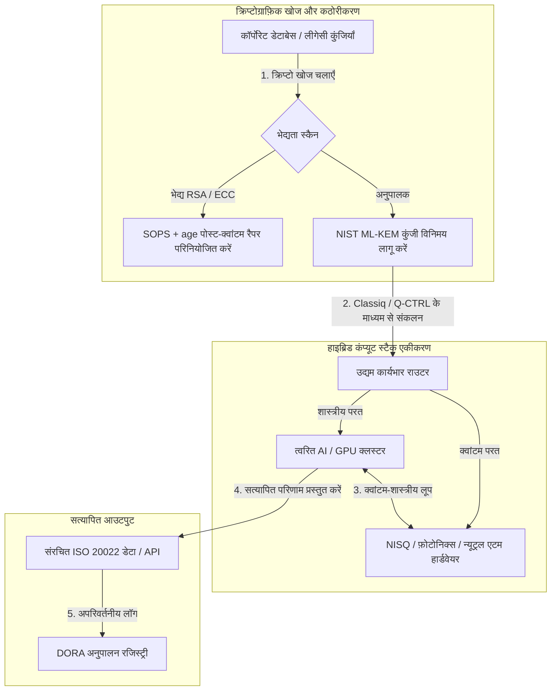

---

# Front Matter (YAML)

author: "contact@sebastienrousseau.com (Sebastien Rousseau)"
banner_alt: "लंदन में Economist Impact के 5वें वार्षिक Commercialising Quantum Global 2026 शिखर सम्मेलन का मंच दृश्य — क्वांटम प्रौद्योगिकी का भौतिकी अनुसंधान से उद्यम-तैयार कार्यप्रवाहों तक संक्रमण का प्रतीक"
banner_height: "1597"
banner_width: "2584"
banner: "https://cloudcdn.pro/stocks/images/sebastien-rousseau-20260617-5th-commercialising-quantum-2.webp"
cdn: "https://cloudcdn.pro"
charset: "UTF-8"
cname: "sebastienrousseau.com"
copyright: "© Copyright 2025 - 2026 - Sebastien Rousseau. All rights reserved."
date: "June 17, 2026"
description: "Economist Impact के 5वें वार्षिक Commercialising Quantum Global 2026 शिखर सम्मेलन से बोर्डरूम निष्कर्ष — $1.3B फंडिंग उछाल, बिना-पछतावे वाले हाइब्रिड स्टैक, पोस्ट-क्वांटम क्रिप्टोग्राफ़ी माइग्रेशन की तात्कालिकता, क्वांटम सेंसिंग का वाणिज्यीकरण और HSBC का निर्देश कि प्रतीक्षा करना अनावश्यक त्रुटि है।"
format-detection: "telephone=no"
hreflang: "hi"
icon: "https://cloudcdn.pro/clients/sebastienrousseau/v1/logos/sebastienrousseau.svg"
id: "https://sebastienrousseau.com/2026-06-17-economist-commercialising-quantum-summit-2026"
image_alt: "Sebastien Rousseau का श्वेत-श्याम चित्र"
image_height: "162"
image_width: "162"
image: "https://cloudcdn.pro/stocks/images/sebastien-rousseau.png"
keywords: "Commercialising Quantum Global 2026, Economist Impact शिखर सम्मेलन, पोस्ट-क्वांटम क्रिप्टोग्राफ़ी, NIST ML-KEM, harvest-now decrypt-later, SNDL, HSBC क्वांटम, Philip Intallura, क्वांटम सेंसिंग, GPS-स्वतंत्र नेविगेशन, NQCC, EU Quantum Act, Quantcore, qBIG पुरस्कार, Lord Vallance, हाइब्रिड क्वांटम-शास्त्रीय, DORA Article 6"
language: "hi-IN"
last_reviewed: "2026-06-17"
layout: "report"
locale: "hi_IN"
logo_alt: "Sebastien Rousseau का लोगो"
logo_height: "44"
logo_width: "44"
logo: "https://cloudcdn.pro/clients/sebastienrousseau/v1/logos/sebastienrousseau.svg"
menu: ""
measurementID: "G-169G4ET5HQ"
name: "Sebastien Rousseau"
permalink: "https://sebastienrousseau.com/2026-06-17-economist-commercialising-quantum-summit-2026"
rating: "general"
referrer: "no-referrer"
robots: "index, follow"
schema: "FAQPage, Article"
seo_title: "Commercialising Quantum 2026: बोर्डरूम निष्कर्ष"
short_name: "sebastienrousseau"
subtitle: "क्वांटम सट्टा-प्रयोगशाला विज्ञान से हाइब्रिड उद्यम कार्यप्रवाहों तक पहुँच चुका है; बोर्डरूम को 2026 में $1.3B फंडिंग, तत्काल पोस्ट-क्वांटम माइग्रेशन और HSBC के 'प्रतीक्षा बंद करें' निर्देश पर प्रतिक्रिया देनी होगी।"
tags: "क्वांटम, पोस्ट-क्वांटम क्रिप्टोग्राफ़ी, NIST ML-KEM, harvest-now decrypt-later, क्वांटम सेंसिंग, HSBC, Economist Impact, हाइब्रिड कंप्यूट, DORA, EU Quantum Act, NQCC, शिखर सम्मेलन निष्कर्ष"
theme-color: "0, 83, 191"
title: "क्यूबिट से मुनाफ़े तक: Economist के 5वें वार्षिक Commercialising Quantum Global 2026 शिखर सम्मेलन से रणनीतिक निष्कर्ष"
url: "https://sebastienrousseau.com/2026-06-17-economist-commercialising-quantum-summit-2026"
viewport: "width=device-width, initial-scale=1, shrink-to-fit=no"

# RSS - The RSS feed front matter (YAML).
atom_link: "https://sebastienrousseau.com/2026-06-17-economist-commercialising-quantum-summit-2026/rss.xml"
category: "Technology"
docs: https://validator.w3.org/feed/docs/rss2.html
generator: "Static Site Generator (SSG) (version 0.0.26)"
item_description: "Economist Impact के 5वें वार्षिक Commercialising Quantum Global 2026 शिखर सम्मेलन से बोर्डरूम निष्कर्ष — $1.3B फंडिंग उछाल, बिना-पछतावे वाले हाइब्रिड स्टैक, पोस्ट-क्वांटम क्रिप्टोग्राफ़ी माइग्रेशन की तात्कालिकता, क्वांटम सेंसिंग का वाणिज्यीकरण और HSBC का निर्देश कि प्रतीक्षा करना अनावश्यक त्रुटि है।"
item_guid: "https://sebastienrousseau.com/2026-06-17-economist-commercialising-quantum-summit-2026/rss.xml"
item_link: "https://sebastienrousseau.com/2026-06-17-economist-commercialising-quantum-summit-2026/rss.xml"
item_pub_date: "Wed, 17 Jun 2026 06:06:06 +0000"
item_title: "क्यूबिट से मुनाफ़े तक: Economist के 5वें वार्षिक Commercialising Quantum Global 2026 शिखर सम्मेलन से रणनीतिक निष्कर्ष"
last_build_date: "Wed, 17 Jun 2026 06:06:06 +0000"
managing_editor: "contact@sebastienrousseau.com (Sebastien Rousseau)"
pub_date: "Wed, 17 Jun 2026 06:06:06 +0000"
ttl: "60"
type: "article"
webmaster: "contact@sebastienrousseau.com"

# Apple - The Apple front matter (YAML).
apple_mobile_web_app_orientations: "portrait"
apple_touch_icon_sizes: "192x192"
apple-mobile-web-app-capable: "yes"
apple-mobile-web-app-status-bar-inset: "black"
apple-mobile-web-app-status-bar-style: "black-translucent"
apple-mobile-web-app-title: "Commercialising Quantum 2026: बोर्डरूम निष्कर्ष"
apple-touch-fullscreen: "yes"

# MS Application - The MS Application front matter (YAML).

msapplication-navbutton-color: "0, 83, 191"

# Twitter Card - The Twitter Card front matter (YAML).

twitter_card: "summary_large_image"
twitter_creator: "@wwdseb"
twitter_description: "Economist Impact के 5वें वार्षिक Commercialising Quantum Global 2026 शिखर सम्मेलन से बोर्डरूम निष्कर्ष — $1.3B फंडिंग उछाल, बिना-पछतावे वाले हाइब्रिड स्टैक, पोस्ट-क्वांटम क्रिप्टोग्राफ़ी माइग्रेशन की तात्कालिकता, क्वांटम सेंसिंग का वाणिज्यीकरण और HSBC का निर्देश कि प्रतीक्षा करना अनावश्यक त्रुटि है।"
twitter_image: "https://cloudcdn.pro/clients/sebastienrousseau/v1/logos/sebastienrousseau.svg"
twitter_image_alt: "Sebastien Rousseau का लोगो"
twitter_site: "@wwdseb"
twitter_title: "Commercialising Quantum 2026: बोर्डरूम निष्कर्ष"
twitter_url: "https://sebastienrousseau.com/2026-06-17-economist-commercialising-quantum-summit-2026"

excerpt: "Economist Impact के 5वें वार्षिक Commercialising Quantum Global 2026 शिखर सम्मेलन ने क्वांटम के उद्यम कार्यप्रवाहों की ओर मोड़ की पुष्टि की: पाँच महीनों में $1.3B जुटाए गए, पोस्ट-क्वांटम क्रिप्टोग्राफ़ी SNDL कटाई के तहत बोर्ड-स्तरीय न्यासिक मुद्दा है, क्वांटम सेंसिंग आज GPS-स्वतंत्र नेविगेशन के लिए शिप हो रही है, और HSBC के Philip Intallura ने यह निर्देश दिया कि फ़ॉल्ट-टॉलरेंट हार्डवेयर की प्रतीक्षा करना अनावश्यक त्रुटि है।"

# Humans.txt - The Humans.txt front matter (YAML).
author_website: "https://sebastienrousseau.com"
author_twitter: "@wwdseb"
author_location: "London, UK"
thanks: "पढ़ने के लिए धन्यवाद!"
site_last_updated: "2026-06-17"
site_standards: "HTML5, CSS3, RSS, Atom, JSON, XML, YAML, Markdown, TOML"
site_components: "Kaishi, Kaishi Builder, Kaishi CLI, Kaishi Templates, Kaishi Themes"
site_software: "Static Site Generator, Rust"

---

# क्यूबिट से मुनाफ़े तक: Economist के 5वें वार्षिक Commercialising Quantum Global 2026 शिखर सम्मेलन से रणनीतिक निष्कर्ष

उद्यम तत्परता, पोस्ट-क्वांटम क्रिप्टोग्राफ़ी माइग्रेशन, हाइब्रिड कंप्यूट स्टैक और क्वांटम सेंसिंग व नेटवर्किंग का उभरता वाणिज्यिक परिदृश्य।

**संक्षेप में।** Economist Impact द्वारा 16–17 जून 2026 को लंदन के Business Design Centre में आयोजित 5वें वार्षिक Commercialising Quantum Global 2026 सम्मेलन ने उद्यम, वित्त, नीति और अनुसंधान क्षेत्रों के 1,100 से अधिक वैश्विक नेताओं को एकत्रित किया। केंद्रीय विषय ने एक स्पष्ट संरचनात्मक मोड़ को रेखांकित किया: क्वांटम प्रौद्योगिकी सट्टा-प्रयोगशाला विज्ञान से व्यावहारिक, हाइब्रिड उद्यम कार्यप्रवाहों तक पहुँच चुकी है। केवल 2026 के पहले पाँच महीनों में $1.3 बिलियन के वेंचर कैपिटल समर्थन के साथ, बोर्डरूम चर्चा अब भौतिक क्यूबिट गिनने पर केंद्रित नहीं है, बल्कि "बिना-पछतावे" वाले हाइब्रिड कंप्यूट स्टैक स्थापित करने, "harvest-now, decrypt-later" (SNDL) क्रिप्टोग्राफ़िक ख़तरे से डिजिटल संपत्तियों को सुरक्षित करने और GPS-स्वतंत्र नेविगेशन के लिए निकट-अवधि क्वांटम सेंसिंग प्रणालियों को परिनियोजित करने पर है।

## मुख्य निष्कर्ष

- **उद्यम का व्यावहारिक कार्यप्रवाहों की ओर बदलाव।** उद्योग के नेताओं (HorizonX के [Steve Suarez](https://www.linkedin.com/in/stevesuarez), HSBC के [Phil Intallura](https://www.linkedin.com/in/intallura)) ने ज़ोर देकर कहा कि क्वांटम एकीकरण अब भौतिकी समस्या नहीं बल्कि परिचालन समस्या है। बैंक और उद्यम प्रतिभा तैयार करने और सक्रिय कार्यभार को अनुकूलित करने के लिए हाइब्रिड क्वांटम-शास्त्रीय पायलट परिनियोजित कर रहे हैं।
- **पोस्ट-क्वांटम क्रिप्टोग्राफ़ी (PQC) बोर्ड प्राथमिकता है।** सुरक्षा और विधि विशेषज्ञों (CMS UK, Microsoft की [Joanne Miller](https://www.linkedin.com/in/joanne-miller-nso), EY के [Craig Farrell](https://www.linkedin.com/in/craig-farrell)) ने चेतावनी दी कि संगठन PQC परिनियोजित करने के लिए फ़ॉल्ट-टॉलरेंट हार्डवेयर की प्रतीक्षा नहीं कर सकते। "Harvest-now, decrypt-later" कटाई आज हो रही है, जिससे NIST ML-KEM मानकों पर माइग्रेशन तत्काल न्यासिक चिंता बन जाता है।
- **क्वांटम सेंसिंग निकट-अवधि लाभप्रदता का नेतृत्व करती है।** जहाँ फ़ॉल्ट-टॉलरेंट कंप्यूटिंग वर्षों दूर है, वहीं क्वांटम सेंसिंग (Infleqtion के [Matthew Kinsella](https://www.linkedin.com/in/matthewkinsella)) तेज़ी से बढ़ रही है। क्वांटम घड़ियाँ और इनर्शियल सेंसर GPS-स्वतंत्र नेविगेशन, राष्ट्रीय सुरक्षा और अति-स्थिर ऊर्जा ग्रिडों में परिनियोजित हो रहे हैं।
- **संप्रभुता, क्लस्टर और नीतिगत तात्कालिकता।** UK विज्ञान मंत्री [Lord Vallance](https://www.linkedin.com/in/patrick-vallance) और [Lord William Hague](https://www.linkedin.com/in/williamhague) ने राष्ट्रीय मिशनों की रूपरेखा प्रस्तुत की कि कैसे अनुसंधान को National Quantum Computing Centre (NQCC) के साथ समन्वय करते हुए औद्योगिक-स्तरीय "सुपरक्लस्टर" में परिवर्तित किया जाए। आगामी EU Quantum Act संप्रभु कंप्यूटिंग क्षमता की भू-राजनीतिक होड़ को और रेखांकित करता है।
- **Quantcore ने qBIG पुरस्कार जीता।** University of Glasgow की स्पिन-आउट Quantcore ने अपने सफल नायोबियम-आधारित सुपरकंडक्टिंग घटकों के लिए IOP qBIG पुरस्कार जीता, जो पारंपरिक सामग्रियों की तुलना में उच्च तापमान पर संचालित होते हैं और क्रायोजेनिक अवसंरचना ओवरहेड को महत्वपूर्ण रूप से घटाते हैं।

**संबंधित पठन:** [KyberLib और 2026 में पोस्ट-क्वांटम बैंकिंग माइग्रेशन: मानकों से कोड तक](https://sebastienrousseau.com/2026-06-12-kyberlib-post-quantum-banking-migration-standards-code-2026/), [2026 में बैंकिंग रेज़िलिएंस इंडेक्स: AI, क्लाउड, क्वांटम, भुगतान और थर्ड-पार्टी संकेंद्रण जोखिम](https://sebastienrousseau.com/2026-06-08-banking-resilience-index-ai-cloud-quantum-payments-third-party-risk-2026/), [2026 में क्लाउड नेटिव बैंकिंग इंडेक्स: DORA, प्लेटफ़ॉर्म इंजीनियरिंग, संप्रभु क्लाउड और परिचालन रेज़िलिएंस](https://sebastienrousseau.com/2026-06-05-cloud-native-banking-index-dora-resilience-platform-engineering-2026/)।

## 01. 2026 का शिखर सम्मेलन बोर्डरूम के लिए क्यों महत्वपूर्ण है

Economist के Commercialising Quantum Global शिखर सम्मेलन का 2026 संस्करण इस बात का स्थायी मोड़ है कि कॉर्पोरेट जगत डीप टेक का मूल्यांकन कैसे करता है।

ऐतिहासिक रूप से क्वांटम कंप्यूटिंग को बहु-दशकीय वैज्ञानिक प्रयास के रूप में R&D विभागों तक सीमित रखा गया था। जून 2026 में यह दृष्टिकोण अप्रचलित है। संगठनों को "भौतिकी-केंद्रित" जिज्ञासा से "व्यवसाय-केंद्रित" क्रियान्वयन की ओर बढ़ना होगा। इसका कारण दोहरा है:

1. **क्वांटम-AI अभिसरण।** उच्च-प्रदर्शन कंप्यूटिंग (HPC) स्टैक शास्त्रीय, त्वरित AI और NISQ (Noisy Intermediate-Scale Quantum) नोड्स को एकल, एकीकृत कंप्यूट परत में मिला रहे हैं। जो संगठन क्वांटम-तैयार अनुप्रयोगों के निर्माण में देर करेंगे, उन्हें पता चलेगा कि रणनीतिक लाभ ग्रहण करने की खिड़की अपेक्षा से तेज़ी से बंद हो रही है।
2. **भू-राजनीतिक और न्यासिक तात्कालिकता।** UK के मिशन-नेतृत्व वाले क्वांटम कार्यक्रम और आगामी EU Quantum Act के साथ क्वांटम क्षमता राष्ट्रीय संप्रभुता और कॉर्पोरेट निरंतरता का विषय बन गई है।

इसके अतिरिक्त, पोस्ट-क्वांटम साइबर सुरक्षा अब कोई भविष्य की अनुपालन आवश्यकता नहीं है। प्रतिकूल "store now, decrypt later" (SNDL) हमलों का ख़तरा यह दर्शाता है कि आज इंटरसेप्ट किया गया कॉर्पोरेट डेटा वाणिज्यिक क्वांटम सिस्टमों के विस्तार पर डिक्रिप्ट किया जाएगा, जिससे Digital Operational Resilience Act (DORA) जैसे वैश्विक परिचालन रेज़िलिएंस अधिदेशों के तहत तत्काल देयता उत्पन्न होती है।

## 02. Commercialising Quantum 2026 रणनीतिक दृष्टिकोण

उद्यम प्रौद्योगिकी नेताओं को क्वांटम परिपक्वता को पाँच विशिष्ट परिचालन परतों में मानचित्रित करना होगा, समय-सीमाओं और बैलेंस-शीट जोखिमों का मूल्यांकन करते हुए।

### तालिका 1: Commercialising Quantum 2026 रणनीतिक दृष्टिकोण

| परत | कॉर्पोरेट फ़ोकस | समय-सीमा / क्षितिज | प्रमुख कॉर्पोरेट जोखिम |
| :---- | :---- | :---- | :---- |
| **हार्डवेयर और कंपाइलर** | प्रतिस्पर्धी दृष्टिकोणों के बीच चयन (सुपरकंडक्टिंग, ट्रैप्ड आयन, न्यूट्रल एटम, फ़ोटोनिक्स) | 3 – 5 वर्ष (फ़ॉल्ट-टॉलरेंस) | बंद-गली वास्तुकला में बंधना या एकल प्लेटफ़ॉर्म पर समय से पहले दाँव लगाना। |
| **क्रिप्टोग्राफ़िक कठोरीकरण** | क्रिप्टोग्राफ़िक निर्भरताओं की खोज और सूचीकरण; NIST ML-KEM पर माइग्रेशन | तत्काल (सक्रिय माइग्रेशन) | DORA और NIST CSF 2.0 के तहत प्रणालीगत डेटा उल्लंघन और अनुपालन विफलताएँ। |
| **क्वांटम सेंसिंग** | GPS-स्वतंत्र नेविगेशन, अति-स्थिर घड़ियों और ग्रेविमीटर का परिनियोजन | 1 – 2 वर्ष (तत्काल वाणिज्यिक) | GPS जैमिंग के कारण लॉजिस्टिक्स, शिपिंग और ऊर्जा ग्रिडों में परिचालन व्यवधान। |
| **सिस्टम एकीकरण** | क्वांटम हार्डवेयर को मौजूदा शास्त्रीय HPC और सुपरकंप्यूटिंग डेटा केंद्रों में जोड़ना | 1 – 3 वर्ष (हाइब्रिड चरण) | उच्च विलंबता, डेटा-स्थानांतरण अड़चनें और खंडित कंप्यूट साइलो। |
| **उद्यम सॉफ़्टवेयर** | उच्च-स्तरीय एब्स्ट्रैक्शन परतों और API के माध्यम से क्वांटम एल्गोरिदम का प्रदर्शन (Classiq, Q-CTRL) | तत्काल (कौशल निर्माण) | वास्तविक इंजीनियरिंग निष्पादन से प्रतिभा और कार्यप्रवाह का अलगाव। |

## 03. प्रमुख क्वांटम संकेत और बोर्डरूम ट्रिगर

प्रौद्योगिकी नेताओं को अपने क्वांटम निवेशों का मार्गदर्शन करने के लिए विशिष्ट, परिमाणीय बाज़ार और नियामक मेट्रिक्स पर नज़र रखनी होगी।

### तालिका 2: प्रमुख क्वांटम संकेत और बोर्डरूम ट्रिगर

| संकेत | परिमाणीय मेट्रिक | नियामक / नीतिगत संदर्भ | क्रियाशील प्लेटफ़ॉर्म प्राथमिकता |
| :---- | :---- | :---- | :---- |
| **क्वांटम फंडिंग उछाल** | 2026 के पहले पाँच महीनों में वैश्विक रूप से $1.3 बिलियन जुटाए गए | Return on Resilience (RoR) | बजट को सट्टा पायलटों से "बिना-पछतावे" वाले हाइब्रिड क्वांटम-शास्त्रीय कार्यभार पर स्थानांतरित करें। |
| **डेटा डिक्रिप्शन जोखिम** | सार्वजनिक चैनलों पर प्रसारित 100% एन्क्रिप्टेड डेटा SNDL कटाई के संपर्क में | DORA Article 6 (ICT सुरक्षा) | संपत्ति-समूह में संवेदनशील RSA/ECC कुंजियों की पहचान के लिए क्रिप्टोग्राफ़िक खोज उपकरण लागू करें। |
| **संप्रभु अवसंरचना** | £2.5 बिलियन UK National Quantum Strategy आवंटन | UK Quantum Missions / Lord Vallance | NQCC जैसे राष्ट्रीय सुपरक्लस्टरों के साथ स्थानीय भागीदारियाँ स्थापित करें। |
| **अनुपालन समय-सीमाएँ** | 14 नवंबर 2026 SWIFT संरचित-पता कटोवर | SWIFT SR 2026 निर्देश | संरचित XML विनिर्देशों को पूरा करने के लिए अंतर-बैंकिंग डेटाबेस को साफ़ और प्रारूपित करें। |

## 04. मुख्य शिखर विषयों का गहन विश्लेषण

### क्वांटम निवेश के निर्णायक मोड़ पर पहुँचा

वेंचर कैपिटल फंडिंग में महत्वपूर्ण तेज़ी आई है, केवल 2026 के पहले पाँच महीनों में **$1.3 बिलियन** जुटाए गए। पिछले वर्षों के सट्टा-हाइप चक्रों के विपरीत, वर्तमान पूँजी लहर वास्तविक, निकट-अवधि कार्यभारों द्वारा समर्थित है। Classiq और IBM Quantum Platform के वक्ताओं ने प्रदर्शित किया कि कैसे सॉफ़्टवेयर एब्स्ट्रैक्शन परतें और स्वचालित कंपाइलर ग़ैर-विशेषज्ञ डेवलपर टीमों को आज के शास्त्रीय अवसंरचना पर हाइब्रिड क्वांटम-शास्त्रीय एल्गोरिदम निष्पादित करने में सक्षम बनाते हैं। यह "बिना-पछतावे" वाली रणनीति संगठनों को तत्काल क्वांटम-तैयार प्रतिभा और कार्यप्रवाह बनाने में सक्षम बनाती है।

### "Harvest now, decrypt later" पर विधिक और नियामक चेतावनियाँ

विधि भागीदारों और साइबर सुरक्षा अधिकारियों ने डेटा जोखिम की तात्कालिकता के इर्द-गिर्द बड़ी सहभागिता उत्पन्न की। प्रायोजक विधि फ़र्म CMS UK और Microsoft CSO [Joanne Miller](https://www.linkedin.com/in/joanne-miller-nso) के प्रतिनिधियों ने वरिष्ठ प्रबंधन को कठोर चेतावनी दी: *पोस्ट-क्वांटम क्रिप्टोग्राफ़ी परिनियोजित करने से पहले फ़ॉल्ट-टॉलरेंट हार्डवेयर के आगमन की प्रतीक्षा करना एक गंभीर न्यासिक विफलता है।*

"Store now, decrypt later" (SNDL) प्रतिमान के तहत शत्रु तत्व आज सक्रिय रूप से एन्क्रिप्टेड कॉर्पोरेट डेटा एकत्र कर रहे हैं, इस इरादे से कि क्रिप्टोग्राफ़िक रूप से प्रासंगिक क्वांटम कंप्यूटर उपलब्ध होते ही उसे डिक्रिप्ट करें। संगठनों को दीर्घ-कालिक संवेदनशील डेटासेट, बौद्धिक संपदा और ऐतिहासिक ग्राहक रिकॉर्ड की रक्षा के लिए तुरंत पोस्ट-क्वांटम सुरक्षा (जैसे NIST ML-KEM) परिनियोजित करनी होगी।

### "क्वांटम सेंसिंग" हाइप का पुनर्संरेखण

जहाँ फ़ॉल्ट-टॉलरेंट क्वांटम कंप्यूटिंग वर्षों दूर है, वहीं शिखर सम्मेलन ने क्वांटम सेंसिंग को वास्तविक-दुनिया परिनियोजन की पहली वास्तविक लाभकारी लहर के रूप में रेखांकित किया। Infleqtion के मुख्य कार्यकारी [Matthew Kinsella](https://www.linkedin.com/in/matthewkinsella) ने विस्तार से बताया कि कैसे क्वांटम घड़ियाँ, इनर्शियल सेंसर और रेडियो-फ्रीक्वेंसी सिस्टम कई उद्योगों में तेज़ी से बढ़ रहे हैं।

चूँकि ये प्रौद्योगिकियाँ भौतिक स्थिरांकों को उप-परमाणु परिशुद्धता से मापती हैं, ये **GPS-स्वतंत्र नेविगेशन**, अति-स्थिर ऊर्जा ग्रिड और गहन-अंतरिक्ष दूरसंचार सक्षम करती हैं। ये अनुप्रयोग बढ़ते GPS-जैमिंग ख़तरों का सामना कर रहे विमानन, समुद्री परिवहन और राष्ट्रीय रक्षा प्रणालियों के लिए अत्यधिक प्रासंगिक हैं।

### इकोसिस्टम और क्लस्टर सहयोग

UK क्वांटम इकोसिस्टम ने लंदन शिखर सम्मेलन का उपयोग घरेलू नवाचार सुपरक्लस्टरों को प्रदर्शित करने के लिए किया। National Quantum Computing Centre (NQCC) और Digital Catapult से लाइव अपडेट ने विस्तार से बताया कि कैसे प्रारंभिक-चरण के डीप-टेक स्पिन-आउट क्वांटम हार्डवेयर को सीधे शास्त्रीय सुपरकंप्यूटिंग डेटा केंद्रों में एकीकृत करके "प्रौद्योगिकी विभाजन" को पाट सकते हैं।

स्कॉटिश क्वांटम स्टार्टअप Quantcore के सह-संस्थापक [Wridhdhisom Karar](https://www.linkedin.com/in/wridhdhisomkarar) ने कंपनी के नायोबियम-आधारित सुपरकंडक्टिंग घटकों के लिए प्रतिष्ठित Institute of Physics (IOP) Quantum Business Innovation and Growth (qBIG) पुरस्कार स्वीकार किया। ये घटक पारंपरिक सामग्रियों की तुलना में उच्च तापमान पर संचालित होते हैं, जिससे क्वांटम प्रोसेसरों को विस्तारित करने के लिए आवश्यक क्रायोजेनिक अवसंरचना ओवरहेड महत्वपूर्ण रूप से घट जाता है।

### HSBC केस स्टडी: क्वांटम की प्रतीक्षा "अनावश्यक त्रुटि" क्यों है

Economist के 5वें वार्षिक Commercialising Quantum Event (2026) में [**Philip Intallura, Ph.D.**](https://www.linkedin.com/in/intallura) (HSBC में Global Head of Quantum Technologies, UK Government Advisor और Board Advisor) से प्राप्त अंतर्दृष्टि ने एक शक्तिशाली बोर्डरूम निर्देश दिया: *"शुरुआत से पहले फ़ॉल्ट-टॉलरेंट क्वांटम की प्रतीक्षा करना एक अनावश्यक त्रुटि है।"*

डॉ. Intallura ने तर्क दिया कि वित्तीय संस्थानों के बीच आम "देखो और प्रतीक्षा करो" दृष्टिकोण तीन ग़लत धारणाओं पर बनाया गया आत्म-घात है:

- **निकट-अवधि ROI वास्तविक है।** अनुभवजन्य परीक्षण में HSBC ने उन मॉडलों से बेहतर प्रदर्शन किया है जो वर्तमान में उत्पादन में चल रहे हैं, क्वांटम कार्य को व्यवसाय के अन्य भागों से जोड़ा है, अपने कुछ सबसे बड़े ग्राहकों के साथ सम्बंध गहरा करने के लिए क्वांटम का उपयोग किया है, और **HSBC Innovation Banking** में महत्वपूर्ण नया व्यवसाय आकर्षित किया है।
- **क्वांटम एक तीव्र अपनाने का वक्र है।** अत्यधिक विनियमित संगठन के भीतर क्षमता निर्माण, रणनीति निर्धारण, फंडिंग सुरक्षित करना और प्रयोग चक्र चलाना कोई छोटा कार्य नहीं है। प्रक्रियाओं को व्यवस्थित रूप से परखा और प्रौद्योगिकी के लिए अनुकूलित किया जाना चाहिए।
- **क्वांटम एक इकोसिस्टम है।** कोई एकल खिलाड़ी अकेले वहाँ नहीं पहुँचता। HSBC द्वारा निष्पादित प्रत्येक शोध पत्र, POC और पायलट एक क्वांटम प्रदाता के साथ निकट सहयोग में रहा है — और कुछ मामलों में सहयोग शिक्षाविदों, नियामकों और सरकार तक विस्तृत है।

**अंतिम बोर्डरूम निर्देश:** *"फ़ॉल्ट टॉलरेंस के पहले दिन आपको जो क्षमता चाहिए होगी, वह वही है जो आप अभी बनाते हैं।"*

## 05. कॉर्पोरेट क्वांटम एकीकरण और क्रिप्टोग्राफ़ी पाइपलाइन

डिजिटल संपत्तियों को सुरक्षित करते हुए क्वांटम तत्परता का निर्माण करने के लिए, उद्यम को एक स्पष्ट एकीकरण पाइपलाइन स्थापित करनी होगी।

## 06. बोर्डरूम प्लेबुक: क्रियाशील अनिवार्यताएँ

Commercialising Quantum Global 2026 शिखर सम्मेलन की अंतर्दृष्टियों को तत्काल व्यावसायिक मूल्य में अनुवादित करने के लिए, वरिष्ठ प्रबंधन को निम्नलिखित चार-चरणीय बोर्डरूम प्लेबुक निष्पादित करनी चाहिए:

1. **क्रिप्टोग्राफ़िक खोज अनिवार्य करें।** Chief Information Security Officer (CISO) को निर्देश दें कि वे सभी क्रिप्टोग्राफ़िक संपत्तियों की सूची बनाएँ, उद्यम भर में प्रत्येक लीगेसी RSA और ECC कुंजी का मानचित्रण करते हुए पोस्ट-क्वांटम माइग्रेशन की तैयारी करें।
2. **"बिना-पछतावे" वाली हाइब्रिड रणनीति परिनियोजित करें।** उत्तम हार्डवेयर की प्रतीक्षा से बचें। आज ही आंतरिक प्रतिभा विकसित करने और जटिल लॉजिस्टिक्स या जोखिम पोर्टफ़ोलियो को अनुकूलित करने के लिए क्वांटम-प्रेरित सॉफ़्टवेयर और हाइब्रिड शास्त्रीय-क्वांटम पायलटों में निवेश करें।
3. **लॉजिस्टिक्स के लिए क्वांटम सेंसिंग का मूल्यांकन करें।** यदि आपका संगठन वैश्विक आपूर्ति श्रृंखलाओं, शिपिंग या महत्वपूर्ण अवसंरचना पर निर्भर है, तो भू-राजनीतिक व्यवधान जोखिमों को कम करने के लिए क्वांटम सेंसिंग प्रणालियों (जैसे GPS-स्वतंत्र नेविगेशन) का सक्रिय रूप से मूल्यांकन करें।
4. **30 जून के Insight Hour के लिए पंजीकरण करें।** सुनिश्चित करें कि आपके प्रौद्योगिकी नेता उद्यम जोखिम प्रबंधन और प्रतिभा आवंटन रणनीतियों पर नज़र रखने के लिए 30 जून 2026 को दोपहर 3:00 BST पर वर्चुअल **Commercialising Quantum Global Insight Hour** (IonQ द्वारा समर्थित) के लिए पंजीकरण करें।

## 07. अक्सर पूछे जाने वाले प्रश्न

**"Harvest now, decrypt later" (SNDL) क्या है और यह आज क्यों मायने रखता है?**
SNDL आज एन्क्रिप्टेड डेटा को इंटरसेप्ट करने और संग्रहीत करने का अभ्यास है, इस इरादे से कि क्रिप्टोग्राफ़िक रूप से प्रासंगिक क्वांटम कंप्यूटरों के उपलब्ध होते ही उसे डिक्रिप्ट किया जाए। दीर्घ-कालिक संवेदनशील डेटासेट — बौद्धिक संपदा, ग्राहक रिकॉर्ड, सरकारी संचार — पहले से ही निशाने पर हैं। NIST ML-KEM पर माइग्रेशन एक न्यासिक निर्णय है जिसे बोर्ड स्थगित नहीं कर सकता।

**कंप्यूटिंग के बजाय क्वांटम सेंसिंग पहली वाणिज्यिक लहर क्यों है?**
क्वांटम सेंसर भौतिक स्थिरांकों को उप-परमाणु परिशुद्धता से मापते हैं और उन्हें फ़ॉल्ट-टॉलरेंट हार्डवेयर की आवश्यकता नहीं है जो क्वांटम कंप्यूटिंग को चाहिए। क्वांटम घड़ियाँ, ग्रेविमीटर और इनर्शियल सेंसर पहले से ही GPS-स्वतंत्र नेविगेशन, अति-स्थिर ऊर्जा ग्रिडों और गहन-अंतरिक्ष संचार के लिए पायलट परिनियोजन में हैं।

**क्या HSBC का क्वांटम कार्य केवल R&D है या इसने मापनीय रिटर्न दिए हैं?**
शिखर सम्मेलन में Philip Intallura के अनुसार, HSBC ने उन मॉडलों से बेहतर प्रदर्शन किया है जो वर्तमान में उत्पादन में चल रहे हैं, अपने सबसे बड़े ग्राहकों के साथ सम्बंध गहरा करने के लिए क्वांटम का उपयोग किया है, और HSBC Innovation Banking में महत्वपूर्ण नया व्यवसाय आकर्षित किया है। यह कार्य अनुसंधान से परिचालन एकीकरण की ओर बढ़ चुका है।

## 08. संदर्भ

- **Economist Impact, (2026).** *5th Annual Commercialising Quantum Global 2026.* लाइव सम्मेलन कार्यवाही, 16–17 जून 2026। लंदन: Business Design Centre। उपलब्ध: [Economist Impact](https://events.economist.com/commercialising-quantum/)।
- **National Institute of Standards and Technology (NIST), (2024).** *First Three Finalized Post-Quantum Encryption Standards (FIPS 203, 204, and 205).* Gaithersburg: U.S. Department of Commerce। उपलब्ध: [NIST Standards](https://www.nist.gov/news-events/news/2024/08/nist-releases-first-3-finalized-post-quantum-encryption-standards)।
- **European Parliament and Council of the European Union, (2022).** *Regulation (EU) 2022/2554 on digital operational resilience for the financial sector (DORA).* Brussels: Official Journal of the European Union। उपलब्ध: [DORA Regulation](https://eur-lex.europa.eu/legal-content/EN/TXT/?uri=CELEX%3A32022R2554)।
- **SWIFT, (2024).** *ISO 20022 November 2026 Structured Address Milestone.* La Hulpe: SWIFT। उपलब्ध: [SWIFT ISO 20022 milestone](https://www.swift.com/standards/iso-20022/iso-20022-bytes/call-action-november-2026)।
