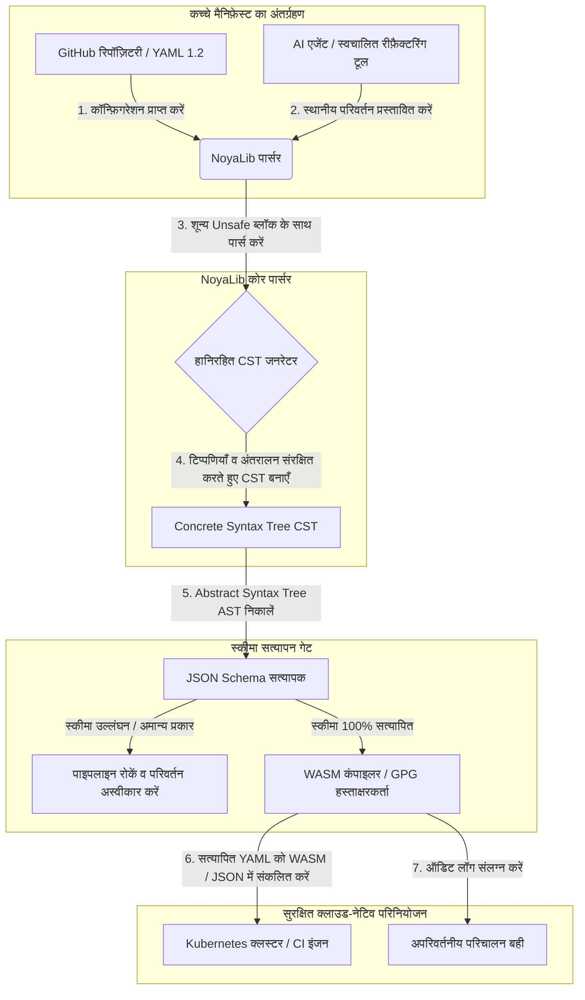

---

# Front Matter (YAML)

author: "contact@sebastienrousseau.com (Sebastien Rousseau)"
banner_alt: "नाटकीय प्रकाश में स्थापत्य ज्यामिति — CI, Kubernetes, MCP और वित्तीय-सेवा कॉन्फ़िगरेशन के नीचे भार-वहन करने वाले सुरक्षित Rust YAML पार्सर के रूप में NoyaLib की भूमिका का प्रतीक"
banner_height: "1597"
banner_width: "2584"
banner: "https://cloudcdn.pro/stocks/images/ken-cheung-KonWFWUaAuk.webp"
cdn: "https://cloudcdn.pro"
charset: "UTF-8"
cname: "sebastienrousseau.com"
copyright: "© Copyright 2025 - 2026 - Sebastien Rousseau. All rights reserved."
date: "June 18, 2026"
description: "NoyaLib — शून्य-unsafe Rust YAML 1.2 पार्सर, 406/406 स्पेक अनुपालन, JSON Schema सत्यापन, हानिरहित CST और वित्तीय अवसंरचना हेतु MCP/WASM बाइंडिंग।"
format-detection: "telephone=no"
hreflang: "hi"
icon: "https://cloudcdn.pro/clients/sebastienrousseau/v1/logos/sebastienrousseau.svg"
id: "https://sebastienrousseau.com/2026-06-18-noyalib-safe-yaml-rust-ai-mcp-financial-infrastructure-2026"
image_alt: "Sebastien Rousseau का श्वेत-श्याम चित्र"
image_height: "162"
image_width: "162"
image: "https://cloudcdn.pro/stocks/images/sebastienrousseau.webp"
keywords: "सुरक्षित Rust YAML पार्सर, NoyaLib, YAML 1.2 स्पेक अनुपालन, शून्य-unsafe Rust, JSON Schema सत्यापन, हानिरहित Concrete Syntax Tree, CST, MCP, Model Context Protocol, WebAssembly, Kubernetes मैनिफ़ेस्ट, CI/CD कॉन्फ़िगरेशन, DORA Article 5, BCBS 239, Basel III परिचालन जोखिम, वित्तीय अवसंरचना, कॉन्फ़िगरेशन सुरक्षा, सॉफ़्टवेयर सप्लाई चेन"
language: "hi-IN"
last_reviewed: "2026-06-18"
layout: "report"
locale: "hi_IN"
logo_alt: "Sebastien Rousseau का लोगो"
logo_height: "44"
logo_width: "44"
logo: "https://cloudcdn.pro/clients/sebastienrousseau/v1/logos/sebastienrousseau.svg"
menu: ""
measurementID: "G-169G4ET5HQ"
name: "Sebastien Rousseau"
permalink: "https://sebastienrousseau.com/2026-06-18-noyalib-safe-yaml-rust-ai-mcp-financial-infrastructure-2026"
rating: "general"
referrer: "no-referrer"
robots: "index, follow"
schema: "FAQPage, Article"
seo_title: "AI, MCP और वित्त हेतु सुरक्षित Rust YAML पार्सर"
short_name: "sebastienrousseau"
subtitle: "एक सुरक्षित Rust YAML स्टैक — NoyaLib — YAML 1.2 को सुविधाजनक मार्कअप से बदलकर AI एजेंटों, MCP, Kubernetes और वित्तीय-सेवा अवसंरचना हेतु क्रिप्टोग्राफ़िक रूप से सुरक्षित, स्पेक-अनुपालक कॉन्फ़िगरेशन नियंत्रण-तल में परिवर्तित करता है।"
tags: "सुरक्षित Rust YAML पार्सर, NoyaLib, YAML 1.2, शून्य-unsafe Rust, JSON Schema, MCP, WebAssembly, Kubernetes, DORA, BCBS 239, Basel III, वित्तीय अवसंरचना, सप्लाई चेन सुरक्षा"
theme-color: "0, 83, 191"
title: "2026 में AI, MCP और वित्तीय अवसंरचना हेतु YAML को एक सुरक्षित Rust स्टैक की आवश्यकता क्यों है"
url: "https://sebastienrousseau.com/2026-06-18-noyalib-safe-yaml-rust-ai-mcp-financial-infrastructure-2026"
viewport: "width=device-width, initial-scale=1, shrink-to-fit=no"

# RSS - The RSS feed front matter (YAML).
atom_link: "https://sebastienrousseau.com/2026-06-18-noyalib-safe-yaml-rust-ai-mcp-financial-infrastructure-2026/rss.xml"
category: "Technology"
docs: https://validator.w3.org/feed/docs/rss2.html
generator: "Static Site Generator (SSG) (version 0.0.26)"
item_description: "NoyaLib — शून्य-unsafe Rust YAML 1.2 पार्सर, 406/406 स्पेक अनुपालन, JSON Schema सत्यापन, हानिरहित CST और वित्तीय अवसंरचना हेतु MCP/WASM बाइंडिंग।"
item_guid: "https://sebastienrousseau.com/2026-06-18-noyalib-safe-yaml-rust-ai-mcp-financial-infrastructure-2026/rss.xml"
item_link: "https://sebastienrousseau.com/2026-06-18-noyalib-safe-yaml-rust-ai-mcp-financial-infrastructure-2026/rss.xml"
item_pub_date: "Thu, 18 Jun 2026 06:06:06 +0000"
item_title: "2026 में AI, MCP और वित्तीय अवसंरचना हेतु YAML को एक सुरक्षित Rust स्टैक की आवश्यकता क्यों है"
last_build_date: "Thu, 18 Jun 2026 06:06:06 +0000"
managing_editor: "contact@sebastienrousseau.com (Sebastien Rousseau)"
pub_date: "Thu, 18 Jun 2026 06:06:06 +0000"
ttl: "60"
type: "article"
webmaster: "contact@sebastienrousseau.com"

# Apple - The Apple front matter (YAML).
apple_mobile_web_app_orientations: "portrait"
apple_touch_icon_sizes: "192x192"
apple-mobile-web-app-capable: "yes"
apple-mobile-web-app-status-bar-inset: "black"
apple-mobile-web-app-status-bar-style: "black-translucent"
apple-mobile-web-app-title: "AI, MCP और वित्त हेतु सुरक्षित Rust YAML पार्सर"
apple-touch-fullscreen: "yes"

# MS Application - The MS Application front matter (YAML).

msapplication-navbutton-color: "0, 83, 191"

# Twitter Card - The Twitter Card front matter (YAML).

twitter_card: "summary_large_image"
twitter_creator: "@wwdseb"
twitter_description: "NoyaLib — शून्य-unsafe Rust YAML 1.2 पार्सर, 406/406 स्पेक अनुपालन, JSON Schema सत्यापन, हानिरहित CST और वित्तीय अवसंरचना हेतु MCP/WASM बाइंडिंग।"
twitter_image: "https://cloudcdn.pro/clients/sebastienrousseau/v1/logos/sebastienrousseau.svg"
twitter_image_alt: "Sebastien Rousseau का लोगो"
twitter_site: "@wwdseb"
twitter_title: "AI, MCP और वित्त हेतु सुरक्षित Rust YAML पार्सर"
twitter_url: "https://sebastienrousseau.com/2026-06-18-noyalib-safe-yaml-rust-ai-mcp-financial-infrastructure-2026"

excerpt: "NoyaLib एक सुरक्षित Rust YAML स्टैक है — शून्य unsafe ब्लॉक, 406/406 YAML 1.2 स्पेक अनुपालन, हानिरहित Concrete Syntax Tree, JSON Schema (Draft 2020-12) सत्यापन और MCP/WASM बाइंडिंग — AI एजेंटों, Kubernetes, CI/CD और वित्तीय अवसंरचना के पीछे के कॉन्फ़िगरेशन नियंत्रण-तल हेतु अभियांत्रिकीकृत।"

# Humans.txt - The Humans.txt front matter (YAML).
author_website: "https://sebastienrousseau.com"
author_twitter: "@wwdseb"
author_location: "London, UK"
thanks: "पढ़ने के लिए धन्यवाद!"
site_last_updated: "2026-06-18"
site_standards: "HTML5, CSS3, RSS, Atom, JSON, XML, YAML, Markdown, TOML"
site_components: "Kaishi, Kaishi Builder, Kaishi CLI, Kaishi Templates, Kaishi Themes"
site_software: "Static Site Generator, Rust"

---

# 2026 में AI, MCP और वित्तीय अवसंरचना हेतु YAML को एक सुरक्षित Rust स्टैक की आवश्यकता क्यों है

एक सुरक्षित Rust YAML स्टैक मायने रखता है क्योंकि YAML अब CI/CD पाइपलाइनें, Kubernetes मैनिफ़ेस्ट, [Open Policy Agent](https://www.openpolicyagent.org/) नियम और Model Context Protocol (MCP) टूल रजिस्ट्रियाँ ढोता है — और एक अकेला अस्पष्ट पार्स एक क्लियरिंग प्रणाली को तोड़ सकता है, सुरक्षा समूह को ग़लत-कॉन्फ़िगर कर सकता है, या स्थानीय AI एजेंट को ग़लत अनुमतियाँ सौंप सकता है। [NoyaLib](https://github.com/sebastienrousseau/noyalib) एक शुद्ध-Rust, शून्य-unsafe [YAML 1.2](https://yaml.org/spec/1.2.2/) पार्सिंग एवं सत्यापन इकोसिस्टम है, जिसे उस अवसंरचना को डिफ़ॉल्ट रूप से सुरक्षित बनाने के लिए अभियांत्रिकीकृत किया गया है।

## संक्षिप्त उत्तर

**एक वाक्य में NoyaLib क्या है?** NoyaLib एक ओपन-सोर्स, शुद्ध-Rust YAML 1.2 पार्सर और सत्यापन इकोसिस्टम है — शून्य `unsafe` कोड, आधिकारिक 406-परीक्षण YAML सूट पर 100% स्पेक अनुपालन, एक हानिरहित Concrete Syntax Tree और रीयल-टाइम [JSON Schema](https://json-schema.org/) सत्यापन के साथ — AI-एजेंट, MCP, Kubernetes और वित्तीय-अवसंरचना कॉन्फ़िगरेशन को डिफ़ॉल्ट रूप से सुरक्षित बनाने हेतु अभियांत्रिकीकृत।

## कार्यकारी सारांश

YAML विनम्र दिखता है — जब तक कि कोई अस्पष्ट पार्स या स्कीमा उल्लंघन बहु-अरब डॉलर की उत्पादन क्लियरिंग प्रणाली को न तोड़ दे। 2026 में YAML [CI/CD](https://docs.github.com/en/actions/learn-github-actions/workflow-syntax-for-github-actions) पाइपलाइनों, [Kubernetes](https://kubernetes.io/docs/concepts/configuration/overview/) मैनिफ़ेस्ट, [Open Policy Agent](https://www.openpolicyagent.org/) नियमों और Model Context Protocol (MCP) टूल रजिस्ट्रियों का वास्तविक मानक है। अपारदर्शी लीगेसी पार्सर — मेमोरी भेद्यताओं और विनाशकारी पार्सिंग के साथ — एक अस्वीकार्य सुरक्षा जोखिम हैं। NoyaLib एक शुद्ध-Rust, शून्य-unsafe YAML 1.2 इकोसिस्टम है: सभी 406 आधिकारिक सूट परीक्षणों पर 100% स्पेक अनुपालन, एक हानिरहित Concrete Syntax Tree (CST) जो टिप्पणियों और अंतरालन को संरक्षित करता है, और अंतर्निहित JSON Schema सत्यापन। परिणाम — YAML को एक ऑडिट-योग्य, सुरक्षित और एजेंट-सुलभ कॉन्फ़िगरेशन नियंत्रण-तल के रूप में पुनः ढाला गया है।

## मुख्य निष्कर्ष

- **कॉन्फ़िगरेशन ही उत्पादन कोड है।** एक अकेली विकृत YAML फ़ाइल क्लाउड-नेटिव सुरक्षा समूहों या AI-एजेंट अनुमतियों को ग़लत-कॉन्फ़िगर कर सकती है। NoyaLib YAML को महत्वपूर्ण अवसंरचना के रूप में मानता है।
- **शून्य-unsafe डिज़ाइन।** पूरी तरह से सुरक्षित Rust में निर्मित, शून्य `unsafe` ब्लॉक के साथ, NoyaLib मुख्य पार्सिंग परतों में मेमोरी-सुरक्षा भेद्यताओं — बफ़र ओवरफ़्लो, रिमोट कोड एक्ज़ीक्यूशन — को समाप्त करता है।
- **पूर्ण 406/406 स्पेक अनुपालन।** कॉन्फ़िगरेशन संरचनाओं को गणितीय रूप से सत्यापित करता है, स्टेजिंग और उत्पादन परिवेशों के बीच पार्सिंग विसंगतियों और संरचनात्मक बहाव को समाप्त करता है।
- **हानिरहित Concrete Syntax Tree।** लीगेसी पार्सरों के विपरीत जो टिप्पणियों और स्वरूपण को हटा देते हैं, NoyaLib अंतरालन और टिप्पणियों को संरक्षित करता है, AI एजेंटों द्वारा सुरक्षित, राउंड-ट्रिप स्वचालित रीफ़ैक्टरिंग को सक्षम बनाता है।
- **बोर्ड-स्तरीय न्यासिक मूल्य।** कॉन्फ़िगरेशन अखंडता को [DORA Article 5](https://eur-lex.europa.eu/legal-content/EN/TXT/?uri=CELEX%3A32022R2554) और [Basel III](https://www.bis.org/bcbs/publ/d424.htm) परिचालन-जोखिम पूँजी मेट्रिक्स से जोड़ता है, जिससे वरिष्ठ प्रबंधन व्यक्तिगत देयता से सीधे संरक्षित होता है।

**संबंधित पठन:** [KyberLib और 2026 में पोस्ट-क्वांटम बैंकिंग माइग्रेशन: मानकों से कोड तक](https://sebastienrousseau.com/2026-06-12-kyberlib-post-quantum-banking-migration-standards-code-2026/), [2026 में क्लाउड नेटिव बैंकिंग इंडेक्स: DORA, प्लेटफ़ॉर्म इंजीनियरिंग, संप्रभु क्लाउड और परिचालन रेज़िलिएंस](https://sebastienrousseau.com/2026-06-05-cloud-native-banking-index-dora-resilience-platform-engineering-2026/), [2026 में AI-जागरूक डॉटफ़ाइलें: MCP, SLSA और बहु-शेल समानता हेतु एक सुरक्षित, पुनरुत्पादनीय डेवलपर वर्कस्टेशन का निर्माण](https://sebastienrousseau.com/2026-06-16-ai-aware-dotfiles-secure-reproducible-workstation-2026/)।

## 01. 2026 में एक सुरक्षित Rust YAML स्टैक क्यों मायने रखता है

जून 2026 में, उद्यम IT अवसंरचनाएँ अत्यधिक वितरित और तेज़ी से स्वचालित होती जा रही हैं।

YAML चुपचाप सम्पूर्ण सॉफ़्टवेयर-इंजीनियरिंग स्टैक की भार-वहन करने वाली कॉन्फ़िगरेशन भाषा बन गया है। यह सतत-एकीकरण (CI) कार्यप्रवाहों को ढोता है जो उत्पादन कलाकृतियों को संकलित करते हैं, [Kubernetes](https://kubernetes.io/docs/concepts/overview/) मैनिफ़ेस्ट जो वैश्विक क्लाउड-नेटिव क्लस्टरों का ऑर्केस्ट्रेशन करते हैं, और [Model Context Protocol](https://modelcontextprotocol.io/) (MCP) सर्वर स्कीमा जो स्थानीय AI एजेंटों को स्थानीय परिचालन निष्पादित करने की अनुमति प्रदान करते हैं।

लीगेसी YAML पार्सर — [PyYAML](https://pyyaml.org/), [yaml-cpp](https://github.com/jbeder/yaml-cpp), [libyaml](https://github.com/yaml/libyaml) — दो संरचनात्मक जोखिम वहन करते हैं:

1. **टाइप-कोअर्शन भेद्यताएँ ("Norway problem")।** लीगेसी पार्सर अक्सर बिना-उद्धरण वाली स्ट्रिंग्स को बदल देते हैं (देश कोड `NO` को बूलियन `false` में, `yes`/`no` को भी इसी प्रकार) — [YAML 1.1 बनाम 1.2 बूलियन टैग](https://yaml.org/type/bool.html) देखें — जिससे महत्वपूर्ण प्रणाली विफलताएँ या मूक सुरक्षा-दुर्विन्यास होते हैं।
2. **मेमोरी-सुरक्षा शोषण।** C/C++ में लिखे अपारदर्शी पार्सर मेमोरी-लीक और बफ़र-ओवरफ़्लो शोषणों से ग्रस्त हैं, जो मुख्य बिल्ड सर्वरों पर रिमोट कोड एक्ज़ीक्यूशन (RCE) तक ले जा सकते हैं।

[NoyaLib](https://github.com/sebastienrousseau/noyalib) इन चुनौतियों का समाधान करता है। यह एक शुद्ध-Rust, शून्य-unsafe YAML 1.2 पार्सिंग एवं सत्यापन इकोसिस्टम है। पूर्ण 406/406 स्पेक अनुपालन प्राप्त करके और पार्स के दौरान सीधे कठोर JSON Schema सत्यापन लागू करके, NoyaLib उच्च **Return on Resilience (RoR)** प्रदान करता है — कॉन्फ़िगरेशन-जनित डाउनटाइम को रोकता है और वित्तीय-ग्रेड सॉफ़्टवेयर सप्लाई चेन को सुरक्षित करता है।

## 02. NoyaLib 2026 वास्तुकला दृष्टिकोण

NoyaLib इकोसिस्टम एक सुरक्षित, हानिरहित कॉन्फ़िगरेशन पार्सर के रूप में संचालित होता है। प्रत्येक स्थानीय और क्लाउड मैनिफ़ेस्ट को सबसे निचली निष्पादन परत पर संरचनात्मक रूप से सत्यापित और संरक्षित किया जाता है।

### तालिका 1: NoyaLib वास्तुकला परतें और जोखिम न्यूनीकरण

| परत | डिज़ाइन निर्णय | यह क्यों मायने रखता है | ग़लत संभाले जाने पर जोखिम |
| ---- | ---- | ---- | ---- |
| **पार्सर परत** | YAML 1.2-अनुपालक, शून्य `unsafe` ब्लॉक के साथ शुद्ध-Rust पार्सर | सबसे निचली निष्पादन परत पर मेमोरी-सुरक्षा भेद्यताओं और बफ़र ओवरफ़्लो को समाप्त करता है। | मुख्य बिल्ड सर्वरों पर रिमोट कोड एक्ज़ीक्यूशन (RCE)। |
| **अनुरूपता परत** | 406/406 आधिकारिक YAML 1.2 सूट परीक्षणों पर 100% अनुपालन | स्टेजिंग और उत्पादन के बीच पार्सिंग विसंगतियों और टाइप-कोअर्शन बहाव को समाप्त करता है। | "Norway problem" टाइप-कोअर्शन त्रुटियाँ जो सुरक्षा समूह निष्क्रिय कर देती हैं। |
| **सिंटैक्स-ट्री परत** | हानिरहित Concrete Syntax Tree (CST) | राउंड-ट्रिप पार्सिंग और प्रोग्रामेटिक रीफ़ैक्टरिंग के दौरान टिप्पणियाँ, अंतरालन और क्रम संरक्षित करता है। | स्वचालित AI रीफ़ैक्टरिंग द्वारा डेवलपर टिप्पणियों का विनाश। |
| **सत्यापन परत** | पार्सिंग के दौरान [JSON Schema (Draft 2020-12)](https://json-schema.org/draft/2020-12/release-notes) सत्यापन | उत्पादन क्लस्टरों तक पहुँचने से पहले कॉन्फ़िगरेशन फ़ाइलों पर कठोर डेटा मॉडल लागू करता है। | विकृत कॉन्फ़िगरेशन फ़ाइलें क्लाउड-नेटिव क्लस्टर क्रैश को ट्रिगर करती हैं। |
| **इंटरफ़ेस परत** | WebAssembly (WASM) और MCP बाइंडिंग | कॉन्फ़िगरेशन सत्यापन को सीधे ब्राउज़र, एज नोड और स्थानीय एजेंट टूलकिट के अंदर चलने देता है। | टूलिंग साइलो जहाँ सत्यापन एज डिवाइसों पर निष्पादित नहीं हो सकता। |

## 03. प्रमुख वर्कस्टेशन और कॉन्फ़िगरेशन सुरक्षा संकेत

विकास और परिचालन परिसर में पूर्ण सुरक्षा बनाए रखने के लिए, Chief Information Security Officers (CISOs) को विशिष्ट, परिमाणीय मेट्रिक्स की निगरानी करनी होगी।

### तालिका 2: वर्कस्टेशन और कॉन्फ़िगरेशन सुरक्षा संकेत

| संकेत | मेट्रिक / परिचालन बेंचमार्क | NIST CSF / DORA संदर्भ | तकनीकी प्लेटफ़ॉर्म कार्यान्वयन |
| ---- | ---- | ---- | ---- |
| **पार्सर अनुरूपता** | आधिकारिक YAML 1.2 परीक्षण सूट पर 100% पास दर (406/406 परीक्षण)। | [DORA Article 6](https://eur-lex.europa.eu/legal-content/EN/TXT/?uri=CELEX%3A32022R2554) (ICT सुरक्षा) | CI निष्पादन से पहले सभी मैनिफ़ेस्टों को सत्यापित करने वाला NoyaLib पार्सर कोर। |
| **मेमोरी सुरक्षा प्रोफ़ाइल** | पार्सर और सिरीयलाइज़र निर्भरताओं के भीतर शून्य `unsafe` Rust ब्लॉक। | DORA Article 30 (सप्लाई चेन) | कार्गो बिल्ड में स्वचालित कंपाइलर जाँचें ([`forbid(unsafe_code)`](https://doc.rust-lang.org/reference/attributes/diagnostics.html#the-forbid-attribute))। |
| **स्कीमा सत्यापन** | वैध [JSON Schema](https://json-schema.org/) मॉडल के विरुद्ध 100% पार्स की गई कॉन्फ़िगरेशन फ़ाइलें सत्यापित। | [NIST CSF 2.0](https://www.nist.gov/cyberframework) (PR.DS-01) | स्कीमा उल्लंघन पर बिल्ड पाइपलाइन रोकने वाला रीयल-टाइम सत्यापन गेट। |
| **कॉन्फ़िगरेशन बहाव** | स्थानीय कॉन्फ़िगरेशन फ़ाइलों का git-वर्शनित स्थिति में रीयल-टाइम पहचान और पुनर्प्राप्ति। | Return on Resilience (RoR) | सभी स्थानीय फ़ाइल संशोधनों का सतत टेलीमेट्री लॉगिंग। |
| **एजेंट एक्सेस नियंत्रण** | MCP कॉन्फ़िगरेशन के माध्यम से संचालित स्थानीय AI टूल हेतु सीमित, केवल-पठनीय अनुमतियाँ। | मॉडल जोखिम प्रबंधन ([SR 11-7](https://www.federalreserve.gov/supervisionreg/srletters/sr1107.htm)) | अनुमोदित निर्देशिकाओं तक एजेंट परिचालन सीमित करने वाली MCP सर्वर सीमाएँ। |

## 04. अपारदर्शी कॉन्फ़िगरेशन पार्सिंग का भ्रम

क्लाउड-नेटिव परिचालनों में एक प्रमुख भेद्यता *अपारदर्शी पार्सिंग* है — ऐसे पार्सर का उपयोग जो संरचनात्मक मेटाडेटा (टिप्पणियाँ, श्वेत-स्थान, दस्तावेज़ क्रम) त्याग देते हैं या संकलन के दौरान चुपचाप टाइप कोअर्स कर देते हैं। यह व्यवहार दो गंभीर सुरक्षा जोखिम लाता है:

1. **विनाशकारी रीफ़ैक्टरिंग।** जब कोई AI कोडिंग सहायक या स्वचालित रीफ़ैक्टरिंग टूल किसी परिनियोजन मैनिफ़ेस्ट को अद्यतन करता है, पारंपरिक पार्सर डेवलपर टिप्पणियाँ और स्वरूपण त्याग देते हैं, जिससे मानवीय समीक्षाओं और घटना-पश्चात फ़ोरेंसिक्स हेतु आवश्यक संदर्भ नष्ट हो जाता है।
2. **पार्सिंग विसंगतियाँ।** यदि कोई स्टेजिंग परिवेश Python-आधारित पार्सर का उपयोग करता है और उत्पादन C-आधारित पार्सर चलाता है, तो YAML 1.2 स्पेक अनुपालन में मामूली अंतर एक वैध स्टेजिंग मैनिफ़ेस्ट को उत्पादन में विफल या भिन्न रूप से व्यवहार करने का कारण बन सकते हैं, जिससे छिपी सुरक्षा भेद्यताएँ पैदा होती हैं।

NoyaLib का **हानिरहित Concrete Syntax Tree (CST)** इसे हल करता है। यह पार्स-और-सिरीयलाइज़ लूप के दौरान प्रत्येक स्थान, टिप्पणी और दस्तावेज़ पंक्ति को संरक्षित करता है। स्वचालित AI सहायक मानव-लिखित टिप्पणियों के 100% को संरक्षित करते हुए कॉन्फ़िगरेशन फ़ाइलों को संपादित, रीफ़ैक्टर और कमिट कर सकते हैं — एक पूर्ण ऑडिट ट्रेल।

## 05. एक सीमित AI कॉन्फ़िगरेशन पाइपलाइन का डिज़ाइन

दुर्भावनापूर्ण कॉन्फ़िगरेशन परिवर्तनों को उत्पादन परिवेशों तक पहुँचने से रोकने के लिए, संगठन को एक सख्ती से सीमित, स्कीमा-सत्यापित कॉन्फ़िगरेशन पाइपलाइन लागू करनी होगी।

नीचे दिया गया परिचालन प्रवाह दर्शाता है कि कैसे NoyaLib कच्चे YAML को पार्स करता है, एक हानिरहित CST का निर्माण करता है, AST को JSON Schema मॉडल के विरुद्ध सत्यापित करता है, और ब्राउज़र या एज परिवेशों हेतु WebAssembly बाइंडिंग संकलित करता है।

## 06. बोर्डरूम प्लेबुक और न्यासिक देयता

कॉन्फ़िगरेशन सुरक्षा और सॉफ़्टवेयर-सप्लाई-चेन अखंडता महत्वपूर्ण बोर्डरूम प्राथमिकताएँ हैं। वरिष्ठ प्रबंधकों को कॉन्फ़िगरेशन प्रबंधन को न्यासिक कर्तव्य और परिचालन रेज़िलिएंस के दृष्टिकोण से देखना चाहिए।

- **DORA Article 5 (बोर्ड जवाबदेही)।** यह निर्देश देता है कि संस्थान के ICT जोखिम के प्रबंधन की अंतिम, गैर-प्रत्यायोजनीय ज़िम्मेदारी बोर्ड पर है। चूँकि कॉन्फ़िगरेशन फ़ाइलें महत्वपूर्ण क्लाउड-नेटिव सुरक्षा समूहों और भुगतान-राउटिंग मार्गों को नियंत्रित करती हैं, बोर्डों को यह सत्यापित करना होगा कि इन मैनिफ़ेस्टों को पार्स करने वाली प्रणालियाँ मेमोरी-सुरक्षित और पूर्ण रूप से स्पेक-अनुपालक हैं ताकि नियामक ऑडिट संतुष्ट हों। ([Regulation (EU) 2022/2554](https://eur-lex.europa.eu/legal-content/EN/TXT/?uri=CELEX%3A32022R2554))
- **BCBS 239 (जोखिम डेटा एकत्रीकरण और रिपोर्टिंग)।** यह माँग करता है कि जोखिम रिपोर्टिंग और अवसंरचना मेट्रिक्स सटीक, पूर्ण और कठोर डेटा-गुणवत्ता नियंत्रणों के तहत उत्पन्न हों। NoyaLib स्रोत पर ही कठोर स्कीमा के विरुद्ध कॉन्फ़िगरेशन फ़ाइलों को पार्स और सत्यापित करके BCBS 239 का समर्थन करता है, मूक डेटा रिसाव या ग़लत-कॉन्फ़िगरेशन-जनित आउटेज को रोकता है। ([BCBS 239 standard](https://www.bis.org/publ/bcbs239.htm))
- **परिचालन-जोखिम पूँजी प्रभार का न्यूनीकरण (Basel III)।** कॉन्फ़िगरेशन-जनित आउटेज सीधे Basel III के तहत परिचालन-जोखिम पूँजी प्रभारों को बढ़ाते हैं, जिससे बैलेंस-शीट पूँजी बंध जाती है। NoyaLib जैसे सुरक्षित, शुद्ध-Rust पार्सर पर उद्यम कॉन्फ़िगरेशन स्टैक का मानकीकरण इस जोखिम को न्यूनतम करता है, पूँजी की रक्षा करता है और ग्राहक विश्वास को संरक्षित करता है। ([Basel III standards](https://www.bis.org/bcbs/publ/d424.htm))

## 07. बैंक प्रकार के अनुसार इसका क्या अर्थ है

### Global Systemically Important Banks (G-SIBs)

G-SIBs कई न्यायक्षेत्रों में हज़ारों माइक्रोसर्विसेज़ और परिनियोजन पाइपलाइनों का प्रबंधन करते हैं। उनकी प्राथमिक चुनौती विशाल क्लाउड-नेटिव परिसर में कॉन्फ़िगरेशन निरंतरता बनाए रखना और सुरक्षा बहाव को रोकना है। NoyaLib जैसे सुरक्षित Rust YAML स्टैक पर मानकीकरण यह सुनिश्चित करता है कि सभी Kubernetes मैनिफ़ेस्ट, CI/CD पाइपलाइनें और सुरक्षा नीतियाँ एक समान, मेमोरी-सुरक्षित ढाँचे के तहत पार्स और सत्यापित हों — जिससे ऑडिट-रहित "स्नोफ़्लेक" कॉन्फ़िगरेशन का जोखिम समाप्त हो जाए।

### लेन-देन और कॉर्पोरेट बैंक

लेन-देन बैंक संवेदनशील भुगतान गेटवे और थोक क्लियरिंग अवसंरचनाओं का संचालन करते हैं। इन उत्पादन परिवेशों में परिनियोजित कोड और कॉन्फ़िगरेशन की पूर्ण सुरक्षा सिद्ध करना एक गैर-समझौतावादी नियामक माँग है। NoyaLib को एकीकृत करना यह सुनिश्चित करता है कि सॉफ़्टवेयर सप्लाई चेन पूर्ण रूप से ऑडिट की गई, हानिरहित और पार्सिंग भेद्यताओं से सुरक्षित है — एक नियंत्रण जो DORA Article 6 और [PCI DSS v4.0](https://www.pcisecuritystandards.org/document_library/) धारा 6 से स्पष्ट रूप से मेल खाता है।

### क्षेत्रीय और छोटे बैंक

क्षेत्रीय बैंकों को G-SIB-स्तरीय प्रौद्योगिकी बजट के बिना उच्च साइबर सुरक्षा मानक बनाए रखने होंगे। ओपन-सोर्स NoyaLib ढाँचा एक हल्का, लागत-प्रभावी और अत्यधिक सुरक्षित Rust-अनुकूल समाधान प्रदान करता है, जो छोटे संस्थानों को मालिकाना लाइसेंस शुल्क के बिना उद्यम-ग्रेड कॉन्फ़िगरेशन सुरक्षा और सप्लाई-चेन संरक्षण लागू करने में सक्षम बनाता है।

## 08. निष्कर्ष: कॉन्फ़िगरेशन सुरक्षा रोडमैप

डेवलपर वर्कस्टेशन और क्लाउड-नेटिव अवसंरचना कॉन्फ़िगरेशन सॉफ़्टवेयर सप्लाई चेन में महत्वपूर्ण नियंत्रण-तल हैं। ऑडिट-रहित, अस्पष्ट या असुरक्षित कॉन्फ़िगरेशन फ़ाइलों को कॉर्पोरेट संपत्तियों तक पहुँचने देना एक अस्वीकार्य परिचालन और नियामक जोखिम है।

सॉफ़्टवेयर सप्लाई चेन को सुरक्षित करने और कॉन्फ़िगरेशन भेद्यताओं से एंडपॉइंट्स की रक्षा करने के लिए, वरिष्ठ प्रौद्योगिकी और सुरक्षा प्रबंधकों को आज ही एक स्पष्ट विकास रोडमैप क्रियान्वित करना चाहिए:

1. **घोषणात्मक कॉन्फ़िगरेशन अनिवार्य करें।** मैनुअल, ऑडिट-रहित कॉन्फ़िगरेशन समायोजन समाप्त करें और अनिवार्य करें कि सभी मैनिफ़ेस्ट संस्करण-नियंत्रित, घोषणात्मक रिकॉर्ड प्रणाली के रूप में प्रबंधित हों।
2. **स्कीमा सत्यापन लागू करें।** यह सुनिश्चित करने के लिए कि सभी कॉन्फ़िगरेशन फ़ाइलें परिनियोजन से पूर्व वैध JSON Schema मॉडल के विरुद्ध सत्यापित हों, कठोर प्री-कमिट हुक और स्कैनिंग उपयोगिताएँ लागू करें।
3. **हानिरहित राउंड-ट्रिपिंग लागू करें।** सुनिश्चित करें कि सभी स्वचालित AI कोडिंग सहायक और रीफ़ैक्टरिंग टूल टिप्पणियाँ, अंतरालन और डेवलपर संदर्भ को संरक्षित करने हेतु हानिरहित पार्सिंग का उपयोग करें।
4. **सप्लाई चेन सुरक्षित करें।** सुनिश्चित करें कि निष्पादन से पूर्व सभी कॉन्फ़िगरेशन सेटअप और पार्सिंग उपयोगिताएँ NoyaLib जैसे शुद्ध-Rust, शून्य-unsafe पुस्तकालयों का उपयोग करके क्रिप्टोग्राफ़िक रूप से सत्यापित हों। ([SLSA framework](https://slsa.dev/))

## 09. अक्सर पूछे जाने वाले प्रश्न

**NoyaLib क्या है और YAML पार्सिंग के लिए इसका उपयोग क्यों किया जाता है?**
NoyaLib एक ओपन-सोर्स, शुद्ध-Rust, शून्य-unsafe YAML 1.2 पार्सर है। यह आधिकारिक 406-परीक्षण सूट पर 100% स्पेक अनुपालन प्राप्त करता है, पार्सिंग के दौरान कठोर [JSON Schema](https://json-schema.org/) सत्यापन लागू करता है, और WASM तथा [MCP](https://modelcontextprotocol.io/) बाइंडिंग उजागर करता है — जिससे यह AI एजेंटों, Kubernetes और वित्तीय अवसंरचना हेतु एक सुरक्षित Rust YAML स्टैक बनता है।

**कॉन्फ़िगरेशन पार्सिंग के लिए शून्य-unsafe डिज़ाइन क्यों महत्वपूर्ण है?**
C/C++ में लिखे लीगेसी पार्सरों के भीतर मेमोरी-सुरक्षा भेद्यताएँ — बफ़र ओवरफ़्लो, यूज़-आफ़्टर-फ़्री — मुख्य बिल्ड सर्वरों पर रिमोट कोड एक्ज़ीक्यूशन तक ले जा सकती हैं। NoyaLib का शुद्ध-Rust डिज़ाइन [`#![forbid(unsafe_code)]`](https://doc.rust-lang.org/reference/attributes/diagnostics.html#the-forbid-attribute) के साथ कंपाइल समय पर ही इन भेद्यताओं को गणितीय रूप से समाप्त करता है।

**हानिरहित Concrete Syntax Tree (CST) क्या है और यह क्यों मायने रखता है?**
पारंपरिक पार्सर टिप्पणियाँ और स्वरूपण त्याग देते हैं, जिससे AI एजेंटों द्वारा स्वचालित संपादन विनाशकारी हो जाते हैं। NoyaLib का हानिरहित Concrete Syntax Tree प्रत्येक टिप्पणी, स्थान और दस्तावेज़ पंक्ति को संरक्षित करता है — ताकि AI सहायक कॉन्फ़िगरेशन फ़ाइलों को सुरक्षित रूप से संपादित और रीफ़ैक्टर कर सकें, डेवलपर संदर्भ, घटना-पश्चात फ़ोरेंसिक्स और ऑडिट ट्रेल को अक्षुण्ण रखते हुए।

**NoyaLib DORA, BCBS 239 और Basel III के साथ कैसे मानचित्रित होता है?**
DORA Article 5 ICT-जोखिम जवाबदेही बोर्ड पर डालता है; BCBS 239 जोखिम रिपोर्टिंग पर डेटा-गुणवत्ता नियंत्रण की माँग करता है; Basel III परिचालन-जोखिम पूँजी पर कर लगाता है। NoyaLib वह स्कीमा-सत्यापित, मेमोरी-सुरक्षित पार्स परत प्रदान करता है जिसकी इन विनियमों को कॉन्फ़िगरेशन-ऐज़-कोड हेतु आवश्यकता है — जिससे नियामक मानचित्रण सीधा हो जाता है और परिचालन-जोखिम पूँजी प्रभार छोटा हो जाता है।

## 10. संदर्भ

- **YAML, (2026).** *YAML 1.2 specification*. उपलब्ध: [YAML 1.2 spec](https://yaml.org/spec/1.2.2/)।
- **JSON Schema, (2026).** *JSON Schema Draft 2020-12 release notes*. उपलब्ध: [JSON Schema Draft 2020-12](https://json-schema.org/draft/2020-12/release-notes)।
- **European Parliament and Council of the European Union, (2022).** *Regulation (EU) 2022/2554 on digital operational resilience for the financial sector (DORA)*. Brussels: Official Journal of the European Union। उपलब्ध: [DORA regulation](https://eur-lex.europa.eu/legal-content/EN/TXT/?uri=CELEX%3A32022R2554)।
- **Basel Committee on Banking Supervision, (2013).** *Principles for effective risk data aggregation and risk reporting (BCBS 239)*. Basel: Bank for International Settlements। उपलब्ध: [BCBS 239 standard](https://www.bis.org/publ/bcbs239.htm)।
- **Basel Committee on Banking Supervision, (2017).** *Basel III: finalising post-crisis reforms*. Basel: Bank for International Settlements। उपलब्ध: [Basel III standards](https://www.bis.org/bcbs/publ/d424.htm)।
- **Anthropic, (2025).** *Model Context Protocol (MCP) specification*. उपलब्ध: [Model Context Protocol](https://modelcontextprotocol.io/)।
- **GitHub, (2026).** *noyalib open-source repository*. उपलब्ध: [NoyaLib repository](https://github.com/sebastienrousseau/noyalib)।
