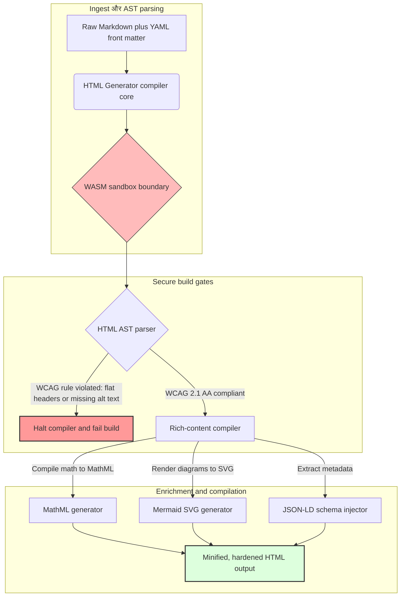

---

# Front Matter (YAML)

author: "contact@sebastienrousseau.com (Sebastien Rousseau)"
banner_alt: "संरचित प्रकाश में स्थापत्य ज्यामिति — HTML Generator की भूमिका को प्रतीकात्मक रूप से दर्शाती है: एक compile-gated Markdown-to-HTML pipeline, जो सुलभ, SEO-तैयार, sandboxed publishing infrastructure के लिए बनाया गया है"
banner_height: "1597"
banner_width: "2584"
banner: "https://cloudcdn.pro/stocks/images/ricardo-gomez-angel-IGPmtHvbe2g-unsplash.webp"
cdn: "https://cloudcdn.pro"
charset: "UTF-8"
cname: "sebastienrousseau.com"
copyright: "© Copyright 2025 - 2026 - Sebastien Rousseau. All rights reserved."
date: "June 20, 2026"
description: "HTML Generator एक pure-Rust library है जो Markdown को WCAG-compliant, SEO-ready, JSON-LD-enriched HTML में बदलती है — accessibility-as-code, MathML और Mermaid support, और WebAssembly-sandboxed execution के साथ सुरक्षित enterprise publishing के लिए।"
format-detection: "telephone=no"
hreflang: "hi"
icon: "https://cloudcdn.pro/clients/sebastienrousseau/v1/logos/sebastienrousseau.svg"
id: "https://sebastienrousseau.com/2026-06-20-html-generator-accessible-seo-structured-markdown-rust-2026"
image_alt: "Sebastien Rousseau का ब्लैक एंड व्हाइट पोर्ट्रेट"
image_height: "162"
image_width: "162"
image: "https://cloudcdn.pro/stocks/images/sebastien-rousseau.png"
keywords: "html-generator, Rust Markdown to HTML, accessibility as code, WCAG 2.1 AA, SEO-ready HTML, JSON-LD, MathML, Mermaid, WebAssembly, EAA, DORA, ADA Title III, accessible publishing, sandboxed parsing, open source"
language: "hi-IN"
last_reviewed: "2026-06-20"
layout: "report"
locale: "hi_IN"
logo_alt: "Sebastien Rousseau का लोगो"
logo_height: "44"
logo_width: "44"
logo: "https://cloudcdn.pro/clients/sebastienrousseau/v1/logos/sebastienrousseau.svg"
menu: ""
measurementID: "G-169G4ET5HQ"
name: "Sebastien Rousseau"
permalink: "https://sebastienrousseau.com/2026-06-20-html-generator-accessible-seo-structured-markdown-rust-2026"
rating: "general"
referrer: "no-referrer"
robots: "index, follow"
schema: "FAQPage, Article"
seo_title: "Accessibility-as-Code: Rust से Markdown को AAA HTML में बदलें 2026"
short_name: "sebastienrousseau"
subtitle: "कॉर्पोरेट वेब publishing, product documentation, और client portals को inaccessible text files से highly structured, compliant, और sandboxed digital assets में रूपांतरित करना।"
tags: "html-generator, Rust, Markdown, accessibility, WCAG, SEO, JSON-LD, MathML, Mermaid, WebAssembly, EAA, DORA, ADA, AI-discovery, RAG, open source, banking infrastructure"
theme-color: "0, 83, 191"
title: "2026 में Rust से Markdown को Accessible, SEO-Ready, Structured HTML में बदलना"
url: "https://sebastienrousseau.com/2026-06-20-html-generator-accessible-seo-structured-markdown-rust-2026"
viewport: "width=device-width, initial-scale=1, shrink-to-fit=no"

# RSS - The RSS feed front matter (YAML).
atom_link: "https://sebastienrousseau.com/2026-06-20-html-generator-accessible-seo-structured-markdown-rust-2026/rss.xml"
category: "Technology"
docs: https://validator.w3.org/feed/docs/rss2.html
generator: "Static Site Generator (SSG) (version 0.0.40)"
item_description: "HTML Generator एक pure-Rust library है जो Markdown को WCAG-compliant, SEO-ready, JSON-LD-enriched HTML में बदलती है — accessibility-as-code, MathML और Mermaid support, और WebAssembly-sandboxed execution के साथ सुरक्षित enterprise publishing के लिए।"
item_guid: "https://sebastienrousseau.com/2026-06-20-html-generator-accessible-seo-structured-markdown-rust-2026/rss.xml"
item_link: "https://sebastienrousseau.com/2026-06-20-html-generator-accessible-seo-structured-markdown-rust-2026/rss.xml"
item_pub_date: "Sat, 20 Jun 2026 06:06:06 +0000"
item_title: "2026 में Rust से Markdown को Accessible, SEO-Ready, Structured HTML में बदलना"
last_build_date: "Sat, 20 Jun 2026 06:06:06 +0000"
managing_editor: "contact@sebastienrousseau.com (Sebastien Rousseau)"
pub_date: "Sat, 20 Jun 2026 06:06:06 +0000"
ttl: "60"
type: "article"
webmaster: "contact@sebastienrousseau.com"

# Apple - The Apple front matter (YAML).
apple_mobile_web_app_orientations: "portrait"
apple_touch_icon_sizes: "192x192"
apple-mobile-web-app-capable: "yes"
apple-mobile-web-app-status-bar-inset: "black"
apple-mobile-web-app-status-bar-style: "black-translucent"
apple-mobile-web-app-title: "Rust से Markdown को AAA HTML में बदलें"
apple-touch-fullscreen: "yes"

# MS Application - The MS Application front matter (YAML).

msapplication-navbutton-color: "0, 83, 191"

# Twitter Card - The Twitter Card front matter (YAML).

twitter_card: "summary_large_image"
twitter_creator: "@wwdseb"
twitter_description: "HTML Generator एक pure-Rust library है जो Markdown को WCAG-compliant, SEO-ready, JSON-LD-enriched HTML में बदलती है — accessibility-as-code, MathML और Mermaid support, और WebAssembly-sandboxed execution के साथ।"
twitter_image: "https://cloudcdn.pro/clients/sebastienrousseau/v1/logos/sebastienrousseau.svg"
twitter_image_alt: "Sebastien Rousseau का लोगो"
twitter_site: "@wwdseb"
twitter_title: "Accessibility-as-Code: Rust से Markdown को AAA HTML में बदलें"
twitter_url: "https://sebastienrousseau.com/2026-06-20-html-generator-accessible-seo-structured-markdown-rust-2026"

# Humans.txt - The Humans.txt front matter (YAML).
author_website: "https://sebastienrousseau.com"
author_twitter: "@wwdseb"
author_location: "London, UK"
thanks: "पढ़ने के लिए धन्यवाद!"
site_last_updated: "2026-06-20"
site_standards: "HTML5, CSS3, RSS, Atom, JSON, XML, YAML, Markdown, TOML"
site_components: "Kaishi, Kaishi Builder, Kaishi CLI, Kaishi Templates, Kaishi Themes"
site_software: "Static Site Generator, Rust"

---

# 2026 में Rust से Markdown को Accessible, SEO-Ready, Structured HTML में बदलना

<!-- lead-start -->
<aside class="post-lead" aria-label="लेख सारांश">

<strong>TL;DR.</strong> HTML Generator एक pure-Rust Markdown-to-HTML compiler है जो build time पर WCAG 2.1 AA को enforce करता है, schema-compliant JSON-LD inject करता है, MathML और Mermaid SVG को natively render करता है, और parsing को WebAssembly sandbox के भीतर isolate करता है — publishing को accessibility, SEO, और ICT security के लिए एक compile-gated control plane में बदलता है।

<strong>मुख्य निष्कर्ष</strong>

<ul class="post-lead-takeaways">
  <li><strong>त्वरित उत्तर।</strong> HTML Generator क्या है एक वाक्य में?</li>
  <li><strong>कार्यकारी सारांश।</strong> Markdown rendering सरल लगती है; publishing-grade HTML एक compliance समस्या है।</li>
  <li><strong>01. 2026 में accessibility-first HTML compiler क्यों मायने रखता है।</strong> EAA और ADA Title III ने accessibility को engineering hygiene से fiduciary liability में बदल दिया है।</li>
  <li><strong>02. HTML Generator 2026 आर्किटेक्चर लेंस।</strong> raw Markdown से hardened HTML output तक एक multi-stage, compiler-gated pipeline।</li>
</ul>

<strong>संबंधित पठन:</strong> <a href="https://sebastienrousseau.com/2026-06-18-noyalib-safe-yaml-rust-ai-mcp-financial-infrastructure-2026">2026 में AI, MCP, और Financial Infrastructure के लिए YAML को एक सुरक्षित Rust Stack की आवश्यकता क्यों है</a>, <a href="https://sebastienrousseau.com/2026-06-17-static-site-generator-secure-default-ai-era-publishing-2026">2026 में AI-Era Publishing के लिए एक Secure-by-Default Static Site Generator</a>, <a href="https://sebastienrousseau.com/2026-06-11-cloudcdn-open-source-blueprint-ai-native-edge-2026">CloudCDN: 2026 में AI-Native Edge के लिए एक Open-Source Blueprint</a>।

</aside>
<!-- lead-end -->

2026 में, web content को उतना ही AI search crawlers, LLM-backed search engines, और Retrieval-Augmented Generation (RAG) pipelines द्वारा consume किया जाता है जितना human readers द्वारा। Flat या malformed HTML machine discoverability को प्रभावित करती है, जबकि [European Accessibility Act (EAA)](https://www.accessibility-act.eu/) और [US ADA Title III](https://www.ada.gov/topics/title-iii/) जैसे कड़े वैश्विक regulations का अनुपालन न करना अब एक स्पष्ट civil liability है। [HTML Generator](https://github.com/sebastienrousseau/html-generator) एक high-performance Rust library है जो इन अंतरालों को बंद करने के लिए बनाई गई है — compiler पर, post-deployment patches में नहीं।

## त्वरित उत्तर

**HTML Generator एक वाक्य में क्या है?** HTML Generator एक open-source, pure-Rust Markdown-to-HTML compiler है जो build time पर [WCAG 2.1 AA](https://www.w3.org/TR/WCAG21/) को enforce करता है, semantic landmarks और ARIA attributes को automatically generate करता है, YAML front matter से schema-compliant [JSON-LD](https://json-ld.org/) metadata inject करता है, Mermaid diagrams और math को accessible SVG और MathML में render करता है, और एक [WebAssembly](https://webassembly.org/) sandbox के भीतर चलता है — corporate publishing को एक compile-gated, fiduciary-grade control plane में बदलता है।

## कार्यकारी सारांश

Markdown rendering सरल लगती है। Publishing-grade HTML एक compliance समस्या है। जून 2026 में, हर corporate touchpoint — investor relations portals, regulatory filings, customer documentation, API references, marketing estates — को humans और machines दोनों द्वारा parse किया जाता है। हर page पर दो दबाव टकराते हैं: [EAA](https://www.accessibility-act.eu/) और [ADA Title III](https://www.ada.gov/topics/title-iii/) accessibility को board-level legal exposure बनाते हैं, जबकि AI ingestion और RAG pipelines structured, machine-readable output को पुरस्कृत करते हैं। Standard Markdown libraries flat HTML produce करती हैं जो दोनों gates पर fail होती हैं। HTML Generator document generation को एक compile-gated pipeline के रूप में treat करता है: WCAG validation एक build error है, JSON-LD YAML front matter से बिना manual stamping के आती है, MathML और Mermaid accessibly render होते हैं, और पूरा engine एक WebAssembly target के रूप में ship होता है ताकि untrusted documents की parsing host से sandboxed रहे।

## मुख्य निष्कर्ष

- **Accessibility-as-code नया baseline है।** EAA consumer digital services के लिए accessibility का आदेश देता है। HTML Generator compile time पर document tree का मूल्यांकन करता है, semantic landmarks और ARIA attributes को automatically generate करता है — कम post-deployment fixes, कम remediation budgets, production में कोई missing alt-text नहीं।
- **AI discovery के लिए structured data।** Modern search और RAG machine-readable metadata पर निर्भर हैं। Compiler YAML front matter को parse करता है और [Schema.org-compliant JSON-LD](https://schema.org/) को सीधे document head में inject करता है, जिससे content [Google Rich Results](https://developers.google.com/search/docs/appearance/structured-data/intro-structured-data), [Bing Webmaster](https://www.bing.com/webmasters), और LLM-backed crawlers द्वारा पूरी तरह interpretable बन जाती है।
- **Technical content excellence।** Technical publishing flat text नहीं है। HTML Generator raw Markdown math extensions को accessible [MathML](https://www.w3.org/Math/) में compile करता है, और [Mermaid.js](https://mermaid.js.org/) diagrams को responsive SVG में render करता है — दोनों opaque images में drop करने के बजाय WCAG-compliant structure preserve करते हैं।
- **WebAssembly sandboxing।** Untrusted Markdown को parse करना एक security risk है। [WASM](https://webassembly.org/) को target करके, HTML Generator एक isolated sandbox के भीतर execute होता है जो arbitrary code execution को रोकता है और host system को protect करता है — [DORA Article 6](https://eur-lex.europa.eu/legal-content/EN/TXT/?uri=CELEX%3A32022R2554) ICT-security obligations को सीधे satisfy करता है।
- **Boards के लिए fiduciary protection।** Technical non-compliance boardroom में पहुंच गई है। एक compiler-gated HTML engine पर standardise करना DORA, EAA, और ADA Title III के तहत directors और senior management को personal civil और regulatory exposure से बचाता है।

**संबंधित पठन:** [2026 में AI, MCP, और Financial Infrastructure के लिए YAML को एक सुरक्षित Rust Stack की आवश्यकता क्यों है](https://sebastienrousseau.com/2026-06-18-noyalib-safe-yaml-rust-ai-mcp-financial-infrastructure-2026/), [2026 में AI-Era Publishing के लिए एक Secure-by-Default Static Site Generator](https://sebastienrousseau.com/2026-06-17-static-site-generator-secure-default-ai-era-publishing-2026/), [CloudCDN: 2026 में AI-Native Edge के लिए एक Open-Source Blueprint](https://sebastienrousseau.com/2026-06-11-cloudcdn-open-source-blueprint-ai-native-edge-2026/)।

## 01. 2026 में Accessibility-First HTML Compiler क्यों मायने रखता है

Corporate web estates, documentation libraries, और product help centres महत्वपूर्ण digital touchpoints हैं। ये अब दो intense, intersecting दबावों के अधीन हैं।

पहला है **AI ingestion और discoverability**। Content को increasingly large language models और Retrieval-Augmented Generation pipelines द्वारा process किया जाता है। Flat या malformed HTML crawler parsing को confuse करती है, जिससे corporate research और documentation modern search paradigms के लिए invisible हो जाती है — जिसमें [Google Search Generative Experience](https://blog.google/products/search/generative-ai-search/), [ChatGPT](https://chat.openai.com/) browsing, और enterprise RAG agents शामिल हैं।

दूसरा है **कड़ा वैश्विक accessibility कानून**। [European Accessibility Act](https://www.accessibility-act.eu/) (जून 2025 से पूरी तरह applicable) और [US ADA Title III](https://www.ada.gov/topics/title-iii/) के तहत, corporate publishing platforms को complete digital accessibility की गारंटी देनी होगी। [WCAG 2.1 AA](https://www.w3.org/TR/WCAG21/) को पूरा न करना अब engineering oversight नहीं है; यह एक civil और regulatory liability है जिसने multimillion-dollar settlements पैदा किए हैं।

[HTML Generator](https://github.com/sebastienrousseau/html-generator) दोनों दबावों को सीधे address करता है। यह एक thread-safe Rust library है जो Markdown को accessible, SEO-ready, structured HTML में transform करने के लिए design की गई है। Document generation को एक compiler-gated pipeline के रूप में treat करके, यह engine एक उच्च **Return on Resilience (RoR)** deliver करता है — balance sheets को accessibility litigation से बचाता है और AI discovery के लिए machine-readability को maximize करता है।

## 02. HTML Generator 2026 आर्किटेक्चर लेंस

Framework को एक secure, multi-stage compilation pipeline के रूप में design किया गया है जो raw Markdown text को cryptographically verified, highly accessible static assets में convert करती है।

### तालिका 1: HTML Generator architecture layers और risk mitigation

| Layer | Design decision | यह क्यों मायने रखता है | गलत handling पर risk |
| ---- | ---- | ---- | ---- |
| **Input layer** | Markdown plus YAML front matter parser | Writers को उनके format में meet करता है; prose को structural metadata से अलग करता है। | Inconsistent metadata, broken sitemaps, indexing gaps। |
| **Structure layer** | Automated Table of Contents और ARIA tags के साथ semantic landmarks | Construction से navigable, accessible document trees produce करता है। | Flat HTML जो screen readers को तोड़ता है और WCAG का उल्लंघन करता है। |
| **Rich-content layer** | Native MathML और Mermaid.js SVG rendering | Formulas और diagrams को accessible SVG और MathML में compile करता है। | Client-side JS rendering lag और broken assistive-technology output। |
| **SEO और data layer** | Integrated JSON-LD और structured-metadata generation | [Schema.org](https://schema.org/) compliant JSON-LD को सीधे head में inject करता है। | Search engines और AI crawlers author, context, licensing को गलत पढ़ते हैं। |
| **Runtime layer** | Native Rust compiler WebAssembly target के साथ | Servers, edge nodes, और browsers पर secure, sandboxed execution enable करता है। | Untrusted Markdown को parse करते समय arbitrary code execution। |

## 03. मुख्य Web Security और Accessibility Signals

यह verify करने के लिए कि public-facing publishing assets modern regulatory और security audits को satisfy करते हैं, senior technology officers को specific, quantifiable metrics monitor करने चाहिए।

### तालिका 2: Web security और accessibility signals

| Signal | Metric / operational benchmark | EAA / DORA / W3C reference | Technical implementation |
| ---- | ---- | ---- | ---- |
| **Accessibility conformance** | Compiled pages का 100% WCAG 2.1 AA rules के विरुद्ध validated। | [EAA](https://www.accessibility-act.eu/) और [ADA Title III](https://www.ada.gov/topics/title-iii/) | Build-time HTML parser image alt tags और semantic landmarks का evaluation करता है। |
| **WASM execution sandbox** | Untrusted Markdown inputs का 100% isolated WebAssembly runtime में compile। | [DORA Article 6](https://eur-lex.europa.eu/legal-content/EN/TXT/?uri=CELEX%3A32022R2554) (ICT security) | Parsing environment का host server से isolation। |
| **Structured-metadata coverage** | Published articles का 100% valid, schema-compliant JSON-LD headers के साथ inject। | [Schema.org](https://schema.org/) specifications | Automatic front-matter parsing और JSON-LD objects में conversion। |
| **Compilation throughput** | Commodity hardware पर pages-per-second target 10,000 से अधिक। | Return on Resilience (RoR) | Highly parallelised Rust AST compiler। |
| **Rich-snippet verification** | [Google Rich Results](https://search.google.com/test/rich-results) और [Schema validator](https://validator.schema.org/) runs पर zero parsing errors। | Google Search guidelines | Build pipeline के दौरान generated JSON-LD का structural validation। |

## 04. Simple Markdown Rendering का मिथक

Technology managers के बीच एक सामान्य गलतफहमी यह है कि Markdown को HTML में convert करना एक simple text-replacement exercise है। कई standard libraries Markdown formatting को flat, unstructured HTML में translate करती हैं। Output एक browser में sighted reader को render होता है, लेकिन यह एक compliance trap का प्रतिनिधित्व करता है।

Flat HTML में आम तौर पर तीन चीजें नहीं होतीं।

1. **सही heading hierarchies।** Standard Markdown heading order enforce नहीं करता। `<h1>` से `<h4>` पर jump करना WCAG 2.1 AA का उल्लंघन करता है और screen readers के लिए document navigation तोड़ता है।
2. **Explicit table semantics।** Standard Markdown tables को शायद ही कभी accessible parsing के लिए आवश्यक `<th>` scope और `<tbody>` attributes के साथ render किया जाता है।
3. **Machine-readable metadata।** Standard HTML में JSON-LD hooks की कमी होती है जिन पर modern AI search platforms और RAG ingest systems निर्भर करते हैं।

HTML Generator इसे Markdown को एक **Abstract Syntax Tree (AST)** में parse करके resolve करता है। Engine HTML emit करने से पहले document structure का मूल्यांकन करता है, heading nesting को validate करता है, appropriate ARIA attributes inject करता है, और यह assert करता है कि हर media asset alternative text रखता है — accessibility को manual audit से एक guaranteed compile-time invariant में बदलता है।

## 05. Accessibility-as-Code Build Pipeline Design करना

Inaccessible या un-indexed assets को public deployment तक पहुंचने से रोकने के लिए, accessibility एक strict compiler gate होनी चाहिए। निम्नलिखित pipeline दिखाती है कि HTML Generator Markdown का evaluation कैसे करता है, WebAssembly-isolated validation कैसे चलाता है, और hardened, structured HTML कैसे emit करता है।

## 06. Boardroom Playbook और Fiduciary Liability

Modern accessibility और web-security compliance non-negotiable boardroom issues हैं। Senior management को legal risk, financial preservation, और regulatory exposure के lens से publishing infrastructure को approach करना चाहिए।

- **European Accessibility Act (EAA)।** Public और private digital portals पर direct, legally binding compliance mandates impose करता है। Non-compliance severe financial penalties, civil litigation, और EU market से asset की immediate withdrawal produce कर सकती है। Accessibility-as-code को integrate करके, boards certify कर सकते हैं कि non-compliant code ship नहीं हो सकता — reactive remediation को एक structural legal shield में convert करता है।
- **DORA Article 6 (Secure ICT Environments)।** ICT-environment security के लिए strict rules establish करता है। WebAssembly sandbox के भीतर Markdown compilation को isolate करके, organisations ensure करते हैं कि customer-uploaded documentation या partner feeds को parse करना host servers को arbitrary code execution के लिए expose नहीं कर सकता, critical banking portals की रक्षा करता है।
- **Compliance audits में cost reduction।** Traditional accessibility compliance expensive, retrospective post-deployment audits पर निर्भर करती है — annually per site tens of thousands of dollars। WCAG validation को compile-time block के रूप में implement करना उन retrospective costs को eliminate करता है, compliance budget को defence से innovation में shift करता है।

## 07. Bank / Enterprise Type के अनुसार इसका अर्थ

### Global Systemically Important Banks (G-SIBs)

G-SIBs massive, multilingual public estates operate करते हैं जो multiple jurisdictions में हजारों research papers, regulatory disclosures, और investor-relations documents publish करते हैं। उनकी चुनौती scale और multi-language parity है। HTML Generator का WebAssembly target और high-throughput Rust engine large-scale, localised research libraries को seconds के भीतर globally update, compile, और deploy करने देता है — बिना rendering lag या accessibility regression के।

### Transaction और Corporate Banks

Transaction banks के लिए, customer portals, documentation hubs, और developer API guides critical digital touchpoints हैं। उन assets को HTML Generator के माध्यम से compile करने का अर्थ है client-facing channels में कोई XSS exposure, कोई dependency-hijack vectors, और कोई accessibility deficits नहीं — institutional trust preserve करता है और litigation surface को कम करता है।

### Regional Banks और Fintechs

Regional banks और agile fintechs G-SIB engineering budgets के बिना digital experience पर compete करते हैं। HTML Generator उन teams को out of the box एक enterprise-grade publishing pipeline देता है, छोटे estates को accessible, SEO-ready, sandboxed assets ship करने देता है जो regulators और prospective corporate clients दोनों की scrutiny का सामना कर सकें।

## 08. Publishing Infrastructure Roadmap

Corporate public-facing web estates operational resilience का एक core component हैं। Slow, dynamically vulnerable, database-backed web engines — या unsigned static assets — पर निर्भर रहना एक unacceptable business risk है।

Public digital touchpoints को secure करने और accessibility litigation से balance sheets की रक्षा के लिए, senior technology और security managers को एक clear roadmap execute करना चाहिए।

1. **Static architectures की ओर transition।** Research, marketing, और documentation estates के लिए legacy dynamic CMS platforms को phase out करें। Content को HTML Generator जैसे compiler-gated pipelines में move करें।
2. **Build time पर accessibility enforce करें।** Accessibility-as-code implement करें। किसी भी WCAG 2.1 AA violation पर compilation pipelines को automatically fail करें।
3. **WebAssembly में parsing isolate करें।** सभी document और content parsing को WASM runtime के भीतर sandbox करें ताकि untrusted input कभी host systems को न छुए।
4. **Rich JSON-LD metadata inject करें।** सुनिश्चित करें कि हर published asset AI discoverability को maximize करने के लिए schema-compliant JSON-LD headers रखता है।

## 09. अक्सर पूछे जाने वाले प्रश्न

**HTML Generator accessibility कैसे enforce करता है?**

यह build time पर generated HTML Abstract Syntax Tree को parse करता है, document का [WCAG 2.1 AA](https://www.w3.org/TR/WCAG21/) rules के विरुद्ध evaluation करता है। यदि कोई rule violated होती है — एक missing alt attribute, एक heading skip, एक unlabelled form control — compiler build halt करता है, accessibility को post-deployment audit task के बजाय compile-time invariant के रूप में treat करता है।

**WebAssembly isolation क्यों महत्वपूर्ण है?**

[WebAssembly](https://webassembly.org/) Markdown parsing engine को host server से segregated एक isolated sandbox के भीतर execute करने देता है। यहां तक कि जब एक hostile actor parser vulnerabilities को exploit करने के लिए design किया गया crafted Markdown document upload करता है, execution trapped रहती है — host systems की रक्षा करती है और DORA Article 6 ICT-security obligations को satisfy करती है।

**JSON-LD 2026 में search discoverability को कैसे benefit करता है?**

[JSON-LD](https://json-ld.org/) document head में structured, machine-readable metadata प्रदान करता है। [Google Rich Results](https://developers.google.com/search/docs/appearance/structured-data/intro-structured-data), Bing crawlers, और LLM-backed search agents author, licence, publication date, और semantic context को तुरंत identify करते हैं — standard HTML की ambiguity को bypass करते हैं और AI-driven discovery में surface area बढ़ाते हैं।

**HTML Generator का audience कौन है?**

Static-site builders, documentation teams, technical writers, Rust developers, और platform engineers जो accessibility-critical या regulator-facing estates ship करते हैं। यह larger secure-publishing pipelines जैसे [Static Site Generator (SSG)](https://github.com/sebastienrousseau/static-site-generator) के भीतर एक viable content-processing layer भी है।

## 10. संदर्भ

- World Wide Web Consortium (W3C), 2024. [Web Content Accessibility Guidelines (WCAG) 2.1 ⧉](https://www.w3.org/TR/WCAG21/ "Web Content Accessibility Guidelines 2.1")।
- Schema.org, 2026. [Schema.org structured-data specifications ⧉](https://schema.org/ "Schema.org structured-data specifications")।
- European Parliament and Council of the European Union, 2022. [Regulation (EU) 2022/2554 on digital operational resilience for the financial sector (DORA) ⧉](https://eur-lex.europa.eu/legal-content/EN/TXT/?uri=CELEX%3A32022R2554 "DORA Regulation")।
- European Commission, 2025. [European Accessibility Act ⧉](https://www.accessibility-act.eu/ "European Accessibility Act")।
- US Department of Justice, 2024. [ADA Title III ⧉](https://www.ada.gov/topics/title-iii/ "ADA Title III")।
- WebAssembly Community Group, 2026. [WebAssembly specification ⧉](https://webassembly.org/ "WebAssembly")।
- GitHub, 2026. [HTML Generator repository ⧉](https://github.com/sebastienrousseau/html-generator "HTML Generator open-source repository")।

<!-- enrich-start -->
<aside class="author-card" aria-label="लेखक के बारे में"><strong class="author-card-name"><a href="/about/index.html">Sebastien Rousseau</a></strong>Senior banking technologist जो applied AI, payments infrastructure, tokenised money, ISO 20022, post-quantum security, cloud-native financial services, open-source infrastructure, और regulated digital markets पर लिखते हैं।HSBC Commercial &amp; Investment Bank, PayPal, Barclays, Shazam, AKQA, Virgin Group में 20+ वर्ष। <a href="/about/index.html">पूर्ण प्रोफ़ाइल</a> &middot; <a href="https://www.linkedin.com/in/sebastienrousseau/" rel="external noopener">LinkedIn</a> &middot; <a href="https://github.com/sebastienrousseau" rel="external noopener">GitHub</a></aside>

अंतिम समीक्षा <time datetime="2026-06-20">2026-06-20</time>।

<!-- enrich-end -->
