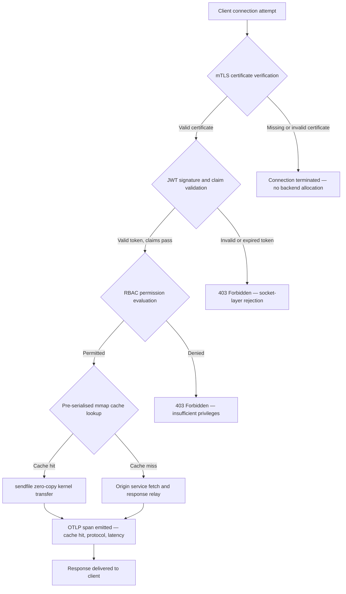

---

# Front Matter (YAML)

author: "contact@sebastienrousseau.com (Sebastien Rousseau)"
banner_alt: "रात में सर्किट-बोर्ड का अमूर्त शहरी दृश्य — बैंकिंग एज को विज़ुअलाइज़ करता है जहाँ कर्नेल-स्तरीय ज़ीरो-कॉपी ट्रांसफर, mTLS हैंडशेक और JWT सत्यापन एक स्थिर रूप से लिंक किए गए बाइनरी में एकत्रित होते हैं"
banner_height: "1597"
banner_width: "2584"
banner: "https://cloudcdn.pro/stocks/images/bit-cloud-GlqbGLCPnQ4.webp"
cdn: "https://cloudcdn.pro"
charset: "UTF-8"
cname: "sebastienrousseau.com"
copyright: "© Copyright 2025 - 2026 - Sebastien Rousseau. All rights reserved."
date: "June 20, 2026"
description: "http-handle एक स्थिर रूप से लिंक किया गया Rust बाइनरी है जो बैंकिंग एज पर बिना रनटाइम निर्भरता के प्रति सेकंड 1,80,000 अनुरोध देता है, एकीकृत mTLS और JWT सत्यापन के साथ, ALPN-वार्तालाप HTTP/2 और HTTP/3, और OTLP अवलोकनीयता — Nginx और Envoy द्वारा छोड़े गए सुरक्षा और लचीलेपन के अंतराल को बंद करता है।"
format-detection: "telephone=no"
hreflang: "hi"
icon: "https://cloudcdn.pro/clients/sebastienrousseau/v1/logos/sebastienrousseau.svg"
id: "https://sebastienrousseau.com/2026-06-20-http-handle-zero-dependency-edge-ingress-banking-rust-2026"
image_alt: "सेबेस्टियन रूसो का श्वेत-श्याम चित्र"
image_height: "162"
image_width: "162"
image: "https://cloudcdn.pro/stocks/images/sebastien-rousseau.png"
keywords: "http-handle, Rust एज इनग्रेस, ज़ीरो डिपेंडेंसी प्रॉक्सी, बैंकिंग इन्फ्रास्ट्रक्चर, mTLS JWT, sendfile ज़ीरो-कॉपी, ALPN HTTP3, DORA अनुपालन, बेसल III, OTLP अवलोकनीयता, स्टैटिक बाइनरी, ARM64 बैंकिंग, ज़ीरो ट्रस्ट बैंकिंग, लाइटवेट इनग्रेस, Rust बैंकिंग सुरक्षा"
language: "hi-IN"
last_reviewed: "2026-06-20"
layout: "report"
locale: "hi_IN"
logo_alt: "सेबेस्टियन रूसो का लोगो"
logo_height: "44"
logo_width: "44"
logo: "https://cloudcdn.pro/clients/sebastienrousseau/v1/logos/sebastienrousseau.svg"
menu: ""
measurementID: "G-169G4ET5HQ"
name: "Sebastien Rousseau"
permalink: "https://sebastienrousseau.com/2026-06-20-http-handle-zero-dependency-edge-ingress-banking-rust-2026"
rating: "general"
referrer: "no-referrer"
robots: "index, follow"
schema: "FAQPage, Article"
seo_title: "http-handle: 1,80,000 req/s पर बैंकिंग के लिए ज़ीरो-डिपेंडेंसी Rust इनग्रेस"
short_name: "sebastienrousseau"
subtitle: "कैसे एक एकल स्थिर Rust बाइनरी बैंकिंग एज पर mTLS, JWT और ALPN के साथ प्रति सेकंड 1,80,000 अनुरोध देता है — और DORA और बेसल III अनुपालन के लिए इसका क्या अर्थ है।"
tags: "http-handle, Rust, banking, edge-ingress, mTLS, JWT, ALPN, HTTP3, DORA, Basel-III, zero-copy, sendfile, ARM64, zero-trust, OTLP, observability, open-source, infrastructure"
theme-color: "0, 83, 191"
title: "http-handle: 2026 में बैंकिंग के लिए उच्च-प्रदर्शन, ज़ीरो-डिपेंडेंसी एज इनग्रेस"
url: "https://sebastienrousseau.com/2026-06-20-http-handle-zero-dependency-edge-ingress-banking-rust-2026"
viewport: "width=device-width, initial-scale=1, shrink-to-fit=no"

# RSS - The RSS feed front matter (YAML).
atom_link: "https://sebastienrousseau.com/2026-06-20-http-handle-zero-dependency-edge-ingress-banking-rust-2026/rss.xml"
category: "Technology"
docs: https://validator.w3.org/feed/docs/rss2.html
generator: "Static Site Generator (SSG) (version 0.0.40)"
item_description: "http-handle एक स्थिर रूप से लिंक किया गया Rust बाइनरी है जो बैंकिंग एज पर बिना रनटाइम निर्भरता के प्रति सेकंड 1,80,000 अनुरोध देता है, एकीकृत mTLS और JWT सत्यापन के साथ, ALPN-वार्तालाप HTTP/2 और HTTP/3, और OTLP अवलोकनीयता — Nginx और Envoy द्वारा छोड़े गए सुरक्षा और लचीलेपन के अंतराल को बंद करता है।"
item_guid: "https://sebastienrousseau.com/2026-06-20-http-handle-zero-dependency-edge-ingress-banking-rust-2026/rss.xml"
item_link: "https://sebastienrousseau.com/2026-06-20-http-handle-zero-dependency-edge-ingress-banking-rust-2026/rss.xml"
item_pub_date: "Sat, 20 Jun 2026 07:07:07 +0000"
item_title: "http-handle: 2026 में बैंकिंग के लिए उच्च-प्रदर्शन, ज़ीरो-डिपेंडेंसी एज इनग्रेस"
last_build_date: "Sat, 20 Jun 2026 07:07:07 +0000"
managing_editor: "contact@sebastienrousseau.com (Sebastien Rousseau)"
pub_date: "Sat, 20 Jun 2026 07:07:07 +0000"
ttl: "60"
type: "article"
webmaster: "contact@sebastienrousseau.com"

# Apple - The Apple front matter (YAML).
apple_mobile_web_app_orientations: "portrait"
apple_touch_icon_sizes: "192x192"
apple-mobile-web-app-capable: "yes"
apple-mobile-web-app-status-bar-inset: "black"
apple-mobile-web-app-status-bar-style: "black-translucent"
apple-mobile-web-app-title: "ज़ीरो-डिपेंडेंसी बैंकिंग एज"
apple-touch-fullscreen: "yes"

# MS Application - The MS Application front matter (YAML).

msapplication-navbutton-color: "0, 83, 191"

# Twitter Card - The Twitter Card front matter (YAML).

twitter_card: "summary_large_image"
twitter_creator: "@wwdseb"
twitter_description: "http-handle एक स्थिर Rust बाइनरी है जो बैंकिंग एज पर बिना रनटाइम निर्भरता के प्रति सेकंड 1,80,000 अनुरोध देता है, mTLS, JWT और OTLP अवलोकनीयता के साथ।"
twitter_image: "https://cloudcdn.pro/clients/sebastienrousseau/v1/logos/sebastienrousseau.svg"
twitter_image_alt: "Logo of Sebastien Rousseau"
twitter_site: "@wwdseb"
twitter_title: "http-handle: 1,80,000 req/s पर बैंकिंग के लिए ज़ीरो-डिपेंडेंसी Rust इनग्रेस"
twitter_url: "https://sebastienrousseau.com/2026-06-20-http-handle-zero-dependency-edge-ingress-banking-rust-2026"

# Humans.txt - The Humans.txt front matter (YAML).
author_website: "https://sebastienrousseau.com"
author_twitter: "@wwdseb"
author_location: "London, UK"
thanks: "Thanks for reading!"
site_last_updated: "2026-06-20"
site_standards: "HTML5, CSS3, RSS, Atom, JSON, XML, YAML, Markdown, TOML"
site_components: "Kaishi, Kaishi Builder, Kaishi CLI, Kaishi Templates, Kaishi Themes"
site_software: "Static Site Generator, Rust"

---

# http-handle: 2026 में बैंकिंग के लिए उच्च-प्रदर्शन, ज़ीरो-डिपेंडेंसी एज इनग्रेस

<!-- lead-start -->
<aside class="post-lead" aria-label="लेख का सारांश">

<strong>संक्षेप में।</strong> http-handle एक ओपन-सोर्स, स्थिर रूप से लिंक किया गया Rust बाइनरी है जो बैंकिंग एज पर Nginx और Envoy की जगह लेता है। यह Linux <code>sendfile(2)</code> ज़ीरो-कॉपी ट्रांसफर के ज़रिए ARM64 नोड्स पर प्रति सेकंड 1,80,000 अनुरोध देता है, किसी भी एप्लिकेशन कोड के चलने से पहले नेटवर्क सॉकेट लेयर पर mTLS और JWT सत्यापन लागू करता है, ALPN के ज़रिए स्वचालित रूप से HTTP/2 और HTTP/3 पर बातचीत करता है, और मूल रूप से OpenTelemetry मेट्रिक्स उत्सर्जित करता है — सब कुछ <code>libc</code> से परे बिना किसी रनटाइम निर्भरता के।

<strong>मुख्य निष्कर्ष</strong>

<ul class="post-lead-takeaways">
  <li><strong>भारी प्रॉक्सी की समस्या।</strong> Nginx और Envoy निर्भरता वृक्ष लाते हैं जो CVE सतह का विस्तार करते हैं और DORA ICT-जोखिम उपाय चक्रों को जटिल बनाते हैं।</li>
  <li><strong>बड़े पैमाने पर ज़ीरो-कॉपी प्रदर्शन।</strong> पूर्व-क्रमबद्ध mmap कैश ब्लॉक और <code>sendfile(2)</code> कर्नेल ट्रांसफर ARM64 पर उप-मिलीसेकंड प्रॉक्सी ओवरहेड के साथ 1,80,000 req/s बनाए रखते हैं।</li>
  <li><strong>सॉकेट पर सुरक्षा, एप्लिकेशन पर नहीं।</strong> mTLS क्लाइंट सत्यापन, JWT मान्यता, और RBAC मूल्यांकन अनुरोध को कोई भी बैकएंड संसाधन आवंटित होने से पहले पूरे हो जाते हैं।</li>
  <li><strong>नियामक संरेखण अंतर्निहित है।</strong> कम हमला सतह और ऑडिट योग्य एकल-बाइनरी तैनाती DORA अनुच्छेद 5 और 6, बेसल III परिचालन जोखिम, और SM&CR जवाबदेही श्रृंखलाओं को सीधे संबोधित करती है।</li>
</ul>

<strong>संबंधित पठन:</strong> <a href="https://sebastienrousseau.com/2026-06-18-noyalib-safe-yaml-rust-ai-mcp-financial-infrastructure-2026">2026 में AI, MCP और वित्तीय बुनियादी ढांचे के लिए YAML को अधिक सुरक्षित Rust स्टैक की आवश्यकता क्यों है</a>, <a href="https://sebastienrousseau.com/2026-06-11-cloudcdn-open-source-blueprint-ai-native-edge-2026">CloudCDN: 2026 में AI-नेटिव एज के लिए एक ओपन-सोर्स ब्लूप्रिंट</a>, <a href="https://sebastienrousseau.com/2026-05-16-best-cloud-infrastructure-architecture-2026">2026 में बैंकों और वित्तीय संस्थाओं के लिए सर्वश्रेष्ठ क्लाउड इन्फ्रास्ट्रक्चर आर्किटेक्चर</a>।

</aside>
<!-- lead-end -->

बैंकिंग एज में एक निर्भरता समस्या है। प्रत्येक Nginx या Envoy उदाहरण जो एक क्लाइंट और एक मुख्य बैंकिंग सेवा के बीच ट्रैफ़िक रूट करता है, एक निर्भरता वृक्ष लाता है: OpenSSL बिल्ड, Lua मॉड्यूल, gRPC लाइब्रेरी, और कंटेनर लेयर — प्रत्येक एक संभावित CVE, प्रत्येक को एक समर्पित पैचिंग चक्र की आवश्यकता है, प्रत्येक लेटेंसी भिन्नता जोड़ता है जो SLA माप को जटिल बनाता है। [डिजिटल ऑपरेशनल रेज़िलिएंस एक्ट (DORA)](https://eur-lex.europa.eu/eli/reg/2022/2554/oj) के तहत, वह जटिलता अब एक नियामक दायित्व है जितना एक परिचालन।

[http-handle](https://github.com/sebastienrousseau/http-handle) एक अलग दृष्टिकोण अपनाता है। यह `libc` से परे बिना रनटाइम निर्भरता के एकल, स्थिर रूप से लिंक किया गया Rust बाइनरी है। यह ARM64 नोड्स पर प्रति सेकंड 1,80,000 अनुरोध देता है, नेटवर्क सॉकेट लेयर पर म्यूचुअल TLS और JWT प्रमाणीकरण लागू करता है, और स्वचालित रूप से HTTP/2 और HTTP/3 पर बातचीत करता है — सब कुछ 20 MB RAM से कम की तैनाती फुटप्रिंट में।

## त्वरित उत्तर

**एक वाक्य में http-handle क्या है?** http-handle एक ओपन-सोर्स, स्थिर रूप से लिंक किया गया Rust बाइनरी है जो बैंकिंग एज पर भारी प्रॉक्सी कंटेनर की जगह लेता है, Linux `sendfile(2)` ज़ीरो-कॉपी कर्नेल ट्रांसफर के ज़रिए ARM64 पर 1,80,000 req/s देता है, किसी भी बैकएंड संसाधन को छूने से पहले सॉकेट लेयर पर mTLS, JWT और RBAC लागू करता है, और मूल [OpenTelemetry](https://opentelemetry.io/) मेट्रिक्स उत्सर्जित करता है — `libc` से परे बिना किसी रनटाइम लाइब्रेरी निर्भरता के।

## कार्यकारी सारांश

बैंकों ने एक दशक से Nginx और Envoy को अपने एज पर चलाया है। दोनों सक्षम हैं; न तो 2026 के नियामक वातावरण के लिए डिज़ाइन किया गया था। निर्भरता-भरे कंटेनर इमेज CVE कतारें उत्पन्न करते हैं जिन्हें अनुपालन टीमें पर्याप्त तेज़ी से साफ़ नहीं कर सकती हैं, और प्रत्येक लाइब्रेरी संस्करण बम्प रिग्रेशन जोखिम उठाता है। DORA अनुच्छेद 5 और 6 मांग करते हैं कि ICT जोखिम डिज़ाइन द्वारा प्रबंधित किया जाए, खोज के बाद पैच नहीं। बेसल III परिचालन जोखिम ढांचे उन आर्किटेक्चर को दंडित करते हैं जहां विफलता बिंदु सिस्टम जटिलता के साथ गुणा होते हैं।

http-handle स्रोत पर निर्भरता समस्या को समाप्त करता है। बाइनरी एक बार, स्थिर रूप से संकलित है, रनटाइम पर बाहरी लाइब्रेरी आवश्यकताओं के बिना। हमला सतह Rust मानक लाइब्रेरी और `libc` तक सिकुड़ जाती है। सुरक्षा प्रवर्तन — mTLS प्रमाणपत्र सत्यापन, JWT दावा सत्यापन, और भूमिका-आधारित पहुंच नियंत्रण — किसी भी बैकएंड आवंटन से पहले नेटवर्क सॉकेट पर निष्पादित होता है, ज़ीरो ट्रस्ट परिधि को उसकी सबसे छोटी संभावित अभिव्यक्ति तक संकुचित करता है। प्रदर्शन आर्किटेक्चर से अनुसरण करता है: पूर्व-क्रमबद्ध मेमोरी-मैप्ड कैश ब्लॉक `sendfile(2)` कर्नेल ट्रांसफर के साथ मिलकर CPU-से-मेमोरी कॉपी पथ से डेटा को पूरी तरह हटाते हैं, ARM64 हार्डवेयर पर 1,80,000 req/s बनाए रखते हैं। परिणाम एक इनग्रेस लेयर है जो DORA लचीलेपन की आवश्यकताओं को पूरा करती है, बेसल III परिचालन जोखिम कमी तर्कों का समर्थन करती है, और SM&CR के तहत वरिष्ठ IT नेताओं को एज इन्फ्रास्ट्रक्चर के लिए एक सत्यापन योग्य, एकल-घटक जवाबदेही श्रृंखला देती है।

## मुख्य निष्कर्ष

- **छोटे बाइनरी, छोटी CVE कतारें।** एकल स्थिर रूप से लिंक किए गए बाइनरी में पैच करने के लिए एक पैकेज, सत्यापित करने के लिए एक रिलीज़, और ऑडिट करने के लिए एक आर्टिफैक्ट होता है। मानक मॉड्यूल सेट के साथ Nginx 30 से अधिक साझा लाइब्रेरी निर्भरताओं के साथ आता है; प्रत्येक अपना स्वयं का भेद्यता जीवनचक्र रखती है।
- **ज़ीरो-कॉपी एक अनुकूलन नहीं है — यह एक डिज़ाइन बाधा है।** 1,80,000 req/s पर, उपयोगकर्ता-स्पेस में कोई भी डेटा कॉपी मापने योग्य लेटेंसी भिन्नता प्रस्तुत करती है। `sendfile(2)` फ़ाइल डिस्क्रिप्टर सामग्री को — या एक मेमोरी-मैप्ड क्षेत्र — नेटवर्क सॉकेट फ़ाइल डिस्क्रिप्टर पर, पूरी तरह से कर्नेल में स्थानांतरित करता है। mmap-पिन किए गए रेस्पॉन्स कैश ब्लॉक के साथ, CPU कभी भी कैश की गई प्रतिक्रियाओं के लिए डेटा पथ को नहीं छूता।
- **सुरक्षा परिधि सॉकेट पर है।** एप्लिकेशन मिडलवेयर में JWT और mTLS प्रमाणपत्रों को मान्य करने का मतलब है कि अनुरोध को अस्वीकार करने से पहले बैकएंड ने पहले से ही थ्रेड और मेमोरी आवंटित कर ली है। सॉकेट-लेयर सत्यापन सुनिश्चित करता है कि अप्रमाणित अनुरोध कोई भी बैकएंड संसाधन नहीं उपभोग करते।
- **OTLP अवलोकनीयता अंतर को दूर करता है।** मूल OpenTelemetry एकीकरण का मतलब है कि प्रत्येक अनुरोध, प्रत्येक प्रमाणीकरण निर्णय, और प्रत्येक प्रोटोकॉल वार्ता एक साइडकार एजेंट के बिना संरचित टेलीमेट्री उत्पन्न करती है। मौजूदा बैंक डैशबोर्ड सीधे OTLP ट्रेस को अंतर्ग्रहण करते हैं।

**संबंधित पठन:** [2026 में AI, MCP और वित्तीय बुनियादी ढांचे के लिए YAML को अधिक सुरक्षित Rust स्टैक की आवश्यकता क्यों है](https://sebastienrousseau.com/2026-06-18-noyalib-safe-yaml-rust-ai-mcp-financial-infrastructure-2026/), [CloudCDN: 2026 में AI-नेटिव एज के लिए एक ओपन-सोर्स ब्लूप्रिंट](https://sebastienrousseau.com/2026-06-11-cloudcdn-open-source-blueprint-ai-native-edge-2026/), [2026 में बैंकों और वित्तीय संस्थाओं के लिए सर्वश्रेष्ठ क्लाउड इन्फ्रास्ट्रक्चर आर्किटेक्चर](https://sebastienrousseau.com/2026-05-16-best-cloud-infrastructure-architecture-2026/).

## 01. बैंकिंग में भारी प्रॉक्सी की समस्या

Nginx और Envoy ने आधुनिक इंटरनेट का एज बनाया। दोनों कॉन्फ़िगर करने योग्य हैं, युद्ध-परीक्षित हैं, और बड़े समुदायों द्वारा समर्थित हैं। वे DORA के अस्तित्व से पहले, बेसल III परिचालन जोखिम ढांचे से पहले जो मापने योग्य जटिलता कमी की मांग करते थे, और ARM64 क्लाउड नोड्स से पहले जो उच्च-थ्रूपुट कंप्यूटिंग की अर्थव्यवस्था को बदल देते हैं, किए गए आर्किटेक्चरल चुनाव भी हैं।

व्यावहारिक परिणाम बैंकों की ज़रूरतों और भारी प्रॉक्सी कंटेनर जो देते हैं, के बीच एक अंतर है।

**निर्भरता सतह।** एक मानक Envoy तैनाती OpenSSL, Abseil, Protobuf, gRPC, Lua, और दर्जनों माध्यमिक लाइब्रेरी खींचती है। प्रत्येक एक स्वतंत्र CVE जीवनचक्र रखती है। जब National Vulnerability Database एक महत्वपूर्ण OpenSSL सलाह प्रकाशित करता है, तो संपत्ति में प्रत्येक Envoy उदाहरण एक अनुपालन घड़ी बन जाता है: मूल्यांकन करें, पैच करें, परीक्षण करें, फिर से तैनात करें, और फिर से प्रमाणित करें — हर उस वातावरण में जहां बाइनरी चलता है। DORA अनुच्छेद 6 के तहत, बैंकों को यह दिखाना होगा कि ICT जोखिम प्रबंधन प्रक्रियाएं आनुपातिक, प्रलेखित और सत्यापन योग्य हैं। एक बहु-लाइब्रेरी निर्भरता वृक्ष उस प्रदर्शन को बनाए रखने में महंगा बनाता है।

**मेमोरी ओवरहेड।** न्यूनतम रूप से कॉन्फ़िगर किया गया Nginx वर्कर प्रोसेस मध्यम लोड के तहत 40–80 MB रेसिडेंट मेमोरी का उपभोग करता है। बड़े पैमाने पर — ट्रेडिंग सिस्टम, पेमेंट API, और ग्राहक-सामना पोर्टल में सैकड़ों इनग्रेस नोड — वह ओवरहेड एक अच्छी तरह से इंजीनियर किए गए एकल-बाइनरी विकल्प पर कोई संबंधित प्रदर्शन लाभ के बिना मापने योग्य इन्फ्रास्ट्रक्चर लागत में जमा होती है।

**पैचिंग वेग।** कंटेनर-इमेज सप्लाई चेन CVE प्रकाशन और एक मान्य पैच के उत्पादन तक पहुंचने के बीच बहु-दिवसीय अंतराल पेश करते हैं। बेस इमेज को पुनर्निर्मित करना होगा, एप्लिकेशन लेयर को फिर से लेयर करना होगा, पूर्ण परीक्षण मैट्रिक्स को फिर से चलाना होगा, और तैनाती पाइपलाइन को फिर से निष्पादित करना होगा। DORA घटना रिपोर्टिंग विंडो के तहत संचालित महत्वपूर्ण बैंकिंग सिस्टम के लिए, यह चक्र एक संरचनात्मक जोखिम है।

http-handle तीनों को संबोधित करता है। एक बाइनरी। एक CVE सतह। पैच करने के लिए एक आर्टिफैक्ट। प्रोडक्शन इनग्रेस नोड के लिए 20 MB RAM से कम।

## 02. http-handle 2026 आर्किटेक्चर लेंस

बाइनरी पांच परस्पर निर्भर लेयर के रूप में संरचित है, प्रत्येक जोखिम की एक विशिष्ट श्रेणी को समाप्त करने के लिए डिज़ाइन किया गया है जिसे पारंपरिक प्रॉक्सी आर्किटेक्चर जमा करती है।

### तालिका 1: http-handle आर्किटेक्चर लेयर और जोखिम शमन

| लेयर | डिज़ाइन निर्णय | यह क्यों मायने रखता है | गलत प्रबंधन पर जोखिम |
| ---- | ---- | ---- | ---- |
| **सर्वर कोर** | एकल Rust बाइनरी, स्थिर रूप से लिंक किया गया, `libc` से परे शून्य निर्भरता | पैच करने के लिए एक आर्टिफैक्ट; संपत्ति में लाइब्रेरी CVE प्रसार को समाप्त करता है | निर्भरता भ्रम हमले; लाइब्रेरी भेद्यता संचय |
| **त्वरण इंजन** | पूर्व-क्रमबद्ध mmap कैश ब्लॉक और `sendfile(2)` ज़ीरो-कॉपी कर्नेल ट्रांसफर | उप-मिलीसेकंड प्रॉक्सी ओवरहेड के साथ ARM64 पर 1,80,000 req/s; कैश की गई प्रतिक्रियाओं के लिए कोई डेटा उपयोगकर्ता स्पेस में प्रवेश नहीं करता | मेमोरी-मैपिंग लीक; कैश अमान्यकरण के तहत कर्नेल-स्पेस बाधाएं |
| **क्रिप्टोग्राफिक सुरक्षा** | हॉट-रिलोड प्रमाणपत्र समर्थन और ALPN वार्ता के साथ मूल mTLS | डेटा अखंडता और प्रोटोकॉल संगतता सुनिश्चित करता है; कनेक्शन ड्रॉप के बिना प्रमाणपत्र रोटेशन | सेवा बाधाओं का कारण बनने वाली प्रमाणपत्र समाप्ति; कमज़ोर सिफर सूट डिफ़ॉल्ट |
| **पहुंच नीति विमान** | सॉकेट-लेयर JWT सत्यापन और RBAC दावा मूल्यांकन | अप्रमाणित अनुरोध कोई बैकएंड संसाधन नहीं उपभोग करते; कर्नेल सीमा पर Zero Trust लागू | JWT एल्गोरिथ्म भ्रम हमले; RBAC गलत कॉन्फ़िगरेशन अत्यधिक-विशेषाधिकार प्राप्त पहुंच प्रदान करना |
| **अवलोकनीयता** | मूल [OpenTelemetry (OTLP)](https://opentelemetry.io/docs/specs/otlp/) एकीकरण | साइडकार एजेंट के बिना संरचित टेलीमेट्री; मौजूदा बैंक निगरानी संपत्ति में सीधा अंतर्ग्रहण | आउटेज के दौरान अंध स्थान; DORA घटना रिपोर्टिंग के लिए अपूर्ण ऑडिट ट्रेल |

## 03. मुख्य प्रदर्शन और सुरक्षा संकेत

एज पर http-handle संचालित करने वाले बैंकों को DORA परिचालन रिपोर्टिंग आवश्यकताओं और आंतरिक SLA शासन को संतुष्ट करने के लिए पांच मापने योग्य संकेतों को उपकरण देना चाहिए।

### तालिका 2: परिचालन बेंचमार्क और नियामक संदर्भ

| संकेत | बेंचमार्क | नियामक संदर्भ | तकनीकी कार्यान्वयन |
| ---- | ---- | ---- | ---- |
| **थ्रूपुट** | P99 ≤ 1 ms प्रॉक्सी ओवरहेड पर ARM64 नोड्स पर ≥ 1,80,000 req/s | बेसल III परिचालन जोखिम — सिस्टम जटिलता कमी | `sendfile(2)` + mmap पूर्व-क्रमबद्ध कैश ब्लॉक; कैश हिट के लिए कोई उपयोगकर्ता-स्पेस डेटा कॉपी नहीं |
| **हमला सतह** | शून्य रनटाइम लाइब्रेरी निर्भरता; प्रति रिलीज़ एक बाइनरी आर्टिफैक्ट | [DORA अनुच्छेद 6](https://eur-lex.europa.eu/eli/reg/2022/2554/oj) — डिज़ाइन द्वारा ICT जोखिम प्रबंधन | `cargo build --release --target aarch64-unknown-linux-musl` के साथ स्थिर संकलन |
| **प्रमाणीकरण लेटेंसी** | बैकएंड प्रतिक्रिया के पहले बाइट से पहले mTLS हैंडशेक + JWT सत्यापन पूरा | [DORA अनुच्छेद 5](https://eur-lex.europa.eu/eli/reg/2022/2554/oj) — ICT सुरक्षा संरक्षण | सॉकेट-लेयर अवरोधन; बैकएंड राउटिंग से पहले कर्नेल-आसन्न Rust में JWT दावा मूल्यांकन |
| **प्रमाणपत्र उपलब्धता** | रोटेशन के दौरान शून्य ड्रॉप्ड कनेक्शन के साथ mTLS प्रमाणपत्रों की हॉट-रीलोड | एज उपलब्धता के लिए SM&CR वरिष्ठ प्रबंधन जवाबदेही | inotify-संचालित प्रमाणपत्र वॉचर; रीलोड के दौरान परमाणु फ़ाइल-डिस्क्रिप्टर स्वैप |
| **अवलोकनीयता कवरेज** | प्रमाणीकरण परिणाम, प्रोटोकॉल संस्करण और कैश स्थिति के साथ OTLP स्पैन उत्पन्न करने वाले 100% अनुरोध | DORA अनुच्छेद 17 — घटना पहचान और रिपोर्टिंग | मूल OTLP निर्यातक; कोई साइडकार आवश्यक नहीं; gRPC या HTTP/Protobuf परिवहन कॉन्फ़िगर करने योग्य |

## 04. ज़ीरो-कॉपी इंजन: mmap और sendfile(2)

उच्च-आवृत्ति बैंकिंग में नेटवर्क प्रदर्शन — रीयल-टाइम भुगतान, बाज़ार-डेटा API, प्रमाणीकरण टोकन सेवाएं — किसी भी अन्य की तुलना में एक बाधा से अधिक सीमित है: भंडारण से नेटवर्क सॉकेट पर बाइट्स स्थानांतरित करने की लागत।

पारंपरिक HTTP सर्वर फ़ाइल सामग्री को उपयोगकर्ता-स्पेस बफ़र में पढ़ते हैं, फिर उस बफ़र को सॉकेट पर लिखते हैं। उस अनुक्रम के लिए प्रत्येक प्रतिक्रिया के लिए उपयोगकर्ता स्पेस और कर्नेल स्पेस के बीच दो मेमोरी कॉपी और दो संदर्भ स्विच की आवश्यकता होती है। प्रति सेकंड 1,80,000 अनुरोधों पर, संचित ओवरहेड पर्याप्त है।

http-handle दोनों कॉपी को समाप्त करता है।

**मेमोरी-मैप्ड कैश ब्लॉक।** जब सेवा शुरू होती है, तो यह `mmap(2)` का उपयोग करके मेमोरी-मैप्ड क्षेत्रों में स्थिर प्रतिक्रिया सामग्री को क्रमबद्ध करती है। ये क्षेत्र कर्नेल के पेज कैश में पिन किए गए हैं। जब कैश किए गए संसाधन के लिए अनुरोध आता है, तो प्रतिक्रिया पहले से ही कर्नेल मेमोरी में मैप की गई है — कोई डिस्क रीड नहीं, कोई बफ़र आवंटन नहीं।

**`sendfile(2)` कर्नेल ट्रांसफर।** Linux `sendfile(2)` सिस्टम कॉल एक फ़ाइल डिस्क्रिप्टर — या एक मेमोरी-मैप्ड क्षेत्र — से सीधे नेटवर्क सॉकेट फ़ाइल डिस्क्रिप्टर पर डेटा स्थानांतरित करता है, पूरी तरह से कर्नेल के भीतर। कोई बाइट उपयोगकर्ता स्पेस में प्रवेश नहीं करता। CPU की भूमिका सिस्टम कॉल जारी करने और पूर्णता घटना को संभालने तक कम हो जाती है। इस आर्किटेक्चर के साथ ARM64 नोड्स पर, http-handle निरंतर लोड के तहत उप-मिलीसेकंड प्रॉक्सी ओवरहेड पर 1,80,000 req/s बनाए रखता है।

महीने के अंत के बैच समेकन, इंट्राडे लिक्विडिटी रिपोर्टिंग, या रीयल-टाइम धोखाधड़ी-स्कोरिंग API ट्रैफ़िक चलाने वाले बैंकों के लिए, इंजीनियरिंग परिणाम प्रत्यक्ष है: प्रति ट्रैफ़िक टियर कम ARM64 नोड, कम इन्फ्रास्ट्रक्चर लागत, और क्षमता कमी से छोटा DORA लचीलेपन जोखिम।

## 05. mTLS और JWT पहुंच नीति विमान

बैंकिंग में, एज पर प्रमाणीकरण एक सुविधा नहीं है — यह एक नियामक आवश्यकता है। DORA अनिवार्य करता है कि ICT सुरक्षा नियंत्रण आनुपातिक, प्रलेखित और सत्यापन योग्य हों। SM&CR उनकी जवाबदेही के तहत सिस्टम के लिए IT सुरक्षा निर्णयों पर नामित वरिष्ठ प्रबंधकों पर व्यक्तिगत दायित्व रखता है। प्रश्न यह नहीं है कि एज पर प्रमाणित करना है या नहीं, बल्कि किस लेयर पर।

http-handle किसी भी बैकएंड संसाधन के आवंटित होने से पहले एक तीन-चरण Zero Trust नीति लागू करता है।

**चरण 1: mTLS क्लाइंट प्रमाणपत्र सत्यापन।** TLS हैंडशेक के दौरान, http-handle कॉन्फ़िगर करने योग्य ट्रस्ट स्टोर के विरुद्ध क्लाइंट प्रमाणपत्र का अनुरोध करता है और सत्यापित करता है। वैध प्रमाणपत्र के बिना कनेक्शन हैंडशेक पर समाप्त होते हैं। कोई एप्लिकेशन थ्रेड स्पॉन नहीं होता, कोई मेमोरी पूल आवंटित नहीं होता। बैकएंड कभी अनुरोध नहीं देखता।

**चरण 2: JWT दावा सत्यापन।** mTLS पास करने वाले कनेक्शन के लिए, http-handle सॉकेट लेयर पर `Authorization` हेडर से JSON Web Token निकालता और सत्यापित करता है। हस्ताक्षर सत्यापन, समाप्ति जांच, और जारीकर्ता सत्यापन अनुरोध के रूटिंग लेयर तक पहुंचने से पहले होते हैं। एल्गोरिथ्म भ्रम हमले — जहां एक सर्वर असममित कुंजी अपेक्षित होने पर एक सममित एल्गोरिथ्म को स्वीकार करता है — कॉन्फ़िगरेशन में स्पष्ट एल्गोरिथ्म अनुमति-सूचीकरण द्वारा अवरुद्ध हैं।

**चरण 3: RBAC दावा मूल्यांकन।** सत्यापित JWT दावे इन-मेमोरी भूमिका तालिका पर मैप होते हैं। अपर्याप्त अनुमतियों वाले अनुरोधों को पहुंच नीति विमान पर 403 प्रतिक्रिया मिलती है। अनधिकृत ट्रैफ़िक के लिए बैकएंड सेवा कभी नहीं बुलाई जाती।

यह अनुक्रम परिचालन रूप से महत्वपूर्ण है। पारंपरिक मॉडल के तहत — जहां प्रमाणीकरण एप्लिकेशन मिडलवेयर में चलता है — एक हमलावर एकल अस्वीकृति जारी होने से पहले अप्रमाणित अनुरोधों के साथ बैकएंड थ्रेड पूल को समाप्त कर सकता है। सॉकेट-लेयर प्रमाणीकरण उस हमले वेक्टर को पूरी तरह से नष्ट कर देता है।

## 06. ALPN रूटिंग और HTTP/3 फ़ॉलबैक चेन

बैंकिंग ट्रैफ़िक विविध नेटवर्क स्थितियों पर आता है: ट्रेडिंग डेस्क के लिए कॉर्पोरेट फाइबर, मोबाइल बैंकिंग क्लाइंट के लिए 5G, रिमोट संचालन के लिए उपग्रह कनेक्टिविटी, और विनियमित वातावरण में TLS निरीक्षण प्रॉक्सी। एकल-प्रोटोकॉल इनग्रेस एक सबसे कम सामान्य भाजक बाधा बनाता है।

http-handle प्रत्येक कनेक्शन के लिए स्वचालित रूप से इष्टतम प्रोटोकॉल का चयन करने के लिए [Application-Layer Protocol Negotiation (ALPN)](https://www.rfc-editor.org/rfc/rfc7301) का उपयोग करता है।

**HTTP/2** TCP पर ब्राउज़र और API ट्रैफ़िक के लिए डिफ़ॉल्ट है। एकल कनेक्शन पर मल्टीप्लेक्स स्ट्रीम एक साथ अनुरोध पैटर्न के तहत HTTP/1.1 द्वारा पेश की गई हेड-ऑफ-लाइन ब्लॉकिंग को समाप्त करते हैं।

**HTTP/3 (QUIC)** तब सक्रिय होता है जब नेटवर्क UDP का समर्थन करता है और क्लाइंट अपने ALPN एक्सटेंशन में `h3` का विज्ञापन करता है। QUIC का स्वतंत्र स्ट्रीम मल्टीप्लेक्सिंग और कनेक्शन माइग्रेशन इसे भीड़भाड़ वाले सेलुलर नेटवर्क पर मोबाइल बैंकिंग क्लाइंट के लिए भौतिक रूप से बेहतर बनाता है जहां TCP कनेक्शन अक्सर ड्रॉप होते हैं और पुनः कनेक्ट होते हैं।

**सुचारू फ़ॉलबैक।** यदि ALPN वार्ता विफल होती है — क्योंकि एक मध्यवर्ती प्रॉक्सी एक्सटेंशन हटाता है या एक पुराना क्लाइंट इसे छोड़ देता है — http-handle सभी सुरक्षा हेडर, mTLS प्रवर्तन, और JWT सत्यापन बनाए रखते हुए HTTP/1.1 पर वापस आता है। प्रोटोकॉल फ़ॉलबैक के दौरान कोई सुरक्षा संपत्ति खराब नहीं होती।

## 07. ज़ीरो-कॉपी अनुरोध जीवनचक्र

निम्नलिखित आरेख क्लाइंट कनेक्शन से प्रतिक्रिया वितरण तक, प्रमाणीकरण गेट और अवलोकनीयता उत्सर्जन बिंदुओं सहित, पूर्ण अनुरोध पथ दिखाता है।

कैश-हिट प्रतिक्रियाओं के लिए महत्वपूर्ण पथ तीन सुरक्षा गेट और एक सिस्टम कॉल से गुज़रता है। प्रतिक्रिया बॉडी के लिए कोई उपयोगकर्ता-स्पेस बफ़र आवंटित नहीं होता। OTLP स्पैन एकल संरचित रिकॉर्ड में प्रमाणीकरण परिणाम, ALPN-वार्तालाप प्रोटोकॉल संस्करण, कैश स्थिति, और एंड-टू-एंड लेटेंसी को कैप्चर करता है।

## 08. नियामक संरेखण: DORA, बेसल III, और SM&CR

### DORA अनुच्छेद 5 और 6 — ICT जोखिम प्रबंधन और संरक्षण

[DORA अनुच्छेद 5](https://eur-lex.europa.eu/eli/reg/2022/2554/oj) वित्तीय संस्थाओं को ICT जोखिम प्रबंधन ढांचे बनाए रखने की आवश्यकता है। अनुच्छेद 6 उन्हें अपने ICT सिस्टम के जोखिम प्रोफाइल के आनुपातिक संरक्षण और रोकथाम उपायों को लागू करने की आवश्यकता है।

एकल स्थिर रूप से लिंक किया गया बाइनरी बहु-लाइब्रेरी कंटेनर स्टैक की तुलना में अधिक कुशलता से दोनों आवश्यकताओं को पूरा करता है। हमला सतह मापने योग्य है — एक आर्टिफैक्ट, एक निर्भरता (`libc`), एक CVE सतह — और संरक्षण उपाय प्रक्रियागत के बजाय संरचनात्मक हैं: mTLS और JWT प्रवर्तन को गलत कॉन्फ़िगरेशन द्वारा बायपास नहीं किया जा सकता क्योंकि वे किसी भी कॉन्फ़िगर करने योग्य एप्लिकेशन लॉजिक के चलने से पहले सॉकेट लेयर पर निष्पादित होते हैं।

### बेसल III — परिचालन जोखिम के लिए पूंजी आवश्यकताएं

[बेसल III का परिचालन जोखिम ढांचा](https://www.bis.org/bcbs/basel3.htm) नियामक पूंजी आवश्यकताओं को प्रदर्शन योग्य जोखिम कमी से जोड़ता है। जो बैंक सिस्टम जटिलता और ICT विफलता-बिंदु गिनती में मापने योग्य कमी का दस्तावेजीकरण कर सकते हैं, उनके पास परिचालन जोखिम पूंजी आवंटन में कमी के लिए एक मापने योग्य तर्क है। एकल-बाइनरी इनग्रेस नोड के साथ बहु-कंटेनर प्रॉक्सी संपत्ति को बदलना ठीक उसी प्रकार की जटिलता कमी है जो इस तर्क का समर्थन करती है — बशर्ते इंजीनियरिंग टीम प्रमाणन दस्तावेज़ीकरण तैयार कर सके।

http-handle के ऑडिट योग्य रिलीज़ आर्टिफैक्ट — पुनरुत्पादन योग्य बिल्ड, SBOM-संगत निर्भरता मेनिफेस्ट, और OTLP-आधारित परिचालन लॉग — बेसल III पूंजी चर्चाओं के लिए आवश्यक दस्तावेज़ीकरण श्रृंखला का समर्थन करते हैं।

### SM&CR — वरिष्ठ प्रबंधक जवाबदेही

[वरिष्ठ प्रबंधक और प्रमाणन शासन (SM&CR)](https://www.fca.org.uk/firms/senior-managers-certification-regime) नामित वरिष्ठ प्रबंधकों पर उनकी जवाबदेही के तहत सिस्टम की ICT सुरक्षा मुद्रा के लिए व्यक्तिगत दायित्व रखता है। एक एकल-बाइनरी इनग्रेस जो सेवा व्यवधान के बिना प्रमाणपत्रों को हॉट-रीलोड करता है, OTLP के माध्यम से संरचित ऑडिट लॉग तैयार करता है, और प्रति तैनाती एक संस्करण-पिन किए गए आर्टिफैक्ट है, नामित वरिष्ठ प्रबंधक को एक सत्यापन योग्य, दस्तावेज़ीकरण योग्य सुरक्षा श्रृंखला देता है। एक बहु-लाइब्रेरी कंटेनर स्टैक नहीं करता।

## 09. भूमिका के अनुसार इसका क्या अर्थ है

### निदेशक मंडल और मुख्य कार्यकारी अधिकारी

बेसल III परिचालन जोखिम ढांचे के तहत नियामक पूंजी अनुकूलन प्रदर्शन योग्य जटिलता कमी पर निर्भर करता है। Nginx या Envoy को एकल स्थिर रूप से लिंक किए गए बाइनरी से बदलने से ICT विफलता-बिंदु गिनती ऐसे तरीके से कम होती है जो विवेकाधीन नियामकों को ऑडिट योग्य और प्रस्तुत करने योग्य है। कम CVE सतह साइबर-बीमा प्रीमियम पुनः बातचीत का भी समर्थन करती है — बीमाकर्ता प्रदर्शन योग्य हमला-सतह मेट्रिक्स पर मूल्य निर्धारण करते हैं, और एकल-निर्भरता इनग्रेस बाइनरी एक ठोस डेटा बिंदु है।

### मुख्य सूचना सुरक्षा अधिकारी और मुख्य जोखिम अधिकारी

DORA अनुपालन के लिए आवश्यक है कि ICT संरक्षण उपाय आनुपातिक और सत्यापन योग्य हों। सॉकेट-लेयर mTLS और JWT प्रवर्तन एज पर एक सत्यापन योग्य, गैर-बायपास योग्य प्रमाणीकरण गेट प्रदान करता है। हॉट-रीलोड प्रमाणपत्र रोटेशन सेवा-विंडो जोखिम को समाप्त करता है जो पारंपरिक प्रमाणपत्र अपडेट लाते हैं। ज़ीरो-डिपेंडेंसी संकलन मॉडल का मतलब है कि जब एक महत्वपूर्ण `libc` सलाह प्रकाशित होती है, तो पूरी संपत्ति को दिनों के बजाय घंटों में एकल Rust स्रोत आर्टिफैक्ट से पुनर्निर्मित, परीक्षण, और फिर से तैनात किया जा सकता है।

### इंजीनियरिंग और IT प्रबंधन

एक मानक ARM64 नोड पर 1,80,000 req/s भुगतान API और प्रमाणीकरण सेवाओं के लिए इन्फ्रास्ट्रक्चर-आकार वार्तालाप को बदलता है। मूल OTLP एकीकरण Prometheus निर्यातक, साइडकार एजेंट, या कस्टम लॉग शिपर की आवश्यकता को समाप्त करता है। Kubernetes तैनाती मॉडल एक मानक पॉड है — 20 MB RAM से कम, कोई विशेषाधिकार प्राप्त कंटेनर अनुमतियां नहीं, कोई होस्ट-नेटवर्क पहुंच नहीं। प्रमाणपत्र हॉट-रीलोड Kubernetes रोलिंग-रिस्टार्ट ओवरहेड के बिना संचालित होता है।

## अक्सर पूछे जाने वाले प्रश्न

**http-handle लोड के तहत प्रमाणपत्र रोटेशन को कैसे संभालता है?**
बाइनरी inotify वॉचर का उपयोग करके प्रमाणपत्र फ़ाइल पथों की निगरानी करता है। जब नए प्रमाणपत्र और कुंजी फ़ाइलें पता चलती हैं, तो यह सक्रिय TLS संदर्भ का एक परमाणु स्वैप करता है — मौजूदा कनेक्शन पिछले प्रमाणपत्र का उपयोग करके पूरे होते हैं जबकि नए कनेक्शन तुरंत रोटेटेड का उपयोग करते हैं। कोई कनेक्शन ड्रॉप नहीं होता। कोई सेवा विंडो की आवश्यकता नहीं है।

**क्या http-handle एक Kubernetes क्लस्टर के अंदर एक इनग्रेस कंट्रोलर के रूप में चल सकता है?**
हां। बाइनरी मानक इनग्रेस सेवा एनोटेशन के साथ एक स्टैंडअलोन पॉड के रूप में चलता है। संसाधन आवश्यकताएं पूर्ण थ्रूपुट पर 20 MB RAM से कम हैं, बिना विशेषाधिकार प्राप्त कंटेनर अनुमतियों और बिना होस्ट-नेटवर्क पहुंच आवश्यकता के। यह सर्विस मेश में साइडकार के रूप में भी चल सकता है जहां साइडकार लेयर पर mTLS प्रवर्तन केंद्रीकृत गेटवे प्रमाणीकरण से अधिक पसंद किया जाता है।

**प्रॉक्सी की मापने योग्य लेटेंसी योगदान क्या है?**
कैश-हिट प्रतिक्रियाओं के लिए, प्रॉक्सी ओवरहेड — सॉकेट स्वीकार से `sendfile(2)` पूर्णता तक — ARM64 हार्डवेयर पर उप-मिलीसेकंड है। कैश-मिस प्रतिक्रियाओं के लिए जिन्हें अपस्ट्रीम फ़ेच की आवश्यकता होती है, ओवरहेड वही उप-मिलीसेकंड संख्या है साथ ही मूल प्रतिक्रिया समय। प्रॉक्सी स्वयं कोई कतार लेटेंसी नहीं जोड़ता क्योंकि प्रमाणीकरण क्रेडेंशियल सत्यापन पूरा होने से पहले थ्रेड-पूल आवंटन के बिना सॉकेट लेयर पर समकालिक रूप से होता है।

**http-handle एक मौजूदा API गेटवे के साथ Zero Trust आर्किटेक्चर में कैसे फिट होता है?**
http-handle OSI Layer 4/7 सीमा पर संचालित होता है: यह अपस्ट्रीम सेवाओं पर रूटिंग से पहले ट्रांसपोर्ट-लेयर mTLS लागू करता है और एप्लिकेशन-लेयर JWT को मान्य करता है। यह एक पूर्ण API गेटवे के सामने बैठ सकता है — गेटवे की अधिक महंगी प्रसंस्करण लेयर तक पहुंचने से पहले अप्रमाणित ट्रैफ़िक को अवशोषित करना — या उन सेवाओं के लिए गेटवे को पूरी तरह से बदल सकता है जिनकी पहुंच नीति JWT दावों में पूरी तरह से व्यक्त करने योग्य है।

**क्या बाइनरी आउटपुट सप्लाई-चेन ऑडिट उद्देश्यों के लिए पुनरुत्पादन योग्य है?**
हां। बिल्ड एक पिन किए गए Rust टूलचेन संस्करण और लॉक किए गए `Cargo.lock` के साथ पुनरुत्पादन योग्य है। `cargo cyclonedx` के माध्यम से SBOM जेनरेशन प्रत्येक रिलीज़ के लिए CycloneDX-संगत सामग्री की बिल तैयार करता है। दोनों आर्टिफैक्ट बैंक के आंतरिक सॉफ़्टवेयर रचना विश्लेषण टूलचेन में प्रकाशित करने योग्य हैं और DORA सप्लाई-चेन जोखिम दस्तावेज़ीकरण आवश्यकताओं को पूरा करते हैं।

## निष्कर्ष

बैंकिंग एज को अधिक सुविधाओं की आवश्यकता नहीं है — इसे कम घटकों की आवश्यकता है, प्रत्येक कम कर रहा है और इसे सत्यापन योग्य रूप से कर रहा है। http-handle इनग्रेस लेयर को उसके अपरिवर्तनीय न्यूनतम तक कम करता है: एकल Rust बाइनरी जो सॉकेट पर प्रमाणीकरण लागू करता है, डेटा कॉपी किए बिना स्थानांतरित करता है, और संरचित टेलीमेट्री में जो करता है वह सब रिपोर्ट करता है। DORA अनुपालन समय-सीमा, बेसल III पूंजी अनुकूलन समीक्षाओं, और SM&CR जवाबदेही आवश्यकताओं को नेविगेट कर रहे बैंकों के लिए, वह सरलता एक इंजीनियरिंग प्राथमिकता नहीं है — यह एक नियामक तर्क है।

[http-handle स्रोत कोड](https://github.com/sebastienrousseau/http-handle) MIT और Apache 2.0 दोहरे लाइसेंस के तहत उपलब्ध है।

---

*संदर्भ*

Basel Committee on Banking Supervision (2011). *Basel III: A global regulatory framework for more resilient banks and banking systems*. Bank for International Settlements. Available at: [https://www.bis.org/publ/bcbs189.pdf](https://www.bis.org/publ/bcbs189.pdf)

European Parliament and Council (2022). Regulation (EU) 2022/2554 on digital operational resilience for the financial sector (DORA). Available at: [https://eur-lex.europa.eu/legal-content/EN/TXT/?uri=CELEX:32022R2554](https://eur-lex.europa.eu/legal-content/EN/TXT/?uri=CELEX:32022R2554)

Financial Conduct Authority (2015). *Senior Managers and Certification Regime (SM&CR)*. Available at: [https://www.fca.org.uk/firms/senior-managers-certification-regime](https://www.fca.org.uk/firms/senior-managers-certification-regime)

Internet Engineering Task Force (2014). *RFC 7301: Transport Layer Security (TLS) Application-Layer Protocol Negotiation Extension*. Available at: [https://www.rfc-editor.org/rfc/rfc7301](https://www.rfc-editor.org/rfc/rfc7301)

OpenTelemetry Authors (2024). *OpenTelemetry Protocol Specification (OTLP)*. Available at: [https://opentelemetry.io/docs/specs/otlp/](https://opentelemetry.io/docs/specs/otlp/)
