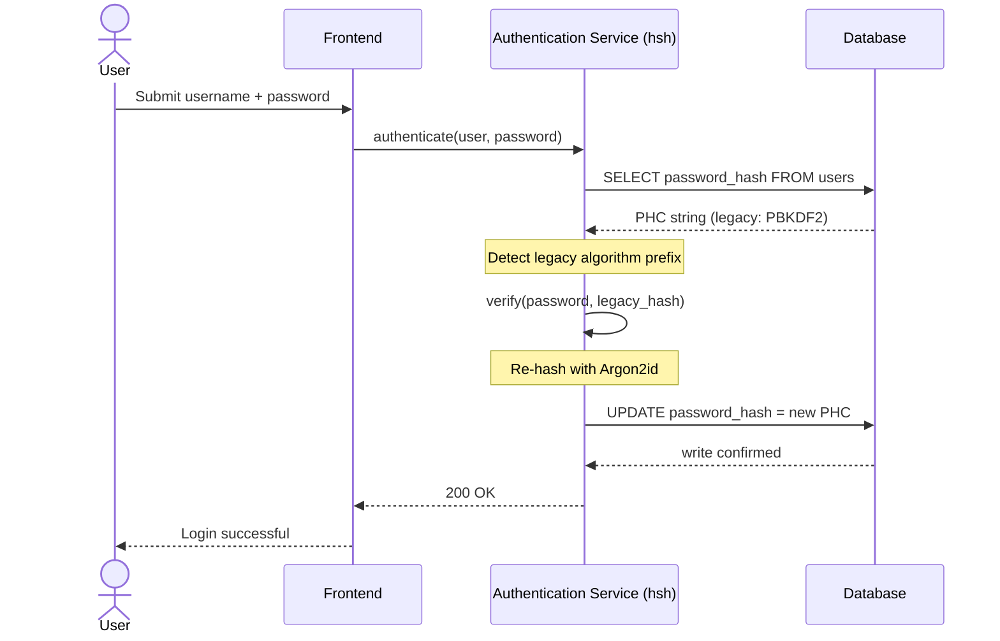
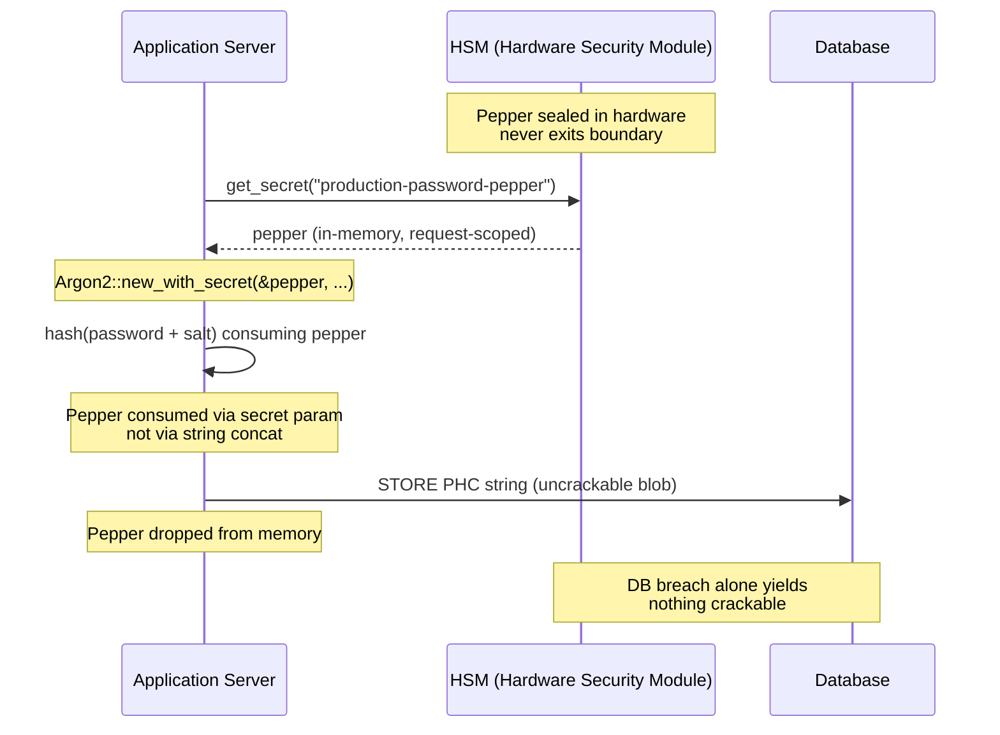

---
# Front Matter (YAML)
author: "contact@sebastienrousseau.com (Sebastien Rousseau)"
banner_alt: "एक डेवलपर टर्मिनल का क्लोज़-अप, जिसमें Rust कंपाइलर का आउटपुट स्क्रॉल हो रहा है — एक एंटरप्राइज़ बैंकिंग प्रमाणीकरण संपदा के नीचे विद्यमान मेमोरी-सेफ़, अंकेक्षण-योग्य क्रिप्टोग्राफ़िक आधार का दृश्यमान अनुशासन"
banner_height: "1597"
banner_width: "2584"
banner: "https://cloudcdn.pro/stocks/images/rustlogs.webp"
cdn: "https://cloudcdn.pro"
charset: "UTF-8"
cname: "sebastienrousseau.com"
copyright: "© Copyright 2025 - 2026 - Sebastien Rousseau. All rights reserved."
date: "22 जून 2026"
description: "hsh एक शुद्ध-Rust क्रिप्टोग्राफ़िक ढाँचा है, जो Tier-1 बैंकों को लीगेसी पासवर्ड हैशों को शून्य डाउनटाइम के साथ Argon2id में माइग्रेट करने, HSM peppering एकीकृत करने तथा C-आधारित FFI मेमोरी भेद्यताओं को समाप्त करने में सक्षम बनाता है — DORA रेज़िलिएंस अनिवार्यताओं की पूर्ति हेतु।"
format-detection: "telephone=no"
hreflang: "hi"
icon: "https://cloudcdn.pro/clients/sebastienrousseau/v1/logos/sebastienrousseau.svg"
id: "https://sebastienrousseau.com/2026-06-22-hsh-zero-downtime-cryptographic-stewardship-rust-banking-2026"
image_alt: "Sebastien Rousseau का श्वेत-श्याम चित्र"
image_height: "162"
image_width: "162"
image: "https://cloudcdn.pro/stocks/images/sebastien-rousseau.png"
keywords: "hsh, Rust क्रिप्टोग्राफ़ी, पासवर्ड हैशिंग, Argon2id, बैंकिंग सुरक्षा, HSM इंटरलॉक, DORA अनुपालन, Basel III, शून्य-डाउनटाइम माइग्रेशन, मेमोरी सुरक्षा, PBKDF2, scrypt, साइबर रिकवरी"
language: "hi-IN"
last_reviewed: "2026-06-22"
layout: "report"
locale: "hi_IN"
logo_alt: "Sebastien Rousseau का लोगो"
logo_height: "44"
logo_width: "44"
logo: "https://cloudcdn.pro/clients/sebastienrousseau/v1/logos/sebastienrousseau.svg"
measurementID: "G-169G4ET5HQ"
name: "Sebastien Rousseau"
permalink: "https://sebastienrousseau.com/2026-06-22-hsh-zero-downtime-cryptographic-stewardship-rust-banking-2026"
rating: "general"
referrer: "no-referrer"
robots: "index, follow"
schema: "FAQPage, Article"
seo_title: "hsh: बैंकिंग हेतु Rust में शून्य-डाउनटाइम क्रिप्टोग्राफ़िक स्टेवर्डशिप"
short_name: "sebastienrousseau"
subtitle: "एक शुद्ध-Rust क्रिप्टोग्राफ़िक ढाँचा बैंकों को लीगेसी पासवर्डों को HSM इंटरलॉक के साथ Argon2id में सहजता से उन्नत करने में कैसे सक्षम बनाता है — और DORA तथा Basel III अनुपालन के लिए इसका क्या अर्थ है।"
tags: "hsh, Rust, बैंकिंग, क्रिप्टोग्राफ़ी, Argon2id, HSM, DORA, Basel-III, सुरक्षा, ओपन-सोर्स, परिचालन-रेज़िलिएंस"
theme-color: "0, 83, 191"
title: "एंटरप्राइज़ बैंकिंग में पासवर्ड प्रबंधन की सुरक्षा: hsh के साथ बहु-एल्गोरिथम हैशिंग और उन्नयन"
url: "https://sebastienrousseau.com/2026-06-22-hsh-zero-downtime-cryptographic-stewardship-rust-banking-2026"
viewport: "width=device-width, initial-scale=1, shrink-to-fit=no"

# RSS
atom_link: "https://sebastienrousseau.com/2026-06-22-hsh-zero-downtime-cryptographic-stewardship-rust-banking-2026/rss.xml"
category: "Technology"
generator: "Static Site Generator (SSG) (version 0.0.40)"
item_description: "hsh एक शुद्ध-Rust क्रिप्टोग्राफ़िक ढाँचा है, जो Tier-1 बैंकों को लीगेसी पासवर्ड हैशों को शून्य डाउनटाइम के साथ Argon2id में माइग्रेट करने, HSM peppering एकीकृत करने तथा C-आधारित FFI मेमोरी भेद्यताओं को समाप्त करने में सक्षम बनाता है — DORA रेज़िलिएंस अनिवार्यताओं की पूर्ति हेतु।"
item_pub_date: "Mon, 22 Jun 2026 07:07:07 +0000"
item_title: "एंटरप्राइज़ बैंकिंग में पासवर्ड प्रबंधन की सुरक्षा: hsh के साथ बहु-एल्गोरिथम हैशिंग और उन्नयन"
pub_date: "Mon, 22 Jun 2026 07:07:07 +0000"
type: "article"

# Twitter Card
twitter_card: "summary_large_image"
twitter_creator: "@wwdseb"
twitter_description: "hsh Tier-1 बैंकों को लीगेसी पासवर्ड हैशों को शून्य डाउनटाइम, HSM इंटरलॉक और मेमोरी-सेफ़ Rust के साथ Argon2id में माइग्रेट करने में सक्षम बनाता है।"
twitter_image: "https://cloudcdn.pro/clients/sebastienrousseau/v1/logos/sebastienrousseau.svg"
twitter_title: "hsh: Rust में शून्य-डाउनटाइम क्रिप्टोग्राफ़िक स्टेवर्डशिप"
twitter_url: "https://sebastienrousseau.com/2026-06-22-hsh-zero-downtime-cryptographic-stewardship-rust-banking-2026"

excerpt: "GPU-त्वरित डिक्रिप्शन और DORA अनिवार्यताओं के युग में, क्रिप्टोग्राफ़िक क्षरण एक प्रणालीगत जोखिम है। बैंकिंग डेटाबेस में पड़ा हुआ हर लीगेसी PBKDF2 या scrypt हैश समझौते की उलटी गिनती है। hsh शून्य-डाउनटाइम, मेमोरी-सेफ़ उन्नयन के साथ प्रचलित ढाँचे को बदल देता है..."

# Added by fix_hsh_frontmatter.py (template completeness)
apple_mobile_web_app_orientations: "portrait"
apple_touch_icon_sizes: "192x192"
apple-mobile-web-app-capable: "yes"
apple-mobile-web-app-status-bar-inset: "black"
apple-mobile-web-app-status-bar-style: "black-translucent"
apple-touch-fullscreen: "yes"
author_location: "London, United Kingdom"
author_twitter: "@wwdseb"
author_website: "https://sebastienrousseau.com"
docs: https://validator.w3.org/feed/docs/rss2.html
item_guid: "https://sebastienrousseau.com/2026-06-22-hsh-zero-downtime-cryptographic-stewardship-rust-banking-2026/rss.xml"
item_link: "https://sebastienrousseau.com/2026-06-22-hsh-zero-downtime-cryptographic-stewardship-rust-banking-2026/rss.xml"
last_build_date: "Mon, 22 Jun 2026 06:06:06 +0000"
managing_editor: "contact@sebastienrousseau.com (Sebastien Rousseau)"
menu: "active"
msapplication-navbutton-color: "0, 83, 191"
site_components: "Kaishi, Kaishi Builder, Kaishi CLI, Kaishi Templates, Kaishi Themes"
site_last_updated: "2023-07-05"
site_software: "Static Site Generator, Rust"
site_standards: "HTML5, CSS3, RSS, Atom, JSON, XML, YAML, Markdown, TOML"
ttl: "60"
twitter_site: "@wwdseb"
webmaster: "contact@sebastienrousseau.com"
apple-mobile-web-app-title: "hsh: Rust password hashing"
thanks: "पढ़ने के लिए धन्यवाद!"
twitter_image_alt: "Sebastien Rousseau का श्वेत-श्याम चित्र"
---

# एंटरप्राइज़ बैंकिंग में पासवर्ड प्रबंधन की सुरक्षा: hsh के साथ बहु-एल्गोरिथम हैशिंग और उन्नयन

<!-- lead-start: manual -->
<aside class="post-lead" aria-label="लेख सारांश">
<p class="post-lead-tldr"><strong>TL;DR.</strong> <a href="https://github.com/sebastienrousseau/hsh">hsh</a> एक ओपन-सोर्स, शुद्ध-Rust क्रिप्टोग्राफ़िक ढाँचा है, जो Tier-1 बैंकों को लीगेसी पासवर्ड हैशों को Argon2id जैसे आधुनिक मानकों में बिना किसी सेवा-बाधा के माइग्रेट करने में सक्षम बनाता है। HSM-समर्थित peppering को एकीकृत करके और C-आधारित FFI रैपरों के बिना सख़्त मेमोरी सुरक्षा लागू करके, यह उन क्रिप्टोग्राफ़िक-क्षरण भेद्यताओं को बंद कर देता है जो DORA और Basel III अनुपालन के लिए सीधा ख़तरा हैं।</p>
<p class="post-lead-heading"><strong>मुख्य निष्कर्ष</strong></p>
<ul class="post-lead-takeaways">
  <li><strong>क्रिप्टोग्राफ़िक क्षरण की समस्या।</strong> PBKDF2 जैसे लीगेसी एल्गोरिथम हार्डवेयर के त्वरित होते ही चरघातांकीय रूप से कमज़ोर होते जाते हैं, जिससे क्रेडेंशियल-स्टफ़िंग और ऑफ़लाइन ब्रूट-फ़ोर्स अभियानों के लिए हमले की सतह फैल जाती है।</li>
  <li><strong>शून्य-डाउनटाइम माइग्रेशन।</strong> <code>verify_and_upgrade</code> पैटर्न मानक लॉगिन घटनाओं के दौरान उपयोगकर्ता क्रेडेंशियलों को पारदर्शी रूप से पुनः-हैश कर देता है, जिससे बल्क डेटाबेस माइग्रेशन का परिचालन जोखिम समाप्त हो जाता है।</li>
  <li><strong>हार्डवेयर इंटरलॉक और peppering।</strong> हैश Hardware Security Modules (HSMs) या क्लाउड KMS आर्किटेक्चर का उपयोग करके लिपटाए जाते हैं, जिससे यह सुनिश्चित होता है कि अकेला डेटाबेस उल्लंघन कोई भी क्रैक करने योग्य संभावित पासवर्ड प्राप्त नहीं कराता।</li>
  <li><strong>मेमोरी सुरक्षा एक नियामक आधार रेखा के रूप में।</strong> पूर्ण रूप से सुरक्षित Rust में पुनः-लिखित और सख़्त निर्भरता-स्वच्छता के माध्यम से प्रवर्तित, hsh लीगेसी C-आधारित क्रिप्टोग्राफ़िक पुस्तकालयों में अंतर्निहित बफ़र-ओवरफ़्लो एवं सप्लाई-चेन जोखिमों को समाप्त करता है।</li>
</ul>
<p class="post-lead-related"><strong>संबंधित पठन:</strong> <a href="https://sebastienrousseau.com/2026-06-20-http-handle-zero-dependency-edge-ingress-banking-rust-2026">http-handle: 2026 में बैंकिंग हेतु उच्च-प्रदर्शन, शून्य-निर्भरता एज इन्ग्रेस</a>, <a href="https://sebastienrousseau.com/2026-06-07-autonomous-treasury-index-programmable-liquidity-tokenised-deposits-2026/index.html">2026 में स्वायत्त ट्रेज़री इंडेक्स</a>।</p>
</aside>
<!-- lead-end -->

> **कार्यकारी सारांश.** 2018 के ख़तरा-मॉडल के विरुद्ध बनाया गया बैंकिंग प्रमाणीकरण 2026 की नियामक व्यवस्था के तहत अब उपयुक्त नहीं है। GPU-त्वरित क्रैकिंग, ASIC घनत्व, और निकट आते पोस्ट-क्वांटम क्षितिज ने PBKDF2 तथा प्रारंभिक-पैरामीटर scrypt के सुरक्षा-मार्जिन को धराशायी कर दिया है; DORA Article 5 ने उस क्षरण को बोर्ड-जवाबदेह देयता में बदल दिया है। hsh, एक ओपन-सोर्स शुद्ध-Rust ढाँचा, इस समस्या को तीन परतों पर समानांतर रूप से सम्बोधित करता है: एक `verify_and_upgrade` डिस्पैचर, जो प्रत्येक सफल लॉगिन पर बिना किसी रखरखाव खिड़की के संग्रहीत क्रेडेंशियल को वर्तमान Argon2id पैरामीटरों पर पुनः-हैश कर देता है; एक HSM- या KMS-इंटरलॉक्ड peppering परत, जो अकेले डेटाबेस उल्लंघन से कुछ भी क्रैक करने योग्य प्राप्त नहीं होने देती; और एक मेमोरी-सेफ़ सप्लाई चेन, जो C-समर्थित क्रिप्टोग्राफ़िक पुस्तकालयों में अंतर्निहित foreign-function-interface हमले की सतह को समाप्त कर देती है। परिणाम एक ऐसा आधार है जो DORA, Basel III परिचालन-जोखिम अनुशासन, SM&CR वरिष्ठ-प्रबंधक जवाबदेही, और NIST IR 8547 पोस्ट-क्वांटम माइग्रेशन क्षितिज की पूर्ति करता है — उस बल्क-रीसेट कार्यक्रम के बिना, जो किसी प्रमाणीकरण संपदा को उन्नत करने हेतु ऐतिहासिक रूप से आवश्यक रहा है।

अधिकांश एंटरप्राइज़ बैंकिंग प्रमाणीकरण अभी भी 2018 के ख़तरा-मॉडल के अनुरूप कठोर बनाए गए पासवर्ड स्तर पर टिका हुआ है। उसे तोड़ने वाला हार्डवेयर आगे बढ़ चुका है। जैसे-जैसे GPU फ़ार्म स्केल करते हैं और क्रिप्टोग्राफ़िक रूप से प्रासंगिक क्वांटम कंप्यूटर (CRQCs) निकट आते हैं, लीगेसी हैशिंग — PBKDF2, प्रारंभिक scrypt — हर उस घंटे के साथ क्षय होती जाती है जो हमलावर ऑफ़लाइन क्रैक क़तार पर कंप्यूट ख़र्च करते हैं। यह क्षय मूक है: उत्पादन डेटाबेस में कुछ भी आपको नहीं बताता कि जो हैश कल मज़बूत था वह अब नहीं है।

[Digital Operational Resilience Act (DORA)](https://eur-lex.europa.eu/eli/reg/2022/2554/oj "Regulation (EU) 2022/2554 — Digital Operational Resilience Act") के तहत, उत्पादन में अनरोटेटेड, लीगेसी क्रिप्टोग्राफ़िक परिसंपत्तियाँ छोड़ देना अब तकनीकी ऋण नहीं है। यह नामित नियामक देयता है।

[hsh](https://github.com/sebastienrousseau/hsh "hsh — शुद्ध-Rust पासवर्ड हैशिंग ढाँचा") इस अंतराल को बंद करता है। यह एक शुद्ध-Rust ढाँचा है, जो कई हैश स्वरूपों का साथ-साथ प्रबंधन करता है और सक्रिय लॉगिन सत्रों के दौरान कमज़ोर क्रेडेंशियलों को इन-फ़्लाइट उन्नत कर देता है। प्रमाणीकरण अवसंरचना 2026 की रेज़िलिएंस अनिवार्यताओं के अनुरूप बनी रहती है — बिना रखरखाव खिड़की के, बिना ज़बरन रीसेट के, बिना डाउनटाइम के एक भी सेकंड के।

## 01. बैंकिंग में क्रिप्टोग्राफ़िक क्षरण की समस्या

hsh जैसे ढाँचे की आवश्यकता को समझने के लिए, पहले पासवर्ड हैश के जीवनचक्र को समझना होगा। एल्गोरिथम सहजता से नहीं उम्र पाते; वे उस हार्डवेयर के सापेक्ष क्षय होते हैं जो उन्हें तोड़ने के लिए उपलब्ध है।

**ASIC/GPU त्वरण अंतराल।** PBKDF2 जैसे एल्गोरिथम CPU के लिए कम्प्यूटेशनली महंगे बनाने हेतु डिज़ाइन किए गए थे। आज, हमलावर ऑफ़लाइन शब्दकोश-हमले निष्पादित करने के लिए अत्यधिक समानांतरीकृत GPU का उपयोग करते हैं। 2018 में उत्पन्न लीगेसी हैश 2026 के विरोधी के सामने कहीं अधिक कमज़ोर है।

**बिग-बैंग माइग्रेशन जोखिम।** जब कोई CISO PBKDF2 से Argon2id जैसे मेमोरी-हार्ड एल्गोरिथम पर उन्नयन का निर्णय लेता है, तो वह हैशों को पलट कर पुनः-एन्क्रिप्ट नहीं कर सकता। पारंपरिक समाधान — बहु-करोड़ उपयोगकर्ता पासवर्ड रीसेट के लिए बाध्य करना — विशाल ग्राहक घर्षण और परिचालन जोखिम उत्पन्न करते हैं।

**C-लाइब्रेरी सप्लाई चेन।** ऐतिहासिक रूप से, बैंकिंग मिडलवेयर हैशिंग के लिए `argonautica` जैसी पुस्तकालयों या कच्ची C बाइंडिंग पर निर्भर रही है। ये पुस्तकालय एक छिपा हुआ सप्लाई-चेन जोखिम वहन करती हैं: प्रमाणीकरण मॉड्यूल में एक अकेला मेमोरी-बफ़र ओवरफ़्लो बैंकिंग स्टैक की सर्वाधिक विशेषाधिकार-प्राप्त परत पर रिमोट कोड एक्ज़ीक्यूशन (RCE) तक ले जा सकता है।

### एल्गोरिथम तुलना — हार्डवेयर प्रतिरोध और ट्यूनिंग सतह

बैंक को माइग्रेशन कॉर्पस में जिन तीन एल्गोरिथमों का यथार्थ रूप से सामना करना पड़ता है, वे क्रिप्टोग्राफ़िक प्रिमिटिव चुनाव में कम और इस बात में अधिक भिन्न होते हैं कि वे हार्डवेयर दबाव के अधीन कैसे उम्र पाते हैं। नीचे दी गई तालिका व्यावहारिक मुद्रा को सारगर्भित रूप से प्रस्तुत करती है।

| Algorithm | Memory-hard | GPU / ASIC resistance | Tuning surface | 2026 status |
| ---- | ---- | ---- | ---- | ---- |
| **PBKDF2** | नहीं | निम्न — GPU पर वेक्टराइज़ होता है; सामान्य हार्डवेयर पर प्रति अनुमान उप-मिलीसेकंड। | केवल पुनरावृत्ति संख्या। | लीगेसी। केवल माइग्रेशन के दौरान verify-side fallback के रूप में स्वीकार्य। |
| **scrypt** | हाँ (मध्यम) | मध्यम — मेमोरी लागत साधारण GPU फ़ार्मों को परास्त करती है; पैमाने पर ASIC-amortisable। | `N` (CPU/मेमोरी), `r` (ब्लॉक आकार), `p` (समानांतरता)। | ग्रीनफ़ील्ड हेतु अप्रचलित। माइग्रेशन कॉर्पस में सक्रिय। |
| **Argon2id** | हाँ (उच्च) | उच्च — मेमोरी- और समय-कठोर; साइड-चैनल और TMTO हमलों का प्रतिरोध करता है। | मेमोरी लागत (`m`), समय लागत (`t`), समानांतरता (`p`), गोपन (pepper)। | अनुशंसित डिफ़ॉल्ट। OWASP, NIST SP 800-63B-4 draft, FedRAMP। |

माइग्रेशन योजना के लिए निष्कर्ष संकीर्ण है: PBKDF2 एक *verify-side* स्थिति है, *write-side* गंतव्य नहीं। PBKDF2 रिकॉर्ड पर प्रत्येक सफल लॉगिन को बाहर निकलते समय एक Argon2id रिकॉर्ड उत्पन्न करना चाहिए।

## 02. hsh 2026 वास्तुकला दृष्टिकोण

यह ढाँचा पाँच मूल परतों में संरचित है, प्रत्येक परिचालन जोखिम की एक विशिष्ट श्रेणी को कम करने हेतु अभियांत्रिकीकृत है।

### तालिका 1: hsh वास्तुकला परतें और जोखिम न्यूनीकरण

| परत | डिज़ाइन निर्णय | यह क्यों मायने रखता है | ग़लत संभाले जाने पर जोखिम |
| ---- | ---- | ---- | ---- |
| **क्रिप्टोग्राफ़िक प्रिमिटिव** | Argon2id, scrypt और PBKDF2 का समर्थन करने वाला एकीकृत PHC String Format | GPU हमलों के विरुद्ध श्रेणी-में-सर्वश्रेष्ठ प्रतिरोध प्रदान करता है, साथ ही पश्च-संगतता बनाए रखता है। | डेटा साइलो; कमज़ोर एल्गोरिथम जो प्रति सेकंड 100 अरब+ अनुमानों की अनुमति देते हैं। |
| **पॉलिसी इंजन** | `verify_and_upgrade` डिस्पैच | लॉगिन पर गतिशील रूप से लीगेसी से आधुनिक नीतियों के संक्रमण को स्वचालित करता है। | सुरक्षा क्षरण; सक्रिय उपयोगकर्ता आसानी से क्रैक होने योग्य लीगेसी हैश प्रकारों पर बने रहते हैं। |
| **हार्डवेयर इंटरलॉक** | HSM और Cloud KMS "peppering" क्षमताएँ | यह सुनिश्चित करता है कि अकेला डेटाबेस उल्लंघन संभावित पासवर्ड उजागर नहीं करता। | SQL इंजेक्शन उल्लंघन के बाद ऑफ़लाइन ब्रूट-फ़ोर्स हमले सफल होना। |
| **सुरक्षा स्वच्छता** | `deny.toml` प्रवर्तन और शुद्ध Rust | असुरक्षित FFI और अविश्वसनीय बाहरी C-निर्भरताओं को पूरी तरह अवरुद्ध करता है। | विनाशकारी सप्लाई-चेन हमले और मेमोरी-करप्शन CVEs। |

## 03. शून्य-डाउनटाइम पुनः-हैश पाथवे

`verify_and_upgrade` पैटर्न एक बुद्धिमान, स्थिति-जागरूक डिस्पैचिंग प्रणाली के माध्यम से डेटा माइग्रेशन को हल करता है, जिसके लिए शून्य डेटाबेस डाउनटाइम आवश्यक है।

जब कोई उपयोगकर्ता अपने क्रेडेंशियल प्रस्तुत करता है, तो hsh संग्रहीत Password Hashing Competition (PHC) स्ट्रिंग पढ़ता है। यदि उसमें एक लीगेसी हैश है (उदा. एक पुराना PBKDF2 कॉन्फ़िगरेशन), तो प्रणाली निम्न प्रवाह निष्पादित करती है:

1. **पहचान:** लीगेसी एल्गोरिथम और उसके विशिष्ट पैरामीटरों को पार्स करती है।
2. **सत्यापन:** लीगेसी हैश के विरुद्ध संभावित पासवर्ड को मान्य करती है।
3. **रीयल-टाइम उन्नयन:** सफल मिलान पर, यह मेमोरी में प्लेनटेक्स्ट संभावित पासवर्ड लेती है और तुरंत अत्यधिक सुरक्षित Argon2id नीति का उपयोग करके एक नया हैश गणना करती है।
4. **दृढ़ता:** यह नई PHC स्ट्रिंग बैंकिंग एप्लिकेशन को लौटाती है, जो डेटाबेस में लीगेसी रिकॉर्ड पर अधिलेखन कर देती है।

यह प्रक्रिया अंतिम-उपयोगकर्ता के लिए पूरी तरह पारदर्शी है। यह सबसे सक्रिय खातों को प्रथम दिन से ही उच्चतम सुरक्षा स्तर पर प्रभावी रूप से माइग्रेट कर देती है, समय के साथ बैंक की हमले की सतह को नाटकीय रूप से जैविक तरीक़े से कम करती है।

नीचे का अनुक्रम यह दिखाता है कि एकल लॉगिन घटना के दौरान क्या होता है जब संग्रहीत रिकॉर्ड लीगेसी एल्गोरिथम पर है। उपयोगकर्ता को कुछ भी बदला हुआ दिखाई नहीं देता; बैंक का प्रमाणीकरण आधार एक रिकॉर्ड से सुदृढ़ हो जाता है।



### कार्यान्वयन पैटर्न — `verify_and_upgrade` डिस्पैच

प्रमाणीकरण सेवा के अंदर एकीकरण सतह छोटी है। लीगेसी कोड पथ fallback के रूप में बना रहता है; नया कोड पथ डिस्पैचर है।

```rust
use hsh::{Hasher, UpgradeResult};

struct UserRecord {
    username: String,
    password_hash: String, // PHC string
}

async fn authenticate(user: UserRecord, password_attempt: &str) -> Result<bool, AuthError> {
    let hasher = Hasher::new();
    match hasher.verify_and_upgrade(password_attempt, &user.password_hash) {
        Ok(UpgradeResult::Verified(is_valid)) => Ok(is_valid),
        Ok(UpgradeResult::Upgraded(new_hash)) => {
            db::update_user_hash(&user.username, new_hash).await?;
            Ok(true)
        }
        Err(_) => Err(AuthError::InvalidCredentials),
    }
}
```

तीन गुण मायने रखते हैं:

- **स्थिति-जागरूकता।** `verify_and_upgrade` PHC स्ट्रिंग के उपसर्ग का निरीक्षण करता है। यदि एल्गोरिथम मार्कर लीगेसी है, तो ढाँचा कॉन्फ़िगर की गई Argon2id नीति के विरुद्ध स्वतः पुनः-हैश को ट्रिगर करता है। कॉल करने वाले कोड में कोई शाखन नहीं।
- **परमाणुता।** पुनः-हैशिंग केवल लीगेसी सत्यापन सफल होने के बाद, उसी प्रमाणीकरण घटना के अंदर होती है। न कोई पृथक बैच जॉब, न निर्धारित माइग्रेशन खिड़की, न पीछे लौटाने हेतु कोई विनाशकारी बल्क माइग्रेशन।
- **दृढ़ता।** `UpgradeResult::Upgraded` प्रकार नई PHC स्ट्रिंग वहन करता है। एप्लिकेशन इसे उसी डेटा पथ के माध्यम से बनाए रखता है जो लीगेसी रिकॉर्ड के लिए पहले से मौजूद है — कोई समानांतर लेखन सतह नहीं, कोई दो-चरण लेखन प्रोटोकॉल नहीं।

**विफलता-मोड।** यदि उन्नयन लेखन के दौरान डेटाबेस लेखन विफल हो जाए या KMS कुछ क्षण के लिए अनुपलब्ध हो, तो भी सत्र लीगेसी हैश के विरुद्ध सफल होता है और रिकॉर्ड पुराने एल्गोरिथम पर बना रहता है। अगला सफल लॉगिन उन्नयन का पुनः-प्रयास करता है। न कोई अर्ध-माइग्रेटेड स्थिति है, न ही उपयोगकर्ता-दृश्य विफलता — माइग्रेशन लॉगिन घटनाओं के पार एकदिश है, और किसी विफल उन्नयन की प्रति-रिकॉर्ड लागत अगले लॉगिन पर ठीक एक अतिरिक्त पुनः-प्रयास है।

## 04. HSM / KMS इंटरलॉक के माध्यम से Peppered हैश

मानक पासवर्ड हैशिंग प्रत्यक्ष डेटाबेस लीक से सुरक्षा देती है, परंतु यदि हमलावर डेटाबेस (हैश और saltों दोनों) हासिल कर ले, तो वह ऑफ़लाइन क्रैकिंग निष्पादित कर सकता है।

hsh एक सुदृढ़ "peppered" सुरक्षा परत प्रस्तुत करता है। Hardware Security Modules (HSMs) या क्लाउड-नेटिव Key Management Services (KMS) के साथ एकीकरण द्वारा, अंतिम Argon2id आउटपुट को क्रिप्टोग्राफ़िक रूप से एक उच्च-एन्ट्रॉपी कुंजी से लपेटा जाता है, जो सुरक्षित हार्डवेयर सीमा से कभी बाहर नहीं निकलती। यदि उपयोगकर्ता डेटाबेस बहिर्निकाला जाए, तो हमलावर के पास केवल एन्क्रिप्टेड blobs होते हैं। वह बैंक के भौतिक रूप से पृथक्कृत HSM अवसंरचना को भी भंग किए बिना पासवर्ड क्रैक करना शुरू नहीं कर सकता।

नीचे का आर्किटेक्चर आरेख गोपनीय पथ का अनुरेखण करता है। pepper कभी डेटाबेस में नहीं उतरता; डेटाबेस स्वयं कुछ भी पता-योग्य नहीं रखता। दोनों भंडार स्वतंत्र रूप से विफल हो सकते हैं — प्रणाली केवल तभी गोपनीयता खोती है जब दोनों एक साथ विफल हों।



### कार्यान्वयन पैटर्न — HSM-समर्थित peppered Argon2id

pepper को अनुरोध-समय पर HSM से प्राप्त किया जाता है, कॉन्फ़िगरेशन फ़ाइल से नहीं। `Argon2::new_with_secret` इसे एल्गोरिथम के secret पैरामीटर के माध्यम से उपभोग करता है, स्ट्रिंग संयोजन के माध्यम से नहीं।

```rust
use argon2::{
    Argon2, Algorithm, Version, Params,
    PasswordHasher, PasswordVerifier,
    password_hash::{PasswordHash, SaltString, rand_core::OsRng},
};

async fn authenticate_with_hsm(
    user: UserRecord,
    password_attempt: &str,
) -> Result<bool, AuthError> {
    let pepper = hsm::client::get_secret("production-password-pepper").await?;
    let hasher = Argon2::new_with_secret(
        &pepper,
        Algorithm::Argon2id,
        Version::V0x13,
        Params::default(),
    )
    .map_err(|_| AuthError::Internal)?;

    let parsed = PasswordHash::new(&user.password_hash)
        .map_err(|_| AuthError::InvalidCredentials)?;
    if hasher.verify_password(password_attempt.as_bytes(), &parsed).is_ok() {
        if is_legacy_hash(&user.password_hash) {
            let new_hash = hasher
                .hash_password(
                    password_attempt.as_bytes(),
                    &SaltString::generate(&mut OsRng),
                )
                .map_err(|_| AuthError::Internal)?
                .to_string();
            db::update_user_hash(&user.username, new_hash).await?;
        }
        return Ok(true);
    }
    Err(AuthError::InvalidCredentials)
}
```

इस आकार से तीन DORA-संरेखित परिणाम निकलते हैं:

- **कुंजी रोटेशन एक key-management समस्या के रूप में।** pepper HSM/KMS सीमा के पीछे रहता है, डेटाबेस में नहीं। रोटेशन उपयोगकर्ता संपदा के पार एक पुनः-हैशिंग अभियान नहीं, बल्कि एक key-management परिवर्तन बन जाता है। नए हैश वर्तमान pepper संस्करण से बँधते हैं; पुराने हैश अपने बँधे संस्करण के तहत सत्यापित होते हैं जब तक कि वे स्वाभाविक रूप से उन्नत न हो जाएँ।
- **कर्तव्यों का पृथक्करण।** pepper पढ़ने वाली सेवा-पहचान को अंकेक्षण-योग्य और न्यूनतम-विशेषाधिकार वाली होनी चाहिए। संगत HSM grant के बिना पूर्ण डेटाबेस बहिर्निष्कासन कुछ भी क्रैक करने योग्य नहीं देता। डेटाबेस के बिना HSM-grant समझौता कुछ भी सम्बोधन-योग्य नहीं देता। किसी भी एकल विफलता का blast radius परिबद्ध है।
- **Length extension और concat बग से बचें।** स्ट्रिंग संयोजन के बजाय Argon2 के secret पैरामीटर का उपयोग कार्यान्वयन सतह से क्रिप्टोग्राफ़िक धोखों का पूरा वर्ग — length-extension, ग़लत-टाइप किए गए UTF-8 संयोजन, salt/pepper-क्रम बग — हटा देता है।

## 05. नियामक संरेखण: DORA, Basel III, और SM&CR

- **DORA Articles 5 और 6:** वित्तीय संस्थाओं से ICT जोखिम प्रबंधन ढाँचे बनाए रखने की अपेक्षा करते हैं। एक दशक पुराने, अनरोटेटेड पासवर्ड हैशों पर निर्भर रणनीति इन सिद्धांतों का उल्लंघन करती है। hsh क्रिप्टोग्राफ़िक संरक्षण को निरंतर ऊँचा उठाने के लिए एक प्रलेखित, स्वचालित तंत्र प्रदान करता है।
- **Basel III:** नियामक पूँजी को हानि-घटनाओं की संभाव्यता एवं गंभीरता से जोड़ता है। HSM इंटरलॉक के साथ Argon2id लागू करके, डेटाबेस उल्लंघन की गंभीरता नाटकीय रूप से कम हो जाती है, जो कम परिचालन-जोखिम पूँजी आवंटन हेतु परिमाणीय तर्कों का समर्थन करती है।
- **SM&CR जवाबदेही:** एक ऐसी वास्तुकला को अनुमोदित करना जो क्रिप्टोग्राफ़िक क्षरण को सक्रिय रूप से उपचारित करती है, नामित वरिष्ठ प्रबंधकों को जोखिम-न्यूनीकरण की एक सत्यापन-योग्य, प्रलेख-योग्य श्रृंखला प्रदान करती है।

## अक्सर पूछे जाने वाले प्रश्न

**क्या hsh किसी Tier-1 बैंकिंग प्रमाणीकरण पथ के लिए production-ready है?**
यह लाइब्रेरी ओपन-सोर्स, प्रलेखित है, और उसी `argon2` क्रेट के माध्यम से Argon2id का उपयोग करती है जो RustCrypto password-hashing पारिस्थितिकी तंत्र को आधार प्रदान करता है। Tier-1 अंगीकरण बैंक के अपने उचित परिश्रम के बाद होता है: स्वतंत्र कोड समीक्षा, reproducible-build अनुप्रमाणन, निर्भरता-वृक्ष पिनिंग, HSM-vendor एकीकरण परीक्षण, और परिचालन जोखिम सहमति। hsh आधार प्रदान करता है; बैंक परिनियोजन को प्रमाणित करता है।

**`verify_and_upgrade` बल्क-माइग्रेशन जोखिम से कैसे बचता है?**
सत्यापनकर्ता पार्स-समय पर PHC स्ट्रिंग का निरीक्षण करता है, पासवर्ड को मान्य करने हेतु लीगेसी एल्गोरिथम चलाता है, और — यदि संग्रहीत एल्गोरिथम या पैरामीटर सेट वर्तमान न्यूनतम सीमा से नीचे है — तो प्लेनटेक्स्ट को बँधे हुए HSM pepper के साथ Argon2id के तहत पुनः-हैश करता है और नई PHC स्ट्रिंग को परमाणु रूप से वापस लिखता है। उपयोगकर्ता एक सामान्य लॉगिन का अनुभव करता है। संपदा प्रति सफल प्रमाणीकरण एक रिकॉर्ड से सुदृढ़ हो जाती है। न कोई रीसेट अभियान, न रखरखाव खिड़की, न कोई परिचालन-जोखिम घटना।

**उन निष्क्रिय खातों का क्या होता है जो कभी लॉगिन नहीं करते?**
जो रिकॉर्ड कभी प्रमाणित नहीं होते, वे कभी पुनः-हैश नहीं होते। बैंक इसे दो पूरक नीतियों से सम्बोधित करते हैं: एक प्रलेखित निष्क्रियता सीमा (अक्सर 18–24 महीने), जिसके बाद खाता एक नियंत्रित रीसेट अभियान के तहत प्रशासनिक रूप से रोटेट किया जाता है, और परिभाषित समूहों (उच्च-मूल्य, उच्च-विशेषाधिकार, विनियमित) में खातों हेतु निर्धारित रखरखाव के दौरान एक कृत्रिम पुनः-हैश रन। दोनों नीतियाँ हैं, लाइब्रेरी व्यवहार नहीं; hsh डिस्पैच निर्णय को अंकेक्षण टेलीमेट्री में दर्ज करता है ताकि परिचालन स्वामी कवरेज सिद्ध कर सके।

**क्या HSM pepper प्रमाणीकरण पथ पर एकल विफलता-बिंदु प्रस्तुत करता है?**
वही HSM जो भुगतान संदेशों पर हस्ताक्षर करता है और KMS-समर्थित कुंजियाँ रोटेट करता है, उसी पथ पर है। जोखिम बैंक की मौजूदा मुद्रा के समान है; hsh इसे प्रस्तुत नहीं करता, बल्कि विरासत में लेता है। शमन मानक हैं: HA HSM जोड़े, हॉट-स्पेयर KMS क्षेत्र, सर्किट-ब्रेकर के साथ अनुरोध-स्कोप्ड pepper पुनर्प्राप्ति और रीड-ओनली मोड में fall-back, और HSM अनुपलब्धता हेतु एक स्पष्ट परिचालन रनबुक। pepper `argon2` का secret पैरामीटर है, जिसे प्रक्रिया में उपभोग कर उपयोग के बाद मेमोरी से हटा दिया जाता है।

**hsh पोस्ट-क्वांटम माइग्रेशन के सापेक्ष कहाँ बैठता है?**
hsh एक पासवर्ड-और-सीक्रेट-हैशिंग ढाँचा है, key-encapsulation या signature primitive नहीं। [NIST IR 8547](https://csrc.nist.gov/pubs/ir/8547/ipd "Transition to Post-Quantum Cryptography Standards") में प्रलेखित PQC संक्रमण key establishment (ML-KEM, FIPS 203) और signatures (ML-DSA, FIPS 204; SLH-DSA, FIPS 205) को लक्षित करता है। hsh जिस हैशिंग परत को कवर करता है, वह उस माइग्रेशन के काफ़ी हद तक लंबवत है। दोनों आधार-स्तर पर अभिसरित होते हैं — दोनों ही एक मेमोरी-सेफ़, अंकेक्षण-योग्य, reproducible-build क्रिप्टोग्राफ़िक सप्लाई चेन चाहते हैं — जो वास्तव में वही मुद्रा है जो hsh आज सक्षम करता है।

## निष्कर्ष

डिप्लॉय-एंड-फ़ॉरगेट पासवर्ड हैशिंग समाप्त हो चुकी है। DORA ने क्रिप्टोग्राफ़िक निष्क्रियता को तकनीकी ऋण से नामित नियामक देयता में स्थानांतरित कर दिया है, और हार्डवेयर वक्र हर साल और तीव्र होता जाता है। hsh का योगदान एक मज़बूत एल्गोरिथम नहीं है — Argon2id कई वर्षों से उपलब्ध है। योगदान वह परिचालन तंत्र है जो डाउनटाइम निर्धारित किए बिना, उपयोगकर्ता रीसेट के लिए बाध्य किए बिना, और बैंक के प्रमाणीकरण पथ पर C-आधारित FFI shimओं पर भरोसा किए बिना इसमें माइग्रेट करने की अनुमति देता है।

[hsh स्रोत कोड](https://github.com/sebastienrousseau/hsh "hsh — शुद्ध-Rust पासवर्ड हैशिंग ढाँचा, MIT और Apache 2.0 दोहरा लाइसेंस") MIT और Apache 2.0 दोहरे लाइसेंस के तहत उपलब्ध है।

## संदर्भ

Basel Committee on Banking Supervision (2011). *Basel III: A global regulatory framework for more resilient banks and banking systems*. Bank for International Settlements. उपलब्ध: [https://www.bis.org/publ/bcbs189.pdf](https://www.bis.org/publ/bcbs189.pdf "Basel III: A global regulatory framework for more resilient banks and banking systems")

Biryukov, A., Dinu, D., Khovratovich, D., and Josefsson, S. (2021). *RFC 9106: Argon2 Memory-Hard Function for Password Hashing and Proof-of-Work Applications*. Internet Engineering Task Force. उपलब्ध: [https://datatracker.ietf.org/doc/html/rfc9106](https://datatracker.ietf.org/doc/html/rfc9106 "RFC 9106 — Argon2 Memory-Hard Function for Password Hashing")

European Parliament and Council (2022). *Regulation (EU) 2022/2554 on digital operational resilience for the financial sector (DORA)*. उपलब्ध: [https://eur-lex.europa.eu/eli/reg/2022/2554/oj](https://eur-lex.europa.eu/eli/reg/2022/2554/oj "Regulation (EU) 2022/2554 — DORA")

Financial Conduct Authority (2015). *Senior Managers and Certification Regime (SM&CR)*. उपलब्ध: [https://www.fca.org.uk/firms/senior-managers-certification-regime](https://www.fca.org.uk/firms/senior-managers-certification-regime "Senior Managers and Certification Regime")

National Institute of Standards and Technology (2024). *Initial Public Draft — Transition to Post-Quantum Cryptography Standards (NIST IR 8547)*. उपलब्ध: [https://csrc.nist.gov/pubs/ir/8547/ipd](https://csrc.nist.gov/pubs/ir/8547/ipd "NIST IR 8547 — Transition to Post-Quantum Cryptography Standards")

OWASP Foundation (2024). *Password Storage Cheat Sheet*. उपलब्ध: [https://cheatsheetseries.owasp.org/cheatsheets/Password_Storage_Cheat_Sheet.html](https://cheatsheetseries.owasp.org/cheatsheets/Password_Storage_Cheat_Sheet.html "OWASP Password Storage Cheat Sheet")

<!-- enrich-start -->
<aside class="author-card" aria-label="लेखक के बारे में"><span class="author-card-body"><strong class="author-card-name"><a href="/about/index.html">Sebastien Rousseau</a></strong><span class="author-card-bio">वरिष्ठ बैंकिंग प्रौद्योगिकीविद्, जो अनुप्रयुक्त AI, ISO 20022 माइग्रेशन, वित्तीय सेवाओं हेतु पोस्ट-क्वांटम क्रिप्टोग्राफ़ी और थोक भुगतानों के संरचनात्मक रूपांतरण पर लेखन करते हैं।</span><span class="author-credentials">HSBC Commercial & Investment Bank, PayPal, Barclays, Shazam में 20+ वर्ष। <a href="https://www.linkedin.com/in/sebastienrousseau/" rel="external noopener">LinkedIn</a> &middot; <a href="https://github.com/sebastienrousseau" rel="external noopener">GitHub</a></span></span></aside>
<p class="post-reviewed">अंतिम समीक्षा <time datetime="2026-06-22">2026-06-22</time>।</p>
<!-- enrich-end -->
