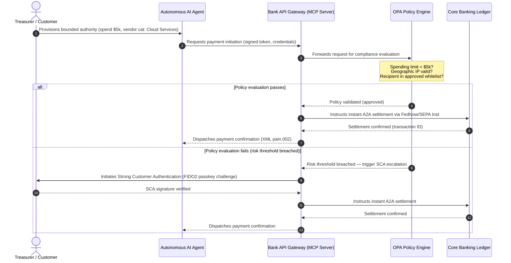

# 2026 वैश्विक भुगतान दृष्टिकोण: एक एजेंटिक, अदृश्य, रीयल-टाइम विश्व में संचालन मॉडल, जोखिम और राजस्व

2026 के वैश्विक भुगतान चक्र को तीन अभिसरित शक्तियाँ परिभाषित करती हैं — एजेंटिक वाणिज्य, अदृश्य एम्बेडेड भुगतान और रीयल-टाइम निष्पादन — जो Project Agorá के अंतर्गत एक टोकनाइज़्ड एकीकृत बही-खाते और नवंबर 2026 के कठोर SWIFT संरचित-पता संक्रमण पर टिकी हैं।

<!-- lead-start -->
<aside class="post-lead" aria-label="लेख सारांश">

<strong>संक्षेप में।</strong> 2026 का भुगतान परिदृश्य संदेश-स्थानांतरण से बहु-आयामी संचालन मॉडल की ओर बढ़ गया है, जहाँ जोखिम और राजस्व रीयल-टाइम निष्पादन से तय होते हैं। यह लेख J.P. Morgan, Global Payments, HSBC और Payments Association के 2026 दृष्टिकोणों को एक चार-स्तंभीय G-SIB संचालन योजना में संश्लेषित करता है, जिसमें मॉडल-आरंभित एजेंटिक वाणिज्य, सदा-चालू ट्रेज़री API, BIS Project Agorá के अंतर्गत टोकनाइज़्ड एकीकृत बही-खाते और 14/15 नवंबर 2026 की SWIFT और SEPA संरचित-पता समय-सीमाएँ शामिल हैं। Swift CBPR+ 14 नवंबर 2026 से असंरचित `<AdrLine>` ब्लॉक को हटा देता है; EPC SEPA नियम पुस्तिकाएँ केवल 15 नवंबर 2026 तक असंरचित पते की अनुमति देती हैं।

<strong>मुख्य निष्कर्ष</strong>

<ul class="post-lead-takeaways">
  <li><strong>एजेंटिक वाणिज्य एक प्रत्यायोजित-दायित्व क्षेत्र खोलता है।</strong> स्वायत्त AI एजेंट 2030 तक प्रति वर्ष $3-$5 ट्रिलियन वाणिज्य की मध्यस्थता करने का अनुमान है। बैंकों को MCP द्वार-नियंत्रण, PSD3/PSR के अंतर्गत SCA प्रत्यायोजन और बहु-एजेंट भुगतान शृंखलाओं के भीतर KYC/AML का स्वामित्व परिभाषित करना होगा।</li>
  <li><strong>सदा-चालू तरलता अब एक परिचालन और नियामक मानक है।</strong> 24/7 ट्रेज़री API और वर्चुअल खाते फँसी नकदी कम करते हैं और लचीलेपन की कसौटी ऊँची करते हैं। प्रणालीगत रूप से महत्वपूर्ण रियल-टाइम ट्रेजरी एपीआई के लिए, फाइव-नाइन (99.999 %) उपलब्धता बैंकों द्वारा पर्यवेक्षकों को DORA-स्तरीय लचीलापन प्रदर्शित करने के लिए स्वयं निर्धारित आंतरिक इंजीनियरिंग लक्ष्य बनती जा रही है। DORA स्वयं कोई सार्वभौमिक फाइव-नाइन सीमा निर्धारित नहीं करता; यह आईसीटी जोखिम प्रबंधन, घटना रिपोर्टिंग, लचीलापन परीक्षण, तृतीय-पक्ष जोखिम और महत्वपूर्ण आईसीटी प्रदाताओं के पर्यवेक्षण को कवर करता है।</li>
  <li><strong>टोकनाइज़ेशन विनियमित एकीकृत बही-खातों तक पहुँच गया है।</strong> Project Agorá टोकनाइज़्ड वाणिज्यिक बैंक जमाओं और केंद्रीय बैंक भंडारों के लिए सबसे बड़ा सार्वजनिक-निजी ढाँचा है। बैंकों को स्पष्ट विवेकपूर्ण उपचार के साथ पाँच-चरणीय टोकनाइज़ेशन यात्रा चाहिए।</li>
  <li><strong>14/15 नवंबर 2026 का संरचित-पता संक्रमण कठोर-दिनांकित है।</strong> Swift CBPR+ 14 नवंबर 2026 से असंरचित `<AdrLine>` ब्लॉक को हटा देता है; EPC SEPA नियम पुस्तिकाएँ केवल 15 नवंबर 2026 तक असंरचित पते की अनुमति देती हैं। दोनों संक्रमण के बाद अस्वीकृति को सक्रिय कर देंगे। उत्पाद, प्रौद्योगिकी और अनुपालन टीमों में स्वच्छ डेटा-शासन आवश्यक है।</li>
</ul>

<strong>संबंधित पठन:</strong> <a href="https://sebastienrousseau.com/2026-06-23-iso-20022-pain001-programmable-liquidity-autonomic-treasury-2026">From Pain.001 to Programmable Liquidity: ISO 20022 as the Autonomic Nervous System of Treasury in 2026</a>, <a href="https://sebastienrousseau.com/2026-06-24-cross-border-iso-20022-open-finance-tokenised-deposits-treasury-2026">Cross-Border 2026: ISO 20022, Open Finance and Tokenised Deposits in Corporate Treasury</a>, <a href="https://sebastienrousseau.com/2026-06-25-quantum-dawn-cib-kyberlib-quantum-resilient-payments-stack-2026">Quantum Dawn for CIB: From KyberLib to a Quantum-Resilient Payments Stack</a>.

</aside>
<!-- lead-end -->

वैश्विक लेन-देन बैंकों के लिए, 2026-2028 चक्र एक संरचनात्मक खिड़की है। आधुनिक भुगतान बुनियादी ढाँचा अब प्रशासनिक उपयोगिता नहीं है — यह बैंक-स्तरीय प्रौद्योगिकी रणनीति का मूल है। G-SIBs और प्रमुख क्षेत्रीय संस्थानों के भीतर, प्रौद्योगिकी, विनियमन और ग्राहक अपेक्षा एक ही संचालन तल पर अभिसरित हो गए हैं।

तीन शक्तियाँ इस चक्र को परिभाषित करती हैं, और प्रत्येक सीधे एक कार्यकारी-स्तरीय चिंता से जुड़ती है।

- **एजेंटिक वाणिज्य** — चैनल वितरण, उत्पाद डिज़ाइन, दायित्व निर्धारण और पर्यवेक्षी जाँच के अंतर्गत Model Risk Management।
- **अदृश्य भुगतान** — ग्राहक अनुभव, जहाँ बैंक अपनी बही-खाते को कॉर्पोरेट और व्यापारी फ्रंट-एंड में एम्बेड करने में विफल होने पर मध्यस्थता-विघटन जोखिम का सामना करते हैं।
- **रीयल-टाइम निष्पादन** — पूँजी गति, जिसके परिणामस्वरूप तरलता प्रबंधन, क्रेडिट जोखिम, परिचालन लचीलापन और धोखाधड़ी रक्षा में परिवर्तन।

वित्तीय दाँव महत्वपूर्ण हैं। धोखाधड़ी गति और परिष्कार में बढ़ती है; नियामक समय-सीमाएँ कठोर हैं; और जो बैंक अपने मूल सिस्टम को सक्रिय रूप से आधुनिक करते हैं वे पर्याप्त शुल्क-राजस्व अवसर खोलते हैं। निष्क्रियता की लागत विपरीत है: तत्काल लेन-देन अस्वीकृति, परिचालन अवरोध, नियामक दंड और बाज़ार-हिस्सा का तेज़ क्षरण।

## निश्चितता सीढ़ी — क्या तिथिबद्ध है, क्या विनियमित है, क्या पूर्वानुमान है

इस रिपोर्ट में हर मद समान निश्चितता नहीं रखता। बोर्ड-स्तर का प्रश्न यह है कि कौन-से डेल्टा समय-सीमाएँ हैं, कौन-से पर्यवेक्षी अपेक्षाएँ हैं, और कौन-से अभी भी बाज़ार पूर्वानुमान हैं — क्योंकि उत्तर बजट वार्तालाप को बदल देता है।

| श्रेणी | उदाहरण |
| --- | --- |
| **कठोर समय-सीमाएँ** | Swift CBPR+ संरचित-पता संक्रमण (14 नवंबर 2026); EPC SEPA नियम पुस्तिकाएँ (15 नवंबर 2026) |
| **नियामक दायित्व** | DORA आईसीटी जोखिम + लचीलापन परीक्षण + तृतीय-पक्ष पर्यवेक्षण (EU); PSD3/PSR के अंतर्गत SCA प्रत्यायोजन; SR 11-7 + PRA SS1/23 के अंतर्गत MRM |
| **उच्च-संभावना बाज़ार बदलाव** | रीयल-टाइम ट्रेज़री API, AI-नेतृत्व धोखाधड़ी रक्षा, API-आधारित तरलता, डीपफेक-संचालित बायोमेट्रिक धोखाधड़ी |
| **रणनीतिक विकल्प** | टोकनाइज़्ड जमा, Project Agorá के अंतर्गत एकीकृत बही-खाते, एजेंटिक-वाणिज्य गलियारे, निरंतर FX (Wire 365) |
| **पूर्वानुमान** | 2030 तक एजेंटिक-वाणिज्य वार्षिक प्रवाह में `$3-$5 trillion` (McKinsey बेसलाइन) |

ऊपरी दो पंक्तियों को अनुपालन तथ्य मानें जो बजट पंक्ति को संचालित करते हैं चाहे बैंक किसी भी लाभ को पकड़े या नहीं। निचली दो पंक्तियों को रणनीतिक विकल्प मानें — दिशा में उच्च-विश्वास, लेकिन जहाँ निष्पादन समय एक बोर्ड विकल्प है, नियामक की कैलेंडर प्रविष्टि नहीं।

## वैश्विक भुगतान प्राधिकरणों का अभिसरण

यह रिपोर्ट चार आधिकारिक उद्योग आवाज़ों — [J.P. Morgan Payments](https://www.jpmorgan.com/payments/newsroom/payments-outlook-2026-trends-report-released "J.P. Morgan Payments — Outlook 2026"), [Global Payments](https://investors.globalpayments.com/news-events/press-releases/detail/497/global-payments-releases-its-2026-commerce-and-payment "Global Payments — 2026 Commerce and Payment Trends Report"), HSBC और The Payments Association — के 2026 भुगतान और वाणिज्य दृष्टिकोणों को संश्लेषित करती है और उन्हें [G20 सीमा-पार भुगतान वर्धन रोडमैप](https://www.fsb.org/2026/03/fsb-kicks-off-new-implementation-phase-to-enhance-cross-border-payments-through-public-private-partnership/ "FSB — cross-border payments implementation phase, March 2026") के विरुद्ध त्रिकोणित करती है।

प्रत्येक संगठन पारिस्थितिकी तंत्र को एक भिन्न बाज़ार कोण से देखता है, लेकिन उनके निष्कर्ष तीन अपरिवर्तियों पर अभिसरित होते हैं।

1. **तत्काल, API-संचालित रेल आधार रेखा हैं।** सीमा-पार और उच्च-मूल्य प्रवाह के लिए विरासत बैच-प्रसंस्करण मॉडल हाशिए पर हैं; उन खंडों में लेन-देन गति सदा-चालू, रीयल-टाइम संदेश-स्थानांतरण से तय होती है।
2. **AI खतरा और रक्षा दोनों है।** जनरेटिव उपकरण और डीपफेक लेन-देन धोखाधड़ी को बढ़ाते हैं, जिसके लिए रीयल-टाइम, बहु-स्तरीय मशीन-लर्निंग प्रतिरक्षा आवश्यक है।
3. **टोकनाइज़ेशन उत्पादन-तैयार बुनियादी ढाँचा है।** टोकनाइज़्ड वाणिज्यिक दायित्वों और थोक केंद्रीय बैंक डिजिटल मुद्राओं की मेज़बानी के लिए बही-खाते एकीकृत हो रहे हैं।

| रिपोर्ट | प्राथमिक श्रोता | केंद्र-बिंदु | प्रमुख स्तंभ | बैंक निहितार्थ |
| --- | --- | --- | --- | --- |
| **J.P. Morgan Payments** | कॉर्पोरेट ट्रेज़रर, G-SIBs | रीयल-टाइम तरलता, धोखाधड़ी | APIs, AI बायोमेट्रिक्स | निरंतर 365-दिन निपटान के लिए तरलता, FX और जोखिम प्रणालियों का पुनर्निर्माण। |
| **Global Payments** | व्यापारी, ई-कॉमर्स | POS विकास, omnichannel | एजेंटिक वाणिज्य, घर्षण-रहित चेकआउट | स्वायत्त AI एजेंटों के लिए सुरक्षित, API-नियंत्रित व्यापारी भुगतान गलियारों का निर्माण। |
| **HSBC Insights** | बहुराष्ट्रीय कॉर्पोरेट | ERP एकीकरण (SAP/Oracle), रीयल-टाइम नकदी | Treasury-as-a-Service, नकदी दृश्यता | लेन-देन API सूट्स से कमाई और स्रोत पर रीयल-टाइम नकदी बही-खाता रिपोर्टिंग एम्बेड करना। |
| **The Payments Association** | फिनटेक, भुगतान संस्थान | स्थिर सिक्के, टोकनाइज़ेशन, वैश्विक विनियमन | विनियमित डिजिटल परिसंपत्तियाँ, नीति अनुपालन | टोकनाइज़्ड जमाओं के लिए बैलेंस शीट तैयार करना और PSD3/PSR दायित्व संरचनाओं को नेविगेट करना। |

चार दृष्टिकोण प्रभावी रूप से उस निजी-क्षेत्र संचालन ढेर को परिभाषित करते हैं जो सार्वजनिक-क्षेत्र G20 नीति बुनियादी ढाँचे के ऊपर चलता है, नीतिगत मंशा को बैंकों के भीतर तरलता, टोकनाइज़ेशन, डेटा और धोखाधड़ी नियंत्रण पर ठोस निर्णयों में अनुवाद करता है।

## स्तंभ 1 — एजेंटिक वाणिज्य और अदृश्य भुगतान

एजेंटिक वाणिज्य मानव-संचालित, क्लिक-टू-बाय चेकआउट से स्वायत्त, मॉडल-संचालित लेन-देन आरंभण तक का संक्रमण है। उद्योग पूर्वानुमान 2030 तक स्वायत्त एजेंटों द्वारा मध्यस्थता किए गए $3-$5 ट्रिलियन वार्षिक वाणिज्य पर अभिसरित होते हैं — वैश्विक भुगतान मात्रा का एक निम्न-एकल-अंकीय हिस्सा बिना किसी मानव के 'खरीदें' पर क्लिक किए निष्पादित होता है।

खुदरा और वाणिज्यिक पारिस्थितिकी तंत्र में संगत अंतर है। उपभोक्ताओं का स्पष्ट बहुमत अब लगभग घर्षण-रहित भुगतान की अपेक्षा करता है, फिर भी आधे से कम व्यापारियों ने एक-क्लिक चेकआउट या API-सुलभ उत्पाद कैटलॉग को प्राथमिकता दी है। AI एजेंट मानव आँखों के लिए डिज़ाइन किए गए विरासत बहु-पृष्ठ चेकआउट स्क्रीन पर नेविगेट नहीं कर सकते; उन्हें संरचित, मशीन-से-मशीन API हैंडशेक की आवश्यकता है।

### बैंक प्राथमिकताएँ और परिचालन प्रभाव

- **KYC और AML स्वामित्व।** बैंकों को परिभाषित करना होगा कि एजेंटिक लेन-देन शृंखला के भीतर अनुपालन दायित्व किसके पास है। यदि उपभोक्ता का व्यक्तिगत AI एजेंट किसी व्यापारी के एजेंटिक चेकआउट के माध्यम से लेन-देन आरंभ करता है, तो बैंक को सत्यापित करना होगा कि उद्गम सीमित प्राधिकार प्राथमिक खाताधारक से क्रिप्टोग्राफिक रूप से बंधा है।
- **दायित्व और चार्जबैक पुनर्डिज़ाइन।** कार्ड योजनाएँ और A2A रेल मानव प्राधिकरण के इर्द-गिर्द डिज़ाइन की गई थीं। जब एक AI एजेंट गलत खरीद करता है — उदाहरण के लिए, डेटा-पार्सिंग त्रुटि के कारण ग़लत औद्योगिक इन्वेंट्री खरीदना — तो बैंकों को उपभोक्ता, एजेंट प्रदाता और व्यापारी के बीच दायित्व स्पष्ट रूप से आवंटित करना होगा।
- **एजेंटिक प्रवाह की जोखिम-रेटिंग।** भुगतान रूटिंग इंजनों को एजेंटिक भुगतानों को गतिशील रूप से जोखिम-रेट करना चाहिए, गैर-मानव-आरंभित लेन-देन पर तब तक उच्च आरक्षित आवश्यकताएँ या इंटरचेंज दरें लागू करना जब तक एक स्थिर निपटान ट्रैक रिकॉर्ड न हो।

### सीमित कार्रवाई और सीमित प्राधिकार

"असीमित कार्रवाई" को कम करने के लिए — जैसे कि सॉफ़्टवेयर त्रुटि के कारण असीमित पुनरावर्ती खरीद लूप चलाने वाला एक उद्यम खरीद एजेंट — बैंकों को **सीमित-प्राधिकार API द्वार** तैनात करने होंगे। द्वार तीन आयामों में नीति-स्तरीय सीमाएँ लागू करते हैं।

1. **स्तरीय वित्तीय सीमाएँ** — एजेंट खर्च लेन-देन आकार, दैनिक संचयी मूल्य और व्यापारी श्रेणी द्वारा प्रतिबंधित।
2. **संदर्भ-जागरूक सुरक्षा** — द्वितीयक संकेत (दिन का समय, IP भू-स्थान, लेन-देन आवृत्ति) धन जारी करने से पहले बही-खाते द्वारा मूल्यांकन किए जाते हैं।
3. **मानव-इन-द-लूप एस्केलेशन** — जब भी लेन-देन जोखिम सीमा से अधिक होता है, PSD3 / PSR के अंतर्गत Strong Customer Authentication (SCA) के माध्यम से अनिवार्य मानव प्राधिकरण ट्रिगर होता है।

नीचे दिया गया Mermaid अनुक्रम लक्ष्य वास्तुकला दिखाता है जिसे कई बैंक सीमित-प्राधिकार एजेंटिक भुगतान प्रवाह के रूप में पहचानेंगे।

### Model Context Protocol (MCP)

स्थानीयकृत AI मॉडलों को बैंक-शासित निष्पादन परतों से जोड़ने के लिए, उद्योग [Model Context Protocol (MCP)](https://modelcontextprotocol.io "Model Context Protocol — open standard for LLM tool integration") के इर्द-गिर्द मानकीकरण कर रहा है — एक खुला प्रोटोकॉल जो LLMs को मूल प्रणालियों तक कच्ची पहुँच के बिना स्पष्ट रूप से दायरे में, ऑडिट-योग्य उपकरण और API को कॉल करने की अनुमति देता है।

बैंकिंग API (भुगतान आरंभण, बैलेंस पूछताछ, पार्टी सत्यापन) को MCP सर्वर के अंदर लपेटना LLMs को डेटाबेस तालिकाओं और सिस्टम-रूट नियंत्रणों से दूर रखता है। मॉडल बही-खाते के साथ केवल संरचित, ऑडिट किए गए, दर-सीमित अंतिम-बिंदुओं के माध्यम से बातचीत करता है — सुरक्षा एजेंटिक उपकरण निष्पादन की सीमा पर लागू होती है, मॉडल के भीतर दबी नहीं।

## स्तंभ 2 — ट्रेज़री परिवर्तन और तरलता की पुनः कल्पना

2026 में लेन-देन बैंकिंग की गति दिन-अंत बैच प्रसंस्करण से सदा-चालू, रीयल-टाइम ट्रेज़री संचालन की ओर बदलाव से तय होती है। बहुराष्ट्रीय कॉर्पोरेट अब फँसी नकदी सहन नहीं करते — स्थानीय खातों में सप्ताहांत या छुट्टियों पर निष्क्रिय पड़ी तरलता क्योंकि निपटान प्रणालियाँ बंद हैं।

### रीयल-टाइम तरलता का आर्थिक मामला

J.P. Morgan और HSBC दोनों रिपोर्ट करते हैं कि उन्नत रीयल-टाइम नकदी और डेटा क्षमताओं वाले कॉर्पोरेट राजस्व वृद्धि और पूँजी दक्षता पर साथियों से बेहतर प्रदर्शन करने की काफी अधिक संभावना रखते हैं, मुख्य रूप से फँसी तरलता को कम करके और कार्यशील-पूँजी चक्र को अनुकूलित करके।

उस मूल्य को पकड़ने के लिए, बैंक **Treasury-as-a-Service (TaaS) API उत्पाद** भेजते हैं जो कॉर्पोरेट ERPs (SAP, Oracle) को बैंक के बही-खाते में सीधे प्लग करने देते हैं।

- **रीयल-टाइम बैलेंस API** `camt.052` स्कीमा का उपयोग करते हुए — फ़ाइल-स्थानांतरण प्रोटोकॉल को तत्काल, ईवेंट-संचालित नकदी-स्थिति रिपोर्टिंग से बदलना।
- **बल्क भुगतान आरंभण API** `pain.001` का उपयोग करते हुए — ERP बही-खाते से विक्रेता भुगतान बैचों का प्रत्यक्ष, स्ट्रेट-थ्रू निष्पादन।
- **निरंतर FX API** — ट्रेज़री इंजन सीमा-पार निपटान के लिए रीयल-टाइम, एल्गोरिथमिक विदेशी-मुद्रा दरें लॉक करते हैं, रातोंरात बाज़ार-अंतर जोखिम को समाप्त करते हैं।
- **वर्चुअल खाता API** — कॉर्पोरेट स्वचालित प्राप्य मिलान और बही-खाता पृथक्करण के लिए हज़ारों उप-खातों को गतिशील रूप से बनाते और सेवानिवृत्त करते हैं।

### परिचालन लचीलापन और DORA

सदा-चालू तरलता प्रदान करना बैंक के जोखिम प्रोफ़ाइल को बदल देता है। प्रणालीगत रूप से महत्वपूर्ण रियल-टाइम ट्रेजरी एपीआई के लिए, फाइव-नाइन (99.999 %) उपलब्धता बैंकों द्वारा पर्यवेक्षकों को DORA-स्तरीय लचीलापन प्रदर्शित करने के लिए स्वयं निर्धारित आंतरिक इंजीनियरिंग लक्ष्य बनती जा रही है। DORA स्वयं कोई सार्वभौमिक फाइव-नाइन सीमा निर्धारित नहीं करता; यह आईसीटी जोखिम प्रबंधन, घटना रिपोर्टिंग, लचीलापन परीक्षण, तृतीय-पक्ष जोखिम और महत्वपूर्ण आईसीटी प्रदाताओं के पर्यवेक्षण को कवर करता है।

[Digital Operational Resilience Act (DORA)](https://eur-lex.europa.eu/legal-content/EN/TXT/?uri=CELEX%3A32022R2554 "Regulation (EU) 2022/2554 — Digital Operational Resilience Act") के अंतर्गत, नियामक अपेक्षा करते हैं कि बैंक यह साबित करें कि रीयल-टाइम ट्रेज़री API सतह और बही-खाता डेटाबेस गंभीर-लेकिन-संभावित साइबर हमलों, नेटवर्क आउटेज और हाइपरस्केलर व्यवधानों को महत्वपूर्ण भुगतानों को बाधित किए बिना या प्रणालीगत तरलता को समझौता किए बिना अवशोषित कर सकते हैं। इसके लिए भू-अनावश्यक, सक्रिय-सक्रिय मल्टी-क्लाउड डेटाबेस वास्तुकलाएँ, रीयल-टाइम खतरा-पहचान परतें और स्वचालित फ़ेलओवर चाहिए — जो परिवर्तन लागत पंक्ति में दिखाई देते हैं, केवल ऑडिट दस्तावेज़ में नहीं।

### निरंतर FX और सीमा-पार नवाचार

रीयल-टाइम ट्रेज़री एकल-मुद्रा सीमा के भीतर नहीं रह सकती। G-SIBs निरंतर FX बुनियादी ढाँचा तैनात कर रहे हैं — J.P. Morgan का [Wire 365](https://www.jpmorgan.com/insights/payments/fx-cross-border/wire-365-global-clearing "J.P. Morgan — Wire 365 global clearing reinvented") प्लेटफ़ॉर्म पारंपरिक केंद्रीय-बैंक RTGS घंटों से परे, वर्ष के किसी भी दिन सीमा-पार भुगतान और FX रूपांतरण संसाधित करता है। वह परत स्तंभ 3 में चर्चा की गई टोकनाइज़्ड-जमा और एकीकृत-बही-खाता प्रणालियों से सीधे जुड़ती है।

## स्तंभ 3 — टोकनाइज़्ड जमा और एकीकृत बही-खाता

टोकनाइज़ेशन अलग-थलग अवधारणा-प्रमाण पायलटों से बढ़कर स्केल किए गए, बैंक-स्तरीय मौद्रिक बुनियादी ढाँचे तक पहुँच गया है। ध्यान निजी स्थिर सिक्कों और सट्टा क्रिप्टो परिसंपत्तियों से **टोकनाइज़्ड वाणिज्यिक बैंक जमा** और प्रोग्रामेबल एकीकृत बही-खातों पर चलने वाली **थोक केंद्रीय बैंक डिजिटल मुद्राओं (wCBDCs)** की ओर स्थानांतरित हुआ है।

संदर्भ ढाँचा [Project Agorá](https://www.bis.org/about/bisih/topics/fmis/agora.htm "BIS Project Agorá — tokenisation of wholesale cross-border payments") है — BIS और IIF द्वारा बुलाई गई एक प्रमुख सार्वजनिक-निजी सहयोग, जिसमें **आठ केंद्रीय बैंक** और 40 से अधिक निजी वित्तीय संस्थान शामिल हैं (BIS Agorá पेज के अनुसार, 27 मई 2026 को अपडेट)। परियोजना यह पता लगाती है कि टोकनाइज़्ड वाणिज्यिक बैंक जमा सीमा-पार निपटान घर्षण को समाप्त करने, अनुपालन जाँचों का समन्वय करने और 24/7 परमाणु अंतिमता को सक्षम करने के लिए एक साझा प्रोग्रामेबल बही-खाते पर टोकनाइज़्ड थोक CBDCs के साथ कैसे एकीकृत होते हैं।

### पाँच-चरणीय टोकनाइज़ेशन यात्रा

G-SIBs और प्रमुख क्षेत्रीय बैंकों के लिए, टोकनाइज़ेशन आंतरिक अनुकूलन से खुले बाज़ार अंतर-संचालन तक की चरणबद्ध यात्रा है।

1. **आंतरिक ट्रेज़री तरलता** — आंतरिक कॉर्पोरेट नकदी शेष को टोकनाइज़ करना (जैसे JPM Coin या समकक्ष निजी बैंक बही-खाते) ताकि बैंक की अपनी शाखाओं में तत्काल, 24/7 सीमा-पार स्थानांतरण और नेटिंग सक्षम हो सके।
2. **सीमित बहु-बैंक गलियारे** — बंद, विनियमित संघ (Project Agorá सैंडबॉक्स) विशिष्ट संस्थानों में अंतर-बैंक निपटान और साझा बही-खाता स्थिति का परीक्षण करने के लिए।
3. **निरंतर प्रोग्रामेबल FX** — एकीकृत बही-खाते पर स्मार्ट अनुबंध तत्काल Payment-versus-Payment (PvP) FX निष्पादित करते हैं, समय क्षेत्रों में निपटान जोखिम को समाप्त करते हैं।
4. **टोकनाइज़्ड वास्तविक-विश्व परिसंपत्तियाँ (RWAs)** — टोकनाइज़्ड नकदी पैर तत्काल Delivery-versus-Payment (DvP) अंतिमता के लिए टोकनाइज़्ड प्रतिभूतियों, ऋण या व्यापार बही-खातों के साथ एकीकृत होता है, पूँजी लॉक-अप को दिनों से मिलीसेकंडों तक कम करता है।
5. **विनियमित सार्वजनिक/हाइब्रिड अंतर-संचालन** — सुरक्षित गेटवे रैपर संस्थागत तरलता को खुले सार्वजनिक नेटवर्क के साथ सुरक्षित रूप से इंटरैक्ट करने देते हैं।

### विवेकपूर्ण और बैलेंस-शीट निहितार्थ

टोकनाइज़्ड नकदी को विवेकपूर्ण ढाँचों के माध्यम से सावधानी से नेविगेट करना होगा। पर्यवेक्षक इस बात पर ज़ोर देते हैं कि एक टोकनाइज़्ड जमा एक पारंपरिक वाणिज्यिक बैंक जमा के आर्थिक रूप से समकक्ष होनी चाहिए — अर्थात बैंक के बैलेंस शीट पर एक असुरक्षित दायित्व जिसमें वही जमा-बीमा कवरेज हो।

परिचालन रूप से, टोकनाइज़्ड जमा ऐसे जोखिम पेश करते हैं जिन्हें शास्त्रीय तरलता तनाव मॉडलों को अनुकरण करने के लिए नहीं बनाया गया था। स्मार्ट अनुबंध ऐसी गति और मात्रा पर प्रोग्रामेबल निकासी निष्पादित करते हैं जिसे विरासत धारणाएँ नहीं पकड़ती। Basel III के अंतर्गत, बैंकों को यह सुनिश्चित करना चाहिए कि जोखिम इंजन प्रोग्रामेबल नकदी रन-ऑफ़ का मॉडल बना सके और टोकनाइज़्ड बही-खाता दैनिक तरलता चक्र के माध्यम से विरासत RTGS प्रणालियों के साथ साफ़-सुथरे ढंग से अंतर-संचालन करे।

### स्थिर सिक्के बनाम टोकनाइज़्ड जमा — एक सूक्ष्म स्थिति

निजी पूर्ण-आरक्षित स्थिर सिक्के (USDC, इत्यादि) खुदरा सीमा-पार रेमिटेंस और विकेंद्रीकृत वाणिज्य में बाज़ार हिस्सा कैप्चर करना जारी रखते हैं, लेकिन वाणिज्यिक बैंकिंग प्रणाली की क्रेडिट-निर्माण क्षमता और निपटान अंतिमता का अभाव है।

खुदरा रेल पर प्रतिस्पर्धा करने के बजाय, लेन-देन बैंक हिरासत स्थापित कर रहे हैं, अपने स्वयं के विनियमित टोकनाइज़्ड दायित्व उपकरण जारी कर रहे हैं और सुरक्षित ऑन-/ऑफ़-रैम्प गेटवे बना रहे हैं। कॉर्पोरेट ग्राहक पूँजी को विनियमित परिधि के भीतर रखते हुए प्रोग्रामिंग लचीलापन प्राप्त करते हैं।

### टोकनाइज़्ड मुद्रा के बारे में बोर्ड को पूछने योग्य प्रश्न

- **एकीकृत बही-खाता भागीदारी।** Project Agorá जैसी थोक सार्वजनिक-निजी एकीकृत-बही-खाता पहलों में भाग लेने के लिए हमारा सक्रिय रणनीतिक रोडमैप क्या है?
- **बैलेंस शीट और जोखिम मॉडलिंग।** क्या हमारे जोखिम इंजनों और पूँजी-पर्याप्तता ढाँचों ने स्मार्ट-अनुबंध-ट्रिगर टोकन रन-ऑफ़ की गति का हिसाब रखने के लिए तनाव-परीक्षण को अद्यतन किया है?
- **पहले-चालक ग्राहक खंड।** हमारे किस कॉर्पोरेट-ट्रेज़री और वाणिज्यिक-बैंकिंग ग्राहक खंड को प्रोग्रामेबल, टोकनाइज़्ड DvP/PvP निपटान से तत्काल लाभ होगा?

## स्तंभ 4 — संरचित डेटा और धोखाधड़ी रक्षा

2026 में बुनियादी ढाँचा अनुपालन **14/15 नवंबर 2026 के संरचित-पता संक्रमण** से प्रभुत्व है। Swift CBPR+ 14 नवंबर 2026 से असंरचित `<AdrLine>` ब्लॉक को हटा देता है; EPC SEPA नियम पुस्तिकाएँ केवल 15 नवंबर 2026 तक असंरचित पते की अनुमति देती हैं। [SWIFT Standards Release (SR) 2026](https://www.swift.com/standards/iso-20022/removal-unstructured-address "SWIFT — Removal of unstructured address, November 2026") के अंतर्गत, CBPR+ और SEPA भुगतान नेटवर्क भुगतान संदेशों में पूरी तरह असंरचित, मुक्त-पाठ डाक पता ब्लॉक (`<AdrLine>`) स्वीकार करना बंद कर देंगे। संक्रमणों के बाद, कोई भी सीमा-पार या घरेलू संदेश जो संरचित तत्वों की अपेक्षा होने पर असंरचित पता ले जाता है उसमें नेटवर्क द्वारा देरी या अस्वीकृति होगी।

अधिकांश संस्थान तारीख जानते हैं। कई इसे इंटरफ़ेस परत पर एक सतही मानचित्रण अभ्यास के रूप में देखते हैं। वास्तविकता एक गहरी डेटा-गुणवत्ता और डेटा-शासन चुनौती है। विनाशकारी अस्वीकृति दरों से बचने के लिए, भुगतान संचालन को एक स्पष्ट क्रॉस-कार्यात्मक शासन ढाँचे की आवश्यकता है।

- **उत्पाद और संचालन।** स्रोत पर डेटा कैप्चर। ग्राहक-सामना डिजिटल पोर्टल, ऑनबोर्डिंग इंटरफ़ेस और कॉर्पोरेट ERP इनपुट फ़ील्ड भुगतान आरंभण के बिंदु पर संरचित पता फ़ील्ड (`<StrtNm>`, `<PstCd>`, `<TwnNm>`, `<Ctry>`) लागू करें।
- **प्रौद्योगिकी।** पार्सिंग, मानचित्रण, स्कीमा सत्यापन। सत्यापन इंजन विरासत फ़ाइलों को SWIFT इंटरफ़ेस तक पहुँचने से पहले अवरुद्ध करते हैं। स्थानीय-तैनात मशीन-लर्निंग मॉडल विरासत असंरचित पता ब्लॉक को `<PstlAdr>` के अंतर्गत XML-अनुपालन टैग में पार्स करते हैं।
- **अनुपालन और जोखिम।** प्रतिबंध स्क्रीनिंग, लेन-देन निगरानी और AML लॉजिक को संरचित XML फ़ील्ड को ग्रहण करने के लिए अद्यतन किया गया — जो झूठे-सकारात्मक दरों और मैन्युअल जाँचों को कम करता है।

### संरचित डेटा का व्यावसायिक मामला

अनुपालन लागत के रूप में देखे जाने पर, संरचित-डेटा कार्यक्रम महंगा है। राजस्व सक्षमकर्ता के रूप में देखे जाने पर, यह स्वयं भुगतान करता है।

1. **उन्नत क्रेडिट निर्णय।** संरचित चालान, रेमिटेंस और अंतिम-देनदार डेटा बैंकों को कॉर्पोरेट ग्राहकों के लिए स्वचालित, सटीक कार्यशील-पूँजी वित्तपोषण और आपूर्ति-शृंखला चालान-फ़ैक्टरिंग कार्यक्रम बनाने देता है।
2. **स्वचालित प्राप्य मिलान।** संरचित पार्टी और चालान पहचानकर्ताओं को उजागर करना प्रीमियम नकदी-समाधान और वर्चुअल-खाता पूलिंग उत्पादों का समर्थन करता है, नया लेन-देन-शुल्क राजस्व उत्पन्न करता है।
3. **मुद्रीकरण योग्य लेन-देन विश्लेषण।** बैंक कॉर्पोरेट CFOs और ट्रेज़ररों को विस्तृत रीयल-टाइम तरलता और क्रय-पैटर्न विश्लेषण डैशबोर्ड पैक और बेचते हैं।

### एक स्तरीय AI धोखाधड़ी रक्षा

जैसे-जैसे लेन-देन गति रीयल-टाइम तक तेज़ होती है, धोखाधड़ी तकनीकें बढ़ी हैं। [Entrust 2026 पहचान धोखाधड़ी रिपोर्ट](https://www.entrust.com/resources/reports/identity-fraud-report "Entrust 2026 Identity Fraud Report") डीपफेक को **पांच बायोमेट्रिक धोखाधड़ी प्रयासों में से एक** के रूप में रखती है; पहले के Entrust विश्लेषण ने डीपफेक को विशेष रूप से **वीडियो बायोमेट्रिक धोखाधड़ी प्रयासों के 40 %** पर रखा था। दोनों ही दृष्टिकोणों में, सिंथेटिक मीडिया का उपयोग ऑनबोर्डिंग और भुगतान प्रवाह में आवाज़ और चेहरे-पहचान नियंत्रणों को हराने के लिए तेज़ी से किया जा रहा है।

रक्षा एक **तीन-परत AI धोखाधड़ी मॉडल** है।

1. **पहचान परत।** बायोमेट्रिक रूप से सत्यापित [FIDO2](https://fidoalliance.org/fido2/ "FIDO Alliance — FIDO2 specification") पासकी, क्रिप्टोग्राफिक रूप से हस्ताक्षरित हार्डवेयर डिवाइस-बंधन और भुगतान पहुँच को सुरक्षित करने के लिए विकेंद्रीकृत डिजिटल ID वॉलेट।
2. **व्यवहारिक परत।** निरंतर व्यवहारिक बायोमेट्रिक्स — सत्र नेविगेशन गति, टाइपिंग ताल, डिवाइस अभिविन्यास — स्वचालित बॉट निष्पादन या सत्र-अपहरण प्रयासों का पता लगाने के लिए।
3. **लेन-देन परत।** ISO 20022 के संरचित फ़ील्ड रीयल-टाइम मशीन-लर्निंग जोखिम इंजनों को फ़ीड करते हैं, लेन-देन मेटाडेटा को साझा नेटवर्क-स्तरीय संघ बुद्धिमत्ता के साथ क्रॉस-संदर्भित करते हैं ताकि आरंभण के मिलीसेकंडों के भीतर संदिग्ध लेन-देन की पहचान हो सके।

पर्यवेक्षकों को संतुष्ट करने के लिए, लेन-देन-परत AI मॉडल सख्त **व्याख्यात्मकता पैरामीटर** शामिल करते हैं और एक समर्पित Model Risk Management (MRM) कार्यक्रम के तहत संचालित होते हैं। नियामक अपेक्षा करते हैं कि बैंक उन विशिष्ट डेटा बिंदुओं और एल्गोरिथमिक तर्क की व्याख्या करें जिन्होंने एक स्वचालित ब्लॉक या धोखाधड़ी अलर्ट को ट्रिगर किया, [US Federal Reserve SR 11-7](https://www.federalreserve.gov/frrs/guidance/supervisory-guidance-on-model-risk-management.htm "US Federal Reserve — Supervisory Guidance on Model Risk Management, SR 11-7") और Bank of England के [PRA SS1/23](https://www.bankofengland.co.uk/prudential-regulation/publication/2023/may/model-risk-management-principles-for-banks-ss "Bank of England PRA SS1/23 — Model Risk Management principles for banks") के अनुरूप।

## 2026-2028 बोर्डरूम एजेंडा

चार स्तंभों में निष्पादन करने के लिए, G-SIB और क्षेत्रीय बैंक प्रबंधन निकायों को परिचालन और प्रौद्योगिकी निवेशों को एक स्पष्ट तीन-क्षितिज रोडमैप के साथ व्यवस्थित करना चाहिए।

### क्षितिज 1 — तत्काल अनुपालन और कोर सुदृढ़ीकरण (0-12 महीने)

- **केंद्र-बिंदु।** ISO 20022 डेटा गुणवत्ता का मानकीकरण और बुनियादी रीयल-टाइम लेन-देन पथों को सुरक्षित करना।
- **सफलता संकेतक (KPI)।** 14/15 नवंबर 2026 संक्रमणों के बाद SWIFT और SEPA पर शून्य असंरचित-पता अस्वीकृति।
- **कार्यकारी मालिक।** Chief Operating Officer / Head of Payment Operations।
- **डिलीवरेबल प्रकार।** बिना-पछतावे की चाल। कोर डेटाबेस स्कीमा अद्यतन और SWIFT SR 2026 सत्यापन इंजन।

### क्षितिज 2 — स्वचालन और एजेंटिक सुरक्षा उपाय (12-24 महीने)

- **केंद्र-बिंदु।** सीमित एजेंटिक API द्वार और निरंतर धोखाधड़ी-रक्षा वास्तुकला।
- **सफलता संकेतक (KPI)।** 100% मशीन-से-मशीन और AI-आरंभित API लेन-देन FIDO2 हार्डवेयर बंधन और सीमित-प्राधिकार नीति इंजनों के माध्यम से सत्यापित।
- **कार्यकारी मालिक।** Chief Information Officer / Chief Risk Officer।
- **डिलीवरेबल प्रकार।** बिना-पछतावे की चाल (धोखाधड़ी रक्षा) प्लस रणनीतिक विकल्प (एजेंटिक वाणिज्य)। MCP रोलआउट और तीन-परत धोखाधड़ी AI।

### क्षितिज 3 — प्लेटफ़ॉर्म टोकनाइज़ेशन और एकीकृत बही-खाते (24-36 महीने)

- **केंद्र-बिंदु।** ट्रेज़री परिसंपत्तियों का टोकनाइज़्ड जमाओं में संक्रमण और साझा सीमा-पार बही-खातों में भाग लेना।
- **सफलता संकेतक (KPI)।** उच्च-मूल्य कॉर्पोरेट ट्रेज़री निपटान मात्रा का कम से कम 15% टोकनाइज़्ड जमा उपकरणों या एकीकृत-बही-खाता व्यवस्थाओं (जैसे Project Agorá गलियारे) के माध्यम से मूल रूप से संसाधित।
- **कार्यकारी मालिक।** Group Treasurer / Head of Transaction Banking।
- **डिलीवरेबल प्रकार।** रणनीतिक विकल्प। प्रोग्रामेबल बही-खाता बुनियादी ढाँचा, स्मार्ट-अनुबंध तरलता नियम, DvP/PvP निपटान एडॉप्टर।

## सोमवार सुबह क्या करें — बैंकों के लिए छह-सूत्रीय चेकलिस्ट

तीन-क्षितिज रोडमैप चक्र योजना है। नीचे दी गई चेकलिस्ट वह है जिसे एक CIO, COO, या Head of Transaction Banking अगले कार्य सप्ताह के अंत तक मेज़ पर रख सकता है, चाहे शेष कार्यक्रम कितना भी परिपक्व क्यों न हो।

1. **असंरचित-पता एक्सपोज़र की सूची बनाएँ** चैनल और संदेश प्रकार के अनुसार। हर विरासत फ़ाइल मार्ग, हर विरासत API अंत-बिंदु, हर कॉर्पोरेट ERP जो अभी भी मुक्त-पाठ `<AdrLine>` उत्सर्जित करता है। आउटपुट: प्रति स्रोत एक गणना, एक मालिक, और एक उपचार तिथि।
2. **एक एजेंटिक-भुगतान जोखिम वर्गीकरण स्थापित करें।** गैर-मानव-आरंभित प्रवाहों को आरंभण विधि (उपभोक्ता एजेंट, व्यापारी एजेंट, कॉर्पोरेट खरीद एजेंट), प्रतिपक्ष प्रकार, और रेल के अनुसार वर्गीकृत करें। आउटपुट: एक-पृष्ठ वर्गीकरण और एक रूटिंग-इंजन टिकट।
3. **AI-आरंभित भुगतानों के लिए प्रत्यायोजित-प्राधिकार नीति सीमाएँ परिभाषित करें।** टिकट आकार, व्यापारी श्रेणी, भूगोल के अनुसार स्तरीय सीमाएँ। आउटपुट: एक मसौदा नीति-कोड के रूप में स्पेक जिसे OPA इंजन लागू कर सके।
4. **DORA-महत्वपूर्ण ट्रेज़री API और तृतीय-पक्ष निर्भरताओं का मानचित्रण करें।** कौन-से API गंभीर-लेकिन-संभावित परिदृश्य सूची में बैठते हैं; वे किन तृतीय पक्षों पर निर्भर हैं; कौन-से अनुबंध पहले से ही DORA Article 28 को पूरा करते हैं। आउटपुट: प्रति API एक महत्वपूर्ण-आईसीटी-तृतीय-पक्ष रजिस्टर पंक्ति।
5. **मापने योग्य ट्रेज़री मूल्य के साथ दो टोकनाइज़्ड-जमा उपयोग के मामले पहचानें।** आंतरिक अंतर-शाखा नेटिंग और एकल Project-Agorá-निकटवर्ती गलियारा यथार्थवादी पहले दो हैं। आउटपुट: प्रत्येक के लिए एक आकार-निर्धारित व्यवसाय मामला, मालिक और 90-दिन निर्णय तिथि के साथ।
6. **धोखाधड़ी और एजेंटिक निर्णयन के लिए एक मॉडल-जोखिम नियंत्रण ढाँचा बनाएँ।** धोखाधड़ी और एजेंटिक-भुगतान पथों में हर ML मॉडल को SR 11-7 / PRA SS1/23 अपेक्षाओं के साथ मानचित्रित करें: प्रलेखित उद्देश्य, डेटा वंशावली, व्याख्यात्मकता, निगरानी, ओवरराइड मार्ग। आउटपुट: प्रति मॉडल एक-पृष्ठ MRM नियंत्रण मैट्रिक्स।

सूची का बिंदु यह नहीं है कि इसमें से कुछ भी नया है। बिंदु यह है कि यह इस सप्ताह शुरू करने के लिए पर्याप्त छोटी है, अगली कार्यकारी समिति में ट्रैक करने के लिए पर्याप्त अवलोकन योग्य है, और चार स्तंभों के साथ संरचनात्मक रूप से संरेखित है ताकि प्रारंभिक कार्य कार्यक्रम को बढ़ाए, उससे प्रतिस्पर्धा न करे।

## FAQ

**क्या एजेंटिक वाणिज्य वास्तव में 2030 तक $3-$5 ट्रिलियन तक पहुँचेगा?**
McKinsey बेसलाइन 2030 तक एजेंटिक वाणिज्य बिक्री में $5 ट्रिलियन की ओर इशारा करती है, स्वतंत्र पूर्वानुमानों की एक श्रेणी $3 ट्रिलियन और $5 ट्रिलियन के बीच क्लस्टर करती है। विचरण इस बात को दर्शाता है कि व्यापारी कितनी आक्रामकता से मशीन-पठनीय चेकआउट API भेजते हैं और बैंक कितनी जल्दी एजेंटों को SCA प्रत्यायोजन के तहत लेन-देन करने देते हैं — अड़चन बैंक और व्यापारी की ओर है, एजेंट क्षमता की ओर नहीं।

**क्या 14/15 नवंबर 2026 के संक्रमण घरेलू SEPA प्रवाह पर भी लागू होते हैं?**
हाँ। संरचित-पता आवश्यकता CBPR+ सीमा-पार और SEPA भुगतान संदेशों दोनों पर लागू होती है। दोनों रेल चलाने वाले बैंकों को SWIFT इंटरफ़ेस से ऊपर एक एकल विहित पता स्कीमा की आवश्यकता है, दो समानांतर मानचित्रण नहीं।

**क्या टोकनाइज़्ड जमा स्थिर सिक्के के समान है?**
नहीं। टोकनाइज़्ड जमा एक विनियमित बैंक की बैलेंस शीट पर एक असुरक्षित दायित्व है, जिसमें पारंपरिक जमा के समान जमा-बीमा कवरेज है। स्थिर सिक्का आमतौर पर एक गैर-बैंक द्वारा जारी एक पूर्ण-आरक्षित उपकरण होता है, क्रेडिट-निर्माण क्षमता के बिना। Project Agorá का डिज़ाइन मानता है कि टोकनाइज़्ड जमा एक साझा प्रोग्रामेबल बही-खाते पर थोक CBDCs के साथ बैठते हैं; स्थिर सिक्के थोक निपटान पैर में नहीं आते।

**Project Agorá मौजूदा wCBDC पायलटों से कैसे संबंधित है?**
Agorá एकीकरण ढाँचा है। राष्ट्रीय wCBDC प्रयोग केंद्रीय-बैंक-मुद्रा पैर को कवर करते हैं; Agorá टोकनाइज़्ड वाणिज्यिक जमाओं को उसी प्रोग्रामेबल बही-खाते पर लाता है ताकि सीमा-पार निपटान दोनों मुद्रा प्रकारों में परमाणु हो। सात भागीदार केंद्रीय बैंक और 40+ निजी संस्थान इसे थोक टोकनाइज़्ड मुद्रा वास्तुकला के लिए सबसे बड़ा सार्वजनिक-निजी डिज़ाइन मैदान बनाते हैं।

**TaaS API के लिए न्यूनतम DORA अनुपालन मुद्रा क्या है?**
भू-अनावश्यक सक्रिय-सक्रिय परिनियोजन, SM&CR (UK) के तहत नामित मालिकों के साथ प्रलेखित गंभीर-लेकिन-संभावित साइबर परिदृश्य और एक परीक्षणित फ़ेलओवर जो महत्वपूर्ण भुगतानों को बाधित नहीं करता। उसके बिना, TaaS उत्पाद राजस्व पंक्ति होने से पहले एक नियामक देयता है।

## संदर्भ

- Bank for International Settlements (BIS) Innovation Hub. (2026). *Project Agorá: exploring tokenisation of wholesale cross-border payments*. [BIS Project Agorá](https://www.bis.org/about/bisih/topics/fmis/agora.htm).
- Deutsche Bank. (2026). *Digital Money: a perspective on stablecoins, tokenised deposits and CBDCs*. [Deutsche Bank Flow](https://flow.db.com/publications/flow-white-papers-and-guides/digital-money-a-perspective-on-stablecoins-tokenised-deposits-and-cbdcs).
- European Parliament and Council. (2022). *Regulation (EU) 2022/2554 on Digital Operational Resilience (DORA)*. [DORA Regulation](https://eur-lex.europa.eu/legal-content/EN/TXT/?uri=CELEX%3A32022R2554).
- Financial Stability Board. (2026). *FSB kicks off new implementation phase to enhance cross-border payments*. [FSB statement](https://www.fsb.org/2026/03/fsb-kicks-off-new-implementation-phase-to-enhance-cross-border-payments-through-public-private-partnership/).
- Global Payments. (2025). *2026 Commerce and Payment Trends Report — press release*. [Global Payments press release](https://investors.globalpayments.com/news-events/press-releases/detail/497/global-payments-releases-its-2026-commerce-and-payment).
- J.P. Morgan Payments. (2026). *Payments Outlook 2026 Trends Report Released*. [J.P. Morgan Newsroom](https://www.jpmorgan.com/payments/newsroom/payments-outlook-2026-trends-report-released).
- J.P. Morgan Insights. (2026). *5 Payment Trends to Watch for in 2026*. [J.P. Morgan Trends](https://www.jpmorgan.com/insights/payments/trends-innovation/five-payment-trends-in-2026).
- J.P. Morgan FX & Cross-Border. (2026). *Wire 365: Global Clearing Reinvented*. [J.P. Morgan FX Wire 365](https://www.jpmorgan.com/insights/payments/fx-cross-border/wire-365-global-clearing).
- SWIFT. (2026). *ISO 20022 milestone for November 2026: unstructured addresses to be removed*. [SWIFT ISO 20022 Milestone](https://www.swift.com/news-events/news/iso-20022-milestone-november-2026-unstructured-addresses-be-removed).
- SWIFT Standards. (2026). *Removal of unstructured address*. [SWIFT Standards](https://www.swift.com/standards/iso-20022/removal-unstructured-address).
- Bank of England. (2023). *Supervisory Statement (SS1/23) — Model Risk Management principles for banks*. [Bank of England PRA SS1/23](https://www.bankofengland.co.uk/prudential-regulation/publication/2023/may/model-risk-management-principles-for-banks-ss).
- US Federal Reserve. (2011). *Supervisory Guidance on Model Risk Management (SR 11-7)*. [SR 11-7](https://www.federalreserve.gov/frrs/guidance/supervisory-guidance-on-model-risk-management.htm).
- McKinsey & Company. (2025). *McKinsey forecast: $5 trillion in agentic commerce sales by 2030* (via Digital Commerce 360). [McKinsey agentic forecast](https://www.digitalcommerce360.com/2025/10/20/mckinsey-forecast-5-trillion-agentic-commerce-sales-2030/).
- HSBC Business. (2026). *HSBC Business Insights*. [HSBC Insights](https://www.business.hsbc.com/en-gb/insights).
- Bright Defense. (2026). *Deepfake Statistics: A Growing Security Concern*. [Deepfake fraud statistics](https://www.brightdefense.com/resources/deepfake-statistics/).
- European Banking Authority. (2019). *Guidelines on outsourcing arrangements (EBA/GL/2019/02)*. [EBA Outsourcing Guidelines](https://www.eba.europa.eu/regulation-and-policy/internal-governance/guidelines-on-outsourcing-arrangements).

<!-- enrich-start -->
<aside class="author-card" aria-label="लेखक के बारे में"><strong class="author-card-name"><a href="/about/index.html">Sebastien Rousseau</a></strong>वरिष्ठ बैंकिंग तकनीकीविद् जो लागू AI, ISO 20022 स्थानांतरण, वित्तीय सेवाओं के लिए पोस्ट-क्वांटम क्रिप्टोग्राफी और थोक भुगतान के संरचनात्मक परिवर्तन पर लिखते हैं।HSBC Commercial &amp; Investment Bank, PayPal, Barclays, Shazam, AKQA, Virgin Group में 20+ वर्ष। <a href="/about/index.html">पूर्ण प्रोफ़ाइल</a> &middot; <a href="https://www.linkedin.com/in/sebastienrousseau/" rel="external noopener">LinkedIn</a> &middot; <a href="https://github.com/sebastienrousseau" rel="external noopener">GitHub</a></aside>

अंतिम समीक्षा <time datetime="2026-06-25">2026-06-25</time>।

<!-- enrich-end -->
