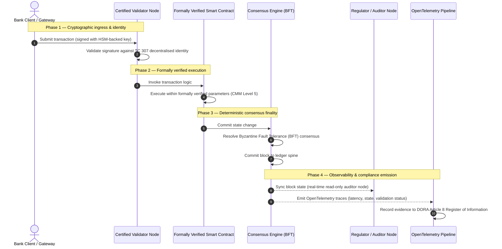

# प्रमाण से सत्य तक: क्यों प्रमाणित ब्लॉकचेन बैंकिंग विश्वास के अगले युग को परिभाषित करेंगे

## रणनीतिक सारांश (मुख्य बात)

थोक बैंकिंग और वैश्विक लेन-देन 2026 में एक ऐतिहासिक मोड़ पर हैं। जैसे-जैसे वित्तीय सेवाएँ मूलतः डिजिटल, रीयल-टाइम क्लियरिंग नेटवर्कों की ओर बढ़ रही हैं, और कृत्रिम बुद्धिमत्ता प्रायिकतावादी अनिश्चितता ला रही है, पारंपरिक एनालॉग, पूर्वव्यापी आश्वासन मॉडल (जैसे स्थिर, इकाई-आधारित ऑडिट) जोखिम प्रबंधन और प्रत्ययी कर्तव्यों की आधुनिक माँगों को पूरा नहीं कर पाते।

आईएसओ/आईईसी तकनीकी समिति TC 307 ने वितरित बहीखाता प्रौद्योगिकियों के लिए एक मानकीकृत आधार स्थापित किया है। हालाँकि, वास्तविक संस्थागत अपनाव के लिए वर्णनात्मक मार्गदर्शन से आदेशात्मक, स्वतंत्र रूप से प्रमाणित करने योग्य ब्लॉकचेन आश्वासन की ओर बढ़ना आवश्यक है। बही शासन, सर्वसम्मति की अखंडता, स्मार्ट अनुबंध सुरक्षा और क्रिप्टोग्राफिक चपलता को एक कठोर पाँच-स्तरीय क्षमता परिपक्वता मॉडल (CMM) के विरुद्ध अंक देकर, बैंक बिखरी हुई, विक्रेता-विशिष्ट मान्यताओं से प्रमाणित, बोर्ड-अंकेक्षणीय वित्तीय सत्य की ओर बढ़ सकते हैं।

## मुख्य निष्कर्ष

* **प्रत्ययी घर्षण अंतराल**: आज हम बैंक (Basel III), क्लाउड (ISO 27001) और एआई शासन प्रणालियों (ISO 42001) को प्रमाणित कर सकते हैं, परंतु अभी तक उस वितरित बही को प्रमाणित नहीं कर सकते जो तेज़ी से यह निर्धारित करती है कि सत्य क्या है। यह असममितता एक बड़ी परिचालन भेद्यता है।  
* **DORA प्रत्यक्ष प्रत्ययी उत्तरदायित्व लागू करता है**: DORA के अनुच्छेद 5 के तहत, बैंकों के निदेशक मंडल सभी तृतीय-पक्ष और बही परिनियोजनों की परिचालन प्रत्यास्थता के लिए प्रत्यक्ष, अप्रत्यायोज्य व्यक्तिगत उत्तरदायित्व वहन करते हैं, विफलताओं पर SM&CR व्यवस्था के तहत कठोर व्यक्तिगत दंड के साथ।  
* **एआई की अंकेक्षण रीढ़**: जहाँ मशीन लर्निंग अपुनरुत्पाद्य, प्रायिकतावादी परिणाम देती है, वहाँ प्रमाणित ब्लॉकचेन एक नियतात्मक अवस्था-अभिग्रहण प्रदान करता है। मॉडल संस्करणों, इनपुट और सत्यापन निर्णयों को शृंखला पर दर्ज करना ISO 42001 और मॉडल जोखिम प्रबंधन मानकों को संतुष्ट करता है।  
* **प्रमाणित ब्लॉकचेन सूचकांक**: यह सूचकांक शासन, सर्वसम्मति, स्मार्ट अनुबंध और अवलोकनीयता को 0 से 5 CMM पैमाने पर एक सत्यापन योग्य, अंकेक्षण-तैयार स्कोरकार्ड में औपचारिक बनाता है, जो अभियांत्रिकी मापदंडों को बोर्ड-अनुमोदित जोखिम अभिरुचि विवरणों में अनुवादित करता है।

## 01. डिजिटल बैंकिंग में प्रत्ययी घर्षण अंतराल

शास्त्रीय बैंकिंग में, विश्वास संबंधपरक, संस्थागत और पूर्वव्यापी होता है। यह स्वतंत्र, तृतीय-पक्ष अंकेक्षकों पर निर्भर करता है जो निश्चित समय-बिंदुओं पर वित्तीय स्थिति की समीक्षा करते हैं और द्विपक्षीय बही साइलो में विसंगतियों का मिलान करते हैं। 2026 के रीयल-टाइम, API-चालित बाज़ारों में, यह मॉडल निषेधात्मक विलंबता और संरचनात्मक जोखिम लाता है।

जब लेन-देन तत्काल निपटते हैं, अंतर्दैनिक तरलता पूल API गेटवे द्वारा गतिशील रूप से प्रबंधित होते हैं, और परिसंपत्ति स्वामित्व साझा बहियों पर टोकनीकृत होता है, तब पूर्वव्यापी ऑडिट निवारक नियंत्रणों के बजाय न्यायालयिक अभ्यास बन जाते हैं। प्रत्ययी अब केवल कानूनी इकाई के प्रमाणन पर निर्भर नहीं रह सकते। उन्हें डिजिटल आधार को ही प्रमाणित करना होगा।

वर्तमान में, बैंक एक स्पष्ट स्थापत्य असममितता के अंतर्गत काम करते हैं:

1. **प्रमाणित क्लाउड अवसंरचना**: हार्डवेयर नोड, वर्चुअलाइज़्ड कंटेनर और भौतिक डेटा केंद्र ISO/IEC 27001 और SOC 2 Type II नियंत्रणों के विरुद्ध मान्य किए जाते हैं।  
2. **प्रमाणित प्रबंधन प्रक्रियाएँ**: परिचालन जोखिम नीतियाँ, व्यवसाय निरंतरता योजनाएँ और एल्गोरिदमिक परिनियोजन कठोर जोखिम ढाँचों द्वारा शासित होते हैं।  
3. **अप्रमाणित बही इंजन**: वितरित सर्वसम्मति तंत्र, सत्यापनकर्ता नोड आपूर्ति शृंखलाएँ, स्मार्ट अनुबंध सीमाएँ और नेटवर्क शासन मॉडल अप्रमाणित, अनुकूलित या कंसोर्टियम-विशिष्ट मान्यताओं पर छोड़ दिए जाते हैं।

यह असममितता एक महत्वपूर्ण विफलता बिंदु है। एक बैंक एक सुरक्षित, ISO 27001-प्रमाणित क्लाउड कंटेनर के भीतर एक मान्य अनुप्रयोग चला सकता है, परंतु यदि वह कंटेनर केंद्रीकृत सत्यापनकर्ता नियंत्रण, भेद्य सर्वसम्मति मापदंडों या अनंकेक्षित स्मार्ट अनुबंधों वाली वितरित बही में लिखता है, तो लेन-देन की अखंडता समझौता हो जाती है। इस अंतराल को पाटने के लिए, बही इंजन को ही एक प्रमाणित करने योग्य आश्वासन वस्तु बनना होगा।

## 02. आईएसओ/आईईसी TC 307 मानकीकरण आधार

वितरित बहियों के मानकीकरण के लिए आवश्यक मूलभूत कार्य आईएसओ/आईईसी तकनीकी समिति TC 307 (ब्लॉकचेन और वितरित बहीखाता प्रौद्योगिकियाँ) द्वारा किया जा रहा है। ब्लॉकचेन को एक पृथक तकनीकी प्रोटोकॉल के रूप में मानने के बजाय, TC 307 इसे एक संस्थागत विश्वास अवसंरचना के रूप में देखता है, और अपने कार्य को पाँच मूल स्तंभों के इर्द-गिर्द व्यवस्थित करता है:

1. **वर्गीकरण एवं शब्दावली (ISO 22739)**: एक सामान्य नामकरण स्थापित करता है, जो विभिन्न अधिकार-क्षेत्रों, वित्तीय योजनाओं और संस्थानों में सुसंगत कानूनी एवं परिचालन परिभाषाएँ सुनिश्चित करता है।  
2. **संदर्भ स्थापत्य (ISO/TR 23245)**: एक अनुरूप वितरित बही प्रणाली की सीमाओं, परतों, डेटा प्रवाहों और कार्यात्मक घटकों को परिभाषित करता है।  
3. **सुरक्षा, गोपनीयता एवं स्मार्ट अनुबंध (ISO/TR 23244 / ISO 23613)**: डिजिटल परिसंपत्ति प्रणालियों के लिए आधारभूत सुरक्षा दिशानिर्देश स्थापित करता है और स्मार्ट अनुबंध भेद्यता शमन एवं जीवनचक्र शासन के लिए सर्वोत्तम प्रथाओं का विवरण देता है।  
4. **अंतरसंचालनीयता ढाँचे**: विषम बही नेटवर्कों के बीच डेटा एवं परिसंपत्ति-विनिमय तंत्रों को संबोधित करता है, और पृथक टोकनीकृत साइलो के निर्माण को रोकता है।  
5. **विकेंद्रीकृत पहचान एवं विश्वास लंगर**: बही-आधारित क्रिप्टोग्राफिक पहचानकर्ताओं को औपचारिक सार्वजनिक-कुंजी अवसंरचनाओं (PKI) और राज्य-प्राधिकृत रजिस्ट्रियों के साथ एकीकृत करता है।

सामूहिक रूप से, TC 307 DLT के एक अनुकूलित अभियांत्रिकी विकल्प से एक मानकीकृत स्थापत्य अनुशासन में संक्रमण का संकेत देता है। तथापि, TC 307 मुख्यतः वर्णनात्मक बना रहता है। यह परिभाषित करता है कि उत्कृष्टता कैसी दिखती है (मार्गदर्शन), परंतु वह आदेशात्मक सत्यापन प्रोटोकॉल (आश्वासन) प्रदान नहीं करता जिसकी जोखिम अधिकारियों और पर्यवेक्षकों को महत्वपूर्ण या आवश्यक कार्यों (CIF) के उत्पादन परिनियोजनों को प्राधिकृत करने के लिए आवश्यकता होती है।

## 03. मार्गदर्शन बनाम आश्वासन: प्रत्ययी भेद

वित्तीय बाज़ार सहभागी किसी प्रौद्योगिकी को इसलिए तैनात नहीं करते कि वह नवोन्मेषी या सुरुचिपूर्ण है; वे इसे तब तैनात करते हैं जब इसे शासित, अंकेक्षित, बचाव और पूँजी आरक्षित आवश्यकताओं के साथ मिलान किया जा सके। इसीलिए बैंकिंग में मानकीकरण स्वाभाविक रूप से दो परतों में विभाजित होता है:

* **मार्गदर्शन (ढाँचा)**: सर्वोत्तम प्रथाओं, संदर्भ लक्ष्यों और स्थापत्य दिशानिर्देशों की रूपरेखा देता है (जैसे ISO/IEC TC 307, NIST ढाँचे)।  
* **आश्वासन (प्रमाण)**: स्वतंत्र, सतत और तृतीय-पक्ष-सत्यापन योग्य साक्ष्य प्रदान करता है कि ढाँचा लागू है और डिज़ाइन के अनुसार काम कर रहा है (जैसे ISO 27001 प्रमाणन, SOC 2 ऑडिट, नियामक परीक्षण)।

क्लाउड अवसंरचना को प्रमाणित करते हुए अप्रमाणित बही सर्वसम्मति पर निर्भर रहना एक महत्वपूर्ण नियामक अंतराल है। एक "अपरिवर्तनीय" ब्लॉकचेन आवश्यक रूप से "संस्थागत रूप से विश्वसनीय" नहीं होता। अपरिवर्तनीयता केवल यह सुनिश्चित करती है कि दर्ज किया गया डेटा अपरिवर्तित रहे; यह सत्यापित नहीं करती कि सत्यापनकर्ता नोड सुरक्षित हैं, कि सर्वसम्मति प्रोटोकॉल मिलीभगत के प्रति प्रत्यास्थ है, कि स्मार्ट अनुबंध तर्क गणितीय रूप से सुदृढ़ है, या कि क्रिप्टोग्राफिक कुंजी प्रबंधन उत्तर-क्वांटम अधिदेशों का अनुपालन करता है।

इस अंतराल को बंद करने के लिए, 2026 प्रमाणित ब्लॉकचेन सूचकांक इन आवश्यकताओं को एक परिमेय क्षमता परिपक्वता मॉडल (CMM) में औपचारिक बनाता है, जो वैश्विक बैंकिंग विनियमों से मानचित्रित है।

## 04. 2026 प्रमाणित ब्लॉकचेन सूचकांक

वरिष्ठ प्रबंधन को अपनी बही प्लेटफ़ॉर्मों का मूल्यांकन और प्रमाणन करने में सक्षम बनाने के लिए, यह सूचकांक वितरित बही अवसंरचना को पाँच अंकेक्षणीय परिचालन परतों में संरचित करता है, जो 0 से 5 CMM पैमाने पर अंकित हैं।

## तालिका 1: प्रमाणित ब्लॉकचेन सूचकांक की स्थापत्य संरचना

| सूचकांक परत | परिपक्वता स्तर (CMM) | तकनीकी एवं परिचालन मापदंड | नियामक / प्रत्ययी नियंत्रण संदर्भ |
| ---- | ---- | ---- | ---- |
| **बही शासन** | **स्तर 0**: तदर्थ कंसोर्टियम**स्तर 3**: स्वचालित सत्यापनकर्ता जाँच एवं चक्रण**स्तर 5**: विकेंद्रीकृत, बहु-पक्षीय क्रिप्टोग्राफिक पहचान लंगरन | जाँचे गए वित्तीय संस्थाओं द्वारा संचालित सत्यापनकर्ता नोडों का %; सत्यापनकर्ता विवादों के समाधान का औसत समय; नोडों का भौगोलिक वितरण | **DORA अनुच्छेद 5** (शासन एवं संगठन); **CPMI-IOSCO PFMI सिद्धांत 2** (शासन) एवं **सिद्धांत 3** (जोखिमों के व्यापक प्रबंधन का ढाँचा) |
| **सर्वसम्मति अखंडता** | **स्तर 0**: एकल नोड या अपारदर्शी PoW**स्तर 3**: नियतात्मक अंतिमता के साथ अंकेक्षित BFT**स्तर 5**: सतत विलंबता निगरानी के साथ बहु-अधिकार-क्षेत्रीय, औपचारिक रूप से सत्यापित सर्वसम्मति | अधिकतम सहनीय सर्वसम्मति विलंबता; मिलीभगत-प्रतिरोध सीमा; अनुरूपित नोड विभाजन के तहत उपलब्धता SLA | **DORA अनुच्छेद 6** (ICT जोखिम प्रबंधन ढाँचा); **CPMI-IOSCO PFMI सिद्धांत 8** (निपटान अंतिमता) |
| **पहचान एवं क्रिप्टोग्राफी** | **स्तर 0**: कमज़ोर RSA / ECDSA कुंजियाँ**स्तर 3**: HSM-समर्थित कुंजी प्रबंधन के साथ बहु-हस्ताक्षर**स्तर 5**: क्वांटम-सुरक्षित संकर कुंजियाँ (FIPS 203 ML-KEM) एवं शून्य-ज्ञान गोपनीयता द्वार | HSM-समर्थित कुंजियों से हस्ताक्षरित बही लेन-देन का %; PQC प्रवास तत्परता अंक; ZK-प्रमाण विलंबता | **NIST FIPS 203 / 204**; **ISO/IEC 27001** (सूचना सुरक्षा प्रबंधन) |
| **स्मार्ट अनुबंध आश्वासन** | **स्तर 0**: अनंकेक्षित Solidity स्क्रिप्ट**स्तर 3**: स्वचालित संकलक सत्यापन एवं बाह्य अंकेक्षण**स्तर 5**: सर्किट-ब्रेकर उन्नयन के साथ औपचारिक रूप से सत्यापित, अपरिवर्तनीय स्मार्ट अनुबंध | गणितीय औपचारिक सत्यापन वाले स्मार्ट अनुबंधों का %; संकलक चेतावनियों की संख्या; भेद्यता स्कैन कवरेज | **आउटसोर्सिंग पर EBA दिशानिर्देश** (अनुच्छेद 81, 113-117); **DORA अनुच्छेद 30** (न्यूनतम संविदात्मक खंड) |
| **अंकेक्षण एवं अवलोकनीयता** | **स्तर 0**: मैनुअल लॉग संग्रहण**स्तर 3**: संरचित OTel ट्रेस एवं केवल-पठन अंकेक्षक नोड**स्तर 5**: अनुच्छेद 8 रजिस्टर के साथ स्वचालित, सतत मिलान | OpenTelemetry ट्रेस द्वारा कवर किए गए लेन-देन का %; ब्लॉक-प्रतिबद्धता से अंकेक्षक नोड सिंक्रनाइज़ेशन तक विलंबता | **BCBS 239** (जोखिम डेटा एकत्रीकरण); **DORA अनुच्छेद 8** (सूचना रजिस्टर / ITS स्कीमा) |

## तालिका 2: वैश्विक बैंकिंग मानकों से मानचित्रित प्रमुख विश्वास संकेत

| संकेत / मानदंड | मापदंड | बैंकिंग प्लेटफ़ॉर्मों पर प्रभाव | नियामक स्रोत |
| ---- | ---- | ---- | ---- |
| **ISO/IEC TC 307 प्रगति** | ISO/TR तकनीकी रिपोर्टों से औपचारिक प्रमाणन योजनाओं में संक्रमण | वितरित बही इंजनों के प्रमाणन के लिए पहला मानकीकृत ढाँचा स्थापित करता है | **ISO/IEC JTC 1 / SC 44** (वितरित बहीखाता प्रौद्योगिकियाँ) |
| **Agorá परियोजना प्रोटोटाइप चरण** | 40+ भागीदार वाणिज्यिक बैंक; टोकनीकृत जमाओं का एकीकृत बही परीक्षण | सीमा-पार क्लियरिंग को संदेशन (SWIFT) से परमाण्विक टोकनीकृत निपटान की ओर स्थानांतरित करता है | **अंतर्राष्ट्रीय निपटान बैंक (BIS) नवाचार केंद्र** |
| **DORA अनुच्छेद 30 तृतीय-पक्ष अंकेक्षण** | नोड प्रदाताओं एवं अवसंरचना होस्टों का 100% सुरक्षा मानदंडों पर अंकेक्षित | "छाया सत्यापनकर्ता नोडों" को समाप्त करता है; पूर्ण आपूर्ति-शृंखला पारदर्शिता अनिवार्य करता है | **यूरोपीय पर्यवेक्षी प्राधिकरण (ESA)** |
| **ISO/IEC 42001 (एआई शासन)** | एआई मॉडल एवं प्रशिक्षण लॉग शृंखला पर क्रिप्टोग्राफिक रूप से अपरिवर्तनीय बनाए गए | ब्लॉकचेन को मशीन लर्निंग के लिए अपरिवर्तनीय साक्ष्य रजिस्टर ("अंकेक्षण रीढ़") के रूप में नियोजित करता है | **ISO/IEC 42001:2023** (सूचना प्रौद्योगिकी — कृत्रिम बुद्धिमत्ता) |
| **Basel III पूँजी पर्याप्तता** | प्रलेखित जटिलता न्यूनीकरण के आधार पर परिचालन जोखिम पूँजी बफ़रों में कमी | मानकीकृत परिचालन जोखिम ढाँचे सत्यापित बही प्रत्यास्थता को सीधे श्रेय देते हैं | **बैंकिंग पर्यवेक्षण पर बासेल समिति (BCBS)** |

## 05. एआई की "अंकेक्षण रीढ़": नियतात्मक अवसंरचना पर प्रायिकतावादी बुद्धिमत्ता

2026 में प्रमाणित ब्लॉकचेन की सबसे शक्तिशाली रणनीतिक भूमिकाओं में से एक कृत्रिम बुद्धिमत्ता परिनियोजनों के लिए एक **"अंकेक्षण रीढ़"** के रूप में कार्य करना है। आधुनिक वित्तीय प्रणालियाँ तेज़ी से प्रायिकतावादी होती जा रही हैं। ऋण स्कोरिंग, रीयल-टाइम धोखाधड़ी पहचान, एल्गोरिदमिक व्यापार और स्वायत्त ग्राहक अंतःक्रियाएँ मशीन लर्निंग मॉडलों द्वारा संचालित होती हैं जो समय के साथ विकसित, विचलित और अनुकूलित होते हैं। ये मॉडल अनियतात्मक हैं: दो भिन्न समयों पर एक ही इनपुट के लिए, गतिशील भारों और सतत प्रशिक्षण के कारण वे भिन्न आउटपुट दे सकते हैं।

यह अनिश्चितता **ISO/IEC 42001 (एआई शासन)** और मॉडल जोखिम प्रबंधन (MRM) मानकों (जैसे **अमेरिकी फ़ेडरल रिज़र्व का SR 11-7** और **ब्रिटिश PRA का SS1/23**) के तहत एक गहन शासन चुनौती प्रस्तुत करती है: *आप उन निर्णयों को कैसे अंकेक्षित, स्पष्ट और बचाव करते हैं जो कठोरता से पुनरुत्पाद्य नहीं हैं?*

एक प्रमाणित वितरित बही नियतात्मक प्रतिभार प्रदान करती है। जहाँ एआई मॉडल प्रायिकतावादी ढंग से कार्य करते हैं, वहाँ प्रमाणित ब्लॉकचेन उनके मापदंडों को नियतात्मक रूप से दर्ज करता है, और एक अपरिवर्तनीय साक्ष्य रीढ़ स्थापित करता है:

* **मॉडल संस्करण एवं भार लंगरन**: प्रत्येक परिनियोजित मॉडल संस्करण, उसके संबद्ध भार और उसके प्रशिक्षण डेटा के चेकसम बिल्ड-समय पर हैश किए जाते हैं और बही में लिखे जाते हैं, जो **SLSA Level 3** आपूर्ति-शृंखला आवश्यकताओं को संतुष्ट करता है।  
* **प्रासंगिक इनपुट लॉगिंग**: जब कोई एआई मॉडल एक महत्वपूर्ण निर्णय निष्पादित करता है (जैसे ऋण अनुमोदन या लेन-देन को चिह्नित करना), तब सटीक प्रासंगिक इनपुट और मॉडल हैश बही में लिखे जाते हैं, जो छेड़छाड़-प्रतिरोधी इतिहास बनाते हैं।  
* **कोड पहुँच के बिना अंकेक्षणीयता**: यदि कोई नियामक पूछता है "आपके मॉडल ने 3 जून को इस ऋण आवेदन को क्यों अस्वीकार किया?", तो बैंक को न तो अपना स्वामित्व कोड प्रकट करना है और न ही सटीक मॉडल अवस्था को पुनः बनाने का प्रयास करना है। वह इनपुट, भार और सत्यापन अवस्था का क्रिप्टोग्राफिक रूप से हस्ताक्षरित, शृंखला-पर अभिलेख प्रस्तुत करता है।

मशीन लर्निंग मॉडलों के प्रायिकतावादी निर्णयों को एक प्रमाणित ब्लॉकचेन की नियतात्मक सर्वसम्मति में लंगर डालकर, संस्थान स्वचालित क्रियाओं की एक बचाव योग्य, पुनर्निर्माण योग्य और स्वतंत्र रूप से सत्यापन योग्य समयरेखा बनाता है।

## 06. प्रमाणित सर्वसम्मति-से-अंकेक्षण पाइपलाइन का दृश्यांकन

निम्नलिखित अनुक्रम आरेख एक प्रमाणित ब्लॉकचेन प्लेटफ़ॉर्म से गुज़रने वाले लेन-देन के जीवनचक्र को दर्शाता है, यह दिखाते हुए कि सत्यापन द्वार, सर्वसम्मति अखंडता, स्मार्ट अनुबंध निष्पादन और टेलीमेट्री उत्सर्जन कैसे परस्पर जुड़कर बोर्ड-तैयार नियामक साक्ष्य उत्पन्न करते हैं:

इस लेन-देन अनुक्रम का महत्वपूर्ण पथ अपेक्षा करता है कि प्रत्येक सत्यापन, निष्पादन और सर्वसम्मति चरण क्रिप्टोग्राफिक रूप से हस्ताक्षरित हो, जो अंत-से-अंत उद्गम सुनिश्चित करता है। नियामक का अंकेक्षक नोड ब्लॉक अवस्था को रीयल-टाइम में सिंक्रनाइज़ करता है, जिससे पूर्वव्यापी, मैनुअल वित्तीय मिलान की आवश्यकता समाप्त हो जाती है।

## 07. वरिष्ठ प्रबंधकों के लिए बोर्ड रूम पुस्तिका

संगठनात्मक विश्वास से अवसंरचनात्मक विश्वास तक के संक्रमण को सफलतापूर्वक पार करने के लिए, बैंक अधिकारियों और वरिष्ठ प्रबंधकों को तत्काल चार प्रमुख निर्देश निष्पादित करने चाहिए:

1. **उद्यम जोखिम प्रबंधन (ERM) में बही अंकेक्षण अनिवार्य करें**: एक नीति लागू करें जिसके अनुसार कोई भी वितरित बही प्लेटफ़ॉर्म — निजी, सार्वजनिक या कंसोर्टियम — पाँच-परत **प्रमाणित ब्लॉकचेन सूचकांक स्थापत्य** (न्यूनतम CMM स्तर 3) के विरुद्ध अंकेक्षित हुए बिना महत्वपूर्ण या आवश्यक कार्यों (CIF) के लिए तैनात न किया जाए।  
2. **ब्लॉकचेन को ISO 42001 एआई साक्ष्य रीढ़ के रूप में एकीकृत करें**: मुख्य जोखिम अधिकारी और प्रमुख एआई वास्तुकार को निर्देश दें कि वे सभी उच्च-प्रभाव मशीन लर्निंग मॉडलों को एक प्रमाणित ब्लॉकचेन के साथ एकीकृत करें, और मॉडल संस्करणों, भारों, इनपुट और निर्णयों का छेड़छाड़-प्रतिरोधी अंकेक्षण रजिस्टर बनाएँ।  
3. **सत्यापनकर्ता नोड आपूर्ति शृंखला का अंकेक्षण करें (DORA अनुच्छेद 30)**: क्रय प्रभाग से अपेक्षा करें कि वह सत्यापनकर्ता नोडों को होस्ट करने या DLT नेटवर्कों के लिए क्लाउड होस्टिंग प्रबंधित करने वाली सभी तृतीय-पक्ष संस्थाओं का अंकेक्षण करे, और बैंक के आंतरिक क्लाउड नोडों पर लागू समान साइबर सुरक्षा एवं परिचालन प्रत्यास्थता मानकों को अनिवार्य करे।  
4. **बही स्थापत्यों को CPMI-IOSCO एवं BCBS 239 के साथ संरेखित करें**: प्लेटफ़ॉर्म अभियांत्रिकी दल को निर्देश दें कि वह बही आउटपुट टेलीमेट्री को सीधे **BCBS 239** डेटा रिपोर्टिंग आवश्यकताओं के साथ संरेखित करे, और सुनिश्चित करे कि सर्वसम्मति एवं निपटान अंतिमता मापदंड **CPMI-IOSCO सिद्धांत 8 एवं 9** का कठोरता से अनुपालन करें।

## 08. अक्सर पूछे जाने वाले प्रश्न

**क्या ISO/IEC TC 307 एक प्रमाणन मानक है?**  
नहीं। ISO/IEC TC 307 एक तकनीकी समिति है जो शब्दावली, संदर्भ स्थापत्य और सुरक्षा दिशानिर्देश स्थापित करती है। यद्यपि यह परिभाषित करती है कि "उत्कृष्टता कैसी दिखती है" (मार्गदर्शन), उद्योग को बैंकिंग पर्यवेक्षकों को संतुष्ट करने के लिए इन दस्तावेज़ों को औपचारिक, अंकेक्षणीय प्रमाणन योजनाओं (आश्वासन) में परिचालित करना होगा।

**एक प्रमाणित ब्लॉकचेन DORA अनुपालन का समर्थन कैसे करता है?**  
DORA के अनुच्छेद 5 के तहत, बैंक बोर्ड प्रौद्योगिकीय प्रत्यास्थता के लिए प्रत्यक्ष व्यक्तिगत उत्तरदायित्व वहन करते हैं। एक प्रमाणित ब्लॉकचेन सर्वसम्मति अखंडता, सत्यापनकर्ता आपूर्ति-शृंखला नियंत्रण और स्मार्ट अनुबंध सुरक्षा का सत्यापन योग्य क्रिप्टोग्राफिक साक्ष्य प्रदान करता है, जो बोर्ड सदस्यों को SM&CR के तहत व्यक्तिगत उत्तरदायित्व दावों के विरुद्ध बचाव के लिए आवश्यक प्रलेखनीय "उचित कदम" देता है।

पारंपरिक बही अंकेक्षण और प्रमाणित ब्लॉकचेन अंकेक्षण में क्या अंतर है?  
एक पारंपरिक अंकेक्षण पूर्वव्यापी होता है: यह लेन-देन के निपटने के बाद मैनुअल प्रविष्टियों और स्थिर फ़ाइलों को सत्यापित करता है। एक प्रमाणित ब्लॉकचेन अंकेक्षण सतत और रीयल-टाइम होता है; सत्यापनकर्ता नोड, BFT सर्वसम्मति इंजन और औपचारिक रूप से सत्यापित स्मार्ट अनुबंध लेन-देन को नियतात्मक रूप से निष्पादित करने के लिए प्रमाणित होते हैं, जो संरचित टेलीमेट्री (OpenTelemetry) उत्सर्जित करते हैं जो प्रणाली के स्वास्थ्य को निरंतर सत्यापित करती है।

क्या सार्वजनिक ब्लॉकचेन को बैंकिंग उपयोग के लिए प्रमाणित किया जा सकता है?  
अधिकांश अधिकार-क्षेत्रों में, विशुद्ध रूप से अनुमति-रहित सार्वजनिक ब्लॉकचेन सत्यापनकर्ता पहचान सत्यापन के अभाव, अप्रत्याशित लेन-देन लागतों और अनियतात्मक अंतिमता (जैसे प्रायिकतावादी proof-of-work/stake फ़ोर्क) के कारण बैंकिंग विनियमों को संतुष्ट नहीं करते। बैंकिंग में प्रमाणित ब्लॉकचेन प्रायः उद्यम अनुमति-प्राप्त स्थापत्यों या कठोरता से विनियमित सार्वजनिक-संकर स्थापत्यों का उपयोग करते हैं, जहाँ सत्यापनकर्ता नोड संचालक पहचानी गई और अंकेक्षित वित्तीय संस्थाएँ होती हैं।

## 09. संदर्भ

* बैंकिंग पर्यवेक्षण पर बासेल समिति (BCBS), 2013. *Principles for effective risk data aggregation and reporting (BCBS 239)*. बासेल: अंतर्राष्ट्रीय निपटान बैंक। यहाँ उपलब्ध: [https://www.bis.org/publ/bcbs239.pdf](https://www.bis.org/publ/bcbs239.pdf)।  
* Committee on Payments and Market Infrastructures एवं Technical Committee of the International Organization of Securities Commissions (CPMI-IOSCO), 2012. *Principles for financial market infrastructures*. बासेल: अंतर्राष्ट्रीय निपटान बैंक। यहाँ उपलब्ध: [https://www.bis.org/cpmi/publ/d101a.pdf](https://www.bis.org/cpmi/publ/d101a.pdf)।  
* यूरोपीय बैंकिंग प्राधिकरण (EBA), 2019. *EBA/GL/2019/02 — Guidelines on outsourcing arrangements*. पेरिस: EBA। यहाँ उपलब्ध: [https://www.eba.europa.eu/regulation-and-policy/internal-governance/guidelines-on-outsourcing-arrangements](https://www.eba.europa.eu/regulation-and-policy/internal-governance/guidelines-on-outsourcing-arrangements)।  
* यूरोपीय संसद एवं यूरोपीय संघ परिषद, 2022. *वित्तीय क्षेत्र के लिए डिजिटल परिचालन प्रत्यास्थता पर विनियमन (EU) 2022/2554 (DORA)*. ब्रुसेल्स: यूरोपीय संघ का आधिकारिक जर्नल। यहाँ उपलब्ध: [https://eur-lex.europa.eu/legal-content/EN/TXT/?uri=CELEX%3A32022R2554](https://eur-lex.europa.eu/legal-content/EN/TXT/?uri=CELEX%3A32022R2554)।  
* ISO/IEC JTC 1/SC 42, 2023. *ISO/IEC 42001:2023 — Information technology — Artificial intelligence — Management system*. जिनेवा: अंतर्राष्ट्रीय मानकीकरण संगठन। यहाँ उपलब्ध: [https://www.iso.org/standard/81230.html](https://www.iso.org/standard/81230.html)।  
* तकनीकी समिति ISO/IEC 307, 2020. *ISO/IEC 22739:2020 — Blockchain and distributed ledger technologies — Vocabulary*. जिनेवा: अंतर्राष्ट्रीय मानकीकरण संगठन। यहाँ उपलब्ध: [https://www.iso.org/standard/73771.html](https://www.iso.org/standard/73771.html)।  
* National Institute of Standards and Technology (NIST), 2026. *First Three Finalized Post-Quantum Encryption Standards (FIPS 203, 204, and 205)*. गैदर्सबर्ग: U.S. Department of Commerce। यहाँ उपलब्ध: [https://www.nist.gov/news-events/news/2024/08/nist-releases-first-3-finalized-post-quantum-encryption-standards](https://www.nist.gov/news-events/news/2024/08/nist-releases-first-3-finalized-post-quantum-encryption-standards)।
