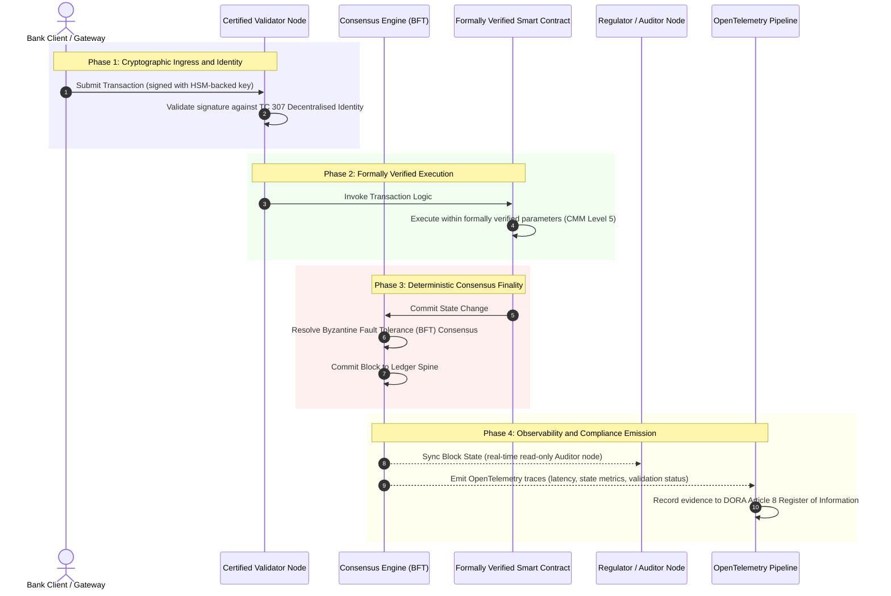

# साक्ष्य से सत्य तक: क्यों प्रमाणित ब्लॉकचेन बैंकिंग विश्वास के अगले युग को परिभाषित करेंगे

**अपरिवर्तनीय होना विश्वसनीय होने के समान नहीं है।** जैसे-जैसे थोक बैंकिंग वास्तविक-समय निपटान और प्रायिक AI की ओर बढ़ती है, वह बहीखाता जो तय करता है कि सत्य क्या है, वही एकमात्र परत बन गया है जिसे बैंक अब भी प्रमाणित नहीं कर सकते। वे Basel III के अंतर्गत संस्था को, ISO 27001 के अंतर्गत क्लाउड को और ISO 42001 के अंतर्गत अपने AI को प्रमाणित करते हैं, परंतु वितरित बहीखाता, उसका अभिशासन, सर्वसम्मति, क्रिप्टोग्राफी और स्मार्ट अनुबंध, विक्रेता-विशिष्ट अनुमान पर छोड़ दिए जाते हैं। यह रिपोर्ट तर्क देती है कि उस न्यासीय अंतराल को पाटने के लिए ISO/IEC TC 307 मार्गदर्शन से निर्देशात्मक आश्वासन की ओर बढ़ना आवश्यक है: बहीखाते को एक 5-स्तरीय प्रमाणित ब्लॉकचेन सूचकांक के विरुद्ध अंक देना जो इंजीनियरिंग मापदंडों को बोर्ड-ऑडिट-योग्य, DORA-रक्षणीय सत्य में बदल देता है।

<!-- lead-start -->
<aside class="post-lead" aria-label="लेख सारांश">

<strong>संक्षेप में।</strong> बैंक संस्था, क्लाउड और अपने AI को प्रमाणित करते हैं, पर उस बहीखाते को नहीं जो बढ़ते हुए तय करता है कि सत्य क्या है। ISO/IEC TC 307 मार्गदर्शन देता है, आश्वासन नहीं। एक 5-स्तरीय प्रमाणित ब्लॉकचेन सूचकांक बहीखाता अभिशासन, सर्वसम्मति अखंडता, पहचान और क्रिप्टोग्राफी, स्मार्ट-अनुबंध आश्वासन तथा अवलोकनीयता को एक क्षमता परिपक्वता मॉडल के विरुद्ध अंक देता है, जिससे न्यासीय अंतराल पटता है और प्रायिक AI को एक नियतात्मक ऑडिट रीढ़ मिलती है।

<strong>मुख्य निष्कर्ष</strong>

<ul class="post-lead-takeaways">
  <li><strong>न्यासीय घर्षणात्मक अंतराल।</strong> बैंक (Basel III), क्लाउड (ISO 27001) और AI अभिशासन प्रणाली (ISO 42001) प्रमाणित की जा सकती हैं; पर वह वितरित बहीखाता जो तय करता है कि सत्य क्या है, अभी तक नहीं। यह असममितता एक सक्रिय परिचालन भेद्यता है।</li>
  <li><strong>DORA इसे व्यक्तिगत बना देता है।</strong> DORA Article 5 के अंतर्गत, बैंक बोर्ड तृतीय-पक्ष और बहीखाता परिनियोजनों की सहनक्षमता के लिए प्रत्यक्ष, अप्रत्यायोज्य दायित्व वहन करते हैं, तथा विफलता पर SM&amp;CR व्यक्तिगत दंड लागू होते हैं।</li>
  <li><strong>AI ऑडिट रीढ़।</strong> मशीन लर्निंग गैर-पुनरुत्पादनीय है; एक प्रमाणित ब्लॉकचेन मॉडल संस्करणों, इनपुट और सत्यापन निर्णयों को नियतात्मक रूप से ऑन-चेन कैद करता है, जो ISO 42001 और मॉडल-जोखिम-प्रबंधन मानकों को संतुष्ट करता है।</li>
  <li><strong>प्रमाणित ब्लॉकचेन सूचकांक।</strong> अभिशासन, सर्वसम्मति, क्रिप्टोग्राफी, स्मार्ट अनुबंध और अवलोकनीयता एक 0-से-5 CMM स्कोरकार्ड बन जाते हैं जो इंजीनियरिंग मापदंडों को बोर्ड-अनुमोदित जोखिम रुचि विवरणों में अनूदित करता है।</li>
</ul>

<strong>संबंधित पठन:</strong> <a href="https://sebastienrousseau.com/2026-07-02-certified-blockchains-banking-trust-tc307-assurance-2026">प्रमाणित ब्लॉकचेन और बैंकिंग विश्वास: TC 307 आश्वासन</a>, <a href="https://sebastienrousseau.com/2026-07-24-global-payments-outlook-operating-model-risk-revenue">2026 वैश्विक भुगतान परिदृश्य</a>।

</aside>
<!-- lead-end -->

> **कार्यकारी सारांश**
>
> - **थोक बैंकिंग एक निर्णायक मोड़ पर है।** वास्तविक-समय समाशोधन और प्रायिक AI एनालॉग, पूर्वव्यापी आश्वासन मॉडल को तोड़ देते हैं: स्थैतिक, संस्था-आधारित ऑडिट अब आधुनिक जोखिम-प्रबंधन या न्यासीय माँगों को पूरा नहीं करते।
> - **TC 307 एक आधाररेखा है, प्रमाणपत्र नहीं।** ISO/IEC TC 307 ने वितरित बहीखातों के लिए शब्दावली, संदर्भ वास्तुकला और सुरक्षा मार्गदर्शन को मानकीकृत किया है, परंतु यह वर्णनात्मक है। यह परिभाषित करता है कि अच्छा कैसा दिखता है; यह वह निर्देशात्मक सत्यापन प्रदान नहीं करता जिसकी जोखिम अधिकारियों और पर्यवेक्षकों को उत्पादन परिनियोजन को अधिकृत करने के लिए आवश्यकता होती है।
> - **आश्वासन का अर्थ है बहीखाते को अंक देना।** अभिशासन, सर्वसम्मति अखंडता, स्मार्ट-अनुबंध सुरक्षा और क्रिप्टोग्राफिक चपलता को एक कठोर 5-स्तरीय क्षमता परिपक्वता मॉडल के विरुद्ध अंक देना बैंकों को पैबंद-दर-पैबंद, विक्रेता-विशिष्ट अनुमान से प्रमाणन-योग्य, बोर्ड-ऑडिट-योग्य वित्तीय सत्य की ओर ले जाता है।
> - **बहीखाता AI के लिए ऑडिट रीढ़ है।** मॉडल संस्करणों, इनपुट और सत्यापन निर्णयों को नियतात्मक सर्वसम्मति से आबद्ध करना गैर-पुनरुत्पादनीय मशीन लर्निंग को ISO 42001, SR 11-7 और PRA SS1/23 के अंतर्गत एक रक्षणीय, पुनर्निर्माण-योग्य साक्ष्यात्मक अभिलेख देता है।

## डिजिटल बैंकिंग में न्यासीय घर्षणात्मक अंतराल

पारंपरिक बैंकिंग में, विश्वास संबंधात्मक, संस्थागत और पूर्वव्यापी होता है। यह स्वतंत्र, तृतीय-पक्ष ऑडिटरों पर निर्भर करता है जो स्थैतिक समय-बिंदुओं पर वित्तीय स्थिति की समीक्षा करते हैं, तथा द्विपक्षीय बहीखाता कोष्ठकों में विसंगतियों का मिलान करते हैं। 2026 के वास्तविक-समय, API-चालित बाज़ारों में, यह मॉडल निषेधात्मक विलंबताओं और संरचनात्मक जोखिमों को जन्म देता है।

जब लेन-देन तत्काल निपटते हैं, अंतर्दिनी तरलता कोष API गेटवे द्वारा गतिशील रूप से प्रबंधित होते हैं, और परिसंपत्ति स्वामित्व साझा बहीखातों में टोकनीकृत होता है, तो पूर्वव्यापी ऑडिट निवारक नियंत्रण के बजाय न्यायालयिक अभ्यास बन जाते हैं। न्यासी अब केवल कॉर्पोरेट संस्था को प्रमाणित करने पर निर्भर नहीं रह सकते। उन्हें डिजिटल आधार को स्वयं प्रमाणित करना होगा।

वर्तमान में, बैंक एक स्पष्ट वास्तु-असममितता के अंतर्गत संचालित होते हैं:

1. **प्रमाणित क्लाउड अवसंरचना**: हार्डवेयर नोड, वर्चुअलीकृत कंटेनर और भौतिक डेटासेंटर ISO/IEC 27001 और SOC 2 Type II नियंत्रणों के विरुद्ध सत्यापित होते हैं।  
2. **प्रमाणित प्रबंधन प्रक्रियाएँ**: परिचालन जोखिम नीतियाँ, व्यवसाय निरंतरता योजनाएँ और एल्गोरिथमिक परिनियोजन कठोर जोखिम ढाँचों के अंतर्गत शासित होते हैं।  
3. **अप्रमाणित बहीखाता इंजन**: मूल वितरित सर्वसम्मति तंत्र, सत्यापनकर्ता नोड आपूर्ति श्रृंखलाएँ, स्मार्ट अनुबंध सीमाएँ और नेटवर्क अभिशासन मॉडल अप्रमाणित, अनुकूलित या संघ-विशिष्ट अनुमानों पर छोड़ दिए जाते हैं।

यह असममितता एक प्रमुख विफलता-बिंदु है। एक बैंक एक सुरक्षित, ISO 27001-प्रमाणित क्लाउड कंटेनर के भीतर एक सत्यापित अनुप्रयोग चला सकता है, परंतु यदि वह कंटेनर केंद्रीकृत सत्यापनकर्ता नियंत्रण, भेद्य सर्वसम्मति मापदंडों, या अन-ऑडिटेड स्मार्ट अनुबंधों वाले किसी वितरित बहीखाते में लिखता है, तो लेन-देन की अखंडता से समझौता हो जाता है। इस अंतराल को पाटने के लिए, बहीखाता इंजन को स्वयं एक प्रमाणन-योग्य आश्वासन वस्तु बनना होगा।

## ISO/IEC TC 307 मानकीकरण आधाररेखा

वितरित बहीखातों को मानकीकृत करने के लिए आवश्यक आधारभूत कार्य ISO/IEC तकनीकी समिति 307 (TC 307\) (ब्लॉकचेन और वितरित बहीखाता प्रौद्योगिकियाँ) द्वारा स्थापित किया जा रहा है। ब्लॉकचेन को एक पृथक तकनीकी प्रोटोकॉल के रूप में मानने के बजाय, TC 307 इसे एक संस्थागत विश्वास अवसंरचना के रूप में संबोधित करता है, तथा अपने कार्य को पाँच मूल स्तंभों में संगठित करता है:

1. **वर्गीकरण एवं शब्दावली (ISO 22739\)**: एक सामान्य नामकरण स्थापित करता है, जो विभिन्न अधिकार-क्षेत्रों, वित्तीय योजनाओं और संस्थाओं में सुसंगत कानूनी और परिचालन परिभाषाएँ सुनिश्चित करता है।  
2. **संदर्भ वास्तुकला (ISO/TR 23245\)**: एक अनुपालक वितरित बहीखाता प्रणाली की सीमाओं, परतों, डेटा प्रवाहों और कार्यात्मक घटकों को परिभाषित करता है।  
3. **सुरक्षा, गोपनीयता एवं स्मार्ट अनुबंध (ISO/TR 23244 / ISO 23613\)**: डिजिटल परिसंपत्ति प्रणालियों के लिए आधारभूत सुरक्षा दिशानिर्देश स्थापित करता है और स्मार्ट अनुबंध भेद्यता शमन तथा जीवनचक्र अभिशासन के लिए सर्वोत्तम अभ्यासों का विवरण देता है।  
4. **अंतर-संचालनीयता ढाँचे**: विषम बहीखाता नेटवर्कों के बीच डेटा और परिसंपत्ति-विनिमय तंत्रों को संबोधित करता है, जिससे पृथक टोकनीकृत कोष्ठकों का निर्माण रुकता है।  
5. **विकेंद्रीकृत पहचान एवं विश्वास एंकर**: बहीखाता-आधारित क्रिप्टोग्राफिक पहचानकर्ताओं को औपचारिक सार्वजनिक-कुंजी अवसंरचनाओं (PKI) और राज्य-अधिकृत रजिस्टरों के साथ एकीकृत करता है।

सामूहिक रूप से, TC 307 DLT के एक अनुकूलित इंजीनियरिंग विकल्प से एक मानकीकृत वास्तु-अनुशासन में संक्रमण का संकेत देता है। हालाँकि, TC 307 मुख्यतः वर्णनात्मक बना हुआ है। यह परिभाषित करता है कि अच्छा कैसा दिखता है (मार्गदर्शन), परंतु यह वह निर्देशात्मक सत्यापन प्रोटोकॉल (आश्वासन) प्रदान नहीं करता जिसकी जोखिम अधिकारियों और पर्यवेक्षकों को महत्वपूर्ण या आवश्यक कार्यों (CIFs) के उत्पादन परिनियोजनों को अधिकृत करने के लिए आवश्यकता होती है।

## मार्गदर्शन बनाम आश्वासन: न्यासीय भेद

वित्तीय बाज़ार सहभागी प्रौद्योगिकी को इसलिए नहीं अपनाते कि वह नवोन्मेषी या सुरुचिपूर्ण है; वे इसे तब अपनाते हैं जब इसे शासित, ऑडिट, बचाव और पूँजी आरक्षित आवश्यकताओं के साथ समाधानित किया जा सके। यही कारण है कि बैंकिंग में मानकीकरण स्वाभाविक रूप से दो परतों में विभाजित होता है:

* **मार्गदर्शन (ढाँचा)**: सर्वोत्तम अभ्यासों, संदर्भ लक्ष्यों और वास्तु-दिशानिर्देशों की रूपरेखा देता है (जैसे, ISO/IEC TC 307, NIST ढाँचे)।  
* **आश्वासन (प्रमाण)**: स्वतंत्र, सतत और तृतीय-पक्ष-सत्यापन-योग्य साक्ष्य प्रदान करता है कि ढाँचा कार्यान्वित है और अभिकल्पित रूप से संचालित हो रहा है (जैसे, ISO 27001 प्रमाणन, SOC 2 ऑडिट, नियामक परीक्षाएँ)।

क्लाउड अवसंरचना को प्रमाणित करते हुए अप्रमाणित बहीखाता सर्वसम्मति पर निर्भर रहना एक गंभीर नियामक अंतराल है। एक ब्लॉकचेन जो "अपरिवर्तनीय" है, वह आवश्यक रूप से "संस्थागत रूप से विश्वसनीय" नहीं है। अपरिवर्तनीयता केवल इस बात की गारंटी देती है कि दर्ज किया गया डेटा अपरिवर्तित है; यह सत्यापित नहीं करती कि सत्यापनकर्ता नोड सुरक्षित हैं, सर्वसम्मति प्रोटोकॉल मिलीभगत के विरुद्ध सहनक्षम है, स्मार्ट अनुबंध तर्क गणितीय रूप से सुदृढ़ है, या क्रिप्टोग्राफिक कुंजी प्रबंधन उत्तर-क्वांटम अधिदेशों का अनुपालन करता है।

इस अंतराल को पाटने के लिए, 2026 प्रमाणित ब्लॉकचेन सूचकांक इन आवश्यकताओं को वैश्विक बैंकिंग विनियमों से मानचित्रित एक परिमाण-योग्य क्षमता परिपक्वता मॉडल (CMM) में औपचारिक रूप देता है।

## 2026 प्रमाणित ब्लॉकचेन सूचकांक

वरिष्ठ प्रबंधन को अपने बहीखाता प्लेटफ़ॉर्मों का मूल्यांकन और प्रमाणन करने में सक्षम बनाने के लिए, यह सूचकांक वितरित बहीखाता अवसंरचना को पाँच ऑडिट-योग्य परिचालन परतों में संरचित करता है, जिन्हें 0-से-5 CMM पैमाने पर अंक दिए जाते हैं।

### तालिका 1: प्रमाणित ब्लॉकचेन सूचकांक वास्तुकला

| सूचकांक परत | क्षमता परिपक्वता स्तर (CMM) | तकनीकी एवं परिचालन मापदंड | नियामक / न्यासीय नियंत्रण संदर्भ |
| ---- | ---- | ---- | ---- |
| **बहीखाता अभिशासन** | **Level 0**: तदर्थ संघ**Level 3**: स्वचालित सत्यापनकर्ता जाँच एवं आवर्तन**Level 5**: विकेंद्रीकृत, बहु-पक्षीय क्रिप्टोग्राफिक पहचान आबद्धन | सत्यापित वित्तीय संस्थाओं द्वारा संचालित सत्यापनकर्ता नोडों का %; सत्यापनकर्ता विवादों को हल करने का औसत समय; नोडों का भौगोलिक वितरण | **DORA Article 5** (अभिशासन एवं संगठन); **CPMI-IOSCO PFMI Principle 2** (अभिशासन) एवं **Principle 3** (जोखिमों के व्यापक प्रबंधन के लिए ढाँचा) |
| **सर्वसम्मति अखंडता** | **Level 0**: एकल-नोड या अपारदर्शी POW**Level 3**: नियतात्मक अंतिमता के साथ ऑडिटेड BFT**Level 5**: बहु-अधिकार-क्षेत्रीय, औपचारिक रूप से सत्यापित सर्वसम्मति के साथ सतत विलंबता निगरानी | अधिकतम सह्य सर्वसम्मति विलंबता; मिलीभगत-प्रतिरोध सीमा; अनुरूपित नोड विभाजन के अंतर्गत अपटाइम SLA | **DORA Article 6** (ICT जोखिम प्रबंधन ढाँचा); **CPMI-IOSCO PFMI Principle 8** (निपटान अंतिमता) |
| **पहचान एवं क्रिप्टोग्राफी** | **Level 0**: कमज़ोर RSA / ECDSA कुंजियाँ**Level 3**: HSM-समर्थित कुंजी प्रबंधन के साथ मल्टी-सिग**Level 5**: क्वांटम-सुरक्षित संकर कुंजियाँ (FIPS 203 ML-KEM) और शून्य-ज्ञान गोपनीयता द्वार | HSM-समर्थित कुंजियों से हस्ताक्षरित बहीखाता लेन-देन का %; PQC प्रवासन तैयारी अंक; ZK-प्रमाण विलंबता | **NIST FIPS 203 / 204**; **ISO/IEC 27001** (सूचना सुरक्षा प्रबंधन) |
| **स्मार्ट अनुबंध आश्वासन** | **Level 0**: अन-ऑडिटेड solidity स्क्रिप्ट**Level 3**: स्वचालित संकलक सत्यापन एवं बाह्य ऑडिट**Level 5**: औपचारिक रूप से सत्यापित, अपरिवर्तनीय स्मार्ट अनुबंध सर्किट-ब्रेकर उन्नयनों के साथ | गणितीय औपचारिक सत्यापन वाले स्मार्ट अनुबंधों का %; संकलक चेतावनियों की गणना; भेद्यता स्कैन कवरेज | **EBA आउटसोर्सिंग व्यवस्था दिशानिर्देश** (पैराग्राफ 81, 113-117); **DORA Article 30** (न्यूनतम संविदात्मक धाराएँ) |
| **ऑडिट एवं अवलोकनीयता** | **Level 0**: मैनुअल लॉग स्क्रैपिंग**Level 3**: संरचित OTel ट्रेस एवं केवल-पठन ऑडिटर नोड**Level 5**: Article 8 रजिस्टर के लिए स्वचालित, सतत मिलान | OpenTelemetry ट्रेस द्वारा कवर किए गए लेन-देन का %; बहीखाता ब्लॉक-कमिट से ऑडिटर-नोड सिंक तक विलंबता | **BCBS 239** (जोखिम डेटा समुच्चयन); **DORA Article 8** (सूचना का रजिस्टर / ITS स्कीमा) |

### तालिका 2: वैश्विक बैंकिंग मानकों से मानचित्रित प्रमुख विश्वास संकेत

| संकेत / बेंचमार्क | मापदंड | बैंकिंग प्लेटफ़ॉर्मों पर प्रभाव | नियामक स्रोत |
| ---- | ---- | ---- | ---- |
| **ISO/IEC TC 307 प्रगति** | ISO/TR तकनीकी रिपोर्टों से औपचारिक प्रमाणन योजनाओं की ओर संक्रमण | वितरित बहीखाता इंजनों को प्रमाणित करने के लिए पहला मानकीकृत ढाँचा स्थापित करता है | **ISO/IEC JTC 1 / SC 44** (वितरित बहीखाता प्रौद्योगिकियाँ) |
| **Project Agorá प्रोटोटाइप चरण** | 40+ सहभागी वाणिज्यिक बैंक; टोकनीकृत जमाओं का एकीकृत बहीखाता परीक्षण | सीमा-पार समाशोधन को संदेश-आधारन (SWIFT) से आणविक टोकनीकृत निपटान की ओर स्थानांतरित करना | **Bank for International Settlements (BIS) Innovation Hub** |
| **DORA Article 30 तृतीय-पक्ष ऑडिट** | सुरक्षा मानदंडों के विरुद्ध 100% नोड प्रदाताओं और अवसंरचना होस्टों का ऑडिट | "छाया सत्यापनकर्ता नोडों" को समाप्त करता है; पूर्ण आपूर्ति-श्रृंखला पारदर्शिता अनिवार्य करता है | **European Supervisory Authorities (ESA)** |
| **ISO/IEC 42001 (AI अभिशासन)** | क्रिप्टोग्राफिक रूप से अपरिवर्तनीय किए गए AI मॉडल और प्रशिक्षण लॉग ऑन-चेन | मशीन लर्निंग के लिए ब्लॉकचेन को अपरिवर्तनीय साक्ष्यात्मक बहीखाते ("ऑडिट रीढ़") के रूप में नियोजित करता है | **ISO/IEC 42001:2023** (सूचना प्रौद्योगिकी, कृत्रिम बुद्धिमत्ता) |
| **Basel III पूँजी पर्याप्तता** | प्रलेखित जटिलता-न्यूनीकरण के आधार पर परिचालन जोखिम पूँजी बफ़र में कमी | मानकीकृत परिचालन जोखिम ढाँचे सत्यापित बहीखाता सहनक्षमता का प्रत्यक्ष श्रेय देते हैं | **Basel Committee on Banking Supervision (BCBS)** |

## AI "ऑडिट रीढ़": नियतात्मक अवसंरचना पर प्रायिक बुद्धिमत्ता

2026 में एक प्रमाणित ब्लॉकचेन की सबसे शक्तिशाली रणनीतिक भूमिकाओं में से एक कृत्रिम बुद्धिमत्ता परिनियोजनों के लिए एक **"ऑडिट रीढ़"** के रूप में कार्य करना है। आधुनिक वित्तीय प्रणालियाँ बढ़ते हुए प्रायिक होती जा रही हैं। ऋण अंकन, वास्तविक-समय धोखाधड़ी पहचान, एल्गोरिथमिक ट्रेडिंग और स्वायत्त ग्राहक अंतःक्रियाएँ मशीन लर्निंग मॉडलों द्वारा संचालित होती हैं जो समय के साथ विकसित होते, बहकते और अनुकूलित होते हैं। ये मॉडल गैर-नियतात्मक हैं: दो भिन्न समयों पर समान इनपुट दिए जाने पर, गतिशील भारों और सतत प्रशिक्षण के कारण वे भिन्न आउटपुट दे सकते हैं।

यह गैर-नियतात्मकता **ISO/IEC 42001 (AI अभिशासन)** और **मॉडल जोखिम प्रबंधन (MRM)** मानकों (जैसे **US Federal Reserve SR 11-7** और **UK PRA SS1/23**) के अंतर्गत एक गहन अभिशासन चुनौती प्रस्तुत करती है: *आप ऐसे निर्णयों का ऑडिट, व्याख्या और बचाव कैसे करते हैं जो सख्ती से पुनरुत्पादनीय नहीं हैं?*

एक प्रमाणित वितरित बहीखाता नियतात्मक प्रतिभार प्रदान करता है। जबकि AI मॉडल प्रायिक रूप से संचालित होते हैं, प्रमाणित ब्लॉकचेन उनके मापदंडों को नियतात्मक रूप से अभिलिखित करता है, जिससे एक अपरिवर्त्य साक्ष्यात्मक रीढ़ स्थापित होती है:

* **मॉडल संस्करणन एवं भार आबद्धन**: प्रत्येक परिनियोजित मॉडल संस्करण, उससे संबद्ध भार, और उसके प्रशिक्षण डेटा चेकसम को बिल्ड-टाइम पर हैश करके बहीखाते में लिखा जाता है, जो **SLSA Level 3** आपूर्ति-श्रृंखला आवश्यकताओं को संतुष्ट करता है।  
* **प्रासंगिक इनपुट लॉगिंग**: जब एक AI मॉडल एक महत्वपूर्ण निर्णय निष्पादित करता है (जैसे, ऋण को स्वीकृत करना या लेन-देन को चिह्नित करना), तो सटीक प्रासंगिक इनपुट और मॉडल हैश बहीखाते में लिखे जाते हैं, जिससे एक छेड़छाड़-प्रमाणी इतिहास बनता है।  
* **कोड पहुँच के बिना ऑडिट-योग्यता**: यदि कोई नियामक पूछता है, "आपके मॉडल ने 3 जून को इस ऋण आवेदन को क्यों अस्वीकार किया?" तो बैंक को स्वामित्व कोड उजागर करने या सटीक मॉडल स्थिति को पुनःसृजित करने का प्रयास करने की आवश्यकता नहीं होती। वह इनपुट, भार और सत्यापन स्थिति का क्रिप्टोग्राफिक रूप से हस्ताक्षरित, ऑन-चेन बहीखाता अभिलेख प्रस्तुत करता है।

मशीन लर्निंग मॉडलों के प्रायिक निर्णयों को एक प्रमाणित ब्लॉकचेन की नियतात्मक सर्वसम्मति से आबद्ध करके, संस्था स्वचालित कार्यों की एक रक्षणीय, पुनर्निर्माण-योग्य और स्वतंत्र रूप से सत्यापन-योग्य समयरेखा बनाती है।

## प्रमाणित सर्वसम्मति-से-ऑडिट पाइपलाइन का दृश्यीकरण

निम्नलिखित अनुक्रम आरेख एक प्रमाणित ब्लॉकचेन प्लेटफ़ॉर्म से गुज़रते हुए एक लेन-देन के जीवनचक्र को दर्शाता है, जो प्रदर्शित करता है कि कैसे सत्यापन द्वार, सर्वसम्मति अखंडता, स्मार्ट अनुबंध निष्पादन और टेलीमेट्री उत्सर्जन आपस में जुड़कर बोर्ड-तैयार नियामक साक्ष्य उत्पन्न करते हैं:

इस लेन-देन अनुक्रम का महत्वपूर्ण मार्ग अपेक्षित करता है कि प्रत्येक सत्यापन, निष्पादन और सर्वसम्मति चरण क्रिप्टोग्राफिक रूप से हस्ताक्षरित हो, जिससे आद्योपांत उद्गम सुनिश्चित हो। नियामक का ऑडिटर नोड वास्तविक-समय में ब्लॉक स्थिति को समकालित करता है, जिससे पूर्वव्यापी, मैनुअल वित्तीय मिलान की आवश्यकता समाप्त हो जाती है।

## वरिष्ठ प्रबंधकों के लिए बोर्डरूम कार्यनीति

संगठनात्मक विश्वास से अवसंरचनात्मक विश्वास की ओर बदलाव को सफलतापूर्वक प्रबंधित करने के लिए, बैंक कार्यपालकों और वरिष्ठ प्रबंधकों को तुरंत चार प्रमुख निर्देशों को निष्पादित करना चाहिए:

1. **उद्यम जोखिम प्रबंधन (ERM) में बहीखाता ऑडिट अनिवार्य करें**: एक नीति लागू करें कि कोई भी वितरित बहीखाता प्लेटफ़ॉर्म, चाहे वह निजी, सार्वजनिक या संघ-आधारित हो, महत्वपूर्ण या आवश्यक कार्यों (CIFs) के लिए तब तक परिनियोजित न किया जाए जब तक उसे 5-परत **प्रमाणित ब्लॉकचेन सूचकांक वास्तुकला** (न्यूनतम CMM Level 3) के विरुद्ध ऑडिट न किया गया हो।  
2. **ब्लॉकचेन को ISO 42001 AI साक्ष्यात्मक रीढ़ के रूप में एकीकृत करें**: मुख्य जोखिम अधिकारी और प्रमुख AI वास्तुकार को निर्देश दें कि वे सभी उच्च-प्रभाव मशीन लर्निंग मॉडलों को एक प्रमाणित ब्लॉकचेन के साथ एकीकृत करें, जिससे मॉडल संस्करणों, भारों, इनपुट और निर्णयों का एक छेड़छाड़-प्रमाणी ऑडिट बहीखाता बने।  
3. **सत्यापनकर्ता नोड आपूर्ति श्रृंखला का ऑडिट करें (DORA Article 30\)**: क्रय प्रभाग से अपेक्षा करें कि वह सत्यापनकर्ता नोडों की मेज़बानी करने वाली या DLT नेटवर्कों के लिए क्लाउड होस्टिंग का प्रबंधन करने वाली सभी तृतीय-पक्ष संस्थाओं का ऑडिट करे, तथा उन्हीं साइबर सुरक्षा और परिचालन सहनक्षमता मानकों के अनुपालन को अनिवार्य करे जो बैंक के आंतरिक क्लाउड नोडों पर लागू होते हैं।  
4. **बहीखाता वास्तुकलाओं को CPMI-IOSCO और BCBS 239 के साथ संरेखित करें**: प्लेटफ़ॉर्म इंजीनियरिंग टीम को निर्देश दें कि वे बहीखाता आउटपुट टेलीमेट्री को सीधे **BCBS 239** डेटा रिपोर्टिंग आवश्यकताओं के साथ संरेखित करें, और सुनिश्चित करें कि सर्वसम्मति और निपटान अंतिमता मापदंड **CPMI-IOSCO Principles 8 और 9** का कड़ाई से अनुपालन करते हों।

## अक्सर पूछे जाने वाले प्रश्न

**क्या ISO/IEC TC 307 एक प्रमाणन मानक है?**  
नहीं। ISO/IEC TC 307 एक तकनीकी समिति है जो शब्दावली, संदर्भ वास्तुकलाएँ और सुरक्षा दिशानिर्देश स्थापित करती है। यद्यपि यह परिभाषित करती है कि "अच्छा कैसा दिखता है" (मार्गदर्शन), उद्योग को बैंकिंग पर्यवेक्षकों को संतुष्ट करने के लिए इन दस्तावेज़ों को औपचारिक, ऑडिट-योग्य प्रमाणन योजनाओं (आश्वासन) में परिचालित करना होगा।

**एक प्रमाणित ब्लॉकचेन DORA अनुपालन में कैसे सहायता करता है?**  
DORA Article 5 के अंतर्गत, बैंक बोर्ड प्रौद्योगिकी सहनक्षमता के लिए प्रत्यक्ष, व्यक्तिगत दायित्व वहन करते हैं। एक प्रमाणित ब्लॉकचेन सर्वसम्मति अखंडता, सत्यापनकर्ता आपूर्ति-श्रृंखला नियंत्रण और स्मार्ट अनुबंध सुरक्षा का सत्यापन-योग्य, क्रिप्टोग्राफिक साक्ष्य प्रदान करता है, जिससे बोर्ड सदस्यों को SM\&CR व्यक्तिगत दायित्व दावों के विरुद्ध बचाव के लिए आवश्यक प्रलेखनीय "उचित कदम" मिलते हैं।

**पारंपरिक बहीखाता ऑडिट और प्रमाणित ब्लॉकचेन ऑडिट में क्या अंतर है?**  
एक पारंपरिक ऑडिट पूर्वव्यापी होता है, जो लेन-देन के निपट जाने के बाद मैनुअल प्रविष्टियों और स्थैतिक फ़ाइलों को सत्यापित करता है। एक प्रमाणित ब्लॉकचेन ऑडिट सतत और वास्तविक-समय का होता है; सत्यापनकर्ता नोड, BFT सर्वसम्मति इंजन और औपचारिक रूप से सत्यापित स्मार्ट अनुबंध लेन-देन को नियतात्मक रूप से निष्पादित करने के लिए प्रमाणित होते हैं, तथा संरचित टेलीमेट्री (OpenTelemetry) उत्सर्जित करते हैं जो प्रणाली के स्वास्थ्य को सतत सत्यापित करती है।

**क्या सार्वजनिक ब्लॉकचेन को बैंकिंग उपयोग के लिए प्रमाणित किया जा सकता है?**  
अधिकांश अधिकार-क्षेत्रों में, शुद्ध अनुमति-रहित सार्वजनिक ब्लॉकचेन सत्यापनकर्ता पहचान सत्यापन की कमी, अप्रत्याशित गैस/लेन-देन लागतों, और गैर-नियतात्मक अंतिमता (जैसे, प्रायिक proof-of-work/stake शाखाओं) के कारण बैंकिंग विनियमों को संतुष्ट करने में विफल रहते हैं। बैंकिंग में प्रमाणित ब्लॉकचेन आमतौर पर उद्यम अनुमति-प्राप्त या अत्यधिक विनियमित सार्वजनिक-संकर वास्तुकलाओं का उपयोग करते हैं जहाँ सत्यापनकर्ता नोड संचालक पहचानी गई और ऑडिट की गई वित्तीय संस्थाएँ होती हैं।

## संदर्भ

* Basel Committee on Banking Supervision (BCBS), 2013\. *Principles for effective risk data aggregation and reporting (BCBS 239\)*. Basel: Bank for International Settlements. Available at: [Basel Committee on Banking Supervision (BCBS), 2013\.](https://www.bis.org/publ/bcbs239.pdf "Basel Committee on Banking Supervision (BCBS), 2013\.").  
* Committee on Payments and Market Infrastructures and Technical Committee of the International Organisation of Securities Commissions (CPMI-IOSCO), 2012\. *Principles for financial market infrastructures*. Basel: Bank for International Settlements. Available at: [Committee on Payments and Market Infrastructures and Technical Committee of the International Organisation of Securities Commissions (CPMI-IOSCO), 2012\.](https://www.bis.org/cpmi/publ/d101a.pdf "Committee on Payments and Market Infrastructures and Technical Committee of the International Organisation of Securities Commissions (CPMI-IOSCO), 2012\.").  
* European Banking Authority (EBA), 2019\. *EBA/GL/2019/02, Guidelines on outsourcing arrangements*. Paris: EBA. Available at: [European Banking Authority (EBA), 2019\.](https://www.eba.europa.eu/regulation-and-policy/internal-governance/guidelines-on-outsourcing-arrangements "European Banking Authority (EBA), 2019\.").  
* European Parliament and Council of the European Union, 2022\. *Regulation (EU) 2022/2554 on digital operational resilience for the financial sector (DORA)*. Brussels: Official Journal of the European Union. Available at: [European Parliament and Council of the European Union, 2022\.](https://eur-lex.europa.eu/legal-content/EN/TXT/?uri=CELEX%3A32022R2554 "European Parliament and Council of the European Union, 2022\.").  
* ISO/IEC JTC 1/SC 42, 2023\. *ISO/IEC 42001:2023, Information technology, Artificial intelligence, Management system*. Geneva: International Organisation for Standardisation. Available at: [ISO/IEC JTC 1/SC 42, 2023\.](https://www.iso.org/standard/81230.html "ISO/IEC JTC 1/SC 42, 2023\.").  
* ISO/IEC Technical Committee 307, 2020\. *ISO/IEC 22739:2020, Blockchain and distributed ledger technologies, Vocabulary*. Geneva: International Organisation for Standardisation. Available at: [ISO/IEC Technical Committee 307, 2020\.](https://www.iso.org/standard/73771.html "ISO/IEC Technical Committee 307, 2020\.").  
* National Institute of Standards and Technology (NIST), 2026\. *First Three Finalised Post-Quantum Encryption Standards (FIPS 203, 204, and 205\)*. Gaithersburg: U.S. Department of Commerce. Available at: [National Institute of Standards and Technology (NIST), 2026\.](https://www.nist.gov/news-events/news/2024/08/nist-releases-first-3-finalised-post-quantum-encryption-standards "National Institute of Standards and Technology (NIST), 2026\.").
