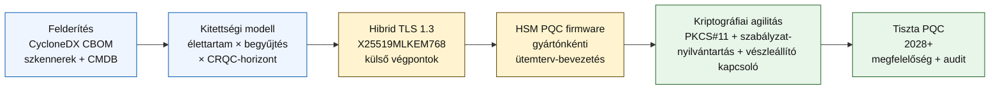

## A kvantumbiztos banki index 2026-ban: poszt-kvantum kriptográfia, QKD, kriptográfiai agilitás és a most-begyűjt-később-visszafejt kockázat

A kvantumbiztos banki működés 2026-ban az operatív migrációról szól, nem a spekulációról. A NIST véglegesítette az első három poszt-kvantum kriptográfiai szabványt, és a bankoknak most meg kell érteniük, hogy mely rendszerek függenek az RSA-tól, az ECC-től, a TLS-től, az aláírásoktól, a HSM-ektől, a tanúsítványoktól, a fizetési csatornáktól, az archívumoktól és a hosszú élettartamú bizalmas adatoktól. Az index kérdése egyszerű: le tudja-e cserélni az intézmény a kriptográfiát, mielőtt a fenyegetés operatívvá válik?

---

> **Vezetői összefoglaló / Legfontosabb tanulságok**
>
> - **A NIST-szabványok immár konkrétak.** A FIPS 203 az ML-KEM-et határozza meg a kulcskapszulázáshoz, a FIPS 204 az ML-DSA-t az aláírásokhoz, a FIPS 205 pedig az SLH-DSA-t állapotmentes, hash-alapú aláírási szabványként.
> - **A leltár az első érettségi kapu.** A bank nem tudja migrálni azt, amit nem talál meg: a tanúsítványokat, kulcsokat, protokollokat, alkalmazásokat, gyártókat, HSM-eket, API-kat, archívumokat és beágyazott rendszereket fel kell térképezni.
> - **A kriptográfiai agilitás a tartós célkitűzés.** A cél nem egyszeri algoritmuscsere, hanem az a képesség, hogy a kriptográfiai primitíveket egész alkalmazások újratervezése nélkül lehessen megváltoztatni.
> - **A hosszú élettartamú adatok megváltoztatják a sürgősséget.** A most-begyűjt-később-visszafejt kockázat azt jelenti, hogy a ma begyűjtött adatok később olvashatóvá válhatnak, ha elég sokáig értékesek maradnak.
> - **A [QKD](/2023-12-11-quantum-key-distribution-revolutionising-security-in-banking/index.html) egy speciális kiegészítő.** A kvantumkulcs-elosztás a legnagyobb értékű csatornák esetében lehet releváns, de nem helyettesíti az intézményi szintű PQC-migrációt.
>
---

## Miért 2026 az az év, amikor ez az index számít

Három elmozdulás 2024-2025-ben a kvantumbiztonságot kutatási megfigyelési pontból mérhető banki programmá tette. Először, a NIST 2024. augusztus 13-án véglegesítette az elsődleges poszt-kvantum szabványokat: [FIPS 203 (ML-KEM) ⧉](https://nvlpubs.nist.gov/nistpubs/FIPS/NIST.FIPS.203.pdf "FIPS 203: modulrács-alapú kulcskapszulázási mechanizmus"), [FIPS 204 (ML-DSA) ⧉](https://nvlpubs.nist.gov/nistpubs/FIPS/NIST.FIPS.204.pdf "FIPS 204: modulrács-alapú digitális aláírási szabvány"), [FIPS 205 (SLH-DSA) ⧉](https://nvlpubs.nist.gov/nistpubs/FIPS/NIST.FIPS.205.pdf "FIPS 205: állapotmentes, hash-alapú digitális aláírási szabvány"). Az algoritmusválasztási vita azon a napon lezárult; azok a bankok, amelyek 2026-ban még mindig belső, "melyik séma nyer" munkafolyamatokat futtatnak, 18 hónapos lemaradásban vannak.

Másodszor, az [NSA CNSA 2.0 ⧉](https://media.defense.gov/2022/Sep/07/2003071834/-1/-1/0/CSA_CNSA_2.0_ALGORITHMS_.PDF "Commercial National Security Algorithm Suite 2.0") az amerikai szövetségi végállapotot 2033-ra tűzte ki, közbenső határidőkkel: 2027-től a szoftver- és firmware-aláírásra, 2030-tól a böngészőkre és operációs rendszerekre. Minden bank, amelynek amerikai szövetségi partnerkockázati kitettsége van, FedNow, kincstári műveletek, szövetségi ügyfélszámlák, azon a peremen belül helyezkedik el a szövetségi adatokat érintő rendszerek tekintetében. Az óra már nem elvont.

Harmadszor, a [most begyűjt, később visszafejt (HNDL) ⧉](https://csrc.nist.gov/Projects/post-quantum-cryptography "A NIST poszt-kvantum kriptográfiai programja") a sürgősség teherhordó kockázati érve. A kifinomult támadók már most begyűjtik a TLS-sel védett fizetési üzeneteket, a SWIFT-borítékokat, a KYC-dokumentációt és a hosszú élettartamú archív titkosított szövegeket a jelentős pénzügyi központokban. A 2026-ban begyűjtött adatoknak csak a visszafejtés pillanatában kell bizalmasan érzékenynek maradniuk: a 30 éves jelzáloghitelek, az életbiztosítási kockázatelbírálás, a MiFID II / GDPR tranzakciós felvételek és az M&A megőrzési archívumok esetében ez az ablak messze túlnyúlik a kriptográfiailag releváns kvantumszámítógépre (CRQC) vonatkozó minden hiteles becslésen. A támadónak ma nincs szüksége kvantumszámítógépre. Arra akkor van szüksége, mielőtt az adatok elvesztik jelentőségüket.

A kvantumbiztos banki index azt méri, hogy az intézménye képes-e leszállítani a migrációt, mielőtt az a metszéspont bekövetkezik. A munka már nem arról szól, hogy migráljon-e; hanem arról, hogy a migráció megvédhető ütemterv szerint fejeződik-e be.

## A 2026-os index architektúrája

| Indexréteg | 2026-os irány | Felkészültségi mutató | Kockázat helytelen kezelés esetén |
|---|---|---|---|
| **Leltár** | Kriptográfiai eszközök, protokollok, tanúsítványok, gyártók és adatosztályok feltérképezése | A leltárba vett vagyon százaléka | Ismeretlen, kvantumsebezhető függőségek |
| **Kitettség** | Rendszerek osztályozása a bizalmassági élettartam és a tranzakciós kritikusság szerint | Magas kockázatú eszközök érték és élettartam szerint | Rosszul rangsorolt migráció |
| **Migráció** | A NIST-szabványokhoz igazodó hibrid és PQC-kész minták bevezetése | ML-KEM- és ML-DSA-felkészültség | Sürgősségi platformváltás határidő alatt |
| **Kriptográfiai agilitás** | Az alkalmazáslogika elválasztása a kriptográfiai primitívektől | Szabályzattal vezérelt kriptográfiai lefedettség | A teljes vagyonban rögzített (hardcode-olt) algoritmusok |
| **Bizonyosság** | Az interoperabilitás, teljesítmény, HSM-támogatás, tanúsítványok és gyártói felkészültség tesztelése | Teszt-átmenési arány és kivételek elmaradása | Megszakadt csatornák vagy gyenge tartalék vezérlők |

### Az igazgatósági szintű kvantum-eredménytábla

Egy hiteles kvantumfelkészültségi eredménytábla pontos százalékok követését igényli, nem csupán projektállapotokét:

1. **Leltár teljessége:** Azon 1. szintű (tier-1) alkalmazások százaléka, amelyek teljesen feltérképezett kriptográfiai anyagjegyzékkel (CBOM) rendelkeznek.
2. **HNDL-kitettség:** A hálózatokon hibrid kvantumbiztos kulcskapszulázás nélkül továbbított hosszú élettartamú bizalmas adatok (pl. PII, üzleti titkok) mennyisége.
3. **NIST-migrációs előrehaladás:** A FIPS 203 (ML-KEM) és FIPS 204 (ML-DSA) szabványokra migrált aszimmetrikus titkosítási kulcsok és digitális aláírások százaléka.
4. **Kriptográfiai agilitási felkészültség:** Azon kritikus rendszerek százaléka, ahol a kriptográfiai algoritmusok központi szabályzaton keresztül forgathatók a kód újrafordítása nélkül.

## Követendő aktuális jelzések

| Jelzés | Mit jelent a bankok számára | Forrás |
|---|---|---|
| **FIPS 203 ML-KEM** | Elsődleges NIST-szabvány az általános titkosítási kulcslétesítéshez | [NIST ⧉](https://www.nist.gov/news-events/news/2024/08/nist-releases-first-3-finalized-post-quantum-encryption-standards "Az első három véglegesített poszt-kvantum titkosítási szabvány") |
| **FIPS 204 ML-DSA** | Elsődleges NIST-szabvány a digitális aláírásokhoz | [NIST ⧉](https://www.nist.gov/news-events/news/2024/08/nist-releases-first-3-finalized-post-quantum-encryption-standards "Az első három véglegesített poszt-kvantum titkosítási szabvány") |
| **FIPS 205 SLH-DSA** | Hash-alapú aláírási alternatíva és tartalék megoldás | [NIST ⧉](https://www.nist.gov/news-events/news/2024/08/nist-releases-first-3-finalized-post-quantum-encryption-standards "Az első három véglegesített poszt-kvantum titkosítási szabvány") |
| **Az azonnali integráció ajánlott** | A NIST kifejezetten arra utasítja a rendszergazdákat, hogy kezdjék meg a szabványok integrálását, mivel a teljes integráció időt vesz igénybe | [NIST ⧉](https://www.nist.gov/news-events/news/2024/08/nist-releases-first-3-finalized-post-quantum-encryption-standards "Az első három véglegesített poszt-kvantum titkosítási szabvány") |
| **A banki kvantumprogramok bővülnek** | A nagy bankok kvantumtechnológiákat vizsgálnak, miközben a PQC-átállásokra készülnek | [Quantum Insider ⧉](https://thequantuminsider.com/2026/03/27/15-plus-global-banks-probing-the-wonderful-world-of-quantum-technologies/ "A kvantumtechnológiákat vizsgáló globális bankok áttekintése") |

## A migráció a kriptográfia főkönyvével kezdődik

A migrációs sorrend ezen a ponton jól ismert. Minden kapu olyan bizonyítékot állít elő, amely a következőt hajtja; egy kapu kihagyása vagy összenyomása az, ami az index architektúrájának hibaoszlopában megjelenő sürgősségi platformváltási kockázatot generálja.

Az első leszállítandó nem egy új algoritmus, hanem egy kriptográfiai anyagjegyzék (CBOM). A bankoknak élő leltárra van szükségük, amely összekapcsolja az üzleti szolgáltatásokat az algoritmusokkal, könyvtárakkal, tanúsítványokkal, kulcshosszakkal, HSM-ekkel, adat-élettartamokkal, gyártókkal és operatív felelősökkel. E főkönyv nélkül a kvantumbiztos migráció találgatássá válik.

A CBOM-rekordkészletnek minden kriptográfiai primitív esetében rögzítenie kell: a protokollt vagy interfészt (TLS 1.3, IPsec, SSH, egyedi fizetésiüzenet-formátum), az algoritmust és paraméterkészletet (RSA-2048, ECDH P-256, ML-KEM-768, ML-DSA-65), a könyvtárat és verziót (OpenSSL 3.4, BoringSSL commit-hash, gyártói SDK-build), a hardverhatárt (HSM-partíció, TPM, biztonságos enklávé vagy egyik sem), a tanúsítványazonosítót, ha van, az alkalmazás felelősét és az adatosztályozási élettartamot. A 2025-2026-ban éles üzembe kerülő eszközök, az IBM Quantum Safe Inventory, a nyílt forráskódú [CycloneDX CBOM specifikáció ⧉](https://cyclonedx.org/capabilities/cbom/ "CycloneDX Cryptography Bill of Materials"), a CryptoNext / Sandbox / PQShield vállalati szkennerei, beépülnek a meglévő CMDB-folyamatokba. Egyik sem teljes önmagában; számítson 12-18 hónapos CBOM-építési ciklusra még gyártói eszközökkel és dedikált munkaerővel is.

A követendő mutató a frissesség, nem a lefedettség. Egy két hónapja elavult CBOM rosszabb, mint a CBOM teljes hiánya, mert hamis magabiztosságot ad a biztonsági csapatnak arról, hogy mi lett migrálva.

## Először hibrid, mindig agilis

A legtöbb bank nem vált át mindent egyszerre. A reális minta a hibrid bevezetés, ahol a klasszikus és a poszt-kvantum mechanizmusok együtt futnak, miközben a gyártók, protokollok, tanúsítványok és operatív eszközök beérnek. A hosszú távú cél a kriptográfiai agilitás: szabályzattal vezérelt kriptográfiai választások, amelyek az üzleti alkalmazás újraépítése nélkül módosíthatók.

[Interaktív komponens beszúrása: most-begyűjt-később-visszafejt (HNDL) kockázatkalkulátor, egy csúszkaalapú eszköz, amelyben a vezetők megadják az adatok eltarthatóságát a becsült kvantum-idővonalhoz képest, hogy lássák a kitettségi ablakukat.]

> **Kulcsfontosságú felismerés:** Ha az adatainak 10 évig kell bizalmasnak maradniuk, és egy kriptográfiailag releváns kvantumszámítógép (CRQC) 7 évre van, akkor a migrációs határideje nem 7 év múlva van: hanem 3 évvel ezelőtt volt.

A gyakorlatban ez a TLS 1.3-at jelenti a hibrid `X25519MLKEM768` kulcsmegosztással a kifelé néző végpontokon (a Chrome / Firefox / Cloudflare / Akamai ma mind támogatja ezt), klasszikus aláírásláncokat, amíg a HSM- és CA-infrastruktúra utoléri, valamint egy PKCS#11 absztrakciós réteget, amely lehetővé teszi, hogy a szabályzat-nyilvántartás az üzleti alkalmazások újrafordítása nélkül forgassa az algoritmusokat. A kriptográfiai agilitás dönti el, hogy a következő algoritmusátállás (amely mikor, nem pedig ha bekövetkezik) hathetes forgatás lesz-e vagy egy újabb hétéves program.

## Hol illeszkedik a QKD

A kvantumkulcs-elosztás az indexben nagy érzékenységű csatornaopcióként szerepel, különösen a pénzügyi piaci infrastruktúra, a jegybanki kapcsolat és a rendkívül érzékeny intézményi folyamatok esetében. A PQC kiegészítőjeként kell kezelni, nem pedig ürügyként a vállalati migráció halogatására.

## Mit jelent ez banktípusonként

### Globálisan rendszerszinten jelentős bankok

A nehéz probléma a méret: több tízezer TLS-végpont, több száz HSM-partíció, több tucat belső tanúsítványkiadó, több száz üzleti alkalmazás beágyazott kriptográfiai primitívekkel, és gyártói SDK-k, amelyeket a bank nem tud módosítani. A beruházás nem egy újabb kísérleti projekt; hanem a CBOM-eszköztár, a minden új buildbe bekötött PKCS#11 absztrakciós réteg, a HSM-konszolidációs terv, amely egy gyártót választ ki a PQC-firmware élére, és a többinél többéves lemaradást fogad el, valamint a szabályzat-nyilvántartás, amely a FIPS 203 / 204 / 205 migráció befejezése után is tartós kriptográfiai agilitási felületté válik.

### Tranzakciós és vállalati bankok

A migráció hatóköre szűkebb, mint a G-SIB-szinten, de a HNDL-kitettség éles: SWIFT határokon átnyúló üzenetküldés, vállalati partner PII-t hordozó strukturált fizetési adatok, kereskedelemfinanszírozási dokumentációt tároló dokumentumcsere-platformok és hosszú megőrzésű jelentéskészítési archívumok. Helyezze előtérbe a hibrid TLS-t minden ügyfélközeli végponton, és a nyugalmi állapotú PQC-t a megőrzési archívumoknál. Kényszerítse ki a HSM-gyártó elszámoltathatóságát: a vállalati banki platformcsapat olyan közvetlen beszerzési befolyással bír, amely a nagykereskedelmi technológiai csapatnál gyakran hiányzik.

### Regionális bankok

Vásárolja meg azt a gyártói technológiai csomagot, amely már rendelkezik a kriptográfiai agilitási primitívekkel. Válasszon olyan alap banki platformot, amelynek gyártója CBOM-ot tesz közzé, és elkötelezi magát az ML-KEM / ML-DSA támogatási ütemtervek mellett. Ellenőrizze, hogy a gyártó HSM-ütemterve összhangban van-e a bank migrációs határidejével. A kriptográfiai agilitás nulláról való felépítéséhez szükséges mérnöki kapacitás többéves; a gyártó ezt a költséget sok ügyfél között osztja meg, és a bank örökli az előnyt. Az érvényesítési munka, annak ellenőrzése, hogy a gyártó állításai átmennek-e az intézmény MRM-folyamatán, a jogos belső hatókör.

### Fintech-cégek, PSP-k és infrastruktúra-szolgáltatók

A bankoknak értékesítő gyártók számára a versenykérdés 2026-ban nem az, hogy "támogatja-e a PQC-t". Hanem az, hogy "elő tud-e állítani egy CycloneDX CBOM-ot a platformjához, egy HSM-gyártói támogatási mátrixot és egy írásos algoritmusforgatási SLA-t". Azok a gyártók, amelyek igennel válaszolnak, 2026-2027-ben átjutnak az 1. szintű (tier-1) beszerzési kapukon. Azok, amelyek nem, egy olyan versenytárssal szemben veszítik el a megújítási ciklust, amelyik képes rá.

## Következtetés

A kvantumbiztos banki működés 2026-ban nem kutatási megfigyelési pont; hanem egy szállítási program, amelynek határidejét két görbe metszéspontja szabja meg: az intézmény által ma tárolt adatok bizalmassági élettartama, és egy kriptográfiailag releváns kvantumszámítógép megjelenésének horizontja. Azok az intézmények, amelyek 2030-ban hitelesnek tűnnek a szabályozók és a partnerek szemében, azok, amelyek 2024-ben megkezdték a CBOM felépítését, 2026 végére minden külső végponton bevezették a hibrid TLS-t, és az első naptól kezdve minden új buildbe beépítették a kriptográfiai agilitást. Azok az intézmények, amelyek nem így tettek, felfedezik majd, hogy a migrációs ablakuk már bezárult-e azon adatok esetében, amelyeket a támadójuk ma begyűjt.

Mérje a migrációt úgy, ahogy bármely operatív programot mér: az ismert hatókör, a rangsorolt sorrend, a vállalt határidők, az őszinte kivételnyilvántartások mentén. Minél alaposabban vizsgálja saját vagyonát, annál kisebbnek tűnik a migrációs ablak.

## Gyakran ismételt kérdések

**Mit vegyen leltárba először egy bank?**

Kezdje a kifelé kitett TLS-sel, a fizetési csatornákkal, az ügyfél-hitelesítéssel, a bankközi kapcsolattal, a HSM-alapú szolgáltatásokkal, a hosszú távú archívumokkal és a hosszú hasznos élettartamú bizalmas adatokat kezelő rendszerekkel.

**A PQC csak kiberbiztonsági kérdés?**

Nem. Érinti a fizetéseket, az identitást, a jogi bizonyítékokat, a tranzakció-aláírást, az ügyfélbizalmat, az adatmegőrzést, a gyártókezelést és az operatív ellenállóképességet.

**Mit jelent a kriptográfiai agilitás?**

A kriptográfiai agilitás azt a képességet jelenti, hogy a kriptográfiai primitíveket szabályzati és platformszintű vezérlőkön keresztül lehet megváltoztatni, nem pedig rögzített (hardcode-olt) alkalmazásmódosításokkal.

**Várjanak a bankok további szabványokra?**

Nem. A NIST arra ösztönözte a rendszergazdákat, hogy kezdjék meg az első végleges szabványok integrálását, mivel a teljes integráció időt vesz igénybe.

## Hivatkozások

- NIST, (2026). [Az első három véglegesített poszt-kvantum titkosítási szabvány ⧉](https://www.nist.gov/news-events/news/2024/08/nist-releases-first-3-finalized-post-quantum-encryption-standards "Az első három véglegesített poszt-kvantum titkosítási szabvány").
