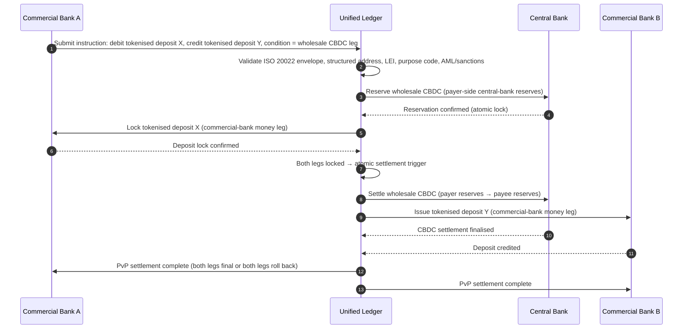

## A nagykereskedelmi fizetések indexe 2026-ban: ISO 20022, tokenizált betétek, valós idejű csatornák és határokon átnyúló elszámolás

A nagykereskedelmi fizetéseket 2026-ban két egyidejű elmozdulás formálja át: a strukturált fizetési adatok és a programozható elszámolás. A SWIFT 2026 novemberi strukturált címre vonatkozó mérföldköve az adatminőséget beépíti a működési modellbe, míg a BIS Project Agorá és a tokenizált betétek azt tesztelik, hogy a határokon átnyúló elszámolás atomibbá, átláthatóbbá és folyamatosan elérhetővé válhat-e.

---

> **Vezetői összefoglaló / Legfontosabb tanulságok**
>
> - **2026 novembere kemény adathatáridő.** A SWIFT szerint a strukturálatlan címeket tartalmazó fizetéseket az SR 2026 változás után már nem támogatják.
> - **A strukturált adatok termékinfrastruktúrává válnak.** A településnek és az országnak legalább a kijelölt mezőkben szerepelnie kell, ami a fizetési adatminőséget ügyfél-, működési és megfelelőségi kérdéssé teszi.
> - **A tokenizált betétek nagykereskedelmi tervezési opciók.** A Project Agorá a tokenizált kereskedelmi banki betéteket és a tokenizált jegybanki tartalékokat vizsgálja egy egységes főkönyvi modellben.
> - **Az indexnek az elszámolás minőségét kell mérnie, nem csak a sebességet.** A véglegesség, az átláthatóság, a javítási arányok, a likviditás felhasználása, a megfelelőségi adatok és az ügyfél számára való láthatóság ugyanolyan fontos, mint az azonnali végrehajtás.
> - **A határokon átnyúló fizetések továbbra is köz- és magánszféra közötti napirend.** Az FSB folytatja a G20 ütemterv megvalósításának irányítását, a köz- és magánszektor koordinációjával.
>
---

## Miért 2026 az az év, amikor ez az index számít

A Stanford AI Index azért hasznos, mert egy gyorsan változó technológiai területet olyasminek tekint, ami mérhető: a kutatási teljesítményt, a technikai teljesítményt, a felelős telepítést, a gazdaságot, az ágazati alkalmazást, a szabályozást és a közhangulatot egyetlen keretbe helyezi ([Stanford HAI ⧉](https://hai.stanford.edu/ai-index/2026-ai-index-report "The 2026 AI Index Report")). A bankoknak és a pénzügyi intézményeknek most ugyanerre a fegyelemre van szükségük az infrastruktúra terén. Az ügynöki AI, a kvantumbiztos biztonság, a felhőnatív ellenállóképesség és a nagykereskedelmi fizetések már nem különálló innovációs pályák; egyetlen működési modellbe konvergálnak.

A bankok gyakorlati kérdése nem az, hogy fontos-e az egyes területek mindegyike. Az a kérdés, hogy az intézmény képes-e egyszerre mérni a felkészültséget mindegyikben. Egy bank telepíthet ügynöki AI-t, és mégis törékeny maradhat, ha a kriptográfiája nem áll készen a migrációra. Modernizálhatja a felhőplatformokat, és mégis kudarcot vallhat, ha a fizetési adatok strukturálatlanok maradnak. Futtathat tokenizációs kísérleti projekteket, és mégis rendszerszintű kockázatot teremthet, ha az elszámolási, likviditási, azonosítási és auditrétegeket nem együtt tervezik meg.

## A 2026-os index architektúrája

| Indexréteg | 2026-os irány | Felkészültségi mutató | Kockázat helytelen kezelés esetén |
|---|---|---|---|
| **ISO 20022 adatok** | Elmozdulás a strukturálatlan szövegtől a szabályozott strukturált mezők felé | Strukturált címre való felkészültség és elutasítási arány | Fizetési elutasítások és manuális javítás |
| **Csatornaorchesztráció** | Útvonalválasztás RTGS, azonnali, levelező, stablecoin és tokenizált csatornák között | Költség-, sebesség-, véglegesség- és joghatóság-tudatos útvonalválasztás | Töredezett csatornák megkettőzött kontrollokkal |
| **Tokenizált elszámolás** | Tokenizált betétek és jegybankpénz használata ott, ahol csökkentik a súrlódást | DvP, PvP, atomi elszámolás lefedettsége | Kísérleti eszközök üzleti munkafolyamati érték nélkül |
| **Likviditás** | Az intraday likviditás, a beragadt készpénz és az elszámolási ablakok optimalizálása | Megtakarított likviditás és az elszámolási hibák csökkentése | Gyorsabb likviditáslecsapolás |
| **Megfelelőség** | Az AML, a szankciók, a FATF és az auditkövetelmények beépítése a fizetési adatokba | Átmenő megfelelőség és magyarázhatóság | Gazdagabb adatok erősebb kontrollok nélkül |

## A nagykereskedelmi fizetések kulcsjelzései a globális prioritásokhoz rendelve

A 2026-os jelzéskészlet nem kutatási napirend. Ez egy szállítási ellenőrzőlista, amely alapján a bank fizetési vezérigazgatóját már most is mérik. A javítási munka három helyen jelenik meg: az üzenetborítékban, a csatornaorchesztrációs rétegben és az elszámolási főkönyvben.

| Jelzés | G20 / SWIFT / BIS referencia | Technikai platformmegvalósítás |
|---|---|---|
| **A fizetési üzenetek 65%-a még mindig strukturálatlan címeket tartalmaz** | [SWIFT SR 2026, strukturált címre vonatkozó mérföldkő, 2026. november ⧉](https://www.swift.com/news-events/news/iso-20022-milestone-november-2026-unstructured-addresses-be-removed "ISO 20022 November 2026 structured address milestone") | Sémavalidáció a fizetési köztes szoftverben, mielőtt az üzenet eléri a SWIFTNet adaptert; automatizált címelemzés a vállalati csatorna és a levelező bank belépési pontjain. |
| **FSB G20 cél: a határokon átnyúló fizetések 75%-a 1 órán belül teljesüljön 2027-re** | [FSB határokon átnyúló fizetések ütemterve, 2026-os megvalósítási szakasz ⧉](https://www.fsb.org/2026/03/fsb-kicks-off-new-implementation-phase-to-enhance-cross-border-payments-through-public-private-partnership/ "FSB cross-border payments implementation phase") | Valós idejű FX-konverziós átjárók előre megállapodott likviditási ablakokkal; T+0 visszaigazolási horgok az ügyfélportálba; útvonalválasztó motor, amely kizár minden olyan folyosót, amely nem tudja teljesíteni az 1 órás keretet. |
| **FSB G20 cél: az átlagos határokon átnyúló tranzakciós költség 1% alatt, a lakossági 3% alatt** | [FSB G20 mennyiségi célok ⧉](https://www.fsb.org/2026/03/fsb-kicks-off-new-implementation-phase-to-enhance-cross-border-payments-through-public-private-partnership/ "FSB cross-border payments implementation phase") | Költséghozzárendelési telemetria minden folyosón (FX-különbözet, levelezői díj, felemelési költség); árréspolitikai nyilvántartás, amely a nem megfelelő árazást az árajánlat előtt jelzi. |
| **A BIS Project Agorá prototípus-szakaszba lép hét jegybank és 41 kereskedelmi bank részvételével** | [BIS Project Agorá ⧉](https://www.bis.org/about/bisih/topics/fmis/agora.htm "Project Agorá") | Egységes főkönyvi integrációs specifikáció: tokenizált betéti főkönyvi csomópont + nagykereskedelmi CBDC elszámolási sík + KYC/AML horgok; a bank folyosórészesedéséhez méretezett on-chain likviditási poolok. |
| **A Deutsche Bank „digitális pénz” kerete kikristályosodik az ügyfélarchitektúrában** | [Deutsche Bank, Digital Money: stablecoinok, tokenizált betétek és CBDC-k ⧉](https://flow.db.com/publications/flow-white-papers-and-guides/digital-money-a-perspective-on-stablecoins-tokenised-deposits-and-cbdcs "Digital Money: stablecoins, tokenised deposits and CBDCs") | Pénztárca-agnosztikus elszámolási API, amely fizetésenként absztrahálja a stablecoin / tokenizált betét / CBDC kiválasztását; a bank politikai nyilvántartásához, nem az ügyfél nyilvántartásához mért programozható feltételek. |

## A fizetési adatok fordulópontja

Az ISO 20022 az üzenetformátum-projektből adatminőségi működési modellé alakult. Ha a kedvezményezett, az adós, a hitelező, az ügynök, a település, az ország, a cél és a féladatok gyengék, a bank elutasításokat, javításokat, szankciós súrlódást, ügyfél-elégedetlenséget és gyenge analitikát fog tapasztalni.

**Az SR 2026 ezt kemény szerződéssé teszi, nem ajánlássá.** A SWIFT Standards Release 2026 (2026. november) a hálózati rétegen érvényesíti a strukturált címre vonatkozó szabályt: azokat az üzeneteket, amelyek `<PstlAdr>` eleme nem tartalmaz `<TwnNm>` és `<Ctry>` mezőt, a SWIFTNet validációs verem elutasítja átvételkor, nem javításra jelöli. A javítási sor megszűnik háttérirodai költségtétel lenni, és ügyfél számára látható késleltetéssel járó elszámolási hibaeseménnyé válik. Azok a működési csapatok, amelyek az SR 2026-ot „szigorúbb iránymutatásként” kezelték, rossz kézikönyvből dolgoznak.

### Strukturált fizetési adatoknak való megfelelés az ISO 20022 keretében

A javítási felület szűk és jól meghatározott. Az alábbi XML-elemek azok, ahol a 2026 novemberi SWIFTNet validációs verem ténylegesen elutasítja az üzeneteket; minden más downstream következmény.

| Adatelem | ISO 20022 XML címke | 2026 novemberi SWIFT követelmény | Technikai javítási stratégia |
|---|---|---|---|
| **Strukturált cím** | `<PstlAdr>`, amely `<TwnNm>` + `<Ctry>` elemet tartalmaz | Kötelező. A strukturálatlan `<AdrLine>` szöveg hálózati elutasítást vált ki a fogadó SWIFTNet adapternél. | Automatizált címelemzés a fizetés kezdeményezésekor; vállalati csatorna űrlapjainak átírása; a régi állomány tisztítása minden partnernél a következő terhelés előtt. |
| **Jogi személy azonosító (LEI)** | `<Id>` az `<OrgId>` alatt | Erősen ajánlott a nem magánszemély pénzügyi partnerek ellenőrzéséhez; több CBPR+ folyosón kötelező. | LEI-keresés + GLEIF-ellenőrzés a vállalati felvétel során; automatikus bővítés a régi állomány partnerei számára referenciaadat-szolgáltatásokon keresztül. |
| **Fizetési célkódok** | `<Purp>`, amely `<Cd>` elemet tartalmaz | Több regionális valós idejű folyosón (CBPR+, SEPA Inst, TIPS) kötelező az automatizált AML / szankciós szűréshez. | A régi, bankon belüli tranzakciós kódok leképezése a szabványos ISO 20022 ExternalPurposeCode listára; a cél kiválasztásának megjelenítése a vállalati csatorna felületén; alapértelmezett elutasítás ismeretlen kódokra. |
| **Végső felek** | `<UltmtDbtr>` / `<UltmtCdtr>` | A végső kedvezményezett kontextusának feltárása a G20 FATF utazási szabály + szankciós paraméterek teljesítéséhez; több fizetéstípus-kódnál kötelező. | Végponttól végpontig terjedő félnevek kinyerése a főkönyvi alszámlákból; egyeztetés a KYC-gráffal; a végső fél megjelenítése minden visszaigazoláson. |
| **Utalási információ (strukturált)** | `<RmtInf><Strd>` `<RfrdDocInf>` elemmel | Kötelező az egyeztethető, számlához kötött vállalati fizetéseknél a CBPR+ 2. fázisban. | Strukturált utalási adat rögzítése árajánlatkor a vállalati portálon; a szabad szöveges alternatíva elutasítása magas értékű forgalomnál. |

## Tokenizált betétek és nagykereskedelmi CBDC

A tokenizált betétek megőrzik a kereskedelmi banki pénz modelljét, miközben programozhatóságot adnak hozzá. A nagykereskedelmi jegybankpénz megőrzi az elszámolás véglegességét. Az érdekes tervezési minta a kombináció: kereskedelmi banki pénz az ügyfélkapcsolatokhoz és a hitelközvetítéshez, jegybankpénz a végleges elszámoláshoz és a rendszerszintű bizalomhoz.

A Project Agorá konkréttá teszi a kombinációt. Az alábbi architektúra a BIS referenciamintája egy atomi, fizetés-fizetés elleni (PvP) határokon átnyúló elszámoláshoz, amely mind egy kereskedelmi banki betéti főkönyvet, mind egy nagykereskedelmi CBDC elszámolási síkot használ, egy egységes főkönyvön keresztül koordinálva.

Az elszámolás felépítésénél fogva atomi: mindkét szár véglegesül, vagy mindkettő visszagördül. A nagykereskedelmi CBDC-száron az elszámolás véglegessége hatályossá teszi a kereskedelmi banki tokenizált betéti átutalást levelezői kockázat nélkül. Az egységes főkönyv a koordinációs sík, nem pedig önálló fizetési rendszer: a jegybank továbbra is kibocsátja az elszámolási eszközt, a kereskedelmi bank pedig továbbra is könyveli a betéti kötelezettséget.

## Az új nagykereskedelmi fizetési termék

A termék már nem egyszerűen fizetés. A végrehajtás, az adatok, a likviditás, a megfelelőség, a nyomonkövethetőség és a kivételkezelés csomagja. Azok a bankok, amelyek ezeket a képességeket API-kon és ügyfél-műszerfalakon keresztül tudják feltárni, az infrastruktúra-megfelelőséget ügyfélértékké alakítják.

## Mit jelent ez banktípusonként

### Globálisan rendszerszinten fontos bankok

A globális bankoknak ezt az indexet vállalati architektúra-eredménytáblaként kell kezelniük. A prioritás nem egy újabb koncepcióbizonyíték; hanem annak bizonyítéka, hogy az autonóm munkafolyamatok, a kriptográfiai migráció, a felhőfüggőség és a fizetésmodernizáció egyetlen kockázati és értékrendszerként irányítható.

### Tranzakciós bankok és vállalati bankok

A tranzakciós bankoknak a nagykereskedelmi fizetésekre, a strukturált adatokra, a likviditásra, a tokenizált betétekre és az ügynöki treasury szolgáltatásokra kell összpontosítaniuk. A legértékesebb ügyfélajánlat nem önmagában a gyorsabb pénzmozgás; hanem a magyarázható, auditálható, programozható pénzmozgás kevesebb vizsgálattal és jobb forgótőke-láthatósággal.

### Regionális bankok

A regionális bankoknak az indexet a programok szétaprózódásának elkerülésére kell használniuk. Nem kell minden határterületen vezetniük, de hiteles álláspontokra van szükségük az AI-irányításban, a poszt-kvantum leltárban, a felhőből való kilépés bizonyítékában és a fizetési adatokra való felkészültségben.

### Fintechek, PSP-k és infrastruktúra-szolgáltatók

A fintecheknek és az infrastruktúra-szolgáltatóknak a termék-ütemterveiket a mérhető banki felkészültséghez kell igazítaniuk. A legjobb ajánlatok csökkentik az integrációs kockázatot, erősítik a bizonyítékokat, és megkönnyítik a bankok számára az összetett infrastruktúra irányítását.

## Következtetés

Az index jellegű jelentés értéke az, hogy egy töredezett technológiai napirendet mérhető működési modellé alakít. 2026-ban a pénzügyi infrastruktúra győztesei nem a legtöbb kísérleti projekttel rendelkező intézmények lesznek. Azok az intézmények lesznek, amelyek egyszerre tudják bizonyítani a felkészültséget az autonómia, a biztonság, az ellenállóképesség, az elszámolás, a gazdaság és az irányítás terén.

## Gyakran ismételt kérdések

**Miért még mindig 2026-os kérdés az ISO 20022?**

Mert a migráció nem fejeződik be, amíg a fizetési adatok nem strukturáltak, szabályozottak, a forrásnál rögzítettek és a csatornákon, ügyfeleken és piaci infrastruktúrákon átívelően használhatók.

**Mi az a tokenizált betét?**

A tokenizált betét a kereskedelmi banki pénz digitális megjelenítése, amelyet úgy terveztek, hogy megőrizze a bank és a betétes közötti kapcsolatot, miközben lehetővé teszi a programozható elszámolást.

**A tokenizált betétek felváltják a stablecoinokat?**

Nem mindenhol. A stablecoinok bizonyos digitáliseszköz- és határokon átnyúló kontextusokban hasznosak maradhatnak, míg a tokenizált betétek szerkezetileg vonzóak a szabályozott nagykereskedelmi banki tevékenységhez.

**Mit kell mérniük a bankoknak?**

Mérjék a strukturált adatokra való felkészültséget, a fizetési elutasításokat, a javítási költséget, az elszámolási időt, a likviditás felhasználását, a csatorna-útvonalválasztás eredményeit és az ügyfél számára való láthatóságot.

## Hivatkozások

- SWIFT, (2026). [ISO 20022 November 2026 structured address milestone ⧉](https://www.swift.com/news-events/news/iso-20022-milestone-november-2026-unstructured-addresses-be-removed "ISO 20022 November 2026 structured address milestone").
- BIS Innovation Hub, (2026). [Project Agorá ⧉](https://www.bis.org/about/bisih/topics/fmis/agora.htm "Project Agorá").
- FSB, (2026). [Cross-border payments implementation phase ⧉](https://www.fsb.org/2026/03/fsb-kicks-off-new-implementation-phase-to-enhance-cross-border-payments-through-public-private-partnership/ "Cross-border payments implementation phase").
- Deutsche Bank, (2026). [Digital Money: stablecoins, tokenised deposits and CBDCs ⧉](https://flow.db.com/publications/flow-white-papers-and-guides/digital-money-a-perspective-on-stablecoins-tokenised-deposits-and-cbdcs "Digital Money: stablecoins, tokenised deposits and CBDCs").
