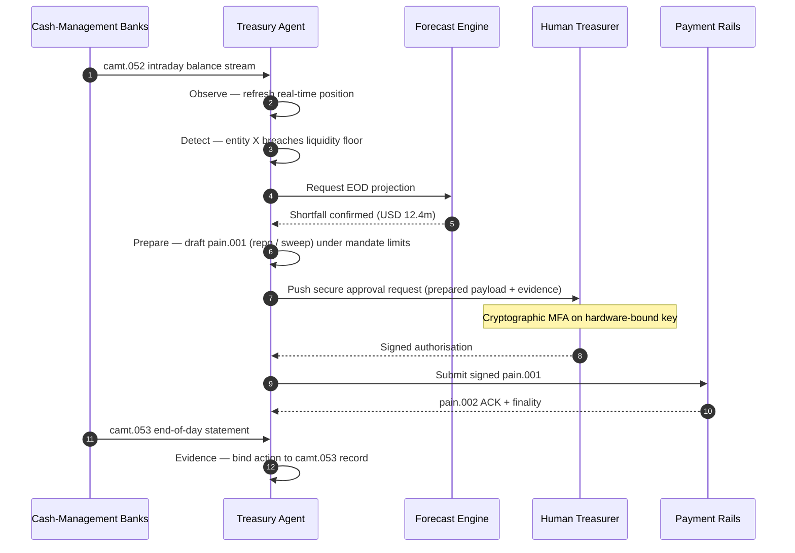

## Az autonóm treasury index 2026-ban: ügynöki treasury, programozható likviditás, tokenizált betétek és valós idejű készpénzkontroll

Az autonóm treasury az ügynöki AI, a nagyértékű (wholesale) fizetések, a tokenizált betétek és a valós idejű likviditás természetes találkozási pontja. 2026-ban a legjobb treasury-architektúrák nem csupán a készpénzt fogják előrejelezni; javaslatot tesznek, magyaráznak, és végül korlátozott likviditási műveleteket hajtanak végre számlák, devizák, fizetési infrastruktúrák és kiegyenlítési eszközök között.

---

> **Vezetői összefoglaló / Legfontosabb tanulságok**
>
> - **A treasury a jelentéstételtől a kontroll felé mozdul el.** A valós idejű egyenlegek, előrejelzések, fizetési státuszok és likviditási mozgások egyetlen munkafolyamat részévé válnak.
> - **Az ügynöki AI új treasury-felületet hoz létre.** Az ügynökök figyelhetik a pozíciókat, felszínre hozhatják az anomáliákat, előkészíthetik a finanszírozási műveleteket, és eszkalálhatják a döntéseket a meghatározott mandátumokon belül.
> - **A programozható pénz megváltoztatja a készpénzoldalt.** A tokenizált betétek és a nagyértékű (wholesale) CBDC-kísérletek új lehetőségeket teremtenek az atomi kiegyenlítés, a feltételes fizetések és a mindig elérhető likviditás számára.
> - **Az indexnek a felhatalmazást kell mérnie.** A kérdés nem az, hogy az ügynök tud-e műveletet javasolni; hanem az, hogy a felhatalmazás, a limitek, a jóváhagyások és a bizonyítékok egyértelműek-e.
> - **A treasury értéke mérhető.** A sikert a megtakarított likviditásnak, a csökkentett manuális vizsgálatoknak, az elkerült kiegyenlítési hibáknak és a felszabadított forgótőkének kell meghatároznia.
>
---

## Miért éppen 2026 az az év, amikor ez az index számít

A Stanford AI Index azért hasznos, mert egy gyorsan változó technológiai területet olyasvalamiként kezel, ami mérhető: a kutatási eredményeket, a technikai teljesítményt, a felelős bevezetést, a gazdaságosságot, a szektorális elterjedést, a szabályozást és a közvéleményt egyetlen keretbe foglalja ([Stanford HAI ⧉](https://hai.stanford.edu/ai-index/2026-ai-index-report "The 2026 AI Index Report")). A bankoknak és a pénzügyi intézményeknek ma ugyanerre a fegyelemre van szükségük az infrastruktúra terén is. Az ügynöki AI, a kvantumbiztos védelem, a felhőnatív ellenállóképesség és a nagyértékű (wholesale) fizetések már nem különálló innovációs irányvonalak; egyetlen működési modellé olvadnak össze.

A bank számára a gyakorlati kérdés nem az, hogy az egyes területek fontosak-e. Hanem az, hogy az intézmény képes-e egyszerre mérni a felkészültséget mindegyikben. Egy bank bevezetheti az ügynöki AI-t, és mégis törékeny maradhat, ha a kriptográfiája nem áll készen a migrációra. Modernizálhatja a felhőplatformokat, és mégis kudarcot vallhat, ha a fizetési adatok strukturálatlanok maradnak. Futtathat tokenizációs kísérleteket, és mégis rendszerszintű kockázatot teremthet, ha a kiegyenlítési, likviditási, azonosítási és auditrétegeket nem együtt tervezik meg.

## A 2026-os index architektúrája

| Indexréteg | 2026-os irány | Felkészültségi mutató | Kockázat rossz kezelés esetén |
|---|---|---|---|
| **Láthatóság** | Számla-, fizetési, likviditási és kitettségi adatok egységesítése | A valós idejű készpénzpozíciók lefedettsége | Töredezett készpénz-láthatóság |
| **Előrejelzés** | AI használata az egyenlegek, áramlások és finanszírozási igények előrejelzésére | Előrejelzési pontosság és kivételarány | Hamis bizalom gyenge adatokban |
| **Autonómia** | Az ügynökök korlátozott felhatalmazása javaslatokra és műveletekre | Mandátumlefedettség és jóváhagyási minőség | Jogosulatlan vagy megmagyarázatlan művelet |
| **Programozhatóság** | Tokenizált betétek és okos feltételek használata ott, ahol értéket adnak | Feltételes fizetési és atomi kiegyenlítési felhasználási esetek | Technológiavezérelt treasury-kísérletek |
| **Kontrollok** | Limitek, szankciók, FX, likviditási és auditkontrollok beépítése | Kontrollbizonyíték minden treasury-műveletre | Manuális irányítás a végrehajtás után |

## Aktuális jelzések, amelyeket követni kell

| Jelzés | Mit jelent ez a bankok számára | Forrás |
|---|---|---|
| **52%-os ügynöki AI-elterjedtség a pénzügyi szolgáltatásokban** | A treasury immár képes befogadni az ügynöki munkafolyamatokat irányított platformokon keresztül | [Cambridge CCAF ⧉](https://www.jbs.cam.ac.uk/faculty-research/centres/alternative-finance/publications/2026-global-ai-in-financial-services-report/ "2026 Global AI in Financial Services Report") |
| **Project Agorá feltételes fizetések** | A tokenizáció lehetővé teheti a feltételes és a mindig elérhető fizetési képességeket | [BIS ⧉](https://www.bis.org/about/bisih/topics/fmis/agora.htm "Project Agorá") |
| **Bank of England Digital Securities Sandbox** | A DLT-en kibocsátott kötvények és részvények szállítás fizetés ellenében (Delivery-versus-Payment, DvP) alapon egyenlítődnek ki: az eszközoldal és a készpénzoldal (nagyértékű CBDC vagy tokenizált kereskedelmi banki betétek) ugyanabban az atomi tranzakcióban egyenlítődik ki, kiküszöbölve a tőkével kapcsolatos partnerkockázatot | [Bank of England ⧉](https://www.bankofengland.co.uk/financial-stability/digital-securities-sandbox "Digital Securities Sandbox") |
| **SWIFT strukturált cím határidő** | A treasury-adatokat helyesen kell rögzíteni a forrásnál | [SWIFT ⧉](https://www.swift.com/news-events/news/iso-20022-milestone-november-2026-unstructured-addresses-be-removed "ISO 20022 November 2026 structured address milestone") |
| **A nagy pénzügyi intézmények nehezen mérik az AI értékét** | A treasury-automatizáláshoz kemény gazdasági mutatókra van szükség | [Cambridge CCAF ⧉](https://www.jbs.cam.ac.uk/faculty-research/centres/alternative-finance/publications/2026-global-ai-in-financial-services-report/ "2026 Global AI in Financial Services Report") |

## A treasury-ügynök mandátuma

A treasury-ügynököt nem szabad általános célú asszisztensként megtervezni. Mandátumra van szüksége: figyelje a számlákat, észlelje a kivételeket, jelezze előre a finanszírozási hiányokat, készítsen elő műveleteket, kérjen jóváhagyásokat, hajtson végre a limiteken belül, és állítson elő bizonyítékot. Minden lépéshez eltérő felhatalmazási modell tartozzon.

A kontrollhurok a Megfigyelés → Észlelés → Előrejelzés → Előkészítés → Jóváhagyáskérés lépéseket futtatja, majd megáll. Az ügynök soha nem lépi át önállóan a kriptográfiai engedélyezési határt. Az alábbi diagram egy teljes ciklust követ nyomon: a `camt.052` telemetriában több millió dolláros napközbeni likviditáshiány jelenik meg, az ügynök előrejelzi a napvégi pozíciót, előkészít egy repo- vagy vállalatközi átvezetést teljesen kész `pain.001` formájában, és átadja azt az emberi treasurernek, hogy az egy hardverhez kötött kulcson többfaktoros kriptográfiai jóváhagyást adjon rá. Az ügynök ezután beküldi az aláírt adatcsomagot; a véglegesség egy `pain.002` ACK és a következő hivatalos `camt.053` formájában érkezik meg.

A határ a lényeg: minden művelet, amely valódi pénzt mozgat, egy olyan kriptográfiai kapu mögött van, amelyet az ügynök önállóan nem tud teljesíteni.

## Programozható likviditás

A programozható likviditás az a képesség, hogy értéket mozgassunk feltételek mellett: ha egy küszöböt átlépnek, ha a fedezet elfogadható, ha egy partner átmegy a szűrésen, ha a kiegyenlítés véglegessége elérhető, vagy ha egy napközbeni likviditási puffer túl alacsony. A tokenizált betétek és a nagyértékű kiegyenlítési platformok gyakorlatiasabbá teszik ezeket a mintázatokat.

A programozható nem jelenti azt, hogy szabványon kívüli. A végrehajtási útvonal a `pain.001`: az [ISO 20022](/2023-09-29-automating-iso-20022-compliant-payment-file-creation-with-pain001/index.html) Customer Credit Transfer Initiation. Az ügynök előkészített művelete egy teljesen kész `pain.001` adatcsomag, amelyet ugyanazon a csatornán juttatnak el a bankhoz, amelyet egy vállalati ERP is használna, ugyanazon séma alapján validálva, ugyanazon csalás- és szankciószűrő motorok által pontozva, és ugyanazokon a `pain.002` státuszjelentéseken visszaigazolva. A feltételességi réteg (küszöb, fedezet-elfogadhatóság, véglegesség elérhetősége, pufferalsó határ) az üzenet felett helyezkedik el: azt szabályozza, *hogy* elküldenek-e egy `pain.001`-et, nem azt, hogy *milyen formát* ölt. Azok a treasury-platformok, amelyek egyedi adatcsomagokat találnak ki a feltételek kifejezésére, kiesnek a bank által feldolgozható útvonalról, és visszatérnek a kétoldalú integrációhoz.

## A treasury vezérlőterme

A működési modellnek úgy kell kinéznie, mint egy vezérlőterem: pozíciók, előrejelzések, fizetési állapotok, limithasználat, kivételek, jóváhagyások és bizonyítékok egyetlen felületen. Az indexnek büntetnie kell azokat a treasury-rendszereket, amelyek arra kényszerítik a csapatokat, hogy e-maileket, táblázatokat, bankportálokat és összefüggéstelen irányítópultokat fűzzenek össze.

Az e felület mögötti adatréteg az ISO 20022 készpénzkezelés. A napközbeni pozíció a `camt.052`, azaz a Bank-to-Customer Account Report, amelyet minden készpénzkezelő bank az ügynök megfigyelési rétegébe továbbít olyan gyakorisággal, amilyennel a bank publikál (percek a tier-1 GTB-szolgáltatóknál, ciklusvég a hosszú farok esetében). A napvégi egyeztetés a `camt.053`, azaz a Bank-to-Customer Statement: ez az auditálható rekord, amelyhez az ügynök előrejelzését másnap reggel mérik. Azok a treasury-platformok, amelyek PDF-kivonatokat olvasnak vagy bankportálokat kaparnak le a képernyőről, nem tudják teljesíteni az index 4. szintjét; a napközbeni telemetriának strukturált `camt.052` formájában kell megérkeznie ahhoz, hogy az előrejelzési hurok időben lezáruljon a cselekvéshez.

## Mit jelent ez banktípusonként

### Globálisan rendszerszinten jelentős bankok

A globális bankoknak ezt az indexet vállalati architektúra-eredménytáblaként kell kezelniük. A prioritás nem egy újabb elvi bizonyíték; hanem annak igazolása, hogy az autonóm munkafolyamatok, a kriptográfiai migráció, a felhőfüggőség és a fizetési modernizáció egyetlen kockázati és értékrendszerként irányítható.

### Tranzakciós bankok és vállalati bankok

A tranzakciós bankoknak a nagyértékű fizetésekre, a strukturált adatokra, a likviditásra, a tokenizált betétekre és az ügynöki treasury-szolgáltatásokra kell összpontosítaniuk. A legértékesebb ügyfélajánlat nem pusztán a gyorsabb pénzmozgás; hanem a magyarázható, auditálható, programozható pénzmozgás, kevesebb vizsgálattal és jobb forgótőke-láthatósággal.

### Regionális bankok

A regionális bankoknak az indexet a programburjánzás elkerülésére kell használniuk. Nem kell minden határterületen élen járniuk, de hiteles pozíciókra van szükségük az AI-irányítás, a posztkvantum-leltár, a felhőből való kilépés bizonyítékai és a fizetési adatok felkészültsége terén.

### Fintechek, PSP-k és infrastruktúra-szolgáltatók

A fintecheknek és az infrastruktúra-szolgáltatóknak a termékútvonalaikat a mérhető banki felkészültséghez kell igazítaniuk. A legjobb ajánlatok csökkentik az integrációs kockázatot, erősítik a bizonyítékokat, és megkönnyítik a bankok számára az összetett infrastruktúra irányítását.

## Következtetés

Egy index jellegű jelentés értéke abban rejlik, hogy egy töredezett technológiai napirendet mérhető működési modellé alakít. 2026-ban a pénzügyi infrastruktúra győztesei nem a legtöbb kísérletet futtató intézmények lesznek. Hanem azok az intézmények, amelyek egyszerre tudják bizonyítani a felkészültséget az autonómia, a védelem, az ellenállóképesség, a kiegyenlítés, a gazdaságosság és az irányítás terén.

## Gyakran ismételt kérdések

**Mi az autonóm treasury?**

Az autonóm treasury az AI-ügynökök, a valós idejű adatok és a programozható fizetések használata a treasury-műveletek figyelésére, javaslására és esetleges végrehajtására a meghatározott kontrollokon belül.

**Szabad-e engedélyezni a treasury-ügynököknek, hogy fizetéseket hajtsanak végre?**

Csak szűk mandátumokon, erős limiteken, kifejezett jóváhagyásokon és teljes auditálhatóságon belül. A végrehajtási felhatalmazást érettséggel kell kiérdemelni.

**Hogyan segítik a tokenizált betétek a treasuryt?**

Támogathatják a programozható kiegyenlítést, az atomi végrehajtást és potenciálisan a jobb napközbeni likviditáskontrollt, miközben megőrzik a kereskedelmi banki pénzkapcsolatokat.

**Mi az első megvalósítási lépés?**

Építsen ki valós idejű láthatóságot és adatminőséget, mielőtt autonómiát adna. Az ügynökök nem tudják biztonságosan optimalizálni azt a készpénzt, amelyet nem látnak pontosan.

## Hivatkozások

- Cambridge Centre for Alternative Finance, (2026). [2026 Global AI in Financial Services Report ⧉](https://www.jbs.cam.ac.uk/faculty-research/centres/alternative-finance/publications/2026-global-ai-in-financial-services-report/ "2026 Global AI in Financial Services Report").
- SWIFT, (2026). [ISO 20022 November 2026 structured address milestone ⧉](https://www.swift.com/news-events/news/iso-20022-milestone-november-2026-unstructured-addresses-be-removed "ISO 20022 November 2026 structured address milestone").
- BIS Innovation Hub, (2026). [Project Agorá ⧉](https://www.bis.org/about/bisih/topics/fmis/agora.htm "Project Agorá").
- Bank of England, (2026). [Shaping the UK's digital financial future ⧉](https://www.bankofengland.co.uk/speech/2025/january/sasha-mills-speech-at-the-tokenisation-summit "Shaping the UK's digital financial future").
