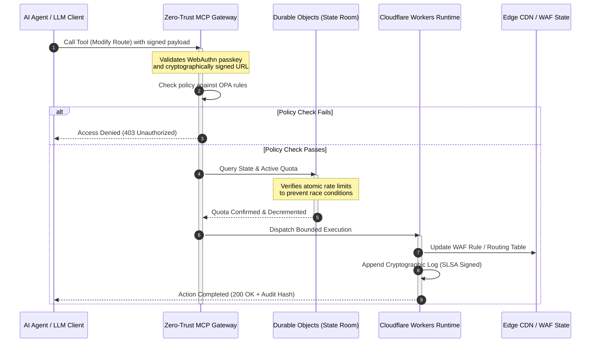

## CloudCDN: nyílt forráskódú tervrajz az AI-natív peremhez 2026-ban

A CDN-vita lezárult. A perem többé nem gyorsítótár; az AI-natív szoftver vezérlő síkja. Ahogy az ügynökök eszközöket hívnak, adatokat mozgatnak, gyorsítótárakat ürítenek, aláírt URL-eket kérnek és munkafolyamatokat koordinálnak, az átláthatatlan irányítópultok és a szabadalmaztatott vezérlő síkok régi modellje már nem kényelmetlenség, hanem szabályozási felelősség lesz. A CloudCDN egy másik modell mellett érvel: nyílt, vizsgálható, ügynökök által vezérelhető peremplatform mellett, amely a biztonságot, az akadálymentességet, a teljesítményt és az auditálhatóságot kikényszeríthető alapértelmezésekként kezeli, nem pedig gyártói ígéretekként.

E cikk nyílt forráskódú hivatkozási pontja a [cloudcdn.pro ⧉](https://github.com/sebastienrousseau/cloudcdn.pro "cloudcdn.pro"). A tároló egy több bérlős, AI-natív CDN, amely végponttól végpontig olvasható és önállóan telepíthető: 100 ms alatti TTFB a Cloudflare PoP-okon keresztül, MCP-vezérlés, Durable Objects sebességkorlátozás, WCAG-AA akadálymentesség, aláírt URL-ek, jelszó nélküli kulcsok (passkey), SLSA Level 3, valamint 3185 teszt 100%-os lefedettséggel.

---

> **Vezetői összefoglaló / Legfontosabb tanulságok**
>
> - **A perem lesz a működési határ.** A CloudCDN a szokásos CDN-csomópontokat aktív házirendkapukká alakítja, amelyek ezredmásodperc alatti biztonsági, útválasztási és hozzáférés-vezérlési döntéseket hajtanak végre.
> - **A Durable Objects atomivá teszi a sebességkorlátozást.** A valós idejű, globálisan konzisztens kvótakikényszerítés bezárja azt a versenyhelyzeti ablakot, amelyet a végső soron konzisztens korlátozók nyitva hagynak a támadók és a hibásan működő ügynökök előtt.
> - **Az ügynökök 42 korlátozott MCP-eszközön keresztül üzemeltetik az infrastruktúrát.** Minden hívást WebAuthn jelszó nélküli kulcsok, aláírt hasznos adatok és OPA-házirend ellen ellenőriznek, mielőtt bármi végrehajtódna.
> - **Az ellátási lánc a termék része.** A Sigstore/Cosign révén megvalósuló SLSA Level 3 származási bizonyíték kriptográfiailag köti össze minden kiadást az auditált forrásával.
> - **A telemetria megfelelőségi bizonyíték.** A peremműveletek közvetlenül, nem utólagos jelentéskészítésen keresztül, leképeződnek a DORA 5. cikkére, a BCBS 239-re és a Basel III működési kockázati tőkére.
>
---

## Miért számít ez a nyílt forráskódú projekt 2026-ban

A vállalati IT 2026-ban a statikus infrastruktúra-kiépítéstől a valós idejű, eseményvezérelt adatorkesztrálás felé mozdult el. Két piaci erő hajtja ezt a váltást.

Az első az ügynöki AI elterjedése. Az autonóm modellek és szoftverügynökök ma összetett működési feladatokat hajtanak végre: automatizált fenyegetéselhárítást, útválasztási döntéseket, valós idejű főkönyvi egyenlegezést. Nem irányítópultokat használnak. Eszközöket hívnak.

A második a [Digital Operational Resilience Act (DORA) ⧉](https://eur-lex.europa.eu/legal-content/EN/TXT/?uri=CELEX%3A32022R2554 "Az (EU) 2022/2554 rendelet a pénzügyi ágazat digitális működési ellenállóképességéről") aktív kikényszerítése. A banki intézmények többé nem támaszkodhatnak átláthatatlan, szabadalmaztatott, harmadik féltől származó CDN-ekre. A szabályozók teljes rálátást követelnek a szoftverellátási láncra, ellenőrizhető kilépési képességet és megváltoztathatatlan kriptográfiai auditnyomvonalakat.

A központosított szerverarchitektúrák olyan késleltetési büntetéseket rónak ki, amelyeket a valós idejű orkesztrálás nem tud elnyelni. A szabadalmaztatott CDN-ek fekete dobozként működnek, amelyek olyan ellátási lánci veszélyeztetettségnek teszik ki az intézményeket, amelyet nem látnak, nemhogy bizonyítani tudnának. A CloudCDN ezt a rést egy átlátható, zero-trust, nyílt forráskódú tervrajzzal zárja be, amely a peremet aktív vezérlő síkká alakítja. A technológiai vezetők számára ez a beszélgetést a megfelelőség költségéről az ellenállóképesség megtérülésére tereli: az automatizált, auditra kész működési folyamatok által megőrzött tőkére.

## Az architektúra nézőpontja

A CloudCDN architektúrája öt rétegben épül fel, a központosított köztes szoftvert lokalizált, állapottal rendelkező peremi primitívekkel váltva fel:

| Réteg | Tervezési döntés | Miért számít | Kockázat helytelen kezelés esetén |
|---|---|---|---|
| **Peremi futtatókörnyezet** | Cloudflare Workers és Pages | Kiküszöböli a központosított VM-késleltetést; ezredmásodperc alatt hajt végre házirendeket globálisan | A házirendfegyelem nélküli teljesítménynyereség kaotikus peremi elcsúszást eredményez |
| **Állapotkoordináció** | Durable Objects | Atomi, valós idejű konzisztenciát garantál a sebességkorlátokhoz és a megosztott állapothoz régiókon át | Elosztott versenyhelyzetek, API-erőforrások visszaélése, megkerült perem-kvóták |
| **Ügynökinterfész** | Zero-trust MCP átjáró | 42 specializált MCP-eszközt tesz elérhetővé, hogy az AI-ügynökök szabályozott korlátok között üzemeltessék az infrastruktúrát | Korlátlan eszközhívás és jogosulatlan konfigurációmódosítás |
| **Hozzáférés-vezérlés** | WebAuthn jelszó nélküli kulcsok és aláírt URL-ek | A statikus jelszavakat kriptográfiai aláírásokkal váltja fel az auditálható műveletekhez | Gyengén attribuált módosítások; hitelesítőadat-lopás, amely a perem áttöréséhez vezet |
| **Minőségi kapuk** | SLSA Level 3 és 100%-os tesztlefedettség | Matematikailag ellenőrzi a build forrását; blokkolja a rosszindulatú függőségbeszúrást | A szoftverellátási láncon keresztül beszúrt rosszindulatú kód |

## Nyomon követendő működési jelzések

A perem felkészültsége mérhető. Ezek azok a mennyiségi mutatók, amelyek a végrehajtási képességet igazolják, nem pedig a szándékot:

| Jelzés | Mérőszám / referenciaérték | Szabályozási hivatkozás | Platformmegvalósítás |
|---|---|---|---|
| **42 MCP-eszköz** | Korlátozott eszköztár-nyilvántartás mérete az automatizált kezeléshez | COBIT 2019 (BAI06) | MCP átjáró, amely az ügynökök aláírásait OPA-házirendek ellen ellenőrzi |
| **Durable Objects** | Nulla szivárgás, ezredmásodperc alatti atomi kvótakikényszerítés | DORA 6. cikk | Durable Objects, amely a globális API-kvóta állapotát követi |
| **Jelszó nélküli kulcsok és aláírt URL-ek** | Az adminisztrátori munkamenetek 100%-a FIDO2 WebAuthn révén ellenőrizve | DORA 30. cikk | A peremi útválasztóba ágyazott kriptográfiai aláírás-ellenőrzések |
| **SLSA Level 3** | Kriptográfiailag aláírt build-jegyzékek (Sigstore) | DORA 30. cikk | GitHub Actions folyamatok, amelyek aláírt build-metaadatokat generálnak |
| **3185 egységteszt** | 100%-os lefedettség; regressziós kapuk minden kiadásnál | NIST CSF 2.0 (PR.DS-01) | CI-folyamatok, amelyek bármely teszthiba esetén leállítják a telepítést |

## A CDN aktív vezérlő síkká válik

A hagyományos CDN-eket a passzív, statikus tartalomgyorsítás köré tervezték. A CloudCDN újradefiniálja a modellt. A Cloudflare Workers és a Durable Objects integrálásával a perem aktív, állapottal rendelkező házirendkapuként működik.

Amikor egy AI-ügynök vagy automatizált folyamat infrastruktúra-konfigurációs módosítást vagy útválasztási beállítást kér, nem egy sebezhető, központosított adatbázissal beszél. A kérést a legközelebbi peremcsomópontnál elfogják, és identitás-, házirend- és kvótaellenőrzéseken vezetik végig, mielőtt bármi végrehajtódna:

Ebben a sorozatban minden lépés attribuálható, aláírt rekordot hoz létre. Ez a különbség egy tartalmat gyorsító CDN és egy irányítható vezérlő sík között.

## Miért változtatja meg a nyílt forráskód a bizalmi modellt

Az információbiztonsági vezérigazgatók (CISO-k) számára az átláthatatlan, szabadalmaztatott CDN-ek halmozódó kockázatot jelentenek. A zárt forráskódú peremhálózatok fekete dobozok: ha a gyártót belső veszélyeztetettség éri, a banknak nulla rálátása van, amíg a jogsértést nyilvánosan fel nem tárják.

A CloudCDN ezt az aszimmetriát egy teljesen auditálható, nyílt forráskódú bizalmi modellel váltja fel, amely három mechanizmusra épül:

1. **Matematikai build-származás.** Az SLSA Level 3 alatt minden kiadás kriptográfiailag kapcsolódik a nyílt forráskódú GitHub-tárolójához. Egy CISO matematikailag, nem szerződéses úton ellenőrizheti, hogy a Cloudflare globális peremcsomópontjain futó bináris pontosan az auditált forráskódot tartalmazza.
2. **Folyamatos, nyilvános biztonsági auditok.** A kódbázist automatizált vizsgálatoknak, nyilvános sebezhetőség-közzétételnek és szakértői kódauditoknak vetik alá. Az elhomályosítás nem kontroll; a felülvizsgálat az.
3. **Nincs gyártói bezártság (DORA 28. cikk).** A DORA megköveteli, hogy a bankok egyértelmű, tesztelt kilépési stratégiát bizonyítsanak a kritikus, harmadik féltől származó szolgáltatóktól. Mivel a CloudCDN nyílt forráskódú és szabványos szerver nélküli primitívekre épül, az intézmények áttelepíthetik a peremi konfigurációkat a Cloudflare-ről más szerver nélküli futtatókörnyezetekre vagy privát Kubernetes-fürtökre, és ezt a képességet bizonyítani tudják a szabályozónak.

## A bankszintű perem mintája

A CloudCDN-t a globális pénzügyi ágazat megfelelőségi szabványainak teljesítésére tervezték, a technikai peremműveleteket közvetlenül azokra a keretrendszerekre képezve le, amelyeket a felügyeletek ténylegesen vizsgálnak:

- **Modellkockázat-kezelés ([US Fed SR 11-7 ⧉](https://web.archive.org/web/20260414150921/https://www.federalreserve.gov/supervisionreg/srletters/sr1107.htm "Supervisory Guidance on Model Risk Management") / UK PRA SS1/23).** A működési feladatokat végrehajtó autonóm modellek a modellkockázati irányítás alá tartoznak. A CloudCDN MCP átjárója az ügynöki eszközöket mennyiségi modellként kezeli: szigorú házirendkorlátok, valós idejű naplózás és kötelező, ember a folyamatban felülbírálások a nagy hatású műveletekhez.
- **BCBS 239 (kockázatiadat-aggregáció).** A tranzakciós adatok peremen történő rögzítésével, címkézésével és strukturálásával a működési mérőszámok valós időben jönnek létre, megfelelve a BCBS 239 adatintegritásra, időszerűségre és szabályozási nyomon követhetőségre vonatkozó követelményeinek.
- **DORA 5. cikk (igazgatósági elszámoltathatóság).** Az igazgatóság végső, személyes felelősséget visel a működési ellenállóképességért. A CloudCDN a peremi telemetriát számszerűsített, ellenőrizhető bizonyítékká alakítja, amelyet a nem technikai igazgatók bevihetnek egy személyes felelősségi auditba.
- **Basel III működési kockázati tőke.** A bankok szabályozói tőkét tartanak a működési kockázattal szemben. Az automatizált katasztrófa-helyreállítási átállás és az SLSA Level 3 származás csökkenti az intézmény működési kockázati profilját, tőkét őrizve meg a mérlegben, nem csupán egy auditot elégítve ki.

## Mit jelent ez banktípusonként

### Globálisan rendszerszinten jelentős bankok (G-SIB-ek)

A G-SIB-ek hatalmas tranzakciós volument bonyolítanak több joghatóságon át. A prioritás a széttöredezett örökölt perem-kontrollok felváltása egyetlen, egységes peremsíkkal. A CloudCDN minta telepítése lehetővé teszi egy G-SIB számára a biztonsági házirendek, API-átjárók és ügynöki irányítás globális szabványosítását, és a DORA-kompatibilis bizonyítékfolyamatok generálását a működés melléktermékeként, nem pedig negyedéves kapkodásként.

### Tranzakciós és vállalati bankok

A tranzakciós bankok számára az ügyfél felé néző termék a végrehajtási sebesség, a biztonság és az adatátláthatóság csomagja. A CloudCDN minta lehetővé teszi ezeknek a bankoknak, hogy biztonságos API-irányítópultokat és valós idejű készpénzkövetési szolgáltatásokat kínáljanak a vállalati kincstárnokoknak: ellenállóképes perempozíciót, amely megvédi a vállalati betéteket.

### Regionális és kisebb bankok

A regionális bankok ugyanazokkal a fenyegető szereplőkkel néznek szembe, mint a G-SIB-ek, a mérnöki költségvetések nélkül. Egy nyílt forráskódú, bankszintű perem-tervrajz a kontrollokat készen biztosítja: azonnali szabályozási összhang szabadalmaztatott licencköltségek nélkül, és a forráskódot ennek bizonyítására.

## Az igazgatósági kézikönyv

A működési ellenállóképesség többé nem láthatatlan háttérirodai IT-mérőszám; igazgatósági prioritás, amelyhez személyes felelősség kapcsolódik. Azok az intézmények, amelyek 2026-ban megőrzik a szabályozók, ügyfelek és részvényesek bizalmát, a technológiát ellenőrizhető, megfigyelhető eszközként kezelik.

A vezető technológiai vezetők ütemterve rövid:

1. **Tegye kötelezővé a bizonyítékot mint terméket.** Költségvetést a peremen automatizált, önmagát dokumentáló folyamatokra: a működés által generált bizonyítékra, nem az auditor számára összeállítottra.
2. **Térjen át az állapottal rendelkező peremvezérlésre.** Vegye le a sebességkorlátozást, a WAF-ot és az identitás-ellenőrzést a központosított szerverekről, és helyezze át atomi peremi primitívekre.
3. **Hozzon létre kriptográfiai ügynöki korlátokat.** Kényszerítsen ki zero-trust MCP átjárókat jelszó nélküli kulcs- és OPA-ellenőrzéssel minden automatizált eszközhíváshoz.
4. **Követeljen meg nyílt forráskódú build-auditokat.** Tegye az SLSA Level 3 build-származást a telepítés feltételévé, ne törekvéssé.

## Gyakran ismételt kérdések

**Készen áll a CloudCDN a DORA-auditokra?**

Igen. A CloudCDN-t úgy tervezték, hogy automatizált megfelelőségi bizonyítékot hozzon létre, amely közvetlenül leképeződik az információs nyilvántartásra (Register of Information) vonatkozó ITS-sablonokra (RT.01-től RT.15-ig) és a DORA 30. cikk szerinti szerződéses záradékokra.

**Mi az előnye a Durable Objects használatának a sebességkorlátozáshoz?**

A hagyományos elosztott sebességkorlátozók a végső soron konzisztenciára támaszkodnak, ami olyan késleltetési ablakot hagy nyitva, amelyet a támadók vagy a hibásan működő ügynökök kihasználhatnak. A Durable Objects azonnali, atomi konzisztenciát garantál globálisan, teljesen bezárva a versenyhelyzeti ablakot.

**Mitől AI-natív a CloudCDN?**

Az MCP-vezérelt műveleteitől és az ügynöktudatos vezérlési modelljétől. Az infrastruktúrát 42 szabályozott eszközön keresztül üzemeltetik kriptográfiai identitással és házirendkorlátokkal, autonóm munkafolyamatokra tervezve, nem csupán emberi irányítópultokra.

**Növeli-e a nyílt forráskódú kód a nulladik napi sebezhetőségek kockázatát?**

Nem. A szabadalmaztatott, zárt forráskódú CDN-ek az elhomályosítás révén nyújtott biztonságra támaszkodnak. A CloudCDN kódbázisát folyamatosan alávetik automatizált tesztelésnek, nyilvános szakértői felülvizsgálatnak és SLSA Level 3 érvényesítésnek: ez ellenőrizhetően magasabb bizalmi küszöb.

## Hivatkozások

- European Parliament and Council of the European Union, (2022). [Regulation (EU) 2022/2554 on digital operational resilience for the financial sector (DORA) ⧉](https://eur-lex.europa.eu/legal-content/EN/TXT/?uri=CELEX%3A32022R2554 "Regulation (EU) 2022/2554 on digital operational resilience for the financial sector (DORA)"). Brussels: Official Journal of the European Union.
- Basel Committee on Banking Supervision (BCBS), (2013). [Principles for effective risk data aggregation and risk reporting (BCBS 239) ⧉](https://www.bis.org/publ/bcbs239.htm "Principles for effective risk data aggregation and risk reporting (BCBS 239)"). Basel: Bank for International Settlements.
- Board of Governors of the Federal Reserve System, (2011). [Supervisory Guidance on Model Risk Management (SR Letter 11-7) ⧉](https://web.archive.org/web/20260414150921/https://www.federalreserve.gov/supervisionreg/srletters/sr1107.htm "Supervisory Guidance on Model Risk Management (SR Letter 11-7)"). Washington D.C.: Federal Reserve.
- Cloudflare, (2026). [Durable Objects documentation: stateful edge coordination ⧉](https://developers.cloudflare.com/durable-objects/ "Durable Objects documentation"). San Francisco: Cloudflare.
- Cloudflare, (2026). [Building AI agents with MCP, authentication and Durable Objects ⧉](https://blog.cloudflare.com/building-ai-agents-with-mcp-authn-authz-and-durable-objects/ "Building AI agents with MCP, authentication and Durable Objects").
- GitHub, (2026). [cloudcdn.pro repository ⧉](https://github.com/sebastienrousseau/cloudcdn.pro "cloudcdn.pro repository").
