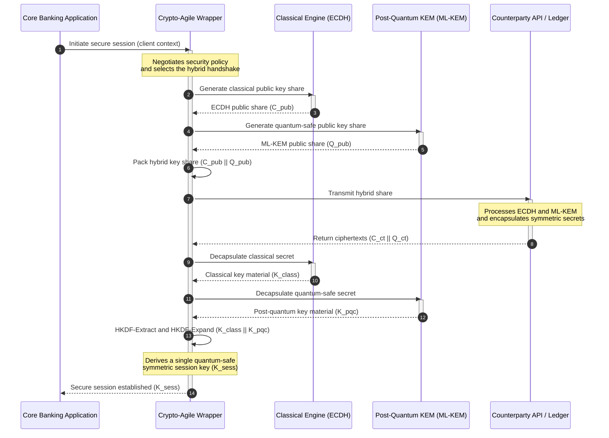

## A KyberLib és a posztkvantum banki migráció 2026-ban: a szabványoktól a kódig

A posztkvantum migráció megszűnt tervezési gyakorlat lenni. 2026-ban ez már aktív működési követelmény, és a kockázat ott húzódik, ahol a szabályozói szándék és a mérnöki megvalósítás közötti szakadék tátong. A [KyberLib ⧉](https://github.com/sebastienrousseau/kyberlib "kyberlib") ennek a szakadéknak egy részét zárja be: egy éles üzemre szánt, memóriabiztos Rust könyvtár, amely a véglegesített FIPS 203 paraméterek szerint valósítja meg az ML-KEM-et, és azokba a kriptoagilis határokba csomagolja, amelyekre egy bank tranzakciós rendszereinek valójában szüksége van.

---

> **Vezetői összefoglaló / Legfontosabb tanulságok**
>
> - **A fenyegetés már működik.** A támadók már ma is futtatnak "tárold most, fejtsd vissza később" jellegű begyűjtést; az adattitkosság visszamenőleg bukik meg azon a napon, amikor egy kriptográfiailag releváns kvantumszámítógép megjelenik.
> - **A szabványok véglegesek.** A NIST FIPS 203 (ML-KEM) és a FIPS 204 (ML-DSA) világos, tesztelhető viszonyítási pontot ad az auditbizottságoknak: már nincs "várunk a szabványokra" védekezés.
> - **A KyberLib a mérnöki tervrajz.** Memóriabiztos Rust, `no_std` fordítás HSM-ekhez és intelligens kártyákhoz, valamint hibrid kézfogási mintázatok, amelyek megőrzik a klasszikus együttműködési képességet.
> - **A kriptoagilitás a tartós cél.** A stabil absztrakciós határok lehetővé teszik a primitívek cseréjét alkalmazás-újraírás nélkül: ez az a tanulság, amely bármely egyedi algoritmust túlél.
> - **A felelősség az igazgatóságokat terheli.** A DORA 5. cikke személyes felelősséget ró az igazgatókra; az ellenőrizhető, megfigyelhető migrációs kód az a bizonyíték, amely ennek eleget tesz.
>
---

## Miért számít ez a nyílt forráskódú projekt 2026-ban

Ahogy az aszimmetrikus kriptográfia az elavulás felé közeledik, a fenyegetés nem várja meg, amíg egy kriptográfiailag releváns kvantumszámítógép elkészül. A támadók már most is végrehajtanak **"tárold most, fejtsd vissza később" (SNDL)** támadásokat: begyűjtik a vállalati banki tranzakciók, üzleti titkok és intézményi kommunikáció titkosított átviteli folyamait azzal a szándékkal, hogy visszafejtsék őket, amint a kvantumképességek beérnek. Egy bank számára minden ma a vezetéken átfutó klasszikus kézfogás egy titkossági jogsértés, késleltetett robbanási dátummal.

A szabályozók konkrét kötelezettségekkel válaszoltak:

1. A **DORA 6. cikke (IKT-kockázatkezelés)** megköveteli az intézményektől, hogy térképezzék fel, azonosítsák és mérsékeljék a sebezhetőségeket a teljes kriptográfiai rendszerükben, beleértve a köztes rétegekbe temetett aszimmetrikus kulcscserét is, amelyet senki sem leltározott fel.
2. A **NIST FIPS 203 és 204** rögzíti a kulcskapszulázás (ML-KEM) és a digitális aláírások (ML-DSA) hivatalos posztkvantum szabványait, szabványosított viszonyítási pontot adva az auditbizottságoknak, amelyhez a migráció előrehaladása mérhető.

Ennek a migrációnak az élő működés megzavarása nélküli végrehajtása azt kívánja, hogy túllépjünk a szakpolitikai dokumentumokon és **ellenőrizhető, nyílt forráskódú kriptográfiai infrastruktúrát** hozzunk létre. A [KyberLib ⧉](https://github.com/sebastienrousseau/kyberlib "kyberlib") pontosan ezt nyújtja: egy FIPS 203-nak megfelelő, memóriabiztos Rust könyvtárat, amely a posztkvantum átmenetet mérhető, ellenőrizhető mérnöki folyamattá alakítja, és a technológiai befektetésről szóló beszélgetést egy kézzelfogható ellenállóképesség-megtérülés (Return on Resilience) felé tereli.

## Az architektúra nézőpontja

A KyberLib stabil API-határok mögött helyezkedik el, elszigetelve a bank alapvető tranzakciós alkalmazásait az alacsony szintű kriptográfiai primitívek változásaitól.

| Réteg | Tervezési döntés | Miért számít | Kockázat helytelen kezelés esetén |
|---|---|---|---|
| **Primitív** | FIPS 203 ML-KEM kulcskapszulázás | A klasszikus Diffie-Hellman és RSA kulcscserét rács alapú struktúrákkal váltja fel | A véglegesített FIPS 203 paraméterekkel való meg nem felelés, ami sikertelen megfelelőségi auditokhoz vezet |
| **Nyelv** | Memóriabiztos Rust implementáció | Kiküszöböli a C/C++-ra jellemző memóriakorrupciós sebezhetőségeket (puffer-túlcsordulás, felszabadítás utáni használat) | Függőségburjánzás, amely veszélyezteti a build-lánc integritását |
| **Absztrakció** | Stabil, kriptoagilis határok | Az alkalmazások egységes interfész mögött cserélnek algoritmust, ahogy a szabványok fejlődnek | Beégetett primitívek, amelyek minden jövőbeli migrációnál kézi újraírást kényszerítenek ki |
| **Telepítés** | Hibrid titkosítási kézfogások | A posztkvantum KEM-eket a klasszikus algoritmusokkal ötvözi egy kettősen becsomagolt borítékban | A régi rendszerekkel való együttműködés elvesztése vagy csendes konfigurációs elcsúszás |
| **Bizonyosság** | SLSA 3. szintű származási igazolás és ellenőrizhető tesztek | Garantálja a kód forrását és eredetét; a példák sorról sorra auditálhatók | Biztonsági látszatkeltés: fekete doboz könyvtárak, amelyek implementációs hibái éles üzemben bukkannak fel |

## Nyomon követendő működési jelzések

A posztkvantum megfelelőség bizonyítása a felügyeleti testületeknek és a szabályozóknak azt jelenti, hogy konkrét, számszerűsíthető mutatókat követünk:

| Jelzés | Mutató | Szabályozói hivatkozás | Platform-megvalósítás |
|---|---|---|---|
| **FIPS 203 ML-KEM megfelelőség** | 100%-os megfelelés a véglegesített paramétereknek (ML-KEM-512/768/1024) | NIST FIPS 203 | A KyberLib moduljaiba fordított, paraméter-ellenőrzött rács alapú kriptográfia |
| **Kriptográfiai leltár** | Az aszimmetrikus kulcscsere-használat teljes leltára minden rendszerben | NIST SP 1800-38 | Automatizált szkennelő ügynökök, amelyek az aktív titkosítási készleteket egy központi nyilvántartásba naplózzák |
| **Hibrid kulcscsere** | A szállítási rétegű kézfogások aránya, amelyek hibrid borítékban futnak | DORA 6. cikk | Hálózati proxyk, amelyek a klasszikus TLS 1.3 kézfogásokat PQC kapszulázásba csomagolják |
| **`no_std` fordítás** | Rust standard könyvtár nélküli fordítás képessége korlátozott célrendszerekhez | DORA 30. cikk | Feltételes `no_std` fordítás a KyberLibben hardveres biztonsági modulokhoz |
| **Kriptoagilitási index** | A kriptográfiai primitív cseréjéhez szükséges idő percben az API-átjárón keresztül | UK PRA SS1/23 | Absztrahált útválasztási nyilvántartások, amelyek futásidejű változókon keresztül kezelik az algoritmusok kiosztását |

## Miért számít a Rust a posztkvantum kriptográfia szempontjából

Az olyan posztkvantum algoritmusok megvalósítása, mint az ML-KEM, összetett, alacsony szintű matematikai műveleteket igényel polinomgyűrűkön. Történetileg ezeknek a műveleteknek az éles sebességgel való futtatása kézzel írt C/C++ vagy assembly kódot jelentett: nagy támadási felületet a memóriakorrupció számára, pontosan abban a kódban, amelynek elrontását egy bank a legkevésbé engedheti meg magának.

A Rust három konkrét módon változtatja meg a kriptográfiai mérnöki munka biztonsági helyzetét:

1. **Fordításidejű memóriabiztonság.** A Rust tulajdonjogi modellje garantálja, hogy a puffer-túlcsordulások, a kétszeres felszabadítások és a felszabadítás utáni használat hibái már fordításkor megelőzhetők. Ez különösen fontos a posztkvantum könyvtárak esetében, ahol a kulcsméretek és a rejtjelezett szövegek jelentősen nagyobbak klasszikus megfelelőiknél.
2. **Determinisztikus, zéró költségű absztrakciók.** A Rust natív gépi kódra fordít szemétgyűjtő nélkül, így a végrehajtási sebesség és a memórialábnyom eléri vagy meghaladja a C alapú könyvtárakét, miközben megőrzi a biztonságot.
3. **`no_std` kompatibilitás.** A KyberLib a Rust standard könyvtára nélkül fordul, így korlátozott, csupasz vas környezetekben is fut, beleértve a hardveres biztonsági modulokat és az intelligens kártyákat is, a banki szintű kriptográfiát fizikai biztonsági határokon belül tartva.

## Kriptoagilis architektúra tervezése

A kriptográfiai migrációk klasszikus hibája a beégetés: az alkalmazáslogikába közvetlenül beépített, algoritmusspecifikus feltételezések, amelyeket minden átmenetnél fájdalmasan újra felfedeznek. A 2026-os tartós cél a **kriptoagilitás**: egy absztrakciós réteg, amely az algoritmusokat egy stabil interfész mögötti cserélhető modulokként kezeli, így a következő migráció konfigurációs változtatás, nem pedig a teljes rendszert érintő újraírás.

Az alábbi szekvencia bemutatja, hogyan koordinálja a KyberLib kriptoagilis csomagolója egy hibrid (klasszikus plusz posztkvantum) kulcscsere-kézfogást:

A hibrid boríték a működésileg fontos részlet. Amíg a posztkvantum primitívek nem gyűjtenek össze több évnyi éles üzemi vizsgálatot, a munkamenetkulcs mind a klasszikus, mind a posztkvantum titokból származik: a támadónak fel kell törnie az ECDH-t **és** az ML-KEM-et is a csatorna visszanyeréséhez. Azok a partnerek, akik nem migráltak, továbbra is működnek; akik igen, azonnal rács alapú védelmet nyernek.

## Az igazgatótanácsi kézikönyv

A posztkvantum biztonság nem háttérirodai titkosítási kérdés; ez egy igazgatótanácsi irányítási ügy, személyes tétekkel. A vezetőknek fiduciárius felelősségen keresztül kell keretezniük a migrációt:

- A **DORA 5. cikke (irányítás és szervezet)** az IKT-biztonságért való személyes felelősséget az igazgatótanácsra helyezi. A nyílt forráskódú, megfigyelhető tesztek a közvetlen bizonyítékok, amelyeket egy személyes felelősségi audit kér: a "kiválasztottunk egy ellenőrizhető FIPS 203 implementációt, és íme a megfelelőségi futtatásai" védhető válasz; a "a szállítónk biztosított minket" nem az.
- A **modellkockázat-kezelés (US Fed SR 11-7 / UK PRA SS1/23)** ugyanúgy vonatkozik a kriptográfiai csomagoló architektúrákra, mint az árazási modellekre. Az absztrakciós rétegeknek át kell menniük az MRM-validáláson, beleértve a rendkívüli fennakadási forgatókönyvek melletti teljesítményt is.
- A **Basel III működési kockázati tőke** jutalmazza a bizonyított kontrollérettséget. A tesztelt hibrid kézfogások csökkentik az intézmény hosszú távú működési kockázati profilját, mérséklik a tőkefelárat, és mérlegkapacitást szabadítanak fel az aktív treasury-bevetéshez.

## Mit jelent ez banktípusonként

### Globálisan rendszerszinten jelentős bankok (G-SIB-ek)

A G-SIB-ek régi rendszerekben gazdag tranzakciós állományokat üzemeltetnek, így a kötelező érvényű korlátjuk a feltárás: annak ismerete, hol történik ténylegesen az aszimmetrikus kulcscsere. A NIST SP 1800-38 iránymutatása szerinti folyamatos kriptográfiai leltárak jönnek először; a KyberLib ezután biztosítja a szabványosított, memóriabiztos könyvtárat a posztkvantum kulcskapszulázás végrehajtásához minden modern csomóponton, amelyet a leltár felszínre hoz.

### Tranzakciós és vállalati bankok

A fizetési útvonalak közötti titkosság a franchise lényege. Mivel a KyberLib csupasz vas `no_std` célrendszerekre fordul, a tranzakciós bankok közvetlenül a peremhálózati fizetési útválasztási és likviditáskezelési hardverbe telepíthetnek posztkvantum kézfogásokat, nem csak az alkalmazási rétegbe.

### Regionális és kisebb bankok

A regionális intézmények ugyanazzal az államilag támogatott begyűjtéssel néznek szembe, G-SIB kutatási költségvetés nélkül. Egy ellenőrizhető, nyílt forráskódú Rust implementáció azonnal kulcsrakész utat ad számukra a NIST FIPS 203 megfelelőséghez, fekete doboz szállítói ütemtervek megtárgyalása nélkül.

## Az ütemtervektől a lefordítható kódig

A posztkvantum átmenet aktív mérnöki feladat, és azok az intézmények tartják meg a felügyeletek, a partnerek és a vállalati treasurer-ök bizalmát 2026-on át, amelyek az elvont ütemtervektől a megfigyelhető, lefordítható kód felé lépnek. A vezetői megbízás ebből közvetlenül következik: auditálják a régi kulcscsere-pontokat, telepítsenek hibrid kézfogásokat a legnagyobb értékű csatornákon, és építsék ki azokat a stabil absztrakciós határokat, amelyek minden jövőbeli primitívcserét rutinszerűvé tesznek. A KyberLib mindegyik lépést mérhető működési képességgé teszi, nem pedig fóliázott ígéretté.

## Gyakran ismételt kérdések

**Megfelel-e a KyberLib a véglegesített NIST szabványoknak?**

Igen. A KyberLib az ML-KEM FIPS 203-ban véglegesített paraméterei köré épül, így a lefordított könyvtárat összhangban tartja a szövetségi és globális szabályozói elvárásokkal.

**Igényel-e egy posztkvantum könyvtár speciális hardvert?**

Nem. A KyberLib Rust implementációja standard rendszerarchitektúrákra fordul. `no_std` képessége ráadásul lehetővé teszi, hogy speciális hardveres biztonsági modulokon és intelligens kártyákon fusson, ahol fizikai kulcsőrzésre van szükség.

**Hogyan érinti a "tárold most, fejtsd vissza később" a jelenlegi megfelelőséget?**

Ha a szállítási réteg klasszikus RSA-ra vagy ECC-re támaszkodik, a támadók ma begyűjthetik a forgalmat, és visszafejthetik, amint a kvantumképesség beérik. A most telepített hibrid kulcscsere rács alapú védelem mögött tartja a rögzített adatokat.

**Miért hibrid kézfogások a posztkvantum primitívekre való közvetlen áttérés helyett?**

A hibrid borítékok a munkamenetkulcsot mind egy klasszikus, mind egy posztkvantum titokból származtatják, így a biztonság addig áll fenn, amíg mindkettőt fel nem törik. Ez megőrzi az együttműködési képességet a nem migrált partnerekkel, miközben az új primitívek éles üzemi vizsgálatot gyűjtenek.

## Hivatkozások

- National Institute of Standards and Technology, (2024). [FIPS 203: Module-Lattice-Based Key-Encapsulation Mechanism Standard ⧉](https://www.nist.gov/news-events/news/2024/08/nist-releases-first-3-finalized-post-quantum-encryption-standards "NIST FIPS 203 announcement").
- Board of Governors of the Federal Reserve System, (2011). [Supervisory Guidance on Model Risk Management (SR Letter 11-7) ⧉](https://www.federalreserve.gov/supervisionreg/srletters/sr1107.htm "Federal Reserve SR 11-7").
- European Parliament and Council of the European Union, (2022). [Regulation (EU) 2022/2554 on digital operational resilience for the financial sector (DORA) ⧉](https://eur-lex.europa.eu/legal-content/EN/TXT/?uri=CELEX%3A32022R2554 "DORA Regulation").
- NIST National Cybersecurity Center of Excellence, (2025). [Migration to Post-Quantum Cryptography (NIST SP 1800-38) ⧉](https://www.nccoe.nist.gov/projects/migration-post-quantum-cryptography "NIST SP 1800-38").
- GitHub, (2026). [kyberlib open-source repository ⧉](https://github.com/sebastienrousseau/kyberlib "kyberlib repository").
