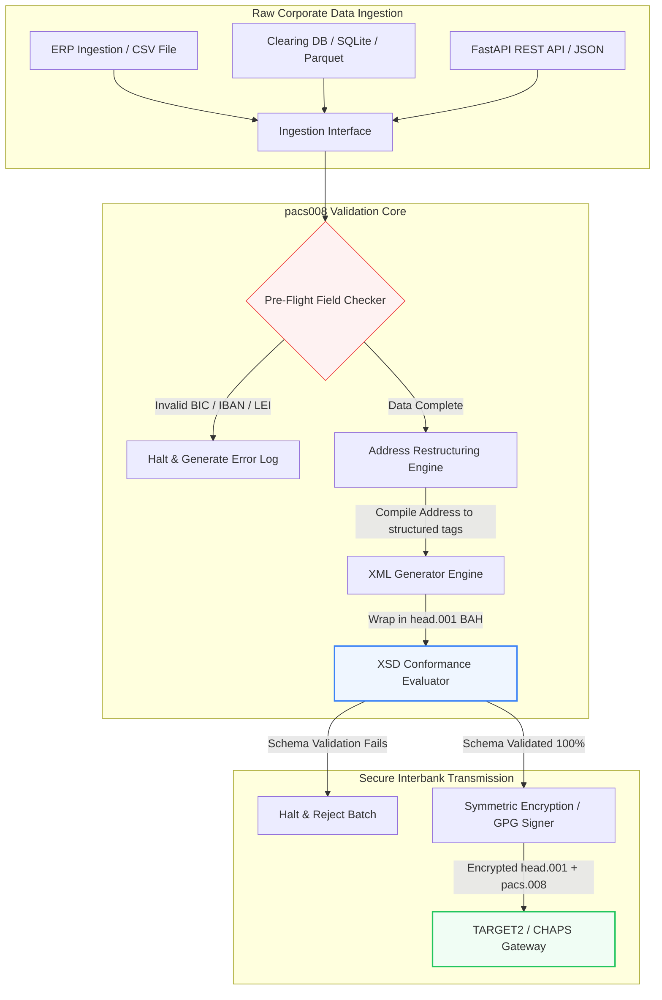

## ISO 20022 pacs.008 bankközi fizetések automatizálása nyílt forráskódú Pythonnal 2026-ban

A régi pénzügyi adatok és a strukturált bankközi üzenetküldés közötti szakadék áthidalása egy auditálható, sémavalidált Python-folyamaton keresztül.

Ennek a cikknek a nyílt forráskódú kiindulópontja a [pacs008 ⧉](https://github.com/sebastienrousseau/pacs008 "pacs008 — nyílt forráskódú Python-könyvtár"). A repozitóriumot úgy pozicionáljuk, mint egy Python-könyvtárat az [ISO 20022](/2023-09-29-automating-iso-20022-compliant-payment-file-creation-with-pain001/index.html) pacs.008 FI-to-FI ügyfélátutalási XML-üzenetek automatizálására.

## Miért fontos ez a nyílt forráskódú projekt 2026-ban

A globális bankközi fizetési elszámolási infrastruktúra közel fél évszázad legmélyrehatóbb modernizációján megy keresztül.

2026 júniusában a pénzügyi szolgáltatási szektor gyorsan közeledik a **2026. november 14-i SWIFT strukturált cím határvonalához**. Ettől a naptól kezdve a SWIFT CBPR+ irányelvek, valamint a TARGET2, a CHAPS, a Fedwire és a kanadai Lynx hivatalosan kivonják a forgalomból a strukturálatlan postai címsorokat (amelyek csak `<AdrLine>` elemeket használnak a `<PstlAdr>` blokkokon belül). Minden résztvevő pénzügyi intézménynek a címeket vagy hibrid formátumban (strukturált `<TwnNm>` és `<Ctry>`, legfeljebb két `<AdrLine>` elemmel a fennmaradó részletekhez), vagy teljesen strukturált formátumban (különálló elemek az utcanévhez, a házszámhoz és az irányítószámhoz) kell továbbítania. Bármely üzenet, amely nem felel meg ennek a kritériumnak, elutasításra kerül a hálózat határán.

A pénzügyi intézmények számára ez az átmenet jelentős működési korlátokat teremt:

1. **A határon történő elutasítás büntetése.** Azok a fizetések, amelyek nem felelnek meg a strukturált cím kritériumainak, azonnali hálózati elutasítással szembesülnek, ami tranzakciós késedelmeket, likviditási blokkolásokat és működési torlódásokat vált ki.
2. **SEPA kedvezményezett-ellenőrzés (Verification of Payee, VoP).** Előírja, hogy a SEPA-övezeten belüli összes fizetési szolgáltatónak (PSP) az átutalások végrehajtása előtt ellenőriznie kell a kedvezményezett neve és IBAN-ja közötti egyezést, ami egy további validációs kaput ad az üzenet kezdeményezéséhez.

A [Pacs008](https://github.com/sebastienrousseau/pacs008) megoldja ezt a problémát. Ez egy nyílt forráskódú, könnyűsúlyú Python-könyvtár, amely automatizálja a nyers pénzügyi adatok teljesen validált, sémakompatibilis ISO 20022 pacs.008 bankközi ügyfélátutalási üzenetekké alakítását. Azáltal, hogy áthidalja a régi és a strukturált adatok közötti szakadékot, a pacs008 magas ellenállóképesség-megtérülést (Return on Resilience, RoR) biztosít, megőrzi a forgótőkét és biztosítja a valós idejű végrehajtást a globális rendszereken keresztül.

## Miért így építettem meg a pacs008-at

Én írtam a `pacs008`-at és annak felmenő testvérét, a `pain001`-et, és a
munkásságomat a nagyértékű fizetéseknek és az API-termékmenedzsmentnek szentelem.
Ez a kombináció magyarázza, miért így néz ki ez a könyvtár, ezért érdemes a
döntéseket kimondani ahelyett, hogy a kódban maradnának burkoltan.

**A validáció a generálás előtt fut, nem utána.** A legtöbb fizetési
rendszerkörnyezetben az ösztön az, hogy előbb elkészül az üzenet, azután
ellenőrzik, mert így van kialakítva az átvizsgálási folyamat: elkészül egy
állomány, valaki megnézi, a kivételek sorba kerülnek. Ez a sorrend garantálja,
hogy a hibák a legkisebb hatásfokú ponton derüljenek ki — miután az üzenet
összeállítása már megtörtént, és gyakran azután, hogy elhagyta az intézményt. Ha
előbb validálunk, akkor a nem megfelelő cím vagy a hibás IBAN build-hiba lesz,
nem hálózati elutasítás.

**A licenc MIT, mert a bankoknak olvasniuk kell a validációs logikát, nem
megbízniuk benne.** Egy zárt validátor azt kéri az intézménytől, hogy jóhiszeműen
fogadja el valaki más olvasatát a használati útmutatókról. Ezt nem ésszerű kérni
egy csapattól, amely a szabályozói kötelezettséget viseli. E könyvtár minden
szabálya megvizsgálható, vitatható és forkolható.

**A validáció a hivatalos XSD-sémák ellen történik, nem újraimplementálva.** Az
ISO 20022 szabályainak kézzel írt közelítése attól a pillanattól elsodródik a
hálózat tényleges szerződésétől, hogy bármelyik fél változik. A sémák a
szerződés; minden más egy második igazságforrás, amely csak arra vár, hogy
ellentmondjon.

**A CI-t célozza, nem egy átvizsgálási lépést.** Az a validátor, amelynek
futtatására egy embernek emlékeznie kell, az a validátor, amelyet határidős
nyomás alatt már nem futtatnak — vagyis épp akkor nem, amikor a legfontosabb.

Az is éppúgy szándékos, amit a könyvtár tudatosan nem csinál. Ez egy
üzenetrétegbeli eszközkészlet. Nem helyettesít fizetési motort, szankciószűrő
rendszert, sem az ügyféltörzsadatok rendbetételét, amelyet az intézménynek a
forrásnál kell elvégeznie. Számonkérhetővé teszi ezt a rendbetételt; nem végzi el
Ön helyett.

## A pacs008 2026-os architektúrája

A pacs008 könyvtár egy elszigetelt validációs és generáló motorként épül fel, biztosítva, hogy a nyers bemenetek szisztematikusan elemzésre, gazdagításra és szabványos borítékokba csomagolásra kerüljenek:

| Réteg | Tervezési döntés | Miért fontos | Kockázat helytelen kezelés esetén |
|---|---|---|---|
| **Bemeneti réteg** | CSV, JSON, SQLite és Parquet befogadása | Ott találkozik a banki integrációs csapatokkal, ahol az adataik már megtalálhatók, elkerülve a platformmigrációkat. | Nyers, validálatlan vagy sérült adatcsomagok befogadása. |
| **Validációs réteg** | Előzetes validálás a hivatalos XSD-sémákkal és egyedi üzleti szabályokkal szemben | Megállítja a végrehajtást és jelzi a hibákat, mielőtt a fizetési fájl az elszámolási hálózatra kerülne. | Érvénytelen XML-fájlok, amelyek azonnali hálózati elutasításokat és elszámolási késedelmeket váltanak ki. |
| **BAH borítékréteg** | Automatikus Business Application Header (head.001) becsomagolás | Szabványosítja az üzenettovábbítást és útválasztást a `<MsgDefIdr>` címke alapján. | Nyers pacs.008 csomagok továbbítása a szükséges külső boríték nélkül, ami rendszerszintű elutasítást okoz. |
| **Szerializációs réteg** | Szabványos XML és ISO-kompatibilis JSON (TS 23029) támogatás | Lehetővé teszi a közvetlen fordítást az XML- és JSON-csomagok között, támogatva a modern REST API-kat és a Kafka-streamelést. | Töredezett adatábrázolások, amelyek sértik a hivatalos ISO-irányelveket. |
| **Megfigyelhetőségi réteg** | UETR-alapú OpenTelemetry nyomkövetés | Rögzíti a részletes végrehajtási útvonalakat és naplókat, valós idejű auditálhatóságot biztosítva. | Nyomkövetési hiányosságok, amelyek gátolják a működési átláthatóságot és az auditálást. |

## Kulcsfontosságú bankközi jelzések és szabályozási mérföldkövek

A tranzakciós működési ellenállóképesség bizonyításához a vezető technológiai és kockázatkezelési vezetőknek konkrét, számszerűsíthető megfelelőségi mutatókat kell nyomon követniük:

| Jelzés | Mérőszám / működési benchmark | G20 / SWIFT / DORA hivatkozás | Technikai platform megvalósítása |
|---|---|---|---|
| **Strukturált cím megfelelősége** | A teljesen strukturált `<PstlAdr>` mezőket kijelölt `<TwnNm>` és `<Ctry>` elemekkel használó pacs.008 üzenetek %-a. | SWIFT SR 2026 határidő | Előzetes sémaellenőrzések a pacs008-ban, amelyek elutasítják a strukturálatlan címsorokat. |
| **SEPA kedvezményezett-ellenőrzés** | A kedvezményezett neve és IBAN-ja közötti egyezés validálása az üzenet végrehajtása előtt. | SEPA VoP-rendelet | Beépített VoP segédosztályok, amelyek előzetes validációs lekérdezéseket futtatnak az IBAN/BIC alapján. |
| **BAH head.001 integráció** | A kimenő fizetési csomagok azon százaléka, amelyeket sikeresen becsomagoltak Business Application Headerekbe. | TARGET2 / CBPR+ irányelvek | BAH-becsomagoló alrendszer, amely automatikusan összeállítja a külső XML-borítékot. |
| **LEI modulo ellenőrző összeg** | ISO 7064 Modulo 97-10 ellenőrző számjegy validálása az adós és a hitelező `<LEI>` blokkjain. | Bank of England előírás | Algoritmikus ellenőrző, amely igazolja a 20 karakteres azonosító integritását. |
| **UETR nyomkövetési pontosság** | A generált fizetések 100%-a érvényes Unique End-to-End Transaction Reference-szel ellátva. | SWIFT UETR specifikációk | A 36 karakteres UUIDv4 hivatkozási kód automatikus generálása és nyomkövetése. |

## Miért a Python az ideális belépési pont a bankközi automatizáláshoz

A modern fizetési csomópontok és a treasury-műveletekkel foglalkozó csapatok 2026-ban nagymértékben támaszkodnak a Pythonra az adattranszformációhoz, a pénzügyi modellezéshez és az ERP-adatbázis-integrációhoz.

Egy nyílt forráskódú Python-könyvtár kihasználásával az intézmények jelentős előnyökre tesznek szert:

1. **Alacsony kognitív terhelés és magas interoperabilitás.** A Python összefüggő hídként működik. Lehetővé teszi a fejlesztők számára, hogy egyszerű szkripteket írjanak, amelyek nyers fizetési utasításokat húznak ki a régi adatbázisokból, validálják azokat összetett nemzetközi banki szabályok alapján, és megfelelő XML-t állítanak elő egyetlen, egységes munkafolyamaton belül.
2. **A "fekete doboz" átláthatatlan fordítók kiküszöbölése.** A szabadalmaztatott banki portálok gyakran magas licencdíjakat számítanak fel egyedi fizetésifájl-fordítókért. Ezek a fordítók szabadalmaztatott fekete dobozok, ami lehetetlenné teszi a biztonsági csapatok számára annak auditálását, hogy hogyan dolgozzák fel az adatokat, vagy hol tárolják a kulcsokat. Egy nyílt forráskódú, ellenőrizhető könyvtár, mint a pacs008, teljes kódátláthatóságot biztosít.
3. **Zökkenőmentes CI/CD-integráció.** A pacs008 közvetlenül integrálódik a folyamatos integrációs és telepítési folyamatokba, lehetővé téve a fejlesztők számára, hogy a fizetési fájlok tesztelését szabványos szoftverleszállítási életciklusuk részeként automatizálják.

## Egy körülhatárolt bankközi folyamat tervezése

A bankközi elszámolás egyik fő sebezhetősége a "kontrollálatlan kötegelt generálás": fájlok generálása egyértelmű, körülhatárolt ellenőrzési hurok nélkül. A pacs008 úgy lett megtervezve, hogy egy szigorúan kontrollált, többfázisú tranzakciós folyamat központi validációs motorjaként működjön.

Az alábbi működési folyamat bemutatja, hogyan halad át a nyers tranzakciós adat a pacs008 folyamaton, hogy egy kriptográfiailag biztonságos, sémakompatibilis pacs.008 fájlt hozzon létre, BAH-borítékba csomagolva:

## Az igazgatótanácsi kézikönyv és a bizalmi felelősség

A bankközi fizetési automatizálás igazgatótanácsi szintű kockázatkezelési és vállalatirányítási kérdés. A vezető menedzsereknek a tranzakciós adatminőséget a bizalmi felelősség és a működési kockázat csökkentésének lencséjén keresztül kell kezelniük:

- **DORA 5. cikk (igazgatótanácsi elszámoltathatóság).** Közvetlen, személyes felelősséget ró az igazgatótanács tagjaira az intézmény IKT-műveleteinek ellenállóképességéért és biztonságáért. Mivel a bankközi elszámolás kritikus vállalati funkció, az igazgatótanácsoknak bizonyítaniuk kell, hogy robusztus, validált és automatizált tranzakciós kontrollokat vezettek be a működési zavarok vagy a késedelmes fizetések megelőzésére.
- **BCBS 239 (kockázati adatok aggregálása és jelentése).** Megköveteli, hogy a pénzügyi tranzakciós jelentés pontos, teljes és valós időben előállított legyen. A pacs008 segít az intézményeknek elérni a BCBS 239 megfelelőséget azáltal, hogy biztosítja a fizetési adatok tiszta strukturálását és validálását a forrásnál, kiküszöbölve azokat az adathiányokat és kézi egyeztetési hibákat, amelyek a régi táblázatokat sújtják.
- **A működési kockázati tőkekövetelmények mérséklése (Basel III).** A Basel III irányelvek szerint a magas fizetési hibaarányok és a kézi beavatkozás többletköltsége növeli a bank működési kockázati tőkekövetelményeit, lekötve azt a tőkét, amelyet egyébként hitelezésre vagy befektetésre lehetne fordítani. A fizetési folyamat automatizálása közvetlenül minimalizálja ezeket a tőkefelárakat, megőrizve a mérleg értékét.

## Mit jelent ez banktípusonként

### Globálisan rendszerszinten jelentős bankok (G-SIB-ek)

A G-SIB-ek hatalmas, határokon átnyúló vállalati tranzakciós volumeneket kezelnek. Elsődleges kihívásuk a strukturálatlan régi adatok helyreállítása, mielőtt azok az elszámolási hálózatra kerülnének. A pacs008 vállalati banki átjáróikba történő integrálásával a G-SIB-ek automatizált validációs segédeszközöket biztosíthatnak vállalati ügyfeleiknek, csökkentve a kézi fizetésjavítások többletterhét és biztosítva a valós idejű végrehajtást a SWIFT-hálózaton keresztül.

### Tranzakciós és vállalati bankok

A tranzakciós bankok számára a fizetési adatok minősége versenyelőnyt jelentő megkülönböztető tényező. Egy nyílt forráskódú, ellenőrizhető validációs eszköz, mint a pacs008, vállalati treasury-ügyfelek számára történő felkínálásával ezek a bankok felgyorsíthatják a bevezetést, minimalizálhatják a fizetésifájl-elutasításokat, és bizalmat építhetnek az ügyfelekben a kiváló straight-through processing arányokon keresztül.

### Regionális és kisebb bankok

A regionális bankoknak fenn kell tartaniuk a nemzetközi fizetési szabványoknak való megfelelést a G-SIB-ek hatalmas technológiai költségvetése nélkül. A pacs008 könnyűsúlyú, költséghatékony és teljesen megfelelő Python-alapú megoldást kínál, lehetővé téve a kisebb intézmények számára, hogy modern, strukturált fizetéskezdeményezési képességeket kínáljanak drága, szabadalmaztatott köztes szoftverlicencek nélkül.

## Következtetés: a bankközi elszámolás ütemterve

A közelgő 2026. novemberi SWIFT strukturált cím határidő kemény határt jelent a vállalati treasury-műveletek számára. A régi táblázatokra, a kézi adatbevitelre és a strukturálatlan fizetési fájlokra való támaszkodás aktív üzleti kockázat.

A tranzakciós folytonosság biztosítása és a működési többletterhek minimalizálása érdekében a vezető technológiai és pénzügyi menedzsereknek már ma egy egyértelmű elszámolási ütemtervet kell végrehajtaniuk:

1. **Kényszerítsd ki a validációt a forrásnál.** Írd elő, hogy minden fizetési utasítás validálva és formázva legyen a hivatalos ISO 20022 XSD-sémák szerint, mielőtt elhagyja a vállalati ERP-határokat.
2. **Auditáld az adatfolyamot.** Térj át a kézi táblázatkezelésről, és vezess be automatizált, ellenőrizhető Python-alapú munkafolyamatokat a pacs008 használatával.
3. **Vezess be hibrid biztonságot.** Biztosítsd, hogy a generált fizetési fájlok kriptográfiailag alá legyenek írva és titkosítva a továbbítás előtt, kielégítve a zero-trust hálózati elvárásokat.
4. **Igazodj a bizalmi prioritásokhoz.** Hivatalosan jelentsd a fizetési automatizálási és adatminőségi mutatókat az igazgatótanácsnak, a befektetést a DORA szerinti kritikus működési kockázatcsökkentő programként keretezve.

## Gyakran ismételt kérdések

**Megfelel a pacs008 a közelgő SWIFT SR 2026 címszabályoknak?**

Igen. A pacs008 úgy lett megtervezve, hogy támogassa a szigorú 2026. novemberi SWIFT strukturált cím mérföldkövet, kikényszerítve a postai címelemek (város, ország, irányítószám) kötelező szétválasztását kijelölt ISO 20022 XML-mezőkbe.

**Be tudja csomagolni a pacs008 a fizetési csomagokat Business Application Headerekbe?**

Igen. Mivel a pacs008 natívan támogatja a Business Application Header (BAH head.001) becsomagolást, automatikusan összeállítja a TARGET2, a CHAPS és a CBPR+ hálózatok által megkövetelt külső borítékot.

**Miért előnyösebb egy nyílt forráskódú könyvtár a szabadalmaztatott fájlfordítókkal szemben?**

A szabadalmaztatott fordítók átláthatatlan fekete dobozok, ami lehetetlenné teszi a biztonsági auditokat. Egy nyílt forráskódú, szakértők által felülvizsgált könyvtár, mint a pacs008, teljes kódátláthatóságot kínál, lehetővé téve a biztonsági csapatok számára annak igazolását, hogy a feldolgozás során nem kerül ki érzékeny fizetési adat.

**Milyen azonosítókat validál a pacs008?**

A pacs008 beépített validátorokkal érkezik a bankazonosító kódokhoz (BIC-ekhez) és a jogalany-azonosítókhoz (LEI-ekhez), ISO 7064 Modulo 97-10 ellenőrző összeg számításokat használva, valamint IBAN ellenőrző számjegy validálással és UETR egyediségi ellenőrzésekkel.

## Hivatkozások

- SWIFT, (2024). *ISO 20022 November 2026 Structured Address Milestone*. La Hulpe: SWIFT. Elérhető: [SWIFT ISO 20022 mérföldkő ⧉](https://www.swift.com/standards/iso-20022/iso-20022-bytes/call-action-november-2026 "SWIFT ISO 20022 mérföldkő").
- Basel Committee on Banking Supervision (BCBS), (2013). *Principles for effective risk data aggregation and risk reporting (BCBS 239)*. Basel: Bank for International Settlements. Elérhető: [BCBS 239 alapelvek ⧉](https://www.bis.org/publ/bcbs239.htm "BCBS 239 alapelvek").
- European Parliament and Council of the European Union, (2022). *Regulation (EU) 2022/2554 on digital operational resilience for the financial sector (DORA)*. Brussels: Official Journal of the European Union. Elérhető: [DORA-rendelet ⧉](https://eur-lex.europa.eu/legal-content/EN/TXT/?uri=CELEX%3A32022R2554 "DORA-rendelet").
- GitHub, (2026). *pacs008 open-source repository*. Elérhető: [pacs008 repozitórium ⧉](https://github.com/sebastienrousseau/pacs008 "pacs008 repozitórium").
