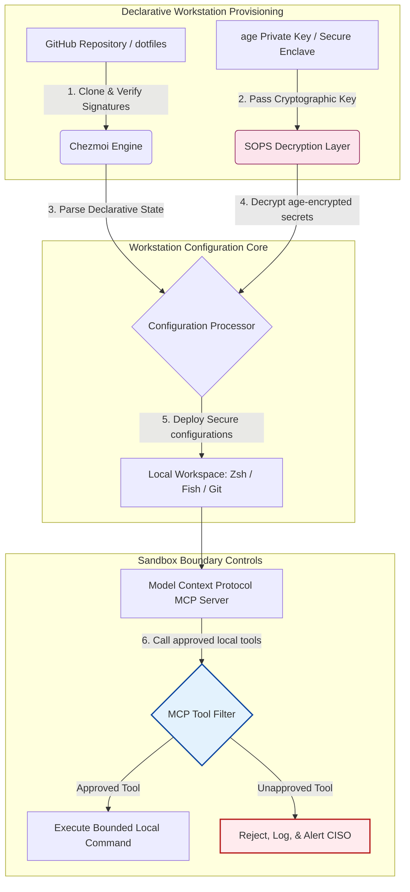

## MI-tudatos dotfiles 2026-ban: biztonságos, reprodukálható fejlesztői munkaállomás építése MCP-hez, SLSA-hoz és több shell közötti paritáshoz

A deklaratív munkaállomás-konfiguráció és a biztonságos szoftverellátási láncok közötti szakadék áthidalása a helyi MI-modellek és az ügynöki fejlesztőeszközök korában.

E cikk nyílt forráskódú viszonyítási pontja a [dotfiles ⧉](https://github.com/sebastienrousseau/dotfiles "dotfiles — deklaratív munkaállomás-konfiguráció"). A tárolót így pozicionálják: deklaratív dotfiles macOS, Linux és WSL rendszerekre, amely több shell közötti paritást, másodperc alatti indulást, SLSA-val aláírt kiadásokat és MI/MCP-tudatos konfigurációt kínál.

## Miért fontos ez a nyílt forráskódú projekt 2026-ban

2026 júniusában a fejlesztői munkaállomás a szoftverellátási lánc leggyengébb láncszeme, és nagy értékű célpont a kifinomult, államilag támogatott és bűnözői kiberszindikátusok számára.

A fejlesztői környezet biztonsági környezete gyökeresen megváltozott a terminálalapú MI-kódolási asszisztensek (például a Claude Code) térnyerésével és a Model Context Protocol (MCP) elterjedésével. A helyi fejlesztői terminálok immár aktív, autonóm MI-ügynököket üzemeltetnek, amelyek képesek:

- Helyi forrásfájlok olvasására és szerkesztésére.
- Helyi CLI-eszközök (`git`, `npm`, `aws`, `kubectl`) meghívására.
- A shell környezeti változóinak, a helyi adatbázisoknak és a konfigurációs beállításoknak a vizsgálatára.

Ha a fejlesztő helyi környezetéből hiányoznak a szigorú határok, ezek az autonóm MI-eszközök véletlenül érzékeny személyes adatokat olvashatnak be, felhős hitelesítő adatokat szivárogtathatnak nyilvános LLM-API-kba, vagy rosszindulatú csomagokat futtathatnak az automatizált buildek során.

A digitális működési ellenállóképességről szóló rendelet (DORA) és a NIST Cybersecurity Framework (CSF) 2.0 értelmében a pénzügyi intézmények jogszabályban kötelesek ellenőrizni a szoftverellátási láncot elérő minden eszköz eredetét és biztonsági integritását. A "hópehely-laptopok", vagyis a kézzel konfigurált, ellenőrizetlen, elsodródó konfigurációk többé nem felelnek meg a globális banki szabványoknak.

A [Sebastien Rousseau Dotfiles projektje](https://github.com/sebastienrousseau/dotfiles) megoldja ezt a problémát. Ez egy nyílt forráskódú, deklaratív munkaállomás-kezelő keretrendszer, amely biztonságos, reprodukálható fejlesztői munkaállomásokat hoz létre. Egy szabványosított, auditálható konfigurációs alapvonal kikényszerítésével a projekt magas ellenállóképesség-megtérülést (RoR) biztosít, a fejlesztők beállási idejét hetekről órákra csökkenti, és megvédi az érzékeny pénzügyi ellátási láncokat a végponti sebezhetőségektől.

## A MI-tudatos munkaállomás 2026-os architektúrájának nézőpontja

A dotfiles keretrendszer biztonságos, deklaratív környezetkezelőként működik: minden helyi shell, eszköz és titok szisztematikusan kezelt, auditált és elszigetelt:

| Réteg | Tervezési döntés | Miért számít | Kockázat helytelen kezelés esetén |
|---|---|---|---|
| **Kiépítési réteg** | Deklaratív konfigurációkezelés Chezmoi révén | Teljesen reprodukálható munkaállomásokat épít macOS, Linux és WSL rendszereken, kiküszöbölve az elsodródást. | Hópehely-konfigurációk ellenőrizetlen, sebezhető helyi állapotokkal. |
| **Shell réteg** | Több shell közötti paritás (Zsh, Fish, Nushell) | Azonos, másodperc alatti indulást és következetes aliasviselkedést biztosít a különböző környezetekben. | Shell-parancsok közötti eltérések, amelyek váratlan szkriptkimenetekhez vezetnek. |
| **Titok réteg** | Fájltitkosítás SOPS és age használatával | Megakadályozza, hogy beégetett hitelesítő adatok és nyers kulcsok kerüljenek a Gitbe vagy jussanak a helyi LLM-ekhez. | Nyilvános tárolóelőzményekbe szivárgott vagy helyi ügynökök által kompromittált hitelesítő adatok. |
| **MI/MCP réteg** | Model Context Protocol határvezérlés | A helyi MI-ügynököket egy jóváhagyott eszközlistára korlátozza, és naplózza az összes helyi végrehajtást. | Korlátlan MI-ügynökök, amelyek elszabadult vagy romboló parancsokat futtatnak helyben. |
| **Ellátási lánc réteg** | SLSA-val aláírt kiadások és Sigstore-ellenőrzés | Kriptográfiailag bizonyítja a bootstrap-szkriptek és konfigurációs fájlok hitelességét. | Kompromittált beállítószkriptek, amelyek rosszindulatú hátsó ajtókat juttatnak a fejlesztői környezetekbe. |

## A munkaállomás-biztonság és -automatizálás kulcsjelzései

Ahhoz, hogy a fejlesztői eszközpark teljes biztonsága fennmaradjon, az információbiztonsági vezetőknek (CISO-k) és a technológiai vezetőknek konkrét, számszerűsíthető működési mutatókat kell nyomon követniük:

| Jelzés | Metrika / működési viszonyítási alap | NIST CSF / DORA hivatkozás | Technikai platform megvalósítása |
|---|---|---|---|
| **Munkaállomás reprodukálhatósága** | A deklaratív dotfile-tárolókon keresztül, konfigurációs elsodródás nélkül teljesen kezelt fejlesztői laptopok aránya. | NIST CSF 2.0 (PR.DS-01) | Chezmoi elsodródás-észlelési auditok, amelyek automatikusan lefutnak a terminál indulásakor. |
| **Hitelesítőadat-higiénia** | Nulla titkosítatlan titok vagy kulcs tárolása egyszerű szövegként a helyi konfigurációs fájlokban. | DORA 6. cikk (IKT-biztonság) | Git pre-commit hookok és helyi ellenőrzések, amelyek elutasítják a titkosítatlan fájlokat. |
| **Build eredetigazolás** | A munkaállomás-bootstrap segédprogramok 100%-a kriptográfiailag aláírt manifesztekkel ellenőrizve. | DORA 30. cikk (ellátási lánc) | Sigstore és SLSA 3. szintű ellenőrzés beépítve a beállítási folyamatokba. |
| **Fejlesztői beállási idő** | A nyers hardver kiépítésétől a teljesen konfigurált, megfelelő fejlesztői munkaterületig eltelt idő. | Ellenállóképesség megtérülése (RoR) | Automatizált, deklaratív beállítószkriptek, amelyek 15 percen belül összeállítják a környezetet. |
| **MI-ügynök korlátozott hozzáférése** | Annak ellenőrzése, hogy a helyi MI-eszközök meghatározott könyvtárhatárokon belül, alapértelmezetten csak olvasható módban működnek. | Modellkockázat-kezelés | MCP konfigurációs profilok, amelyek az ügynökök eszközkatalógusát a jóváhagyott műveletekre korlátozzák. |

## Miért a deklaratív konfiguráció a munkaállomás-biztonság magja

A fejlesztői munkaállomások beállításának hagyományos megközelítései erősen manuálisak, ami "hópehely-laptopokat" eredményez: olyan környezeteket, ahol a konfigurációk idővel elsodródnak, ahogy a fejlesztők egyedi eszközöket telepítenek, változókat módosítanak, és helyi szkripteket szerkesztenek. Ez az elsodródás számos kritikus sebezhetőséget teremt:

1. **Nyomon nem követett árnyékkonfigurációk.** Az elsodródó laptopok gyakran elavult, sebezhető szoftvercsomagokat vagy helyi szkripteket futtatnak, amelyek megkerülik a vállalati biztonsági eszközöket.
2. **Titkok kiszivárgása.** A fejlesztők gyakran égetik be az API-kulcsokat, GitHub-tokeneket vagy AWS hitelesítő adatokat közvetlenül egyszerű szöveges szkriptekbe vagy shell-profilokba, ami rendkívül sebezhetővé teszi őket a lopással szemben.
3. **Nem hatékony beállás.** Egy új fejlesztői munkaállomás manuális beállítása akár két hét mérnöki időt is igénybe vehet, ami rontja a csapat sebességét.

A Chezmoi révén megvalósított deklaratív, modellalapú konfigurációra való átállással a teljes fejlesztői munkaterület verziókövetett, reprodukálható, hiteles rendszerré válik. Minden változás, alias, csomagfüggőség és biztonsági alapérték dokumentálva van a Gitben, ellenőrzött a szervezeti megfelelőségi szabályzatokkal szemben, és kriptográfiailag hitelesített, mielőtt a fizikai laptopra alkalmaznák.

## Korlátozott MI-fejlesztői környezet tervezése

Ahhoz, hogy a helyi MI-ügynökök és MCP-eszközök ne szerezhessenek korlátlan hozzáférést a helyi eszközökhöz, a munkaállomásnak korlátozott végrehajtási síkként kell működnie.

Az alábbi működési folyamat bemutatja, hogyan koordinálja a dotfiles keretrendszer a Chezmoit, a SOPS-t és az age-t a biztonságos dotfiles visszafejtéséhez és telepítéséhez, miközben elszigetelt, sandboxolt végrehajtási határt tart fenn az MCP-eszközöket hívó helyi MI-ügynökök számára:

## Az igazgatótanácsi kézikönyv és a vagyonkezelői felelősség

A fejlesztői munkaállomás-biztonság és az ellátási lánc integritása kritikus igazgatótanácsi prioritások. A felsővezetőknek a fejlesztői környezet kockázatát a vagyonkezelői felelősség, a szabályozási megfelelőség és az üzleti érték megőrzésének szemszögéből kell kezelniük:

- **DORA 5. cikk (igazgatótanácsi elszámoltathatóság).** Előírja, hogy a vezető testület (az igazgatótanács) viseli a végső felelősséget az intézmény IKT-kockázatkezeléséért. Mivel a fejlesztői munkaállomások a szoftverellátási lánc kapui, az igazgatótanács tagjainak ellenőrizniük kell, hogy a végpontok biztonságosak, teljesen auditálhatók, és szigorú, reprodukálható konfigurációs keretrendszerek alatt kezeltek, hogy megfeleljenek a szabályozói auditoknak.
- **NIST CSF 2.0 megfelelőség (végpontbiztonság).** Megköveteli, hogy csak engedélyezett és hitelesített eszközök férjenek hozzá a vállalati hálózatokhoz és tárolókhoz, amelyek szabványosított, biztonságos konfigurációkat futtatnak. A deklaratív dotfiles lehetővé teszi a biztonsági csapatok számára, hogy matematikailag bizonyítsák: minden fejlesztői környezet megfelel a szervezet biztonsági alapvonalának, kiküszöbölve az ellenőrizetlen "hópehely"-beállítások kockázatát.
- **A mérlegfőösszeg értékének megőrzése.** Egyetlen kompromittált fejlesztői hitelesítő adat vagy ellátási lánc elleni támadás dollármilliókba kerülhet egy intézménynek helyreállítás, szabályozási bírságok és jó hírnév romlása formájában. A biztonságos, deklaratív fejlesztői környezetre való átállás közvetlenül minimalizálja ezt a kockázatot, megőrzi a mérlegfőösszeg értékét és védi az ügyfelek bizalmát.

## Mit jelent ez banktípusonként

### Globális rendszerszinten jelentős bankok (G-SIB-ek)

A G-SIB-ek több kontinensen és szabályozási joghatóságban több ezer fejlesztői munkaállomást kezelnek. Elsődleges kihívásuk a konfigurációs következetesség fenntartása és a hitelesítő adatok kiszivárgásának megelőzése a hatalmas mérnöki csapatokban. Egy Chezmoit használó, deklaratív, nyílt forráskódú dotfiles modell átvételével a G-SIB-ek szabványosíthatják a végpontbiztonságot, automatizálhatják a megfelelőségi auditálást, és a fejlesztők beállási idejét hetekről percekre csökkenthetik a globális szervezet egészében.

### Tranzakciós és vállalati bankok

A tranzakciós bankok érzékeny fizetési átjárókat és nagykereskedelmi elszámolási infrastruktúrákat üzemeltetnek. Az ezekbe az éles környezetekbe telepített kód abszolút integritásának bizonyítása nem alku tárgyát képező szabályozási követelmény. A fejlesztői munkaállomások szabványosítása egy biztonságos, SLSA-megfelelő dotfiles keretrendszer alatt garantálja, hogy a szoftverellátási lánc teljesen auditált, és védett a helyi fejlesztői végponti sebezhetőségekkel szemben.

### Regionális és kisebb bankok

A regionális bankoknak magas kiberbiztonsági szabványokat kell fenntartaniuk a G-SIB-ek hatalmas biztonsági költségvetése nélkül. Ez a nyílt forráskódú dotfiles keretrendszer könnyűsúlyú, költséghatékony és rendkívül biztonságos, Python- és Rust-barát megoldást kínál, lehetővé téve a kisebb intézmények számára, hogy vállalati szintű végpontbiztonságot és ellátási lánc védelmet valósítsanak meg drága, zárt szoftverlicencek nélkül.

## Következtetés: a fejlesztői munkaállomás ütemterve

A fejlesztői munkaállomás többé nem periferikus eszköz; kritikus vezérlősík a szoftverellátási láncban. Ha kézzel konfigurált, ellenőrizetlen "hópehely-laptopok" férhetnek hozzá a vállalati eszközökhöz, az súlyos működési és szabályozási kockázatot jelent.

A szoftverellátási lánc biztosítása és a végpontok helyi MI-ügynök-sebezhetőségektől való védelme érdekében a felsővezető technológiai és biztonsági vezetőknek már ma világos fejlesztési ütemtervet kell végrehajtaniuk:

1. **Írja elő a deklaratív kiépítést.** Vezesse ki a manuális, dokumentumvezérelt beállítási folyamatokat, és írja elő, hogy minden fejlesztői környezet deklaratívan, Chezmoi használatával legyen kiépítve.
2. **Kényszerítse ki a titokkezelési higiéniát.** Alkalmazzon szigorú pre-commit hookokat és ellenőrző segédprogramokat annak biztosítására, hogy nulla nyers hitelesítő adat, kulcs vagy API-token legyen egyszerű szövegként tárolva a helyi munkaállomás-konfigurációkban.
3. **Hozzon létre MI sandbox-határokat.** Valósítson meg biztonságos, korlátozott MCP konfigurációs profilokat, amelyek a helyi MI-kódolási asszisztenseket és ügynököket jóváhagyott, csak olvasható eszközökre és könyvtárakra korlátozzák.
4. **Biztosítsa az ellátási láncot.** Gondoskodjon arról, hogy minden bootstrap-szkript és környezeti konfiguráció kriptográfiailag ellenőrzött legyen SLSA 3. szintű eredetigazolással a telepítés előtt.

## Gyakran ismételt kérdések

**Mi az a Chezmoi, és miért használják dotfiles-hoz?**

A Chezmoi egy nyílt forráskódú, biztonságos, deklaratív dotfile-kezelő. Lehetővé teszi a fejlesztők számára, hogy helyi konfigurációikat verziókövetett tárolóként kezeljék, biztosítva az abszolút következetességet és reprodukálhatóságot a különböző operációs rendszereken (macOS, Linux, WSL).

**Hogyan védi a keretrendszer a titkokat?**

A keretrendszer SOPS (Secrets Operations) és age fájltitkosítást használ az érzékeny hitelesítő adatok (például GitHub-tokenek vagy felhős hozzáférési kulcsok) titkosítására közvetlenül a dotfile-tárolón belül. Ez megakadályozza, hogy a kulcsok egyszerű szövegként kerüljenek commitolásra, vagy hogy jogosulatlan helyi MI-ügynökök olvassák be őket.

**Mi az a Model Context Protocol (MCP), és hogyan érinti a biztonságot?**

Az MCP egy nyílt szabvány, amely lehetővé teszi az MI-modellek számára, hogy biztonságosan futtassanak helyi eszközöket és férjenek hozzá fájlokhoz. A dotfiles keretrendszer szigorú MCP konfigurációs fájlokat valósít meg, amelyek a helyi MI-eszközöket és -ügynököket jóváhagyott könyvtárakra és parancsokra korlátozzák.

**Mely shelleket támogatja a keretrendszer?**

Bash, Zsh, Fish, Nushell és PowerShell, macOS, Linux és WSL közötti paritással, így a parancsok viselkedése azonos marad, függetlenül attól, hogy a fejlesztő melyik terminált nyitja meg.

## Hivatkozások

- Open Source Security Foundation (OpenSSF), (2024). *Supply-chain Levels for Software Artifacts (SLSA)*. Elérhető: [SLSA Framework ⧉](https://slsa.dev/ "SLSA framework").
- NIST, (2024). *NIST Cybersecurity Framework 2.0*. Gaithersburg: National Institute of Standards and Technology. Elérhető: [NIST CSF 2.0 ⧉](https://www.nist.gov/cyberframework "NIST Cybersecurity Framework 2.0").
- European Parliament and Council of the European Union, (2022). *Regulation (EU) 2022/2554 on digital operational resilience for the financial sector (DORA)*. Brussels: Official Journal of the European Union. Elérhető: [DORA Regulation ⧉](https://eur-lex.europa.eu/legal-content/EN/TXT/?uri=CELEX%3A32022R2554 "DORA regulation").
- GitHub, (2026). *dotfiles open-source repository*. Elérhető: [dotfiles Repository ⧉](https://github.com/sebastienrousseau/dotfiles "dotfiles repository").
