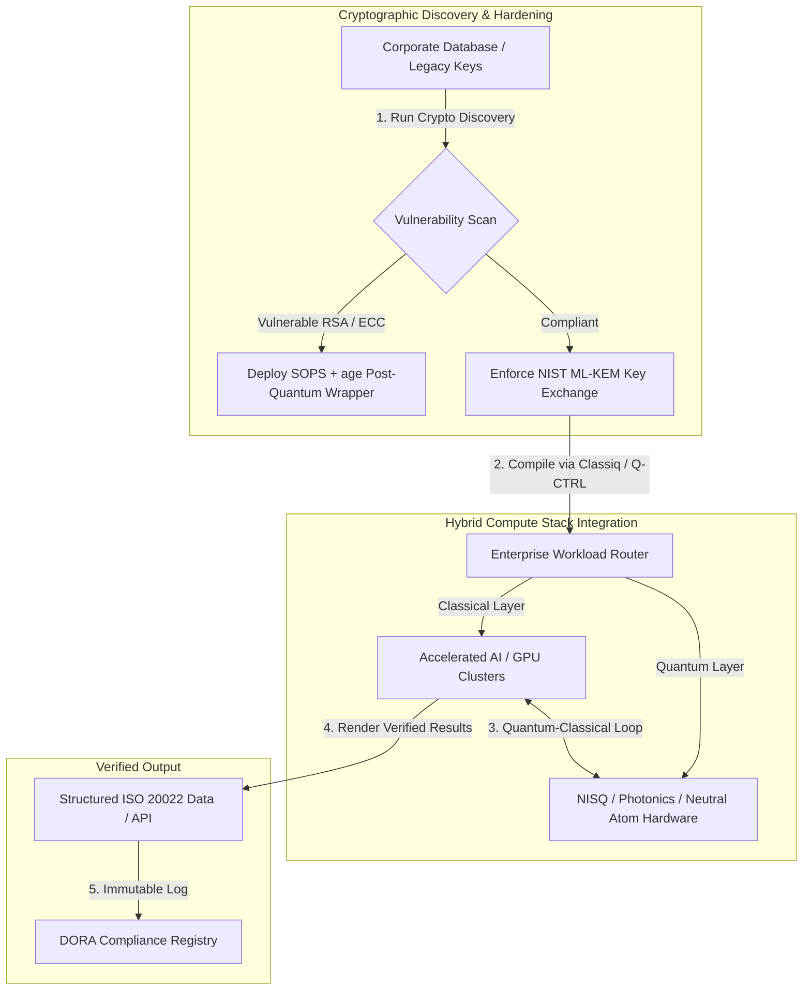

## A kubitektől a profitig: stratégiai tanulságok az Economist 5. éves Commercialising Quantum Global 2026 csúcstalálkozójáról

Vállalati felkészültség, posztkvantum kriptográfiai migrációk, hibrid számítási készletek, valamint a kvantumérzékelés és -hálózatépítés kialakuló kereskedelmi tája.

**TL;DR.** Az Economist Impact által 2026. június 16-17-én a londoni Business Design Centre-ben megrendezett 5. éves Commercialising Quantum Global 2026 konferencia több mint 1100 globális vezetőt gyűjtött össze a vállalati, pénzügyi, szakpolitikai és kutatási területekről. A központi téma egyértelmű szerkezeti fordulatot jelzett: a kvantumtechnológia a spekulatív laboratóriumi tudományból a gyakorlati, hibrid vállalati munkafolyamatok felé lépett át. A kizárólag 2026 első öt hónapjában bevont 1,3 milliárd dollárnyi kockázati tőkével a háttérben az igazgatósági vita már nem a fizikai kubitek számlálására összpontosít, hanem a "kockázatmentes" hibrid számítási készletek kialakítására, a digitális eszközök védelmére a "harvest-now, decrypt-later" (SNDL) kriptográfiai fenyegetéssel szemben, valamint a rövid távú kvantumérzékelő rendszerek bevezetésére a GPS-független navigáció céljából.

## Legfontosabb tanulságok

- **Vállalati elmozdulás a gyakorlati munkafolyamatok felé.** Az iparági vezetők (a HorizonX-től [Steve Suarez](https://www.linkedin.com/in/stevesuarez), a HSBC-től [Phil Intallura](https://www.linkedin.com/in/intallura)) hangsúlyozták, hogy a kvantumintegráció már nem fizikai, hanem működési kérdés. A bankok és vállalatok hibrid kvantum-klasszikus kísérleteket vezetnek be, hogy felkészítsék a tehetségeket és optimalizálják az aktív munkaterheléseket.
- **A posztkvantum kriptográfia (PQC) igazgatósági prioritás.** A biztonsági és jogi szakértők (CMS UK, a Microsofttól [Joanne Miller](https://www.linkedin.com/in/joanne-miller-nso), az EY-tól [Craig Farrell](https://www.linkedin.com/in/craig-farrell)) figyelmeztettek, hogy a szervezetek nem várhatnak a hibatűrő hardverre a PQC bevezetéséhez. A "harvest-now, decrypt-later" begyűjtés ma is zajlik, ami a NIST ML-KEM szabványokra való migrációt azonnali vagyonkezelői kérdéssé teszi.
- **A kvantumérzékelés vezeti a rövid távú jövedelmezőséget.** Míg a hibatűrő számítástechnika még évekre van, a kvantumérzékelés (az Infleqtiontől [Matthew Kinsella](https://www.linkedin.com/in/matthewkinsella)) gyorsan skálázódik. A kvantumórákat és tehetetlenségi érzékelőket a GPS-független navigációban, a nemzetbiztonságban és az ultrastabil energiahálózatokban vezetik be.
- **Szuverenitás, klaszterek és szakpolitikai sürgősség.** [Lord Vallance](https://www.linkedin.com/in/patrick-vallance) brit tudományügyi miniszter és [Lord William Hague](https://www.linkedin.com/in/williamhague) nemzeti missziókat vázoltak fel a kutatás ipari léptékű "szuperklaszterekké" alakítására, a National Quantum Computing Centre (NQCC) koordinációjával. A közelgő EU Quantum Act tovább hangsúlyozza a szuverén számítási kapacitásért folyó geopolitikai versenyt.
- **A Quantcore nyeri a qBIG díjat.** A University of Glasgow spin-off vállalata, a Quantcore elnyerte az IOP qBIG díját áttörést jelentő, nióbium-alapú szupravezető alkatrészeiért, amelyek a hagyományos anyagoknál magasabb hőmérsékleten működnek, jelentősen csökkentve a kriogén infrastruktúra többletterhelését.

**Kapcsolódó olvasmány:** [KyberLib és a posztkvantum banki migráció 2026-ban: a szabványoktól a kódig](https://sebastienrousseau.com/2026-06-12-kyberlib-post-quantum-banking-migration-standards-code-2026/), [A banki ellenállóképességi index 2026-ban: MI, felhő, kvantum, fizetések és harmadik felek koncentrációs kockázata](https://sebastienrousseau.com/2026-06-08-banking-resilience-index-ai-cloud-quantum-payments-third-party-risk-2026/), [A felhőnatív banki index 2026-ban: DORA, platformmérnökség, szuverén felhő és működési ellenállóképesség](https://sebastienrousseau.com/2026-06-05-cloud-native-banking-index-dora-resilience-platform-engineering-2026/).

## 01. Miért fontos a 2026-os csúcstalálkozó az igazgatóság számára

Az Economist Commercialising Quantum Global csúcstalálkozójának 2026-os kiadása tartós fordulatot jelentett abban, ahogyan a vállalati világ értékeli a mélytechnológiát.

Történelmileg a kvantumszámítást a K+F osztályokra száműzték, mint több évtizedes tudományos vállalkozást. 2026 júniusában ez a nézőpont elavult. A szervezeteknek a "fizikaközpontú" kíváncsiságtól az "üzletközpontú" megvalósítás felé kell elmozdulniuk. Ennek oka kettős:

1. **A kvantum-MI konvergencia.** A nagy teljesítményű számítási (HPC) készletek a klasszikus, a gyorsított MI és a NISQ (zajos, közepes léptékű kvantum) csomópontokat egyetlen, egységes számítási rétegbe olvasztják össze. Azok a szervezetek, amelyek késleltetik a kvantumra kész alkalmazások építését, azt fogják tapasztalni, hogy a stratégiai előny megszerzésének ablaka a vártnál gyorsabban záródik be.
2. **Geopolitikai és vagyonkezelői sürgősség.** Az Egyesült Királyság misszióvezérelt kvantumprogramjával és a közelgő EU Quantum Act-tel a kvantumkapacitás a nemzeti szuverenitás és a vállalati folytonosság kérdésévé vált.

Ezenkívül a posztkvantum kiberbiztonság már nem jövőbeli megfelelési követelmény. Az ellenséges "store now, decrypt later" (SNDL) támadások fenyegetése azt jelenti, hogy a ma elfogott vállalati adatokat akkor fogják visszafejteni, amikor a kereskedelmi kvantumrendszerek felskálázódnak, ami azonnali felelősséget teremt az olyan globális működési ellenállóképességi előírások alapján, mint a Digital Operational Resilience Act (DORA).

## 02. A Commercialising Quantum 2026 stratégiai lencséje

A vállalati technológiai vezetőknek fel kell térképezniük a kvantumérettséget öt különböző működési rétegen keresztül, értékelve az időbeli horizontokat és a mérlegkockázatokat.

### 1. táblázat: A Commercialising Quantum 2026 stratégiai lencséje

| Réteg | Vállalati fókusz | Idővonal / horizont | Fő vállalati kockázat |
| ---- | ---- | ---- | ---- |
| **Hardver és fordító** | Választás a versengő megközelítések között (szupravezető, csapdázott ionok, semleges atomok, fotonika) | 3-5 év (hibatűrés) | Zsákutcát jelentő architektúrába való beragadás vagy egyetlen platform túl korai támogatása. |
| **Kriptográfiai megerősítés** | A kriptográfiai függőségek feltárása és leltározása; migráció a NIST ML-KEM-re | Azonnali (aktív migráció) | Rendszerszintű adatszivárgások és megfelelési hibák a DORA és a NIST CSF 2.0 alapján. |
| **Kvantumérzékelés** | GPS-független navigáció, ultrastabil órák és graviméterek bevezetése | 1-2 év (azonnali kereskedelmi) | A logisztika, a hajózás és az energiahálózatok működési zavara a GPS-zavarás miatt. |
| **Rendszerintegráció** | A kvantumhardver csatlakoztatása a meglévő klasszikus HPC és szuperszámítógépes adatközpontokhoz | 1-3 év (hibrid fázis) | Nagy késleltetés, adatátviteli szűk keresztmetszetek és széttöredezett számítási silók. |
| **Vállalati szoftver** | Kvantumalgoritmusok elérhetővé tétele magas szintű absztrakciós rétegeken és API-kon keresztül (Classiq, Q-CTRL) | Azonnali (készségfejlesztés) | A tehetség és a munkafolyamat elszigetelődése a tényleges mérnöki végrehajtástól. |

## 03. Fő kvantumjelzések és igazgatósági kiváltó tényezők

A technológiai vezetőknek konkrét, számszerűsíthető piaci és szabályozási mutatókat kell figyelemmel kísérniük kvantumberuházásaik irányításához.

### 2. táblázat: Fő kvantumjelzések és igazgatósági kiváltó tényezők

| Jelzés | Kvantitatív mutató | Szabályozási / szakpolitikai hivatkozás | Megvalósítható platformprioritás |
| ---- | ---- | ---- | ---- |
| **Kvantumfinanszírozási hullám** | 1,3 milliárd dollár globálisan bevonva 2026 első öt hónapjában | Return on Resilience (RoR) | A költségvetések átcsoportosítása a spekulatív kísérletekből a "kockázatmentes" hibrid kvantum-klasszikus munkaterhelésekbe. |
| **Adatvisszafejtési kitettség** | A nyilvános csatornákon továbbított titkosított adatok 100%-a ki van téve az SNDL begyűjtésnek | DORA 6. cikk (IKT-biztonság) | Kriptográfiai feltáró eszközök bevezetése a sebezhető RSA/ECC kulcsok azonosítására a teljes állományban. |
| **Szuverén infrastruktúra** | 2,5 milliárd fontos brit National Quantum Strategy elkülönítés | UK Quantum Missions / Lord Vallance | Helyi partnerségek kialakítása nemzeti szuperklaszterekkel, mint az NQCC. |
| **Megfelelési határidők** | 2026. november 14-i SWIFT strukturáltcím-átállás | SWIFT SR 2026 irányelv | A bankközi adatbázisok tisztítása és formázása a strukturált XML specifikációknak való megfelelés érdekében. |

## 04. Mélymerülés a csúcstalálkozó alapvető témáiba

### A kvantum eléri a befektetési fordulópontot

A kockázatitőke-finanszírozás jelentős gyorsulást tapasztalt, kizárólag 2026 első öt hónapjában **1,3 milliárd dollárt** vonva be. A korábbi évek spekulatív felhajtási ciklusaival ellentétben a jelenlegi tőkehullámot valós, rövid távú munkaterhelések támasztják alá. A Classiq és az IBM Quantum Platform előadói bemutatták, hogyan teszik lehetővé a szoftveres absztrakciós rétegek és az automatizált fordítók, hogy a nem szakosodott fejlesztőcsapatok hibrid kvantum-klasszikus algoritmusokat futtassanak a mai klasszikus infrastruktúrán. Ez a "kockázatmentes" stratégia lehetővé teszi a szervezetek számára, hogy azonnal kvantumra kész tehetségeket és munkafolyamatokat építsenek.

### Jogi és szabályozási figyelmeztetések a "harvest now, decrypt later" kapcsán

A jogi partnerek és a kiberbiztonsági vezetők jelentős figyelmet keltettek az adatkockázat közvetlensége körül. A szponzoráló CMS UK ügyvédi iroda képviselői és a Microsoft CSO-ja, [Joanne Miller](https://www.linkedin.com/in/joanne-miller-nso) éles figyelmeztetést intéztek a felső vezetéshez: *a hibatűrő hardver megérkezésére való várakozás a posztkvantum kriptográfia bevezetése előtt kritikus vagyonkezelői mulasztás.*

A "store now, decrypt later" (SNDL) paradigma keretében az ellenséges szereplők ma is aktívan gyűjtik a titkosított vállalati adatokat azzal a szándékkal, hogy visszafejtsék azokat, amint megjelennek a kriptográfiailag releváns kvantumszámítógépek. A szervezeteknek azonnal be kell vezetniük a posztkvantum védelmeket (például a NIST ML-KEM-et) a hosszú életű érzékeny adatkészletek, a szellemi tulajdon és a korábbi ügyféladatok védelmére.

### A "kvantumérzékelés" felhajtásának átrendeződése

Míg a hibatűrő kvantumszámítás még évekre van, a csúcstalálkozó a kvantumérzékelést emelte ki a valós bevezetés első valóban jövedelmező hullámaként. Az Infleqtion vezérigazgatója, [Matthew Kinsella](https://www.linkedin.com/in/matthewkinsella) részletezte, hogyan skálázódnak gyorsan a kvantumórák, a tehetetlenségi érzékelők és a rádiófrekvenciás rendszerek több iparágban.

Mivel ezek a technológiák szubatomi pontossággal mérik a fizikai állandókat, lehetővé teszik a **GPS-független navigációt**, az ultrastabil energiahálózatokat és a mélyűri távközlést. Ezek az alkalmazások rendkívül relevánsak a repülés, a tengeri szállítás és a növekvő GPS-zavarási fenyegetésekkel szembesülő nemzetvédelmi rendszerek számára.

### Ökoszisztéma- és klaszteregyüttműködés

A brit kvantum-ökoszisztéma a londoni csúcstalálkozót a hazai innovációs szuperklaszterek bemutatására használta. A National Quantum Computing Centre (NQCC) és a Digital Catapult élő beszámolói részletezték, hogyan hidalhatják át a korai stádiumú mélytechnológiai spin-off cégek a "technológiai szakadékot" azáltal, hogy a kvantumhardvert közvetlenül a klasszikus szuperszámítógépes adatközpontokba integrálják.

[Wridhdhisom Karar](https://www.linkedin.com/in/wridhdhisomkarar), a skót Quantcore kvantumstartup társalapítója átvette a rangos Institute of Physics (IOP) Quantum Business Innovation and Growth (qBIG) díját a vállalat nióbium-alapú szupravezető alkatrészeiért. Ezek az alkatrészek a hagyományos anyagoknál magasabb hőmérsékleten működnek, jelentősen csökkentve a kvantumprocesszorok skálázásához szükséges kriogén infrastruktúra többletterhelését.

### A HSBC esettanulmány: miért "kényszer nélküli hiba" a kvantumra való várakozás

[**Philip Intallura, Ph.D.**](https://www.linkedin.com/in/intallura) (a HSBC kvantumtechnológiákért felelős globális vezetője, brit kormányzati tanácsadó és igazgatósági tanácsadó) meglátásai az Economist 5. éves Commercialising Quantum eseményén (2026) erőteljes igazgatósági iránymutatást adtak: *"A hibatűrő kvantumra való várakozás, mielőtt elkezdenéd, kényszer nélküli hiba."*

Dr. Intallura azzal érvelt, hogy a pénzügyi intézmények körében elterjedt "kivárós" megközelítés egy öngól, amely három téves feltételezésre épül:

- **A rövid távú ROI valós.** Az empirikus tesztelés során a HSBC felülmúlta a jelenleg éles üzemben futó modelleket, a kvantummunkát az üzlet más részeihez kapcsolta, a kvantumot a legnagyobb ügyfeleivel való kapcsolatok elmélyítésére használta, és jelentős új üzletet vonzott a **HSBC Innovation Banking** felé.
- **A kvantum meredek elfogadási görbe.** A képességek kiépítése, a stratégia meghatározása, a finanszírozás biztosítása és a kísérleti ciklusok futtatása egy erősen szabályozott szervezeten belül nem rövid vállalkozás. A folyamatokat szisztematikusan tesztelni és a technológiához igazítani kell.
- **A kvantum ökoszisztéma.** Egyetlen szereplő sem jut el oda egyedül. Minden kutatási cikk, POC és kísérlet, amelyet a HSBC végrehajtott, egy kvantumszolgáltatóval szoros együttműködésben valósult meg, és bizonyos esetekben az együttműködés kiterjed az akadémiai szférára, a szabályozókra és a kormányzatra.

**Záró igazgatósági iránymutatás:** *"A képesség, amelyre a hibatűrés első napján szükséged lesz, az a képesség, amelyet most építesz ki."*

## 05. Vállalati kvantumintegrációs és kriptográfiai folyamat

A digitális eszközök védelme és a kvantumfelkészültség kiépítése érdekében a vállalatnak világos integrációs folyamatot kell kialakítania.

## 06. Az igazgatósági kézikönyv: megvalósítható parancsok

Ahhoz, hogy a Commercialising Quantum Global 2026 csúcstalálkozó meglátásait azonnali üzleti értékké alakítsák, a felső vezetésnek a következő négylépéses igazgatósági kézikönyvet kell végrehajtania:

1. **Rendelje el a kriptográfiai feltárást.** Utasítsa az információbiztonsági vezetőt (CISO), hogy katalogizálja az összes kriptográfiai eszközt, feltérképezve minden örökölt RSA és ECC kulcsot a vállalaton belül a posztkvantum migrációra való felkészülés érdekében.
2. **Vezessen be "kockázatmentes" hibrid stratégiát.** Kerülje a tökéletes hardverre való várakozást. Fektessen be kvantuminspirált szoftverbe és hibrid klasszikus-kvantum kísérletekbe, hogy már ma házon belüli tehetségeket fejlesszen és összetett logisztikai vagy kockázati portfóliókat optimalizáljon.
3. **Értékelje a kvantumérzékelést a logisztika számára.** Ha szervezete globális ellátási láncoktól, hajózástól vagy kritikus infrastruktúrától függ, aktívan értékelje a kvantumérzékelő rendszereket (például a GPS-független navigációt) a geopolitikai zavarási kockázatok mérséklésére.
4. **Regisztráljon a június 30-i Insight Hour eseményre.** Gondoskodjon arról, hogy technológiai vezetői regisztráljanak a virtuális **Commercialising Quantum Global Insight Hour** eseményre 2026. június 30-án, 15:00 BST-kor (az IonQ támogatásával), hogy folytassák a vállalati kockázatkezelési és tehetségallokációs stratégiák nyomon követését.

## 07. Gyakran ismételt kérdések

**Mi az a "harvest now, decrypt later" (SNDL), és miért fontos ma?**
Az SNDL a titkosított adatok ma történő elfogásának és tárolásának gyakorlata azzal a szándékkal, hogy később, amint kriptográfiailag releváns kvantumszámítógépek válnak elérhetővé, visszafejtsék azokat. A hosszú életű érzékeny adatkészletek, a szellemi tulajdon, az ügyféladatok és a kormányzati kommunikáció, már most is célpontok. A NIST ML-KEM-re való migráció olyan vagyonkezelői döntés, amelyet az igazgatóság nem halogathat.

**Miért a kvantumérzékelés az első kereskedelmi hullám a számítás helyett?**
A kvantumérzékelők szubatomi pontossággal mérik a fizikai állandókat, és nem igénylik azt a hibatűrő hardvert, amelyet a kvantumszámítás megkövetel. A kvantumórák, a graviméterek és a tehetetlenségi érzékelők már kísérleti bevezetés alatt állnak a GPS-független navigáció, az ultrastabil energiahálózatok és a mélyűri kommunikáció területén.

**A HSBC kvantummunkája csupán K+F, vagy mérhető hozamot is eredményezett?**
Philip Intallura szerint a csúcstalálkozón a HSBC felülmúlta a jelenleg éles üzemben futó modelleket, a kvantumot a legnagyobb ügyfeleivel való kapcsolatok elmélyítésére használta, és jelentős új üzletet vonzott a HSBC Innovation Bankingbe. A munka a kutatástól a működési integrációig jutott.

## 08. Hivatkozások

- **Economist Impact, (2026).** *5th Annual Commercialising Quantum Global 2026.* Élő konferencia-anyagok, 2026. június 16-17. London: Business Design Centre. Elérhető: [Economist Impact](https://events.economist.com/commercialising-quantum/).
- **National Institute of Standards and Technology (NIST), (2024).** *First Three Finalized Post-Quantum Encryption Standards (FIPS 203, 204, and 205).* Gaithersburg: U.S. Department of Commerce. Elérhető: [NIST Standards](https://www.nist.gov/news-events/news/2024/08/nist-releases-first-3-finalized-post-quantum-encryption-standards).
- **European Parliament and Council of the European Union, (2022).** *Regulation (EU) 2022/2554 on digital operational resilience for the financial sector (DORA).* Brussels: Official Journal of the European Union. Elérhető: [DORA Regulation](https://eur-lex.europa.eu/legal-content/EN/TXT/?uri=CELEX%3A32022R2554).
- **SWIFT, (2024).** *[ISO 20022](/2023-09-29-automating-iso-20022-compliant-payment-file-creation-with-pain001/index.html) 2026. novemberi strukturáltcím-mérföldkő.* La Hulpe: SWIFT. Elérhető: [SWIFT ISO 20022 milestone](https://www.swift.com/standards/iso-20022/iso-20022-bytes/call-action-november-2026).
