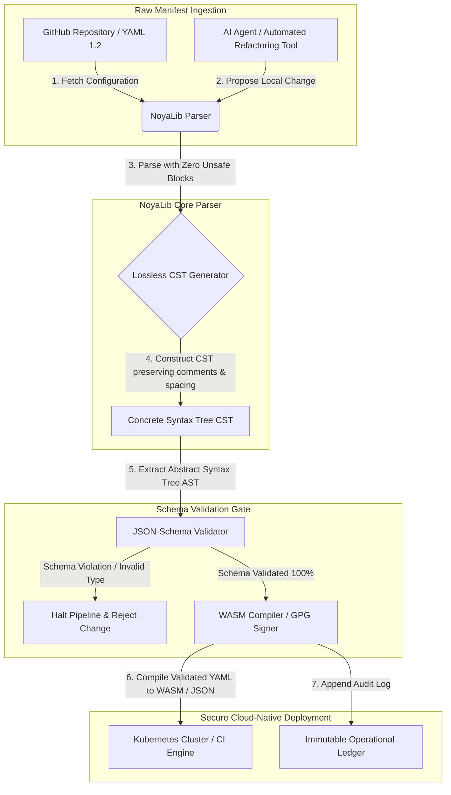

## Miért van szüksége a YAML-nek biztonságosabb Rust stackre az MI, az MCP és a pénzügyi infrastruktúra számára 2026-ban

Egy biztonságosabb Rust YAML stack azért fontos, mert a YAML ma már CI/CD folyamatokat, Kubernetes manifeszteket, [Open Policy Agent](https://www.openpolicyagent.org/) szabályokat és Model Context Protocol (MCP) eszközregisztereket hordoz, és egyetlen félreérthető elemzés megbéníthat egy elszámolási rendszert, hibásan konfigurálhat egy biztonsági csoportot, vagy rossz jogosultságokat adhat egy helyi MI-ügynöknek. A [NoyaLib](https://github.com/sebastienrousseau/noyalib) egy tisztán Rust nyelvű, zero-unsafe [YAML 1.2](https://yaml.org/spec/1.2.2/) elemző és validációs ökoszisztéma, amelyet arra terveztek, hogy ezt az infrastruktúrát alapból biztonságossá tegye.

## Gyors válasz

**Mi a NoyaLib egyetlen mondatban?** A NoyaLib egy nyílt forráskódú, tisztán Rust nyelvű YAML 1.2 elemző és validációs ökoszisztéma, amely nem tartalmaz `unsafe` kódot, 100%-os specifikációmegfelelést nyújt a hivatalos, 406 tesztből álló YAML tesztkészleten, veszteségmentes konkrét szintaxisfát biztosít, és valós idejű [JSON Schema](https://json-schema.org/) validációt végez: arra tervezve, hogy az MI-ügynökök, az MCP, a Kubernetes és a pénzügyi infrastruktúra konfigurációját alapból biztonságossá tegye.

## Vezetői összefoglaló

A YAML szerénynek tűnik, egészen addig, amíg egy félreérthető elemzés vagy sémasértés meg nem bénít egy több milliárd dolláros, éles elszámolási rendszert. 2026-ban a YAML a de facto szabvány a [CI/CD](https://docs.github.com/en/actions/learn-github-actions/workflow-syntax-for-github-actions) folyamatokhoz, a [Kubernetes](https://kubernetes.io/docs/concepts/configuration/overview/) manifesztekhez, az [Open Policy Agent](https://www.openpolicyagent.org/) szabályokhoz és a Model Context Protocol (MCP) eszközregiszterekhez. Az átláthatatlan, örökölt elemzők, memóriabiztonsági sebezhetőségeikkel és destruktív elemzésükkel, elfogadhatatlan biztonsági kockázatot jelentenek. A NoyaLib egy tisztán Rust nyelvű, zero-unsafe YAML 1.2 ökoszisztéma: 100%-os specifikációmegfelelés mind a 406 hivatalos teszten, veszteségmentes konkrét szintaxisfa (CST), amely megőrzi a megjegyzéseket és a szóközöket, valamint beépített JSON-Schema validáció. Az eredmény: a YAML auditálható, biztonságos és ügynökök számára elérhető konfigurációs vezérlősíkká alakul.

## Legfontosabb tanulságok

- **A konfiguráció éles kód.** Egyetlen hibásan formázott YAML fájl hibásan konfigurálhat felhőnatív biztonsági csoportokat vagy MI-ügynök jogosultságokat. A NoyaLib a YAML-t kritikus infrastruktúraként kezeli.
- **Zero-unsafe kialakítás.** A teljes egészében biztonságos Rustban, `unsafe` blokkok nélkül épített NoyaLib kiküszöböli a memóriabiztonsági sebezhetőségeket, a puffertúlcsordulásokat és a távoli kódfuttatást, az alapvető elemzési rétegekben.
- **Abszolút 406/406 specifikációmegfelelés.** Matematikailag validálja a konfigurációs struktúrákat, kiküszöbölve az elemzési eltéréseket és a strukturális elcsúszásokat a staging és az éles környezetek között.
- **Veszteségmentes konkrét szintaxisfa.** Az örökölt elemzőkkel ellentétben, amelyek eldobják a megjegyzéseket és a formázást, a NoyaLib megőrzi a szóközöket és az annotációkat, lehetővé téve az MI-ügynökök általi biztonságos, oda-vissza automatizált refaktorálást.
- **Igazgatósági szintű bizalmi érték.** Összekapcsolja a konfiguráció integritását a [DORA 5. cikkével](https://eur-lex.europa.eu/legal-content/EN/TXT/?uri=CELEX%3A32022R2554) és a [Basel III](https://www.bis.org/bcbs/publ/d424.htm) működési kockázati tőkemutatóival, közvetlenül védve a felső vezetést a személyes felelősségtől.

**Kapcsolódó olvasmány:** [KyberLib és a poszt-kvantum banki migráció 2026-ban: a szabványoktól a kódig](https://sebastienrousseau.com/2026-06-12-kyberlib-post-quantum-banking-migration-standards-code-2026/), [A felhőnatív banki index 2026-ban: DORA, platformmérnökség, szuverén felhő és működési ellenállóképesség](https://sebastienrousseau.com/2026-06-05-cloud-native-banking-index-dora-resilience-platform-engineering-2026/), [MI-tudatos dotfile-ok 2026-ban: biztonságos, reprodukálható fejlesztői munkaállomás építése MCP-hez, SLSA-hoz és több shell közötti paritáshoz](https://sebastienrousseau.com/2026-06-16-ai-aware-dotfiles-secure-reproducible-workstation-2026/).

## 01. Miért fontos a biztonságosabb Rust YAML stack 2026-ban

2026 júniusában a vállalati IT-infrastruktúrák erősen elosztottak és egyre inkább automatizáltak.

A YAML csendben a teljes szoftvermérnöki stack teherhordó konfigurációs nyelvévé vált. Hordozza a folyamatos integrációs (CI) munkafolyamatokat, amelyek az éles műtermékeket fordítják, a [Kubernetes](https://kubernetes.io/docs/concepts/overview/) manifeszteket, amelyek a globális felhőnatív fürtöket vezénylik, valamint a [Model Context Protocol](https://modelcontextprotocol.io/) (MCP) szerversémákat, amelyek engedélyt adnak a helyi MI-ügynököknek helyi műveletek végrehajtására.

Az örökölt YAML elemzők, a [PyYAML](https://pyyaml.org/), a [yaml-cpp](https://github.com/jbeder/yaml-cpp) és a [libyaml](https://github.com/yaml/libyaml), két strukturális kockázatot hordoznak:

1. **Típuskényszerítési sebezhetőségek (a „Norvégia-probléma”).** Az örökölt elemzők gyakran kényszerítik az idézőjel nélküli karakterláncokat (a `NO` országkódot `false` logikai értékké, a `yes`/`no` értékeket hasonlóképpen), lásd a [YAML 1.1 kontra 1.2 logikai címkét](https://yaml.org/type/bool.html), kritikus rendszerhibákat vagy csendes biztonsági hibás konfigurációkat okozva.
2. **Memóriabiztonsági kihasználások.** A C/C++ nyelven írt átláthatatlan elemzők memóriaszivárgási és puffertúlcsordulási kihasználásoktól szenvednek, amelyek távoli kódfuttatáshoz (RCE) vezethetnek az alapvető build szervereken.

A [NoyaLib](https://github.com/sebastienrousseau/noyalib) megoldja ezeket a kihívásokat. Ez egy tisztán Rust nyelvű, zero-unsafe YAML 1.2 elemző és validációs ökoszisztéma. Az abszolút 406/406 specifikációmegfelelés elérésével és a szigorú JSON-Schema validáció közvetlenül az elemzés során történő kikényszerítésével a NoyaLib magas **ellenállóképességi megtérülést (Return on Resilience, RoR)** biztosít: megakadályozza a konfiguráció okozta leállásokat és biztonságossá teszi a pénzügyi szintű szoftverellátási láncokat.

## 02. A NoyaLib 2026-os architektúrája

A NoyaLib ökoszisztéma biztonságos, veszteségmentes konfigurációelemzőként működik. Minden helyi és felhőalapú manifeszt strukturálisan validált és védett a legalacsonyabb végrehajtási rétegen.

### 1. táblázat: A NoyaLib architektúrarétegei és kockázatcsökkentés

| Réteg | Tervezési döntés | Miért fontos | Kockázat rossz kezelés esetén |
| ---- | ---- | ---- | ---- |
| **Elemző réteg** | YAML 1.2-kompatibilis, tisztán Rust nyelvű elemző, `unsafe` blokkok nélkül | Kiküszöböli a memóriabiztonsági sebezhetőségeket és a puffertúlcsordulásokat a legalacsonyabb végrehajtási rétegen. | Távoli kódfuttatás (RCE) az alapvető build szervereken. |
| **Megfelelőségi réteg** | 100%-os megfelelés mind a 406/406 hivatalos YAML 1.2 teszten | Kiküszöböli az elemzési eltéréseket és a típuskényszerítési elcsúszást a staging és az éles környezet között. | „Norvégia-probléma” típuskényszerítési hibák, amelyek letiltják a biztonsági csoportokat. |
| **Szintaxisfa réteg** | Veszteségmentes konkrét szintaxisfa (CST) | Megőrzi a megjegyzéseket, a szóközöket és a sorrendet az oda-vissza elemzés és a programozott refaktorálás során. | Az automatizált MI-refaktorálás tönkreteszi a fejlesztői annotációkat. |
| **Validációs réteg** | [JSON Schema (Draft 2020-12)](https://json-schema.org/draft/2020-12/release-notes) validáció az elemzés során | Szigorú adatmodelleket kényszerít ki a konfigurációs fájlokra, mielőtt azok elérnék az éles fürtöket. | Hibásan formázott konfigurációs fájlok, amelyek felhőnatív fürtök összeomlását idézik elő. |
| **Interfész réteg** | WebAssembly (WASM) és MCP kötések | Lehetővé teszi a konfigurációvalidáció közvetlen futtatását böngészőkben, edge csomópontokban és helyi ügynökeszköz-készletekben. | Eszközsilók, ahol a validáció nem futtatható edge eszközökön. |

## 03. Kulcsfontosságú munkaállomás- és konfigurációbiztonsági jelzések

Az abszolút biztonság fenntartásához a fejlesztési és üzemeltetési területen az információbiztonsági vezetőknek (CISO) konkrét, számszerűsíthető mutatókat kell figyelemmel kísérniük.

### 2. táblázat: Munkaállomás- és konfigurációbiztonsági jelzések

| Jelzés | Mutató / működési viszonyítási alap | NIST CSF / DORA hivatkozás | Technikai platform megvalósítása |
| ---- | ---- | ---- | ---- |
| **Elemzőmegfelelés** | 100%-os átmenési arány a hivatalos YAML 1.2 tesztkészleten (406/406 teszt). | [DORA 6. cikk](https://eur-lex.europa.eu/legal-content/EN/TXT/?uri=CELEX%3A32022R2554) (IKT-biztonság) | A NoyaLib elemzőmagja minden manifesztet validál a CI végrehajtása előtt. |
| **Memóriabiztonsági profil** | Zero `unsafe` Rust blokk az elemző és a szerializáló függőségeiben. | DORA 30. cikk (ellátási lánc) | Automatizált fordítói ellenőrzések ([`forbid(unsafe_code)`](https://doc.rust-lang.org/reference/attributes/diagnostics.html#the-forbid-attribute)) a cargo buildekben. |
| **Sémavalidáció** | Az elemzett konfigurációs fájlok 100%-a érvényes [JSON Schema](https://json-schema.org/) modellekkel ellenőrizve. | [NIST CSF 2.0](https://www.nist.gov/cyberframework) (PR.DS-01) | Valós idejű validációs kapu, amely sémasértés esetén leállítja a build folyamatokat. |
| **Konfigurációelcsúszás** | A helyi konfigurációs fájlok valós idejű észlelése és visszaállítása a git-verziózott állapotba. | Ellenállóképességi megtérülés (RoR) | Folyamatos telemetria, amely naplózza az összes helyi fájlmódosítást. |
| **Ügynök-hozzáférés-vezérlés** | Korlátozott, csak olvasható jogosultságok az MCP konfigurációkon keresztül működő helyi MI-eszközök számára. | Modellkockázat-kezelés ([SR 11-7](https://www.federalreserve.gov/supervisionreg/srletters/sr1107.htm)) | MCP szerverhatárok, amelyek az ügynökműveleteket jóváhagyott könyvtárakra korlátozzák. |

## 04. Az átláthatatlan konfigurációelemzés tévedése

A felhőnatív műveletek egyik jelentős sebezhetősége az *átláthatatlan elemzés*: olyan elemzők használata, amelyek eldobják a strukturális metaadatokat (megjegyzések, szóközök, dokumentumsorrend), vagy csendben kényszerítik a típusokat a fordítás során. Ez a viselkedés két súlyos biztonsági kockázatot hordoz:

1. **Destruktív refaktorálás.** Amikor egy MI-kódolási asszisztens vagy automatizált refaktoráló eszköz frissít egy telepítési manifesztet, a hagyományos elemzők eldobják a fejlesztői megjegyzéseket és a formázást, tönkretéve az emberi felülvizsgálatokhoz és az incidens utáni törvényszéki elemzéshez szükséges kontextust.
2. **Elemzési eltérések.** Ha egy staging környezet Python-alapú elemzőt használ, az éles környezet pedig C-alapút, a YAML 1.2 specifikációmegfelelés kisebb eltérései miatt egy érvényes staging manifeszt meghiúsulhat vagy eltérően viselkedhet az éles környezetben, rejtett biztonsági sebezhetőségeket létrehozva.

A NoyaLib **veszteségmentes konkrét szintaxisfája (CST)** megoldja ezt. Megőriz minden szóközt, megjegyzést és dokumentumsort az elemzési és szerializálási ciklus során. Az automatizált MI-asszisztensek úgy szerkeszthetik, refaktorálhatják és véglegesíthetik a konfigurációs fájlokat, hogy közben az ember által írt annotációk 100%-át megőrzik: ez abszolút auditnyomvonal.

## 05. Korlátozott MI-konfigurációs folyamat tervezése

A rosszindulatú konfigurációmódosítások éles környezetbe jutásának megakadályozásához a szervezetnek szigorúan korlátozott, sémavalidált konfigurációs folyamatot kell megvalósítania.

Az alábbi működési folyamat bemutatja, hogyan elemzi a NoyaLib a nyers YAML-t, hogyan épít veszteségmentes CST-t, hogyan validálja az AST-t egy JSON-Schema modellel szemben, és hogyan fordít WebAssembly kötéseket böngésző- vagy edge környezetekhez.

## 06. Az igazgatósági kézikönyv és a bizalmi felelősség

A konfigurációbiztonság és a szoftverellátási lánc integritása kritikus igazgatósági prioritások. A felső vezetőknek a konfigurációkezelést a bizalmi kötelezettség és a működési ellenállóképesség szemszögéből kell megközelíteniük.

- **DORA 5. cikk (igazgatósági elszámoltathatóság).** Előírja, hogy az igazgatóság viseli a végső, át nem ruházható felelősséget az intézmény IKT-kockázatának kezeléséért. Mivel a konfigurációs fájlok kritikus felhőnatív biztonsági csoportokat és fizetési útvonalakat vezérelnek, az igazgatóságoknak ellenőrizniük kell, hogy az ezeket a manifeszteket elemző rendszerek memóriabiztonságosak és teljesen specifikációnak megfelelőek-e, hogy megfeleljenek a szabályozói auditoknak. ([2022/2554 (EU) rendelet](https://eur-lex.europa.eu/legal-content/EN/TXT/?uri=CELEX%3A32022R2554))
- **BCBS 239 (kockázati adatok aggregálása és jelentése).** Megköveteli, hogy a kockázati jelentések és az infrastruktúra-mutatók pontosak, teljesek és szigorú adatminőségi kontrollok mellett előállítottak legyenek. A NoyaLib támogatja a BCBS 239-et azáltal, hogy a konfigurációs fájlokat szigorú sémákkal szemben elemzi és validálja a forrásnál, megakadályozva a csendes adatszivárgást vagy a hibás konfiguráció okozta kimaradásokat. ([BCBS 239 szabvány](https://www.bis.org/publ/bcbs239.htm))
- **A működési kockázati tőkekövetelmények csökkentése (Basel III).** A konfiguráció okozta kimaradások közvetlenül növelik a működési kockázati tőkekövetelményeket a Basel III szerint, lekötve a mérlegtőkét. A vállalati konfigurációs stack egy biztonságos, tisztán Rust nyelvű elemzőre, például a NoyaLibre való szabványosítása minimalizálja ezt a kockázatot, megőrizve a tőkét és védve az ügyfelek bizalmát. ([Basel III szabványok](https://www.bis.org/bcbs/publ/d424.htm))

## 07. Mit jelent ez banktípusonként

### Globálisan rendszerszinten jelentős bankok (G-SIB-ek)

A G-SIB-ek több joghatóságban több ezer mikroszolgáltatást és telepítési folyamatot kezelnek. Elsődleges kihívásuk a konfigurációs konzisztencia fenntartása és a biztonsági elcsúszás megelőzése hatalmas felhőnatív birtokokon. Egy biztonságosabb Rust YAML stackre, például a NoyaLibre való szabványosítás garantálja, hogy minden Kubernetes manifeszt, CI/CD folyamat és biztonsági szabályzat egységes, memóriabiztonságos keretrendszer alatt kerüljön elemzésre és validálásra, kiküszöbölve az auditálatlan „hópehely” konfigurációk kockázatát.

### Tranzakciós és vállalati bankok

A tranzakciós bankok érzékeny fizetési átjárókat és nagykereskedelmi elszámolási infrastruktúrákat üzemeltetnek. Az ezekbe az éles környezetekbe telepített kód és konfiguráció abszolút biztonságának bizonyítása nem alku tárgyát képező szabályozói követelmény. A NoyaLib integrálása garantálja, hogy a szoftverellátási lánc teljesen auditált, veszteségmentes és védett az elemzési sebezhetőségektől: ez a kontroll tisztán megfeleltethető a DORA 6. cikkének és a [PCI DSS v4.0](https://www.pcisecuritystandards.org/document_library/) 6. szakaszának.

### Regionális és kisebb bankok

A regionális bankoknak magas kiberbiztonsági szabványokat kell fenntartaniuk G-SIB-léptékű technológiai költségvetés nélkül. A nyílt forráskódú NoyaLib keretrendszer könnyűsúlyú, költséghatékony és rendkívül biztonságos, Rust-barát megoldást kínál, lehetővé téve a kisebb intézmények számára, hogy vállalati szintű konfigurációbiztonságot és ellátásilánc-védelmet valósítsanak meg szabadalmaztatott licencdíjak nélkül.

## 08. Következtetés: a konfigurációbiztonsági ütemterv

A fejlesztői munkaállomás és a felhőnatív infrastruktúra konfigurációi kritikus vezérlősíkok a szoftverellátási láncban. Ha auditálatlan, félreérthető vagy nem biztonságos konfigurációs fájlok jutnak el a vállalati eszközökhöz, az elfogadhatatlan működési és szabályozói kockázat.

A szoftverellátási lánc biztonságossá tételéhez és a végpontok konfigurációs sebezhetőségektől való védelméhez a felső technológiai és biztonsági vezetőknek már ma egy világos fejlesztési ütemtervet kell végrehajtaniuk:

1. **Írja elő a deklaratív konfigurációt.** Fokozatosan szüntesse meg a kézi, auditálatlan konfigurációs módosításokat, és írja elő, hogy minden manifesztet verziókövetett, deklaratív nyilvántartási rendszerként kezeljenek.
2. **Kényszerítse ki a sémavalidációt.** Kényszerítsen ki szigorú pre-commit hookokat és ellenőrző segédprogramokat, hogy minden konfigurációs fájl érvényes JSON-Schema modellekkel legyen validálva a telepítés előtt.
3. **Valósítson meg veszteségmentes oda-vissza konvertálást.** Gondoskodjon arról, hogy minden automatizált MI-kódolási asszisztens és refaktoráló eszköz veszteségmentes elemzést használjon a megjegyzések, a szóközök és a fejlesztői kontextus megőrzéséhez.
4. **Tegye biztonságossá az ellátási láncot.** Gondoskodjon arról, hogy minden konfigurációs beállítás és elemző segédprogram kriptográfiailag ellenőrzött legyen tisztán Rust nyelvű, zero-unsafe könyvtárakkal, például a NoyaLibbel, a végrehajtás előtt. ([SLSA keretrendszer](https://slsa.dev/))

## 09. Gyakran ismételt kérdések

**Mi a NoyaLib, és miért használják YAML-elemzésre?**
A NoyaLib egy nyílt forráskódú, tisztán Rust nyelvű, zero-unsafe YAML 1.2 elemző. 100%-os specifikációmegfelelést ér el a hivatalos, 406 tesztből álló készleten, szigorú [JSON Schema](https://json-schema.org/) validációt kényszerít ki az elemzés során, és WASM, valamint [MCP](https://modelcontextprotocol.io/) kötéseket tesz elérhetővé: ezzel biztonságosabb Rust YAML stackké válik az MI-ügynökök, a Kubernetes és a pénzügyi infrastruktúra számára.

**Miért fontos a zero-unsafe kialakítás a konfigurációelemzés szempontjából?**
A C/C++ nyelven írt örökölt elemzőkben lévő memóriabiztonsági sebezhetőségek, a puffertúlcsordulások és a felszabadítás utáni használat, távoli kódfuttatáshoz vezethetnek az alapvető build szervereken. A NoyaLib tisztán Rust nyelvű kialakítása a [`#![forbid(unsafe_code)]`](https://doc.rust-lang.org/reference/attributes/diagnostics.html#the-forbid-attribute) segítségével matematikailag kiküszöböli ezeket a sebezhetőségeket fordítási időben.

**Mi az a veszteségmentes konkrét szintaxisfa (CST), és miért fontos?**
A hagyományos elemzők eldobják a megjegyzéseket és a formázást, ami destruktívvá teszi az MI-ügynökök általi automatizált szerkesztéseket. A NoyaLib veszteségmentes konkrét szintaxisfája megőriz minden megjegyzést, szóközt és dokumentumsort, így az MI-asszisztensek biztonságosan szerkeszthetik és refaktorálhatják a konfigurációs fájlokat, miközben a fejlesztői kontextus, az incidens utáni törvényszéki elemzés és az auditnyomvonal érintetlen marad.

**Hogyan feleltethető meg a NoyaLib a DORA-nak, a BCBS 239-nek és a Basel III-nak?**
A DORA 5. cikke az IKT-kockázat elszámoltathatóságát az igazgatóságra helyezi; a BCBS 239 adatminőségi kontrollokat követel meg a kockázati jelentéstételnél; a Basel III megadóztatja a működési kockázati tőkét. A NoyaLib biztosítja azt a sémavalidált, memóriabiztonságos elemzési réteget, amelyet ezek a szabályozások megkövetelnek a konfiguráció mint kód esetében: ezzel egyszerűvé teszi a szabályozói megfeleltetést és csökkenti a működési kockázati tőkekövetelményt.

## 10. Hivatkozások

- **YAML, (2026).** *YAML 1.2 specifikáció*. Elérhető: [YAML 1.2 specifikáció](https://yaml.org/spec/1.2.2/).
- **JSON Schema, (2026).** *JSON Schema Draft 2020-12 kiadási megjegyzések*. Elérhető: [JSON Schema Draft 2020-12](https://json-schema.org/draft/2020-12/release-notes).
- **Európai Parlament és az Európai Unió Tanácsa, (2022).** *A pénzügyi szektor digitális működési ellenállóképességéről szóló (EU) 2022/2554 rendelet (DORA)*. Brüsszel: Az Európai Unió Hivatalos Lapja. Elérhető: [DORA rendelet](https://eur-lex.europa.eu/legal-content/EN/TXT/?uri=CELEX%3A32022R2554).
- **Bázeli Bankfelügyeleti Bizottság, (2013).** *A hatékony kockázatiadat-aggregálás és kockázati jelentéstétel alapelvei (BCBS 239)*. Bázel: Nemzetközi Fizetések Bankja. Elérhető: [BCBS 239 szabvány](https://www.bis.org/publ/bcbs239.htm).
- **Bázeli Bankfelügyeleti Bizottság, (2017).** *Basel III: a válság utáni reformok véglegesítése*. Bázel: Nemzetközi Fizetések Bankja. Elérhető: [Basel III szabványok](https://www.bis.org/bcbs/publ/d424.htm).
- **Anthropic, (2025).** *Model Context Protocol (MCP) specifikáció*. Elérhető: [Model Context Protocol](https://modelcontextprotocol.io/).
- **GitHub, (2026).** *noyalib nyílt forráskódú tároló*. Elérhető: [NoyaLib tároló](https://github.com/sebastienrousseau/noyalib).
