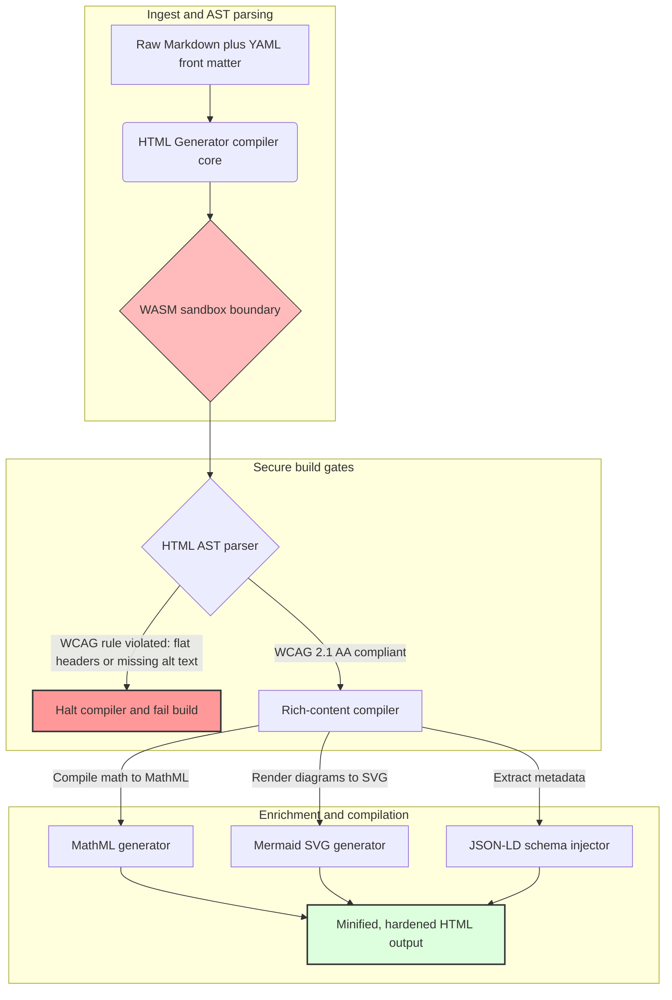

## Markdown alakítása akadálymentes, SEO-kész, strukturált HTML-lé Rust nyelven 2026-ban

2026-ban a webes tartalmat legalább annyira fogyasztják az MI-keresőrobotok, az LLM-alapú keresőmotorok és a visszakereséssel bővített generálás (Retrieval-Augmented Generation, RAG) folyamatai, mint az emberi olvasók. A lapos vagy hibás HTML rontja a gépi felfedezhetőséget, miközben a szigorú globális szabályozásoknak, például az [Európai Akadálymentesítési Irányelvnek (EAA)](https://www.accessibility-act.eu/) és az [amerikai ADA Title III-nak](https://www.ada.gov/topics/title-iii/) való meg nem felelés mára egyértelmű polgári jogi felelősség. A [HTML Generator](https://github.com/sebastienrousseau/html-generator) egy nagy teljesítményű Rust könyvtár, amelyet arra terveztek, hogy ezeket a hiányosságokat a fordítónál zárja be, nem pedig utólagos, telepítés utáni javításokkal.

## Gyors válasz

**Mi a HTML Generator egyetlen mondatban?** A HTML Generator egy nyílt forráskódú, tiszta Rust nyelvű Markdown-HTML fordító, amely a [WCAG 2.1 AA](https://www.w3.org/TR/WCAG21/) követelményeit fordítási időben érvényesíti, automatikusan generál szemantikai tájékozódási pontokat és ARIA-attribútumokat, sémának megfelelő [JSON-LD](https://json-ld.org/) metaadatokat injektál a YAML fejlécből, Mermaid-diagramokat és matematikát akadálymentes SVG-vé és MathML-lé jelenít meg, és egy [WebAssembly](https://webassembly.org/) homokozón belül fut: így a vállalati publikálást fordítással kapuzott, bizalmi szintű vezérlési síkká alakítja.

## Vezetői összefoglaló

A Markdown megjelenítése triviálisnak tűnik. A publikálási minőségű HTML azonban megfelelőségi probléma. 2026 júniusában minden vállalati érintkezési pontot, a befektetői kapcsolati portáloktól a szabályozói bejelentéseken, az ügyféldokumentáción és az API-referenciákon át a marketinges felületekig, egyszerre elemeznek emberek és gépek. Két nyomás ütközik minden oldalon: az [EAA](https://www.accessibility-act.eu/) és az [ADA Title III](https://www.ada.gov/topics/title-iii/) igazgatótanácsi szintű jogi kitettséggé teszi az akadálymentességet, miközben az MI-feldolgozás és a RAG-folyamatok a strukturált, géppel olvasható kimenetet jutalmazzák. A szokásos Markdown-könyvtárak lapos HTML-t állítanak elő, amely mindkét kapun elbukik. A HTML Generator a dokumentumgenerálást fordítással kapuzott folyamatként kezeli: a WCAG-ellenőrzés fordítási hiba, a JSON-LD kézi bélyegzés nélkül a YAML fejlécből származik, a MathML és a Mermaid akadálymentesen jelenik meg, és az egész motor WebAssembly célként szállítható, így a nem megbízható dokumentumok elemzése homokozóba zárva marad a gazdagéptől.

## Legfontosabb tanulságok

- **Az akadálymentesség kódként az új alapszint.** Az EAA kötelezővé teszi az akadálymentességet a fogyasztói digitális szolgáltatások esetében. A HTML Generator fordítási időben értékeli a dokumentumfát, automatikusan generálva szemantikai tájékozódási pontokat és ARIA-attribútumokat: kevesebb telepítés utáni javítás, kevesebb helyreállítási költségvetés, és nem kerül hiányzó alternatív szöveg éles környezetbe.
- **Strukturált adatok az MI-felfedezéshez.** A modern keresés és a RAG géppel olvasható metaadatokra támaszkodik. A fordító elemzi a YAML fejlécet, és közvetlenül a dokumentum fejlécébe injektál [Schema.org-kompatibilis JSON-LD-t](https://schema.org/), így a tartalom teljesen értelmezhetővé válik a [Google Rich Results](https://developers.google.com/search/docs/appearance/structured-data/intro-structured-data), a [Bing Webmaster](https://www.bing.com/webmasters) és az LLM-alapú keresőrobotok számára.
- **Kiváló technikai tartalom.** A technikai publikálás nem lapos szöveg. A HTML Generator a nyers Markdown matematikai kiterjesztéseit akadálymentes [MathML-lé](https://www.w3.org/Math/) fordítja, és a [Mermaid.js](https://mermaid.js.org/) diagramokat reszponzív SVG-vé jeleníti meg, mindkettő megőrzi a WCAG-kompatibilis szerkezetet, ahelyett, hogy átlátszatlan képekre esne vissza.
- **WebAssembly-homokozó.** A nem megbízható Markdown elemzése biztonsági kockázat. A [WASM](https://webassembly.org/) célzásával a HTML Generator egy elszigetelt homokozón belül fut, amely megakadályozza a tetszőleges kód végrehajtását és védi a gazdarendszert, közvetlenül teljesítve a [DORA 6. cikk](https://eur-lex.europa.eu/legal-content/EN/TXT/?uri=CELEX%3A32022R2554) IKT-biztonsági kötelezettségeit.
- **Bizalmi védelem az igazgatótanácsok számára.** A technikai meg nem felelés bekerült az igazgatótanácsba. Egy fordítással kapuzott HTML-motorra való szabványosítás megvédi az igazgatókat és a felső vezetést a DORA, az EAA és az ADA Title III szerinti személyes polgári jogi és szabályozói kitettségtől.

**Kapcsolódó olvasnivaló:** [Miért van szüksége a YAML-nak egy biztonságosabb Rust-verembe az MI, az MCP és a pénzügyi infrastruktúra számára 2026-ban](https://sebastienrousseau.com/2026-06-18-noyalib-safe-yaml-rust-ai-mcp-financial-infrastructure-2026/), [Alapértelmezetten biztonságos statikus oldalgenerátor az MI-korszak publikálásához 2026-ban](https://sebastienrousseau.com/2026-06-17-static-site-generator-secure-default-ai-era-publishing-2026/), [CloudCDN: nyílt forráskódú tervrajz az MI-natív peremhálózathoz 2026-ban](https://sebastienrousseau.com/2026-06-11-cloudcdn-open-source-blueprint-ai-native-edge-2026/).

## 01. Miért számít egy akadálymentesség-központú HTML-fordító 2026-ban

A vállalati webes felületek, a dokumentációs könyvtárak és a terméktámogatási központok kritikus digitális érintkezési pontok. Ma két intenzív, egymást metsző nyomásnak vannak kitéve.

Az első az **MI-feldolgozás és a felfedezhetőség**. A tartalmat egyre inkább nagy nyelvi modellek és visszakereséssel bővített generálási folyamatok dolgozzák fel. A lapos vagy hibás HTML összezavarja a keresőrobotok elemzését, így a vállalati kutatások és dokumentációk láthatatlanná válnak a modern keresési paradigmák számára, beleértve a [Google Search Generative Experience](https://blog.google/products/search/generative-ai-search/), a [ChatGPT](https://chat.openai.com/) böngészését és a vállalati RAG-ügynököket.

A második a **szigorú globális akadálymentesítési jog**. Az [Európai Akadálymentesítési Irányelv](https://www.accessibility-act.eu/) (2025 júniusától teljes körűen alkalmazandó) és az [amerikai ADA Title III](https://www.ada.gov/topics/title-iii/) értelmében a vállalati publikálási platformoknak garantálniuk kell a teljes digitális akadálymentességet. A [WCAG 2.1 AA](https://www.w3.org/TR/WCAG21/) teljesítésének elmulasztása már nem mérnöki figyelmetlenség, hanem polgári jogi és szabályozói felelősség, amely többmillió dolláros megállapodásokat eredményezett.

A [HTML Generator](https://github.com/sebastienrousseau/html-generator) közvetlenül kezeli mindkét nyomást. Ez egy szálbiztos Rust könyvtár, amelyet arra terveztek, hogy a Markdownt akadálymentes, SEO-kész, strukturált HTML-lé alakítsa. Azáltal, hogy a dokumentumgenerálást fordítással kapuzott folyamatként kezeli, a motor magas **ellenállóképesség-megtérülést (Return on Resilience, RoR)** biztosít: megvédi a mérlegeket az akadálymentességi perektől, miközben maximalizálja a gépi olvashatóságot az MI-felfedezéshez.

## 02. A HTML Generator 2026-os architektúrájának nézőpontja

A keretrendszert biztonságos, többlépcsős fordítási folyamatként tervezték, amely a nyers Markdown szöveget kriptográfiailag ellenőrzött, erősen akadálymentes statikus eszközökké alakítja.

### 1. táblázat: A HTML Generator architektúrarétegei és a kockázatcsökkentés

| Réteg | Tervezési döntés | Miért fontos | Kockázat helytelen kezelés esetén |
| ---- | ---- | ---- | ---- |
| **Bemeneti réteg** | Markdown plusz YAML fejléc-elemző | Az írókat ott találja meg, ahol vannak; elválasztja a prózát a strukturális metaadatoktól. | Következetlen metaadatok, hibás oldaltérképek, indexelési hiányok. |
| **Szerkezeti réteg** | Automatizált tartalomjegyzék és szemantikai tájékozódási pontok ARIA-címkékkel | Konstrukció szerint navigálható, akadálymentes dokumentumfákat állít elő. | Lapos HTML, amely megzavarja a képernyőolvasókat és sérti a WCAG-ot. |
| **Gazdag tartalmi réteg** | Natív MathML- és Mermaid.js SVG-megjelenítés | A képleteket és diagramokat akadálymentes SVG-vé és MathML-lé fordítja. | Kliensoldali JS-megjelenítési késés és hibás segédtechnológiai kimenet. |
| **SEO- és adatréteg** | Integrált JSON-LD- és strukturált metaadat-generálás | [Schema.org](https://schema.org/)-kompatibilis JSON-LD-t injektál közvetlenül a fejlécbe. | A keresőmotorok és MI-robotok félreolvassák a szerzőt, a kontextust, a licencelést. |
| **Futásidejű réteg** | Natív Rust fordító WebAssembly céllal | Biztonságos, homokozóba zárt végrehajtást tesz lehetővé szervereken, peremcsomópontokon és böngészőkben. | Tetszőleges kód végrehajtása nem megbízható Markdown elemzése során. |

## 03. Kulcsfontosságú webbiztonsági és akadálymentességi jelzések

Annak igazolására, hogy a nyilvánosan elérhető publikálási eszközök megfelelnek a modern szabályozói és biztonsági auditoknak, a felső szintű technológiai vezetőknek konkrét, számszerűsíthető mutatókat kell figyelemmel kísérniük.

### 2. táblázat: Webbiztonsági és akadálymentességi jelzések

| Jelzés | Mutató / működési viszonyítási alap | EAA / DORA / W3C hivatkozás | Technikai megvalósítás |
| ---- | ---- | ---- | ---- |
| **Akadálymentességi megfelelés** | A lefordított oldalak 100 %-a ellenőrizve a WCAG 2.1 AA szabályok szerint. | [EAA](https://www.accessibility-act.eu/) és [ADA Title III](https://www.ada.gov/topics/title-iii/) | Fordítási idejű HTML-elemző, amely a kép alternatív szövegcímkéit és a szemantikai tájékozódási pontokat értékeli. |
| **WASM-végrehajtási homokozó** | A nem megbízható Markdown-bemenetek 100 %-a elszigetelt WebAssembly futásidőben lefordítva. | [DORA 6. cikk](https://eur-lex.europa.eu/legal-content/EN/TXT/?uri=CELEX%3A32022R2554) (IKT-biztonság) | Az elemzési környezet elszigetelése a gazdaszervertől. |
| **Strukturált metaadat-lefedettség** | A közzétett cikkek 100 %-a érvényes, sémának megfelelő JSON-LD fejlécekkel injektálva. | [Schema.org](https://schema.org/) specifikációk | Automatikus fejléc-elemzés és JSON-LD objektumokká alakítás. |
| **Fordítási átbocsátóképesség** | Másodpercenkénti oldalszám célértéke 10 000 felett szabványos hardveren. | Ellenállóképesség-megtérülés (RoR) | Erősen párhuzamosított Rust AST-fordító. |
| **Gazdag találati elem ellenőrzése** | Nulla elemzési hiba a [Google Rich Results](https://search.google.com/test/rich-results) és a [Schema-ellenőrző](https://validator.schema.org/) futtatásain. | Google keresési irányelvek | A generált JSON-LD strukturális ellenőrzése a fordítási folyamat során. |

## 04. Az egyszerű Markdown-megjelenítés mítosza

A technológiai vezetők körében elterjedt tévhit, hogy a Markdown HTML-be alakítása egyszerű szövegcserés gyakorlat. Sok szokásos könyvtár a Markdown-formázást lapos, strukturálatlan HTML-lé fordítja. A kimenet megjelenik egy látó olvasó számára a böngészőben, de megfelelőségi csapdát jelent.

A lapos HTML jellemzően három dolgot nélkülöz.

1. **Helyes címsor-hierarchiák.** A szokásos Markdown nem kényszeríti ki a címsorok sorrendjét. Egy `<h1>`-ről egy `<h4>`-re ugrás sérti a WCAG 2.1 AA-t, és megtöri a dokumentum navigációját a képernyőolvasók számára.
2. **Explicit táblázatszemantika.** A szokásos Markdown-táblázatok ritkán jelennek meg az akadálymentes elemzéshez szükséges helyes `<th>` hatókörrel és `<tbody>` attribútumokkal.
3. **Géppel olvasható metaadatok.** A szokásos HTML nem tartalmazza azokat a JSON-LD horgokat, amelyekre a modern MI-keresőplatformok és a RAG-feldolgozó rendszerek támaszkodnak.

A HTML Generator ezt úgy oldja meg, hogy a Markdownt **absztrakt szintaxisfává (Abstract Syntax Tree, AST)** elemzi. A motor a HTML kibocsátása előtt értékeli a dokumentum szerkezetét, ellenőrzi a címsorok egymásba ágyazását, megfelelő ARIA-attribútumokat injektál, és biztosítja, hogy minden médiaeszköz alternatív szöveget hordozzon: így az akadálymentesség kézi auditból garantált fordítási idejű invariánssá válik.

## 05. Akadálymentesség kódként típusú fordítási folyamat tervezése

Annak megakadályozására, hogy akadálymentesnek nem minősülő vagy nem indexelt eszközök valaha is nyilvános telepítésbe kerüljenek, az akadálymentességnek szigorú fordítói kapunak kell lennie. Az alábbi folyamat bemutatja, hogyan értékeli a HTML Generator a Markdownt, futtat WebAssembly-vel elszigetelt ellenőrzést, és bocsát ki megerősített, strukturált HTML-t.

## 06. Az igazgatótanácsi kézikönyv és a bizalmi felelősség

A modern akadálymentességi és webbiztonsági megfelelés nem alku tárgya az igazgatótanács szintjén. A felső vezetésnek a publikálási infrastruktúrát a jogi kockázat, a pénzügyi megőrzés és a szabályozói kitettség szemüvegén keresztül kell megközelítenie.

- **Az Európai Akadálymentesítési Irányelv (EAA).** Közvetlen, jogilag kötelező megfelelési előírásokat ír elő a köz- és magánszféra digitális portáljaira. A meg nem felelés súlyos pénzügyi büntetéseket, polgári pereket és az eszköz azonnali kivonását eredményezheti az EU-piacról. Az akadálymentesség kódként való integrálásával az igazgatótanácsok igazolhatják, hogy a nem megfelelő kód nem kerülhet szállításra: a reaktív helyreállítást strukturális jogi pajzzsá alakítva.
- **DORA 6. cikk (Biztonságos IKT-környezetek).** Szigorú szabályokat állapít meg az IKT-környezet biztonságára. A Markdown-fordítás WebAssembly-homokozón belüli elszigetelésével a szervezetek biztosítják, hogy az ügyfél által feltöltött dokumentáció vagy partnercsatornák elemzése ne tehesse ki a gazdaszervereket tetszőleges kód végrehajtásának, védve a kritikus banki portálokat.
- **Költségcsökkentés a megfelelési auditokban.** A hagyományos akadálymentességi megfelelés drága, visszamenőleges, telepítés utáni auditokra támaszkodik: helyszínenként évi több tízezer dollár. A WCAG-ellenőrzés fordítási idejű blokként való megvalósítása kiküszöböli ezeket a visszamenőleges költségeket, a megfelelési költségvetést a védekezésről az innovációra irányítva át.

## 07. Mit jelent ez bank- / vállalattípusonként

### Globális rendszerszinten jelentős bankok (G-SIB-ek)

A G-SIB-ek hatalmas, többnyelvű nyilvános felületeket üzemeltetnek, amelyek több joghatóságban tesznek közzé több ezer kutatási dolgozatot, szabályozói közzétételt és befektetői kapcsolati dokumentumot. Kihívásuk a méret és a többnyelvű egyenértékűség. A HTML Generator WebAssembly célja és nagy átbocsátóképességű Rust motorja lehetővé teszi, hogy nagy méretű, lokalizált kutatási könyvtárakat másodpercek alatt frissítsenek, fordítsanak le és telepítsenek globálisan, megjelenítési késés vagy akadálymentességi visszaesés nélkül.

### Tranzakciós és vállalati bankok

A tranzakciós bankok számára az ügyfélportálok, a dokumentációs központok és a fejlesztői API-útmutatók kritikus digitális érintkezési pontok. Ezeknek az eszközöknek a HTML Generatoron keresztüli fordítása azt jelenti, hogy az ügyfelekkel érintkező csatornák nem hordoznak XSS-kitettséget, nem tartalmaznak függőség-eltérítési vektorokat és nincsenek akadálymentességi hiányosságaik: megőrizve az intézményi bizalmat és csökkentve a peres felületet.

### Regionális bankok és fintechek

A regionális bankok és a fürge fintechek digitális élményben versenyeznek G-SIB-mérnöki költségvetések nélkül. A HTML Generator ezeknek a csapatoknak vállalati szintű publikálási folyamatot ad már a dobozból kiemelve, lehetővé téve, hogy a kisebb felületek akadálymentes, SEO-kész, homokozóba zárt eszközöket szállítsanak, amelyek kiállják mind a szabályozók, mind a leendő vállalati ügyfelek vizsgálatát.

## 08. A publikálási infrastruktúra útiterve

A vállalati nyilvánosan elérhető webes felületek az működési ellenállóképesség alapvető összetevői. A lassú, dinamikusan sebezhető, adatbázis-alapú webmotorokra, vagy az aláíratlan statikus eszközökre való támaszkodás elfogadhatatlan üzleti kockázat.

A nyilvános digitális érintkezési pontok biztosítása és a mérlegek akadálymentességi peres eljárásoktól való védelme érdekében a felső szintű technológiai és biztonsági vezetőknek világos útitervet kell végrehajtaniuk.

1. **Áttérés statikus architektúrákra.** Fokozatosan szüntessék meg a régi dinamikus CMS-platformokat a kutatási, marketinges és dokumentációs felületeknél. Helyezzék át a tartalmat fordítással kapuzott folyamatokba, mint a HTML Generator.
2. **Az akadálymentesség érvényesítése fordítási időben.** Valósítsák meg az akadálymentességet kódként. Automatikusan buktassák el a fordítási folyamatokat bármely WCAG 2.1 AA szabálysértés esetén.
3. **Az elemzés elszigetelése WebAssemblyben.** Zárják homokozóba az összes dokumentum- és tartalomelemzést egy WASM futásidőben, hogy a nem megbízható bemenet soha ne érintse a gazdarendszereket.
4. **Gazdag JSON-LD metaadatok injektálása.** Biztosítsák, hogy minden közzétett eszköz sémának megfelelő JSON-LD fejléceket hordozzon az MI-felfedezhetőség maximalizálása érdekében.

## 09. Gyakran ismételt kérdések

**Hogyan érvényesíti a HTML Generator az akadálymentességet?**

Fordítási időben elemzi a generált HTML absztrakt szintaxisfáját, a dokumentumot a [WCAG 2.1 AA](https://www.w3.org/TR/WCAG21/) szabályokhoz mérve. Ha egy szabály sérül, egy hiányzó alternatívszöveg-attribútum, egy címsor-átugrás, egy címkézetlen űrlapelem, a fordító leállítja a fordítást, az akadálymentességet fordítási idejű invariánsként kezelve, nem pedig telepítés utáni auditfeladatként.

**Miért fontos a WebAssembly-elszigetelés?**

A [WebAssembly](https://webassembly.org/) lehetővé teszi, hogy a Markdown-elemző motor egy elszigetelt homokozón belül fusson, elkülönítve a gazdaszervertől. Még ha egy ellenséges szereplő fel is tölt egy olyan Markdown-dokumentumot, amelyet az elemző sebezhetőségeinek kihasználására terveztek, a végrehajtás csapdába esik, védve a gazdarendszereket és teljesítve a DORA 6. cikk IKT-biztonsági kötelezettségeit.

**Hogyan segíti a JSON-LD a keresési felfedezhetőséget 2026-ban?**

A [JSON-LD](https://json-ld.org/) strukturált, géppel olvasható metaadatokat biztosít a dokumentum fejlécében. A [Google Rich Results](https://developers.google.com/search/docs/appearance/structured-data/intro-structured-data), a Bing keresőrobotjai és az LLM-alapú keresőügynökök azonnal azonosítják a szerzőt, a licencet, a közzétételi dátumot és a szemantikai kontextust, megkerülve a szokásos HTML kétértelműségét és növelve a felületet az MI-vezérelt felfedezésben.

**Ki a HTML Generator célközönsége?**

Statikusoldal-készítők, dokumentációs csapatok, szakírók, Rust fejlesztők és platformmérnökök, akik akadálymentesség-kritikus vagy szabályozók elé kerülő felületeket szállítanak. Ez egy életképes tartalomfeldolgozó réteg is a nagyobb, biztonságos publikálási folyamatokon belül, mint például a [Static Site Generator (SSG)](https://github.com/sebastienrousseau/static-site-generator).

## 10. Hivatkozások

- World Wide Web Consortium (W3C), 2024. [Web Content Accessibility Guidelines (WCAG) 2.1 ⧉](https://www.w3.org/TR/WCAG21/ "Web Content Accessibility Guidelines 2.1").
- Schema.org, 2026. [Schema.org strukturált adat specifikációk ⧉](https://schema.org/ "Schema.org structured-data specifications").
- European Parliament and Council of the European Union, 2022. [2022/2554 (EU) rendelet a pénzügyi szektor digitális működési ellenállóképességéről (DORA) ⧉](https://eur-lex.europa.eu/legal-content/EN/TXT/?uri=CELEX%3A32022R2554 "DORA Regulation").
- European Commission, 2025. [Európai Akadálymentesítési Irányelv ⧉](https://www.accessibility-act.eu/ "European Accessibility Act").
- US Department of Justice, 2024. [ADA Title III ⧉](https://www.ada.gov/topics/title-iii/ "ADA Title III").
- WebAssembly Community Group, 2026. [WebAssembly specifikáció ⧉](https://webassembly.org/ "WebAssembly").
- GitHub, 2026. [HTML Generator adattár ⧉](https://github.com/sebastienrousseau/html-generator "HTML Generator open-source repository").
