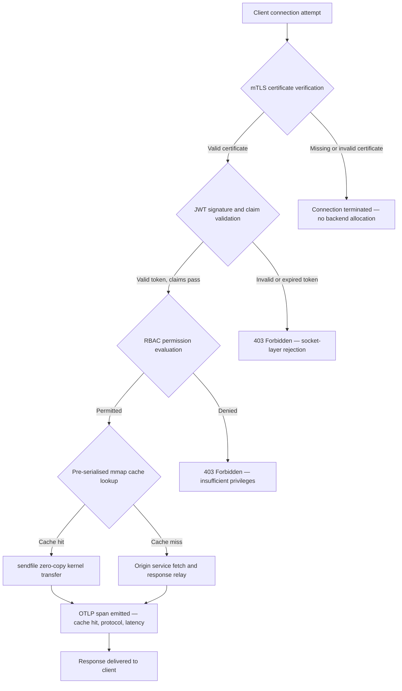

## http-handle: nagy teljesítményű, függőségmentes peremhálózati bemenet a banki szektorban 2026-ban

A banki peremhálózatnak függőségi problémája van. Minden Nginx- vagy Envoy-példány, amely egy ügyfél és egy központi banki szolgáltatás között irányítja a forgalmat, egy függőségi fát hordoz: OpenSSL-buildeket, Lua-modulokat, gRPC-könyvtárakat és konténerrétegeket, amelyek mindegyike potenciális CVE, mindegyike külön javítási ciklust igényel, és mindegyike olyan késleltetésingadozást ad hozzá, amely megnehezíti az SLA mérését. A [digitális működési ellenállóképességről szóló rendelet (DORA)](https://eur-lex.europa.eu/eli/reg/2022/2554/oj) értelmében ez a komplexitás mostanra éppúgy szabályozási kötelezettség, mint működési.

A [http-handle](https://github.com/sebastienrousseau/http-handle) más megközelítést alkalmaz. Ez egyetlen, statikusan linkelt Rust bináris, amelynek a `libc`-en túl nincs futásidejű függősége. 180 000 kérést szolgáltat másodpercenként ARM64 csomópontokon, kölcsönös TLS- és JWT-hitelesítést kényszerít ki a hálózati socket szintjén, és automatikusan egyeztet HTTP/2- és HTTP/3-protokollt, mindezt 20 MB-nál kisebb RAM-igényű telepítési lábnyomon belül.

## Gyors válasz

**Mi a http-handle egyetlen mondatban?** A http-handle egy nyílt forráskódú, statikusan linkelt Rust bináris, amely a nehéz proxykonténereket váltja ki a banki peremhálózaton, 180 000 kérést szolgáltatva másodpercenként ARM64-en a Linux `sendfile(2)` zero-copy kernelátvitelein keresztül, kikényszerítve az mTLS-t, a JWT-t és az RBAC-t a socket szintjén, mielőtt bármely háttérerőforrás érintve lenne, és natív [OpenTelemetry](https://opentelemetry.io/) metrikákat bocsátva ki, a `libc`-en túl futásidejű könyvtárfüggőségek nélkül.

## Vezetői összefoglaló

A bankok egy évtizede üzemeltetik az Nginxet és az Envoyt a peremhálózatukon. Mindkettő alkalmas eszköz; egyiket sem a 2026-os szabályozási környezetre tervezték. A függőségekkel terhelt konténerképek olyan CVE-sorokat generálnak, amelyeket a megfelelési csapatok nem tudnak elég gyorsan feldolgozni, és minden könyvtárverzió-emelés regressziós kockázatot hordoz. A DORA 5. és 6. cikke megköveteli, hogy az IKT-kockázatot tervezésből kezeljék, ne pedig a felfedezés után javítsák. A Basel III működésikockázat-keretrendszerei büntetik azokat az architektúrákat, amelyekben a hibapontok a rendszer komplexitásával együtt szaporodnak.

A http-handle a forrásnál szünteti meg a függőségi problémát. A binárist egyszer, statikusan fordítják le, futásidőben semmilyen külső könyvtárat nem igényel. A támadási felület a Rust szabványos könyvtárára és a `libc`-re zsugorodik. A biztonsági kényszerítés, az mTLS-tanúsítvány ellenőrzése, a JWT-igények validálása és a szerepköralapú hozzáférés-vezérlés, a hálózati socketen fut le bármilyen háttérfoglalás előtt, a lehető legkisebb kifejeződésére szűkítve a Zero Trust határt. A teljesítmény az architektúrából következik: az előre szerializált, memóriába leképezett gyorsítótár-blokkok a `sendfile(2)` kernelátvitelekkel kombinálva teljesen kiiktatják az adatokat a CPU és a memória közötti másolási útvonalról, 180 000 kérés/másodperc értéket tartva fenn ARM64 hardveren. Az eredmény egy olyan bemeneti réteg, amely megfelel a DORA ellenállóképességi követelményeinek, alátámasztja a Basel III működésikockázat-csökkentési érveit, és a felső vezetésű IT-vezetőknek az SM&CR keretében ellenőrizhető, egykomponensű elszámoltathatósági láncot biztosít a peremhálózati infrastruktúrához.

## Legfontosabb tanulságok

- **Kisebb binárisok, rövidebb CVE-sorok.** Egy statikusan linkelt, egyetlen bináris esetében egy csomagot kell javítani, egy kiadást validálni és egy műterméket auditálni. Az Nginx szabványos modulkészlettel több mint 30 megosztott könyvtárfüggőséggel érkezik; mindegyiknek saját sebezhetőségi életciklusa van.
- **A zero-copy nem optimalizálás, hanem tervezési kényszer.** 180 000 kérés/másodperc mellett bármely felhasználói terű adatmásolás mérhető késleltetésingadozást okoz. A `sendfile(2)` a fájlleíró tartalmát teljes egészében kerneltérben viszi át a hálózati socketre. Az mmap-pel rögzített válasz-gyorsítótár-blokkokkal kombinálva a CPU soha nem érinti az adatútvonalat a gyorsítótárazott válaszok esetén.
- **A biztonsági perem a socketen a helye.** A JWT-k és az mTLS-tanúsítványok alkalmazásköztes rétegben történő validálása azt jelenti, hogy a háttér már szálakat és memóriát foglalt, mielőtt a kérést elutasítanák. A socketszintű validálás biztosítja, hogy a nem hitelesített kérések egyáltalán semmilyen háttérerőforrást ne fogyasszanak.
- **Az OTLP megszünteti a megfigyelhetőségi hiányt.** A natív OpenTelemetry-integráció azt jelenti, hogy minden kérés, minden hitelesítési döntés és minden protokollegyeztetés strukturált telemetriát állít elő sidecar ügynök nélkül. A meglévő banki irányítópultok közvetlenül fogadják be az OTLP-nyomokat.

**Kapcsolódó olvasmány:** [Miért van szüksége a YAML-nek biztonságosabb Rust-készletre az AI, az MCP és a pénzügyi infrastruktúra számára 2026-ban](https://sebastienrousseau.com/2026-06-18-noyalib-safe-yaml-rust-ai-mcp-financial-infrastructure-2026/), [CloudCDN: nyílt forráskódú tervrajz az AI-natív peremhálózathoz 2026-ban](https://sebastienrousseau.com/2026-06-11-cloudcdn-open-source-blueprint-ai-native-edge-2026/), [A legjobb felhőinfrastruktúra-architektúra bankok és pénzügyi intézmények számára 2026-ban](https://sebastienrousseau.com/2026-05-16-best-cloud-infrastructure-architecture-2026/).

## 01. A nehéz proxy problémája a banki szektorban

Az Nginx és az Envoy építette a modern internet peremhálózatát. Konfigurálhatók, harcban kipróbáltak, és nagy közösségek támogatják őket. Egyúttal olyan architekturális döntések, amelyek még azelőtt születtek, hogy a DORA létezett volna, mielőtt a Basel III működésikockázat-keretrendszerei számszerűsíthető komplexitáscsökkentést követeltek volna, és mielőtt az ARM64 felhőcsomópontok megváltoztatták volna a nagy áteresztőképességű számítás gazdaságosságát.

A gyakorlati következmény szakadék aközött, amire a bankoknak szükségük van, és amit a nehéz proxykonténerek nyújtanak.

**Függőségi felület.** Egy szabványos Envoy-telepítés magával hozza az OpenSSL-t, az Abseilt, a Protobufot, a gRPC-t, a Luát és több tucat másodlagos könyvtárat. Mindegyik önálló CVE-életciklust hordoz. Amikor a National Vulnerability Database kritikus OpenSSL-figyelmeztetést tesz közzé, az állomány minden Envoy-példánya megfelelési órává válik: felmérés, javítás, tesztelés, újratelepítés és újratanúsítás, minden környezetben, ahol a bináris fut. A DORA 6. cikke értelmében a bankoknak igazolniuk kell, hogy az IKT-kockázatkezelési folyamataik arányosak, dokumentáltak és ellenőrizhetők. Egy többkönyvtáras függőségi fa költségessé teszi ennek az igazolásnak a fenntartását.

**Memóriaterhelés.** Egy minimálisan konfigurált Nginx munkafolyamat 40-80 MB rezidens memóriát fogyaszt mérsékelt terhelés mellett. Nagy léptékben, több száz bemeneti csomópont a kereskedési rendszerekben, a fizetési API-kban és az ügyfélportálokon, ez a terhelés mérhető infrastruktúraköltséggé halmozódik, anélkül hogy megfelelő teljesítménybeli előnyt nyújtana egy jól megtervezett, egybináris alternatívával szemben.

**Javítási sebesség.** A konténerkép-ellátási láncok többnapos késést visznek be egy CVE közzététele és egy validált javítás éles környezetbe kerülése közé. Az alapképet újra kell építeni, az alkalmazásréteget újra kell rétegezni, a teljes tesztmátrixot újra kell futtatni, és a telepítési folyamatot újra kell végrehajtani. A DORA incidensjelentési ablakai alatt működő kritikus banki rendszerek számára ez a ciklus strukturális kockázat.

A http-handle mindhármat kezeli. Egyetlen bináris. Egyetlen CVE-felület. Egyetlen javítandó műtermék. 20 MB-nál kevesebb RAM egy éles bemeneti csomóponthoz.

## 02. A http-handle 2026-os architektúrájának nézőpontja

A bináris öt egymásra épülő rétegre tagolódik, amelyek mindegyikét egy adott kockázatkategória kiküszöbölésére tervezték, amelyet a hagyományos proxyarchitektúrák felhalmoznak.

### 1. táblázat: http-handle architektúrarétegek és kockázatcsökkentés

| Réteg | Tervezési döntés | Miért fontos | Kockázat helytelen kezelés esetén |
| ---- | ---- | ---- | ---- |
| **Szervermag** | Egyetlen Rust bináris, statikusan linkelt, a `libc`-en túl nulla függőség | Egyetlen javítandó műtermék; kiküszöböli a könyvtári CVE-k terjedését az állományban | Függőségi zavart okozó (dependency confusion) támadások; könyvtári sebezhetőségek felhalmozódása |
| **Gyorsítómotor** | Előre szerializált mmap gyorsítótár-blokkok és `sendfile(2)` zero-copy kernelátvitelek | 180 000 kérés/másodperc ARM64-en, milliszekundum alatti proxyterheléssel; a gyorsítótárazott válaszokhoz semmilyen adat nem kerül felhasználói térbe | Memórialeképezési szivárgások; kerneltérbeli szűk keresztmetszetek a gyorsítótár érvénytelenítése során |
| **Kriptográfiai biztonság** | Natív mTLS, forró újratöltésű (hot-reload) tanúsítványtámogatással és ALPN-egyeztetéssel | Garantálja az adatintegritást és a protokollkompatibilitást; tanúsítványrotáció kapcsolatmegszakadás nélkül | Tanúsítványlejárat okozta szolgáltatáskiesések; gyenge alapértelmezett titkosítási csomagok |
| **Hozzáférési szabályzatsík** | Socketszintű JWT-validálás és RBAC-igények kiértékelése | A nem hitelesített kérések nem fogyasztanak háttérerőforrást; a Zero Trust a kernelhatáron érvényesül | JWT-algoritmuszavart okozó támadások; túlzott jogosultságot biztosító RBAC-hibás konfiguráció |
| **Megfigyelhetőség** | Natív [OpenTelemetry (OTLP)](https://opentelemetry.io/docs/specs/otlp/) integráció | Strukturált telemetria sidecar ügynökök nélkül; közvetlen befogadás a meglévő banki monitoringállományokba | Vakfoltok kiesések során; hiányos auditnyomvonalak a DORA-incidensjelentéshez |

## 03. Kulcsfontosságú teljesítmény- és biztonsági jelzések

A http-handle-t a peremhálózaton üzemeltető bankoknak öt számszerűsíthető jelzést kell műszerezniük, hogy megfeleljenek a DORA működési jelentési követelményeinek és a belső SLA-irányításnak.

### 2. táblázat: Működési referenciaértékek és szabályozási hivatkozások

| Jelzés | Referenciaérték | Szabályozási hivatkozás | Technikai megvalósítás |
| ---- | ---- | ---- | ---- |
| **Áteresztőképesség** | ≥ 180 000 kérés/másodperc ARM64 csomópontokon, P99 ≤ 1 ms proxyterhelés mellett | Basel III működési kockázat: rendszerkomplexitás csökkentése | `sendfile(2)` + mmap előre szerializált gyorsítótár-blokkok; nincs felhasználói terű adatmásolás a gyorsítótár-találatokhoz |
| **Támadási felület** | Nulla futásidejű könyvtárfüggőség; kiadásonként egyetlen bináris műtermék | [DORA 6. cikk](https://eur-lex.europa.eu/eli/reg/2022/2554/oj): IKT-kockázatkezelés tervezésből | Statikus fordítás: `cargo build --release --target aarch64-unknown-linux-musl` |
| **Hitelesítési késleltetés** | mTLS-kézfogás + JWT-validálás a háttérválasz első bájtja előtt befejeződik | [DORA 5. cikk](https://eur-lex.europa.eu/eli/reg/2022/2554/oj): IKT-biztonsági védelem | Socketszintű elfogás; JWT-igények kiértékelése kernelközeli Rustban a háttér felé irányítás előtt |
| **Tanúsítvány-rendelkezésreállás** | mTLS-tanúsítványok forró újratöltése nulla megszakadt kapcsolattal a rotáció alatt | SM&CR felső vezetői elszámoltathatóság a peremhálózat rendelkezésre állásáért | inotify-vezérelt tanúsítványfigyelő; atomi fájlleíró-csere az újratöltés során |
| **Megfigyelhetőségi lefedettség** | A kérések 100%-a OTLP-spanokat állít elő a hitelesítés eredményével, a protokollverzióval és a gyorsítótár állapotával | DORA 17. cikk: incidensészlelés és -jelentés | Natív OTLP-exportáló; nincs szükség sidecarra; gRPC vagy HTTP/Protobuf szállítás konfigurálható |

## 04. A zero-copy motor: mmap és sendfile(2)

A nagyfrekvenciájú banki tevékenység hálózati teljesítményét, valós idejű fizetések, piaci adat API-k, hitelesítési token szolgáltatások, egyetlen kényszer korlátozza minden másnál jobban: a bájtok tárolóból a hálózati socketre mozgatásának költsége.

A hagyományos HTTP-szerverek a fájltartalmat egy felhasználói terű pufferbe olvassák be, majd ezt a puffert a socketre írják. Ez a sorozat két memóriamásolást és két kontextusváltást igényel a felhasználói tér és a kerneltér között minden egyes válasznál. 180 000 kérés/másodperc mellett a felhalmozódott terhelés jelentős.

A http-handle mindkét másolást kiküszöböli.

**Memóriába leképezett gyorsítótár-blokkok.** A szolgáltatás indulásakor a statikus válasz tartalmát memóriába leképezett régiókba szerializálja a `mmap(2)` segítségével. Ezek a régiók a kernel lapgyorsítótárában rögzítve vannak. Amikor egy kérés érkezik egy gyorsítótárazott erőforrásra, a válasz már le van képezve a kernelmemóriába: nincs lemezolvasás, nincs pufferfoglalás.

**`sendfile(2)` kernelátvitel.** A Linux `sendfile(2)` rendszerhívás közvetlenül egy fájlleíróból, vagy egy memóriába leképezett régióból, egy hálózati socket fájlleíróba viszi át az adatokat, teljes egészében a kernelen belül. Egyetlen bájt sem kerül felhasználói térbe. A CPU szerepe a rendszerhívás kiadására és a befejezési esemény kezelésére korlátozódik. Ezzel az architektúrával rendelkező ARM64 csomópontokon a http-handle 180 000 kérés/másodperc értéket tart fenn milliszekundum alatti proxyterheléssel, tartós terhelés mellett.

A hónap végi kötegelt egyeztetést, napközbeni likviditásjelentést vagy valós idejű csaláspontozási API-forgalmat futtató bankok számára a mérnöki következmény közvetlen: kevesebb ARM64 csomópont forgalmi szintenként, alacsonyabb infrastruktúraköltség, és kisebb, kapacitáshiányból eredő DORA ellenállóképességi kockázat.

## 05. Az mTLS és JWT hozzáférési szabályzatsík

A banki szektorban a peremhálózaton történő hitelesítés nem szolgáltatás, hanem szabályozási követelmény. A DORA előírja, hogy az IKT-biztonsági kontrollok arányosak, dokumentáltak és ellenőrizhetők legyenek. Az SM&CR az infrastruktúra-biztonsági döntésekért való személyes elszámoltathatóságot megnevezett felső vezetőkre helyezi. A kérdés nem az, hogy hitelesíteni kell-e a peremhálózaton, hanem az, hogy melyik rétegben.

A http-handle háromlépcsős Zero Trust szabályzatot kényszerít ki, mielőtt bármely háttérerőforrás lefoglalódna.

**1. lépcső: mTLS ügyféltanúsítvány ellenőrzése.** A TLS-kézfogás során a http-handle bekéri és egy konfigurálható megbízhatósági tár alapján validálja az ügyféltanúsítványt. Az érvényes tanúsítvány nélküli kapcsolatok a kézfogásnál megszakadnak. Nem indul alkalmazásszál, nem foglalódik le memóriapool. A háttér soha nem látja a kérést.

**2. lépcső: JWT-igények validálása.** Az mTLS-en átjutott kapcsolatok esetén a http-handle kinyeri és validálja a JSON Web Tokent az `Authorization` fejlécből a socket szintjén. Az aláírás-ellenőrzés, a lejárati ellenőrzések és a kibocsátó validálása azelőtt történik, hogy a kérés elérné az irányítási réteget. Az algoritmuszavart okozó támadásokat, ahol egy szerver szimmetrikus algoritmust fogad el, miközben aszimmetrikus kulcsot vár, a konfigurációban explicit algoritmus-engedélyezőlistával blokkolja.

**3. lépcső: RBAC-igények kiértékelése.** A validált JWT-igények egy memóriában tárolt szerepkör-táblához rendelődnek. Az elégtelen jogosultságokkal rendelkező kérések 403-as választ kapnak a hozzáférési szabályzatsíkon. A háttérszolgáltatás soha nem hívódik meg jogosulatlan forgalom esetén.

Ez a sorrendiség működési szempontból lényeges. A hagyományos modellben, ahol a hitelesítés az alkalmazásköztes rétegben fut, egy támadó kimerítheti a háttér szálpooljait nem hitelesített kérésekkel, mielőtt egyetlen elutasítás is megtörténne. A socketszintű hitelesítés teljesen összeomlasztja ezt a támadási vektort.

## 06. ALPN-útválasztás és a HTTP/3 tartalék lánc

A banki forgalom változatos hálózati körülmények között érkezik: vállalati optikai kábel a kereskedési részlegek számára, 5G a mobilbanki ügyfelek számára, műholdas kapcsolat a távoli műveletekhez, és TLS-ellenőrző proxyk a szabályozott környezetekben. Az egyprotokollos bemenet a legkisebb közös nevezőhöz igazodó kényszert teremt.

A http-handle az [alkalmazásrétegű protokollegyeztetést (ALPN)](https://www.rfc-editor.org/rfc/rfc7301) használja az egyes kapcsolatokhoz optimális protokoll automatikus kiválasztására.

A **HTTP/2** az alapértelmezett a böngésző- és API-forgalom számára TCP felett. Az egyetlen kapcsolaton keresztül multiplexelt adatfolyamok kiküszöbölik a sorfej-blokkolást (head-of-line blocking), amelyet a HTTP/1.1 okoz párhuzamos kérési mintázatoknál.

A **HTTP/3 (QUIC)** akkor aktiválódik, amikor a hálózat támogatja az UDP-t, és az ügyfél a `h3`-at hirdeti az ALPN-kiterjesztésében. A QUIC független adatfolyam-multiplexelése és kapcsolatmigrációja érdemben jobbá teszi a mobilbanki ügyfelek számára a zsúfolt mobilhálózatokon, ahol a TCP-kapcsolatok gyakran megszakadnak és újracsatlakoznak.

**Szabályos visszalépés.** Ha az ALPN-egyeztetés meghiúsul, mert egy közbenső proxy eltávolítja a kiterjesztést, vagy egy régi ügyfél kihagyja azt, a http-handle visszalép a HTTP/1.1-re, miközben megőriz minden biztonsági fejlécet, mTLS-kényszerítést és JWT-validálást. Semmilyen biztonsági tulajdonság nem romlik a protokoll-visszalépés során.

## 07. A zero-copy kérés életciklusa

Az alábbi diagram a teljes kérési útvonalat mutatja az ügyfélkapcsolattól a válasz kézbesítéséig, beleértve a hitelesítési kapukat és a megfigyelhetőségi kibocsátási pontokat.

A gyorsítótár-találatot adó válaszok kritikus útvonala három biztonsági kapun és egyetlen rendszerhíváson halad át. A válasz törzséhez nem foglalódik felhasználói terű puffer. Az OTLP-span egyetlen strukturált rekordban rögzíti a hitelesítés eredményét, az ALPN-nel egyeztetett protokollverziót, a gyorsítótár állapotát és a végponttól végpontig terjedő késleltetést.

## 08. Szabályozási összhang: DORA, Basel III és SM&CR

### DORA 5. és 6. cikk: IKT-kockázatkezelés és -védelem

A [DORA 5. cikke](https://eur-lex.europa.eu/eli/reg/2022/2554/oj) előírja a pénzügyi szervezetek számára, hogy IKT-kockázatkezelési kereteket tartsanak fenn. A 6. cikk előírja számukra, hogy az IKT-rendszereik kockázati profiljához arányos védelmi és megelőzési intézkedéseket vezessenek be.

Egy statikusan linkelt, egyetlen bináris hatékonyabban elégíti ki mindkét követelményt, mint egy többkönyvtáras konténerverem. A támadási felület számszerűsíthető, egy műtermék, egy függőség (`libc`), egy CVE-felület, a védelmi intézkedések pedig strukturálisak, nem eljárásbeliek: az mTLS- és JWT-kényszerítés nem kerülhető meg hibás konfigurációval, mert a socket szintjén futnak le, mielőtt bármilyen konfigurálható alkalmazáslogika elindulna.

### Basel III: Működési kockázat tőkekövetelményei

A [Basel III működésikockázat-keretrendszere](https://www.bis.org/bcbs/basel3.htm) a szabályozói tőkekövetelményeket az igazolható kockázatcsökkentéshez köti. Azok a bankok, amelyek dokumentálni tudják a rendszerkomplexitás és az IKT-hibapontok számának mérhető csökkenését, számszerűsíthető érvvel rendelkeznek a csökkentett működésikockázati tőkeallokáció mellett. Egy többkonténeres proxyállomány egybináris bemeneti csomópontokra cserélése pontosan az a fajta komplexitáscsökkentés, amely alátámasztja ezt az érvet, feltéve, hogy a mérnöki csapat elő tudja állítani a tanúsítási dokumentációt.

A http-handle auditálható kiadási műtermékei, a reprodukálható buildek, az SBOM-kompatibilis függőségi manifesztek és az OTLP-alapú működési naplók, támogatják azt a dokumentációs láncot, amelyet a Basel III tőkemegbeszélései megkövetelnek.

### SM&CR: Felső vezetői elszámoltathatóság

A [felső vezetői és tanúsítási rendszer (SM&CR)](https://www.fca.org.uk/firms/senior-managers-certification-regime) személyes felelősséget ró a megnevezett felső vezetőkre a felelősségi körükbe tartozó rendszerek IKT-biztonsági állapotáért. Egy egybináris bemenet, amely szolgáltatásmegszakítás nélkül tölti újra forrón a tanúsítványokat, strukturált auditnaplókat állít elő OTLP-n keresztül, és telepítésenként egyetlen verzióhoz rögzített műterméke van, ellenőrizhető, dokumentálható biztonsági láncot ad a megnevezett felső vezetőnek. Egy többkönyvtáras konténerverem nem.

## 09. Mit jelent ez szerepkörönként

### Igazgatótanács és vezérigazgatók

A Basel III működésikockázat-keretrendszerei szerinti szabályozói tőkeoptimalizálás az igazolható komplexitáscsökkentéstől függ. Az Nginx vagy az Envoy egyetlen statikusan linkelt binárisra cserélése úgy csökkenti az IKT-hibapontok számát, amely auditálható és bemutatható a prudenciális szabályozó hatóságoknak. A csökkentett CVE-felület a kiberbiztosítási díj újratárgyalását is támogatja: a biztosítók az igazolható támadásifelület-metrikák alapján áraznak, és egy egyfüggőségű bemeneti bináris konkrét adatpont.

### Információbiztonsági vezetők és kockázati vezetők

A DORA-megfelelés megköveteli, hogy az IKT-védelmi intézkedések arányosak és ellenőrizhetők legyenek. A socketszintű mTLS- és JWT-kényszerítés ellenőrizhető, meg nem kerülhető hitelesítési kaput biztosít a peremhálózaton. A forró újratöltésű tanúsítványrotáció kiküszöböli azt a szolgáltatásiablak-kockázatot, amelyet a hagyományos tanúsítványfrissítések hordoznak. A függőségmentes fordítási modell azt jelenti, hogy amikor egy kritikus `libc`-figyelmeztetés jelenik meg, a teljes állomány újraépíthető, tesztelhető és újratelepíthető egyetlen Rust forrás-műtermékből, napok helyett órák alatt.

### Mérnöki és IT-menedzsment

180 000 kérés/másodperc egy szabványos ARM64 csomóponton megváltoztatja az infrastruktúra-méretezési párbeszédet a fizetési API-k és a hitelesítési szolgáltatások esetében. A natív OTLP-integráció feleslegessé teszi a Prometheus-exportálókat, a sidecar ügynököket vagy az egyedi naplótovábbítókat. A Kubernetes-telepítési modell egy szabványos pod: 20 MB-nál kevesebb RAM, nincsenek privilegizált konténerjogosultságok, nincs gazdagép-hálózati hozzáférés. A tanúsítványok forró újratöltése a Kubernetes gördülő újraindítási terhelése nélkül működik.

## GYIK

**Hogyan kezeli a http-handle a tanúsítványrotációt terhelés alatt?**
A bináris egy inotify-figyelővel felügyeli a tanúsítványfájlok elérési útjait. Amikor új tanúsítvány- és kulcsfájlokat észlel, atomi cserét hajt végre az aktív TLS-kontextuson: a meglévő kapcsolatok az előző tanúsítvánnyal fejeződnek be, míg az új kapcsolatok azonnal a rotált tanúsítványt használják. Egyetlen kapcsolat sem szakad meg. Nincs szükség szolgáltatási ablakra.

**Futtatható a http-handle egy Kubernetes-fürtön belül bemeneti vezérlőként?**
Igen. A bináris önálló podként fut szabványos bemeneti szolgáltatásannotációval. Az erőforrásigény teljes áteresztőképesség mellett 20 MB-nál kevesebb RAM, privilegizált konténerjogosultságok és gazdagép-hálózati hozzáférés igénye nélkül. Sidecarként is futtatható olyan szolgáltatáshálókban (service mesh), ahol a sidecar rétegben történő mTLS-kényszerítés előnyben részesül a központosított átjáró-hitelesítéssel szemben.

**Mekkora a proxy önmagában mérhető késleltetési hozzájárulása?**
A gyorsítótár-találatot adó válaszok esetén a proxyterhelés, a socket elfogadásától a `sendfile(2)` befejezéséig, milliszekundum alatti ARM64 hardveren. A felfelé irányuló lekérést igénylő gyorsítótár-tévesztéses válaszok esetén a terhelés ugyanaz a milliszekundum alatti érték, plusz a forrás válaszideje. Maga a proxy nem ad sorbanállási késleltetést, mert a hitelesítés szinkron módon történik a socket szintjén, szálpool-foglalás nélkül, mielőtt a hitelesítő adatok validálása befejeződne.

**Hogyan illeszkedik a http-handle egy Zero Trust architektúrába egy meglévő API-átjáró mellett?**
A http-handle az OSI 4/7. réteg határán működik: kikényszeríti a szállítási rétegű mTLS-t, és validálja az alkalmazásrétegű JWT-ket, mielőtt a felfelé irányuló szolgáltatások felé irányítana. Elhelyezkedhet egy teljes API-átjáró előtt, felszívva a nem hitelesített forgalmat, mielőtt az elérné az átjáró költségesebb feldolgozási rétegét, vagy teljesen kiválthatja az átjárót olyan szolgáltatások esetében, amelyek hozzáférési szabályzata teljes egészében JWT-igényekkel kifejezhető.

**Reprodukálható-e a bináris kimenet ellátásilánc-auditálási célokra?**
Igen. A build reprodukálható egy rögzített Rust eszközlánc-verzióval és zárolt `Cargo.lock`-kal. Az SBOM-generálás a `cargo cyclonedx` segítségével CycloneDX-kompatibilis anyagjegyzéket állít elő minden kiadáshoz. Mindkét műtermék publikálható a bank belső szoftverösszetétel-elemző eszközláncába, és megfelel a DORA ellátásilánc-kockázati dokumentációs követelményeinek.

## Következtetés

A banki peremhálózatnak nem több funkcióra van szüksége, hanem kevesebb komponensre, amelyek mindegyike kevesebbet tesz, és ezt ellenőrizhető módon teszi. A http-handle a bemeneti réteget a tovább nem csökkenthető minimumára redukálja: egyetlen Rust bináris, amely a socketen kényszeríti ki a hitelesítést, másolás nélkül viszi át az adatokat, és strukturált telemetriában jelent mindent, amit tesz. A DORA-megfelelési határidők, a Basel III tőkeoptimalizálási felülvizsgálatok és az SM&CR elszámoltathatósági követelmények között navigáló bankok számára ez az egyszerűség nem mérnöki preferencia, hanem szabályozási érv.

A [http-handle forráskódja](https://github.com/sebastienrousseau/http-handle) az MIT és az Apache 2.0 kettős licenc alatt érhető el.

---

*Hivatkozások*

Basel Committee on Banking Supervision (2011). *Basel III: A global regulatory framework for more resilient banks and banking systems*. Bank for International Settlements. Available at: [https://www.bis.org/publ/bcbs189.htm](https://www.bis.org/publ/bcbs189.htm)

European Parliament and Council (2022). Regulation (EU) 2022/2554 on digital operational resilience for the financial sector (DORA). Available at: [https://eur-lex.europa.eu/legal-content/EN/TXT/?uri=CELEX:32022R2554](https://eur-lex.europa.eu/legal-content/EN/TXT/?uri=CELEX:32022R2554)

Financial Conduct Authority (2015). *Senior Managers and Certification Regime (SM&CR)*. Available at: [https://www.fca.org.uk/firms/senior-managers-certification-regime](https://www.fca.org.uk/firms/senior-managers-certification-regime)

Internet Engineering Task Force (2014). *RFC 7301: Transport Layer Security (TLS) Application-Layer Protocol Negotiation Extension*. Available at: [https://www.rfc-editor.org/rfc/rfc7301](https://www.rfc-editor.org/rfc/rfc7301)

OpenTelemetry Authors (2024). *OpenTelemetry Protocol Specification (OTLP)*. Available at: [https://opentelemetry.io/docs/specs/otlp/](https://opentelemetry.io/docs/specs/otlp/)
