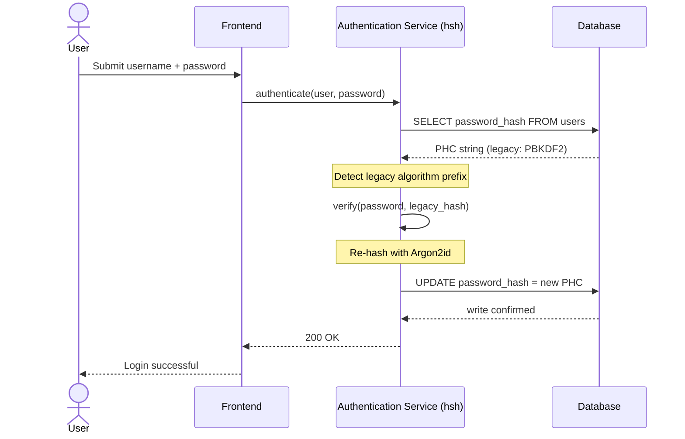
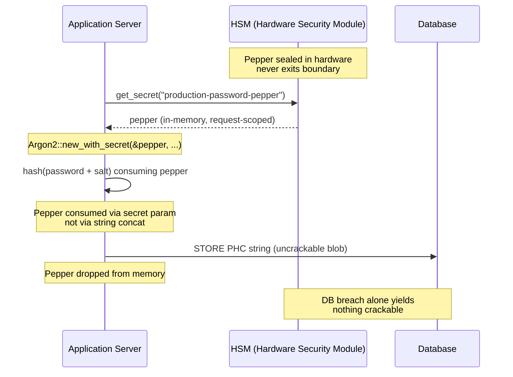

## Jelszókezelés biztonságossá tétele a vállalati bankszektorban: többalgoritmusos hasításolás és frissítések a hsh eszközzel

### Hogyan teszi lehetővé egy tiszta Rust kriptográfiai keretrendszer, hogy a bankok zökkenőmentesen frissítsék a régi jelszavakat Argon2id-re HSM-reteszekkel, és mit jelent ez a DORA és a Basel III megfelelés szempontjából.

> **Vezetői összefoglaló.** A 2018-as fenyegetettségi modellre épített banki hitelesítés a 2026-os szabályozási rezsim alatt már nem alkalmas a célra. A GPU-gyorsított feltörés, az ASIC-sűrűség és a közeledő posztkvantum horizont összeomlasztotta a PBKDF2 és a korai paraméterezésű scrypt biztonsági tartalékát; a DORA 5. cikke ezt a leépülést igazgatósági szinten elszámoltatható felelősséggé alakította. A hsh, egy nyílt forráskódú, tiszta Rust keretrendszer, három rétegen egyszerre kezeli a problémát: egy `verify_and_upgrade` diszpécser, amely minden sikeres bejelentkezéskor karbantartási ablak nélkül újrahasítja a tárolt hitelesítő adatot az aktuális Argon2id paraméterekre; egy HSM- vagy KMS-reteszelt borsozási réteg, amely önmagában egy adatbázis-feltörésből semmi feltörhetőt nem tesz kinyerhetővé; és egy memóriabiztos ellátási lánc, amely megszünteti a C-alapú kriptográfiai könyvtárak eredendő idegenfüggvény-interfész támadási felületét. Az eredmény egy olyan alapréteg, amely megfelel a DORA-nak, a Basel III működési kockázati fegyelmének, az SM&CR felső vezetői elszámoltathatóságának és a NIST IR 8547 posztkvantum migrációs horizontjának, anélkül, hogy egy hitelesítési birtok frissítéséhez korábban szükséges tömeges visszaállítási programra lenne szükség.

A legtöbb vállalati banki hitelesítés még mindig egy 2018-as fenyegetettségi modellre keményített jelszórétegen nyugszik. A hardver, amely feltöri, tovább fejlődött. Ahogy a GPU-farmok skálázódnak, és a kriptográfiailag releváns kvantumszámítógépek (CRQC-k) közelednek, a régi hasításolás, a PBKDF2, a korai scrypt, minden órányi számítással leépül, amit a támadók az offline feltörési sorra fordítanak. A leépülés csendes: semmi sem árulja el a termelési adatbázisban, hogy a tegnap még erős hasítás ma már nem az.

A [Digitális Működési Ellenállóképességi Rendelet (DORA)](https://eur-lex.europa.eu/eli/reg/2022/2554/oj "(EU) 2022/2554 rendelet, Digitális Működési Ellenállóképességi Rendelet") értelmében a rotálatlan, régi kriptográfiai eszközök termelésben hagyása már nem technikai adósság. Ez megnevezett szabályozási felelősség.

A [hsh](https://github.com/sebastienrousseau/hsh "hsh, tiszta Rust jelszóhasításoló keretrendszer") betölti ezt a rést. Egy tiszta Rust keretrendszer, amely több hasításformátumot kezel egymás mellett, és menet közben, aktív bejelentkezési munkamenetek során frissíti a gyenge hitelesítő adatokat. A hitelesítési infrastruktúra a 2026-os ellenállóképességi előírásokhoz igazodik karbantartási ablak nélkül, kényszerített visszaállítás nélkül, egyetlen másodpercnyi leállás nélkül.

## 01. A kriptográfiai leépülés problémája a bankszektorban

Egy olyan keretrendszer szükségességének megértéséhez, mint a hsh, meg kell érteni egy jelszóhasítás életciklusát. Az algoritmusok nem öregszenek kecsesen; a feltörésükhöz rendelkezésre álló hardverhez képest leépülnek.

**Az ASIC/GPU gyorsítási rés.** Az olyan algoritmusokat, mint a PBKDF2, arra tervezték, hogy a CPU-k számára számításigényesek legyenek. Ma a támadók erősen párhuzamosított GPU-kat használnak offline szótári támadások végrehajtására. Egy 2018-ban generált régi hasítás jelentősen gyengébb egy 2026-os ellenféllel szemben.

**A nagy robbanású migráció kockázata.** Amikor egy CISO úgy dönt, hogy a PBKDF2-ről egy memóriakemény algoritmusra, például Argon2id-re frissít, nem tudja visszafejteni a hasításokat, hogy újratitkosítsa őket. A hagyományos megoldások, több millió felhasználó jelszó-visszaállításának kikényszerítése, hatalmas ügyfélsúrlódást és működési kockázatot okoznak.

**A C-könyvtárak ellátási lánca.** Történelmileg a banki köztes szoftverek olyan könyvtárakra támaszkodtak, mint az `argonautica`, vagy nyers C-kötésekre a hasításoláshoz. Ezek a könyvtárak rejtett ellátásilánc-kockázatot hordoznak: egyetlen memóriapuffer-túlcsordulás a hitelesítési modulban távoli kódfuttatáshoz (RCE) vezethet a banki verem legkiváltságosabb rétegén.

### Algoritmus-összehasonlítás: hardveres ellenállás és hangolási felület

A három algoritmus, amellyel egy bank egy migrációs korpuszban reálisan találkozik, kevésbé a kriptográfiai primitív megválasztásában, inkább abban különbözik, hogyan öregszik hardveres nyomás alatt. Az alábbi táblázat összefoglalja a gyakorlati helyzetet.

| Algoritmus | Memóriakemény | GPU / ASIC ellenállás | Hangolási felület | 2026-os státusz |
| ---- | ---- | ---- | ---- | ---- |
| **PBKDF2** | Nem | Alacsony: GPU-n vektorizálódik; tizedmásodperc alatti tippenként hétköznapi hardveren. | Csak iterációszám. | Elavult. Csak ellenőrzési oldali tartalékként elfogadható a migráció során. |
| **scrypt** | Igen (mérsékelt) | Közepes: a memóriaköltség legyőzi az egyszerű GPU-farmokat; ASIC-en méretben amortizálható. | `N` (CPU/memória), `r` (blokkméret), `p` (párhuzamosság). | Új fejlesztésekhez elavult. Aktív a migrációs korpuszokban. |
| **Argon2id** | Igen (magas) | Magas: memória- és időkemény; ellenáll az oldalcsatornás és TMTO-támadásoknak. | Memóriaköltség (`m`), időköltség (`t`), párhuzamosság (`p`), titok (bors). | Ajánlott alapértelmezés. OWASP, NIST SP 800-63B-4 tervezet, FedRAMP. |

A migrációs tervhez levonható tanulság szűk: a PBKDF2 egy *ellenőrzési oldali* állapot, nem pedig egy *írási oldali* célállomás. Minden sikeres bejelentkezésnek egy PBKDF2 rekordon Argon2id rekordot kell eredményeznie a kilépéskor.

## 02. A hsh 2026-os architektúrájának nézete

A keretrendszer öt alapvető rétegre tagolódik, amelyek mindegyikét egy adott működési kockázati kategória mérséklésére tervezték.

### 1. táblázat: a hsh architektúra rétegei és a kockázatmérséklés

| Réteg | Tervezési döntés | Miért fontos | Kockázat helytelen kezelés esetén |
| ---- | ---- | ---- | ---- |
| **Kriptográfiai primitívek** | Egységes PHC karakterlánc-formátum, amely támogatja az Argon2id-t, a scrypt-et és a PBKDF2-t | A legjobb osztályú ellenállást biztosítja a GPU-támadásokkal szemben, miközben megőrzi a visszafelé kompatibilitást. | Adatszigetek; gyenge algoritmusok, amelyek offline 100 milliárd+ tippet engednek másodpercenként. |
| **Szabályzatmotor** | `verify_and_upgrade` diszpécser | Dinamikusan, bejelentkezéskor automatizálja az átmenetet a régi szabályzatokról a modernekre. | Biztonsági leépülés; aktív felhasználók, akik könnyen feltörhető régi hasítástípusokon maradnak. |
| **Hardveres retesz** | HSM és felhő KMS "borsozási" képességek | Biztosítja, hogy önmagában egy adatbázis-feltörés ne fedjen fel jelszójelölteket. | Offline nyers erejű támadások sikeressége egy SQL-injekciós feltörés után. |
| **Biztonsági higiénia** | `deny.toml` kikényszerítés és tiszta Rust | Teljesen blokkolja a nem biztonságos FFI-t és a nem megbízható külső C-függőségeket. | Katasztrofális ellátásilánc-támadások és memóriakorrupciós CVE-k. |

## 03. A leállás nélküli újrahasítási útvonal

A `verify_and_upgrade` minta intelligens, állapottudatos diszpécserrendszeren keresztül oldja meg az adatmigrációt, amely nulla adatbázis-leállást igényel.

Amikor egy felhasználó beküldi a hitelesítő adatait, a hsh beolvassa a tárolt Password Hashing Competition (PHC) karakterláncot. Ha az egy régi hasítást tartalmaz (például egy elavult PBKDF2 konfigurációt), a rendszer a következő folyamatot hajtja végre:

1. **Azonosítás:** Elemzi a régi algoritmust és annak konkrét paramétereit.
2. **Ellenőrzés:** Érvényesíti a jelöltjelszót a régi hasítással szemben.
3. **Valós idejű frissítés:** Sikeres egyezés esetén a memóriában lévő nyílt szöveges jelöltjelszót veszi, és azonnal kiszámít egy új hasítást a rendkívül biztonságos Argon2id szabályzattal.
4. **Perzisztálás:** Visszaadja az új PHC karakterláncot a banki alkalmazásnak, amely felülírja a régi rekordot az adatbázisban.

Ez a folyamat teljesen átlátszó a végfelhasználó számára. Gyakorlatilag az első napon a legaktívabb fiókokat a legmagasabb biztonsági szintre migrálja, drámaian csökkentve a bank támadási felületét organikusan az idő múlásával.

Az alábbi sorrend megmutatja, mi történik egyetlen bejelentkezési esemény során, amikor a tárolt rekord egy régi algoritmuson van. A felhasználó semmilyen változást nem lát; a bank hitelesítési birtoka egy rekorddal erősödik.



### Megvalósítási minta: `verify_and_upgrade` diszpécser

Az integrációs felület egy hitelesítési szolgáltatáson belül kicsi. A régi kódútvonal tartalékként marad; az új kódútvonal a diszpécser.

```rust
use hsh::{Hasher, UpgradeResult};

struct UserRecord {
    username: String,
    password_hash: String, // PHC string
}

async fn authenticate(user: UserRecord, password_attempt: &str) -> Result<bool, AuthError> {
    let hasher = Hasher::new();
    match hasher.verify_and_upgrade(password_attempt, &user.password_hash) {
        Ok(UpgradeResult::Verified(is_valid)) => Ok(is_valid),
        Ok(UpgradeResult::Upgraded(new_hash)) => {
            db::update_user_hash(&user.username, new_hash).await?;
            Ok(true)
        }
        Err(_) => Err(AuthError::InvalidCredentials),
    }
}
```

Három tulajdonság számít:

- **Állapottudatosság.** A `verify_and_upgrade` megvizsgálja a PHC karakterlánc előtagját. Ha az algoritmusjelölő régi, a keretrendszer automatikusan kiváltja az újrahasítást a konfigurált Argon2id szabályzattal szemben. Nincs elágazás a hívó kódban.
- **Atomiság.** Az újrahasítás csak a régi ellenőrzés sikere után történik, ugyanazon a hitelesítési eseményen belül. Nincs külön kötegelt feladat, nincs ütemezett migrációs ablak, és nincs visszavonandó destruktív tömeges migráció.
- **Perzisztencia.** Az `UpgradeResult::Upgraded` változat hordozza az új PHC karakterláncot. Az alkalmazás ugyanazon az adatútvonalon perzisztálja, amely a régi rekordhoz már létezik: nincs párhuzamos írási felület, nincs kétfázisú írási protokoll.

**Meghibásodási módok.** Ha az adatbázisírás sikertelen, vagy a KMS röviden elérhetetlen a frissítési írás során, a munkamenet a régi hasítással szemben így is sikeres, és a rekord a régi algoritmuson marad. A következő sikeres bejelentkezés újrapróbálja a frissítést. Nincs félig migrált állapot és nincs felhasználó számára látható hiba: a migráció monoton a bejelentkezési események során, és egy sikertelen frissítés rekordonkénti költsége pontosan egyetlen extra újrapróbálkozás a következő bejelentkezéskor.

## 04. Borsozott hasítások HSM / KMS retesszel

A szabványos jelszóhasításolás védelmet nyújt a közvetlen adatbázis-szivárgások ellen, de ha egy támadó megszerzi mind az adatbázist (hasításokat és sókat), offline feltörést hajthat végre.

A hsh egy robusztus "borsozott" biztonsági réteget vezet be. Hardveres biztonsági modulokkal (HSM-ek) vagy felhőnatív kulcskezelő szolgáltatásokkal (KMS) integrálva a végső Argon2id kimenet kriptográfiailag be van csomagolva egy magas entrópiájú kulccsal, amely soha nem hagyja el a biztonságos hardveres határt. Ha a felhasználói adatbázist kiszivárogtatják, a támadó csak titkosított blobokat birtokol. Nem tudják megkezdeni a jelszavak feltörését anélkül, hogy a bank fizikailag elszigetelt HSM-infrastruktúráját is feltörnék.

Az alábbi architektúradiagram nyomon követi a titok útját. A bors soha nem kerül az adatbázisba; az adatbázis soha nem tart semmit, ami önmagában megcímezhető. A két tároló egymástól függetlenül hibázhat: a rendszer csak akkor veszíti el a bizalmasságot, ha mindkettő együtt hibázik.



### Megvalósítási minta: HSM-alapú borsozott Argon2id

A bors az HSM-ből származik a kérés idején, nem egy konfigurációs fájlból. Az `Argon2::new_with_secret` az algoritmus titkos paraméterén keresztül fogyasztja el, nem karakterlánc-összefűzéssel.

```rust
use argon2::{
    Argon2, Algorithm, Version, Params,
    PasswordHasher, PasswordVerifier,
    password_hash::{PasswordHash, SaltString, rand_core::OsRng},
};

async fn authenticate_with_hsm(
    user: UserRecord,
    password_attempt: &str,
) -> Result<bool, AuthError> {
    let pepper = hsm::client::get_secret("production-password-pepper").await?;
    let hasher = Argon2::new_with_secret(
        &pepper,
        Algorithm::Argon2id,
        Version::V0x13,
        Params::default(),
    )
    .map_err(|_| AuthError::Internal)?;

    let parsed = PasswordHash::new(&user.password_hash)
        .map_err(|_| AuthError::InvalidCredentials)?;
    if hasher.verify_password(password_attempt.as_bytes(), &parsed).is_ok() {
        if is_legacy_hash(&user.password_hash) {
            let new_hash = hasher
                .hash_password(
                    password_attempt.as_bytes(),
                    &SaltString::generate(&mut OsRng),
                )
                .map_err(|_| AuthError::Internal)?
                .to_string();
            db::update_user_hash(&user.username, new_hash).await?;
        }
        return Ok(true);
    }
    Err(AuthError::InvalidCredentials)
}
```

Három DORA-hoz igazodó következmény ered ebből a formából:

- **Kulcsrotáció mint kulcskezelési probléma.** A bors az HSM/KMS határ mögött él, nem az adatbázisban. A rotáció kulcskezelési változtatássá válik, nem pedig egy újrahasítási kampánnyá a felhasználói birtokon keresztül. Az új hasítások az aktuális borsverzióhoz kötődnek; a régi hasítások a kötött verziójuk alatt ellenőrizhetők, amíg természetes módon nem frissülnek.
- **Feladatok elkülönítése.** A borsot olvasó szolgáltatásidentitásnak auditálhatónak és legkevesebb jogosultságúnak kell lennie. Egy teljes adatbázis-kiszivárogtatás a megfelelő HSM-engedély nélkül semmi feltörhetőt nem eredményez. Egy HSM-engedély kompromittálódása az adatbázis nélkül semmi megcímezhetőt nem eredményez. Bármelyik egyedi meghibásodás robbanási sugara korlátozott.
- **A hossznövelési és összefűzési hibák elkerülése.** Az Argon2 titkos paraméterének használata a karakterlánc-összefűzés helyett eltávolít egy egész osztálynyi kriptográfiai buktatót, hossznövelés, hibásan gépelt UTF-8 összefűzés, só/bors sorrendezési hibák, a megvalósítási felületről.

## 05. Szabályozási igazodás: DORA, Basel III és SM&CR

- **DORA 5. és 6. cikk:** Megköveteli a pénzügyi entitásoktól, hogy ICT-kockázatkezelési kereteket tartsanak fenn. Egy olyan stratégia, amely rotálatlan, évtizedes jelszóhasításokra támaszkodik, sérti ezeket az elveket. A hsh dokumentált, automatizált mechanizmust biztosít a kriptográfiai védelmek folyamatos megemeléséhez.
- **Basel III:** A szabályozói tőkét a veszteségesemények valószínűségéhez és súlyosságához köti. Az Argon2id HSM-retesszel való megvalósításával egy adatbázis-feltörés súlyossága drasztikusan csökken, ami alátámasztja a kvantifikálható érveket az alacsonyabb működési kockázati tőkeallokáció mellett.
- **SM&CR elszámoltathatóság:** Egy olyan architektúra jóváhagyása, amely aktívan orvosolja a kriptográfiai leépülést, a megnevezett felső vezetőknek ellenőrizhető, dokumentálható kockázatcsökkentési láncot biztosít.

## GYIK

**Termelésre kész-e a hsh egy elsődleges banki hitelesítési útvonalhoz?**
A könyvtár nyílt forráskódú, dokumentált, és ugyanazon az `argon2` crate-en keresztül gyakorolja az Argon2id-t, amely a RustCrypto jelszóhasításoló ökoszisztémáját alátámasztja. Az elsődleges bevezetés a bank saját átvilágítását követi: független kódfelülvizsgálat, reprodukálható build igazolása, függőségi fa rögzítése, HSM-szállítói integrációs tesztelés és működési kockázati jóváhagyás. A hsh biztosítja az alapréteget; a bank tanúsítja a telepítést.

**Hogyan kerüli el a `verify_and_upgrade` a tömeges migráció kockázatát?**
Az ellenőrző elemzési időben megvizsgálja a PHC karakterláncot, lefuttatja a régi algoritmust a jelszó érvényesítéséhez, és ha a tárolt algoritmus vagy paraméterkészlet az aktuális küszöb alatt van, újrahasítja a nyílt szöveget Argon2id alatt a kötött HSM-borssal, és atomikusan visszaírja az új PHC karakterláncot. A felhasználó normál bejelentkezést tapasztal. A birtok sikeres hitelesítésenként egy rekorddal erősödik. Nincs visszaállítási kampány, nincs karbantartási ablak, nincs működési kockázati esemény.

**Mi történik az inaktív fiókokkal, amelyek soha nem jelentkeznek be?**
Azok a rekordok, amelyek soha nem hitelesítenek, soha nem hasítódnak újra. A bankok ezt két egymást kiegészítő szabályzattal kezelik: egy dokumentált inaktivitási küszöbbel (gyakran 18-24 hónap), amely után a fiókot ellenőrzött visszaállítási kampány keretében adminisztratívan rotálják, és egy szintetikus újrahasítási futtatással ütemezett karbantartás során a meghatározott kohorszokba tartozó fiókokhoz (magas értékű, magas jogosultságú, szabályozott). Mindkettő szabályzat, nem könyvtári viselkedés; a hsh rögzíti a diszpécserdöntést az audittelemetriában, hogy a működési tulajdonos bizonyíthassa a lefedettséget.

**Bevezet-e a HSM-bors egyetlen meghibásodási pontot a hitelesítési útvonalon?**
Ugyanaz a HSM, amely a fizetési üzeneteket aláírja és a KMS-alapú kulcsokat rotálja, az útvonalon van. A kockázat azonos a bank meglévő helyzetével; a hsh örökli, nem pedig bevezeti azt. A mérséklések szabványosak: HA HSM-párok, forró tartalék KMS-régiók, kérésre korlátozott borslekérés megszakítóval, amely csak olvasható módra vált vissza, és egy kifejezett működési kézikönyv a HSM elérhetetlenségére. A bors az `argon2` titkos paramétere, folyamaton belül fogyasztva és használat után a memóriából eldobva.

**Hol helyezkedik el a hsh a posztkvantum migrációhoz képest?**
A hsh egy jelszó- és titokhasításoló keretrendszer, nem kulcsbeágyazási vagy aláírási primitív. A [NIST IR 8547](https://csrc.nist.gov/pubs/ir/8547/ipd "Transition to Post-Quantum Cryptography Standards") dokumentumban leírt PQC átmenet a kulcslétesítést (ML-KEM, FIPS 203) és az aláírásokat (ML-DSA, FIPS 204; SLH-DSA, FIPS 205) célozza. A hasításoló réteg, amelyet a hsh lefed, nagyrészt merőleges arra a migrációra. A kettő az alapréteg szintjén konvergál: mindkettő memóriabiztos, auditálható, reprodukálható build kriptográfiai ellátási láncot akar, ami pontosan az a helyzet, amit a hsh ma lehetővé tesz.

## Következtetés

A telepíts-és-felejtsd jelszóhasításolás véget ért. A DORA a kriptográfiai passzivitást technikai adósságból megnevezett szabályozási felelősséggé mozdította, és a hardvergörbe évről évre meredekebbé válik. A hsh hozzájárulása nem egy erősebb algoritmus, az Argon2id évek óta elérhető. A hozzájárulás az a működési gépezet, amely lehetővé teszi a rá való migrációt leállás ütemezése nélkül, felhasználói visszaállítások kikényszerítése nélkül, és anélkül, hogy a bank hitelesítési útvonalát C-alapú FFI-toldalékokra bíznánk.

A [hsh forráskódja](https://github.com/sebastienrousseau/hsh "hsh, tiszta Rust jelszóhasításoló keretrendszer, MIT és Apache 2.0 kettős licenc") elérhető az MIT és Apache 2.0 kettős licenc alatt.

## Hivatkozások

Basel Committee on Banking Supervision (2011). *Basel III: A global regulatory framework for more resilient banks and banking systems*. Bank for International Settlements. Elérhető: [https://www.bis.org/publ/bcbs189.pdf](https://www.bis.org/publ/bcbs189.pdf "Basel III: A global regulatory framework for more resilient banks and banking systems")

Biryukov, A., Dinu, D., Khovratovich, D., and Josefsson, S. (2021). *RFC 9106: Argon2 Memory-Hard Function for Password Hashing and Proof-of-Work Applications*. Internet Engineering Task Force. Elérhető: [https://datatracker.ietf.org/doc/html/rfc9106](https://datatracker.ietf.org/doc/html/rfc9106 "RFC 9106, Argon2 Memory-Hard Function for Password Hashing")

European Parliament and Council (2022). *Regulation (EU) 2022/2554 on digital operational resilience for the financial sector (DORA)*. Elérhető: [https://eur-lex.europa.eu/eli/reg/2022/2554/oj](https://eur-lex.europa.eu/eli/reg/2022/2554/oj "Regulation (EU) 2022/2554, DORA")

Financial Conduct Authority (2015). *Senior Managers and Certification Regime (SM&CR)*. Elérhető: [https://www.fca.org.uk/firms/senior-managers-certification-regime](https://www.fca.org.uk/firms/senior-managers-certification-regime "Senior Managers and Certification Regime")

National Institute of Standards and Technology (2024). *Initial Public Draft: Transition to Post-Quantum Cryptography Standards (NIST IR 8547)*. Elérhető: [https://csrc.nist.gov/pubs/ir/8547/ipd](https://csrc.nist.gov/pubs/ir/8547/ipd "NIST IR 8547, Transition to Post-Quantum Cryptography Standards")

OWASP Foundation (2024). *Password Storage Cheat Sheet*. Elérhető: [https://cheatsheetseries.owasp.org/cheatsheets/Password_Storage_Cheat_Sheet.html](https://cheatsheetseries.owasp.org/cheatsheets/Password_Storage_Cheat_Sheet.html "OWASP Password Storage Cheat Sheet")
