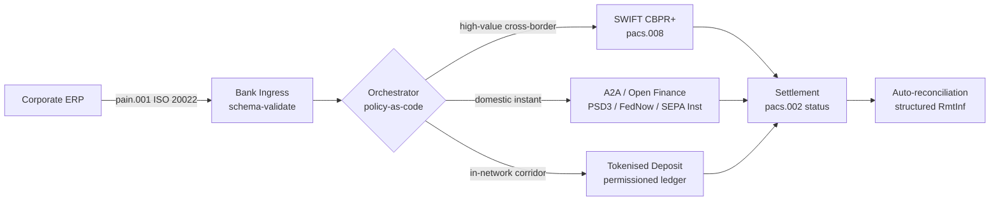

## Határokon átnyúló 2026: ISO 20022, nyílt pénzügyek és tokenizált betétek a vállalati treasuryben

> **Vezetői összefoglaló.** A vállalati treasury a határokon átnyúló forgalomban 2026-ban több csatornás mérnöki probléma, mielőtt kapcsolatkezelési probléma lenne. A PSD3 és a pénzügyi adatokhoz való hozzáférésről szóló (FiDA) rendelet kiterjeszti a nyílt banki perimétert a vállalati treasury adatokra; a 2026. novemberi SWIFT MT/MX átállás a CBPR+-kompatibilis pacs.008-at teszi az egyetlen életképes, határokon átnyúló bankközi formátummá; a tokenizált betétek és a szabályozott stablecoin csatornák a nagykereskedelmi kiegyenlítési lábat közel T+0 idővel kezelik engedélyezett hálózatokon belül. Az a CIB nyer ebben a ciklusban, amelyik nem egyetlen csatornát választ, hanem megtervezi az őket összekötő orkesztrációs réteget. Ez a cikk végigjárja a négycsatornás architektúrát (A2A a PSD3 alatt, SWIFT CBPR+, bank által kibocsátott tokenizált betétek, szabályozott stablecoinok): mit csinál jól az egyes csatornák, hol húzódnak a hitelkockázati kitettség határai, és mit kell érvényesítenie a fölöttük lévő szabályzat-mint-kód orkesztrációs rétegnek, hogy a vállalat egyetlen fizetést lásson, a felügyelet pedig egyetlen auditálható nyomvonalat.

Egy európai ipari vállalat szerdán reggel 4,2 millió eurót fizet egy brazil beszállítónak. A treasury munkaállomás nem bankot választ. Csatornát választ, csatornák sorozatát. Az ügyfélközeli utasítás egy A2A pain.001 üzenetként érkezik, amelyet egy nyílt pénzügyi szolgáltatón keresztül irányítanak a PSD3 alatt. A bank két levelezőbanki joghatóságon keresztül viszi tovább tokenizált betéteken egy CIB privát hálózaton belül. A hosszú farok, egy 80 000 dolláros számla lezárása egy tokenizált betéti kapcsolattal nem rendelkező albeszállító felé, továbbra is a SWIFT CBPR+-on halad pacs.008-ként. Az ügyfél egyetlen fizetést lát. Az architektúra négy csatornát lát. Az [ISO 20022](/2023-09-29-automating-iso-20022-compliant-payment-file-creation-with-pain001/index.html) az egyetlen ok, amiért mindez összeáll.

Ez az a működési modell, amelyet a Mastercard ír le, amikor [a nyílt banki szolgáltatásoktól a nyílt pénzügyekig tartó evolúcióról](https://www.mastercard.com/us/en/news-and-trends/Insights/2026/open-banking-to-open-finance-the-evolution-of-financial-data.html "Mastercard: a nyílt banki szolgáltatásoktól a nyílt pénzügyekig, a pénzügyi adatok evolúciója") beszél: az adatok és a fizetések egyetlen orkesztrációs rétegbe olvadnak, ahol a csatornát a rendszer választja, nem az ügyfél. A vezető banki technológusok számára az érdekes kérdés nem az, hogy melyik csatorna nyer. Hanem az, hogy hogyan tervezik meg, kormányozzák és egyeztetik az orkesztrációs réteget.

## 01. A kártyáktól az A2A-ig: a nyílt pénzügyi váltás

A kártyacsatornák nem tűnnek el. Hanem újrakeretezik őket.

2025-ben és 2026-ba lépve a [PSD3 és a pénzügyi adatokhoz való hozzáférésről szóló (FiDA) rendelet](https://www.consultancy.uk/news/42202/orchestrating-open-banking-for-platform-growth-2026-outlook "Consultancy.uk: a nyílt banki szolgáltatások orkesztrálása a platformnövekedésért, 2026-os kitekintés") kiterjesztette a nyílt banki kötelezettséget a fizetési számlákon túl a nyugdíjakra, jelzáloghitelekre, megtakarításokra, biztosításokra és vállalati treasury adatokra. A vállalati treasuryre gyakorolt következmény közvetlen: egy CIB kapcsolattartó mostantól egyetlen API-szerződésen keresztül, a vállalat utasítására, több banknál is fel tudja térképezni a vállalat teljes likviditási képét.

Két szereplő láthatóan építi azt az orkesztrációs réteget, amelyet a vállalatok fogyasztani fognak. A Nexi kiterjesztette elfogadói lábnyomát az A2A kezdeményezésre a SEPA Instant és a páneurópai RTGS folyosókon, végponttól végpontig ISO 20022 natív módon. A Mastercard nyílt pénzügyi platformja, amely az Aiia és a Finicity felvásárlására épül, biztosítja az alatta lévő adataggregációs és hozzájárulási réteget, ahol a fizetéskezdeményezés ugyanazon az API-birtokon keresztül jelenik meg, amely korábban a kártyaengedélyezéseket szolgálta ki.

A váltás három okból is fontos:

1. **Egységgazdaságosság.** A PSD3 alatt kezdeményezett A2A kiveszi az interchange-et a fizetésből. A nagy értékű B2B forgalomnál a megtakarítás jelentős; a kis értékű fogyasztói forgalomnál a kereskedői költségstruktúra összeomlik.
2. **Adatminőség.** Az ISO 20022 alatti A2A olyan strukturált átutalási adatokat hordoz, amelyekre a kártyák soha nem voltak képesek. A 95% feletti automatikus egyeztetési arányok mostanra alapkövetelménnyé váltak.
3. **Kockázati modell.** Az A2A hitelátutalás, nem kártyaengedélyezés. A csalási felület, a visszaterhelési modell és a vitarendezési modell egyaránt eltérő. A vállalati treasury csapatoknak meg kell érteniük, hogy az ügyfélvédelmi réteget újraépítik, nem öröklik.

A több csatornás ajánlatot értékesítő CIB 2026-ban orkesztrációt ad el, nem hozzáférést. A hozzáférés mostantól szabályozott.

## 02. Az ISO 20022 mint a csatornák közös nyelve

A több csatornás megoldás pontosan azért működőképes, mert az üzenetformátum mostanra egységes a csatornák között.

A BIS Fizetési és Piaci Infrastruktúra Bizottsága (CPMI) egyértelművé tette az architekturális érvet [az ISO 20022 harmonizációs követelményeiről a határokon átnyúló fizetések javítása érdekében](https://www.bis.org/cpmi/publ/d230.pdf "BIS CPMI: ISO 20022 harmonizációs követelmények a határokon átnyúló fizetések javításához") szóló dokumentumában. A 2025. novemberi CBPR+-ra való átállás lezárta az MT103 / MT202 korszakot a határokon átnyúló bankközi üzenetküldésben. Ettől a ponttól kezdve minden nagy csatorna, a SWIFT, a FedNow, a SEPA Instant, az RTP és a nagyobb ázsiai és latin-amerikai azonnali fizetési rendszerek ugyanazt a pacs.008 / pacs.009 / pain.001 nyelvtant beszélik.

A vállalati treasury szempontjából gyakorlati következmény:

- **Az útválasztás adatvezérelt.** A treasury munkaállomás egyszer beolvashat egy pain.001-et, és fizetésenként eldöntheti a csatornát a folyosó, a tétel mérete, a levágási idő és a partnerkapcsolat alapján, anélkül hogy újra kellene képeznie az üzenetet.
- **Az átutalási adat túléli az ugrást.** A strukturált átutalási mezők (`<RmtInf><Strd>`) csonkítás nélkül haladnak át a levelezőbanki lábakon. Az automatikus egyeztetési arányok emelkednek, mert az adat már nem vész el a csatornahatáron.
- **A szankciószűrés auditálhatóvá válik.** A LEI-hivatkozásokat tartalmazó strukturált `<Dbtr>` / `<Cdtr>` / `<DbtrAgt>` / `<CdtrAgt>` mezők felváltják a szabad szöveges névszűrést. A találati arányok csökkennek. A vizsgálati sorok rövidülnek.

Az alábbi ábra egyetlen pain.001 útját követi a bank bejövő pontján keresztül a szabályzat-mint-kód orkesztrátorba, majd ki arra a csatornára, amelyet a folyosó és a tétel mérete megkövetel: egy üzenet, sok csatorna, újraképezés nélkül.

Ennek az egységességnek az ára a mérnöki fegyelem. Az ISO 20022 megengedő. Két bank teljesen CBPR+-kompatibilis lehet, és mégis olyan pacs.008 üzeneteket állíthat elő, amelyek eltérnek a mezőhasználatban, a karakterkészletben és az átutalási adatok struktúrájában. Az a CIB nyer a határokon átnyúló forgalomban 2026-ban, amelyik a szabvány által megköveteltnél szigorúbb üzenetprofilt érvényesít, és a feldolgozásnál utasít vissza, nem a kiegyenlítésnél.

## 03. Tokenizált betétek és stabil csatornák

A nagykereskedelmi kiegyenlítési láb az, ahol a csatornatörténet érdekessé válik.

A 2026-os kép, amelyet jól megragad a [Trade Treasury Payments elemzése az automatizálásról, a tartalék csatornákról, az ISO 20022-ről és a stablecoinokról](https://tradetreasurypayments.com/articles/automation-contingency-rails-iso-20022-and-stablecoins-the-2026-trends-reshaping-corporate-finance-and-b2b-payments "Trade Treasury Payments: automatizálás, tartalék csatornák, ISO 20022 és stablecoinok, a 2026-os trendek, amelyek átalakítják a vállalati pénzügyeket és a B2B fizetéseket"), a nagykereskedelmi kiegyenlítési réteget két szerkezetileg eltérő modellre osztja.

**Bank által kibocsátott tokenizált betétek.** Egy kereskedelmi bank tokenizált kötelezettséget bocsát ki egy engedélyezett főkönyvön: JPM Coin, a HSBC Orionhoz kapcsolódó betéti tokenje, a nagyobb európai CIB megfelelői. A token közvetlen követelés a kibocsátó bankkal szemben. A kiegyenlítés közel T+0 a hálózaton belül. A megfelelőség a kibocsátó bank felelőssége. A csatorna teljesen szabályozott, teljesen nyomon követhető, és azokra a résztvevőkre korlátozódik, akiket a kibocsátó beléptetett.

**Integrált stablecoin csatornák.** Egy szabályozott stablecoin, amely teljesen fedezett, auditált, és a MiCA vagy az azzal egyenértékű regionális rezsim alatt működik, olyan folyosót egyenlít ki, ahová a bank által kibocsátott tokenizált betétek még nem érnek el. A token a tartalékkal szembeni követelés, nem a bank mérlegével szemben. A megfelelőség megoszlik a kibocsátó, a be- és a kilépési pont között.

A két modell nem versenyez. Egymásra épülnek. Egy CIB határokon átnyúló termék 2026-ban jellemzően bank által kibocsátott tokenizált betéteket használ a hálózaton belüli lábhoz, és szabályozott stablecoint ahhoz a folyosóhoz, ahol a hálózaton belüli csatorna végződik. A vállalat egyetlen ISO 20022 fizetést lát. Az alatta lévő kiegyenlítési történet több tokenes.

Az igazgatósági szintű kérdés ugyanaz, amelyet a működési kockázati bizottságok az első programozható likviditási kísérletek óta feltesznek: ki viseli a token hitelkockázati kitettségét, és meddig? A tokenizált betétek tiszta választ adnak: a kibocsátó bank, égetésig. Az integrált stablecoin csatornák árnyaltabbat: a tartalék, az auditciklus és a visszaváltási garancia függvényében. Az a treasury csapat, amely nem dokumentálja a választ csatornánként és folyosónként, méretlen hitelkockázatot hordoz a mérlegében.

## 04. Az autonóm treasury verem

A csatornaréteg fölött ül az orkesztrációs réteg. Az orkesztrációs réteg fölött ül az ügynökréteg.

Az architektúrát részletesen kifejtettem [Az autonóm treasury index 2026: programozható likviditás és tokenizált betétek](https://sebastienrousseau.com/2026-06-07-autonomous-treasury-index-programmable-liquidity-tokenised-deposits-2026 "Sebastien Rousseau: Az autonóm treasury index 2026") című írásban. Röviden: az ügynökalapú treasury 2026-ban maga az orkesztrációs réteg, szabályzat-mint-kód formájában kifejezve, amelyben korlátozott ügynökök hajtanak végre.

A verem a következő:

1. **Csatornaréteg.** SWIFT CBPR+, azonnali A2A, tokenizált betétek, szabályozott stablecoinok. Minden csatornának van közzétett profilja, levágási táblázata, költséggörbéje és kiegyenlítés-véglegességi modellje.
2. **Orkesztrációs réteg.** ISO 20022 be, ISO 20022 ki. Csatornadöntés fizetésenként a folyosó, a tétel, a levágási idő, a partnerkapcsolat és a szabályzat alapján. A szabályzat verziózott, aláírt és auditálható.
3. **Ügynökréteg.** A korlátozott treasury ügynökök az orkesztrációs szabályzatot hajtják végre eszközhívási határokkal, auditnaplókkal és vészleállító kapcsolókkal. Az ügynök nem választ csatornát. A szabályzat választ csatornát. Az ügynök futtatja a szabályzatot.
4. **Egyeztetési réteg.** Az ISO 20022 pacs.008 / pacs.002 / camt.054 üzenetek egyeztetnek az eredeti pain.001 utasítással szemben, ahol a strukturált átutalási adat manuális beavatkozás nélkül zárja a kört.

Az ezt a vermet értékesítő CIB 2026-ban négy dolgot ad el egyszerre, és külön árazza őket. Az azt megvásárló vállalat opcionalitást vásárol a csatornák között, egyetlen üzenetszabvánnyal, egyetlen szabályzati réteggel, egyetlen egyeztetési adatfolyammal. Ez az architekturális váltás. Minden más megvalósítási részlet.

## GYIK

**A "nyílt pénzügyek" csak átcímkézett nyílt banki szolgáltatás?**
Nem. A PSD2 alatti nyílt banki szolgáltatás a fizetési számlákra terjedt ki. A PSD3 és a pénzügyi adatokhoz való hozzáférésről szóló (FiDA) rendelet kiterjeszti az adatmegosztási kötelezettséget a nyugdíjakra, jelzáloghitelekre, megtakarításokra, biztosításokra és vállalati treasury adatokra. A vállalati treasuryre gyakorolt következmény közvetlen: egy CIB kapcsolattartó mostantól egyetlen API-szerződésen keresztül, a vállalat utasítására, több banknál is fel tudja térképezni a vállalat teljes likviditási képét, nem csupán a fizetési számla előzményeit.

**Miért az orkesztrációs réteg az architekturális fókusz, nem a csatorna?**
Mert a csatornák mostanra tömegcikké válnak. A SWIFT CBPR+ pacs.008, a PSD3 alatti A2A, a tokenizált betétek és a szabályozott stablecoinok mind ugyanazt az ISO 20022 nyelvtant hordozzák az üzenet szintjén. Ami megkülönböztet egy 2026-os CIB-et, az a szabályzat-mint-kód motor, amely fizetésenként választja ki a csatornát a folyosó, a tétel mérete, a kiegyenlítés-véglegességi követelmény és a partnerkapcsolat alapján, és amely rögzíti a döntést abban az audittelemetriában, amelyet a felügyelet kérni fog. E motor nélkül a több csatornás megoldás pusztán opcionalitás kormányzás nélkül.

**Hol húzódik a hitelkockázati kitettség határa egy tokenizált betéti lábon?**
A bank által kibocsátott tokenizált betétek egy engedélyezett főkönyvön közvetlen követelést jelentenek a kibocsátó bankkal szemben: a hitelkockázati kitettség égetéssel ér véget. A szabályozott stablecoin csatornák (az EU-ban MiCA-felügyelet alatt, az Egyesült Királyságban a Bank of England vitaanyag-rezsimje szerint, máshol analóg módon) a tartalékkal szembeni követelést jelentenek, ahol a kitettségi ablak az auditciklus és a visszaváltási garancia feltételeinek függvénye. Az a treasury csapat, amely nem dokumentálja a választ csatornánként és folyosónként, méretlen hitelkockázatot hordoz a mérlegében.

**Mi lesz a SWIFT-tel ebben az architektúrában?**
A SWIFT nem tűnik el: a hosszú farkat horgonyozza le. Azok a folyosók, ahová a bank által kibocsátott tokenizált betétek még nem érnek el (a legtöbb feltörekvő piaci albeszállítói kapcsolat, a legtöbb ritka / kis értékű határokon átnyúló forgalom), valamint azok a folyosók, ahol a vállalat vagy a bank megköveteli a CBPR+ levelezőbanki auditnyomvonalat, továbbra is a SWIFT pacs.008-on haladnak. A 2026-os architektúra a "SWIFT + új csatornák", nem az "új csatornák a SWIFT helyett".

**Mit vásárol a vállalat, amikor ezt a vermet megvásárolja?**
Opcionalitást a csatornák között, egyetlen üzenetszabvánnyal (ISO 20022), egyetlen szabályzati réteggel (az orkesztrációs motor) és egyetlen egyeztetési adatfolyammal (pacs.002 státusz + camt.054 megerősítés + strukturált camt.053 kivonatok). A vállalat nem négy különálló csatornakapcsolatért fizet. Azért az orkesztrációs rétegért fizet, amely a négy csatornát működésileg egyként viselkedteti, és azért az auditnyomvonalért, amely lehetővé teszi számára, hogy a következő felügyeleti kérés utáni reggelen megválaszolja: "melyik csatornán haladt az a 4,2 millió eurós fizetés, és miért?".

## Következtetés

A vállalati treasury a határokon átnyúló forgalomban 2026-ban több csatornás mérnöki probléma. Az ISO 20022 az a nyelvtan, amely a több csatornás megoldást kezelhetővé teszi. A PSD3 és a FiDA kiszélesíti az adatperimétert, és a nyílt pénzügyeket a vállalati treasury munkafolyamatba kényszeríti. A tokenizált betétek és a szabályozott stablecoinok kezelik a nagykereskedelmi kiegyenlítési lábat. A SWIFT továbbra is a hosszú farkat horgonyozza le.

Az a CIB nyer, amelyik felépíti az orkesztrációs réteget, nem az, amelyik egyetlen csatornát választ, és arra teszi fel a franchise-t. Az a vállalati treasury csapat nyer, amelyik csatornánként és folyosónként dokumentálja a hitelkockázati kitettséget, a szabályozó által megköveteltnél szigorúbb ISO 20022 profilt érvényesít, és a csatornadöntést szabályzatként kezeli, nem fizetésenkénti eseti megítélésként.

Az érdekes munka az orkesztrációs rétegben van. Építsd meg gondosan.

## Hivatkozások

Bank for International Settlements, Committee on Payments and Market Infrastructures (2023). *Harmonised ISO 20022 data requirements for enhancing cross-border payments* (CPMI Papers No. 230). Elérhető: [https://www.bis.org/cpmi/publ/d230.htm](https://www.bis.org/cpmi/publ/d230.htm "BIS CPMI 230 — Harmonised ISO 20022 data requirements")

Bank for International Settlements (2024). *Project Agorá: cross-border payments with tokenised commercial bank deposits and central bank money*. BIS Innovation Hub. Elérhető: [https://www.bis.org/about/bisih/topics/fmis/agora.htm](https://www.bis.org/about/bisih/topics/fmis/agora.htm "BIS Project Agorá")

Bank of England (2023). *Regulatory regime for systemic payment systems using stablecoins and related service providers — Discussion Paper*. Elérhető: [https://www.bankofengland.co.uk/paper/2023/dp/regulatory-regime-for-systemic-payment-systems-using-stablecoins-and-related-service-providers](https://www.bankofengland.co.uk/paper/2023/dp/regulatory-regime-for-systemic-payment-systems-using-stablecoins-and-related-service-providers "Bank of England — Regulatory regime for stablecoins discussion paper")

European Commission (2023). *Proposal for a Directive on payment services and electronic money services (PSD3)*. Elérhető: [https://finance.ec.europa.eu/regulation-and-supervision/financial-services-legislation/implementing-and-delegated-acts/payment-services-directive_en](https://finance.ec.europa.eu/regulation-and-supervision/financial-services-legislation/implementing-and-delegated-acts/payment-services-directive_en "European Commission — Payment Services Directive proposal")

European Parliament and Council (2023). *Regulation (EU) 2023/1114 on markets in crypto-assets (MiCA)*. Elérhető: [https://eur-lex.europa.eu/eli/reg/2023/1114/oj](https://eur-lex.europa.eu/eli/reg/2023/1114/oj "Regulation (EU) 2023/1114 — Markets in Crypto-Assets (MiCA)")

Financial Action Task Force (2023). *International standards on combating money laundering and the financing of terrorism — Recommendation 16 on wire transfers*. Elérhető: [https://www.fatf-gafi.org/en/publications/Fatfrecommendations/Fatf-recommendations.html](https://www.fatf-gafi.org/en/publications/Fatfrecommendations/Fatf-recommendations.html "FATF Recommendations")

International Organization for Standardization (2020). *ISO 17442 Financial services — Legal entity identifier (LEI)*. Elérhető: [https://www.gleif.org/en/about-lei/iso-17442-the-lei-code-structure](https://www.gleif.org/en/about-lei/iso-17442-the-lei-code-structure "ISO 17442 — Legal Entity Identifier")

SWIFT (2024). *Cross-Border Payments and Reporting Plus (CBPR+) usage guidelines*. Elérhető: [https://www.swift.com/standards/iso-20022/iso-20022-programme](https://www.swift.com/standards/iso-20022/iso-20022-programme "SWIFT CBPR+ usage guidelines")
