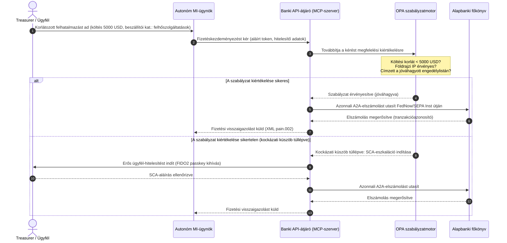

## A 2026-os globális fizetési kilátások: működési modell, kockázat és bevétel egy ügynöki, láthatatlan, valós idejű világban

A 2026-os globális fizetési ciklust három összetartó erő határozza meg: az ügynöki kereskedelem, a láthatatlan beágyazott fizetések és a valós idejű végrehajtás, amelyek egy tokenizált egységesített főkönyvön nyugszanak a Project Agorá keretében, valamint egy kemény, 2026. novemberi SWIFT strukturált cím átálláson.

A globális tranzakciós bankok számára a 2026-2028-as ciklus strukturális ablak. A modern fizetési infrastruktúra már nem adminisztratív segédeszköz: a banki szintű technológiai stratégia magja. A G-SIB-eken és a jelentős regionális intézményeken belül a technológia, a szabályozás és az ügyfélelvárás egyetlen működési síkba olvadt össze.

Három erő határozza meg ezt a ciklust, és mindegyik közvetlenül egy felsővezetői aggályhoz kapcsolódik.

- **Ügynöki kereskedelem**: csatornaelosztás, terméktervezés, felelősség-hozzárendelés és modellkockázat-kezelés felügyeleti ellenőrzés alatt.
- **Láthatatlan fizetések**: ügyfélélmény, dezintermediációs kockázattal ott, ahol a bankok nem tudják beágyazni főkönyvüket a vállalati és kereskedői előtétrendszerekbe.
- **Valós idejű végrehajtás**: a tőke sebessége, ebből következő változásokkal a likviditáskezelésben, a hitelkockázatban, a működési ellenállóképességben és a csalásvédelemben.

A pénzügyi tét jelentős. A csalás sebességben és kifinomultságban skálázódik; a szabályozási határidők kemények; és azok a bankok, amelyek proaktívan korszerűsítik alaprendszereiket, jelentős díjbevételi lehetőségeket nyitnak meg. A tétlenség ára az ellenkezője: azonnali tranzakció-elutasítások, működési szűk keresztmetszetek, szabályozási bírságok és gyors piacirészesedés-erózió.

## Bizonyossági létra: mi datált, mi szabályozott, mi előrejelzés

Nem minden tétel hordozza ugyanazt a bizonyosságot ebben a jelentésben. Az igazgatósági szintű kérdés az, hogy mely eltérések határidők, melyek felügyeleti elvárások, és melyek még mindig piaci előrejelzések, mert a válasz megváltoztatja a költségvetési beszélgetést.

| Kategória | Példák |
| --- | --- |
| **Kemény határidők** | Swift CBPR+ strukturált cím átállás (2026. november 14.); EPC SEPA sémaszabálykönyvek (2026. november 15.) |
| **Szabályozási kötelezettségek** | DORA ICT-kockázat + ellenállóképesség-tesztelés + harmadik felek felügyelete (EU); SCA-delegálás a PSD3/PSR keretében; modellkockázat-kezelés az SR 11-7 + PRA SS1/23 szerint |
| **Nagy valószínűségű piaci elmozdulások** | Valós idejű treasury API-k, MI-vezérelt csalásvédelem, API-alapú likviditás, deepfake-vezérelt biometrikus csalás |
| **Stratégiai opciók** | Tokenizált betétek, egységesített főkönyvek a Project Agorá keretében, ügynöki kereskedelmi folyosók, folyamatos FX (Wire 365) |
| **Előrejelzések** | 3-5 billió dollárnyi éves ügynöki kereskedelmi forgalom 2030-ra (McKinsey alapforgatókönyv) |

Kezelje a felső két sort megfelelési tényként, amely költségvetési tételt hajt, függetlenül attól, hogy a bank kihasználja-e bármely előnyt. Kezelje az alsó két sort stratégiai opcióként: irányában nagy meggyőződésű, de ahol a végrehajtás időzítése igazgatósági döntés, nem pedig a szabályozó naptári bejegyzése.

## A globális fizetési tekintélyek konvergenciája

Ez a jelentés négy mérvadó iparági hang 2026-os fizetési és kereskedelmi kilátásait szintetizálja, [J.P. Morgan Payments](https://www.jpmorgan.com/payments/newsroom/payments-outlook-2026-trends-report-released "J.P. Morgan Payments: Outlook 2026"), [Global Payments](https://investors.globalpayments.com/news-events/press-releases/detail/497/global-payments-releases-its-2026-commerce-and-payment "Global Payments: 2026-os kereskedelmi és fizetési trendjelentés"), HSBC és a The Payments Association, és a [G20 határokon átnyúló fizetések javítására szolgáló ütemtervhez](https://www.fsb.org/2026/03/fsb-kicks-off-new-implementation-phase-to-enhance-cross-border-payments-through-public-private-partnership/ "FSB: határokon átnyúló fizetések végrehajtási szakasza, 2026. március") méri őket.

Minden szervezet más piaci szemszögből közelíti meg az ökoszisztémát, de megállapításaik három invariánsban konvergálnak.

1. **Az azonnali, API-vezérelt sínek az alapvonal.** Az örökölt kötegelt feldolgozási modellek marginalizálódnak a határokon átnyúló és nagy értékű forgalom esetében; a tranzakciósebességet ezekben a szegmensekben a mindig elérhető, valós idejű üzenetküldés diktálja.
2. **Az MI egyszerre fenyegetés és védelem.** A generatív eszközök és a deepfake-ek felskálázzák a tranzakciós csalást, ami valós idejű, többrétegű gépi tanulású ellenvédelmet tesz szükségessé.
3. **A tokenizáció éles üzemre kész infrastruktúra.** A főkönyvek egységesülnek, hogy tokenizált kereskedelmi kötelezettségeket és nagykereskedelmi jegybanki digitális pénzeket fogadjanak be.

| Jelentés | Elsődleges közönség | Fókusz | Kulcspillér | Banki következmény |
| --- | --- | --- | --- | --- |
| **J.P. Morgan Payments** | Vállalati treasurerek, G-SIB-ek | Valós idejű likviditás, csalás | API-k, MI-biometria | A likviditási, FX- és kockázati rendszerek újjáépítése a folyamatos, 365 napos elszámoláshoz. |
| **Global Payments** | Kereskedők, e-kereskedelem | POS-fejlődés, omnichannel | Ügynöki kereskedelem, súrlódásmentes fizetés | Biztonságos, API-kapuzott kereskedői fizetési folyosók kiépítése autonóm MI-ügynökök számára. |
| **HSBC Insights** | Multinacionális vállalatok | ERP-integrációk (SAP/Oracle), valós idejű készpénz | Treasury-as-a-Service, készpénzláthatóság | Tranzakciós API-csomagok monetizálása és valós idejű készpénz-főkönyvi jelentés beágyazása a forrásnál. |
| **The Payments Association** | Fintech-ek, fizetési intézmények | Stablecoinok, tokenizáció, globális szabályozás | Szabályozott digitális eszközök, szabályozási megfelelés | A mérlegek felkészítése tokenizált betétekre és a PSD3/PSR felelősségi struktúrák kezelése. |

A négy kilátás gyakorlatilag azt a magánszektorbeli működési réteget határozza meg, amely a közszféra G20 szakpolitikai infrastruktúrája tetején fut, a szakpolitikai szándékot konkrét, a bankokon belüli likviditási, tokenizációs, adat- és csalásellenőrzési döntésekké fordítva.

## 1. pillér: ügynöki kereskedelem és láthatatlan fizetések

Az ügynöki kereskedelem az emberi vezérlésű, kattintásra vásárló fizetéstől az autonóm, modellvezérelt tranzakciókezdeményezés felé való átmenet. Az iparági előrejelzések 2030-ra 3-5 billió dollárnyi, autonóm ügynökök által közvetített éves kereskedelemben konvergálnak, ami a globális fizetési volumen alacsony egy számjegyű hányada, amelyet emberi 'vásárlás' kattintás nélkül hajtanak végre.

A kiskereskedelmi és kereskedelmi ökoszisztémában megvan a megfelelő szakadék. A fogyasztók egyértelmű többsége mára közel súrlódásmentes fizetéseket vár, ám a kereskedőknek kevesebb mint fele helyezte előtérbe az egykattintásos fizetést vagy az API-val elérhető termékkatalógusokat. Az MI-ügynökök nem tudnak eligazodni az emberi szem számára tervezett, örökölt, többoldalas fizetési képernyőkön; strukturált, gép-gép közötti API-kézfogásokra van szükségük.

### Banki prioritások és működési hatás

- **KYC- és AML-felelősség.** A bankoknak meg kell határozniuk, ki viseli a megfelelési kötelezettséget egy ügynöki tranzakciós láncban. Ha egy fogyasztó személyes MI-ügynöke egy kereskedő ügynöki fizetésén keresztül kezdeményez tranzakciót, a banknak ellenőriznie kell, hogy a kezdeményező delegált felhatalmazás kriptográfiailag kötődik-e az elsődleges számlatulajdonoshoz.
- **Felelősség és visszaterhelés újratervezése.** A kártyasémákat és az A2A-síneket az emberi engedélyezés köré tervezték. Amikor egy MI-ügynök téves vásárlást hajt végre, például adatelemzési hiba miatt hibás ipari készletet szerez be, a bankoknak egyértelműen meg kell osztaniuk a felelősséget a fogyasztó, az ügynökszolgáltató és a kereskedő között.
- **Az ügynöki forgalom kockázatminősítése.** A fizetési útválasztó motoroknak dinamikusan kell kockázatminősíteniük az ügynöki fizetéseket, magasabb tartalékkövetelményeket vagy bankközi díjakat alkalmazva a nem emberi kezdeményezésű tranzakciókra, amíg stabil elszámolási előzmény nem alakul ki.

### Korlátozott cselekvés és korlátozott felhatalmazás

A 'korlátlan cselekvés' mérséklésére, amikor egy vállalati beszerzési ügynök szoftverhiba miatt végtelen rekurzív vásárlási hurokban fut, a bankoknak **korlátozott felhatalmazású API-kapukat** kell telepíteniük. A kapuk három dimenzióban érvényesítenek szabályzati szintű korlátokat.

1. **Rétegzett pénzügyi korlátok**: az ügynöki költést a tranzakció mérete, a napi halmozott érték és a kereskedői kategória korlátozza.
2. **Kontextustudatos védelmek**: másodlagos jelek (napszak, IP-alapú geolokáció, tranzakciógyakoriság) kiértékelése, mielőtt a főkönyv felszabadítaná a forrásokat.
3. **Emberi közreműködésű eszkaláció**: kötelező emberi engedélyezés, amelyet erős ügyfél-hitelesítés (SCA) vált ki a PSD3 / PSR keretében, valahányszor egy tranzakció meghaladja a kockázati küszöböket.

Az alábbi Mermaid-szekvencia azt a célarchitektúrát mutatja, amelyet sok bank a korlátozott felhatalmazású ügynöki fizetési folyamatként ismer fel.

### A Model Context Protocol (MCP)

A lokalizált MI-modellek banki felügyeletű végrehajtási rétegekhez való csatlakoztatásához az iparág a [Model Context Protocol (MCP)](https://modelcontextprotocol.io "Model Context Protocol: nyílt szabvány az LLM-eszközök integrációjához") köré szabványosít: ez egy nyílt protokoll, amely lehetővé teszi az LLM-ek számára, hogy egyértelműen behatárolt, auditálható eszközöket és API-kat hívjanak meg az alaprendszerek közvetlen elérése nélkül.

A banki API-k (fizetéskezdeményezés, egyenleglekérdezés, félellenőrzés) MCP-szerverbe csomagolása távol tartja az LLM-eket az adatbázistábláktól és a rendszergyökér-vezérlőktől. A modell csak strukturált, auditált, sebességkorlátozott végpontokon keresztül lép kapcsolatba a főkönyvvel: a biztonságot az ügynöki eszközhívás határán érvényesítik, nem pedig a modell belsejébe rejtve.

## 2. pillér: treasury-átalakulás és újragondolt likviditás

A tranzakciós banki tevékenység sebességét 2026-ban a napvégi kötegelt feldolgozásról a mindig elérhető, valós idejű treasury-műveletekre való átállás határozza meg. A multinacionális vállalatok már nem tűrik a bennragadt készpénzt: a helyi számlákon hétvégén vagy ünnepnapokon tétlenül álló likviditást, mert az elszámolási rendszerek zárva vannak.

### A valós idejű likviditás gazdasági indoklása

A J.P. Morgan és a HSBC egyaránt arról számol be, hogy a fejlett valós idejű készpénz- és adatképességekkel rendelkező vállalatok lényegesen nagyobb valószínűséggel múlják felül társaikat a bevételnövekedésben és a tőkehatékonyságban, főként a bennragadt likviditás csökkentésével és a forgótőke-ciklusok optimalizálásával.

Ennek az értéknek a megragadásához a bankok **Treasury-as-a-Service (TaaS) API-termékeket** szállítanak, amelyek lehetővé teszik, hogy a vállalati ERP-k (SAP, Oracle) közvetlenül a bank főkönyvéhez kapcsolódjanak.

- **Valós idejű egyenleg-API-k** a `camt.052` séma használatával: a fájlátviteli protokollok lecserélése azonnali, eseményvezérelt készpénzpozíció-jelentésre.
- **Tömeges fizetéskezdeményező API-k** a `pain.001` használatával: a szállítói fizetési kötegek közvetlen, teljesen automatizált végrehajtása az ERP-főkönyvből.
- **Folyamatos FX-API-k**: a treasury-motorok valós idejű, algoritmikus devizaárfolyamokat rögzítenek a határokon átnyúló elszámoláshoz, kiküszöbölve az egynapos piaci résből eredő kockázatot.
- **Virtuális számla API-k**: a vállalatok dinamikusan hoznak létre és szüntetnek meg több ezer alszámlát az automatizált követelés-párosításhoz és a főkönyvi szétválasztáshoz.

### Működési ellenállóképesség és DORA

A mindig elérhető likviditás nyújtása átalakítja a bank kockázati profilját. A rendszerszinten fontos valós idejű treasury API-k esetében az **öt kilences (99,999%) rendelkezésre állás** válik azzá a belső mérnöki célértékké, amelyet a bankok maguknak tűznek ki, hogy DORA-szintű ellenállóképességet igazoljanak a felügyeletek felé. Maga a DORA nem ír elő univerzális öt kilences értéket; kiterjed az ICT-kockázatkezelésre, az incidensjelentésre, az ellenállóképesség-tesztelésre, a harmadik felek kockázatára és a kritikus ICT-szolgáltatók felügyeletére, de egy olyan treasury-API-platform, amely folyamatos terhelés alatt időszakosan kiesik, nem tudja hitelesen megvédeni a súlyos, de valószerű forgatókönyv-leltárát.

A [digitális működési ellenállóképességről szóló rendelet (DORA)](https://eur-lex.europa.eu/legal-content/EN/TXT/?uri=CELEX%3A32022R2554 "Az (EU) 2022/2554 rendelet: a digitális működési ellenállóképességről szóló jogszabály") értelmében ez nem informatikai KPI: szigorú szabályozási követelmény. A szabályozók elvárják a bankoktól, hogy bizonyítsák: a valós idejű treasury API-felület és a főkönyvi adatbázis képes elnyelni a súlyos, de valószerű kibertámadásokat, hálózati kimaradásokat és hyperscaler-zavarokat a kritikus fizetések megszakítása vagy a rendszerszintű likviditás veszélyeztetése nélkül. Ehhez georedundáns, aktív-aktív többfelhős adatbázis-architektúrákra, valós idejű fenyegetésészlelési rétegekre és automatizált feladatátvételre van szükség, ami a változtatási költségsorban látszik, nem csupán az auditdossziéban.

### Folyamatos FX és határokon átnyúló innováció

A valós idejű treasury nem élhet egyetlen deviza határain belül. A G-SIB-ek folyamatos FX-infrastruktúrát telepítenek: a J.P. Morgan [Wire 365](https://www.jpmorgan.com/insights/payments/fx-cross-border/wire-365-global-clearing "J.P. Morgan: Wire 365, újragondolt globális klíring") platformja az év bármely napján feldolgozza a határokon átnyúló fizetéseket és FX-átváltásokat, a hagyományos jegybanki RTGS-órákon túl. Ez a réteg közvetlenül összekapcsolódik a 3. pillérben tárgyalt tokenizált betét- és egységesített főkönyvi rendszerekkel.

## 3. pillér: tokenizált betétek és az egységesített főkönyv

A tokenizáció az elszigetelt megvalósíthatósági kísérletektől a felskálázott, banki szintű monetáris infrastruktúráig jutott. A fókusz a magán stablecoinokról és a spekulatív kriptoeszközökről a **tokenizált kereskedelmi banki betétekre** és a **nagykereskedelmi jegybanki digitális pénzekre (wCBDC-kre)** helyeződött át, amelyek programozható egységesített főkönyveken futnak.

A referenciakeret a [Project Agorá](https://www.bis.org/about/bisih/topics/fmis/agora.htm "BIS Project Agorá: a nagykereskedelmi határokon átnyúló fizetések tokenizációja"): egy jelentős, a BIS és az IIF által összehívott állami-magán együttműködés, amely **nyolc jegybankot** és több mint 40 magán pénzügyi intézményt foglal magában (a BIS Agorá oldala szerint, frissítve 2026. május 27-én). A projekt azt vizsgálja, hogyan integrálódnak a tokenizált kereskedelmi banki betétek a tokenizált nagykereskedelmi CBDC-kkel egy közös programozható főkönyvön, hogy kiküszöböljék a határokon átnyúló elszámolási súrlódást, összehangolják a megfelelési ellenőrzéseket, és lehetővé tegyék a 24/7-es atomi véglegességet.

### Az ötlépcsős tokenizációs út

A G-SIB-ek és a jelentős regionális bankok számára a tokenizáció lépésről lépésre haladó út a belső optimalizálástól a nyílt piaci interoperabilitásig.

1. **Belső treasury-likviditás**: a belső vállalati készpénzegyenlegek tokenizálása (pl. JPM Coin vagy azzal egyenértékű magánbanki főkönyvek), hogy azonnali, 24/7-es határokon átnyúló átutalás és nettósítás legyen lehetséges a bank saját fiókjai között.
2. **Korlátozott több bankos folyosók**: zárt, szabályozott konzorciumok (a Project Agorá tesztkörnyezete) a bankközi elszámolás és a megosztott főkönyvi állapot tesztelésére különálló intézmények között.
3. **Folyamatos programozható FX**: az egységesített főkönyvön futó okosszerződések azonnali fizetés a fizetés ellenében (PvP) FX-et hajtanak végre, kiküszöbölve az elszámolási kockázatot az időzónák között.
4. **Tokenizált valós eszközök (RWA-k)**: a tokenizált készpénzoldal integrálódik a tokenizált értékpapír-, adósság- vagy kereskedelmi főkönyvekkel az azonnali szállítás a fizetés ellenében (DvP) véglegesség érdekében, napokról ezredmásodpercekre csökkentve a tőkelekötést.
5. **Szabályozott nyilvános/hibrid interoperabilitás**: a biztonságos átjáró-burkolók lehetővé teszik, hogy az intézményi likviditás biztonságosan lépjen kapcsolatba a nyílt nyilvános hálózatokkal.

### Prudenciális és mérlegvonatkozású következmények

A tokenizált készpénzt gondosan kell átvezetni a prudenciális kereteken. A felügyeletek hangsúlyozzák, hogy a tokenizált betétnek gazdaságilag egyenértékűnek kell lennie egy hagyományos kereskedelmi banki betéttel: azaz fedezetlen kötelezettségnek a bank mérlegében, ugyanazzal a betétbiztosítási fedezettel.

Működési szempontból a tokenizált betétek olyan kockázatokat vezetnek be, amelyek szimulálására a klasszikus likviditási stresszmodelleket nem építették. Az okosszerződések olyan sebességgel és volumenben hajtanak végre programozható kifizetéseket, amelyeket az örökölt feltételezések nem ragadnak meg. A Basel III keretében a bankoknak biztosítaniuk kell, hogy a kockázati motor modellezni tudja a programozható készpénzkiáramlásokat, és hogy a tokenizált főkönyv tisztán együttműködjön az örökölt RTGS-rendszerekkel a napi likviditási cikluson át.

### Stablecoinok kontra tokenizált betétek: árnyalt álláspont

A magán, teljesen fedezett stablecoinok (USDC stb.) továbbra is piaci részesedést szereznek a kiskereskedelmi határokon átnyúló pénzátutalásban és a decentralizált kereskedelemben, de hiányzik belőlük a kereskedelmi bankrendszer hitelteremtő képessége és elszámolási véglegessége.

Ahelyett, hogy a kiskereskedelmi síneken versenyeznének, a tranzakciós bankok letétkezelést hoznak létre, saját szabályozott tokenizált kötelezettséginstrumentumokat bocsátanak ki, és biztonságos be- és kilépési átjárókat építenek. A vállalati ügyfelek programozási rugalmasságot kapnak, miközben a tőke a szabályozott kereten belül marad.

### Kérdések, amelyeket az igazgatóságnak fel kell tennie a tokenizált pénzről

- **Egységesített főkönyvi részvétel.** Mi az aktív stratégiai ütemtervünk a nagykereskedelmi állami-magán egységesített főkönyvi kezdeményezésekben, például a Project Agorában való részvételre?
- **Mérleg- és kockázatmodellezés.** Frissítették-e kockázati motorjaink és tőkemegfelelési kereteink a stressztesztelést, hogy figyelembe vegyék az okosszerződés által kiváltott token-kiáramlások sebességét?
- **Úttörő ügyfélszegmensek.** Vállalati treasury- és kereskedelmi banki ügyfélszegmenseink közül melyek profitálnának azonnal a programozható, tokenizált DvP/PvP elszámolásból?

## 4. pillér: strukturált adatok és csalásvédelem

A 2026-os infrastruktúra-megfelelést a **2026. november 14/15-i strukturált cím átállás** uralja: két egymáshoz közeli határidő, amely együtt lezárja a strukturálatlan cím útját a határokon átnyúló és az EU-n belüli síneken. A [SWIFT Standards Release (SR) 2026](https://www.swift.com/standards/iso-20022/removal-unstructured-address "SWIFT: a strukturálatlan cím eltávolítása, 2026. november") értelmében a CBPR+ **2026. november 14-től** nem fogad el teljesen strukturálatlan `<AdrLine>` blokkokat. A 2025-ös EPC SEPA sémaszabálykönyvek értelmében a strukturálatlan címformátum csak **2026. november 15-ig** engedélyezett. Az átállások után minden olyan határokon átnyúló vagy belföldi üzenetet, amely strukturálatlan címet hordoz ott, ahol strukturált elemeket várnak, a hálózat késleltet vagy elutasít.

A legtöbb intézmény ismeri a dátumot. Sokan felületes leképezési feladatként kezelik az interfészrétegen. A valóság mélyebb adatminőségi és adatirányítási kihívás. A katasztrofális elutasítási arányok elkerülése érdekében a fizetési műveleteknek egyértelmű, funkciók közötti irányítási keretre van szükségük.

- **Termék és működés.** Adatrögzítés a forrásnál. Az ügyfélközpontú digitális portáloknak, a beléptető interfészeknek és a vállalati ERP-beviteli mezőknek strukturált címmezőket (`<StrtNm>`, `<PstCd>`, `<TwnNm>`, `<Ctry>`) kell érvényesíteniük a fizetéskezdeményezés pontján.
- **Technológia.** Elemzés, leképezés, sémavalidálás. A validáló motorok blokkolják az örökölt fájlokat, mielőtt azok elérnék a SWIFT-interfészt. A helyben telepített gépi tanulású modellek az örökölt strukturálatlan címblokkokat XML-megfelelő címkékké elemzik a `<PstlAdr>` alatt.
- **Megfelelés és kockázat.** A szankciószűrés, a tranzakciófigyelés és az AML-logika frissítése a strukturált XML-mezők befogadására, csökkentve a téves pozitív arányokat és a kézi vizsgálatokat.

### A strukturált adatok üzleti indoklása

Megfelelési költségként kezelve a strukturáltadat-program drága. Bevételi lehetőségként kezelve megtérül.

1. **Fejlett hiteldöntéshozatal.** A strukturált számla-, átutalási és végső adós adatok lehetővé teszik, hogy a bankok automatizált, precíz forgótőke-finanszírozási és ellátásilánc-számlafaktorálási programokat építsenek vállalati ügyfeleik számára.
2. **Automatizált követelés-párosítás.** A strukturált fél- és számlaazonosítók feltárása támogatja a prémium készpénz-egyeztetési és virtuálisszámla-poolozási termékeket, új tranzakciódíj-bevételt generálva.
3. **Monetizálható tranzakcióanalitika.** A bankok részletes valós idejű likviditási és vásárlásiminta-analitikai irányítópultokat csomagolnak és értékesítenek vállalati pénzügyi vezetők és treasurerek számára.

### Rétegzett MI-csalásvédelem

Ahogy a tranzakciósebesség valós idejűvé gyorsul, a csalástechnikák felskálázódtak. Az [Entrust 2026-os személyazonosság-csalási jelentése](https://www.entrust.com/resources/reports/identity-fraud-report "Entrust 2026 Identity Fraud Report") a deepfake-eket **minden ötödik biometrikus csalási kísérletre** teszi; egy korábbi Entrust-elemzés a deepfake-eket kifejezetten a **videó biometrikus csalási kísérletek 40%-ára** tette. Bármelyik megközelítést nézzük, a szintetikus média mára jelentős csatorna a hang- és arcfelismerési kontrollok legyőzésére a beléptetési és fizetési folyamatokban.

A védelem egy **háromrétegű MI-csalásmodell**.

1. **Személyazonossági réteg.** Biometrikusan ellenőrzött [FIDO2](https://fidoalliance.org/fido2/ "FIDO Alliance: FIDO2 specifikáció") passkey-k, kriptográfiailag aláírt hardveres eszközkötés és decentralizált digitális azonosítótárcák a fizetési hozzáférés biztosítására.
2. **Viselkedési réteg.** Folyamatos viselkedési biometria: a munkamenet-navigáció üteme, a gépelés ritmusa, az eszköz tájolása, az automatizált botvégrehajtás vagy a munkamenet-eltérítési kísérletek észlelésére.
3. **Tranzakciós réteg.** Az [ISO 20022](/2023-09-29-automating-iso-20022-compliant-payment-file-creation-with-pain001/index.html) strukturált mezői valós idejű gépi tanulású kockázati motorokat táplálnak, a tranzakció-metaadatokat megosztott, hálózati szintű konzorciumi intelligenciával összevetve, hogy a kezdeményezéstől számított ezredmásodperceken belül azonosítsák a gyanús tranzakciókat.

A felügyeletek kielégítésére a tranzakciós réteg MI-modelljei szigorú **magyarázhatósági paramétereket** építenek be, és dedikált modellkockázat-kezelési (MRM) program keretében működnek. A szabályozók elvárják a bankoktól, hogy magyarázzák el azokat a konkrét adatpontokat és algoritmikus logikát, amelyek automatizált blokkolást vagy csalási riasztást váltottak ki, összhangban az [US Federal Reserve SR 11-7](https://www.federalreserve.gov/frrs/guidance/supervisory-guidance-on-model-risk-management.htm "US Federal Reserve: felügyeleti útmutató a modellkockázat-kezeléshez, SR 11-7") és a Bank of England [PRA SS1/23](https://www.bankofengland.co.uk/prudential-regulation/publication/2023/may/model-risk-management-principles-for-banks-ss "Bank of England PRA SS1/23: modellkockázat-kezelési alapelvek bankok számára") dokumentumaival.

## 2026-2028-as igazgatósági napirend

A négy pillér mentén történő végrehajtáshoz a G-SIB-ek és a regionális bankok vezető testületeinek a működési és technológiai beruházásokat egyértelmű, háromhorizontú ütemterv mentén kell megszervezniük.

### 1. horizont: azonnali megfelelés és alaprendszer-megerősítés (0-12 hónap)

- **Fókusz.** Az ISO 20022 adatminőség szabványosítása és az alapvető valós idejű tranzakciós utak biztosítása.
- **Sikermutató (KPI).** Nulla strukturálatlan cím miatti elutasítás a SWIFT-en és a SEPA-n a 2026. november 14/15-i átállások után.
- **Felelős vezető.** Működési vezérigazgató-helyettes (COO) / a fizetési műveletek vezetője.
- **Eredménytípus.** Megbánásmentes lépés. Az alap adatbázis-séma frissítései és a SWIFT SR 2026 validáló motor.

### 2. horizont: automatizálás és ügynöki védelmek (12-24 hónap)

- **Fókusz.** Korlátozott ügynöki API-kapuk és folyamatos csalásvédelmi architektúra.
- **Sikermutató (KPI).** A gép-gép közötti és MI-kezdeményezésű API-tranzakciók 100%-át FIDO2 hardveres kötésen és korlátozott felhatalmazású szabályzatmotorokon keresztül validálják.
- **Felelős vezető.** Informatikai vezérigazgató-helyettes (CIO) / kockázatkezelési vezérigazgató-helyettes (CRO).
- **Eredménytípus.** Megbánásmentes lépés (csalásvédelem) plusz stratégiai opció (ügynöki kereskedelem). MCP-bevezetés és a háromrétegű csalás-MI.

### 3. horizont: platform-tokenizáció és egységesített főkönyvek (24-36 hónap)

- **Fókusz.** A treasury-eszközök átállítása tokenizált betétekre és részvétel a megosztott, határokon átnyúló főkönyvekben.
- **Sikermutató (KPI).** A nagy értékű vállalati treasury-elszámolási volumen legalább 15%-át natívan, tokenizált betéti instrumentumokon vagy egységesített főkönyvi megállapodásokon keresztül dolgozzák fel (pl. Project Agorá folyosók).
- **Felelős vezető.** Csoportszintű treasurer / a tranzakciós banki tevékenység vezetője.
- **Eredménytípus.** Stratégiai opció. Programozható főkönyvi infrastruktúra, okosszerződéses likviditási szabályok, DvP/PvP elszámolási adapterek.

## Mit tegyünk hétfő reggel: hattételes banki ellenőrzőlista

A háromhorizontú ütemterv a ciklusterv. Az alábbi ellenőrzőlista az, amit egy CIO, COO vagy a tranzakciós banki tevékenység vezetője a következő munkahét végére az asztalra tehet, függetlenül attól, mennyire érett a program többi része.

1. **Vegye leltárba a strukturálatlan cím kitettségét** csatorna és üzenettípus szerint. Minden örökölt fájlútvonal, minden örökölt API-végpont, minden vállalati ERP, amely még mindig szabad szöveges `<AdrLine>`-t bocsát ki. Kimenet: darabszám, felelős és javítási határidő forrásonként.
2. **Hozzon létre ügynöki fizetési kockázati taxonómiát.** Kategorizálja a nem emberi kezdeményezésű forgalmat kezdeményezési módszer (fogyasztói ügynök, kereskedői ügynök, vállalati beszerzési ügynök), partnertípus és sín szerint. Kimenet: egyoldalas taxonómia és egy útválasztó-motor jegy.
3. **Határozzon meg delegált felhatalmazású szabályzati korlátokat az MI-kezdeményezésű fizetésekhez.** Rétegzett korlátok tranzakcióméret, kereskedői kategória és földrajz szerint. Kimenet: egy policy-as-code specifikáció tervezete, amelyet az OPA-motor érvényesíteni tud.
4. **Térképezze fel a DORA-kritikus treasury API-kat és a harmadik felektől való függéseket.** Mely API-k szerepelnek a súlyos, de valószerű forgatókönyv-leltárban; mely harmadik felektől függenek; mely szerződések felelnek meg már most a DORA 28. cikkének. Kimenet: egy kritikus ICT harmadik fél nyilvántartási sor API-nként.
5. **Azonosítson két tokenizáltbetét-felhasználási esetet mérhető treasury-értékkel.** A belső, fiókok közötti nettósítás és egyetlen, Project Agorához közeli folyosó a reális első kettő. Kimenet: méretezett üzleti indoklás mindegyikhez, felelőssel és 90 napos döntési határidővel.
6. **Hozzon létre modellkockázati kontrollkeretet a csalás- és ügynöki döntéshozatalhoz.** Feleltesse meg a csalás- és ügynöki fizetési utak minden ML-modelljét az SR 11-7 / PRA SS1/23 elvárásoknak: dokumentált cél, adateredet, magyarázhatóság, monitorozás, felülbírálási útvonal. Kimenet: egyoldalas MRM-kontrollmátrix modellenként.

A lista lényege nem az, hogy bármelyik eleme újszerű. A lényeg az, hogy elég kicsi ahhoz, hogy ezen a héten elkezdhető legyen, elég megfigyelhető ahhoz, hogy a következő ügyvezető bizottságon nyomon lehessen követni, és szerkezetileg összhangban van a négy pillérrel, így a korai munka táplálja a programot, ahelyett, hogy versenyezne vele.

## GYIK

**Valóban eléri az ügynöki kereskedelem a 3-5 billió dollárt 2030-ra?**
A McKinsey alapforgatókönyve 2030-ra 5 billió dollárnyi ügynöki kereskedelmi eladásra mutat, számos független előrejelzéssel, amelyek 3 billió és 5 billió dollár között tömörülnek. A szórás azt tükrözi, milyen agresszíven szállítanak a kereskedők géppel olvasható fizetési API-kat, és milyen gyorsan engedik a bankok, hogy az ügynökök SCA-delegálás keretében tranzaktáljanak: a szűk keresztmetszet a bank és a kereskedő oldalán van, nem az ügynökök képességének oldalán.

**A 2026. november 14/15-i átállások a belföldi SEPA-forgalomra is vonatkoznak?**
Igen. A strukturált cím követelménye a CBPR+ határokon átnyúló és a SEPA fizetési üzenetekre egyaránt vonatkozik. A mindkét sínt üzemeltető bankoknak egyetlen kanonikus címsémára van szükségük a SWIFT-interfész előtt, nem pedig két párhuzamos leképezésre.

**A tokenizált betét ugyanaz, mint a stablecoin?**
Nem. A tokenizált betét fedezetlen kötelezettség egy szabályozott bank mérlegében, ugyanazzal a betétbiztosítási fedezettel, mint egy hagyományos betét. A stablecoin jellemzően teljesen fedezett instrumentum, amelyet nem bank bocsát ki, hitelteremtő képesség nélkül. A Project Agorá kialakítása azt feltételezi, hogy a tokenizált betétek a nagykereskedelmi CBDC-k mellett helyezkednek el egy közös programozható főkönyvön; a stablecoinok nem szerepelnek a nagykereskedelmi elszámolási oldalon.

**Hogyan viszonyul a Project Agorá a meglévő wCBDC-kísérletekhez?**
Az Agorá az integráló keret. A nemzeti wCBDC-kísérletek a jegybankpénz oldalát fedik le; az Agorá a tokenizált kereskedelmi betéteket ugyanarra a programozható főkönyvre hozza, így a határokon átnyúló elszámolás mindkét pénztípus között atomi. A hét részt vevő jegybank és a 40+ magánintézmény teszi a nagykereskedelmi tokenizált pénzarchitektúra legnagyobb állami-magán tervezési terepévé.

**Mi a minimális DORA-megfelelési helyzet egy TaaS API esetében?**
Georedundáns aktív-aktív telepítés, dokumentált súlyos, de valószerű kiberforgatókönyvek megnevezett felelősökkel az SM&CR (UK) keretében, és egy tesztelt feladatátvétel, amely nem szakítja meg a kritikus fizetéseket. Enélkül a TaaS-termék szabályozási kötelezettség, mielőtt bevételi tétel lenne.

## Hivatkozások

- Bank for International Settlements (BIS) Innovation Hub. (2026). *Project Agorá: a nagykereskedelmi határokon átnyúló fizetések tokenizációjának feltárása*. [BIS Project Agorá](https://www.bis.org/about/bisih/topics/fmis/agora.htm).
- Deutsche Bank. (2026). *Digital Money: nézőpont a stablecoinokról, a tokenizált betétekről és a CBDC-kről*. [Deutsche Bank Flow](https://flow.db.com/publications/flow-white-papers-and-guides/digital-money-a-perspective-on-stablecoins-tokenised-deposits-and-cbdcs).
- Európai Parlament és Tanács. (2022). *Az (EU) 2022/2554 rendelet a digitális működési ellenállóképességről (DORA)*. [DORA-rendelet](https://eur-lex.europa.eu/legal-content/EN/TXT/?uri=CELEX%3A32022R2554).
- Financial Stability Board. (2026). *Az FSB új végrehajtási szakaszt indít a határokon átnyúló fizetések javítására*. [FSB-nyilatkozat](https://www.fsb.org/2026/03/fsb-kicks-off-new-implementation-phase-to-enhance-cross-border-payments-through-public-private-partnership/).
- Global Payments. (2025). *2026-os kereskedelmi és fizetési trendjelentés: sajtóközlemény*. [Global Payments sajtóközlemény](https://investors.globalpayments.com/news-events/press-releases/detail/497/global-payments-releases-its-2026-commerce-and-payment).
- J.P. Morgan Payments. (2026). *A 2026-os fizetési kilátások trendjelentés megjelent*. [J.P. Morgan Newsroom](https://www.jpmorgan.com/payments/newsroom/payments-outlook-2026-trends-report-released).
- J.P. Morgan Insights. (2026). *5 figyelendő fizetési trend 2026-ban*. [J.P. Morgan Trends](https://www.jpmorgan.com/insights/payments/trends-innovation/five-payment-trends-in-2026).
- J.P. Morgan FX & Cross-Border. (2026). *Wire 365: újragondolt globális klíring*. [J.P. Morgan FX Wire 365](https://www.jpmorgan.com/insights/payments/fx-cross-border/wire-365-global-clearing).
- SWIFT. (2026). *ISO 20022 mérföldkő 2026 novemberére: a strukturálatlan címek eltávolítása*. [SWIFT ISO 20022 Milestone](https://www.swift.com/news-events/news/iso-20022-milestone-november-2026-unstructured-addresses-be-removed).
- SWIFT Standards. (2026). *A strukturálatlan cím eltávolítása*. [SWIFT Standards](https://www.swift.com/standards/iso-20022/removal-unstructured-address).
- Bank of England. (2023). *Felügyeleti nyilatkozat (SS1/23): modellkockázat-kezelési alapelvek bankok számára*. [Bank of England PRA SS1/23](https://www.bankofengland.co.uk/prudential-regulation/publication/2023/may/model-risk-management-principles-for-banks-ss).
- US Federal Reserve. (2011). *Felügyeleti útmutató a modellkockázat-kezeléshez (SR 11-7)*. [SR 11-7](https://www.federalreserve.gov/frrs/guidance/supervisory-guidance-on-model-risk-management.htm).
- McKinsey & Company. (2025). *McKinsey-előrejelzés: 5 billió dollárnyi ügynöki kereskedelmi eladás 2030-ra* (a Digital Commerce 360 nyomán). [McKinsey ügynöki előrejelzés](https://www.digitalcommerce360.com/2025/10/20/mckinsey-forecast-5-trillion-agentic-commerce-sales-2030/).
- HSBC Business. (2026). *HSBC Business Insights*. [HSBC Insights](https://www.business.hsbc.com/en-gb/insights).
- Bright Defense. (2026). *Deepfake-statisztikák: növekvő biztonsági aggály*. [Deepfake csalási statisztikák](https://www.brightdefense.com/resources/deepfake-statistics/).
- European Banking Authority. (2019). *Iránymutatások a kiszervezési megállapodásokról (EBA/GL/2019/02)*. [EBA Outsourcing Guidelines](https://www.eba.europa.eu/regulation-and-policy/internal-governance/guidelines-on-outsourcing-arrangements).
