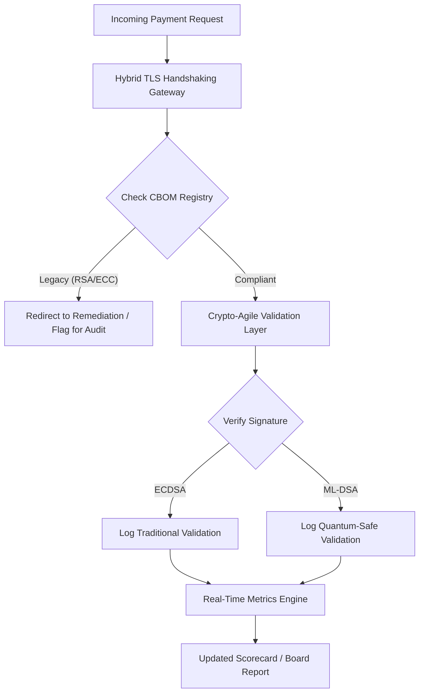

## A 2026-os posztkvantum biztonsági eredménytábla: igazgatótanácsi szintű mérőszámkeretrendszer a bizalmi vagyonkezelői kriptográfiai agilitáshoz

### Hogyan kell az igazgatótanácsoknak mérniük és irányítaniuk a NIST FIPS 203 és 204 szabványokra való átállást, nyomon követve a CBOM teljességét és mérsékelve a Harvest-Now-Decrypt-Later (HNDL) kitettséget a vállalati treasury területén.

A posztkvantum biztonság már nem kutatási projekt. A "felügyeleti óra" ketyeg a 2020-as évek vége felé eső betartatási határidők felé. A [NIST FIPS 203 (ML-KEM)](https://csrc.nist.gov/pubs/fips/203/final) és a [NIST FIPS 204 (ML-DSA)](https://csrc.nist.gov/pubs/fips/204/final) véglegesítése kodifikálta a kulcsbeágyazás és a digitális aláírások szabványait.

A szabályozó hatóságok immár azt várják el az első vonalbeli bankoktól, hogy lépjenek túl a kísérleti programokon. 2026-ban a hangsúly e szabványok iparosítására helyeződött át. A világos átállási útvonal bemutatásának elmulasztása jelentős szabályozói szankciókkal jár a [digitális működési ellenállóképességről szóló rendelet (DORA)](https://eur-lex.europa.eu/eli/reg/2022/2554/oj) értelmében, és személyes felelősséget vonhat maga után azon igazgatók számára, akik figyelmen kívül hagyják a kvantumtechnológiával lehetővé tett visszafejtés előrelátható fenyegetését.

## 01. Az igazgatótanácsi szintű kvantum-eredménytábla

Az alábbi mérőszámok szabványosított keretrendszert biztosítanak az igazgatótanácsok számára a kvantumfelkészültség és a kriptográfiai állapot értékeléséhez a kereskedelmi és befektetési banki (CIB) állományokban.

### 1. táblázat: PQC eredménytábla mérőszámai és tűréshatárai

| Mérőszám | Matematikai képlet | Igazgatótanács által jóváhagyott tűréshatárok | Kockázat tűréshatáron kívül |
| ---- | ---- | ---- | ---- |
| **Leltárteljességi százalék (ICP)** | (Azonosított kriptográfiai eszközök / Összes becsült eszköz) × 100 | > 98% | Árnyéktitkosítás és vakfoltok a nagy értékű elszámolási adatutakon. |
| **HNDL-kitettségi ráta (HER)** | (Hosszú élettartamú adatok örökölt kriptográfián / Összes hosszú élettartamú adat) × 100 | < 5% | Üzleti titkok, államadóssági főkönyvek és nagybani fizetési nyilvántartások végleges kompromittálódása. |
| **NIST átállási előrehaladási ráta (MPR)** | (FIPS 203/204 alatt futó rendszerek / Összes kritikus rendszer) × 100 | > 60% (2026 végéig) | Szabályozói meg nem felelés és kizárás a G20-hoz igazodó partnerek köréből. |
| **Kriptográfiai agilitási felkészültségi index (CARI)** | (Absztrahált kriptográfiai réteggel rendelkező alkalmazások / Összes alapalkalmazás) × 100 | > 85% | Súlyos technikai adósság és képtelenség reagálni a jövőbeli algoritmusleépítésekre. |

## 02. A Cryptographic Bill of Materials (CBOM)

Az ICP mérőszámot egy átfogó **CBOM-felderítési fázison** keresztül alapozzák meg. Ez egy automatizált folyamat, amely a vállalaton belül minden kriptográfiai végpontot azonosít.

- **Végpontfelderítés:** Belső és felhőalapú hálózatok vizsgálata aktív TLS-munkamenetek után, hogy azonosítsák az örökölt RSA- vagy ECC-használatot.
- **Kulcsleltár:** A nyilvános/privát kulcspárok hozzárendelése a megfelelő tulajdonosaikhoz, és a pontos lejárati dátumok feltérképezése.
- **Függőségtérképezés:** Elavult algoritmusokra támaszkodó harmadik féltől származó könyvtárak és API-k azonosítása.

Ez a felderítési fázis egyetlen igazságforrást hoz létre, lehetővé téve a CISO számára, hogy a pénzügyi teljesítménnyel azonos részletességgel számoljon be a kriptográfiai állapotról.

## 03. A HNDL-kitettség felszámolása a nagybani fizetésekben

A támadók aktívan célozzák a nagybani fizetéseket és a hosszú élettartamú vállalati adatbázisokat. Ezek a "Harvest-Now-Decrypt-Later" (HNDL) támadások a mai titkosított forgalom elfogását és archiválását foglalják magukban.

Még ha ma nem is létezik kriptográfiailag releváns kvantumszámítógép (CRQC), a most elfogott adatok a jövőben sebezhetők lesznek. Ennek mérséklése a hosszú élettartamú adatok (például személyazonossági nyilvántartások, 30 éves kötvényszerződések és jogi archívumok) magas prioritású átállását igényli, ami közvetlenül csökkenti a HER mérőszámot. A fizetési csatornák hibrid PQC-hagyományos titkosításra való frissítése (az ML-KEM az X25519 mellett történő használatával) azonnali védelmet nyújt az archiválási fenyegetésekkel szemben.

## 04. A kriptográfiai agilitás operatívvá tétele jól tervezett interfészeken keresztül

A kriptográfiai agilitás mérnöki absztrakciókon keresztül valósul meg. A modern könyvtárak, mint a [KyberLib](https://sebastienrousseau.com/2026-06-12-kyberlib-post-quantum-banking-migration-standards-code-2026), bemutatják, hogyan valósíthatnak meg a fejlesztők kvantumbiztos modulokat anélkül, hogy az egész alkalmazásköteget újraírnák.

- **Absztrahált burkolók:** Az alkalmazások algoritmusspecifikus rutinok helyett egy általános `encrypt()` vagy `sign()` függvényt hívnak.
- **Futásidejű csere:** Az alapul szolgáló modul ECDSA-ról ML-DSA-ra cserélhető konfigurációs változtatásokkal, összetett kódtelepítések helyett.

Ez az architektúra biztosítja, hogy ha egy adott PQC-algoritmus a jövőben kompromittálódik, a szervezet évek helyett órák alatt tudjon átállni.

## 05. A kvantumbiztos bejövő-érvényesítési munkafolyamat

Az alábbi diagram a biztonságos perimeterbe belépő adatok életciklusát szemlélteti egy kvantum-agilis banki környezetben.

## Következtetés

Egy első vonalbeli bank kriptográfiai állománya többé nem a CISO ügye. Ez bizalmi vagyonkezelői infrastruktúra. A NIST FIPS 203 és 204 meghatározza az algoritmusokat; a DORA 5. cikke meghatározza a felelősségi felületet; az SM&CR pedig egy megnevezett felső vezetőhöz rögzíti azt. A fenti eredménytábla, azaz a leltárteljesség, a HNDL-kitettség, az átállási előrehaladás és a kriptográfiai agilitás, megadja az igazgatótanácsnak azt a négy számot, amelyre szüksége van ennek az állománynak az irányításához anélkül, hogy el kellene olvasnia a kriptográfiai kódot.

A legfontosabb szám a HNDL-kitettség. Minden örökölt titkosítású nyilvántartás, amely ma egy nagybani fizetési archívumban ül, olvashatóvá válik azon a napon, amikor az első kriptográfiailag releváns kvantumszámítógépet leszállítják. A visszaszámlálás néma és aszimmetrikus: a védekezők csak a birtokukban lévő adatokra tudnak reagálni, a támadók pedig olyan adatokra tudnak reagálni, amelyeket már évekkel ezelőtt kiszivárogtattak. Egy 2024-ben RSA-2048 kulccsal titkosított 30 éves vállalati kötvényszerződés olyan szerződés, amely elveszíti bizalmassági garanciáját azon a napon, amikor egy CRQC élesbe kerül.

A [KyberLib](https://sebastienrousseau.com/2026-06-12-kyberlib-post-quantum-banking-migration-standards-code-2026) és társai ezt egy több éves platform-újraírásból konfigurációs változtatássá alakítják. Az igazgatótanács feladata nem a kód megírása. Az igazgatótanács feladata annak megkövetelése, hogy a kriptográfiai agilitási felkészültségi index, azaz az absztrahált kriptográfiai interfész mögött álló alapalkalmazások aránya, tizenkét hónapon belül átlépje a 85%-ot, valamint a negyedéves eredménytábla elolvasása.
