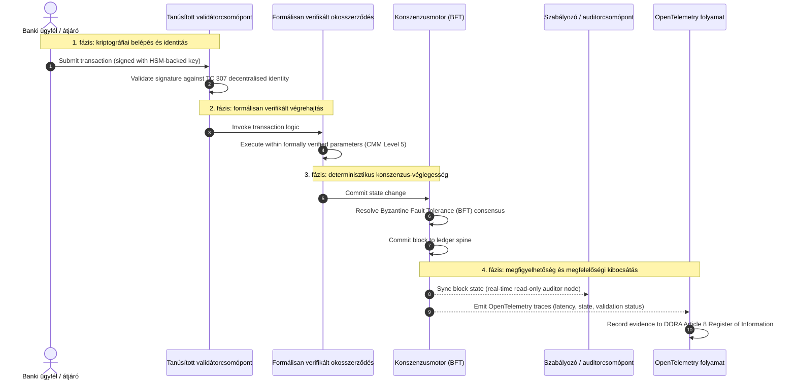

# Bizonyítéktól az igazságig: miért a tanúsított blokkláncok határozzák meg a banki bizalom következő korszakát

## Vezetői összefoglaló és stratégiai kontextus (TL;DR)

A nagybanki szektor és a globális tranzakciók 2026-ban történelmi fordulóponthoz érkeztek. Ahogy a pénzügyi szolgáltatások natívan digitális, valós idejű elszámolási hálózatokra állnak át, és ahogy a mesterséges intelligencia valószínűségi nemdeterminizmust visz a rendszerbe, a hagyományos analóg, visszatekintő bizonyossági modellek (például a statikus, entitásalapú auditok) nem képesek megfelelni a korszerű kockázatkezelési és vagyonkezelői elvárásoknak.

Az ISO/IEC 307-es műszaki bizottsága (TC 307) szabványosított alapszintet hozott létre az elosztott főkönyvi technológiákhoz. A valódi vállalati és intézményi elfogadáshoz azonban a leíró jellegű útmutatásról az előíró jellegű, függetlenül tanúsítható blokklánc-bizonyosságra kell áttérni. A főkönyvi kormányzás, a konszenzus-integritás, az okosszerződések biztonsága és a kriptográfiai agilitás szigorú, ötszintű képességérettségi modell (CMM) szerinti pontozásával a bankok az összetákolt, szállítóspecifikus feltételezésektől a tanúsítható, igazgatóság által auditálható pénzügyi igazság felé mozdulhatnak el.

## Legfontosabb tanulságok

* **A vagyonkezelői súrlódási rés**: Ma tanúsítani tudjuk a bankot (Basel III), a felhőt (ISO 27001) és az MI-kormányzási rendszereket (ISO 42001), de még nem tudjuk tanúsítani azt az elosztott főkönyvet, amely egyre inkább meghatározza, mi az igaz. Ez az aszimmetria jelentős működési sebezhetőség.
* **A DORA közvetlen vagyonkezelői felelősséget ír elő**: A DORA 5. cikke értelmében a bankok igazgatótanácsai közvetlen, át nem ruházható személyes felelősséget viselnek valamennyi harmadik felet érintő és főkönyvi bevezetés működési ellenállóképességéért, a mulasztásokért súlyos SM&CR szerinti személyes szankciókkal.
* **Az MI auditgerince**: Míg a gépi tanulás nem reprodukálható, valószínűségi kimeneteket eredményez, a tanúsított blokklánc determinisztikus állapotrögzítést biztosít. A modellverziók, a bemenetek és a validációs döntések láncon történő rögzítése megfelel az ISO 42001 és a modellkockázat-kezelési szabványoknak.
* **A Certified Blockchain Index**: Ez az index a kormányzást, a konszenzust, az okosszerződéseket és a megfigyelhetőséget ellenőrizhető, auditra kész pontozókártyába formálja egy 0-tól 5-ig terjedő CMM-skálán, mérnöki metrikákat fordítva le az igazgatóság által jóváhagyott kockázatvállalási nyilatkozatokra.

## 01. A vagyonkezelői súrlódási rés a digitális bankolásban

A klasszikus bankolásban a bizalom kapcsolati, intézményi és visszatekintő jellegű. Független, harmadik fél auditorokra támaszkodik, akik statikus időpontokban vizsgálják felül a pénzügyi állapotot, és összevetik az eltéréseket a kétoldalú főkönyvi silók között. A 2026-os valós idejű, API-vezérelt piacokon ez a modell megengedhetetlen késleltetéseket és strukturális kockázatokat visz be.

Amikor a tranzakciók azonnal kiegyenlítődnek, a napközbeni likviditási pénzalapokat API-átjárók dinamikusan kezelik, és az eszköztulajdon megosztott főkönyvekben tokenizálódik, a visszatekintő auditok megelőző kontrollok helyett igazságügyi vizsgálatokká válnak. A vagyonkezelők többé nem hagyatkozhatnak kizárólag a vállalati entitás tanúsítására. Magát a digitális szubsztrátumot is tanúsítaniuk kell.

A bankok jelenleg kirívó architekturális aszimmetriában működnek:

1. **Tanúsított felhőinfrastruktúra**: A hardvercsomópontokat, a virtualizált konténereket és a fizikai adatközpontokat az ISO/IEC 27001 és a SOC 2 Type II kontrollok szerint validálják.
2. **Tanúsított irányítási folyamatok**: A működési kockázati szabályzatokat, az üzletmenet-folytonossági terveket és az algoritmikus bevezetéseket szigorú kockázati keretrendszerek irányítják.
3. **Nem tanúsított főkönyvi motorok**: Az alapvető elosztott konszenzusmechanizmusok, a validátorcsomópontok ellátási láncai, az okosszerződések határai és a hálózati kormányzási modellek nem tanúsított, egyedi vagy konzorciumspecifikus feltételezésekre maradnak bízva.

Ez az aszimmetria jelentős hibapont. Egy bank futtathat validált alkalmazást egy biztonságos, ISO 27001 szerint tanúsított felhőkonténerben, de ha ez a konténer egy olyan elosztott főkönyvbe ír, amely centralizált validátorvezérléssel, sebezhető konszenzusparaméterekkel vagy nem auditált okosszerződésekkel rendelkezik, a tranzakció integritása sérül. E rés áthidalásához magának a főkönyvi motornak kell tanúsítható bizonyossági objektummá válnia.

## 02. Az ISO/IEC TC 307 szabványosítási alapszint

Az elosztott főkönyvek szabványosításához szükséges alapmunkát az ISO/IEC 307-es műszaki bizottsága (TC 307) (Blockchain és elosztott főkönyvi technológiák) végzi. Ahelyett, hogy a blokkláncot elszigetelt technikai protokollként kezelné, a TC 307 intézményi bizalmi infrastruktúraként közelíti meg, munkáját öt alappillér mentén szervezve:

1. **Taxonómia és szókincs (ISO 22739)**: Közös nómenklatúrát hoz létre, egységes jogi és működési definíciókat biztosítva a különböző joghatóságok, pénzügyi rendszerek és intézmények között.
2. **Referenciaarchitektúra (ISO/TR 23245)**: Meghatározza egy megfelelő elosztott főkönyvi rendszer határait, rétegeit, adatáramlásait és funkcionális komponenseit.
3. **Biztonság, adatvédelem és okosszerződések (ISO/TR 23244 / ISO 23613)**: Alapvető biztonsági irányelveket állapít meg a digitális eszközrendszerekhez, és részletezi az okosszerződések sebezhetőségeinek mérséklésével és életciklus-kormányzásával kapcsolatos legjobb gyakorlatokat.
4. **Interoperabilitási keretrendszerek**: A heterogén főkönyvi hálózatok közötti adat- és eszközcsere-mechanizmusokkal foglalkozik, megelőzve az elszigetelt tokenizált silók kialakulását.
5. **Decentralizált identitás és bizalmi horgonyok**: A főkönyvalapú kriptográfiai azonosítókat formális nyilvános kulcsú infrastruktúrákkal (PKI) és állami felhatalmazású nyilvántartásokkal integrálja.

Összességében a TC 307 azt jelzi, hogy a DLT egyedi mérnöki döntésből szabványosított architekturális szakterületté válik. A TC 307 azonban elsősorban leíró jellegű marad. Meghatározza, hogy mi számít jónak (útmutatás), de nem biztosítja azt az előíró jellegű ellenőrzési protokollt (bizonyosság), amelyre a kockázati vezetőknek és a felügyeleteknek szükségük van a kritikus vagy fontos funkciók (CIF) éles bevezetésének engedélyezéséhez.

## 03. Útmutatás kontra bizonyosság: a vagyonkezelői megkülönböztetés

A pénzügyi piaci szereplők nem azért vezetnek be technológiát, mert innovatív vagy elegáns; akkor vezetik be, amikor kormányozható, auditálható, megvédhető és összeegyeztethető a tőketartalék-követelményekkel. Ezért a bankolásban a szabványosítás természetes módon két rétegre bomlik:

* **Útmutatás (a keretrendszer)**: Felvázolja a legjobb gyakorlatokat, a referenciacélokat és az architekturális irányelveket (pl. ISO/IEC TC 307, NIST keretrendszerek).
* **Bizonyosság (a bizonyíték)**: Független, folyamatos és harmadik fél által ellenőrizhető bizonyítékot nyújt arról, hogy a keretrendszer a tervek szerint valósul meg és működik (pl. ISO 27001 tanúsítás, SOC 2 auditok, felügyeleti vizsgálatok).

A felhőinfrastruktúra tanúsítása mellett a nem tanúsított főkönyvi konszenzusra hagyatkozni kritikus szabályozási rés. Egy „megváltoztathatatlan" blokklánc nem feltétlenül „intézményileg megbízható". A megváltoztathatatlanság csak azt garantálja, hogy a bevitt adat változatlan; nem igazolja, hogy a validátorcsomópontok biztonságosak, a konszenzusprotokoll ellenálló az összejátszással szemben, az okosszerződés logikája matematikailag helytálló, vagy hogy a kriptográfiai kulcskezelés megfelel a posztkvantum előírásoknak.

E rés bezárása érdekében a 2026-os Certified Blockchain Index e követelményeket számszerűsíthető, a globális banki szabályozásokhoz igazított képességérettségi modellbe (CMM) formálja.

## 04. A 2026-os Certified Blockchain Index

Annak érdekében, hogy a felső vezetés értékelhesse és tanúsíthassa főkönyvi platformjait, ez az index az elosztott főkönyvi infrastruktúrát öt auditálható működési rétegbe strukturálja, amelyeket egy 0-tól 5-ig terjedő CMM-skálán pontoz.

## 1. táblázat: A Certified Blockchain Index architektúrája

| Index-réteg | Képességérettségi szint (CMM) | Műszaki és működési metrika | Szabályozási / vagyonkezelői kontrollhivatkozás |
| ---- | ---- | ---- | ---- |
| **Főkönyvi kormányzás** | **0. szint**: Eseti konzorcium**3. szint**: Automatizált validátorátvilágítás és -rotáció**5. szint**: Decentralizált, több fél általi kriptográfiai identitáshorgonyzás | az átvilágított pénzügyi entitások által üzemeltetett validátorcsomópontok százalékos aránya; a validátorviták rendezésének átlagos ideje; a csomópontok földrajzi eloszlása | **DORA 5. cikk** (Kormányzás és szervezet); **CPMI-IOSCO PFMI 2. alapelv** (Kormányzás) és **3. alapelv** (A kockázatok átfogó kezelésének kerete) |
| **Konszenzus-integritás** | **0. szint**: Egyetlen csomópont vagy átláthatatlan POW**3. szint**: Auditált BFT determinisztikus véglegességgel**5. szint**: Több joghatóságra kiterjedő, formálisan verifikált konszenzus folyamatos késleltetés-monitorozással | maximálisan tolerálható konszenzus-késleltetés; összejátszással szembeni ellenállási küszöb; rendelkezésre állási SLA szimulált csomópont-particionálás mellett | **DORA 6. cikk** (IKT-kockázatkezelési keret); **CPMI-IOSCO PFMI 8. alapelv** (Kiegyenlítés véglegessége) |
| **Identitás és kriptográfia** | **0. szint**: Gyenge RSA / ECDSA kulcsok**3. szint**: Több aláírás HSM-alapú kulcskezeléssel**5. szint**: Kvantumbiztos hibrid kulcsok (FIPS 203 ML-KEM) és zéró tudású adatvédelmi kapuk | a HSM-alapú kulcsokkal aláírt főkönyvi tranzakciók százalékos aránya; PQC-migrációs felkészültségi pontszám; ZK-bizonyítás késleltetése | **NIST FIPS 203 / 204**; **ISO/IEC 27001** (Információbiztonság-irányítás) |
| **Okosszerződések bizonyossága** | **0. szint**: Nem auditált solidity szkriptek**3. szint**: Automatizált fordítóvalidáció és külső audit**5. szint**: Formálisan verifikált, megváltoztathatatlan okosszerződések megszakító-frissítésekkel | a matematikai formális verifikációval rendelkező okosszerződések százalékos aránya; a fordítói figyelmeztetések száma; a sebezhetőségi vizsgálat lefedettsége | **EBA-iránymutatás a kiszervezési megállapodásokról** (81., 113-117. bekezdés); **DORA 30. cikk** (Minimális szerződéses záradékok) |
| **Audit és megfigyelhetőség** | **0. szint**: Kézi naplókigyűjtés**3. szint**: Strukturált OTel nyomok és csak olvasható auditorcsomópontok**5. szint**: Automatizált, folyamatos egyeztetés a 8. cikk szerinti nyilvántartással | az OpenTelemetry nyomokkal lefedett tranzakciók százalékos aránya; a főkönyvi blokk-commit és az auditorcsomópont szinkronizálása közötti késleltetés | **BCBS 239** (Kockázatiadat-aggregáció); **DORA 8. cikk** (Információnyilvántartás / ITS sémák) |

## 2. táblázat: Kulcsfontosságú bizalmi jelzések a globális banki szabványokhoz rendelve

| Jelzés / referenciaérték | Metrika | Hatás a banki platformokra | Szabályozási forrás |
| ---- | ---- | ---- | ---- |
| **Az ISO/IEC TC 307 előrehaladása** | Áttérés az ISO/TR műszaki jelentésekről a formális tanúsítási rendszerekre | Létrehozza az első szabványosított keretrendszert az elosztott főkönyvi motorok tanúsítására | **ISO/IEC JTC 1 / SC 44** (Elosztott főkönyvi technológiák) |
| **A Project Agorá prototípus-fázisa** | 40+ részt vevő kereskedelmi bank; a tokenizált betétek egységes főkönyvi tesztelése | A határokon átnyúló elszámolás átterelése az üzenetküldésről (SWIFT) az atomi tokenizált kiegyenlítésre | **Bank for International Settlements (BIS) Innovation Hub** |
| **DORA 30. cikk szerinti harmadik fél audit** | A csomópont-szolgáltatók és infrastruktúra-üzemeltetők 100%-a biztonsági kritériumok szerint auditálva | Megszünteti az „árnyék-validátorcsomópontokat"; teljes ellátásilánc-átláthatóságot ír elő | **European Supervisory Authorities (ESA)** |
| **ISO/IEC 42001 (MI-kormányzás)** | Kriptográfiailag megváltoztathatatlanná tett MI-modell- és tanítási naplók a láncon | A blokkláncot a gépi tanulás megváltoztathatatlan bizonyítéki főkönyveként („auditgerinc") alkalmazza | **ISO/IEC 42001:2023** (Információtechnológia, mesterséges intelligencia) |
| **Basel III tőkemegfelelés** | A működési kockázati tőkepufferek csökkentése dokumentált komplexitáscsökkentés alapján | A szabványosított működési kockázati keretrendszerek közvetlenül beszámítják a verifikált főkönyvi ellenállóképességet | **Basel Committee on Banking Supervision (BCBS)** |

## 05. Az MI „auditgerince": valószínűségi intelligencia determinisztikus infrastruktúrán

A tanúsított blokklánc egyik legerősebb stratégiai szerepe 2026-ban az, hogy **„auditgerincként"** működik a mesterséges intelligencia bevezetéseihez. A modern pénzügyi rendszerek egyre inkább valószínűségi jellegűek. A hitelbírálatot, a valós idejű csalásészlelést, az algoritmikus kereskedést és az autonóm ügyfél-interakciókat olyan gépi tanulási modellek hajtják, amelyek idővel fejlődnek, elsodródnak és alkalmazkodnak. Ezek a modellek nemdeterminisztikusak: ugyanazt a bemenetet két különböző időpontban megkapva eltérő kimeneteket adhatnak a dinamikus súlyok és a folyamatos tanítás miatt.

Ez a nemdeterminizmus mély kormányzási kihívást vet fel az **ISO/IEC 42001 (MI-kormányzás)** és a **modellkockázat-kezelési (MRM)** szabványok (például a **US Federal Reserve SR 11-7** és a **UK PRA SS1/23**) keretében: *Hogyan auditálod, magyarázod meg és véded a szigorúan nem reprodukálható döntéseket?*

A tanúsított elosztott főkönyv biztosítja a determinisztikus ellensúlyt. Míg az MI-modellek valószínűségi módon működnek, a tanúsított blokklánc determinisztikusan rögzíti a paramétereiket, megváltoztathatatlan bizonyítéki gerincet létrehozva:

* **Modellverziózás és súlyhorgonyzás**: Minden bevezetett modellverziót, a hozzá tartozó súlyokat és a tanítóadatok ellenőrzőösszegeit build-időben hashelik és a főkönyvbe írják, megfelelve az **SLSA Level 3** ellátásilánc-követelményeknek.
* **Kontextuális bemenetnaplózás**: Amikor egy MI-modell kritikus döntést hajt végre (pl. hitel jóváhagyása vagy tranzakció megjelölése), a pontos kontextuális bemeneteket és modell-hasheket a főkönyvbe írják, manipulációálló előzményt hozva létre.
* **Auditálhatóság kódhozzáférés nélkül**: Ha egy felügyelet azt kérdezi: „Miért utasította el a modellje ezt a hitelkérelmet június 3-án?", a banknak nem kell felfednie a védett kódot, sem megkísérelnie a pontos modellállapot újraalkotását. Bemutatja a bemenetek, a súlyok és a validációs állapot kriptográfiailag aláírt, láncon rögzített főkönyvi bejegyzését.

A gépi tanulási modellek valószínűségi döntéseinek egy tanúsított blokklánc determinisztikus konszenzusához horgonyzásával az intézmény megvédhető, rekonstruálható és függetlenül ellenőrizhető idővonalat hoz létre az automatizált műveletekről.

## 06. A tanúsított konszenzustól auditig tartó folyamat megjelenítése

Az alábbi szekvenciadiagram egy tanúsított blokklánc-platformon áthaladó tranzakció életciklusát szemlélteti, bemutatva, hogyan kapcsolódnak össze a validációs kapuk, a konszenzus-integritás, az okosszerződés-végrehajtás és a telemetriakibocsátás, hogy igazgatóság számára kész szabályozási bizonyítékot állítsanak elő:

E tranzakciós szekvencia kritikus útja megköveteli, hogy minden validációs, végrehajtási és konszenzuslépés kriptográfiailag aláírt legyen, biztosítva a végponttól végpontig terjedő eredetkövetést. A szabályozó auditorcsomópontja valós időben szinkronizálja a blokkállapotot, kiküszöbölve a visszatekintő, kézi pénzügyi egyeztetés szükségességét.

## 07. Igazgatósági kézikönyv a felső vezetők számára

Ahhoz, hogy sikeresen navigáljanak a szervezeti bizalomból az infrastrukturális bizalomba való átmenetben, a banki vezetőknek és a felső vezetőknek azonnal négy kulcsfontosságú irányelvet kell végrehajtaniuk:

1. **Tegyék kötelezővé a főkönyvi auditokat a vállalati kockázatkezelésben (ERM)**: Érvényesítsenek olyan szabályzatot, amely szerint egyetlen elosztott főkönyvi platform sem, legyen az privát, nyilvános vagy konzorciumalapú, vezethető be kritikus vagy fontos funkciókhoz (CIF), amíg nem auditálták az ötrétegű **Certified Blockchain Index architektúrája** szerint (legalább CMM 3. szint).
2. **Integrálják a blokkláncokat az ISO 42001 szerinti MI-bizonyítéki gerincként**: Utasítsák a kockázatkezelési vezetőt (CRO) és a vezető MI-architektet, hogy integráljanak minden nagy hatású gépi tanulási modellt egy tanúsított blokklánccal, manipulációálló auditnaplót hozva létre a modellverziókról, súlyokról, bemenetekről és döntésekről.
3. **Auditálják a validátorcsomópontok ellátási láncát (DORA 30. cikk)**: Kötelezzék a beszerzési részleget, hogy auditáljon minden olyan harmadik fél entitást, amely validátorcsomópontokat üzemeltet vagy felhőhosztingot kezel a DLT-hálózatok számára, ugyanazon kiberbiztonsági és működési ellenállóképességi szabványoknak való megfelelést előírva, mint amelyeket a bank belső felhőcsomópontjaira alkalmaznak.
4. **Igazítsák a főkönyvi architektúrákat a CPMI-IOSCO és a BCBS 239 mentén**: Utasítsák a platformmérnöki csapatot, hogy igazítsa a főkönyvi kimeneti telemetriát közvetlenül a **BCBS 239** adatszolgáltatási követelményeihez, és biztosítsák, hogy a konszenzus- és kiegyenlítés-véglegességi paraméterek szigorúan megfeleljenek a **CPMI-IOSCO 8. és 9. alapelvének**.

## 08. Gyakran ismételt kérdések

**Az ISO/IEC TC 307 tanúsítási szabvány?**
Nem. Az ISO/IEC TC 307 egy műszaki bizottság, amely szókincset, referenciaarchitektúrákat és biztonsági irányelveket állapít meg. Bár meghatározza, hogy „mi számít jónak" (útmutatás), az iparágnak e dokumentumokat formális, auditálható tanúsítási rendszerekké (bizonyosság) kell operacionalizálnia ahhoz, hogy megfeleljen a banki felügyeleteknek.

**Hogyan támogatja a tanúsított blokklánc a DORA-megfelelést?**
A DORA 5. cikke értelmében a bankok igazgatótanácsai közvetlen, személyes felelősséget viselnek a technológiai ellenállóképességért. A tanúsított blokklánc ellenőrizhető, kriptográfiai bizonyítékot nyújt a konszenzus-integritásról, a validátor-ellátási lánc kontrolljáról és az okosszerződések biztonságáról, dokumentálható „ésszerű lépéseket" adva az igazgatótanács tagjainak az SM&CR szerinti személyes felelősségi igényekkel szembeni védekezéshez.

Mi a különbség egy hagyományos főkönyvi audit és egy tanúsított blokklánc-audit között?
A hagyományos audit visszatekintő jellegű, a kézi bejegyzéseket és statikus fájlokat a tranzakciók elszámolása után ellenőrzi. A tanúsított blokklánc-audit folyamatos és valós idejű; a validátorcsomópontok, a BFT-konszenzusmotor és a formálisan verifikált okosszerződések tanúsítottan determinisztikus módon hajtják végre a tranzakciókat, strukturált telemetriát (OpenTelemetry) bocsátva ki, amely folyamatosan validálja a rendszer állapotát.

Tanúsíthatók-e a nyilvános blokkláncok banki használatra?
A legtöbb joghatóságban a tisztán engedélymentes nyilvános blokkláncok nem felelnek meg a banki szabályozásoknak a validátoridentitás-ellenőrzés hiánya, a kiszámíthatatlan gáz-/tranzakciós költségek és a nemdeterminisztikus véglegesség (pl. valószínűségi proof-of-work/stake elágazások) miatt. A bankolásban a tanúsított blokkláncok jellemzően vállalati engedélyezett vagy szigorúan szabályozott nyilvános-hibrid architektúrákat alkalmaznak, ahol a validátorcsomópontok üzemeltetői azonosított és auditált pénzügyi entitások.

## 09. Hivatkozások

* Basel Committee on Banking Supervision (BCBS), 2013. *Principles for effective risk data aggregation and reporting (BCBS 239)*. Basel: Bank for International Settlements. Elérhető: [https://www.bis.org/publ/bcbs239.pdf](https://www.bis.org/publ/bcbs239.pdf).
* Committee on Payments and Market Infrastructures and Technical Committee of the International Organization of Securities Commissions (CPMI-IOSCO), 2012. *Principles for financial market infrastructures*. Basel: Bank for International Settlements. Elérhető: [https://www.bis.org/cpmi/publ/d101.htm](https://www.bis.org/cpmi/publ/d101.htm).
* European Banking Authority (EBA), 2019. *EBA/GL/2019/02 — Guidelines on outsourcing arrangements*. Paris: EBA. Elérhető: [https://www.eba.europa.eu/regulation-and-policy/internal-governance/guidelines-on-outsourcing-arrangements](https://www.eba.europa.eu/regulation-and-policy/internal-governance/guidelines-on-outsourcing-arrangements).
* European Parliament and Council of the European Union, 2022. *Regulation (EU) 2022/2554 on digital operational resilience for the financial sector (DORA)*. Brussels: Official Journal of the European Union. Elérhető: [https://eur-lex.europa.eu/legal-content/EN/TXT/?uri=CELEX%3A32022R2554](https://eur-lex.europa.eu/legal-content/EN/TXT/?uri=CELEX%3A32022R2554).
* ISO/IEC JTC 1/SC 42, 2023. *ISO/IEC 42001:2023 — Information technology — Artificial intelligence — Management system*. Geneva: International Organization for Standardization. Elérhető: [https://www.iso.org/standard/81230.html](https://www.iso.org/standard/81230.html).
* ISO/IEC Technical Committee 307, 2020. *ISO/IEC 22739:2020 — Blockchain and distributed ledger technologies — Vocabulary*. Geneva: International Organization for Standardization. Elérhető: [https://www.iso.org/standard/73771.html](https://www.iso.org/standard/73771.html).
* National Institute of Standards and Technology (NIST), 2026. *First Three Finalized Post-Quantum Encryption Standards (FIPS 203, 204, and 205)*. Gaithersburg: U.S. Department of Commerce. Elérhető: [https://www.nist.gov/news-events/news/2024/08/nist-releases-first-3-finalized-post-quantum-encryption-standards](https://www.nist.gov/news-events/news/2024/08/nist-releases-first-3-finalized-post-quantum-encryption-standards).
