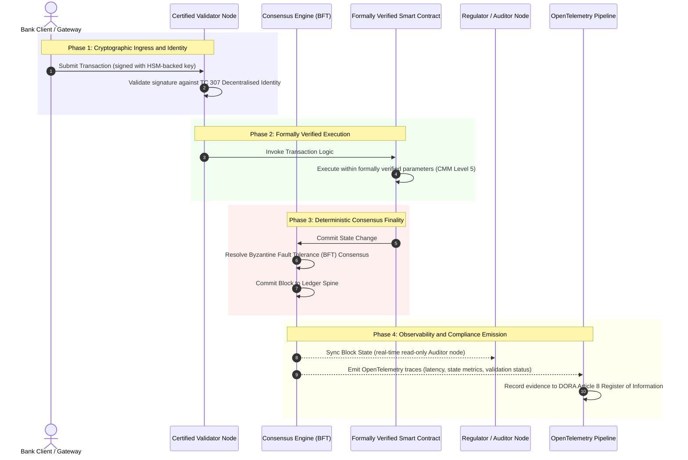

# A bizonyítéktól az igazságig: miért a tanúsított blokkláncok határozzák meg a banki bizalom következő korszakát

**A megváltoztathatatlan nem azonos a megbízhatóval.** Ahogy a nagybanki működés a valós idejű kiegyenlítés és a valószínűségi MI felé mozdul, a főkönyv, amely eldönti, mi az igaz, azzá az egyetlen réteggé vált, amelyet a bankok még mindig nem tudnak tanúsítani. Az entitást a Basel III szerint, a felhőt az ISO 27001 szerint, az MI-t pedig az ISO 42001 szerint tanúsítják, de az elosztott főkönyvet, annak irányítását, konszenzusát, kriptográfiáját és okosszerződéseit szállítóspecifikus feltételezésekre bízzák. E jelentés amellett érvel, hogy e fiduciárius rés bezárása azt kívánja, hogy az ISO/IEC TC 307 iránymutatástól az előíró jellegű bizonyosság felé lépjünk: a főkönyvet egy 5 szintű tanúsított blokklánc indexhez mérjük, amely a mérnöki mutatókat igazgatótanács által auditálható, DORA-védhető igazsággá alakítja.

<!-- lead-start -->
<aside class="post-lead" aria-label="A cikk összefoglalója">

<strong>Röviden.</strong> A bankok tanúsítják az entitást, a felhőt és az MI-t, de nem a főkönyvet, amely egyre inkább eldönti, mi az igaz. Az ISO/IEC TC 307 iránymutatást ad, nem bizonyosságot. Egy 5 szintű tanúsított blokklánc index egy érettségi modellhez méri a főkönyv irányítását, a konszenzus integritását, az identitást és a kriptográfiát, az okosszerződések bizonyosságát és a megfigyelhetőséget, ezzel bezárja a fiduciárius rést, és determinisztikus auditgerincet ad a valószínűségi MI-nek.

<strong>Fő tanulságok</strong>

<ul class="post-lead-takeaways">
  <li><strong>A fiduciárius súrlódási rés.</strong> A bank (Basel III), a felhő (ISO 27001) és az MI-irányítási rendszer (ISO 42001) tanúsítható; az elosztott főkönyv, amely eldönti, mi az igaz, még nem. Ez az aszimmetria élő működési sebezhetőség.</li>
  <li><strong>A DORA személyessé teszi.</strong> A DORA 5. cikke szerint a banki igazgatótanácsok közvetlen, át nem ruházható felelősséget viselnek a harmadik felek és a főkönyvi telepítések ellenállóképességéért, a kudarcot pedig SM&amp;CR szerinti személyes szankciók kísérik.</li>
  <li><strong>Az MI auditgerince.</strong> A gépi tanulás nem reprodukálható; a tanúsított blokklánc a modellverziókat, a bemeneteket és a validációs döntéseket determinisztikusan, a láncon rögzíti, teljesítve az ISO 42001 és a modellkockázat-kezelési szabványokat.</li>
  <li><strong>A tanúsított blokklánc index.</strong> Az irányítás, a konszenzus, a kriptográfia, az okosszerződések és a megfigyelhetőség 0-tól 5-ig terjedő CMM-eredménytáblává válik, amely a mérnöki mutatókat az igazgatótanács által jóváhagyott kockázatvállalási nyilatkozatokká fordítja.</li>
</ul>

<strong>Kapcsolódó olvasmány:</strong> <a href="https://sebastienrousseau.com/2026-07-02-certified-blockchains-banking-trust-tc307-assurance-2026">Tanúsított blokkláncok és banki bizalom: TC 307 bizonyosság</a>, <a href="https://sebastienrousseau.com/2026-07-24-global-payments-outlook-operating-model-risk-revenue">A 2026-os globális fizetési kilátások</a>.

</aside>
<!-- lead-end -->

> **Vezetői összefoglaló**
>
> - **A nagybanki működés fordulóponthoz érkezett.** A valós idejű elszámolás és a valószínűségi MI szétzúzza az analóg, visszatekintő bizonyossági modellt: a statikus, entitásalapú auditok többé nem felelnek meg a korszerű kockázatkezelési vagy fiduciárius elvárásoknak.
> - **A TC 307 alapvonal, nem tanúsítvány.** Az ISO/IEC TC 307 szabványosította az elosztott főkönyvek szókészletét, referenciaarchitektúráját és biztonsági iránymutatását, de leíró jellegű. Meghatározza, hogy mi a jó; nem nyújtja azt az előíró jellegű ellenőrzést, amelyre a kockázati vezetőknek és a felügyeleteknek szüksége van az éles telepítés engedélyezéséhez.
> - **A bizonyosság a főkönyv pontozását jelenti.** Az irányítás, a konszenzus integritása, az okosszerződések biztonsága és a kriptográfiai rugalmasság, egy szigorú 5 szintű érettségi modellhez mérve, a foltszerű, szállítóspecifikus feltételezéstől a tanúsítható, igazgatótanács által auditálható pénzügyi igazság felé viszi a bankokat.
> - **A főkönyv az MI auditgerince.** A modellverziók, a bemenetek és a validációs döntések determinisztikus konszenzushoz horgonyzása védhető, rekonstruálható bizonyítékrekordot ad a nem reprodukálható gépi tanulásnak az ISO 42001, az SR 11-7 és a PRA SS1/23 keretében.

## A fiduciárius súrlódási rés a digitális bankszektorban

A klasszikus bankszektorban a bizalom kapcsolati, intézményi és visszatekintő. Független, harmadik fél könyvvizsgálókra támaszkodik, akik statikus időpontokban vizsgálják felül a pénzügyi állapotot, és összeegyeztetik az eltéréseket a kétoldalú főkönyvi silók között. A 2026-os valós idejű, API-vezérelt piacokon ez a modell elviselhetetlen késleltetéseket és szerkezeti kockázatokat visz be.

Amikor a tranzakciók azonnal kiegyenlítődnek, a napközbeni likviditási készleteket API-átjárók kezelik dinamikusan, és az eszköztulajdon megosztott főkönyveken keresztül tokenizálódik, a visszatekintő auditok megelőző kontrollok helyett igazságügyi vizsgálatokká válnak. A fiduciáriusok többé nem támaszkodhatnak pusztán a vállalati entitás tanúsítására. Magát a digitális alapréteget is tanúsítaniuk kell.

A bankok jelenleg kirívó architekturális aszimmetriában működnek:

1. **Tanúsított felhőinfrastruktúra**: A hardveres csomópontokat, a virtualizált konténereket és a fizikai adatközpontokat az ISO/IEC 27001 és a SOC 2 Type II kontrollokhoz mérve validálják.  
2. **Tanúsított irányítási folyamatok**: A működési kockázati szabályzatokat, az üzletmenet-folytonossági terveket és az algoritmikus telepítéseket szigorú kockázati keretrendszerek szabályozzák.  
3. **Nem tanúsított főkönyvi motorok**: A központi elosztott konszenzusmechanizmusok, a validátor csomópontok ellátási láncai, az okosszerződések határai és a hálózati irányítási modellek nem tanúsított, egyedi vagy konzorcium-specifikus feltételezésekre maradnak.

Ez az aszimmetria komoly hibapont. Egy bank futtathat egy validált alkalmazást egy biztonságos, ISO 27001 szerint tanúsított felhőkonténerben, de ha ez a konténer egy olyan elosztott főkönyvbe ír, amelyben központosított a validátorvezérlés, sebezhetők a konszenzusparaméterek, vagy nem auditáltak az okosszerződések, akkor a tranzakció integritása sérül. E rés áthidalásához magának a főkönyvi motornak kell tanúsítható bizonyossági objektummá válnia.

## Az ISO/IEC TC 307 szabványosítási alapvonal

Az elosztott főkönyvek szabványosításához szükséges alapvető munkát az ISO/IEC 307-es Műszaki Bizottság (TC 307\) (Blokklánc és elosztott főkönyvi technológiák) alakítja ki. Ahelyett, hogy a blokkláncot elszigetelt technikai protokollként kezelné, a TC 307 intézményi bizalmi infrastruktúraként közelíti meg, és munkáját öt fő pillérre szervezi:

1. **Taxonómia és szókészlet (ISO 22739\)**: Közös nómenklatúrát hoz létre, biztosítva a következetes jogi és működési definíciókat a különböző joghatóságok, pénzügyi konstrukciók és intézmények között.  
2. **Referenciaarchitektúra (ISO/TR 23245\)**: Meghatározza egy megfelelő elosztott főkönyvi rendszer határait, rétegeit, adatáramlásait és funkcionális komponenseit.  
3. **Biztonság, adatvédelem és okosszerződések (ISO/TR 23244 / ISO 23613\)**: Alapszintű biztonsági iránymutatásokat állapít meg a digitális eszközrendszerek számára, és részletezi az okosszerződések sebezhetőségének mérséklésére és életciklus-irányítására vonatkozó bevált gyakorlatokat.  
4. **Együttműködési keretrendszerek**: A heterogén főkönyvi hálózatok közötti adat- és eszközcsere-mechanizmusokkal foglalkozik, megakadályozva az elszigetelt tokenizált silók kialakulását.  
5. **Decentralizált identitás és bizalmi horgonyok**: A főkönyv-alapú kriptográfiai azonosítókat formális nyilvános kulcsú infrastruktúrákkal (PKI) és állami felhatalmazású nyilvántartásokkal integrálja.

Összességében a TC 307 azt jelzi, hogy a DLT egyedi mérnöki döntésből szabványosított architekturális szakterületté válik. A TC 307 azonban elsődlegesen leíró jellegű marad. Meghatározza, hogy mi a jó (iránymutatás), de nem nyújtja azt az előíró jellegű ellenőrzési protokollt (bizonyosság), amelyre a kockázati vezetőknek és a felügyeleteknek szüksége van a kritikus vagy fontos funkciók (CIFs) éles telepítésének engedélyezéséhez.

## Iránymutatás kontra bizonyosság: a fiduciárius megkülönböztetés

A pénzügyi piaci szereplők nem azért vezetnek be technológiát, mert innovatív vagy elegáns; akkor vezetik be, ha irányítható, auditálható, védhető, és összeegyeztethető a tőketartalék-követelményekkel. A bankszektorban a szabványosítás ezért természetes módon két rétegre bomlik:

* **Iránymutatás (a keretrendszer)**: Felvázolja a bevált gyakorlatokat, a referenciacélokat és az architekturális irányelveket (pl. ISO/IEC TC 307, NIST keretrendszerek).  
* **Bizonyosság (a bizonyíték)**: Független, folyamatos és harmadik fél által ellenőrizhető bizonyítékot nyújt arról, hogy a keretrendszer a tervek szerint van megvalósítva és működik (pl. ISO 27001 tanúsítás, SOC 2 auditok, szabályozói vizsgálatok).

Ha a felhőinfrastruktúrát tanúsítjuk, miközben a nem tanúsított főkönyvi konszenzusra hagyatkozunk, az kritikus szabályozási rés. Egy „megváltoztathatatlan” blokklánc nem feltétlenül „intézményileg megbízható”. A megváltoztathatatlanság csak azt garantálja, hogy a bevitt adat változatlan; nem igazolja, hogy a validátor csomópontok biztonságosak, a konszenzusprotokoll ellenálló az összejátszással szemben, az okosszerződés logikája matematikailag helytálló, vagy a kriptográfiai kulcskezelés megfelel a posztkvantum előírásoknak.

E rés bezárása érdekében a 2026-os tanúsított blokklánc index e követelményeket számszerűsíthető érettségi modellé (CMM) formalizálja, amelyet a globális banki szabályozásokhoz rendel.

## A 2026-os tanúsított blokklánc index

Ahhoz, hogy a felső vezetés értékelni és tanúsítani tudja főkönyvi platformjait, ez az index az elosztott főkönyvi infrastruktúrát öt auditálható működési rétegre tagolja, 0-tól 5-ig terjedő CMM-skálán pontozva.

### 1. táblázat: A tanúsított blokklánc index architektúrája

| Indexréteg | Érettségi szint (CMM) | Technikai és működési mutató | Szabályozási / fiduciárius kontrollhivatkozás |
| ---- | ---- | ---- | ---- |
| **Főkönyv-irányítás** | **0. szint**: Eseti konzorcium**3. szint**: Automatizált validátor-ellenőrzés és -rotáció**5. szint**: Decentralizált, többszereplős kriptográfiai identitáshorgonyzás | az ellenőrzött pénzügyi entitások által üzemeltetett validátor csomópontok aránya; a validátorviták rendezésének átlagos ideje; a csomópontok földrajzi eloszlása | **DORA 5. cikk** (Irányítás és szervezet); **CPMI-IOSCO PFMI 2. alapelv** (Irányítás) és **3. alapelv** (A kockázatok átfogó kezelésének kerete) |
| **Konszenzus-integritás** | **0. szint**: Egycsomópontos vagy átláthatatlan POW**3. szint**: Auditált BFT determinisztikus véglegességgel**5. szint**: Több joghatóságra kiterjedő, formálisan ellenőrzött konszenzus folyamatos késleltetésfigyeléssel | a maximálisan tolerálható konszenzuskésleltetés; az összejátszással szembeni ellenállási küszöb; a rendelkezésre állási SLA szimulált csomópont-particionálás mellett | **DORA 6. cikk** (IKT-kockázatkezelési keret); **CPMI-IOSCO PFMI 8. alapelv** (A kiegyenlítés véglegessége) |
| **Identitás és kriptográfia** | **0. szint**: Gyenge RSA / ECDSA kulcsok**3. szint**: Több aláírásos, HSM-alapú kulcskezelés**5. szint**: Kvantumbiztos hibrid kulcsok (FIPS 203 ML-KEM) és zéró tudású adatvédelmi kapuk | a HSM-alapú kulcsokkal aláírt főkönyvi tranzakciók aránya; a PQC-migráció felkészültségi pontszáma; a ZK-bizonyítás késleltetése | **NIST FIPS 203 / 204**; **ISO/IEC 27001** (Információbiztonsági irányítás) |
| **Okosszerződés-bizonyosság** | **0. szint**: Nem auditált solidity szkriptek**3. szint**: Automatizált fordítóvalidáció és külső audit**5. szint**: Formálisan ellenőrzött, megváltoztathatatlan okosszerződések megszakító-áramkörös frissítésekkel | a matematikailag, formálisan ellenőrzött okosszerződések aránya; a fordítói figyelmeztetések száma; a sebezhetőségvizsgálat lefedettsége | **EBA iránymutatás a kiszervezési megállapodásokról** (81., 113-117. bekezdés); **DORA 30. cikk** (Minimális szerződéses záradékok) |
| **Audit és megfigyelhetőség** | **0. szint**: Kézi naplókigyűjtés**3. szint**: Strukturált OTel-nyomkövetések és csak olvasható auditori csomópontok**5. szint**: Automatizált, folyamatos egyeztetés a 8. cikk szerinti nyilvántartással | az OpenTelemetry-nyomkövetésekkel lefedett tranzakciók aránya; a főkönyvi blokkrögzítéstől az auditori csomópont szinkronizálásáig tartó késleltetés | **BCBS 239** (Kockázati adatok aggregálása); **DORA 8. cikk** (Információnyilvántartás / ITS-sémák) |

### 2. táblázat: Kulcsfontosságú bizalmi jelzések a globális banki szabványokhoz rendelve

| Jelzés / referenciaérték | Mutató | Hatás a banki platformokra | Szabályozási forrás |
| ---- | ---- | ---- | ---- |
| **ISO/IEC TC 307 előrehaladás** | Átmenet az ISO/TR műszaki jelentésektől a formális tanúsítási rendszerekig | Létrehozza az első szabványosított keretrendszert az elosztott főkönyvi motorok tanúsítására | **ISO/IEC JTC 1 / SC 44** (Elosztott főkönyvi technológiák) |
| **A Project Agorá prototípus-fázisa** | 40+ résztvevő kereskedelmi bank; a tokenizált betétek egységes főkönyvi tesztelése | A határokon átnyúló elszámolás áthelyezése az üzenetküldésről (SWIFT) az atomi tokenizált kiegyenlítésre | **A Nemzetközi Fizetések Bankjának (BIS) Innovációs Központja** |
| **DORA 30. cikk szerinti harmadik fél audit** | A csomópont-szolgáltatók és infrastruktúra-tárhelyek 100%-ának auditálása biztonsági kritériumok alapján | Megszünteti az „árnyék-validátor csomópontokat”; teljes ellátásilánc-átláthatóságot ír elő | **Európai Felügyeleti Hatóságok (ESA)** |
| **ISO/IEC 42001 (MI-irányítás)** | Kriptográfiailag megváltoztathatatlanná tett MI-modell és tanítási naplók a láncon | A blokkláncot a gépi tanulás megváltoztathatatlan bizonyítéki főkönyveként („auditgerinc”) alkalmazza | **ISO/IEC 42001:2023** (Információtechnológia, mesterséges intelligencia) |
| **Basel III tőkemegfelelés** | A működési kockázati tőkepufferek csökkentése a dokumentált komplexitáscsökkentés alapján | A szabványosított működési kockázati keretrendszerek közvetlenül beszámítják az igazolt főkönyvi ellenállóképességet | **Bázeli Bankfelügyeleti Bizottság (BCBS)** |

## Az MI „auditgerince”: valószínűségi intelligencia determinisztikus infrastruktúrán

A tanúsított blokklánc egyik legerősebb stratégiai szerepe 2026-ban az, hogy a mesterséges intelligencia telepítéseinek **„auditgerinceként”** működik. A modern pénzügyi rendszerek egyre inkább valószínűségiek. A hitelpontozást, a valós idejű csalásfelderítést, az algoritmikus kereskedést és az autonóm ügyfélinterakciókat olyan gépi tanulási modellek hajtják, amelyek idővel fejlődnek, elsodródnak és alkalmazkodnak. E modellek nem determinisztikusak: ugyanarra a bemenetre két különböző időpontban a dinamikus súlyok és a folyamatos tanítás miatt eltérő kimeneteket adhatnak.

Ez a nem determinisztikusság mélyreható irányítási kihívást vet fel az **ISO/IEC 42001 (MI-irányítás)** és a **modellkockázat-kezelési (MRM)** szabványok (például az **US Federal Reserve SR 11-7** és a **UK PRA SS1/23**) keretében: *Hogyan auditálja, magyarázza és védi meg a szigorúan véve nem reprodukálható döntéseket?*

Egy tanúsított elosztott főkönyv adja a determinisztikus ellensúlyt. Miközben az MI-modellek valószínűségi módon működnek, a tanúsított blokklánc determinisztikusan rögzíti a paramétereiket, megváltoztathatatlan bizonyítéki gerincet hozva létre:

* **Modellverziózás és súlyhorgonyzás**: Minden telepített modellverziót, a hozzá tartozó súlyokat és a tanítóadatok ellenőrzőösszegeit build-időben hasheljük és a főkönyvbe írjuk, teljesítve az **SLSA Level 3** ellátásilánc-követelményeket.  
* **Kontextuális bemenetnaplózás**: Amikor egy MI-modell kritikus döntést hoz (pl. hitel jóváhagyása vagy tranzakció megjelölése), a pontos kontextuális bemeneteket és a modellhasheket a főkönyvbe írjuk, hamisításbiztos előzményt hozva létre.  
* **Auditálhatóság kódhozzáférés nélkül**: Ha egy szabályozó azt kérdezi: „Miért utasította el a modellje ezt a hiteligénylést június 3-án?”, a banknak nem kell felfednie a védett kódot, sem megpróbálnia újraalkotni a pontos modellállapotot. Bemutatja a bemenetek, a súlyok és a validációs állapot kriptográfiailag aláírt, a láncon rögzített főkönyvi rekordját.

Azzal, hogy a gépi tanulási modellek valószínűségi döntéseit egy tanúsított blokklánc determinisztikus konszenzusához horgonyozza, az intézmény az automatizált intézkedések védhető, rekonstruálható és függetlenül ellenőrizhető idővonalát hozza létre.

## A tanúsított konszenzustól auditig tartó folyamat vizualizálása

Az alábbi szekvenciadiagram bemutatja egy tanúsított blokklánc-platformon áthaladó tranzakció életciklusát, szemléltetve, hogyan kapcsolódnak össze a validációs kapuk, a konszenzus integritása, az okosszerződés-végrehajtás és a telemetriakibocsátás, hogy igazgatótanács számára kész szabályozói bizonyítékot állítsanak elő:

E tranzakciós sorozat kritikus útvonala megköveteli, hogy minden validációs, végrehajtási és konszenzuslépés kriptográfiailag alá legyen írva, ezzel biztosítva a végponttól végpontig terjedő eredetkövetést. A szabályozó auditori csomópontja valós időben szinkronizálja a blokkállapotot, feleslegessé téve a visszatekintő, kézi pénzügyi egyeztetést.

## Igazgatótanácsi kézikönyv a felső vezetőknek

Ahhoz, hogy sikeresen kezeljék a szervezeti bizalomtól az infrastrukturális bizalom felé történő elmozdulást, a banki vezetőknek és felső vezetőknek haladéktalanul négy kulcsfontosságú irányelvet kell végrehajtaniuk:

1. **Írja elő a főkönyvi auditokat a vállalati kockázatkezelésben (ERM)**: Vezessen be olyan szabályzatot, amely szerint egyetlen elosztott főkönyvi platform sem, legyen az privát, nyilvános vagy konzorciumalapú, nem telepíthető kritikus vagy fontos funkciókra (CIFs) mindaddig, amíg nem auditálták az 5 rétegű **tanúsított blokklánc index architektúrához** mérve (legalább 3. CMM-szint).  
2. **Integrálja a blokkláncokat az ISO 42001 szerinti MI-bizonyítéki gerincként**: Utasítsa a kockázati vezérigazgatót és a vezető MI-architektust, hogy minden nagy hatású gépi tanulási modellt integráljanak egy tanúsított blokklánccal, hamisításbiztos auditfőkönyvet hozva létre a modellverziókról, súlyokról, bemenetekről és döntésekről.  
3. **Auditálja a validátor csomópontok ellátási láncát (DORA 30. cikk\)**: Kötelezze a beszerzési részleget, hogy auditáljon minden harmadik fél entitást, amely validátor csomópontokat üzemeltet vagy felhőtárhelyet kezel a DLT-hálózatok számára, előírva ugyanazon kiberbiztonsági és működési ellenállóképességi szabványoknak való megfelelést, amelyeket a bank belső felhőcsomópontjaira alkalmaznak.  
4. **Igazítsa a főkönyvi architektúrákat a CPMI-IOSCO-hoz és a BCBS 239-hez**: Utasítsa a platformmérnöki csapatot, hogy a főkönyvi kimeneti telemetriát közvetlenül a **BCBS 239** adatszolgáltatási követelményeihez igazítsa, és biztosítsa, hogy a konszenzus- és kiegyenlítés-véglegességi paraméterek szigorúan megfeleljenek a **CPMI-IOSCO 8. és 9. alapelvének**.

## Gyakran ismételt kérdések

**Az ISO/IEC TC 307 tanúsítási szabvány?**  
Nem. Az ISO/IEC TC 307 egy műszaki bizottság, amely szókészletet, referenciaarchitektúrákat és biztonsági iránymutatásokat állapít meg. Bár meghatározza, hogy „mi a jó” (iránymutatás), az iparágnak ezeket a dokumentumokat formális, auditálható tanúsítási rendszerekké (bizonyosság) kell átültetnie ahhoz, hogy megfeleljen a banki felügyeleteknek.

**Hogyan támogatja egy tanúsított blokklánc a DORA-megfelelést?**  
A DORA 5. cikke szerint a banki igazgatótanácsok közvetlen, személyes felelősséget viselnek a technológiai ellenállóképességért. Egy tanúsított blokklánc ellenőrizhető, kriptográfiai bizonyítékot nyújt a konszenzus integritásáról, a validátor-ellátási lánc feletti kontrollról és az okosszerződések biztonságáról, megadva az igazgatótanácsi tagoknak azokat a dokumentálható „ésszerű lépéseket”, amelyek az SM\&CR szerinti személyes felelősségi igényekkel szembeni védekezéshez szükségesek.

**Mi a különbség egy hagyományos főkönyvi audit és egy tanúsított blokklánc-audit között?**  
A hagyományos audit visszatekintő, kézi tételeket és statikus fájlokat ellenőriz azután, hogy a tranzakciók kiegyenlítődtek. A tanúsított blokklánc-audit folyamatos és valós idejű; a validátor csomópontok, a BFT konszenzusmotor és a formálisan ellenőrzött okosszerződések tanúsítottan determinisztikusan hajtják végre a tranzakciókat, strukturált telemetriát (OpenTelemetry) bocsátva ki, amely folyamatosan validálja a rendszer állapotát.

**Tanúsíthatók-e a nyilvános blokkláncok banki használatra?**  
A legtöbb joghatóságban a tisztán engedélymentes nyilvános blokkláncok nem felelnek meg a banki szabályozásoknak a validátor-identitás ellenőrzésének hiánya, a kiszámíthatatlan gáz-/tranzakciós költségek és a nem determinisztikus véglegesség (pl. valószínűségi proof-of-work/stake elágazások) miatt. A banki szektorban a tanúsított blokkláncok jellemzően vállalati engedélyalapú vagy erősen szabályozott nyilvános-hibrid architektúrákat használnak, ahol a validátor csomópontok üzemeltetői azonosított és auditált pénzügyi entitások.

## Hivatkozások

* Bázeli Bankfelügyeleti Bizottság (BCBS), 2013\. *A kockázati adatok hatékony aggregálásának és jelentésének alapelvei (BCBS 239\)*. Bázel: Nemzetközi Fizetések Bankja. Elérhető: [Bázeli Bankfelügyeleti Bizottság (BCBS), 2013\.](https://www.bis.org/publ/bcbs239.pdf "Bázeli Bankfelügyeleti Bizottság (BCBS), 2013\.").  
* A Fizetési és Piaci Infrastruktúrák Bizottsága és az Értékpapír-felügyeletek Nemzetközi Szervezetének Műszaki Bizottsága (CPMI-IOSCO), 2012\. *A pénzügyi piaci infrastruktúrák alapelvei*. Bázel: Nemzetközi Fizetések Bankja. Elérhető: [A Fizetési és Piaci Infrastruktúrák Bizottsága és az Értékpapír-felügyeletek Nemzetközi Szervezetének Műszaki Bizottsága (CPMI-IOSCO), 2012\.](https://www.bis.org/cpmi/publ/d101.htm "A Fizetési és Piaci Infrastruktúrák Bizottsága és az Értékpapír-felügyeletek Nemzetközi Szervezetének Műszaki Bizottsága (CPMI-IOSCO), 2012\.").  
* Európai Bankhatóság (EBA), 2019\. *EBA/GL/2019/02, Iránymutatás a kiszervezési megállapodásokról*. Párizs: EBA. Elérhető: [Európai Bankhatóság (EBA), 2019\.](https://www.eba.europa.eu/regulation-and-policy/internal-governance/guidelines-on-outsourcing-arrangements "Európai Bankhatóság (EBA), 2019\.").  
* Európai Parlament és az Európai Unió Tanácsa, 2022\. *(EU) 2022/2554 rendelet a pénzügyi ágazat digitális működési ellenállóképességéről (DORA)*. Brüsszel: Az Európai Unió Hivatalos Lapja. Elérhető: [Európai Parlament és az Európai Unió Tanácsa, 2022\.](https://eur-lex.europa.eu/legal-content/EN/TXT/?uri=CELEX%3A32022R2554 "Európai Parlament és az Európai Unió Tanácsa, 2022\.").  
* ISO/IEC JTC 1/SC 42, 2023\. *ISO/IEC 42001:2023, Információtechnológia, mesterséges intelligencia, irányítási rendszer*. Genf: Nemzetközi Szabványügyi Szervezet. Elérhető: [ISO/IEC JTC 1/SC 42, 2023\.](https://www.iso.org/standard/81230.html "ISO/IEC JTC 1/SC 42, 2023\.").  
* ISO/IEC 307-es Műszaki Bizottság, 2020\. *ISO/IEC 22739:2020, Blokklánc és elosztott főkönyvi technológiák, szókészlet*. Genf: Nemzetközi Szabványügyi Szervezet. Elérhető: [ISO/IEC 307-es Műszaki Bizottság, 2020\.](https://www.iso.org/standard/73771.html "ISO/IEC 307-es Műszaki Bizottság, 2020\.").  
* Nemzeti Szabványügyi és Technológiai Intézet (NIST), 2026\. *Az első három véglegesített posztkvantum titkosítási szabvány (FIPS 203, 204 és 205\)*. Gaithersburg: Az Egyesült Államok Kereskedelmi Minisztériuma. Elérhető: [Nemzeti Szabványügyi és Technológiai Intézet (NIST), 2026\.](https://www.nist.gov/news-events/news/2024/08/nist-releases-first-3-finalized-post-quantum-encryption-standards "Nemzeti Szabványügyi és Technológiai Intézet (NIST), 2026\.").

