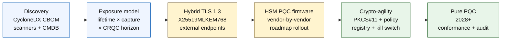

# Indeks Perbankan Aman-Kuantum 2026: PQC, QKD, Crypto-Agility, dan Risiko Harvest-Now-Decrypt-Later

<!-- lead-start: manual -->
<aside class="post-lead" aria-label="Ringkasan artikel">

<strong>TL;DR.</strong> Perbankan aman-kuantum pada 2026 adalah program pengiriman dengan tenggat yang ditentukan oleh perpotongan dua kurva — umur kerahasiaan data yang dipegang lembaga hari ini, dan horizon kedatangan Cryptographically Relevant Quantum Computer (CRQC). NIST FIPS 203 / 204 / 205 sudah final sejak Agustus 2024; CNSA 2.0 menetapkan end-state federal AS pada 2033; harvest-now-decrypt-later sudah berlangsung pada data berumur panjang. Quantum Scorecard tingkat dewan melacak empat persentase eksak: kelengkapan inventaris, eksposur HNDL, progres migrasi NIST, kesiapan crypto-agility.

<strong>Poin utama</strong>

<ul class="post-lead-takeaways">
  <li><strong>Perdebatan algoritma tutup pada 13 Agustus 2024.</strong> ML-KEM (FIPS 203), ML-DSA (FIPS 204), SLH-DSA (FIPS 205) adalah jawabannya. Bank yang masih menjalankan evaluasi internal untuk "memilih pemenang" sudah tertinggal 18 bulan.</li>
  <li><strong>Harvest-now-decrypt-later sudah berlaku.</strong> Segala sesuatu dengan umur kerahasiaan melewati kedatangan CRQC yang kredibel — KPR 30 tahun, underwriting asuransi jiwa, rekaman transaksi MiFID II / GDPR, arsip retensi M&amp;A — harus pindah ke enkapsulasi kunci hibrida aman-kuantum sekarang, bukan ketika CRQC diumumkan.</li>
  <li><strong>Inventaris adalah pintu kematangan.</strong> Cryptographic Bill of Materials (CBOM) — protokol, library, sertifikat, partisi HSM, dependensi vendor, pemilik aplikasi, umur klasifikasi data — adalah prasyarat untuk semua langkah berikutnya. Lacak kesegaran, bukan cakupan.</li>
  <li><strong>TLS 1.3 hibrida adalah deployment 2026.</strong> Hybrid key share X25519MLKEM768 adalah yang sebenarnya dinegosiasikan Chrome / Firefox / Cloudflare / Akamai hari ini. TLS ML-KEM murni menunggu firmware HSM dan kesiapan CA.</li>
  <li><strong>Crypto-agility adalah deliverable yang tahan lama.</strong> Abstraksi PKCS#11, kunci berlabel, policy registry yang memetakan layanan bisnis ke himpunan algoritma yang diizinkan. Tanpa itu, transisi algoritma berikutnya menjadi program multi-tahun lagi.</li>
</ul>
</aside>
<!-- lead-end -->

Perbankan aman-kuantum pada 2026 adalah soal migrasi operasional, bukan spekulasi. NIST telah memfinalisasi tiga standar kriptografi pasca-kuantum pertama, dan bank kini wajib memahami sistem mana saja yang bergantung pada RSA, ECC, TLS, tanda tangan, HSM, sertifikat, kanal pembayaran, arsip, dan data rahasia berumur panjang. Pertanyaan indeksnya sederhana: dapatkah lembaga mengganti kriptografi sebelum ancamannya menjadi operasional?

---

> **Ringkasan Eksekutif / Poin Utama**
>
> - **Standar NIST kini konkret.** FIPS 203 menetapkan ML-KEM untuk enkapsulasi kunci, FIPS 204 menetapkan ML-DSA untuk tanda tangan, dan FIPS 205 menetapkan SLH-DSA sebagai standar tanda tangan berbasis hash tanpa state.
> - **Inventaris adalah pintu kematangan pertama.** Bank tidak bisa memigrasi apa yang tidak bisa ia temukan: sertifikat, kunci, protokol, aplikasi, vendor, HSM, API, arsip, dan embedded system harus dipetakan.
> - **Crypto-agility adalah tujuan yang tahan lama.** Tujuannya bukan pertukaran algoritma sekali pakai; tujuannya adalah kemampuan mengganti primitif kriptografi tanpa mendesain ulang seluruh aplikasi.
> - **Data berumur panjang mengubah urgensi.** Risiko harvest-now-decrypt-later berarti data yang ditangkap hari ini bisa dapat dibaca kemudian jika ia tetap berharga cukup lama.
> - **QKD adalah pelengkap khusus.** Quantum key distribution mungkin relevan untuk kanal bernilai tertinggi, tetapi tidak menggantikan migrasi PQC di seluruh lembaga.
>
---

## Mengapa 2026 Tahun Indeks Ini Penting

Tiga pergeseran pada 2024-2025 membuat aman-kuantum menjadi program bank yang dapat diukur, bukan sekadar pengamatan riset. Pertama, NIST memfinalisasi standar pasca-kuantum utama pada 13 Agustus 2024: [FIPS 203 (ML-KEM) ⧉](https://nvlpubs.nist.gov/nistpubs/FIPS/NIST.FIPS.203.pdf "FIPS 203 — Module-Lattice-Based Key-Encapsulation Mechanism"), [FIPS 204 (ML-DSA) ⧉](https://nvlpubs.nist.gov/nistpubs/FIPS/NIST.FIPS.204.pdf "FIPS 204 — Module-Lattice-Based Digital Signature Standard"), [FIPS 205 (SLH-DSA) ⧉](https://nvlpubs.nist.gov/nistpubs/FIPS/NIST.FIPS.205.pdf "FIPS 205 — Stateless Hash-Based Digital Signature Standard"). Perdebatan pemilihan algoritma tutup pada tanggal itu; bank yang masih menjalankan workstream internal "skema mana yang menang" pada 2026 sudah tertinggal 18 bulan.

Kedua, [CNSA 2.0 milik NSA ⧉](https://media.defense.gov/2022/Sep/07/2003071834/-1/-1/0/CSA_CNSA_2.0_ALGORITHMS_.PDF "Commercial National Security Algorithm Suite 2.0") menetapkan end-state federal AS pada 2033 dengan cutoff antara mulai 2027 untuk penandatanganan perangkat lunak dan firmware, 2030 untuk peramban dan sistem operasi. Setiap bank yang punya eksposur kontraparti federal AS — FedNow, operasi Treasury, akun nasabah federal — berada di dalam perimeter itu untuk sistem yang menyentuh data federal. Jamnya tidak lagi abstrak.

Ketiga, [Harvest-Now-Decrypt-Later (HNDL) ⧉](https://csrc.nist.gov/Projects/post-quantum-cryptography "Program Post-Quantum Cryptography NIST") adalah argumen risiko penopang urgensi. Adversary canggih sudah menangkap pesan pembayaran berlindung TLS, amplop SWIFT, dokumentasi KYC, dan ciphertext arsip berumur panjang di pusat keuangan utama. Data yang ditangkap pada 2026 hanya perlu tetap sensitif-kerahasiaan saat dekripsi terjadi — untuk KPR 30 tahun, underwriting asuransi jiwa, rekaman transaksi MiFID II / GDPR, dan arsip retensi M&A, jendela itu meluas jauh melewati setiap estimasi kredibel untuk Cryptographically Relevant Quantum Computer (CRQC). Adversary tidak butuh komputer kuantum hari ini. Ia butuh satu sebelum datanya berhenti berarti.

Indeks Perbankan Aman-Kuantum mengukur apakah lembaga Anda dapat menyelesaikan migrasi sebelum perpotongan itu tiba. Pekerjaannya bukan lagi soal apakah harus migrasi; melainkan apakah migrasi selesai pada garis waktu yang dapat dipertahankan.

## Arsitektur Indeks 2026

| Lapisan Indeks | Arah 2026 | Metrik Kesiapan | Risiko jika Salah Tangani |
|---|---|---|---|
| **Inventaris** | Memetakan aset, protokol, sertifikat, vendor, dan kelas data kriptografi | Persentase estate yang terinventarisasi | Dependensi rentan-kuantum yang tidak diketahui |
| **Eksposur** | Mengklasifikasikan sistem menurut umur kerahasiaan dan kekritisan transaksi | Aset berisiko tinggi menurut nilai dan umur | Migrasi salah prioritas |
| **Migrasi** | Mengadopsi pola hibrida dan siap-PQC selaras dengan standar NIST | Kesiapan ML-KEM dan ML-DSA | Re-platforming darurat di bawah tenggat |
| **Crypto-agility** | Memisahkan logika aplikasi dari primitif kriptografi | Cakupan kripto yang dikendalikan kebijakan | Algoritma hard-coded di seluruh estate |
| **Jaminan** | Menguji interoperabilitas, performa, dukungan HSM, sertifikat, dan kesiapan vendor | Tingkat lulus uji dan backlog pengecualian | Kanal rusak atau kontrol fallback lemah |

### Quantum Scorecard Tingkat Dewan

Scorecard kesiapan kuantum yang kredibel mengharuskan pelacakan persentase eksak, bukan sekadar status proyek:

1. **Kelengkapan Inventaris:** Persentase aplikasi tier-1 dengan Cryptographic Bill of Materials (CBOM) yang terpetakan penuh.
2. **Eksposur HNDL:** Volume data rahasia berumur panjang (mis. PII, rahasia dagang) yang ditransmisikan lewat jaringan tanpa enkapsulasi kunci hibrida aman-kuantum.
3. **Progres Migrasi NIST:** Persentase kunci enkripsi asimetris dan tanda tangan digital yang sudah dimigrasi ke standar FIPS 203 (ML-KEM) dan FIPS 204 (ML-DSA).
4. **Kesiapan Crypto-Agility:** Persentase sistem kritis di mana algoritma kriptografi dapat dirotasi lewat kebijakan terpusat tanpa rekompilasi kode.

## Sinyal Terkini untuk Dilacak

| Sinyal | Artinya bagi Bank | Sumber |
|---|---|---|
| **FIPS 203 ML-KEM** | Standar NIST utama untuk pendirian kunci enkripsi umum | [NIST ⧉](https://www.nist.gov/news-events/news/2024/08/nist-releases-first-3-finalized-post-quantum-encryption-standards "Tiga standar enkripsi pasca-kuantum final pertama") |
| **FIPS 204 ML-DSA** | Standar NIST utama untuk tanda tangan digital | [NIST ⧉](https://www.nist.gov/news-events/news/2024/08/nist-releases-first-3-finalized-post-quantum-encryption-standards "Tiga standar enkripsi pasca-kuantum final pertama") |
| **FIPS 205 SLH-DSA** | Alternatif tanda tangan berbasis hash dan desain cadangan | [NIST ⧉](https://www.nist.gov/news-events/news/2024/08/nist-releases-first-3-finalized-post-quantum-encryption-standards "Tiga standar enkripsi pasca-kuantum final pertama") |
| **Integrasi segera dianjurkan** | NIST secara eksplisit memberi tahu administrator untuk mulai mengintegrasikan standar karena integrasi penuh butuh waktu | [NIST ⧉](https://www.nist.gov/news-events/news/2024/08/nist-releases-first-3-finalized-post-quantum-encryption-standards "Tiga standar enkripsi pasca-kuantum final pertama") |
| **Program kuantum bank bertambah** | Bank besar mengeksplorasi teknologi kuantum sambil menyiapkan transisi PQC | [Quantum Insider ⧉](https://thequantuminsider.com/2026/03/27/15-plus-global-banks-probing-the-wonderful-world-of-quantum-technologies/ "Tinjauan bank global yang mengeksplorasi teknologi kuantum") |

## Migrasi Dimulai dari Buku Besar Kriptografi

Urutan migrasi sudah dipahami dengan baik saat ini. Setiap gate menghasilkan bukti yang menggerakkan gate berikutnya; melewati atau memampatkan gate adalah yang menghasilkan risiko re-platforming darurat yang muncul di kolom kegagalan Arsitektur Indeks.

Deliverable pertama bukanlah algoritma baru; melainkan cryptographic bill of materials (CBOM). Bank membutuhkan inventaris hidup yang menghubungkan layanan bisnis ke algoritma, library, sertifikat, panjang kunci, HSM, umur data, vendor, dan pemilik operasional. Tanpa buku besar itu, migrasi aman-kuantum menjadi tebak-tebakan.

Set rekaman CBOM harus mencatat, untuk tiap primitif kriptografi: protokol atau antarmuka (TLS 1.3, IPsec, SSH, format pesan pembayaran khusus), algoritma dan parameter (RSA-2048, ECDH P-256, ML-KEM-768, ML-DSA-65), library dan versi (OpenSSL 3.4, hash commit BoringSSL, build SDK vendor), batas perangkat keras (partisi HSM, TPM, secure enclave, atau tidak ada), identitas sertifikat jika berlaku, pemilik aplikasi, dan umur klasifikasi data. Tooling yang masuk produksi pada 2025-2026 — IBM Quantum Safe Inventory, [spesifikasi CycloneDX CBOM ⧉](https://cyclonedx.org/capabilities/cbom/ "CycloneDX Cryptography Bill of Materials") sumber terbuka, scanner enterprise dari CryptoNext / Sandbox / PQShield — terintegrasi ke pipeline CMDB yang ada. Tidak satu pun yang lengkap sendirian; harapkan siklus pembangunan CBOM 12-18 bulan bahkan dengan tooling vendor dan headcount khusus.

Metrik yang dilacak adalah kesegaran, bukan cakupan. CBOM yang sudah dua bulan tidak diperbarui lebih buruk daripada tidak ada CBOM sama sekali karena memberi tim keamanan keyakinan palsu tentang apa yang sudah dimigrasi.

## Hibrida Dulu, Selalu Agile

Sebagian besar bank tidak akan mengganti semuanya sekaligus. Pola realistis adalah deployment hibrida, di mana mekanisme klasik dan pasca-kuantum berjalan bersama sementara vendor, protokol, sertifikat, dan tooling operasional matang. Target jangka panjang adalah crypto-agility: pilihan kriptografi yang dikendalikan kebijakan dan dapat diubah tanpa membangun ulang aplikasi bisnis.

[Sisipkan Komponen Interaktif: Kalkulator Risiko Harvest-Now-Decrypt-Later (HNDL) — alat berbasis slider di mana eksekutif memasukkan shelf-life data vs. estimasi garis waktu kuantum untuk melihat jendela eksposur mereka.]

> **Wawasan utama:** Jika data Anda perlu tetap rahasia selama 10 tahun, dan Cryptographically Relevant Quantum Computer (CRQC) masih 7 tahun lagi, tenggat migrasi Anda bukan 7 tahun lagi — melainkan 3 tahun yang lalu.

Dalam praktiknya ini berarti TLS 1.3 dengan hybrid key share `X25519MLKEM768` untuk endpoint yang menghadap luar (Chrome / Firefox / Cloudflare / Akamai semua mendukung ini hari ini), rantai tanda tangan klasik sampai infrastruktur HSM dan CA mengejar, serta lapisan abstraksi PKCS#11 yang memungkinkan policy registry merotasi algoritma tanpa merekompilasi aplikasi bisnis. Crypto-agility adalah yang menentukan apakah transisi algoritma berikutnya (kapan, bukan jika) menjadi rotasi enam minggu atau program tujuh tahun lagi.

## Posisi QKD

Quantum key distribution masuk ke dalam indeks sebagai opsi kanal sensitivitas tinggi, terutama untuk infrastruktur pasar keuangan, konektivitas bank sentral, dan aliran institusional yang sangat sensitif. Ia harus diperlakukan sebagai pelengkap PQC, bukan alasan untuk menunda migrasi tingkat enterprise.

## Apa Artinya per Jenis Bank

### Bank Sistemik Global

Masalah berat di sini adalah skala: puluhan ribu endpoint TLS, ratusan partisi HSM, lusinan certificate authority internal, ratusan aplikasi bisnis dengan primitif kriptografi tertanam, dan SDK vendor yang tidak bisa dimodifikasi bank. Investasinya bukan pilot lagi; melainkan tooling CBOM, lapisan abstraksi PKCS#11 yang ditanamkan ke setiap build baru, rencana konsolidasi HSM yang memilih satu vendor untuk memimpin firmware PQC dan menerima ekor multi-tahun pada yang lain, serta policy registry yang menjadi permukaan crypto-agility tahan lama jauh setelah migrasi FIPS 203 / 204 / 205 selesai.

### Bank Transaksi dan Korporasi

Cakupan migrasinya lebih sempit daripada di tier G-SIB tetapi eksposur HNDL-nya akut: pesan lintas-batas SWIFT, data pembayaran terstruktur yang membawa PII kontraparti korporasi, platform pertukaran dokumen yang menyimpan dokumentasi trade finance, dan arsip pelaporan retensi panjang. Prioritaskan TLS hibrida pada setiap endpoint yang menghadap nasabah dan PQC at rest untuk arsip retensi. Dorong akuntabilitas vendor HSM — tim platform corporate banking punya daya tawar pengadaan langsung yang sering tidak dimiliki tim wholesale technology.

### Bank Regional

Beli tumpukan vendor yang sudah memiliki primitif crypto-agility. Pilih platform core banking yang vendor-nya menerbitkan CBOM dan berkomitmen pada garis waktu dukungan ML-KEM / ML-DSA. Validasi roadmap HSM vendor selaras dengan tenggat migrasi bank. Kapasitas engineering yang dibutuhkan untuk membangun crypto-agility dari nol bersifat multi-tahun; vendor membayar biaya itu di banyak pelanggan dan bank mewarisi manfaatnya. Pekerjaan validasi — memeriksa klaim vendor bertahan terhadap proses MRM lembaga — adalah cakupan internal yang sah.

### Fintech, PSP, dan Penyedia Infrastruktur

Pertanyaan kompetitif untuk vendor yang menjual ke bank pada 2026 bukan "apakah Anda mendukung PQC." Tetapi "dapatkah Anda menghasilkan CycloneDX CBOM untuk platform Anda, matriks dukungan vendor HSM, dan SLA rotasi algoritma tertulis." Vendor yang menjawab ya akan lolos gate pengadaan tier-1 pada 2026-2027. Vendor yang tidak akan kehilangan siklus pembaruan kepada pesaing yang bisa.

## Kesimpulan

Perbankan aman-kuantum pada 2026 bukan pengamatan riset; ia adalah program pengiriman dengan tenggat yang ditentukan oleh perpotongan dua kurva — umur kerahasiaan data yang dipegang lembaga hari ini, dan horizon kedatangan Cryptographically Relevant Quantum Computer. Lembaga yang tampak kredibel bagi regulator dan kontraparti pada 2030 adalah yang mulai membangun CBOM pada 2024, men-deploy TLS hibrida di setiap endpoint eksternal pada akhir 2026, dan merekayasa crypto-agility ke setiap build baru sejak hari pertama. Lembaga yang tidak akan menemukan apakah jendela migrasi mereka sudah tertutup untuk data yang sedang dipanen adversary hari ini.

Ukur migrasi seperti Anda mengukur program operasional mana pun: cakupan diketahui, urutan diprioritaskan, tenggat dikomitmenkan, register pengecualian jujur. Semakin teliti Anda menatap estate Anda sendiri, semakin sempit jendela migrasi itu terasa.

## Pertanyaan yang Sering Diajukan

**Apa yang harus diinventarisasi bank lebih dulu?**

Mulailah dengan TLS yang terekspos eksternal, kanal pembayaran, autentikasi nasabah, konektivitas antarbank, layanan ber-HSM, arsip jangka panjang, dan sistem yang menangani data rahasia dengan umur pakai panjang.

**Apakah PQC hanya isu cybersecurity?**

Tidak. Ia memengaruhi pembayaran, identitas, bukti hukum, penandatanganan transaksi, kepercayaan nasabah, retensi data, manajemen vendor, dan ketahanan operasional.

**Apa arti crypto-agility?**

Crypto-agility berarti kemampuan mengganti primitif kriptografi melalui kebijakan dan kontrol platform, bukan perubahan aplikasi yang hard-coded.

**Apakah bank harus menunggu standar lebih lanjut?**

Tidak. NIST mendorong administrator untuk mulai mengintegrasikan standar final pertama karena integrasi penuh butuh waktu.

## Referensi

- NIST, (2026). [Tiga standar enkripsi pasca-kuantum final pertama ⧉](https://www.nist.gov/news-events/news/2024/08/nist-releases-first-3-finalized-post-quantum-encryption-standards "Tiga standar enkripsi pasca-kuantum final pertama").

<!-- enrich-start -->
<aside class="author-card" aria-label="Tentang penulis"><strong class="author-card-name"><a href="/about/index.html">Sebastien Rousseau</a></strong>Teknolog perbankan senior yang menulis tentang AI terapan, infrastruktur pembayaran, uang tertokenisasi, ISO 20022, keamanan pasca-kuantum, layanan keuangan cloud-native, dan pasar digital teregulasi.Lebih dari 20 tahun pengalaman di HSBC Commercial &amp; Investment Bank, PayPal, Barclays, Shazam, AKQA, Virgin Group. <a href="/about/index.html">Profil lengkap</a> &middot; <a href="https://www.linkedin.com/in/sebastienrousseau/" rel="external noopener">LinkedIn</a> &middot; <a href="https://github.com/sebastienrousseau" rel="external noopener">GitHub</a></aside>

Terakhir ditinjau <time datetime="2026-06-04">2026-06-04</time>.

<!-- enrich-end -->
</content>
</invoke>
