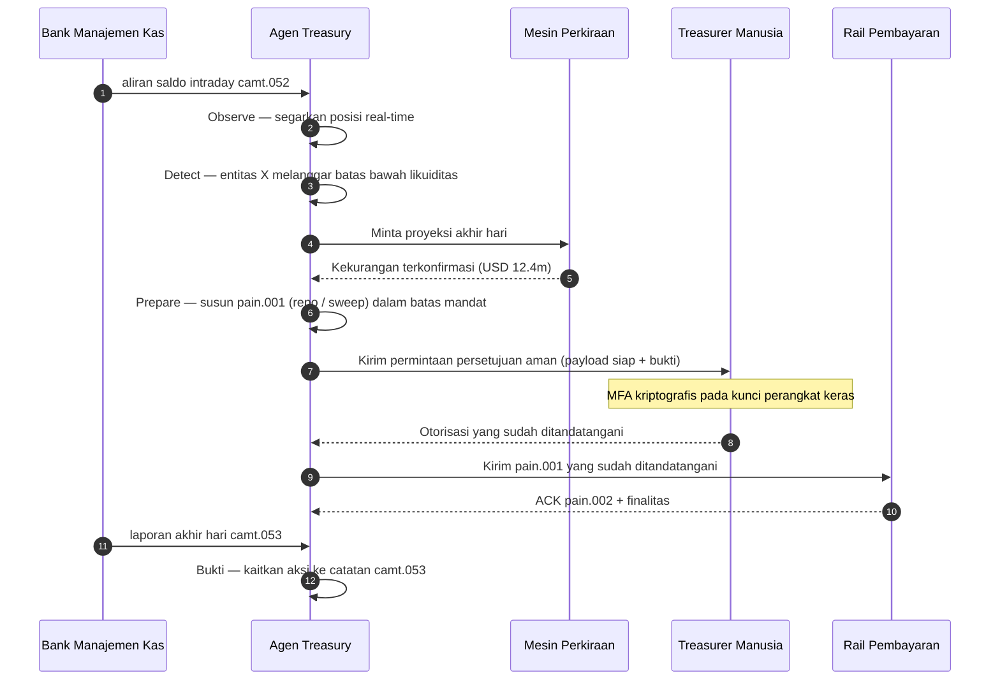

# Indeks Treasury Otonom 2026: Treasury Agentik, Likuiditas Terprogram, Simpanan Tertokenisasi, dan Kontrol Kas Real-Time

<!-- lead-start -->
<aside class="post-lead" aria-label="Ringkasan artikel">

<strong>Ringkasan.</strong> Indeks treasury otonom 2026 — mengukur alur kerja agentik, cakupan likuiditas terprogram, integrasi simpanan tertokenisasi, orkestrasi pembayaran real-time, dan kontrol kas otomatis sebagai satu model operasi.

<strong>Poin utama</strong>

<ul class="post-lead-takeaways">
  <li><strong>Treasury menjadi sistem operasi real-time.</strong> Perkiraan kas statis dan sweep batch bukan lagi satuan ukuran; alur kerja agentik yang berjalan di atas data real-time-lah yang menggantikannya.</li>
  <li><strong>Likuiditas terprogram kini layak diterapkan.</strong> Simpanan tertokenisasi + rail real-time menjadikan penyediaan likuiditas per-kejadian sebagai primitif alur kerja, bukan inisiatif kuartalan.</li>
  <li><strong>Simpanan tertokenisasi adalah uang digital pilihan treasurer.</strong> Ekonomi uang bank, kemampuan diprogram, dan kepastian intraday — tanpa pertanyaan risiko penerbit dan cadangan seperti pada stablecoin.</li>
  <li><strong>Control plane adalah permukaan audit yang baru.</strong> Mandat, batas, jalur override manual, dan bukti pembalikan harus berjalan sebagai primitif platform, bukan persetujuan manual per-aksi.</li>
  <li><strong>Scorecard CFO adalah per-keputusan, bukan per-kuartal.</strong> Biaya kas, pengurangan buffer likuiditas intraday, efisiensi FX, dan akurasi perkiraan kas diukur pada kecepatan alur kerja.</li>
</ul>

<strong>Bacaan terkait:</strong> <a href="https://sebastienrousseau.com/2026-05-25-programmable-liquidity-ai-tokenised-deposits-real-time-treasury-2026/index.html">Likuiditas Terprogram 2026: AI, Simpanan Tertokenisasi, dan Orkestrasi Treasury Real-Time</a>, <a href="https://sebastienrousseau.com/2026-05-21-tokenised-deposits-banking-services-status-2026/index.html">Simpanan Tertokenisasi 2026: Layanan Perbankan, Persaingan Stablecoin, dan Status Uang Bank Komersial yang Dapat Diprogram</a>.

</aside>
<!-- lead-end -->

Treasury otonom adalah titik temu alami antara AI agentik, pembayaran wholesale, simpanan tertokenisasi, dan likuiditas real-time. Pada 2026, arsitektur treasury terbaik tidak akan sekadar memperkirakan kas; mereka akan merekomendasikan, menjelaskan, dan pada akhirnya mengeksekusi aksi likuiditas yang dibatasi mandat lintas rekening, mata uang, rail, dan aset penyelesaian.

---

> **Ringkasan Eksekutif / Poin Utama**
>
> - **Treasury bergeser dari pelaporan ke kontrol.** Saldo real-time, perkiraan kas, status pembayaran, dan pergerakan likuiditas menjadi bagian dari satu alur kerja.
> - **AI agentik menciptakan antarmuka treasury yang baru.** Agen dapat memantau posisi, memunculkan anomali, menyiapkan aksi pendanaan, dan mengeskalasi keputusan dalam mandat yang ditentukan.
> - **Uang yang dapat diprogram mengubah sisi kas.** Simpanan tertokenisasi dan eksperimen CBDC wholesale membuka kemungkinan baru untuk penyelesaian atomik, pembayaran bersyarat, dan likuiditas selalu-aktif.
> - **Indeks harus mengukur otoritas.** Pertanyaannya bukan apakah agen dapat menyarankan suatu aksi; melainkan apakah otoritas, batas, persetujuan, dan bukti sudah jelas.
> - **Nilai treasury dapat diukur.** Likuiditas yang dihemat, investigasi manual yang berkurang, kegagalan penyelesaian yang dihindari, dan modal kerja yang dibebaskan harus mendefinisikan keberhasilan.
>
---

## Mengapa 2026 Adalah Tahun Indeks Ini Menjadi Penting

Stanford AI Index berguna karena memperlakukan bidang teknologi yang bergerak cepat sebagai sesuatu yang dapat diukur: output riset, kinerja teknis, penerapan yang bertanggung jawab, ekonomi, adopsi sektor, kebijakan, dan sentimen publik dirangkum dalam satu kerangka ([Stanford HAI ⧉](https://hai.stanford.edu/ai-index/2026-ai-index-report "Laporan AI Index 2026")). Bank dan institusi keuangan kini memerlukan disiplin serupa untuk infrastruktur. AI agentik, keamanan tahan-kuantum, ketahanan cloud-native, dan pembayaran wholesale bukan lagi jalur inovasi yang terpisah; mereka berkonvergensi menjadi satu model operasi.

Pertanyaan praktis bagi sebuah bank bukanlah apakah setiap domain itu penting. Pertanyaannya adalah apakah institusi dapat mengukur kesiapan di semuanya secara bersamaan. Sebuah bank dapat menerapkan AI agentik dan tetap rapuh jika kriptografinya belum siap-migrasi. Bank dapat memodernisasi platform cloud dan tetap gagal jika data pembayaran tetap tidak terstruktur. Bank dapat menjalankan uji coba tokenisasi dan tetap menciptakan risiko sistemik jika lapisan penyelesaian, likuiditas, identitas, dan audit tidak dirancang bersama.

## Arsitektur Indeks 2026

| Lapisan Indeks | Arah 2026 | Metrik Kesiapan | Risiko jika Salah Kelola |
|---|---|---|---|
| **Visibilitas** | Menyatukan data rekening, pembayaran, likuiditas, dan eksposur | Cakupan posisi kas real-time | Visibilitas kas yang terfragmentasi |
| **Perkiraan Kas** | Menggunakan AI untuk memperkirakan saldo, arus, dan kebutuhan pendanaan | Akurasi perkiraan kas dan tingkat pengecualian | Kepercayaan palsu pada data yang lemah |
| **Otonomi** | Memberi agen otoritas yang dibatasi untuk rekomendasi dan aksi | Cakupan mandat dan kualitas persetujuan | Aksi yang tidak sah atau tidak dijelaskan |
| **Kemampuan Diprogram** | Menggunakan simpanan tertokenisasi dan kondisi pintar di mana memberikan nilai | Kasus penggunaan pembayaran bersyarat dan penyelesaian atomik | Uji coba treasury yang dipimpin teknologi |
| **Kontrol** | Menanamkan batas, sanksi, FX, likuiditas, dan kontrol audit | Bukti kontrol per aksi treasury | Tata kelola manual setelah eksekusi |

## Sinyal Terkini yang Harus Dipantau

| Sinyal | Apa Artinya bagi Bank | Sumber |
|---|---|---|
| **Adopsi AI agentik 52% di jasa keuangan** | Treasury kini dapat menyerap alur kerja agentik melalui platform yang tata kelolanya jelas | [Cambridge CCAF ⧉](https://www.jbs.cam.ac.uk/faculty-research/centres/alternative-finance/publications/2026-global-ai-in-financial-services-report/ "Laporan Global AI di Jasa Keuangan 2026") |
| **Pembayaran bersyarat Project Agorá** | Tokenisasi dapat memungkinkan kemampuan pembayaran bersyarat dan selalu-aktif | [BIS ⧉](https://www.bis.org/about/bisih/topics/fmis/agora.htm "Project Agorá") |
| **Bank of England — Digital Securities Sandbox** | Obligasi dan ekuitas yang diterbitkan via DLT diselesaikan secara Penyerahan terhadap Pembayaran (DvP) — sisi aset dan sisi kas (CBDC wholesale atau simpanan bank komersial tertokenisasi) diselesaikan dalam transaksi atomik yang sama, menghilangkan risiko rekanan pokok | [Bank of England ⧉](https://www.bankofengland.co.uk/financial-stability/digital-securities-sandbox "Digital Securities Sandbox") |
| **Tenggat alamat terstruktur SWIFT** | Data treasury harus ditangkap dengan benar di sumbernya | [SWIFT ⧉](https://www.swift.com/news-events/news/iso-20022-milestone-november-2026-unstructured-addresses-be-removed "Tonggak alamat terstruktur ISO 20022 November 2026") |
| **FI besar kesulitan mengukur nilai AI** | Otomatisasi treasury memerlukan metrik ekonomi yang keras | [Cambridge CCAF ⧉](https://www.jbs.cam.ac.uk/faculty-research/centres/alternative-finance/publications/2026-global-ai-in-financial-services-report/ "Laporan Global AI di Jasa Keuangan 2026") |

## Mandat Agen Treasury

Agen treasury tidak boleh dirancang sebagai asisten serbaguna. Ia memerlukan mandat: mengamati rekening, mendeteksi pengecualian, memperkirakan kebutuhan pendanaan, menyiapkan aksi, meminta persetujuan, mengeksekusi dalam batas, dan menghasilkan bukti. Setiap langkah harus memiliki model otoritas yang berbeda.

Loop kontrol berjalan Observe → Detect → Forecast → Prepare → Request Approval — lalu berhenti. Agen tidak pernah melewati batas otorisasi kriptografis sendirian. Diagram di bawah menelusuri satu siklus penuh: kekurangan likuiditas intraday bernilai jutaan dolar muncul dalam telemetri `camt.052`, agen memperkirakan posisi akhir hari, menyiapkan repo atau sweep antar-entitas sebagai `pain.001` yang sudah lengkap, dan menyerahkannya kepada treasurer manusia untuk penandatanganan kriptografis multi-faktor pada kunci yang terikat perangkat keras. Agen kemudian mengirimkan payload yang sudah ditandatangani; finalitas tiba sebagai ACK `pain.002` dan `camt.053` resmi berikutnya.

Batas itulah intinya — setiap aksi yang menggerakkan uang sungguhan berada di balik gerbang kriptografis yang tidak dapat dipenuhi agen sendirian.

## Likuiditas Terprogram

Likuiditas terprogram adalah kemampuan memindahkan nilai dalam kondisi tertentu: jika ambang batas terlampaui, jika agunan memenuhi syarat, jika rekanan lolos penyaringan, jika finalitas penyelesaian tersedia, atau jika buffer likuiditas intraday terlalu rendah. Simpanan tertokenisasi dan platform penyelesaian wholesale menjadikan pola-pola ini lebih praktis.

Dapat-diprogram bukan berarti keluar dari standar. Jalur eksekusinya adalah `pain.001` — ISO 20022 Customer Credit Transfer Initiation. Aksi yang disiapkan agen adalah payload `pain.001` yang sudah lengkap, dialirkan ke bank melalui kanal yang sama yang akan dipakai ERP korporat, divalidasi terhadap skema yang sama, dinilai oleh mesin penipuan dan sanksi yang sama, dan diakui pada laporan status `pain.002` yang sama. Lapisan kondisionalitas (ambang batas, kelayakan agunan, ketersediaan finalitas, batas bawah buffer) berada di atas pesan — ia menggerbangi *apakah* sebuah `pain.001` dikirim, bukan *bentuk seperti apa* yang diambilnya. Platform treasury yang menciptakan payload khusus untuk mengekspresikan kondisi akan terlempar dari jalur yang dapat dikonsumsi bank dan kembali ke integrasi bilateral.

## Control Room Treasury

Model operasi seharusnya terlihat seperti control room: posisi, perkiraan kas, status pembayaran, penggunaan batas, pengecualian, persetujuan, dan bukti dalam satu antarmuka. Indeks harus menghukum tumpukan treasury yang mengharuskan tim merangkai email, spreadsheet, portal bank, dan dasbor yang tidak terhubung.

Bidang data di balik antarmuka itu adalah manajemen kas ISO 20022. Posisi intraday adalah `camt.052` — Bank-to-Customer Account Report — dialirkan dari setiap bank manajemen kas ke lapisan observasi agen pada frekuensi yang dipublikasikan bank (menit untuk penyedia GTB tier-1, akhir-siklus untuk long tail). Rekonsiliasi akhir hari adalah `camt.053` — Bank-to-Customer Statement — catatan yang dapat diaudit di mana perkiraan agen dinilai pada pagi berikutnya. Platform treasury yang membaca laporan PDF atau melakukan screen-scrape portal bank tidak dapat memenuhi 「Level 4」 dari indeks ini; telemetri intraday harus tiba sebagai `camt.052` terstruktur agar loop perkiraan dapat menutup tepat waktu untuk bertindak.

## Apa Artinya Berdasarkan Jenis Bank

### Bank Penting Sistemik Global

Bank global seharusnya memperlakukan indeks ini sebagai scorecard arsitektur perusahaan. Prioritasnya bukan proof of concept lain; melainkan bukti bahwa alur kerja otonom, migrasi kriptografi, ketergantungan cloud, dan modernisasi pembayaran dapat dikelola sebagai satu sistem risiko dan nilai.

### Bank Transaksi dan Bank Korporat

Bank transaksi seharusnya berfokus pada pembayaran wholesale, data terstruktur, likuiditas, simpanan tertokenisasi, dan layanan treasury agentik. Proposisi klien yang paling berharga bukan sekadar pergerakan uang yang lebih cepat; melainkan pergerakan uang yang dapat dijelaskan, diaudit, dan diprogram dengan investigasi yang lebih sedikit dan visibilitas modal kerja yang lebih baik.

### Bank Regional

Bank regional seharusnya menggunakan indeks ini untuk menghindari pembengkakan program. Mereka tidak perlu memimpin di setiap frontier, tetapi memerlukan posisi yang kredibel atas tata kelola AI, inventaris pasca-kuantum, bukti exit cloud, dan kesiapan data pembayaran.

### Fintech, PSP, dan Penyedia Infrastruktur

Fintech dan penyedia infrastruktur seharusnya menyelaraskan peta jalan produk mereka dengan kesiapan bank yang dapat diukur. Proposisi terbaik akan mengurangi risiko integrasi, memperkuat bukti, dan membuat infrastruktur yang kompleks lebih mudah ditata kelolakan oleh bank.

## Kesimpulan

Nilai dari laporan bergaya indeks adalah bahwa ia mengubah agenda teknologi yang terfragmentasi menjadi model operasi yang dapat diukur. Pada 2026, pemenang di infrastruktur keuangan bukanlah institusi dengan uji coba terbanyak. Mereka adalah institusi yang dapat membuktikan kesiapan di otonomi, keamanan, ketahanan, penyelesaian, ekonomi, dan tata kelola pada waktu yang sama.

## Pertanyaan yang Sering Diajukan

**Apa itu treasury otonom?**

Treasury otonom adalah penggunaan agen AI, data real-time, dan pembayaran yang dapat diprogram untuk memantau, merekomendasikan, dan berpotensi mengeksekusi aksi treasury dalam kontrol yang ditentukan.

**Apakah agen treasury boleh mengeksekusi pembayaran?**

Hanya dalam mandat yang sempit, batas yang kuat, persetujuan eksplisit, dan auditabilitas penuh. Otoritas eksekusi harus diraih melalui kematangan.

**Bagaimana simpanan tertokenisasi membantu treasury?**

Mereka dapat mendukung penyelesaian yang dapat diprogram, eksekusi atomik, dan berpotensi kontrol likuiditas intraday yang lebih baik sambil menjaga hubungan uang bank komersial.

**Apa langkah implementasi pertama?**

Bangun visibilitas real-time dan kualitas data sebelum memberikan otonomi. Agen tidak dapat mengoptimalkan dengan aman kas yang tidak dapat mereka lihat secara akurat.

## Referensi

- Cambridge Centre for Alternative Finance, (2026). [Laporan Global AI di Jasa Keuangan 2026 ⧉](https://www.jbs.cam.ac.uk/faculty-research/centres/alternative-finance/publications/2026-global-ai-in-financial-services-report/ "Laporan Global AI di Jasa Keuangan 2026").
- SWIFT, (2026). [Tonggak alamat terstruktur ISO 20022 November 2026 ⧉](https://www.swift.com/news-events/news/iso-20022-milestone-november-2026-unstructured-addresses-be-removed "Tonggak alamat terstruktur ISO 20022 November 2026").
- BIS Innovation Hub, (2026). [Project Agorá ⧉](https://www.bis.org/about/bisih/topics/fmis/agora.htm "Project Agorá").
- Bank of England, (2026). [Membentuk masa depan keuangan digital Inggris ⧉](https://www.bankofengland.co.uk/speech/2025/january/sasha-mills-speech-at-the-tokenisation-summit "Membentuk masa depan keuangan digital Inggris").

<!-- enrich-start -->
<aside class="author-card" aria-label="Tentang penulis"><strong class="author-card-name"><a href="/about/index.html">Sebastien Rousseau</a></strong>Teknolog perbankan senior yang menulis tentang AI terapan, infrastruktur pembayaran, uang yang ditokenisasi, ISO 20022, keamanan pasca-kuantum, layanan keuangan cloud-native, dan pasar digital teregulasi.Lebih dari 20 tahun pengalaman di HSBC Commercial &amp; Investment Bank, PayPal, Barclays, Shazam, AKQA, Virgin Group. <a href="/about/index.html">Profil lengkap</a> &middot; <a href="https://www.linkedin.com/in/sebastienrousseau/" rel="external noopener">LinkedIn</a> &middot; <a href="https://github.com/sebastienrousseau" rel="external noopener">GitHub</a></aside>

Terakhir ditinjau <time datetime="2026-06-07">2026-06-07</time>.

<!-- enrich-end -->
