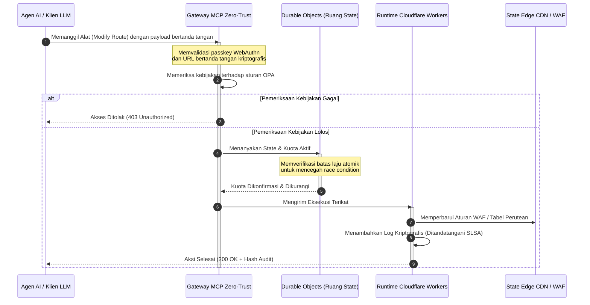

---

# Front Matter (YAML)

author: "contact@sebastienrousseau.com (Sebastien Rousseau)"
banner_alt: "Tumpukan rak data centre yang bersinar di malam hari — melambangkan edge open source yang dapat diperiksa dan dikendalikan agen yang menjadi dasar CloudCDN"
banner_height: "1597"
banner_width: "2584"
banner: "https://cloudcdn.pro/stocks/images/alis-po-IdVNRv-5wJo.webp"
cdn: "https://cloudcdn.pro"
charset: "UTF-8"
cname: "sebastienrousseau.com"
copyright: "© Hak Cipta 2025 - 2026 - Sebastien Rousseau. Seluruh hak cipta dilindungi."
date: "June 11, 2026"
description: "CloudCDN mengubah CDN menjadi bidang kontrol edge yang dapat dikendalikan agen — gateway MCP zero-trust, Durable Objects, SLSA Level 3, bukti siap DORA."
format-detection: "telephone=no"
hreflang: "id"
icon: "https://cloudcdn.pro/clients/sebastienrousseau/v1/logos/sebastienrousseau.svg"
id: "https://sebastienrousseau.com/id/2026-06-11-cloudcdn-open-source-blueprint-ai-native-edge-2026"
image_alt: "Potret Hitam Putih Sebastien Rousseau"
image_height: "162"
image_width: "162"
image: "https://cloudcdn.pro/stocks/images/sebastienrousseau.webp"
keywords: "CloudCDN, edge AI-native, CDN open source, MCP server, Cloudflare Workers, Durable Objects, zero trust, WebAuthn, signed URLs, SLSA Level 3, DORA, bidang kontrol edge"
language: "id"
last_reviewed: "2026-06-11"
layout: "report"
locale: "id_ID"
logo_alt: "Logo Sebastien Rousseau"
logo_height: "44"
logo_width: "44"
logo: "https://cloudcdn.pro/clients/sebastienrousseau/v1/logos/sebastienrousseau.svg"
menu: ""
measurementID: "G-169G4ET5HQ"
name: "Sebastien Rousseau"
permalink: "https://sebastienrousseau.com/id/2026-06-11-cloudcdn-open-source-blueprint-ai-native-edge-2026"
rating: "general"
referrer: "no-referrer"
robots: "index, follow"
schema: "FAQPage, Article"
seo_title: "CloudCDN: Blueprint Edge AI-Native Open Source"
short_name: "sebastienrousseau"
subtitle: "Memindahkan CDN global dari caching konten statis menuju bidang kontrol edge yang aman secara kriptografis dan dapat dikendalikan agen."
tags: "CloudCDN, open source, CDN, edge, agen AI, MCP, Cloudflare Workers, Durable Objects, pembatasan laju, zero trust, WebAuthn, SLSA, DORA, BCBS 239, Basel III, perbankan cloud native"
theme-color: "0, 83, 191"
title: "CloudCDN: Blueprint Open Source untuk Edge AI-Native di 2026"
url: "https://sebastienrousseau.com/id/2026-06-11-cloudcdn-open-source-blueprint-ai-native-edge-2026"
viewport: "width=device-width, initial-scale=1, shrink-to-fit=no"

# RSS - The RSS feed front matter (YAML).
atom_link: "https://sebastienrousseau.com/2026-06-11-cloudcdn-open-source-blueprint-ai-native-edge-2026/rss.xml"
category: "Teknologi"
docs: https://validator.w3.org/feed/docs/rss2.html
generator: "Static Site Generator (SSG) (version 0.0.26)"
item_description: "CloudCDN mengubah CDN menjadi bidang kontrol edge yang dapat dikendalikan agen — gateway MCP zero-trust, Durable Objects, SLSA Level 3, bukti siap DORA."
item_guid: "https://sebastienrousseau.com/2026-06-11-cloudcdn-open-source-blueprint-ai-native-edge-2026/rss.xml"
item_link: "https://sebastienrousseau.com/2026-06-11-cloudcdn-open-source-blueprint-ai-native-edge-2026/rss.xml"
item_pub_date: "Thu, 11 Jun 2026 06:06:06 +0000"
item_title: "CloudCDN: Blueprint Open Source untuk Edge AI-Native di 2026"
last_build_date: "Thu, 11 Jun 2026 06:06:06 +0000"
managing_editor: "contact@sebastienrousseau.com (Sebastien Rousseau)"
pub_date: "Thu, 11 Jun 2026 06:06:06 +0000"
ttl: "60"
type: "article"
webmaster: "contact@sebastienrousseau.com"

# Apple - The Apple front matter (YAML).
apple_mobile_web_app_orientations: "portrait"
apple_touch_icon_sizes: "192x192"
apple-mobile-web-app-capable: "yes"
apple-mobile-web-app-status-bar-inset: "black"
apple-mobile-web-app-status-bar-style: "black-translucent"
apple-mobile-web-app-title: "CloudCDN: Blueprint Edge AI-Native Open Source"
apple-touch-fullscreen: "yes"

# MS Application - The MS Application front matter (YAML).

msapplication-navbutton-color: "0, 83, 191"

# Twitter Card - The Twitter Card front matter (YAML).

twitter_card: "summary_large_image"
twitter_creator: "@wwdseb"
twitter_description: "CloudCDN mengubah CDN menjadi bidang kontrol edge yang dapat dikendalikan agen — gateway MCP zero-trust, Durable Objects, SLSA Level 3, bukti siap DORA."
twitter_image: "https://cloudcdn.pro/clients/sebastienrousseau/v1/logos/sebastienrousseau.svg"
twitter_image_alt: "Logo Sebastien Rousseau"
twitter_site: "@wwdseb"
twitter_title: "CloudCDN: Blueprint Edge AI-Native Open Source"
twitter_url: "https://sebastienrousseau.com/id/2026-06-11-cloudcdn-open-source-blueprint-ai-native-edge-2026"

excerpt: "CloudCDN: blueprint open source untuk edge AI-native — gateway MCP zero-trust dengan 42 alat, Durable Objects, SLSA Level 3, dan 3.185 uji pada cakupan 100%."

# Humans.txt - The Humans.txt front matter (YAML).
author_website: "https://sebastienrousseau.com"
author_twitter: "@wwdseb"
author_location: "London, UK"
thanks: "Terima kasih telah membaca!"
site_last_updated: "2026-06-11"
site_standards: "HTML5, CSS3, RSS, Atom, JSON, XML, YAML, Markdown, TOML"
site_components: "Kaishi, Kaishi Builder, Kaishi CLI, Kaishi Templates, Kaishi Themes"
site_software: "Static Site Generator, Rust"

---

# CloudCDN: Blueprint Open Source untuk Edge AI-Native di 2026

<!-- lead-start: manual -->
<aside class="post-lead" aria-label="Ringkasan artikel">

<strong>Ringkasan.</strong> Teknologi enterprise pada 2026 ditentukan oleh konvergensi eksekusi serverless yang terdistribusi global dan AI agentik. CDN standar — yang dibangun untuk caching berkas statis dan perutean trafik dasar — secara struktural usang di era orkestrasi data aktif real-time. CloudCDN adalah blueprint open source yang mengalihfungsikan edge menjadi bidang kontrol aktif: runtime serverless, koordinasi state berkeadaan melalui Cloudflare Durable Objects, dan gateway Model Context Protocol (MCP) zero-trust yang memungkinkan agen AI otonom mengoperasikan infrastruktur web di dalam amplop operasional yang terikat dan diamankan secara kriptografis.

<strong>Poin utama</strong>

<ul class="post-lead-takeaways">
  <li><strong>Dari cache statis menjadi bidang kontrol terikat.</strong> CloudCDN memindahkan batas operasional ke edge, mengubah node CDN menjadi gerbang kebijakan aktif yang mengeksekusi keputusan keamanan, perutean, dan kontrol akses di bawah satu milidetik.</li>
  <li><strong>Koordinasi edge berkeadaan.</strong> Cloudflare Durable Objects memberlakukan pembatasan laju atomik real-time dan koordinasi state secara global — tanpa race condition terdistribusi, tanpa penyalahgunaan kuota sistemik lintas wilayah edge.</li>
  <li><strong>Pengelolaan infrastruktur agentik yang aman melalui MCP.</strong> Gateway zero-trust mengekspos 42 alat MCP terspesialisasi, memungkinkan agen AI memeriksa, mengonfigurasi, dan mengoperasikan infrastruktur di bawah batas yang ditandatangani secara kriptografis.</li>
  <li><strong>Keamanan rantai pasok sebagai deliverable pipeline.</strong> Provenans build SLSA Level 3 melalui Sigstore/Cosign dan 3.185 uji unit pada cakupan 100% di setiap rilis.</li>
  <li><strong>Bukti level dewan direksi, bukan dashboard.</strong> Telemetri edge terpetakan langsung ke akuntabilitas dewan DORA Pasal 5, pelaporan risiko BCBS 239, dan aturan modal risiko operasional Basel III.</li>
</ul>

<strong>Bacaan terkait:</strong> <a href="/2026-05-16-best-cloud-infrastructure-architecture-2026/">Arsitektur Infrastruktur Cloud Terbaik pada 2026: Cetak Biru AI-Native, Multi-Cloud, dan Sadar-Kuantum untuk Jasa Keuangan</a> · <a href="/2026-06-05-cloud-native-banking-index-dora-resilience-platform-engineering-2026/">Indeks Cloud-Native Banking 2026: DORA, Rekayasa Platform, Sovereign Cloud, dan Ketahanan Operasional</a> · <a href="/2026-06-03-agentic-ai-index-banks-autonomy-governance-auditability-2026/">Indeks AI Agentik untuk Bank di 2026: Mengukur Otonomi, Tata Kelola, Auditabilitas, dan Dampak Bisnis</a>

</aside>
<!-- lead-end -->

Perdebatan tentang CDN sudah selesai. Edge bukan lagi sekadar cache; ia adalah bidang kontrol untuk perangkat lunak AI-native. Ketika agen memanggil alat, memindahkan data, menghapus cache, meminta URL bertanda tangan, dan mengoordinasikan alur kerja, model lama berupa dashboard buram dan bidang kontrol proprietary berhenti menjadi sekadar ketidaknyamanan dan berubah menjadi liabilitas regulasi. CloudCDN mengajukan model yang berbeda: platform edge yang terbuka, dapat diperiksa, dan dapat dikendalikan agen, yang memperlakukan keamanan, aksesibilitas, kinerja, dan kemampuan audit sebagai default yang dapat dipaksakan, bukan janji vendor.

Titik referensi open source untuk artikel ini adalah [cloudcdn.pro ⧉](https://github.com/sebastienrousseau/cloudcdn.pro "cloudcdn.pro"). Repositori ini adalah CDN multi-tenant dan AI-native yang dapat dibaca menyeluruh dan dideploy secara independen: TTFB di bawah 100ms di seluruh PoP Cloudflare, kendali MCP, pembatasan laju Durable Objects, aksesibilitas WCAG-AA, URL bertanda tangan, passkeys, SLSA Level 3, dan 3.185 uji pada cakupan 100%.

---

> **Ringkasan Eksekutif / Poin Utama**
>
> - **Edge menjadi batas operasional.** CloudCDN mengubah node CDN standar menjadi gerbang kebijakan aktif yang mengeksekusi keamanan, perutean, dan kontrol akses di bawah satu milidetik.
> - **Durable Objects menjadikan pembatasan laju atomik.** Pemberlakuan kuota real-time yang konsisten secara global menutup celah race condition yang dibiarkan terbuka oleh limiter eventually-consistent bagi penyerang dan agen yang berfungsi keliru.
> - **Agen mengoperasikan infrastruktur melalui 42 alat MCP terikat.** Setiap pemanggilan divalidasi terhadap passkey WebAuthn, payload bertanda tangan, dan kebijakan OPA sebelum apa pun dieksekusi.
> - **Rantai pasok adalah bagian dari produk.** Provenans SLSA Level 3 melalui Sigstore/Cosign menautkan setiap rilis secara kriptografis ke sumber yang telah diaudit.
> - **Telemetri adalah bukti kepatuhan.** Operasi edge terpetakan ke DORA Pasal 5, BCBS 239, dan modal risiko operasional Basel III — secara langsung, bukan melalui pelaporan setelah kejadian.
>
---

## Mengapa Proyek Open Source Ini Penting di 2026

IT enterprise pada 2026 telah berpindah dari penyediaan infrastruktur statis menuju orkestrasi data real-time berbasis event. Dua kekuatan pasar mendorong pergeseran itu.

Yang pertama adalah proliferasi AI agentik. Model otonom dan agen perangkat lunak kini menjalankan tugas operasional yang kompleks — mitigasi ancaman otomatis, keputusan perutean, penyeimbangan ledger real-time. Mereka tidak menggunakan dashboard. Mereka memanggil alat.

Yang kedua adalah pemberlakuan aktif [Digital Operational Resilience Act (DORA) ⧉](https://eur-lex.europa.eu/legal-content/EN/TXT/?uri=CELEX%3A32022R2554 "Regulasi (UE) 2022/2554 tentang ketahanan operasional digital untuk sektor keuangan"). Institusi perbankan tidak lagi dapat bergantung pada CDN pihak ketiga yang buram dan proprietary. Regulator menuntut visibilitas penuh atas rantai pasok perangkat lunak, kemampuan keluar yang dapat diverifikasi, dan jejak audit kriptografis yang tidak dapat diubah.

Arsitektur server terpusat membebankan penalti latensi yang tidak dapat diserap oleh orkestrasi real-time. CDN proprietary berfungsi sebagai kotak hitam yang memaparkan institusi pada kompromi rantai pasok yang tidak dapat mereka lihat, apalagi buktikan. CloudCDN menutup celah itu dengan blueprint open source yang transparan dan zero-trust yang mengubah edge menjadi bidang kontrol aktif. Bagi eksekutif teknologi, ini menggeser percakapan dari biaya kepatuhan menuju imbal hasil ketahanan (Return on Resilience): modal yang terjaga berkat pipeline operasional otomatis yang siap audit.

## Lensa Arsitektur

Arsitektur CloudCDN tersusun atas lima lapisan, menggantikan middleware terpusat dengan primitif edge yang terlokalisasi dan berkeadaan:

| Lapisan | Keputusan Desain | Mengapa Penting | Risiko Jika Salah Ditangani |
|---|---|---|---|
| **Runtime edge** | Cloudflare Workers dan Pages | Menghilangkan latensi VM terpusat; mengeksekusi kebijakan di bawah satu milidetik secara global | Keuntungan kinerja tanpa disiplin kebijakan menghasilkan drift edge yang kacau |
| **Koordinasi state** | Durable Objects | Menjamin konsistensi atomik real-time untuk batas laju dan state bersama lintas wilayah | Race condition terdistribusi, penyalahgunaan sumber daya API, kuota perimeter yang dilewati |
| **Antarmuka agen** | Gateway MCP zero-trust | Mengekspos 42 alat MCP terspesialisasi sehingga agen AI mengoperasikan infrastruktur di bawah batas yang diatur | Pemanggilan alat tanpa batas dan perubahan konfigurasi tanpa otorisasi |
| **Kontrol akses** | Passkey WebAuthn dan URL bertanda tangan | Menggantikan kata sandi statis dengan tanda tangan kriptografis untuk operasi yang dapat diaudit | Perubahan dengan atribusi lemah; pencurian kredensial yang berujung pembobolan perimeter |
| **Gerbang kualitas** | SLSA Level 3 dan cakupan uji 100% | Memverifikasi sumber build secara matematis; memblokir injeksi dependensi berbahaya | Kode berbahaya disisipkan melalui rantai pasok perangkat lunak |

## Sinyal Operasional yang Harus Dipantau

Kesiapan edge dapat diukur. Berikut indikator kuantitatif yang menunjukkan kapabilitas eksekusi, bukan sekadar niat:

| Sinyal | Metrik / Tolok Ukur | Referensi Regulasi | Implementasi Platform |
|---|---|---|---|
| **42 alat MCP** | Jumlah registri alat terikat untuk pengelolaan otomatis | COBIT 2019 (BAI06) | Gateway MCP memvalidasi tanda tangan agen terhadap kebijakan OPA |
| **Durable Objects** | Pemberlakuan kuota atomik tanpa kebocoran di bawah satu milidetik | DORA Pasal 6 | Durable Objects melacak state kuota API global |
| **Passkey dan URL bertanda tangan** | 100% sesi admin diverifikasi melalui FIDO2 WebAuthn | DORA Pasal 30 | Pemeriksaan tanda tangan kriptografis tertanam di router edge |
| **SLSA Level 3** | Manifes build bertanda tangan kriptografis (Sigstore) | DORA Pasal 30 | Pipeline GitHub Actions menghasilkan metadata build bertanda tangan |
| **3.185 uji unit** | Cakupan 100%; gerbang regresi pada setiap rilis | NIST CSF 2.0 (PR.DS-01) | Pipeline CI menghentikan deployment pada kegagalan uji apa pun |

## CDN Menjadi Bidang Kontrol Aktif

CDN tradisional dirancang di sekitar percepatan konten statis yang pasif. CloudCDN mendefinisikan ulang model itu. Dengan Cloudflare Workers dan Durable Objects terintegrasi, edge berfungsi sebagai gerbang kebijakan aktif yang berkeadaan.

Ketika agen AI atau proses otomatis meminta perubahan konfigurasi infrastruktur atau penyesuaian perutean, ia tidak berbicara dengan basis data terpusat yang rentan. Permintaan dicegat di node edge terdekat dan dilewatkan melalui pemeriksaan identitas, kebijakan, dan kuota sebelum apa pun dieksekusi:

Setiap langkah dalam sekuens itu menghasilkan catatan bertanda tangan yang dapat diatribusikan. Itulah perbedaan antara CDN yang mempercepat konten dan bidang kontrol yang dapat ditata kelola.

## Mengapa Open Source Mengubah Model Kepercayaan

Bagi Chief Information Security Officer, CDN proprietary yang buram menghadirkan risiko yang terus menumpuk. Jaringan edge closed-source adalah kotak hitam: jika vendor mengalami kompromi internal, bank tidak memiliki visibilitas apa pun sampai pembobolan diumumkan ke publik.

CloudCDN menggantikan asimetri itu dengan model kepercayaan open source yang sepenuhnya dapat diaudit, dibangun di atas tiga mekanisme:

1. **Provenans build matematis.** Di bawah SLSA Level 3, setiap rilis tertaut secara kriptografis ke repositori GitHub open source-nya. Seorang CISO dapat memverifikasi — secara matematis, bukan kontraktual — bahwa biner yang berjalan di node edge global Cloudflare berisi persis kode sumber yang telah diaudit.
2. **Audit keamanan publik yang berkelanjutan.** Basis kode menjalani pemindaian otomatis, pengungkapan kerentanan publik, dan audit kode yang ditinjau sejawat. Kerahasiaan bukanlah kontrol; peninjauanlah kontrolnya.
3. **Tanpa vendor lock-in (DORA Pasal 28).** DORA mewajibkan bank membuktikan strategi keluar yang jelas dan teruji dari penyedia pihak ketiga kritis. Karena CloudCDN bersifat open source dan dibangun di atas primitif serverless standar, institusi dapat memigrasikan konfigurasi edge dari Cloudflare ke runtime serverless lain atau kluster Kubernetes privat — dan membuktikan kapabilitas itu kepada regulator.

## Pola Edge Berkelas Bank

CloudCDN direkayasa untuk memenuhi standar kepatuhan sektor keuangan global, memetakan operasi teknis di edge langsung ke kerangka kerja yang benar-benar diperiksa oleh pengawas:

- **Manajemen risiko model ([US Fed SR 11-7 ⧉](https://www.federalreserve.gov/supervisionreg/srletters/sr1107.htm "Panduan Pengawasan Manajemen Risiko Model") / UK PRA SS1/23).** Model otonom yang mengeksekusi tugas operasional masuk ke dalam tata kelola risiko model. Gateway MCP CloudCDN memperlakukan alat agentik sebagai model kuantitatif: batas kebijakan ketat, pencatatan real-time, dan override human-in-the-loop yang wajib untuk aksi berdampak tinggi.
- **BCBS 239 (agregasi data risiko).** Dengan menangkap, menandai, dan menstrukturkan data transaksi di edge, metrik operasional dihasilkan secara real-time — sesuai persyaratan BCBS 239 untuk integritas data, ketepatan waktu, dan ketertelusuran regulasi.
- **DORA Pasal 5 (akuntabilitas dewan).** Dewan direksi memikul tanggung jawab pribadi tertinggi atas ketahanan operasional. CloudCDN menerjemahkan telemetri edge menjadi bukti terkuantifikasi dan dapat diverifikasi yang dapat dibawa direktur non-teknis ke dalam audit pertanggungjawaban pribadi.
- **Modal risiko operasional Basel III.** Bank menahan modal regulasi terhadap risiko operasional. Failover DR otomatis dan provenans SLSA Level 3 menurunkan profil risiko operasional institusi — menjaga modal di neraca, bukan sekadar memuaskan audit.

## Apa Artinya Berdasarkan Tipe Bank

### Bank Sistemik Penting Global (G-SIB)

G-SIB menjalankan volume transaksi masif di banyak yurisdiksi. Prioritasnya adalah menggantikan kontrol perimeter legacy yang terfragmentasi dengan satu bidang edge tunggal yang terpadu. Menerapkan pola CloudCDN memungkinkan G-SIB menstandarkan kebijakan keamanan, gateway API, dan tata kelola agentik secara global — dan menghasilkan pipeline bukti yang patuh DORA sebagai produk sampingan operasi, bukan kepanikan kuartalan.

### Bank Transaksi dan Korporasi

Bagi bank transaksi, produk yang dihadapi klien adalah paket kecepatan eksekusi, keamanan, dan transparansi data. Pola CloudCDN memungkinkan bank-bank ini menghadirkan dashboard API yang aman dan layanan pelacakan kas real-time kepada treasurer korporasi — postur edge tangguh yang mempertahankan simpanan enterprise.

### Bank Regional dan Bank Kecil

Bank regional menghadapi aktor ancaman yang sama dengan G-SIB tanpa anggaran rekayasa yang setara. Blueprint edge open source berkelas bank menyediakan kontrol tersebut langsung jadi: keselarasan regulasi segera tanpa biaya lisensi proprietary, plus kode sumber sebagai buktinya.

## Playbook untuk Ruang Dewan

Ketahanan operasional bukan lagi metrik IT back-office yang tidak terlihat; ia adalah prioritas ruang dewan dengan tanggung jawab pribadi yang melekat. Institusi yang menjaga kepercayaan regulator, klien, dan pemegang saham pada 2026 memperlakukan teknologi sebagai aset yang dapat diverifikasi dan diamati.

Peta jalan bagi pemimpin teknologi senior singkat saja:

1. **Mandatkan bukti sebagai produk.** Anggarkan pipeline otomatis yang mendokumentasikan dirinya sendiri di edge — bukti yang dihasilkan oleh operasi, bukan dirakit untuk auditor.
2. **Beralih ke kontrol edge berkeadaan.** Pindahkan pembatasan laju, WAF, dan verifikasi identitas dari server terpusat ke primitif edge atomik.
3. **Tetapkan batas agentik kriptografis.** Berlakukan gateway MCP zero-trust dengan validasi passkey dan OPA untuk setiap pemanggilan alat otomatis.
4. **Wajibkan audit build open source.** Jadikan provenans build SLSA Level 3 sebagai syarat deployment, bukan aspirasi.

## Pertanyaan yang Sering Diajukan

**Apakah CloudCDN siap untuk audit DORA?**

Ya. CloudCDN direkayasa untuk menghasilkan bukti kepatuhan otomatis yang terpetakan langsung ke templat ITS pada Register of Information (RT.01 hingga RT.15) dan klausul kontraktual DORA Pasal 30.

**Apa keunggulan menggunakan Durable Objects untuk pembatasan laju?**

Limiter laju terdistribusi tradisional mengandalkan konsistensi eventual, yang menyisakan jendela latensi yang dapat dieksploitasi penyerang atau agen yang berfungsi keliru. Durable Objects menjamin konsistensi atomik segera secara global, menutup jendela race condition sepenuhnya.

**Apa yang membuat CloudCDN AI-native?**

Operasinya yang terkendali MCP dan model kontrolnya yang sadar agen. Infrastruktur dioperasikan melalui 42 alat yang diatur dengan identitas kriptografis dan batas kebijakan — dirancang untuk alur kerja otonom, bukan hanya dashboard manusia.

**Apakah kode open source meningkatkan risiko eksploit zero-day?**

Tidak. CDN proprietary yang tertutup mengandalkan keamanan melalui kerahasiaan. Basis kode CloudCDN terus-menerus menjalani pengujian otomatis, peninjauan sejawat publik, dan validasi SLSA Level 3 — ambang kepercayaan yang terbukti lebih tinggi.

## Referensi

- European Parliament and Council of the European Union, (2022). [Regulasi (UE) 2022/2554 tentang ketahanan operasional digital untuk sektor keuangan (DORA) ⧉](https://eur-lex.europa.eu/legal-content/EN/TXT/?uri=CELEX%3A32022R2554 "Regulasi (UE) 2022/2554 tentang ketahanan operasional digital untuk sektor keuangan (DORA)"). Brussels: Official Journal of the European Union.
- Basel Committee on Banking Supervision (BCBS), (2013). [Prinsip agregasi data risiko dan pelaporan risiko yang efektif (BCBS 239) ⧉](https://www.bis.org/publ/bcbs239.htm "Prinsip agregasi data risiko dan pelaporan risiko yang efektif (BCBS 239)"). Basel: Bank for International Settlements.
- Board of Governors of the Federal Reserve System, (2011). [Panduan Pengawasan Manajemen Risiko Model (SR Letter 11-7) ⧉](https://www.federalreserve.gov/supervisionreg/srletters/sr1107.htm "Panduan Pengawasan Manajemen Risiko Model (SR Letter 11-7)"). Washington D.C.: Federal Reserve.
- Cloudflare, (2026). [Dokumentasi Durable Objects: koordinasi edge berkeadaan ⧉](https://developers.cloudflare.com/durable-objects/ "Dokumentasi Durable Objects"). San Francisco: Cloudflare.
- Cloudflare, (2026). [Membangun agen AI dengan MCP, autentikasi, dan Durable Objects ⧉](https://blog.cloudflare.com/building-ai-agents-with-mcp-authn-authz-and-durable-objects/ "Membangun agen AI dengan MCP, autentikasi, dan Durable Objects").
- GitHub, (2026). [Repositori cloudcdn.pro ⧉](https://github.com/sebastienrousseau/cloudcdn.pro "Repositori cloudcdn.pro").

<!-- enrich-start -->
<aside class="author-card" aria-label="Tentang penulis"><strong class="author-card-name"><a href="/about/index.html">Sebastien Rousseau</a></strong>Teknolog perbankan senior yang menulis tentang AI terapan, infrastruktur pembayaran, uang yang ditokenisasi, ISO 20022, keamanan pasca-kuantum, layanan keuangan cloud-native, infrastruktur open source, dan pasar digital teregulasi.Lebih dari 20 tahun pengalaman di HSBC Commercial &amp; Investment Bank, PayPal, Barclays, Shazam, AKQA, Virgin Group. <a href="/about/index.html">Profil lengkap</a> &middot; <a href="https://www.linkedin.com/in/sebastienrousseau/" rel="external noopener">LinkedIn</a> &middot; <a href="https://github.com/sebastienrousseau" rel="external noopener">GitHub</a></aside>

Terakhir ditinjau <time datetime="2026-06-11">2026-06-11</time>.

<!-- enrich-end -->
