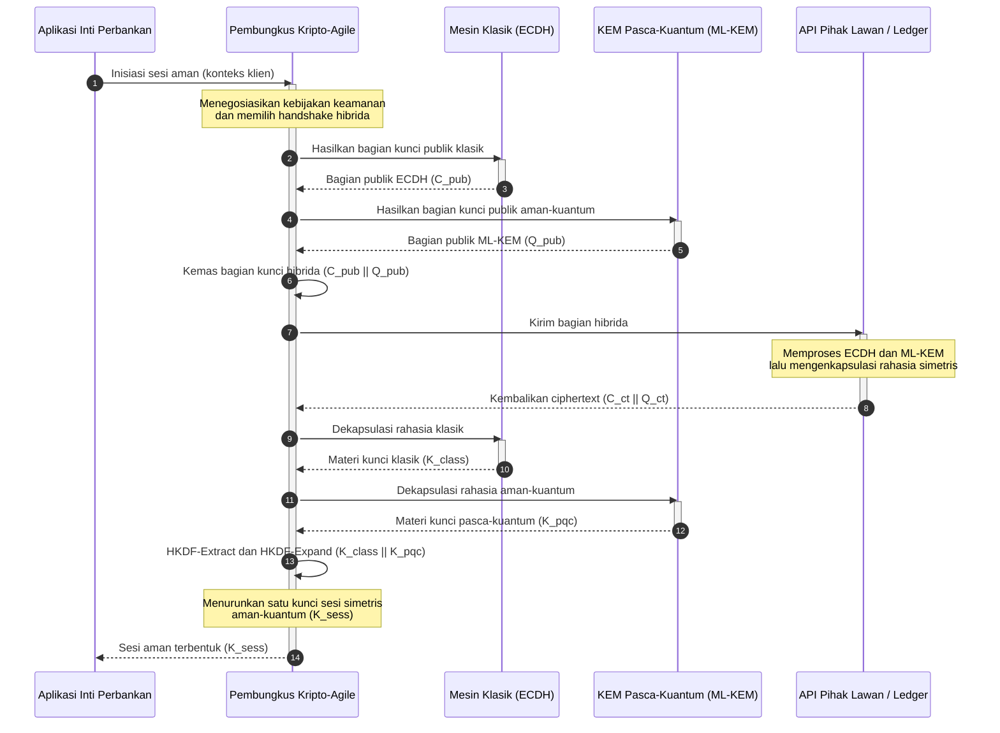

# KyberLib dan Migrasi Perbankan Pasca-Kuantum 2026: Dari Standar ke Kode

<!-- lead-start: manual -->
<aside class="post-lead" aria-label="Ringkasan artikel">

<strong>Ringkasan.</strong> Infrastruktur perbankan pada 2026 menghadapi ancaman sistemik dengan titik akhir yang sudah diketahui: komputasi berskala kuantum akan mematahkan pertukaran kunci RSA dan ECC yang melindungi lalu lintas transit hari ini. Standar federal dan makalah kebijakan pengawasan telah menaikkan kesadaran; eksekusi teknisnya masih tersekat-sekat. <a href="https://github.com/sebastienrousseau/kyberlib">KyberLib</a> adalah blueprint rekayasa open source yang memindahkan narasi pasca-kuantum ke kode Rust konkret yang aman-memori — mengimplementasikan ML-KEM terstandardisasi NIST (FIPS 203) di balik batas abstraksi kripto-agile, sehingga institusi dapat memutakhirkan keamanan transport dan enkapsulasi kunci sebelum serangan "Store Now, Decrypt Later" mencapai arsip mereka.

<strong>Poin utama</strong>

<ul class="post-lead-takeaways">
  <li><strong>Dari kebijakan ke kode yang dapat diperiksa.</strong> KyberLib memindahkan kriptografi pasca-kuantum dari peta jalan strategis yang abstrak menjadi implementasi Rust yang konkret, berkinerja tinggi, dan dapat diaudit.</li>
  <li><strong>Eksekusi ML-KEM FIPS 203 terstandardisasi.</strong> Pustaka ini mengimplementasikan ML-KEM — algoritma penetapan kunci yang difinalkan dalam NIST FIPS 203 — menjaga kesesuaian tetap selaras dengan ekspektasi regulasi global.</li>
  <li><strong>Kripto-agilitas sejak desain.</strong> Batas abstraksi yang stabil memungkinkan aplikasi perbankan mengganti primitif kriptografi tanpa penulisan ulang aplikasi yang mahal dan rawan kesalahan.</li>
  <li><strong>Keamanan memori bertenaga Rust.</strong> Aturan kepemilikan pada waktu kompilasi melenyapkan buffer overflow dan kebocoran memori yang menjangkiti pustaka kriptografi warisan berbasis C, pada kecepatan abstraksi tanpa biaya tambahan.</li>
  <li><strong>Mitigasi tanggung jawab fidusia.</strong> Bukti migrasi yang dapat diamati dan diuji memberi direksi rekam jejak "langkah wajar" yang dituntut audit akuntabilitas personal DORA Pasal 5.</li>
</ul>

<strong>Bacaan terkait:</strong> <a href="/2026-05-18-quantum-cryptography-standards-developments-2026/">Reset Kriptografi Kuantum 2026: Standar PQC, Asurans QKD, dan Pekerjaan Migrasi yang Tidak Bisa Ditunda Bank</a> · <a href="/2026-05-28-dora-ai-act-data-sovereignty-banking-compliance-stack-2026/">Tumpukan Kepatuhan DORA, AI Act, dan Kedaulatan Data untuk Perbankan 2026</a> · <a href="/2026-05-20-cloud-native-banking-financial-institutions-2026/">Perbankan Cloud-Native untuk Institusi Keuangan 2026</a>

</aside>
<!-- lead-end -->

Migrasi pasca-kuantum sudah berhenti menjadi latihan perencanaan. Pada 2026 ia adalah kebutuhan operasional aktif, dan kesenjangan antara niat regulasi dan eksekusi rekayasa adalah tempat risiko kini berada. [KyberLib ⧉](https://github.com/sebastienrousseau/kyberlib "kyberlib") menutup sebagian kesenjangan itu: pustaka Rust aman-memori berorientasi produksi yang mengimplementasikan ML-KEM sesuai parameter final FIPS 203 dan membungkusnya dalam batas kripto-agile yang benar-benar dibutuhkan estat transaksional sebuah bank.

---

> **Ringkasan Eksekutif / Poin Utama**
>
> - **Ancamannya sudah operasional.** Pihak lawan menjalankan pemanenan "Store Now, Decrypt Later" hari ini; kerahasiaan data gagal secara retroaktif pada hari komputer kuantum yang relevan secara kriptografis tiba.
> - **Standarnya sudah final.** NIST FIPS 203 (ML-KEM) dan FIPS 204 (ML-DSA) memberi komite audit tolok ukur yang jelas dan dapat diuji — tidak ada lagi pembelaan "menunggu standar".
> - **KyberLib adalah blueprint rekayasanya.** Rust aman-memori, kompilasi `no_std` untuk HSM dan kartu pintar, serta pola handshake hibrida yang mempertahankan interoperabilitas klasik.
> - **Kripto-agilitas adalah sasaran yang bertahan lama.** Batas abstraksi yang stabil memungkinkan primitif berganti tanpa penulisan ulang aplikasi — pelajaran yang hidup lebih lama dari algoritma mana pun.
> - **Dewan direksi memikul tanggung jawabnya.** DORA Pasal 5 menempatkan tanggung jawab personal pada direksi; kode migrasi yang dapat diperiksa dan diamati adalah bukti yang memenuhinya.
>
---

## Mengapa Proyek Open Source Ini Penting pada 2026

Seiring kriptografi asimetris mendekati keusangan, ancamannya tidak menunggu komputer kuantum yang relevan secara kriptografis selesai dibangun. Pihak lawan mengeksekusi serangan **"Store Now, Decrypt Later" (SNDL)** sekarang — memanen aliran transit terenkripsi berisi transaksi perbankan korporasi, rahasia dagang, dan komunikasi institusional dengan niat mendekripsinya begitu kapabilitas kuantum matang. Bagi sebuah bank, setiap handshake klasik di jaringan hari ini adalah pelanggaran kerahasiaan dengan tanggal ledakan yang tertunda.

Regulator merespons dengan kewajiban konkret:

1. **DORA Pasal 6 (manajemen risiko TIK)** mewajibkan institusi memetakan, mengidentifikasi, dan memitigasi kerentanan di seluruh estat kriptografinya — termasuk pertukaran kunci asimetris yang terkubur di middleware yang belum pernah diinventarisasi siapa pun.
2. **NIST FIPS 203 dan 204** menetapkan standar pasca-kuantum resmi untuk enkapsulasi kunci (ML-KEM) dan tanda tangan digital (ML-DSA), memberi komite audit tolok ukur terstandardisasi untuk mengukur kemajuan migrasi.

Mengeksekusi migrasi ini tanpa mengganggu operasi yang berjalan menuntut langkah melampaui kertas kebijakan menuju **infrastruktur kriptografi open source yang dapat diperiksa**. [KyberLib ⧉](https://github.com/sebastienrousseau/kyberlib "kyberlib") menghadirkan persis itu: pustaka Rust aman-memori yang sesuai FIPS 203 dan mengubah transisi pasca-kuantum menjadi pipeline rekayasa yang terukur dan dapat diverifikasi — sekaligus menggeser percakapan investasi teknologi menuju Return on Resilience yang nyata.

## Sudut Pandang Arsitektur

KyberLib berada di balik batas API yang stabil, mengisolasi aplikasi transaksional inti bank dari perubahan pada primitif kriptografi tingkat rendah.

| Lapisan | Keputusan Desain | Mengapa Penting | Risiko jika Salah Kelola |
|---|---|---|---|
| **Primitif** | Enkapsulasi kunci ML-KEM FIPS 203 | Menggantikan pertukaran kunci Diffie-Hellman dan RSA klasik dengan struktur berbasis kisi | Ketidaksesuaian dengan parameter final FIPS 203, berujung pada kegagalan audit kepatuhan |
| **Bahasa** | Implementasi Rust aman-memori | Melenyapkan kerentanan korupsi memori (buffer overflow, use-after-free) yang endemik di C/C++ | Dependensi yang menjalar dan mengkompromikan integritas rantai build |
| **Abstraksi** | Batas kripto-agile yang stabil | Aplikasi berganti algoritma di balik antarmuka terpadu seiring standar berkembang | Primitif yang dipatok keras memaksa penulisan ulang manual pada setiap migrasi mendatang |
| **Penerapan** | Handshake enkripsi hibrida | Menggabungkan KEM pasca-kuantum dengan algoritma klasik dalam amplop pembungkus ganda | Hilangnya interoperabilitas warisan atau pergeseran konfigurasi yang senyap |
| **Asurans** | Provenans SLSA Level 3 dan pengujian yang dapat diperiksa | Menjamin sumber dan provenans kode; contoh dapat diaudit baris demi baris | Teater keamanan — pustaka kotak hitam yang kesalahan implementasinya baru muncul di produksi |

## Sinyal Operasional yang Perlu Dipantau

Mendemonstrasikan kepatuhan pasca-kuantum kepada dewan pengawas dan regulator berarti memantau metrik spesifik yang dapat dikuantifikasi:

| Sinyal | Metrik | Referensi Regulasi | Implementasi Platform |
|---|---|---|---|
| **Kesesuaian ML-KEM FIPS 203** | Kepatuhan 100% terhadap parameter final (ML-KEM-512/768/1024) | NIST FIPS 203 | Kriptografi kisi terverifikasi-parameter yang dikompilasi di dalam modul KyberLib |
| **Inventarisasi kriptografi** | Inventaris lengkap penggunaan pertukaran kunci asimetris di seluruh sistem | NIST SP 1800-38 | Agen pemindaian otomatis yang mencatat cipher suite aktif ke registri pusat |
| **Pertukaran kunci hibrida** | Persentase handshake lapisan transport yang dieksekusi dalam amplop hibrida | DORA Pasal 6 | Proxy jaringan yang membungkus handshake TLS 1.3 klasik dalam enkapsulasi PQC |
| **Kompilasi `no_std`** | Kemampuan kompilasi tanpa pustaka standar Rust untuk target terbatas | DORA Pasal 30 | Kompilasi `no_std` kondisional di KyberLib untuk Hardware Security Module |
| **Indeks kripto-agilitas** | Waktu dalam menit untuk mengganti primitif kriptografi di gerbang API | UK PRA SS1/23 | Registri perutean terabstraksi yang mengelola alokasi algoritma lewat variabel runtime |

## Mengapa Rust Penting untuk Kriptografi Pasca-Kuantum

Mengimplementasikan algoritma pasca-kuantum seperti ML-KEM menuntut operasi matematika tingkat rendah yang kompleks pada gelanggang polinomial. Secara historis, menjalankan operasi itu pada kecepatan produksi berarti C/C++ atau assembly yang ditulis tangan — permukaan serangan korupsi memori yang luas, persis pada kode yang paling tidak boleh salah di sebuah bank.

Rust mengubah postur keamanan rekayasa kriptografi dalam tiga cara konkret:

1. **Keamanan memori pada waktu kompilasi.** Model kepemilikan Rust menjamin buffer overflow, double free, dan kesalahan use-after-free dicegah saat kompilasi. Itu sangat penting bagi pustaka pasca-kuantum, yang ukuran kunci dan ciphertext-nya jauh lebih besar daripada padanan klasiknya.
2. **Abstraksi deterministik tanpa biaya tambahan.** Rust dikompilasi ke kode mesin asli tanpa garbage collector, sehingga kecepatan eksekusi dan jejak memori menyamai atau melampaui pustaka berbasis C sambil mempertahankan keamanan.
3. **Kompatibilitas `no_std`.** KyberLib dapat dikompilasi tanpa pustaka standar Rust, sehingga berjalan di lingkungan bare-metal yang terbatas — termasuk Hardware Security Module dan kartu pintar — menjaga kriptografi kelas bank tetap di dalam batas keamanan fisik.

## Merancang Arsitektur Kripto-Agile

Mode kegagalan klasik dalam migrasi kriptografi adalah pematokan keras: asumsi spesifik-algoritma yang tertanam langsung di logika aplikasi, lalu ditemukan kembali dengan susah payah pada setiap transisi. Sasaran yang bertahan lama untuk 2026 adalah **kripto-agilitas** — lapisan abstraksi yang memperlakukan algoritma sebagai modul yang dapat ditukar di balik antarmuka stabil, sehingga migrasi berikutnya menjadi perubahan konfigurasi alih-alih penulisan ulang seluruh estat.

Sekuens di bawah menunjukkan bagaimana pembungkus kripto-agile KyberLib mengoordinasikan handshake pertukaran kunci hibrida (klasik plus pasca-kuantum):

Amplop hibrida adalah detail yang penting secara operasional. Sampai primitif pasca-kuantum mengakumulasi pengawasan produksi bertahun-tahun, kunci sesi diturunkan dari rahasia klasik dan rahasia pasca-kuantum sekaligus: penyerang harus mematahkan ECDH **dan** ML-KEM untuk memulihkan kanal. Pihak lawan yang belum bermigrasi tetap dapat bertransaksi; pihak lawan yang sudah bermigrasi langsung memperoleh perlindungan berbasis kisi.

## Pedoman untuk Ruang Direksi

Keamanan pasca-kuantum bukan urusan enkripsi back-office; ia adalah isu tata kelola ruang direksi dengan taruhan personal. Manajer senior sebaiknya membingkai migrasi melalui tanggung jawab fidusia:

- **DORA Pasal 5 (tata kelola dan organisasi)** menempatkan tanggung jawab personal atas keamanan TIK pada dewan direksi. Pengujian open source yang dapat diamati adalah bukti langsung yang diminta audit tanggung jawab personal — "kami memilih implementasi FIPS 203 yang dapat diperiksa dan inilah hasil uji kesesuaiannya" adalah jawaban yang dapat dipertahankan; "vendor kami menjamin" bukan.
- **Manajemen risiko model (US Fed SR 11-7 / UK PRA SS1/23)** berlaku untuk arsitektur pembungkus kriptografi sama seperti untuk model penetapan harga. Lapisan abstraksi harus melewati validasi MRM, termasuk kinerja di bawah skenario disrupsi ekstrem.
- **Modal risiko operasional Basel III** memberi imbalan bagi kematangan kontrol yang terdemonstrasi. Handshake hibrida yang teruji menurunkan profil risiko operasional jangka panjang institusi, memangkas premi modal dan melepaskan kapasitas neraca untuk penempatan tresuri aktif.

## Apa Artinya Berdasarkan Tipe Bank

### Bank Sistemik Penting Global (G-SIB)

G-SIB menjalankan estat transaksional yang sarat sistem warisan, sehingga kendala utamanya adalah penemuan: mengetahui di mana pertukaran kunci asimetris benar-benar terjadi. Inventarisasi kriptografi berkelanjutan di bawah panduan NIST SP 1800-38 datang lebih dulu; KyberLib kemudian menyediakan pustaka terstandardisasi yang aman-memori untuk mengeksekusi enkapsulasi kunci pasca-kuantum di setiap node modern yang ditemukan inventaris itu.

### Bank Transaksi dan Korporasi

Kerahasiaan di sepanjang rel pembayaran adalah inti waralabanya. Karena KyberLib dapat dikompilasi ke target `no_std` bare-metal, bank transaksi dapat menerapkan handshake pasca-kuantum langsung di dalam perangkat keras perutean pembayaran dan manajemen likuiditas di edge — bukan hanya di tingkat aplikasi.

### Bank Regional dan Bank Lebih Kecil

Institusi regional menghadapi pemanenan yang disponsori negara yang sama tanpa anggaran riset G-SIB. Implementasi Rust open source yang dapat diperiksa memberi mereka jalur siap pakai menuju kesesuaian NIST FIPS 203 dengan segera, tanpa menegosiasikan peta jalan vendor yang berupa kotak hitam.

## Dari Peta Jalan ke Kode yang Terkompilasi

Transisi pasca-kuantum adalah tugas rekayasa aktif, dan institusi yang menjaga kepercayaan pengawas, pihak lawan, dan bendahara korporasi sepanjang 2026 adalah yang berpindah dari peta jalan abstrak ke kode yang terkompilasi dan dapat diamati. Mandat eksekutifnya mengikuti secara langsung: audit titik pertukaran kunci warisan, terapkan handshake hibrida pada kanal bernilai tertinggi, dan bangun batas abstraksi stabil yang menjadikan setiap pergantian primitif di masa depan sebagai pekerjaan rutin. KyberLib menjadikan setiap langkah itu kapabilitas operasional yang terukur, bukan komitmen di atas slide presentasi.

## Pertanyaan yang Sering Diajukan

**Apakah KyberLib patuh pada standar final NIST?**

Ya. KyberLib dirancang berdasarkan parameter ML-KEM sebagaimana difinalkan dalam FIPS 203, menjaga pustaka hasil kompilasi tetap selaras dengan ekspektasi regulasi federal dan global.

**Apakah pustaka pasca-kuantum memerlukan perangkat keras khusus?**

Tidak. Implementasi Rust KyberLib dikompilasi ke arsitektur sistem standar. Kapabilitas `no_std`-nya juga memungkinkannya berjalan di Hardware Security Module khusus dan kartu pintar tempat penyimpanan fisik kunci diwajibkan.

**Bagaimana "Store Now, Decrypt Later" memengaruhi kepatuhan saat ini?**

Jika lapisan transport bergantung pada RSA atau ECC klasik, pihak lawan dapat memanen lalu lintas hari ini dan mendekripsinya begitu kapabilitas kuantum matang. Pertukaran kunci hibrida yang diterapkan sekarang menjaga data yang tertangkap tetap di balik perlindungan berbasis kisi.

**Mengapa handshake hibrida alih-alih langsung pindah ke primitif pasca-kuantum?**

Amplop hibrida menurunkan kunci sesi dari rahasia klasik dan rahasia pasca-kuantum sekaligus, sehingga keamanan bertahan kecuali keduanya dipatahkan. Itu mempertahankan interoperabilitas dengan pihak lawan yang belum bermigrasi sementara primitif baru mengakumulasi pengawasan produksi.

## Referensi

- National Institute of Standards and Technology, (2024). [FIPS 203: Standar Mekanisme Enkapsulasi Kunci Berbasis Kisi-Modul ⧉](https://www.nist.gov/news-events/news/2024/08/nist-releases-first-3-finalized-post-quantum-encryption-standards "Pengumuman NIST FIPS 203").
- Board of Governors of the Federal Reserve System, (2011). [Panduan Pengawasan Manajemen Risiko Model (SR Letter 11-7) ⧉](https://www.federalreserve.gov/supervisionreg/srletters/sr1107.htm "Federal Reserve SR 11-7").
- European Parliament and Council of the European Union, (2022). [Regulasi (EU) 2022/2554 tentang ketahanan operasional digital sektor keuangan (DORA) ⧉](https://eur-lex.europa.eu/legal-content/EN/TXT/?uri=CELEX%3A32022R2554 "Regulasi DORA").
- NIST National Cybersecurity Center of Excellence, (2025). [Migrasi ke Kriptografi Pasca-Kuantum (NIST SP 1800-38) ⧉](https://www.nccoe.nist.gov/projects/migration-post-quantum-cryptography "NIST SP 1800-38").
- GitHub, (2026). [Repositori open source kyberlib ⧉](https://github.com/sebastienrousseau/kyberlib "repositori kyberlib").

<!-- enrich-start -->
<aside class="author-card" aria-label="Tentang penulis"><strong class="author-card-name"><a href="/about/index.html">Sebastien Rousseau</a></strong>Teknolog perbankan senior yang menulis tentang AI terapan, infrastruktur pembayaran, uang yang ditokenisasi, ISO 20022, keamanan pasca-kuantum, layanan keuangan cloud-native, infrastruktur open source, dan pasar digital teregulasi.Lebih dari 20 tahun pengalaman di HSBC Commercial &amp; Investment Bank, PayPal, Barclays, Shazam, AKQA, Virgin Group. <a href="/about/index.html">Profil lengkap</a> &middot; <a href="https://www.linkedin.com/in/sebastienrousseau/" rel="external noopener">LinkedIn</a> &middot; <a href="https://github.com/sebastienrousseau" rel="external noopener">GitHub</a></aside>

Terakhir ditinjau <time datetime="2026-06-12">2026-06-12</time>.

<!-- enrich-end -->
