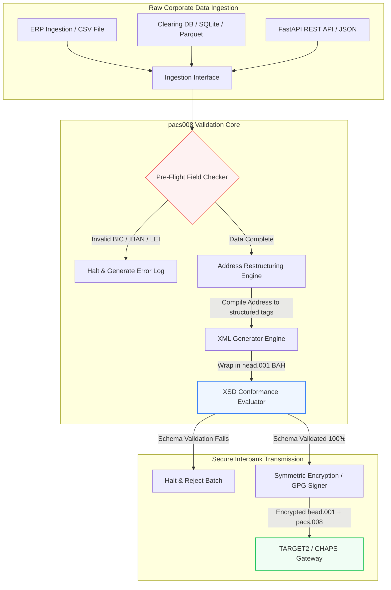

---

# Front Matter (YAML)

author: "contact@sebastienrousseau.com (Sebastien Rousseau)"
banner_alt: "Pekerja kantor dengan asisten suara dan laptop — melambangkan pesan pembayaran antarbank terstruktur dan terbaca mesin yang dijadikan programmable oleh otomatisasi pacs.008"
banner_height: "1597"
banner_width: "2584"
banner: "https://cloudcdn.pro/stocks/images/tyler-prahm-lmV3gJSAgbo.webp"
cdn: "https://cloudcdn.pro"
charset: "UTF-8"
cname: "sebastienrousseau.com"
copyright: "© Hak Cipta 2025 - 2026 - Sebastien Rousseau. Seluruh hak cipta dilindungi."
date: "15 Juni 2026"
description: "Pacs008 adalah pustaka Python open source yang mengotomatisasi pembuatan dan validasi pesan transfer kredit nasabah FI-to-FI pacs.008 ISO 20022 — alamat terstruktur, pembungkusan BAH head.001, checksum BIC/LEI/IBAN, pelacakan UETR OpenTelemetry — dibangun untuk cutover SWIFT November 2026."
format-detection: "telephone=no"
hreflang: "id"
icon: "https://cloudcdn.pro/clients/sebastienrousseau/v1/logos/sebastienrousseau.svg"
id: "https://sebastienrousseau.com/id/2026-06-15-pacs008-automation-iso-20022-interbank-payments-2026"
image_alt: "Potret Hitam Putih Sebastien Rousseau"
image_height: "162"
image_width: "162"
image: "https://cloudcdn.pro/stocks/images/sebastien-rousseau.png"
keywords: "pacs008, ISO 20022 pacs.008, transfer kredit nasabah FI to FI, alamat terstruktur, SWIFT CBPR+, BAH head.001, TARGET2, CHAPS, Fedwire, DORA, BCBS 239, Basel III, UETR, validasi LEI, SEPA VoP"
language: "id-ID"
last_reviewed: "2026-06-15"
layout: "report"
locale: "id_ID"
logo_alt: "Logo Sebastien Rousseau"
logo_height: "44"
logo_width: "44"
logo: "https://cloudcdn.pro/clients/sebastienrousseau/v1/logos/sebastienrousseau.svg"
menu: ""
measurementID: "G-169G4ET5HQ"
name: "Sebastien Rousseau"
permalink: "https://sebastienrousseau.com/id/2026-06-15-pacs008-automation-iso-20022-interbank-payments-2026"
rating: "general"
referrer: "no-referrer"
robots: "index, follow"
schema: "FAQPage, Article"
seo_title: "Otomatisasi pacs.008 untuk Era ISO 20022"
short_name: "sebastienrousseau"
subtitle: "Pesan pacs.008 adalah titik temu data pembayaran antarbank, alamat terstruktur, kepatuhan, routing, dan operasi penyelesaian."
tags: "pacs008, ISO 20022, pembayaran antarbank, pembayaran wholesale, Python"
theme-color: "0, 83, 191"
title: "Membangun Otomatisasi pacs.008 untuk Era Antarbank ISO 20022 pada 2026"
url: "https://sebastienrousseau.com/id/2026-06-15-pacs008-automation-iso-20022-interbank-payments-2026"
viewport: "width=device-width, initial-scale=1, shrink-to-fit=no"

# RSS - The RSS feed front matter (YAML).
atom_link: "https://sebastienrousseau.com/2026-06-15-pacs008-automation-iso-20022-interbank-payments-2026/rss.xml"
category: "Keuangan"
docs: https://validator.w3.org/feed/docs/rss2.html
generator: "Static Site Generator (SSG) (version 0.0.26)"
item_description: "Pacs008 menyediakan fondasi Python open source untuk mengotomatisasi pesan transfer kredit nasabah FI-to-FI ISO 20022 di era pembayaran antarbank."
item_guid: "https://sebastienrousseau.com/2026-06-15-pacs008-automation-iso-20022-interbank-payments-2026/rss.xml"
item_link: "https://sebastienrousseau.com/2026-06-15-pacs008-automation-iso-20022-interbank-payments-2026/rss.xml"
item_pub_date: "Mon, 15 Jun 2026 06:06:06 +0000"
item_title: "Membangun Otomatisasi pacs.008 untuk Era Antarbank ISO 20022 pada 2026"
last_build_date: "Mon, 15 Jun 2026 06:06:06 +0000"
managing_editor: "contact@sebastienrousseau.com (Sebastien Rousseau)"
pub_date: "Mon, 15 Jun 2026 06:06:06 +0000"
ttl: "60"
type: "article"
webmaster: "contact@sebastienrousseau.com"

# Apple - The Apple front matter (YAML).
apple_mobile_web_app_orientations: "portrait"
apple_touch_icon_sizes: "192x192"
apple-mobile-web-app-capable: "yes"
apple-mobile-web-app-status-bar-inset: "black"
apple-mobile-web-app-status-bar-style: "black-translucent"
apple-mobile-web-app-title: "Otomatisasi pacs.008 ISO 20022"
apple-touch-fullscreen: "yes"

# MS Application - The MS Application front matter (YAML).

msapplication-navbutton-color: "0, 83, 191"

# Twitter Card - The Twitter Card front matter (YAML).

twitter_card: "summary_large_image"
twitter_creator: "@wwdseb"
twitter_description: "Pacs008 menyediakan fondasi Python open source untuk mengotomatisasi pesan transfer kredit nasabah FI-to-FI ISO 20022 di era pembayaran antarbank."
twitter_image: "https://cloudcdn.pro/clients/sebastienrousseau/v1/logos/sebastienrousseau.svg"
twitter_image_alt: "Logo Sebastien Rousseau"
twitter_site: "@wwdseb"
twitter_title: "Otomatisasi pacs.008 untuk Era ISO 20022"
twitter_url: "https://sebastienrousseau.com/id/2026-06-15-pacs008-automation-iso-20022-interbank-payments-2026"

excerpt: "pacs008 adalah toolkit Python open source yang menjadikan pesan transfer kredit nasabah FI-to-FI ISO 20022 dapat diprogram — alamat terstruktur, validasi, routing, hook kepatuhan, dan tenggat SWIFT November 2026 sebagai default bawaan."

# Humans.txt - The Humans.txt front matter (YAML).
author_website: "https://sebastienrousseau.com"
author_twitter: "@wwdseb"
author_location: "London, UK"
thanks: "Terima kasih telah membaca!"
site_last_updated: "2026-06-15"
site_standards: "HTML5, CSS3, RSS, Atom, JSON, XML, YAML, Markdown, TOML"
site_components: "Kaishi, Kaishi Builder, Kaishi CLI, Kaishi Templates, Kaishi Themes"
site_software: "Static Site Generator, Rust"

---

# Mengotomatisasi Pembayaran Antarbank pacs.008 ISO 20022 dengan Python Open Source pada 2026

<!-- lead-start -->
<aside class="post-lead" aria-label="Ringkasan artikel">

<strong>Ringkasan.</strong> Berdasarkan pedoman SWIFT CBPR+, Tebing Alamat Terstruktur pada 14 November 2026 menonaktifkan alamat pos tak terstruktur di TARGET2, CHAPS, Fedwire, Lynx, dan SEPA. Pacs008 adalah pustaka Python open source yang mengotomatisasi pembuatan dan validasi pesan transfer kredit nasabah FI-to-FI (pacs.008) ISO 20022, membungkus pembayaran dalam Business Application Header (BAH head.001), dan menanamkan kepatuhan alamat terstruktur ke dalam jalur data sebelum pesan menyentuh jaringan kliring.

<strong>Poin utama</strong>

<ul class="post-lead-takeaways">
  <li><strong>Tenggat Alamat Terstruktur bersifat absolut.</strong> Setelah 14 November 2026, blok alamat tak terstruktur ditarik dari peredaran. Pacs008 menegakkan elemen alamat pos terstruktur (<code>&lt;TwnNm&gt;</code>, <code>&lt;Ctry&gt;</code>, <code>&lt;PstCd&gt;</code>) pada saat kompilasi data untuk mencegah penolakan di perbatasan.</li>
  <li><strong>Orkestrasi pesan terpadu.</strong> Membungkus payload pembayaran inti pacs.008 dalam selubung Business Application Header (head.001) yang patuh, menyediakan model pemrosesan round-trip standar.</li>
  <li><strong>Integritas algoritmik.</strong> Validator bawaan untuk BIC dan Legal Entity Identifier (LEI) menggunakan kalkulasi checksum ISO 7064 Modulo 97-10.</li>
  <li><strong>Keterlacakan setara DORA.</strong> Instrumentasi OpenTelemetry penuh berbasis Unique End-to-End Transaction Reference (UETR) untuk log audit real-time dan tanda tangan audit kriptografis.</li>
  <li><strong>Pelestarian fidusia tingkat dewan.</strong> Menyelaraskan akurasi pesan antarbank dengan DORA Pasal 5, pelaporan BCBS 239, dan penghematan modal Risiko Operasional Basel III.</li>
</ul>

<strong>Bacaan terkait:</strong> <a href="https://sebastienrousseau.com/2026-05-19-global-wholesale-payments-economics-2026">Pembayaran Wholesale Global pada 2026: ISO 20022, Pembaruan RTGS, dan Ekonomi Interoperabilitas</a>, <a href="https://sebastienrousseau.com/2026-05-27-ai-operating-system-payments-fraud-routing-resilience-compliance-2026">AI sebagai Sistem Operasi Pembayaran: Fraud, Routing, Ketahanan, dan Kepatuhan pada 2026</a>, <a href="https://sebastienrousseau.com/2026-05-12-iso-20022-pacs008-structured-address-deadline">Tenggat Alamat Terstruktur pacs.008 November 2026: Pandangan Enam Bulan</a>.

</aside>
<!-- lead-end -->

Menjembatani jurang antara data keuangan legacy dan pesan antarbank terstruktur melalui pipeline Python yang dapat diaudit dan tervalidasi skema.

Titik rujukan open source untuk artikel ini adalah [pacs008 ⧉](https://github.com/sebastienrousseau/pacs008 "pacs008 — pustaka Python open source"). Repositori ini diposisikan sebagai pustaka Python untuk mengotomatisasi pesan XML transfer kredit nasabah FI-to-FI pacs.008 ISO 20022.

## Mengapa Proyek Open Source Ini Penting pada 2026

Infrastruktur kliring pembayaran antarbank global tengah menjalani modernisasi paling mendalam dalam hampir setengah abad terakhir.

Pada Juni 2026, sektor jasa keuangan dengan cepat mendekati **Tebing Alamat Terstruktur SWIFT pada 14 November 2026**. Mulai tanggal tersebut, pedoman SWIFT CBPR+, bersama TARGET2, CHAPS, Fedwire, dan Lynx Kanada, akan secara resmi menonaktifkan baris alamat pos tak terstruktur (penggunaan tunggal `<AdrLine>` dalam blok `<PstlAdr>`). Seluruh lembaga keuangan partisipan harus mengirim alamat dalam format hibrida (`<TwnNm>` dan `<Ctry>` terstruktur, dengan maksimum dua elemen `<AdrLine>` untuk detail sisanya) atau format terstruktur penuh (elemen individual untuk nama jalan, nomor bangunan, dan kode pos). Pesan apa pun yang gagal memenuhi kriteria ini akan ditolak di perbatasan jaringan.

Bagi lembaga keuangan, transisi ini menciptakan kendala operasional besar:

1. **Penalti penolakan di perbatasan.** Pembayaran yang gagal memenuhi kriteria alamat terstruktur akan menghadapi penolakan jaringan seketika, memicu penundaan transaksi, hambatan likuiditas, dan tumpukan operasional.
2. **SEPA Verification of Payee (VoP).** Mewajibkan seluruh Payment Service Provider (PSP) di dalam zona SEPA memverifikasi kesesuaian antara nama penerima dan IBAN sebelum mengeksekusi transfer kredit, menambahkan gerbang validasi lain pada inisiasi pesan.

[Pacs008](https://github.com/sebastienrousseau/pacs008) menyelesaikan persoalan ini. Ia adalah pustaka Python open source yang ringan, mengotomatisasi konversi data keuangan mentah menjadi pesan transfer kredit nasabah antarbank pacs.008 ISO 20022 yang sepenuhnya tervalidasi dan patuh skema. Dengan menjembatani jurang data legacy-ke-terstruktur, pacs008 memberikan Return on Resilience (RoR) yang tinggi, menjaga modal kerja, dan mengamankan eksekusi real-time di seluruh rel global.

## Lensa Arsitektur pacs008 2026

Pustaka pacs008 disusun sebagai mesin validasi dan pembuatan terisolasi, memastikan input mentah diurai secara sistematis, diperkaya, dan dibungkus dalam selubung standar:

| Lapisan | Keputusan Desain | Mengapa Penting | Risiko jika Salah Tangani |
|---|---|---|---|
| **Lapisan Input** | Ingesti CSV, JSON, SQLite, dan Parquet | Menemui tim integrasi perbankan di tempat data mereka berada, mencegah migrasi platform. | Ingesti payload data mentah, tak tervalidasi, atau rusak. |
| **Lapisan Validasi** | Validasi pre-flight terhadap skema XSD resmi dan aturan bisnis kustom | Menghentikan eksekusi dan menandai kesalahan sebelum file pembayaran dikirim ke jaringan kliring. | File XML tak valid memicu penolakan jaringan seketika dan penundaan kliring. |
| **Lapisan Selubung BAH** | Pembungkusan Business Application Header (head.001) otomatis | Menstandardisasi pengiriman dan routing pesan berbasis tag `<MsgDefIdr>`. | Mengirim payload pacs.008 mentah tanpa selubung luar yang dibutuhkan, menyebabkan penolakan sistem. |
| **Lapisan Serialisasi** | Dukungan XML standar dan JSON yang patuh ISO (TS 23029) | Memungkinkan translasi langsung antara payload XML dan JSON, mendukung REST API modern dan streaming Kafka. | Representasi data terfragmentasi yang melanggar pedoman ISO resmi. |
| **Lapisan Observabilitas** | Tracing OpenTelemetry berbasis UETR | Menangkap jalur eksekusi dan log terperinci, menyediakan auditabilitas real-time. | Celah tracing yang memblokir visibilitas operasional dan audit. |

## Sinyal Antarbank Utama dan Tonggak Regulasi

Untuk mendemonstrasikan ketahanan operasional transaksional, manajer teknologi dan risiko senior harus memantau indikator kepatuhan spesifik yang terkuantifikasi:

| Sinyal | Metrik / Tolok Ukur Operasional | Referensi G20 / SWIFT / DORA | Implementasi Platform Teknis |
|---|---|---|---|
| **Kepatuhan Alamat Terstruktur** | % pesan pacs.008 yang menggunakan field `<PstlAdr>` terstruktur penuh dengan `<TwnNm>` dan `<Ctry>` yang ditetapkan. | Tenggat SWIFT SR 2026 | Pemeriksaan skema pre-flight di pacs008 menolak baris alamat tak terstruktur. |
| **SEPA Verification of Payee** | Validasi kecocokan antara nama penerima dan IBAN sebelum eksekusi pesan. | Regulasi SEPA VoP | Kelas helper VoP bawaan menjalankan kueri pra-validasi terhadap IBAN/BIC. |
| **Integrasi BAH head.001** | Persentase payload pembayaran keluar yang berhasil dibungkus dalam Business Application Header. | Pedoman TARGET2 / CBPR+ | Subsistem pembungkus BAH mengompilasi selubung XML luar secara otomatis. |
| **Checksum Modulo LEI** | Validasi check-digit ISO 7064 Modulo 97-10 pada blok `<LEI>` debitur dan kreditur. | Mandat Bank of England | Pemeriksa algoritmik memverifikasi integritas identifier 20 karakter. |
| **Akurasi Pelacakan UETR** | 100% pembayaran yang dihasilkan disisipi Unique End-to-End Transaction Reference yang valid. | Spesifikasi UETR SWIFT | Pembuatan dan tracing otomatis kode referensi UUIDv4 36 karakter. |

## Mengapa Python adalah On-Ramp Ideal untuk Otomatisasi Antarbank

Hub pembayaran modern dan tim operasi tresuri pada 2026 sangat bergantung pada Python untuk transformasi data, pemodelan keuangan, dan integrasi database ERP.

Dengan memanfaatkan pustaka Python open source, lembaga memperoleh keuntungan signifikan:

1. **Beban kognitif rendah dan interoperabilitas tinggi.** Python berperan sebagai jembatan kohesif. Ia memungkinkan developer menulis skrip sederhana yang menarik instruksi pembayaran mentah dari database legacy, memvalidasinya terhadap aturan perbankan internasional yang kompleks, dan menghasilkan XML yang patuh dalam alur kerja tunggal yang terpadu.
2. **Eliminasi translator opak "kotak hitam".** Portal perbankan proprietari kerap mengenakan biaya lisensi tinggi untuk translator file pembayaran kustom. Translator ini adalah kotak hitam proprietari, mustahil bagi tim keamanan untuk mengaudit bagaimana data diproses atau di mana kunci disimpan. Pustaka open source yang dapat diperiksa seperti pacs008 menjamin transparansi kode menyeluruh.
3. **Integrasi CI/CD yang mulus.** Pacs008 terintegrasi langsung ke dalam pipeline continuous integration dan deployment, memungkinkan developer mengotomatisasi pengujian file pembayaran sebagai bagian dari siklus hidup pengiriman perangkat lunak standar mereka.

## Merancang Pipeline Antarbank yang Terbatas

Kerentanan besar dalam kliring antarbank adalah "pembuatan batch tak terkendali" — menghasilkan file tanpa loop verifikasi yang jelas dan terbatas. Pacs008 dirancang untuk beroperasi sebagai mesin validasi inti di dalam pipeline transaksi multi-tahap yang dikontrol ketat.

Alur operasional di bawah ini menunjukkan bagaimana data transaksional mentah melewati pipeline pacs008 untuk menghasilkan file pacs.008 yang aman secara kriptografis dan patuh skema, dibungkus dalam selubung BAH:

## Playbook Ruang Dewan dan Tanggung Jawab Fidusia

Otomatisasi pembayaran antarbank adalah isu manajemen risiko dan tata kelola korporat tingkat dewan. Manajer senior harus menangani kualitas data transaksi melalui lensa tanggung jawab fidusia dan reduksi risiko operasional:

- **DORA Pasal 5 (Akuntabilitas Dewan).** Menempatkan tanggung jawab langsung dan personal pada anggota dewan atas ketahanan dan keamanan operasi TIK lembaga. Karena kliring antarbank adalah fungsi korporat yang kritis, dewan harus mendemonstrasikan bahwa mereka telah menerapkan kontrol transaksional yang kuat, tervalidasi, dan terotomasi untuk mencegah gangguan operasional atau pembayaran tertunda.
- **BCBS 239 (Agregasi Data Risiko dan Pelaporan).** Menuntut pelaporan transaksi keuangan akurat, lengkap, dan dihasilkan secara real-time. Pacs008 membantu lembaga mencapai kepatuhan BCBS 239 dengan memastikan data pembayaran terstruktur dengan rapi dan tervalidasi di sumber, menghilangkan celah data dan kesalahan rekonsiliasi manual yang mengganggu spreadsheet legacy.
- **Mitigasi Beban Modal Risiko Operasional (Basel III).** Berdasarkan pedoman Basel III, tingkat kesalahan pembayaran yang tinggi dan overhead intervensi manual meningkatkan kebutuhan modal risiko operasional bank, mengikat modal yang sebenarnya dapat dialokasikan untuk pinjaman atau investasi. Mengotomatisasi pipeline pembayaran secara langsung meminimalkan premi modal ini, menjaga nilai neraca.

## Apa Artinya Berdasarkan Jenis Bank

### Global Systemically Important Banks (G-SIBs)

G-SIBs mengelola volume transaksi korporat lintas batas yang masif. Tantangan utama mereka adalah remediasi data legacy tak terstruktur sebelum menyentuh jaringan kliring. Dengan mengintegrasikan pacs008 ke dalam gateway perbankan korporat mereka, G-SIBs dapat menyediakan utilitas validasi otomatis kepada klien korporat mereka, mengurangi overhead perbaikan pembayaran manual, dan mengamankan eksekusi real-time di seluruh jaringan SWIFT.

### Bank Transaksi dan Bank Korporat

Bagi bank transaksi, kualitas data pembayaran adalah pembeda kompetitif. Dengan menawarkan alat validasi open source yang dapat diperiksa seperti pacs008 kepada klien tresuri korporat, bank-bank ini dapat mempercepat onboarding, meminimalkan penolakan file pembayaran, dan membangun kepercayaan nasabah melalui tingkat straight-through processing yang superior.

### Bank Regional dan Bank Berukuran Lebih Kecil

Bank regional harus mempertahankan kepatuhan terhadap standar pembayaran internasional tanpa anggaran teknologi besar seperti G-SIBs. Pacs008 menyediakan solusi berbasis Python yang ringan, hemat biaya, dan sepenuhnya patuh, memungkinkan lembaga yang lebih kecil menawarkan kapabilitas inisiasi pembayaran terstruktur modern tanpa lisensi middleware proprietari yang mahal.

## Kesimpulan: Roadmap Kliring Antarbank

Tenggat alamat terstruktur SWIFT November 2026 mendatang merupakan batas tegas bagi operasi tresuri korporat. Mengandalkan spreadsheet legacy, entri data manual, dan file pembayaran tak terstruktur adalah risiko bisnis aktif.

Untuk mengamankan kontinuitas transaksi dan meminimalkan overhead operasional, manajer teknologi dan keuangan senior harus mengeksekusi roadmap kliring yang jelas hari ini:

1. **Tegakkan validasi di sumber.** Wajibkan seluruh instruksi pembayaran divalidasi dan diformat sesuai skema XSD ISO 20022 resmi sebelum meninggalkan batas ERP korporat.
2. **Audit pipeline data.** Beralih dari pemrosesan spreadsheet manual dan terapkan alur kerja berbasis Python yang terotomasi dan dapat diperiksa menggunakan pacs008.
3. **Terapkan keamanan hibrida.** Pastikan file pembayaran yang dihasilkan ditandatangani dan dienkripsi secara kriptografis sebelum transmisi, memenuhi ekspektasi jaringan zero-trust.
4. **Selaraskan dengan prioritas fidusia.** Laporkan metrik otomatisasi pembayaran dan kualitas data secara formal kepada dewan, membingkai investasi sebagai program reduksi risiko operasional kritis di bawah DORA.

## Pertanyaan yang Sering Diajukan

**Apakah pacs008 patuh terhadap aturan alamat SWIFT SR 2026 yang akan datang?**

Ya. Pacs008 dirancang untuk mendukung tonggak alamat terstruktur SWIFT November 2026 yang ketat, menegakkan pemisahan wajib elemen alamat pos (kota, negara, kode pos) ke dalam field XML ISO 20022 yang ditetapkan.

**Bisakah pacs008 membungkus payload pembayaran dalam Business Application Header?**

Ya. Karena pacs008 secara native mendukung pembungkusan Business Application Header (BAH head.001), ia secara otomatis mengompilasi selubung luar yang diperlukan oleh jaringan TARGET2, CHAPS, dan CBPR+.

**Mengapa pustaka open source lebih disukai daripada translator file proprietari?**

Translator proprietari adalah kotak hitam opak, membuat audit keamanan mustahil. Pustaka open source yang ditinjau sejawat seperti pacs008 menawarkan transparansi kode menyeluruh, memungkinkan tim keamanan memverifikasi bahwa tidak ada data pembayaran sensitif yang terekspos selama pemrosesan.

**Identifier apa saja yang divalidasi pacs008?**

Pacs008 hadir dengan validator bawaan untuk Bank Identifier Code (BIC) dan Legal Entity Identifier (LEI) menggunakan kalkulasi checksum ISO 7064 Modulo 97-10, plus validasi check-digit IBAN dan pemeriksaan keunikan UETR.

## Referensi

- SWIFT, (2024). *ISO 20022 November 2026 Structured Address Milestone*. La Hulpe: SWIFT. Tersedia di: [Tonggak ISO 20022 SWIFT ⧉](https://www.swift.com/standards/iso-20022/iso-20022-bytes/call-action-november-2026 "Tonggak ISO 20022 SWIFT").
- Basel Committee on Banking Supervision (BCBS), (2013). *Principles for effective risk data aggregation and risk reporting (BCBS 239)*. Basel: Bank for International Settlements. Tersedia di: [Prinsip BCBS 239 ⧉](https://www.bis.org/publ/bcbs239.htm "Prinsip BCBS 239").
- European Parliament and Council of the European Union, (2022). *Regulation (EU) 2022/2554 on digital operational resilience for the financial sector (DORA)*. Brussels: Official Journal of the European Union. Tersedia di: [Regulasi DORA ⧉](https://eur-lex.europa.eu/legal-content/EN/TXT/?uri=CELEX%3A32022R2554 "Regulasi DORA").
- GitHub, (2026). *pacs008 open-source repository*. Tersedia di: [Repositori pacs008 ⧉](https://github.com/sebastienrousseau/pacs008 "Repositori pacs008").

<!-- enrich-start -->
<aside class="author-card" aria-label="Tentang penulis"><strong class="author-card-name"><a href="/about/index.html">Sebastien Rousseau</a></strong>Teknolog perbankan senior yang menulis tentang AI terapan, migrasi ISO 20022, kriptografi pasca-kuantum untuk jasa keuangan, dan transformasi struktural pembayaran wholesale.Lebih dari 20 tahun pengalaman di HSBC Commercial &amp; Investment Bank, PayPal, Barclays, Shazam, AKQA, Virgin Group. <a href="/about/index.html">Profil lengkap</a> &middot; <a href="https://www.linkedin.com/in/sebastienrousseau/" rel="external noopener">LinkedIn</a> &middot; <a href="https://github.com/sebastienrousseau" rel="external noopener">GitHub</a></aside>

Terakhir ditinjau <time datetime="2026-06-15">2026-06-15</time>.

<aside class="related-posts" aria-labelledby="related-heading">
<h2 id="related-heading" class="related-heading">Bacaan terkait</h2>

<article class="related-card"><footer class="related-body"><h3><a href="https://sebastienrousseau.com/2026-05-19-global-wholesale-payments-economics-2026">Pembayaran Wholesale Global pada 2026: ISO 20022, Pembaruan RTGS, dan Ekonomi Interoperabilitas</a></h3>
<time datetime="2026-05-19">2026-05-19</time>
</footer></article>
<article class="related-card"><footer class="related-body"><h3><a href="https://sebastienrousseau.com/2026-05-27-ai-operating-system-payments-fraud-routing-resilience-compliance-2026">AI sebagai Sistem Operasi Pembayaran: Fraud, Routing, Ketahanan, dan Kepatuhan pada 2026</a></h3>
<time datetime="2026-05-27">2026-05-27</time>
</footer></article>
<article class="related-card"><footer class="related-body"><h3><a href="https://sebastienrousseau.com/2026-05-12-iso-20022-pacs008-structured-address-deadline">Tenggat Alamat Terstruktur pacs.008 November 2026: Pandangan Enam Bulan</a></h3>
<time datetime="2026-05-12">2026-05-12</time>
</footer></article>

</aside>
<!-- enrich-end -->
