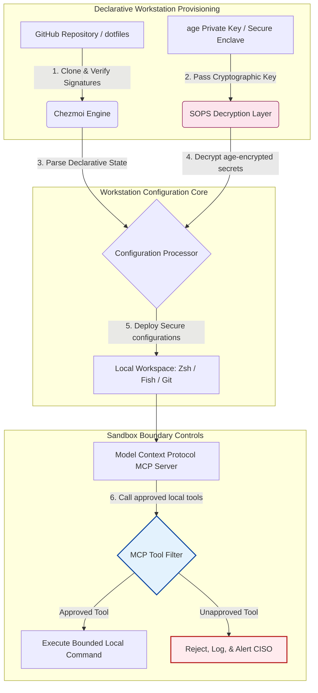

---

# Front Matter (YAML)

author: "contact@sebastienrousseau.com (Sebastien Rousseau)"
banner_alt: "Workstation pengembang dalam pencahayaan redup — melambangkan dotfiles yang sadar AI, reproduktif, dan aman untuk server MCP, penandatanganan SLSA, rahasia age/SOPS, dan paritas multi-shell"
banner_height: "1597"
banner_width: "2584"
banner: "https://cloudcdn.pro/stocks/images/almas-salakhov-Vq2ap8aFFEs.webp"
cdn: "https://cloudcdn.pro"
charset: "UTF-8"
cname: "sebastienrousseau.com"
copyright: "© Hak Cipta 2025 - 2026 - Sebastien Rousseau. Seluruh hak cipta dilindungi."
date: "16 Juni 2026"
description: "Dotfiles sadar AI adalah pola workstation yang aman dan reproduktif untuk era MCP — konfigurasi deklaratif via Chezmoi, rahasia SOPS/age, provenans SLSA Level 3, paritas multi-shell, dan batas sandbox terdefinisi untuk agen AI lokal."
format-detection: "telephone=no"
hreflang: "id"
icon: "https://cloudcdn.pro/clients/sebastienrousseau/v1/logos/sebastienrousseau.svg"
id: "https://sebastienrousseau.com/2026-06-16-ai-aware-dotfiles-secure-reproducible-workstation-2026"
image_alt: "Potret Hitam Putih Sebastien Rousseau"
image_height: "162"
image_width: "162"
image: "https://cloudcdn.pro/stocks/images/sebastien-rousseau.png"
keywords: "dotfiles, Chezmoi, MCP, Model Context Protocol, SLSA, SOPS, enkripsi age, konfigurasi deklaratif, workstation pengembang, DORA Pasal 5, NIST CSF 2.0, keamanan rantai pasokan, AI agentik, paritas multi-shell, Zsh, Fish, Nushell"
language: "id-ID"
last_reviewed: "2026-06-16"
layout: "report"
locale: "id_ID"
logo_alt: "Logo Sebastien Rousseau"
logo_height: "44"
logo_width: "44"
logo: "https://cloudcdn.pro/clients/sebastienrousseau/v1/logos/sebastienrousseau.svg"
menu: ""
measurementID: "G-169G4ET5HQ"
name: "Sebastien Rousseau"
permalink: "https://sebastienrousseau.com/2026-06-16-ai-aware-dotfiles-secure-reproducible-workstation-2026"
rating: "general"
referrer: "no-referrer"
robots: "index, follow"
schema: "FAQPage, Article"
seo_title: "Dotfiles Sadar AI untuk Workstation Pengembang Aman"
short_name: "sebastienrousseau"
subtitle: "Workstation pengembang kini bagian dari rantai pasokan AI; dotfiles membutuhkan keamanan, reproducibilitas, kebersihan rahasia, dan alur kerja sadar MCP."
tags: "dotfiles, alat pengembang, MCP, SLSA, workstation aman, chezmoi, macOS, Linux, WSL"
theme-color: "0, 83, 191"
title: "Dotfiles Sadar AI 2026: Membangun Workstation Pengembang yang Aman dan Reproduktif untuk MCP, SLSA, dan Paritas Multi-Shell"
url: "https://sebastienrousseau.com/2026-06-16-ai-aware-dotfiles-secure-reproducible-workstation-2026"
viewport: "width=device-width, initial-scale=1, shrink-to-fit=no"

# RSS - The RSS feed front matter (YAML).
atom_link: "https://sebastienrousseau.com/2026-06-16-ai-aware-dotfiles-secure-reproducible-workstation-2026/rss.xml"
category: "Teknologi"
docs: https://validator.w3.org/feed/docs/rss2.html
generator: "Static Site Generator (SSG) (version 0.0.26)"
item_description: "Tinjauan dotfiles deklaratif untuk workstation pengembang yang aman dan reproduktif di macOS, Linux, dan WSL, dengan kesadaran MCP, SLSA, age, SOPS, dan paritas multi-shell."
item_guid: "https://sebastienrousseau.com/2026-06-16-ai-aware-dotfiles-secure-reproducible-workstation-2026/rss.xml"
item_link: "https://sebastienrousseau.com/2026-06-16-ai-aware-dotfiles-secure-reproducible-workstation-2026/rss.xml"
item_pub_date: "Tue, 16 Jun 2026 06:06:06 +0000"
item_title: "Dotfiles Sadar AI 2026: Membangun Workstation Pengembang yang Aman dan Reproduktif untuk MCP, SLSA, dan Paritas Multi-Shell"
last_build_date: "Tue, 16 Jun 2026 06:06:06 +0000"
managing_editor: "contact@sebastienrousseau.com (Sebastien Rousseau)"
pub_date: "Tue, 16 Jun 2026 06:06:06 +0000"
ttl: "60"
type: "article"
webmaster: "contact@sebastienrousseau.com"

# Apple - The Apple front matter (YAML).
apple_mobile_web_app_orientations: "portrait"
apple_touch_icon_sizes: "192x192"
apple-mobile-web-app-capable: "yes"
apple-mobile-web-app-status-bar-inset: "black"
apple-mobile-web-app-status-bar-style: "black-translucent"
apple-mobile-web-app-title: "Dotfiles Sadar AI untuk Workstation Pengembang Aman"
apple-touch-fullscreen: "yes"

# MS Application - The MS Application front matter (YAML).

msapplication-navbutton-color: "0, 83, 191"

# Twitter Card - The Twitter Card front matter (YAML).

twitter_card: "summary_large_image"
twitter_creator: "@wwdseb"
twitter_description: "Tinjauan dotfiles deklaratif untuk workstation pengembang yang aman dan reproduktif di macOS, Linux, dan WSL, dengan kesadaran MCP, SLSA, age, SOPS, dan paritas multi-shell."
twitter_image: "https://cloudcdn.pro/clients/sebastienrousseau/v1/logos/sebastienrousseau.svg"
twitter_image_alt: "Logo Sebastien Rousseau"
twitter_site: "@wwdseb"
twitter_title: "Dotfiles Sadar AI untuk Workstation Pengembang Aman"
twitter_url: "https://sebastienrousseau.com/2026-06-16-ai-aware-dotfiles-secure-reproducible-workstation-2026"

excerpt: "Dotfiles sadar AI pada 2026 memperlakukan workstation pengembang sebagai infrastruktur rantai pasokan — konfigurasi deklaratif yang dikelola chezmoi dengan kesadaran MCP, rilis bertanda SLSA, rahasia age/SOPS, startup sub-detik, dan paritas macOS/Linux/WSL."

# Humans.txt - The Humans.txt front matter (YAML).
author_website: "https://sebastienrousseau.com"
author_twitter: "@wwdseb"
author_location: "London, UK"
thanks: "Terima kasih telah membaca!"
site_last_updated: "2026-06-16"
site_standards: "HTML5, CSS3, RSS, Atom, JSON, XML, YAML, Markdown, TOML"
site_components: "Kaishi, Kaishi Builder, Kaishi CLI, Kaishi Templates, Kaishi Themes"
site_software: "Static Site Generator, Rust"

---

# Dotfiles Sadar AI 2026: Membangun Workstation Pengembang yang Aman dan Reproduktif untuk MCP, SLSA, dan Paritas Multi-Shell

<!-- lead-start -->
<aside class="post-lead" aria-label="Ringkasan artikel">

<strong>Ringkasan.</strong> Workstation pengembang bukan lagi sekadar titik akhir; ia adalah peserta aktif dalam rantai pasokan perangkat lunak dan antarmuka langsung bagi bidang kendali AI lokal. Asisten AI berbasis terminal dan server <a href="https://modelcontextprotocol.io">Model Context Protocol (MCP)</a> mengeksekusi perintah shell lokal, memeriksa repositori, dan membaca file konfigurasi sensitif secara langsung. <a href="https://github.com/sebastienrousseau/dotfiles">Dotfiles Sebastien Rousseau</a> adalah kerangka kerja open-source deklaratif yang membangun workstation aman dan reproduktif di macOS, Linux, dan Windows Subsystem for Linux (WSL) — mengintegrasikan <a href="https://www.chezmoi.io/">Chezmoi</a>, <a href="https://github.com/getsops/sops">SOPS, age</a>, dan provenans build SLSA Level 3 untuk isolasi rahasia yang memory-safe serta jalur eksekusi terbatas bagi model AI lokal.

<strong>Poin utama</strong>

<ul class="post-lead-takeaways">
  <li><strong>Workstation adalah infrastruktur rantai pasokan.</strong> Konfigurasi lingkungan pengembang harus diperlakukan dengan ketelitian deklaratif yang sama seperti deployment server produksi, menghilangkan pergeseran konfigurasi manual.</li>
  <li><strong>Tantangan bidang kendali AI.</strong> Model AI berbasis terminal dan alat MCP dapat mengakses direktori lokal. Dotfiles harus menegakkan batas sandbox yang terdefinisi, daftar izin alat yang ketat, dan log lokal yang tidak dapat diubah untuk mencegah kebocoran data.</li>
  <li><strong>Paritas lintas platform mutlak.</strong> Kinerja shell sub-detik yang identik dan profil keamanan yang sama di macOS, Linux (Zsh, Fish, Nushell), dan WSL, memangkas waktu onboarding pengembang dari mingguan menjadi menit.</li>
  <li><strong>Isolasi rahasia yang aman secara kriptografis.</strong> Enkripsi file SOPS dan age menghentikan kredensial hardcoded (token GitHub, kunci akses cloud) dari di-commit ke Git atau dibaca oleh LLM lokal.</li>
  <li><strong>Nilai fidusia tingkat dewan direksi.</strong> Menerjemahkan kepatuhan konfigurasi workstation menjadi prioritas ruang dewan yang jelas, mendukung DORA Pasal 5, standar endpoint NIST CSF 2.0, dan pengurangan Risiko Operasional Basel III.</li>
</ul>

<strong>Bacaan terkait:</strong> <a href="https://sebastienrousseau.com/2026-05-23-agentic-payments-banking-consent-liability-new-payment-ux-2026">Pembayaran Agentik dalam Perbankan: Persetujuan, Liabilitas, dan UX Pembayaran Baru pada 2026</a>, <a href="https://sebastienrousseau.com/2024-03-12-revolutionising-real-time-speech-recognition-on-macos-with-openai-whisper/index.html">Pengenalan Ucapan Real-Time Cepat di macOS: OpenAI Whisper</a>, <a href="https://sebastienrousseau.com/2024-02-26-google-gemma-ai-transforming-open-source-ai-development/index.html">Google Gemma AI: Mengubah Pengembangan AI Open-Source</a>.

</aside>
<!-- lead-end -->

Menjembatani celah antara konfigurasi workstation deklaratif dan rantai pasokan perangkat lunak yang aman di era model AI lokal dan alat pengembang agentik.

Titik rujukan open-source untuk artikel ini adalah [dotfiles ⧉](https://github.com/sebastienrousseau/dotfiles "dotfiles — konfigurasi workstation deklaratif"). Repositori ini diposisikan sebagai: dotfiles deklaratif untuk macOS, Linux, dan WSL, menawarkan paritas multi-shell, startup sub-detik, rilis bertanda SLSA, dan konfigurasi sadar AI/MCP.

## Mengapa Proyek Open-Source Ini Penting pada 2026

Pada Juni 2026, workstation pengembang adalah mata rantai terlemah dalam rantai pasokan perangkat lunak dan target bernilai tinggi bagi sindikat siber kriminal dan yang disponsori negara yang canggih.

Lanskap keamanan lingkungan pengembangan telah bergeser secara radikal dengan munculnya asisten coding AI berbasis terminal (seperti Claude Code) dan adopsi Model Context Protocol (MCP). Terminal pengembang lokal kini menjadi tuan rumah agen AI aktif dan otonom yang mampu:

- Membaca dan mengedit file sumber lokal.
- Memanggil alat CLI lokal (`git`, `npm`, `aws`, `kubectl`).
- Memeriksa variabel lingkungan shell, basis data lokal, dan pengaturan konfigurasi.

Jika lingkungan lokal pengembang tidak memiliki batas yang ketat, alat AI otonom ini dapat secara tidak sengaja membaca data pribadi sensitif, membocorkan kredensial cloud ke API LLM publik, atau mengeksekusi paket berbahaya selama build otomatis.

Berdasarkan Digital Operational Resilience Act (DORA) dan NIST Cybersecurity Framework (CSF) 2.0, institusi keuangan secara hukum diwajibkan memverifikasi provenans dan integritas keamanan setiap perangkat yang mengakses rantai pasokan perangkat lunak. "Laptop snowflake" — konfigurasi yang dikonfigurasi manual, tidak teraudit, dan bergeser — tidak lagi sesuai dengan standar perbankan global.

[Dotfiles Sebastien Rousseau](https://github.com/sebastienrousseau/dotfiles) menyelesaikan masalah ini. Ini adalah kerangka kerja manajemen workstation deklaratif open-source yang membangun workstation pengembang yang aman dan reproduktif. Dengan menegakkan baseline konfigurasi standar yang dapat diaudit, proyek ini memberikan Return on Resilience (RoR) tinggi, mengurangi waktu onboarding pengembang dari mingguan menjadi jam dan melindungi rantai pasokan keuangan sensitif dari kerentanan endpoint.

## Lensa Arsitektur Workstation Sadar AI 2026

Kerangka kerja dotfiles beroperasi sebagai pengelola lingkungan deklaratif yang aman — semua shell lokal, alat, dan rahasia dikelola, diaudit, dan diisolasi secara sistematis:

| Lapisan | Keputusan Desain | Mengapa Penting | Risiko Jika Salah Kelola |
|---|---|---|---|
| **Lapisan Provisioning** | Manajemen konfigurasi deklaratif via Chezmoi | Membangun workstation yang sepenuhnya reproduktif di macOS, Linux, dan WSL, menghilangkan pergeseran. | Konfigurasi snowflake dengan keadaan lokal yang tidak teraudit dan rentan. |
| **Lapisan Shell** | Paritas multi-shell (Zsh, Fish, Nushell) | Memastikan startup sub-detik yang identik dan perilaku alias yang konsisten di berbagai lingkungan. | Inkonsistensi perintah shell menyebabkan hasil skrip yang tidak terduga. |
| **Lapisan Rahasia** | Enkripsi file menggunakan SOPS dan age | Mencegah kredensial hardcoded dan kunci mentah dari di-commit ke Git atau diekspos ke LLM lokal. | Kredensial bocor ke dalam riwayat repositori publik atau dikompromikan oleh agen lokal. |
| **Lapisan AI/MCP** | Kontrol batas Model Context Protocol | Membatasi agen AI lokal pada daftar alat yang disetujui, mencatat semua eksekusi lokal. | Agen AI tanpa batas mengeksekusi perintah yang tidak terkendali atau merusak secara lokal. |
| **Lapisan Rantai Pasokan** | Rilis bertanda SLSA dan verifikasi Sigstore | Membuktikan secara kriptografis keaslian skrip bootstrap dan file konfigurasi. | Skrip setup yang dikompromikan menyisipkan backdoor berbahaya ke lingkungan pengembang. |

## Sinyal Utama Keamanan dan Otomatisasi Workstation

Untuk menjaga keamanan mutlak di seluruh estat pengembangan, Chief Information Security Officer (CISO) dan manajer teknologi harus melacak indikator operasional yang spesifik dan terukur:

| Sinyal | Metrik / Tolok Ukur Operasional | Rujukan NIST CSF / DORA | Implementasi Platform Teknis |
|---|---|---|---|
| **Reproducibilitas Workstation** | % laptop pengembang yang dikelola sepenuhnya via repositori dotfile deklaratif tanpa pergeseran konfigurasi. | NIST CSF 2.0 (PR.DS-01) | Audit deteksi pergeseran Chezmoi yang dijalankan secara otomatis saat startup terminal. |
| **Kebersihan Kredensial** | Nol rahasia atau kunci tidak terenkripsi yang disimpan dalam teks biasa di seluruh file konfigurasi lokal. | DORA Pasal 6 (Keamanan TIK) | Git pre-commit hook dan pemindaian lokal menolak file tidak terenkripsi. |
| **Provenans Build** | 100% utilitas bootstrap workstation diverifikasi menggunakan manifes bertanda kriptografis. | DORA Pasal 30 (Rantai Pasokan) | Verifikasi Sigstore dan SLSA Level 3 tertanam dalam pipeline setup. |
| **Waktu Onboarding Pengembang** | Waktu yang berlalu dari penyediaan perangkat keras mentah hingga workspace pengembangan yang sepenuhnya dikonfigurasi dan sesuai. | Return on Resilience (RoR) | Skrip setup deklaratif otomatis mengompilasi lingkungan dalam waktu kurang dari 15 menit. |
| **Akses Agen AI Terbatas** | Verifikasi bahwa alat AI lokal beroperasi dalam batas direktori yang ditentukan dengan default read-only. | Manajemen Risiko Model | Profil konfigurasi MCP membatasi katalog alat agen pada operasi yang disetujui. |

## Mengapa Konfigurasi Deklaratif adalah Inti Keamanan Workstation

Pendekatan tradisional untuk setup workstation pengembang sangat manual, menghasilkan "laptop snowflake" — lingkungan di mana konfigurasi bergeser seiring waktu saat pengembang menginstal alat khusus, menyesuaikan variabel, dan memodifikasi skrip lokal. Pergeseran ini menciptakan beberapa kerentanan kritis:

1. **Konfigurasi bayangan tidak terlacak.** Laptop yang bergeser sering menjalankan paket perangkat lunak yang usang dan rentan atau skrip lokal yang melewati alat keamanan korporat.
2. **Kebocoran rahasia.** Pengembang sering melakukan hardcode kunci API, token GitHub, atau kredensial AWS langsung ke skrip teks biasa atau profil shell, membuatnya sangat rentan terhadap pencurian.
3. **Onboarding yang tidak efisien.** Mengatur workstation pengembang baru secara manual dapat memakan waktu hingga dua minggu kerja teknik, memengaruhi kecepatan tim.

Dengan beralih ke konfigurasi deklaratif yang digerakkan model menggunakan Chezmoi, seluruh workspace pengembang menjadi sistem catatan yang terkendali versi dan reproduktif. Setiap perubahan, alias, dependensi paket, dan default keamanan didokumentasikan dalam Git, divalidasi terhadap kebijakan kepatuhan organisasi, dan diverifikasi secara kriptografis sebelum diterapkan ke laptop fisik.

## Merancang Lingkungan Pengembang AI Terbatas

Untuk mencegah agen AI lokal dan alat MCP memperoleh akses tanpa batas ke aset lokal, workstation harus beroperasi sebagai bidang eksekusi yang terbatas.

Alur operasional di bawah ini menunjukkan bagaimana kerangka kerja dotfiles mengoordinasikan Chezmoi, SOPS, dan age untuk mendekripsi dan men-deploy dotfile aman sambil mempertahankan batas eksekusi sandbox yang terisolasi untuk agen AI lokal yang memanggil alat MCP:

## Panduan Ruang Dewan dan Liabilitas Fidusia

Keamanan workstation pengembang dan integritas rantai pasokan adalah prioritas ruang dewan yang kritis. Manajer senior harus mengatasi risiko lingkungan pengembang melalui lensa tanggung jawab fidusia, kepatuhan regulasi, dan pelestarian nilai bisnis:

- **DORA Pasal 5 (Akuntabilitas Dewan).** Mewajibkan bahwa badan manajemen (dewan) menanggung tanggung jawab tertinggi atas manajemen risiko TIK institusi. Karena workstation pengembang adalah gerbang ke rantai pasokan perangkat lunak, direktur dewan harus memverifikasi bahwa endpoint aman, dapat diaudit sepenuhnya, dan dikelola di bawah kerangka konfigurasi yang reproduktif dan ketat untuk memenuhi audit regulasi.
- **Kepatuhan NIST CSF 2.0 (Keamanan Endpoint).** Menuntut bahwa hanya perangkat yang diotorisasi dan tervalidasi, menjalankan konfigurasi standar yang aman, yang dapat mengakses jaringan dan repositori korporat. Dotfiles deklaratif memungkinkan tim keamanan untuk membuktikan secara matematis bahwa semua lingkungan pengembang sesuai dengan baseline keamanan organisasi, menghilangkan risiko setup "snowflake" yang tidak teraudit.
- **Pelestarian Nilai Neraca.** Satu kredensial pengembang yang dikompromikan atau pelanggaran rantai pasokan dapat merugikan institusi jutaan dolar dalam remediasi, denda regulasi, dan kerusakan reputasi. Beralih ke lingkungan pengembang deklaratif yang aman secara langsung meminimalkan risiko ini, melestarikan nilai neraca dan melindungi kepercayaan pelanggan.

## Apa Artinya Berdasarkan Jenis Bank

### Bank Penting Secara Sistemik Global (G-SIB)

G-SIB mengelola ribuan workstation pengembang di berbagai benua dan yurisdiksi regulasi. Tantangan utama mereka adalah mempertahankan konsistensi konfigurasi dan mencegah kebocoran kredensial di seluruh tim teknik yang masif. Dengan mengadopsi model dotfiles deklaratif open-source menggunakan Chezmoi, G-SIB dapat menstandarisasi keamanan endpoint, mengotomatisasi audit kepatuhan, dan memangkas waktu onboarding pengembang dari mingguan menjadi menit di seluruh organisasi global.

### Bank Transaksi dan Korporat

Bank transaksi mengoperasikan gateway pembayaran sensitif dan infrastruktur clearing wholesale. Membuktikan integritas mutlak kode yang di-deploy ke lingkungan produksi ini adalah tuntutan regulasi yang tidak dapat dinegosiasikan. Menstandarisasi workstation pengembang di bawah kerangka kerja dotfiles yang aman dan sesuai SLSA menjamin bahwa rantai pasokan perangkat lunak diaudit sepenuhnya dan dilindungi dari kerentanan endpoint pengembang lokal.

### Bank Regional dan Lebih Kecil

Bank regional harus mempertahankan standar keamanan siber yang tinggi tanpa anggaran keamanan masif G-SIB. Kerangka kerja dotfiles open-source ini menyediakan solusi yang ringan, hemat biaya, dan sangat aman yang ramah Python dan Rust, memungkinkan institusi yang lebih kecil mengimplementasikan keamanan endpoint dan perlindungan rantai pasokan tingkat enterprise tanpa lisensi perangkat lunak proprietary yang mahal.

## Kesimpulan: Peta Jalan Workstation Pengembang

Workstation pengembang bukan lagi perangkat periferal; ia adalah bidang kendali kritis dalam rantai pasokan perangkat lunak. Mengizinkan "laptop snowflake" yang dikonfigurasi manual dan tidak teraudit untuk mengakses aset korporat adalah risiko operasional dan regulasi yang parah.

Untuk mengamankan rantai pasokan perangkat lunak dan melindungi endpoint dari kerentanan agen AI lokal, manajer teknologi dan keamanan senior harus mengeksekusi peta jalan pengembangan yang jelas hari ini:

1. **Wajibkan provisioning deklaratif.** Hapus secara bertahap proses setup manual yang digerakkan dokumen dan wajibkan bahwa semua lingkungan pengembang disediakan secara deklaratif menggunakan Chezmoi.
2. **Tegakkan kebersihan rahasia.** Terapkan pre-commit hook yang ketat dan utilitas pemindaian untuk memastikan nol kredensial mentah, kunci, atau token API disimpan dalam teks biasa di seluruh konfigurasi workstation lokal.
3. **Tetapkan batas sandbox AI.** Implementasikan profil konfigurasi MCP yang aman dan terbatas untuk membatasi asisten dan agen coding AI lokal pada alat dan direktori yang disetujui dan read-only.
4. **Amankan rantai pasokan.** Pastikan semua skrip bootstrap dan konfigurasi lingkungan diverifikasi secara kriptografis menggunakan provenans SLSA Level 3 sebelum deployment.

## Pertanyaan yang Sering Diajukan

**Apa itu Chezmoi dan mengapa digunakan untuk dotfiles?**

Chezmoi adalah pengelola dotfile deklaratif yang aman dan open-source. Ia memungkinkan pengembang mengelola konfigurasi lokal mereka sebagai repositori yang terkendali versi, memastikan konsistensi dan reproducibilitas mutlak di berbagai sistem operasi (macOS, Linux, WSL).

**Bagaimana kerangka kerja melindungi rahasia?**

Kerangka kerja menggunakan enkripsi file SOPS (Secrets Operations) dan age untuk mengenkripsi kredensial sensitif (seperti token GitHub atau kunci akses cloud) langsung di dalam repositori dotfile. Ini mencegah kunci di-commit dalam teks biasa atau dibaca oleh agen AI lokal yang tidak diotorisasi.

**Apa itu Model Context Protocol (MCP) dan bagaimana ia memengaruhi keamanan?**

MCP adalah standar terbuka yang memungkinkan model AI mengeksekusi alat lokal dengan aman dan mengakses file. Kerangka kerja dotfiles mengimplementasikan file konfigurasi MCP yang ketat untuk membatasi alat dan agen AI lokal pada direktori dan perintah yang disetujui.

**Shell mana yang didukung kerangka kerja?**

Bash, Zsh, Fish, Nushell, dan PowerShell — dengan paritas di macOS, Linux, dan WSL sehingga perilaku perintah tetap identik tidak peduli terminal mana yang dibuka pengembang.

## Referensi

- Open Source Security Foundation (OpenSSF), (2024). *Supply-chain Levels for Software Artifacts (SLSA)*. Tersedia di: [Kerangka SLSA ⧉](https://slsa.dev/ "Kerangka SLSA").
- NIST, (2024). *NIST Cybersecurity Framework 2.0*. Gaithersburg: National Institute of Standards and Technology. Tersedia di: [NIST CSF 2.0 ⧉](https://www.nist.gov/cyberframework "NIST Cybersecurity Framework 2.0").
- European Parliament and Council of the European Union, (2022). *Regulation (EU) 2022/2554 on digital operational resilience for the financial sector (DORA)*. Brussels: Official Journal of the European Union. Tersedia di: [Regulasi DORA ⧉](https://eur-lex.europa.eu/legal-content/EN/TXT/?uri=CELEX%3A32022R2554 "Regulasi DORA").
- GitHub, (2026). *Repositori open-source dotfiles*. Tersedia di: [Repositori dotfiles ⧉](https://github.com/sebastienrousseau/dotfiles "Repositori dotfiles").

<!-- enrich-start -->
<aside class="author-card" aria-label="Tentang Penulis"><strong class="author-card-name"><a href="/about/index.html">Sebastien Rousseau</a></strong>Teknolog perbankan senior yang menulis tentang AI terapan, migrasi ISO 20022, kriptografi pasca-kuantum untuk jasa keuangan, dan transformasi struktural pembayaran wholesale.Pengalaman 20+ tahun di HSBC Commercial &amp; Investment Bank, PayPal, Barclays, Shazam, AKQA, Virgin Group. <a href="/about/index.html">Profil lengkap</a> &middot; <a href="https://www.linkedin.com/in/sebastienrousseau/" rel="external noopener">LinkedIn</a> &middot; <a href="https://github.com/sebastienrousseau" rel="external noopener">GitHub</a></aside>

Terakhir ditinjau <time datetime="2026-06-16">2026-06-16</time>.

<aside class="related-posts" aria-labelledby="related-heading">
<h2 id="related-heading" class="related-heading">Bacaan terkait</h2>

<article class="related-card"><footer class="related-body"><h3><a href="https://sebastienrousseau.com/2026-05-23-agentic-payments-banking-consent-liability-new-payment-ux-2026">Pembayaran Agentik dalam Perbankan: Persetujuan, Liabilitas, dan UX Pembayaran Baru pada 2026</a></h3>
<time datetime="2026-05-23">2026-05-23</time>
</footer></article>
<article class="related-card"><footer class="related-body"><h3><a href="https://sebastienrousseau.com/2024-03-12-revolutionising-real-time-speech-recognition-on-macos-with-openai-whisper/index.html">Pengenalan Ucapan Real-Time Cepat di macOS: OpenAI Whisper</a></h3>
<time datetime="2024-03-12">2024-03-12</time>
</footer></article>
<article class="related-card"><footer class="related-body"><h3><a href="https://sebastienrousseau.com/2024-02-26-google-gemma-ai-transforming-open-source-ai-development/index.html">Google Gemma AI: Mengubah Pengembangan AI Open-Source</a></h3>
<time datetime="2024-02-26">2024-02-26</time>
</footer></article>

</aside>
<!-- enrich-end -->
