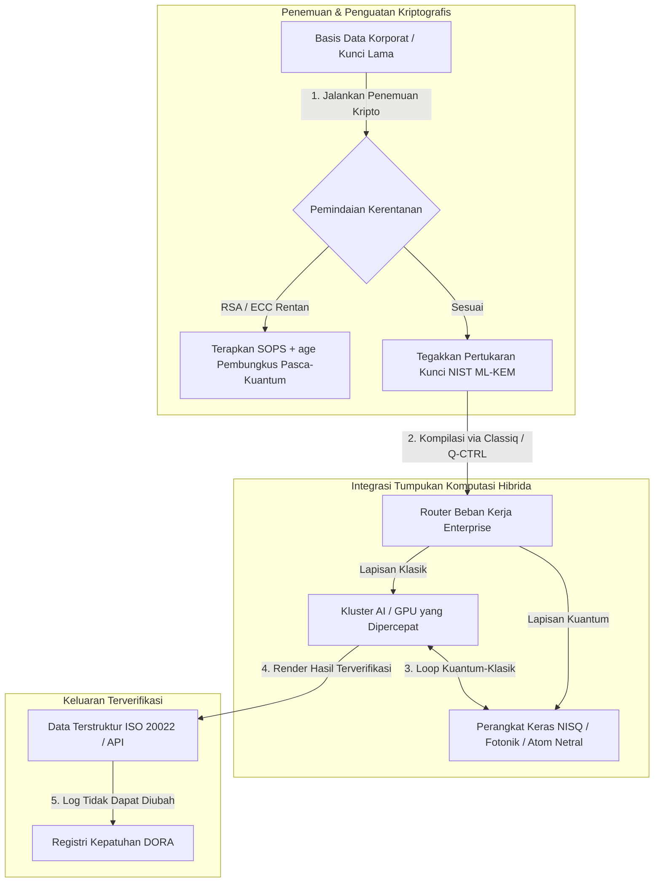

---

# Front Matter (YAML)

author: "contact@sebastienrousseau.com (Sebastien Rousseau)"
banner_alt: "Tampilan panggung dari KTT Commercialising Quantum Global 2026 Tahunan ke-5 Economist Impact di London — melambangkan transisi teknologi kuantum dari riset fisika menjadi alur kerja siap-enterprise"
banner_height: "1597"
banner_width: "2584"
banner: "https://cloudcdn.pro/stocks/images/sebastien-rousseau-20260617-5th-commercialising-quantum-2.webp"
cdn: "https://cloudcdn.pro"
charset: "UTF-8"
cname: "sebastienrousseau.com"
copyright: "© Hak Cipta 2025 - 2026 - Sebastien Rousseau. Seluruh hak cipta dilindungi."
date: "17 Juni 2026"
description: "Wawasan ruang dewan dari KTT Commercialising Quantum Global 2026 Tahunan ke-5 Economist Impact — lonjakan pendanaan $1,3 miliar, tumpukan hibrida tanpa-penyesalan, urgensi migrasi kriptografi pasca-kuantum, komersialisasi penginderaan kuantum, dan arahan HSBC bahwa menunggu adalah kesalahan yang tidak terpaksa."
format-detection: "telephone=no"
hreflang: "id"
icon: "https://cloudcdn.pro/clients/sebastienrousseau/v1/logos/sebastienrousseau.svg"
id: "https://sebastienrousseau.com/2026-06-17-economist-commercialising-quantum-summit-2026"
image_alt: "Potret Hitam Putih Sebastien Rousseau"
image_height: "162"
image_width: "162"
image: "https://cloudcdn.pro/stocks/images/sebastien-rousseau.png"
keywords: "Commercialising Quantum Global 2026, KTT Economist Impact, kriptografi pasca-kuantum, NIST ML-KEM, harvest-now decrypt-later, SNDL, HSBC kuantum, Philip Intallura, penginderaan kuantum, navigasi independen GPS, NQCC, EU Quantum Act, Quantcore, hadiah qBIG, Lord Vallance, hibrida kuantum-klasik, DORA Pasal 6"
language: "id-ID"
last_reviewed: "2026-06-17"
layout: "report"
locale: "id_ID"
logo_alt: "Logo Sebastien Rousseau"
logo_height: "44"
logo_width: "44"
logo: "https://cloudcdn.pro/clients/sebastienrousseau/v1/logos/sebastienrousseau.svg"
menu: ""
measurementID: "G-169G4ET5HQ"
name: "Sebastien Rousseau"
permalink: "https://sebastienrousseau.com/2026-06-17-economist-commercialising-quantum-summit-2026"
rating: "general"
referrer: "no-referrer"
robots: "index, follow"
schema: "FAQPage, Article"
seo_title: "Commercialising Quantum 2026: Wawasan Ruang Dewan"
short_name: "sebastienrousseau"
subtitle: "Kuantum telah beralih dari sains laboratorium spekulatif menjadi alur kerja enterprise hibrida; ruang dewan harus merespons pendanaan $1,3 miliar pada 2026, migrasi pasca-kuantum yang segera, dan arahan HSBC untuk berhenti menunggu."
tags: "kuantum, kriptografi pasca-kuantum, NIST ML-KEM, harvest-now decrypt-later, penginderaan kuantum, HSBC, Economist Impact, komputasi hibrida, DORA, EU Quantum Act, NQCC, wawasan KTT"
theme-color: "0, 83, 191"
title: "Dari Qubit ke Profit: Wawasan Strategis dari KTT Commercialising Quantum Global 2026 Tahunan ke-5 Economist"
url: "https://sebastienrousseau.com/2026-06-17-economist-commercialising-quantum-summit-2026"
viewport: "width=device-width, initial-scale=1, shrink-to-fit=no"

# RSS - The RSS feed front matter (YAML).
atom_link: "https://sebastienrousseau.com/2026-06-17-economist-commercialising-quantum-summit-2026/rss.xml"
category: "Teknologi"
docs: https://validator.w3.org/feed/docs/rss2.html
generator: "Static Site Generator (SSG) (version 0.0.26)"
item_description: "Wawasan ruang dewan dari KTT Commercialising Quantum Global 2026 Tahunan ke-5 Economist Impact — lonjakan pendanaan $1,3 miliar, tumpukan hibrida tanpa-penyesalan, urgensi migrasi kriptografi pasca-kuantum, komersialisasi penginderaan kuantum, dan arahan HSBC bahwa menunggu adalah kesalahan yang tidak terpaksa."
item_guid: "https://sebastienrousseau.com/2026-06-17-economist-commercialising-quantum-summit-2026/rss.xml"
item_link: "https://sebastienrousseau.com/2026-06-17-economist-commercialising-quantum-summit-2026/rss.xml"
item_pub_date: "Wed, 17 Jun 2026 06:06:06 +0000"
item_title: "Dari Qubit ke Profit: Wawasan Strategis dari KTT Commercialising Quantum Global 2026 Tahunan ke-5 Economist"
last_build_date: "Wed, 17 Jun 2026 06:06:06 +0000"
managing_editor: "contact@sebastienrousseau.com (Sebastien Rousseau)"
pub_date: "Wed, 17 Jun 2026 06:06:06 +0000"
ttl: "60"
type: "article"
webmaster: "contact@sebastienrousseau.com"

# Apple - The Apple front matter (YAML).
apple_mobile_web_app_orientations: "portrait"
apple_touch_icon_sizes: "192x192"
apple-mobile-web-app-capable: "yes"
apple-mobile-web-app-status-bar-inset: "black"
apple-mobile-web-app-status-bar-style: "black-translucent"
apple-mobile-web-app-title: "Commercialising Quantum 2026: Wawasan Ruang Dewan"
apple-touch-fullscreen: "yes"

# MS Application - The MS Application front matter (YAML).

msapplication-navbutton-color: "0, 83, 191"

# Twitter Card - The Twitter Card front matter (YAML).

twitter_card: "summary_large_image"
twitter_creator: "@wwdseb"
twitter_description: "Wawasan ruang dewan dari KTT Commercialising Quantum Global 2026 Tahunan ke-5 Economist Impact — lonjakan pendanaan $1,3 miliar, tumpukan hibrida tanpa-penyesalan, urgensi migrasi kriptografi pasca-kuantum, komersialisasi penginderaan kuantum, dan arahan HSBC bahwa menunggu adalah kesalahan yang tidak terpaksa."
twitter_image: "https://cloudcdn.pro/clients/sebastienrousseau/v1/logos/sebastienrousseau.svg"
twitter_image_alt: "Logo Sebastien Rousseau"
twitter_site: "@wwdseb"
twitter_title: "Commercialising Quantum 2026: Wawasan Ruang Dewan"
twitter_url: "https://sebastienrousseau.com/2026-06-17-economist-commercialising-quantum-summit-2026"

excerpt: "KTT Commercialising Quantum Global 2026 Tahunan ke-5 Economist Impact mengonfirmasi pivot kuantum ke alur kerja enterprise: $1,3 miliar terkumpul dalam lima bulan, kriptografi pasca-kuantum kini menjadi isu fidusia tingkat dewan di bawah pemanenan SNDL, penginderaan kuantum sudah dikirim hari ini untuk navigasi independen GPS, dan Philip Intallura dari HSBC menyampaikan arahan bahwa menunggu perangkat keras toleran-kesalahan adalah kesalahan yang tidak terpaksa."

# Humans.txt - The Humans.txt front matter (YAML).
author_website: "https://sebastienrousseau.com"
author_twitter: "@wwdseb"
author_location: "London, UK"
thanks: "Terima kasih telah membaca!"
site_last_updated: "2026-06-17"
site_standards: "HTML5, CSS3, RSS, Atom, JSON, XML, YAML, Markdown, TOML"
site_components: "Kaishi, Kaishi Builder, Kaishi CLI, Kaishi Templates, Kaishi Themes"
site_software: "Static Site Generator, Rust"

---

# Dari Qubit ke Profit: Wawasan Strategis dari KTT Commercialising Quantum Global 2026 Tahunan ke-5 Economist

Kesiapan enterprise, migrasi kriptografi pasca-kuantum, tumpukan komputasi hibrida, serta lanskap komersial yang muncul dari penginderaan dan jaringan kuantum.

**Ringkasan.** Konferensi Commercialising Quantum Global 2026 Tahunan ke-5, yang diselenggarakan oleh Economist Impact pada 16–17 Juni 2026 di Business Design Centre London, mengumpulkan lebih dari 1.100 pemimpin global lintas enterprise, keuangan, kebijakan, dan riset. Tema sentral menandai pivot struktural yang jelas: teknologi kuantum telah beralih dari sains laboratorium spekulatif menjadi alur kerja enterprise hibrida yang praktis. Didukung oleh modal ventura sebesar $1,3 miliar yang terkumpul hanya pada lima bulan pertama 2026, diskusi ruang dewan tidak lagi berfokus pada penghitungan qubit fisik, melainkan pada pembangunan tumpukan komputasi hibrida "tanpa-penyesalan", pengamanan aset digital terhadap ancaman kriptografis "harvest-now, decrypt-later" (SNDL), dan penerapan sistem penginderaan kuantum jangka pendek untuk navigasi independen GPS.

## Poin Utama

- **Pergeseran enterprise ke alur kerja praktis.** Para pemimpin industri ([Steve Suarez](https://www.linkedin.com/in/stevesuarez) dari HorizonX, [Phil Intallura](https://www.linkedin.com/in/intallura) dari HSBC) menekankan bahwa integrasi kuantum tidak lagi merupakan masalah fisika, melainkan operasional. Bank dan enterprise sedang menerapkan uji coba hibrida kuantum-klasik untuk menyiapkan talenta dan mengoptimalkan beban kerja aktif.
- **Kriptografi pasca-kuantum (PQC) adalah prioritas dewan.** Pakar keamanan dan hukum (CMS UK, [Joanne Miller](https://www.linkedin.com/in/joanne-miller-nso) dari Microsoft, [Craig Farrell](https://www.linkedin.com/in/craig-farrell) dari EY) memperingatkan bahwa organisasi tidak dapat menunggu perangkat keras toleran-kesalahan untuk menerapkan PQC. Pemanenan "harvest-now, decrypt-later" sedang terjadi hari ini, sehingga migrasi ke standar NIST ML-KEM menjadi kewajiban fidusia yang segera.
- **Penginderaan kuantum memimpin profitabilitas jangka pendek.** Meski komputasi toleran-kesalahan masih bertahun-tahun lagi, penginderaan kuantum ([Matthew Kinsella](https://www.linkedin.com/in/matthewkinsella) dari Infleqtion) sedang berskala cepat. Jam kuantum dan sensor inersial sedang diterapkan dalam navigasi independen GPS, keamanan nasional, dan jaringan energi ultra-stabil.
- **Kedaulatan, kluster, dan urgensi kebijakan.** Menteri Sains Inggris [Lord Vallance](https://www.linkedin.com/in/patrick-vallance) dan [Lord William Hague](https://www.linkedin.com/in/williamhague) menguraikan misi nasional untuk mengonversi riset menjadi "supercluster" berskala industri yang berkoordinasi dengan National Quantum Computing Centre (NQCC). EU Quantum Act yang akan datang semakin menggarisbawahi perlombaan geopolitik untuk kapasitas komputasi berdaulat.
- **Quantcore memenangkan hadiah qBIG.** Spin-out University of Glasgow, Quantcore, mengamankan hadiah IOP qBIG untuk terobosan komponen superkonduktor berbasis niobium, yang beroperasi pada suhu lebih tinggi daripada material tradisional, sehingga secara signifikan mengurangi overhead infrastruktur kriogenik.

**Bacaan terkait:** [KyberLib dan Migrasi Perbankan Pasca-Kuantum pada 2026: Dari Standar ke Kode](https://sebastienrousseau.com/2026-06-12-kyberlib-post-quantum-banking-migration-standards-code-2026/), [Indeks Ketahanan Perbankan pada 2026: AI, Cloud, Kuantum, Pembayaran, dan Risiko Konsentrasi Pihak Ketiga](https://sebastienrousseau.com/2026-06-08-banking-resilience-index-ai-cloud-quantum-payments-third-party-risk-2026/), [Indeks Perbankan Cloud Native pada 2026: DORA, Rekayasa Platform, Cloud Berdaulat, dan Ketahanan Operasional](https://sebastienrousseau.com/2026-06-05-cloud-native-banking-index-dora-resilience-platform-engineering-2026/).

## 01. Mengapa KTT 2026 Penting bagi Ruang Dewan

Edisi 2026 KTT Commercialising Quantum Global Economist menandai pergeseran permanen dalam cara dunia korporat mengevaluasi teknologi mendalam.

Secara historis, komputasi kuantum diserahkan kepada departemen R&D sebagai upaya ilmiah multi-dekade. Pada Juni 2026, perspektif ini usang. Organisasi harus beralih dari rasa ingin tahu "berpusat pada fisika" menjadi implementasi "berpusat pada bisnis". Alasannya ada dua:

1. **Konvergensi kuantum-AI.** Tumpukan high-performance computing (HPC) sedang menggabungkan node klasik, AI yang dipercepat, dan NISQ (Noisy Intermediate-Scale Quantum) ke dalam satu lapisan komputasi terpadu. Organisasi yang menunda pembangunan aplikasi siap-kuantum akan menemukan bahwa jendela untuk meraih keunggulan strategis menutup lebih cepat dari yang diperkirakan.
2. **Urgensi geopolitik dan fidusia.** Dengan program kuantum berbasis misi Inggris dan EU Quantum Act yang akan datang, kapasitas kuantum telah menjadi persoalan kedaulatan nasional dan kontinuitas korporat.

Lebih jauh, keamanan siber pasca-kuantum bukan lagi persyaratan kepatuhan masa depan. Ancaman serangan "store now, decrypt later" (SNDL) yang dilakukan oleh pelaku jahat berarti data korporat yang dicegat hari ini akan didekripsi ketika sistem kuantum komersial berskala, menciptakan liabilitas langsung di bawah mandat ketahanan operasional global seperti Digital Operational Resilience Act (DORA).

## 02. Lensa Strategis Commercialising Quantum 2026

Para pemimpin teknologi enterprise harus memetakan kematangan kuantum di lima lapisan operasional yang berbeda, mengevaluasi cakrawala waktu dan risiko neraca.

### Tabel 1: Lensa strategis Commercialising Quantum 2026

| Lapisan | Fokus korporat | Cakrawala waktu | Risiko korporat utama |
| :---- | :---- | :---- | :---- |
| **Perangkat keras & kompiler** | Memilih di antara pendekatan yang bersaing (superkonduktor, ion terjebak, atom netral, fotonik) | 3 – 5 tahun (toleransi kesalahan) | Terkunci pada arsitektur buntu atau mendukung satu platform terlalu dini. |
| **Penguatan kriptografis** | Penemuan dan inventarisasi dependensi kriptografis; migrasi ke NIST ML-KEM | Segera (migrasi aktif) | Pelanggaran data sistemik dan kegagalan kepatuhan di bawah DORA dan NIST CSF 2.0. |
| **Penginderaan kuantum** | Penerapan navigasi independen GPS, jam ultra-stabil, dan gravimeter | 1 – 2 tahun (komersial segera) | Disrupsi operasional logistik, pelayaran, dan jaringan energi akibat jamming GPS. |
| **Integrasi sistem** | Menghubungkan perangkat keras kuantum ke pusat data HPC dan superkomputer klasik yang ada | 1 – 3 tahun (fase hibrida) | Latensi tinggi, hambatan transfer data, dan silo komputasi yang terfragmentasi. |
| **Perangkat lunak enterprise** | Mengekspos algoritma kuantum melalui lapisan abstraksi tingkat tinggi dan API (Classiq, Q-CTRL) | Segera (pembangunan keterampilan) | Isolasi talenta dan alur kerja dari eksekusi rekayasa aktual. |

## 03. Sinyal Utama Kuantum dan Pemicu Ruang Dewan

Para pemimpin teknologi harus memantau metrik pasar dan regulasi yang spesifik dan terukur untuk memandu investasi kuantum mereka.

### Tabel 2: Sinyal utama kuantum dan pemicu ruang dewan

| Sinyal | Metrik kuantitatif | Rujukan regulasi / kebijakan | Prioritas platform yang dapat ditindaklanjuti |
| :---- | :---- | :---- | :---- |
| **Lonjakan pendanaan kuantum** | $1,3 miliar terkumpul global pada lima bulan pertama 2026 | Return on Resilience (RoR) | Geser anggaran dari uji coba spekulatif ke beban kerja hibrida kuantum-klasik "tanpa-penyesalan". |
| **Eksposur dekripsi data** | 100% data terenkripsi yang ditransmisikan melalui saluran publik terpapar pemanenan SNDL | DORA Pasal 6 (Keamanan TIK) | Terapkan alat penemuan kriptografis untuk mengidentifikasi kunci RSA/ECC rentan di seluruh estat. |
| **Infrastruktur berdaulat** | Alokasi £2,5 miliar UK National Quantum Strategy | UK Quantum Missions / Lord Vallance | Bangun kemitraan lokal dengan supercluster nasional seperti NQCC. |
| **Tenggat kepatuhan** | Cutover alamat terstruktur SWIFT 14 November 2026 | Direktif SWIFT SR 2026 | Bersihkan dan format basis data antarbank untuk memenuhi spesifikasi XML terstruktur. |

## 04. Penyelaman Mendalam ke Tema Inti KTT

### Kuantum mencapai titik balik investasi

Pendanaan modal ventura telah mengalami akselerasi signifikan, mengumpulkan **$1,3 miliar** hanya pada lima bulan pertama 2026. Tidak seperti siklus hype spekulatif tahun-tahun sebelumnya, gelombang modal saat ini didukung oleh beban kerja jangka pendek dan dunia nyata. Para pembicara dari Classiq dan IBM Quantum Platform mendemonstrasikan bagaimana lapisan abstraksi perangkat lunak dan kompiler otomatis memungkinkan tim pengembang non-spesialis untuk mengeksekusi algoritma hibrida kuantum-klasik di atas infrastruktur klasik saat ini. Strategi "tanpa-penyesalan" ini memungkinkan organisasi membangun talenta dan alur kerja siap-kuantum dengan segera.

### Peringatan hukum dan regulasi tentang "harvest now, decrypt later"

Para mitra hukum dan eksekutif keamanan siber memicu keterlibatan besar seputar kedekatan risiko data. Perwakilan dari firma hukum sponsor CMS UK dan CSO Microsoft [Joanne Miller](https://www.linkedin.com/in/joanne-miller-nso) menyampaikan peringatan tajam kepada manajemen senior: *menunggu kedatangan perangkat keras toleran-kesalahan sebelum menerapkan kriptografi pasca-kuantum adalah kegagalan fidusia yang kritis.*

Di bawah paradigma "store now, decrypt later" (SNDL), pelaku bermusuhan sedang aktif memanen data korporat terenkripsi hari ini dengan niat mendekripsinya segera setelah komputer kuantum yang relevan secara kriptografis muncul. Organisasi harus menerapkan perlindungan pasca-kuantum (seperti NIST ML-KEM) dengan segera untuk melindungi dataset sensitif berumur panjang, kekayaan intelektual, dan catatan pelanggan historis.

### Penyelarasan ulang hype "penginderaan kuantum"

Meskipun komputasi kuantum toleran-kesalahan masih bertahun-tahun lagi, KTT menyoroti penginderaan kuantum sebagai gelombang pertama penerapan dunia nyata yang benar-benar menguntungkan. CEO [Matthew Kinsella](https://www.linkedin.com/in/matthewkinsella) dari Infleqtion memaparkan secara terperinci bagaimana jam kuantum, sensor inersial, dan sistem radio-frekuensi sedang berskala cepat di berbagai industri.

Karena teknologi ini mengukur konstanta fisik dengan presisi sub-atomik, mereka memungkinkan **navigasi independen GPS**, jaringan energi ultra-stabil, dan telekomunikasi luar angkasa. Aplikasi ini sangat relevan untuk penerbangan, transportasi maritim, dan sistem pertahanan nasional yang menghadapi ancaman jamming GPS yang meningkat.

### Kolaborasi ekosistem dan kluster

Ekosistem kuantum Inggris memanfaatkan KTT London untuk memamerkan supercluster inovasi domestik. Pembaruan langsung dari National Quantum Computing Centre (NQCC) dan Digital Catapult merinci bagaimana spin-out deep-tech tahap awal dapat menjembatani "kesenjangan teknologi" dengan mengintegrasikan perangkat keras kuantum langsung ke pusat data superkomputer klasik.

[Wridhdhisom Karar](https://www.linkedin.com/in/wridhdhisomkarar), co-founder startup kuantum Skotlandia Quantcore, menerima hadiah bergengsi Institute of Physics (IOP) Quantum Business Innovation and Growth (qBIG) untuk komponen superkonduktor berbasis niobium milik perusahaan. Komponen ini beroperasi pada suhu lebih tinggi daripada material tradisional, sehingga secara signifikan mengurangi overhead infrastruktur kriogenik yang dibutuhkan untuk menskalakan prosesor kuantum.

### Studi kasus HSBC: mengapa menunggu kuantum adalah "kesalahan yang tidak terpaksa"

Wawasan dari [**Philip Intallura, Ph.D.**](https://www.linkedin.com/in/intallura) (Global Head of Quantum Technologies di HSBC, Penasihat Pemerintah Inggris, dan Penasihat Dewan) pada Acara Commercialising Quantum Tahunan ke-5 Economist (2026) menyampaikan arahan ruang dewan yang kuat: *"Menunggu kuantum toleran-kesalahan sebelum Anda mulai adalah kesalahan yang tidak terpaksa."*

Dr Intallura berpendapat bahwa pendekatan "tunggu-dan-lihat" yang umum di kalangan institusi keuangan adalah gol bunuh diri yang dibangun di atas tiga asumsi yang salah:

- **ROI jangka pendek itu nyata.** Dalam pengujian empiris, HSBC telah mengungguli model yang saat ini berjalan di produksi, menghubungkan pekerjaan kuantum ke bagian lain bisnis, menggunakan kuantum untuk memperdalam hubungan dengan beberapa klien terbesarnya, dan menarik bisnis baru yang signifikan ke **HSBC Innovation Banking**.
- **Kuantum adalah kurva adopsi yang curam.** Membangun kapabilitas, menetapkan strategi, mengamankan pendanaan, dan menjalankan siklus eksperimen di dalam organisasi yang sangat teregulasi bukan usaha singkat. Proses harus diuji dan diadaptasi secara sistematis untuk teknologi ini.
- **Kuantum adalah ekosistem.** Tidak ada pemain tunggal yang sampai di sana sendirian. Setiap makalah riset, POC, dan uji coba yang dijalankan HSBC telah dilakukan dalam kolaborasi erat dengan penyedia kuantum — dan dalam beberapa kasus, kolaborasi meluas ke akademisi, regulator, dan pemerintah.

**Arahan ruang dewan penutup:** *"Kapabilitas yang Anda butuhkan pada hari pertama toleransi kesalahan adalah kapabilitas yang Anda bangun sekarang."*

## 05. Pipeline Integrasi Kuantum Korporat dan Kriptografi

Untuk mengamankan aset digital sambil membangun kesiapan kuantum, enterprise harus menetapkan pipeline integrasi yang jelas.

## 06. Buku Pegangan Ruang Dewan: Imperatif yang Dapat Ditindaklanjuti

Untuk menerjemahkan wawasan KTT Commercialising Quantum Global 2026 menjadi nilai bisnis langsung, manajemen senior harus melaksanakan buku pegangan ruang dewan empat-langkah berikut:

1. **Wajibkan penemuan kriptografis.** Arahkan Chief Information Security Officer (CISO) untuk mengatalogkan semua aset kriptografis, memetakan setiap kunci RSA dan ECC lama di seluruh enterprise untuk mempersiapkan migrasi pasca-kuantum.
2. **Terapkan strategi hibrida "tanpa-penyesalan".** Hindari menunggu perangkat keras yang sempurna. Investasikan dalam perangkat lunak yang terinspirasi kuantum dan uji coba hibrida klasik-kuantum untuk mengembangkan talenta in-house dan mengoptimalkan logistik kompleks atau portofolio risiko hari ini.
3. **Evaluasi penginderaan kuantum untuk logistik.** Jika organisasi Anda bergantung pada rantai pasokan global, pelayaran, atau infrastruktur kritis, evaluasi secara aktif sistem penginderaan kuantum (seperti navigasi independen GPS) untuk memitigasi risiko disrupsi geopolitik.
4. **Daftar untuk Insight Hour 30 Juni.** Pastikan para pemimpin teknologi Anda mendaftar untuk **Commercialising Quantum Global Insight Hour** virtual pada 30 Juni 2026 pukul 15:00 BST (didukung oleh IonQ) untuk terus melacak strategi manajemen risiko enterprise dan alokasi talenta.

## 07. Pertanyaan yang Sering Diajukan

**Apa itu "harvest now, decrypt later" (SNDL) dan mengapa hal ini penting hari ini?**
SNDL adalah praktik mencegat dan menyimpan data terenkripsi hari ini, dengan niat untuk mendekripsinya nanti setelah komputer kuantum yang relevan secara kriptografis tersedia. Dataset sensitif berumur panjang — kekayaan intelektual, catatan pelanggan, komunikasi pemerintah — sudah menjadi sasaran. Migrasi ke NIST ML-KEM adalah keputusan fidusia yang tidak dapat ditunda oleh dewan.

**Mengapa penginderaan kuantum menjadi gelombang komersial pertama, bukan komputasi?**
Sensor kuantum mengukur konstanta fisik dengan presisi sub-atomik dan tidak memerlukan perangkat keras toleran-kesalahan yang dibutuhkan komputasi kuantum. Jam kuantum, gravimeter, dan sensor inersial sudah berada dalam penerapan uji coba untuk navigasi independen GPS, jaringan energi ultra-stabil, dan komunikasi luar angkasa.

**Apakah pekerjaan kuantum HSBC hanya R&D atau telah memberikan imbal hasil terukur?**
Menurut Philip Intallura pada KTT, HSBC telah mengungguli model yang saat ini berjalan di produksi, menggunakan kuantum untuk memperdalam hubungan dengan klien terbesarnya, dan menarik bisnis baru yang signifikan ke HSBC Innovation Banking. Pekerjaan ini telah beralih dari riset menjadi integrasi operasional.

## 08. Referensi

- **Economist Impact, (2026).** *5th Annual Commercialising Quantum Global 2026.* Risalah konferensi langsung, 16–17 Juni 2026. London: Business Design Centre. Tersedia di: [Economist Impact](https://events.economist.com/commercialising-quantum/).
- **National Institute of Standards and Technology (NIST), (2024).** *First Three Finalized Post-Quantum Encryption Standards (FIPS 203, 204, and 205).* Gaithersburg: U.S. Department of Commerce. Tersedia di: [NIST Standards](https://www.nist.gov/news-events/news/2024/08/nist-releases-first-3-finalized-post-quantum-encryption-standards).
- **European Parliament and Council of the European Union, (2022).** *Regulation (EU) 2022/2554 on digital operational resilience for the financial sector (DORA).* Brussels: Official Journal of the European Union. Tersedia di: [DORA Regulation](https://eur-lex.europa.eu/legal-content/EN/TXT/?uri=CELEX%3A32022R2554).
- **SWIFT, (2024).** *ISO 20022 November 2026 Structured Address Milestone.* La Hulpe: SWIFT. Tersedia di: [SWIFT ISO 20022 milestone](https://www.swift.com/standards/iso-20022/iso-20022-bytes/call-action-november-2026).
