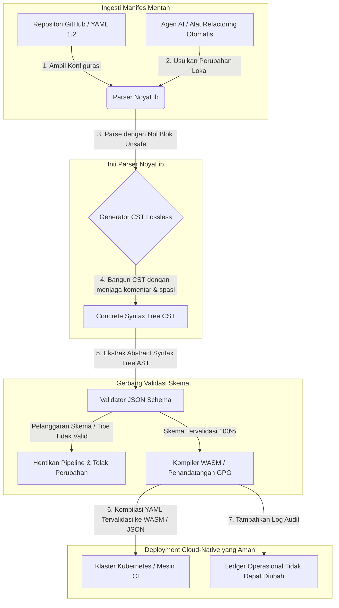

---

# Front Matter (YAML)

author: "contact@sebastienrousseau.com (Sebastien Rousseau)"
banner_alt: "Geometri arsitektural di bawah cahaya dramatis — melambangkan peran NoyaLib sebagai parser YAML Rust yang aman dan menahan beban di balik CI, Kubernetes, MCP, dan konfigurasi layanan keuangan"
banner_height: "1597"
banner_width: "2584"
banner: "https://cloudcdn.pro/stocks/images/ken-cheung-KonWFWUaAuk.webp"
cdn: "https://cloudcdn.pro"
charset: "UTF-8"
cname: "sebastienrousseau.com"
copyright: "© Hak Cipta 2025 - 2026 - Sebastien Rousseau. Seluruh hak cipta dilindungi."
date: "June 18, 2026"
description: "NoyaLib, parser YAML 1.2 Rust nol-unsafe dengan kepatuhan spesifikasi 406/406, validasi JSON Schema, CST lossless, dan binding MCP/WASM."
format-detection: "telephone=no"
hreflang: "id"
icon: "https://cloudcdn.pro/clients/sebastienrousseau/v1/logos/sebastienrousseau.svg"
id: "https://sebastienrousseau.com/2026-06-18-noyalib-safe-yaml-rust-ai-mcp-financial-infrastructure-2026"
image_alt: "Potret Hitam Putih Sebastien Rousseau"
image_height: "162"
image_width: "162"
image: "https://cloudcdn.pro/stocks/images/sebastienrousseau.webp"
keywords: "parser YAML Rust lebih aman, NoyaLib, kepatuhan spesifikasi YAML 1.2, Rust nol-unsafe, validasi JSON Schema, Concrete Syntax Tree lossless, CST, MCP, Model Context Protocol, WebAssembly, manifes Kubernetes, konfigurasi CI/CD, DORA Pasal 5, BCBS 239, risiko operasional Basel III, infrastruktur keuangan, keamanan konfigurasi, rantai pasok perangkat lunak"
language: "id-ID"
last_reviewed: "2026-06-18"
layout: "report"
locale: "id_ID"
logo_alt: "Logo Sebastien Rousseau"
logo_height: "44"
logo_width: "44"
logo: "https://cloudcdn.pro/clients/sebastienrousseau/v1/logos/sebastienrousseau.svg"
menu: ""
measurementID: "G-169G4ET5HQ"
name: "Sebastien Rousseau"
permalink: "https://sebastienrousseau.com/2026-06-18-noyalib-safe-yaml-rust-ai-mcp-financial-infrastructure-2026"
rating: "general"
referrer: "no-referrer"
robots: "index, follow"
schema: "FAQPage, Article"
seo_title: "Parser YAML Rust Lebih Aman untuk AI, MCP & Keuangan"
short_name: "sebastienrousseau"
subtitle: "Tumpukan YAML Rust yang lebih aman — NoyaLib — mengubah YAML 1.2 dari markup sederhana menjadi bidang kendali konfigurasi yang aman secara kriptografis dan patuh spesifikasi untuk agen AI, MCP, Kubernetes, dan infrastruktur layanan keuangan."
tags: "parser YAML Rust lebih aman, NoyaLib, YAML 1.2, Rust nol-unsafe, JSON Schema, MCP, WebAssembly, Kubernetes, DORA, BCBS 239, Basel III, infrastruktur keuangan, keamanan rantai pasok"
theme-color: "0, 83, 191"
title: "Mengapa YAML Membutuhkan Tumpukan Rust yang Lebih Aman untuk AI, MCP, dan Infrastruktur Keuangan pada 2026"
url: "https://sebastienrousseau.com/2026-06-18-noyalib-safe-yaml-rust-ai-mcp-financial-infrastructure-2026"
viewport: "width=device-width, initial-scale=1, shrink-to-fit=no"

# RSS - The RSS feed front matter (YAML).
atom_link: "https://sebastienrousseau.com/2026-06-18-noyalib-safe-yaml-rust-ai-mcp-financial-infrastructure-2026/rss.xml"
category: "Teknologi"
docs: https://validator.w3.org/feed/docs/rss2.html
generator: "Static Site Generator (SSG) (version 0.0.26)"
item_description: "NoyaLib, parser YAML 1.2 Rust nol-unsafe dengan kepatuhan spesifikasi 406/406, validasi JSON Schema, CST lossless, dan binding MCP/WASM."
item_guid: "https://sebastienrousseau.com/2026-06-18-noyalib-safe-yaml-rust-ai-mcp-financial-infrastructure-2026/rss.xml"
item_link: "https://sebastienrousseau.com/2026-06-18-noyalib-safe-yaml-rust-ai-mcp-financial-infrastructure-2026/rss.xml"
item_pub_date: "Thu, 18 Jun 2026 06:06:06 +0000"
item_title: "Mengapa YAML Membutuhkan Tumpukan Rust yang Lebih Aman untuk AI, MCP, dan Infrastruktur Keuangan pada 2026"
last_build_date: "Thu, 18 Jun 2026 06:06:06 +0000"
managing_editor: "contact@sebastienrousseau.com (Sebastien Rousseau)"
pub_date: "Thu, 18 Jun 2026 06:06:06 +0000"
ttl: "60"
type: "article"
webmaster: "contact@sebastienrousseau.com"

# Apple - The Apple front matter (YAML).
apple_mobile_web_app_orientations: "portrait"
apple_touch_icon_sizes: "192x192"
apple-mobile-web-app-capable: "yes"
apple-mobile-web-app-status-bar-inset: "black"
apple-mobile-web-app-status-bar-style: "black-translucent"
apple-mobile-web-app-title: "Parser YAML Rust Lebih Aman untuk AI, MCP & Keuangan"
apple-touch-fullscreen: "yes"

# MS Application - The MS Application front matter (YAML).

msapplication-navbutton-color: "0, 83, 191"

# Twitter Card - The Twitter Card front matter (YAML).

twitter_card: "summary_large_image"
twitter_creator: "@wwdseb"
twitter_description: "NoyaLib, parser YAML 1.2 Rust nol-unsafe dengan kepatuhan spesifikasi 406/406, validasi JSON Schema, CST lossless, dan binding MCP/WASM."
twitter_image: "https://cloudcdn.pro/clients/sebastienrousseau/v1/logos/sebastienrousseau.svg"
twitter_image_alt: "Logo Sebastien Rousseau"
twitter_site: "@wwdseb"
twitter_title: "Parser YAML Rust Lebih Aman untuk AI, MCP & Keuangan"
twitter_url: "https://sebastienrousseau.com/2026-06-18-noyalib-safe-yaml-rust-ai-mcp-financial-infrastructure-2026"

excerpt: "NoyaLib adalah tumpukan YAML Rust yang lebih aman — nol blok unsafe, kepatuhan spesifikasi YAML 1.2 406/406, Concrete Syntax Tree lossless, validasi JSON Schema (Draft 2020-12), dan binding MCP/WASM — direkayasa untuk agen AI, Kubernetes, CI/CD, dan bidang kendali konfigurasi di balik infrastruktur keuangan."

# Humans.txt - The Humans.txt front matter (YAML).
author_website: "https://sebastienrousseau.com"
author_twitter: "@wwdseb"
author_location: "London, UK"
thanks: "Terima kasih telah membaca!"
site_last_updated: "2026-06-18"
site_standards: "HTML5, CSS3, RSS, Atom, JSON, XML, YAML, Markdown, TOML"
site_components: "Kaishi, Kaishi Builder, Kaishi CLI, Kaishi Templates, Kaishi Themes"
site_software: "Static Site Generator, Rust"

---

# Mengapa YAML Membutuhkan Tumpukan Rust yang Lebih Aman untuk AI, MCP, dan Infrastruktur Keuangan pada 2026

Tumpukan YAML Rust yang lebih aman menjadi penting karena YAML kini menanggung pipeline CI/CD, manifes Kubernetes, aturan [Open Policy Agent](https://www.openpolicyagent.org/), dan registri perkakas Model Context Protocol (MCP) — dan satu parsing yang ambigu dapat mematahkan sistem kliring, salah mengonfigurasi grup keamanan, atau memberikan izin yang salah kepada agen AI lokal. [NoyaLib](https://github.com/sebastienrousseau/noyalib) adalah ekosistem parsing dan validasi [YAML 1.2](https://yaml.org/spec/1.2.2/) berbasis Rust murni, nol-unsafe, yang direkayasa agar infrastruktur tersebut aman secara default.

## Jawaban Singkat

**Apa itu NoyaLib dalam satu kalimat?** NoyaLib adalah ekosistem parser dan validasi YAML 1.2 berbasis Rust murni dan sumber terbuka dengan nol kode `unsafe`, kepatuhan spesifikasi 100% di seluruh suite resmi 406 tes YAML, Concrete Syntax Tree lossless, dan validasi [JSON Schema](https://json-schema.org/) waktu-nyata — direkayasa agar konfigurasi agen AI, MCP, Kubernetes, dan infrastruktur keuangan aman secara default.

## Ringkasan Eksekutif

YAML terlihat sederhana hingga parsing yang ambigu atau pelanggaran skema mematahkan sistem kliring produksi senilai miliaran dolar. Pada 2026, YAML adalah standar de-facto untuk pipeline [CI/CD](https://docs.github.com/en/actions/learn-github-actions/workflow-syntax-for-github-actions), manifes [Kubernetes](https://kubernetes.io/docs/concepts/configuration/overview/), aturan [Open Policy Agent](https://www.openpolicyagent.org/), dan registri perkakas Model Context Protocol (MCP). Parser warisan yang tidak transparan — dengan kerentanan memori dan parsing destruktif — adalah risiko keamanan yang tidak dapat diterima. NoyaLib adalah ekosistem YAML 1.2 berbasis Rust murni, nol-unsafe: kepatuhan spesifikasi 100% di seluruh 406 tes suite resmi, Concrete Syntax Tree (CST) lossless yang mempertahankan komentar dan spasi, serta validasi JSON Schema bawaan. Hasilnya adalah YAML yang dibentuk ulang sebagai bidang kendali konfigurasi yang dapat diaudit, aman, dan dapat diakses oleh agen.

## Poin Utama

- **Konfigurasi adalah kode produksi.** Satu berkas YAML yang salah bentuk dapat mengonfigurasi grup keamanan cloud-native atau izin agen AI secara salah. NoyaLib memperlakukan YAML sebagai infrastruktur kritis.
- **Desain nol-unsafe.** Dibangun seluruhnya dalam Rust aman dengan nol blok `unsafe`, NoyaLib menghilangkan kerentanan keamanan memori — buffer overflow, remote code execution — di lapisan parsing inti.
- **Kepatuhan spesifikasi mutlak 406/406.** Memvalidasi struktur konfigurasi secara matematis, menghilangkan ketidaksesuaian parsing dan pergeseran struktural antara lingkungan staging dan produksi.
- **Concrete Syntax Tree lossless.** Tidak seperti parser warisan yang membuang komentar dan format, NoyaLib mempertahankan spasi dan anotasi, memungkinkan refactoring otomatis bolak-balik yang aman oleh agen AI.
- **Nilai fidusia tingkat dewan.** Menghubungkan integritas konfigurasi dengan [DORA Pasal 5](https://eur-lex.europa.eu/legal-content/EN/TXT/?uri=CELEX%3A32022R2554) dan metrik modal risiko operasional [Basel III](https://www.bis.org/bcbs/publ/d424.htm), secara langsung melindungi manajemen senior dari liabilitas pribadi.

**Bacaan terkait:** [KyberLib dan Migrasi Perbankan Pasca-Kuantum pada 2026: Dari Standar ke Kode](https://sebastienrousseau.com/2026-06-12-kyberlib-post-quantum-banking-migration-standards-code-2026/), [Indeks Perbankan Cloud Native pada 2026: DORA, Rekayasa Platform, Cloud Berdaulat, dan Ketahanan Operasional](https://sebastienrousseau.com/2026-06-05-cloud-native-banking-index-dora-resilience-platform-engineering-2026/), [Dotfiles Sadar-AI pada 2026: Membangun Workstation Pengembang yang Aman dan Reproducible untuk MCP, SLSA, dan Paritas Multi-Shell](https://sebastienrousseau.com/2026-06-16-ai-aware-dotfiles-secure-reproducible-workstation-2026/).

## 01. Mengapa Tumpukan YAML Rust yang Lebih Aman Penting pada 2026

Pada Juni 2026, infrastruktur TI enterprise sangat terdistribusi dan semakin terotomatisasi.

YAML secara diam-diam telah menjadi bahasa konfigurasi yang menahan beban untuk seluruh tumpukan rekayasa perangkat lunak. Ia membawa alur kerja continuous integration (CI) yang mengompilasi artefak produksi, manifes [Kubernetes](https://kubernetes.io/docs/concepts/overview/) yang mengorkestrasi klaster cloud-native global, dan skema server [Model Context Protocol](https://modelcontextprotocol.io/) (MCP) yang memberikan agen AI lokal izin untuk mengeksekusi operasi lokal.

Parser YAML warisan — [PyYAML](https://pyyaml.org/), [yaml-cpp](https://github.com/jbeder/yaml-cpp), [libyaml](https://github.com/yaml/libyaml) — membawa dua risiko struktural:

1. **Kerentanan pemaksaan tipe ("Norway problem").** Parser warisan sering memaksa string tanpa tanda kutip (kode negara `NO` menjadi boolean `false`, `yes`/`no` serupa) — lihat [tag boolean YAML 1.1 vs 1.2](https://yaml.org/type/bool.html) — menyebabkan kegagalan sistem kritis atau salah konfigurasi keamanan diam-diam.
2. **Eksploitasi keamanan memori.** Parser tidak transparan yang ditulis dalam C/C++ menderita eksploitasi kebocoran memori dan buffer overflow, yang dapat menyebabkan remote code execution (RCE) pada server build inti.

[NoyaLib](https://github.com/sebastienrousseau/noyalib) menyelesaikan tantangan ini. Ia adalah ekosistem parsing dan validasi YAML 1.2 berbasis Rust murni, nol-unsafe. Dengan mencapai kepatuhan spesifikasi mutlak 406/406 dan menegakkan validasi JSON Schema yang ketat langsung selama parsing, NoyaLib memberikan **Return on Resilience (RoR)** yang tinggi — mencegah downtime yang diinduksi konfigurasi dan mengamankan rantai pasok perangkat lunak kelas keuangan.

## 02. Lensa Arsitektur NoyaLib 2026

Ekosistem NoyaLib beroperasi sebagai parser konfigurasi yang aman dan lossless. Setiap manifes lokal dan cloud divalidasi secara struktural dan dilindungi pada lapisan eksekusi terendah.

### Tabel 1: Lapisan arsitektur NoyaLib dan mitigasi risiko

| Lapisan | Keputusan desain | Mengapa penting | Risiko jika salah ditangani |
| ---- | ---- | ---- | ---- |
| **Lapisan parser** | Parser berbasis Rust murni yang patuh YAML 1.2 dengan nol blok `unsafe` | Menghilangkan kerentanan keamanan memori dan buffer overflow pada lapisan eksekusi terendah. | Remote code execution (RCE) pada server build inti. |
| **Lapisan konformansi** | Kepatuhan 100% di seluruh 406/406 tes suite resmi YAML 1.2 | Menghilangkan ketidaksesuaian parsing dan pergeseran pemaksaan tipe antara staging dan produksi. | Kesalahan pemaksaan tipe "Norway problem" yang menonaktifkan grup keamanan. |
| **Lapisan pohon sintaks** | Concrete Syntax Tree (CST) lossless | Mempertahankan komentar, spasi, dan urutan selama parsing bolak-balik dan refactoring terprogram. | Refactoring AI otomatis yang menghancurkan anotasi pengembang. |
| **Lapisan validasi** | Validasi [JSON Schema (Draft 2020-12)](https://json-schema.org/draft/2020-12/release-notes) selama parsing | Menegakkan model data ketat pada berkas konfigurasi sebelum mencapai klaster produksi. | Berkas konfigurasi yang salah bentuk memicu crash klaster cloud-native. |
| **Lapisan antarmuka** | Binding WebAssembly (WASM) dan MCP | Memungkinkan validasi konfigurasi berjalan langsung di dalam browser, edge node, dan toolkit agen lokal. | Silo perkakas di mana validasi tidak dapat dieksekusi pada perangkat edge. |

## 03. Sinyal Utama Keamanan Workstation dan Konfigurasi

Untuk menjaga keamanan mutlak di seluruh estat pengembangan dan operasi, Chief Information Security Officer (CISO) harus memantau metrik yang spesifik dan terkuantifikasi.

### Tabel 2: Sinyal keamanan workstation dan konfigurasi

| Sinyal | Metrik / tolok ukur operasional | Rujukan NIST CSF / DORA | Implementasi platform teknis |
| ---- | ---- | ---- | ---- |
| **Konformansi parser** | Tingkat lulus 100% di seluruh suite tes resmi YAML 1.2 (406/406 tes). | [DORA Pasal 6](https://eur-lex.europa.eu/legal-content/EN/TXT/?uri=CELEX%3A32022R2554) (keamanan TIK) | Inti parser NoyaLib memvalidasi semua manifes sebelum eksekusi CI. |
| **Profil keamanan memori** | Nol blok `unsafe` Rust di dalam parser dan dependensi serializer. | DORA Pasal 30 (rantai pasok) | Pemeriksaan kompiler otomatis ([`forbid(unsafe_code)`](https://doc.rust-lang.org/reference/attributes/diagnostics.html#the-forbid-attribute)) dalam build cargo. |
| **Validasi skema** | 100% berkas konfigurasi yang di-parse diverifikasi terhadap model [JSON Schema](https://json-schema.org/) yang valid. | [NIST CSF 2.0](https://www.nist.gov/cyberframework) (PR.DS-01) | Gerbang validasi waktu-nyata menghentikan pipeline build pada pelanggaran skema. |
| **Pergeseran konfigurasi** | Deteksi dan pemulihan waktu-nyata berkas konfigurasi lokal ke status terversi-git. | Return on Resilience (RoR) | Telemetri berkelanjutan mencatat semua modifikasi berkas lokal. |
| **Kendali akses agen** | Izin terbatas dan hanya-baca untuk perkakas AI lokal yang beroperasi melalui konfigurasi MCP. | Manajemen risiko model ([SR 11-7](https://www.federalreserve.gov/supervisionreg/srletters/sr1107.htm)) | Batas server MCP membatasi operasi agen pada direktori yang disetujui. |

## 04. Kekeliruan Parsing Konfigurasi yang Tidak Transparan

Kerentanan besar dalam operasi cloud-native adalah *parsing tidak transparan* — menggunakan parser yang membuang metadata struktural (komentar, spasi, urutan dokumen) atau memaksa tipe diam-diam selama kompilasi. Perilaku ini memperkenalkan dua risiko keamanan berat:

1. **Refactoring destruktif.** Ketika asisten coding AI atau alat refactoring otomatis memperbarui manifes deployment, parser tradisional membuang komentar dan format pengembang, menghancurkan konteks yang dibutuhkan untuk tinjauan manusia dan forensik pasca-insiden.
2. **Ketidaksesuaian parsing.** Jika lingkungan staging menggunakan parser berbasis Python dan produksi menjalankan parser berbasis C, perbedaan kecil dalam kepatuhan spesifikasi YAML 1.2 dapat menyebabkan manifes staging yang valid gagal atau berperilaku berbeda di produksi, menciptakan kerentanan keamanan tersembunyi.

**Concrete Syntax Tree (CST) lossless** NoyaLib menyelesaikan ini. Ia mempertahankan setiap spasi, komentar, dan baris dokumen selama loop parse-dan-serialisasi. Asisten AI otomatis dapat mengedit, melakukan refactor, dan men-commit berkas konfigurasi sambil mempertahankan 100% anotasi yang ditulis manusia — jejak audit yang mutlak.

## 05. Merancang Pipeline Konfigurasi AI yang Terbatas

Untuk mencegah perubahan konfigurasi berbahaya mencapai lingkungan produksi, organisasi harus mengimplementasikan pipeline konfigurasi yang terbatas ketat dan tervalidasi skema.

Alur operasional di bawah ini menunjukkan bagaimana NoyaLib mem-parse YAML mentah, membangun CST lossless, memvalidasi AST terhadap model JSON Schema, dan mengompilasi binding WebAssembly untuk lingkungan browser atau edge.

## 06. Buku Pegangan Ruang Dewan dan Liabilitas Fidusia

Keamanan konfigurasi dan integritas rantai pasok perangkat lunak adalah prioritas ruang dewan yang kritis. Manajer senior harus mendekati manajemen konfigurasi melalui lensa tugas fidusia dan ketahanan operasional.

- **DORA Pasal 5 (akuntabilitas dewan).** Mendikte bahwa dewan menanggung tanggung jawab akhir, yang tidak dapat didelegasikan, atas manajemen risiko TIK institusi. Karena berkas konfigurasi mengendalikan grup keamanan cloud-native kritis dan jalur perutean pembayaran, dewan harus memverifikasi bahwa sistem yang mem-parse manifes ini aman-memori dan sepenuhnya patuh-spesifikasi untuk memenuhi audit regulasi. ([Regulation (EU) 2022/2554](https://eur-lex.europa.eu/legal-content/EN/TXT/?uri=CELEX%3A32022R2554))
- **BCBS 239 (agregasi dan pelaporan data risiko).** Mensyaratkan bahwa pelaporan risiko dan metrik infrastruktur akurat, lengkap, dan dihasilkan di bawah kendali kualitas data yang ketat. NoyaLib mendukung BCBS 239 dengan mem-parse dan memvalidasi berkas konfigurasi terhadap skema ketat di sumbernya, mencegah kebocoran data diam-diam atau pemadaman yang diinduksi salah konfigurasi. ([standar BCBS 239](https://www.bis.org/publ/bcbs239.htm))
- **Mitigasi beban modal risiko operasional (Basel III).** Pemadaman yang diinduksi konfigurasi secara langsung menggelembungkan beban modal risiko operasional di bawah Basel III, mengikat modal neraca. Menstandardisasi tumpukan konfigurasi enterprise pada parser berbasis Rust murni yang aman seperti NoyaLib meminimalkan risiko ini, melestarikan modal dan melindungi kepercayaan pelanggan. ([standar Basel III](https://www.bis.org/bcbs/publ/d424.htm))

## 07. Apa Artinya Menurut Tipe Bank

### Bank yang Penting Secara Sistemik Global (G-SIB)

G-SIB mengelola ribuan microservices dan pipeline deployment di berbagai yurisdiksi. Tantangan utama mereka adalah menjaga konsistensi konfigurasi dan mencegah pergeseran keamanan di seluruh estat cloud-native yang masif. Menstandardisasi pada tumpukan YAML Rust yang lebih aman seperti NoyaLib menjamin bahwa semua manifes Kubernetes, pipeline CI/CD, dan kebijakan keamanan di-parse dan divalidasi di bawah kerangka kerja seragam dan aman-memori — menghilangkan risiko konfigurasi "snowflake" yang tidak diaudit.

### Bank transaksi dan korporasi

Bank transaksi mengoperasikan gerbang pembayaran sensitif dan infrastruktur kliring grosir. Membuktikan keamanan mutlak kode dan konfigurasi yang dideploy ke lingkungan produksi ini adalah tuntutan regulasi yang tidak dapat dinegosiasikan. Mengintegrasikan NoyaLib menjamin rantai pasok perangkat lunak sepenuhnya diaudit, lossless, dan dilindungi dari kerentanan parsing — kontrol yang memetakan dengan rapi ke DORA Pasal 6 dan bagian 6 [PCI DSS v4.0](https://www.pcisecuritystandards.org/document_library/).

### Bank regional dan kecil

Bank regional harus mempertahankan standar keamanan siber yang tinggi tanpa anggaran teknologi berskala G-SIB. Kerangka kerja NoyaLib yang sumber terbuka memberikan solusi ramah-Rust yang ringan, hemat biaya, dan sangat aman, memungkinkan institusi yang lebih kecil mengimplementasikan keamanan konfigurasi dan perlindungan rantai pasok kelas enterprise tanpa biaya lisensi proprietari.

## 08. Kesimpulan: Peta Jalan Keamanan Konfigurasi

Konfigurasi workstation pengembang dan infrastruktur cloud-native adalah bidang kendali kritis dalam rantai pasok perangkat lunak. Mengizinkan berkas konfigurasi yang tidak diaudit, ambigu, atau tidak aman mencapai aset korporat adalah risiko operasional dan regulasi yang tidak dapat diterima.

Untuk mengamankan rantai pasok perangkat lunak dan melindungi endpoint dari kerentanan konfigurasi, manajer teknologi dan keamanan senior harus mengeksekusi peta jalan pengembangan yang jelas hari ini:

1. **Wajibkan konfigurasi deklaratif.** Hapuskan secara bertahap penyesuaian konfigurasi manual yang tidak diaudit dan wajibkan agar semua manifes dikelola sebagai sistem catatan deklaratif yang terkontrol versi.
2. **Tegakkan validasi skema.** Tegakkan pre-commit hook ketat dan utilitas pemindaian untuk memastikan semua berkas konfigurasi divalidasi terhadap model JSON Schema yang valid sebelum deployment.
3. **Implementasikan round-tripping lossless.** Pastikan semua asisten coding AI otomatis dan alat refactoring menggunakan parsing lossless untuk mempertahankan komentar, spasi, dan konteks pengembang.
4. **Amankan rantai pasok.** Pastikan semua setup konfigurasi dan utilitas parsing diverifikasi secara kriptografis menggunakan pustaka berbasis Rust murni dan nol-unsafe seperti NoyaLib sebelum eksekusi. ([kerangka kerja SLSA](https://slsa.dev/))

## 09. Pertanyaan yang Sering Diajukan

**Apa itu NoyaLib dan mengapa ia digunakan untuk parsing YAML?**
NoyaLib adalah parser YAML 1.2 sumber terbuka, berbasis Rust murni, dan nol-unsafe. Ia mencapai kepatuhan spesifikasi 100% di seluruh suite resmi 406 tes, menegakkan validasi [JSON Schema](https://json-schema.org/) yang ketat selama parsing, dan mengekspos binding WASM dan [MCP](https://modelcontextprotocol.io/) — menjadikannya tumpukan YAML Rust yang lebih aman untuk agen AI, Kubernetes, dan infrastruktur keuangan.

**Mengapa desain nol-unsafe penting untuk parsing konfigurasi?**
Kerentanan keamanan memori — buffer overflow, use-after-free — di dalam parser warisan yang ditulis dalam C/C++ dapat menyebabkan remote code execution pada server build inti. Desain berbasis Rust murni NoyaLib dengan [`#![forbid(unsafe_code)]`](https://doc.rust-lang.org/reference/attributes/diagnostics.html#the-forbid-attribute) menghilangkan kerentanan ini secara matematis pada waktu kompilasi.

**Apa itu Concrete Syntax Tree (CST) lossless dan mengapa penting?**
Parser tradisional membuang komentar dan format, membuat pengeditan otomatis oleh agen AI menjadi destruktif. Concrete Syntax Tree lossless NoyaLib mempertahankan setiap komentar, spasi, dan baris dokumen — sehingga asisten AI dapat dengan aman mengedit dan merefactor berkas konfigurasi sambil menjaga konteks pengembang, forensik pasca-insiden, dan jejak audit tetap utuh.

**Bagaimana NoyaLib memetakan ke DORA, BCBS 239, dan Basel III?**
DORA Pasal 5 menempatkan akuntabilitas risiko TIK pada dewan; BCBS 239 menuntut kendali kualitas data pada pelaporan risiko; Basel III mengenakan beban modal risiko operasional. NoyaLib memasok lapisan parse aman-memori dan tervalidasi skema yang dibutuhkan regulasi tersebut untuk konfigurasi sebagai kode — membuat pemetaan regulasi menjadi sederhana dan beban modal risiko operasional menjadi lebih kecil.

## 10. Referensi

- **YAML, (2026).** *Spesifikasi YAML 1.2*. Tersedia di: [Spesifikasi YAML 1.2](https://yaml.org/spec/1.2.2/).
- **JSON Schema, (2026).** *Catatan rilis JSON Schema Draft 2020-12*. Tersedia di: [JSON Schema Draft 2020-12](https://json-schema.org/draft/2020-12/release-notes).
- **European Parliament and Council of the European Union, (2022).** *Regulation (EU) 2022/2554 on digital operational resilience for the financial sector (DORA)*. Brussels: Official Journal of the European Union. Tersedia di: [Regulasi DORA](https://eur-lex.europa.eu/legal-content/EN/TXT/?uri=CELEX%3A32022R2554).
- **Basel Committee on Banking Supervision, (2013).** *Principles for effective risk data aggregation and risk reporting (BCBS 239)*. Basel: Bank for International Settlements. Tersedia di: [standar BCBS 239](https://www.bis.org/publ/bcbs239.htm).
- **Basel Committee on Banking Supervision, (2017).** *Basel III: finalising post-crisis reforms*. Basel: Bank for International Settlements. Tersedia di: [standar Basel III](https://www.bis.org/bcbs/publ/d424.htm).
- **Anthropic, (2025).** *Spesifikasi Model Context Protocol (MCP)*. Tersedia di: [Model Context Protocol](https://modelcontextprotocol.io/).
- **GitHub, (2026).** *Repositori sumber terbuka noyalib*. Tersedia di: [Repositori NoyaLib](https://github.com/sebastienrousseau/noyalib).
