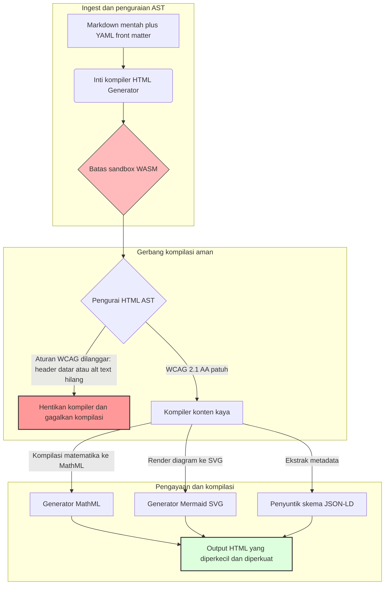

---

# Front Matter (YAML)

author: "contact@sebastienrousseau.com (Sebastien Rousseau)"
banner_alt: "Geometri arsitektur di bawah cahaya terstruktur — melambangkan peran HTML Generator sebagai pipeline Markdown-ke-HTML yang dikontrol kompiler untuk infrastruktur penerbitan yang aksesibel, siap SEO, dan tersandbox"
banner_height: "1597"
banner_width: "2584"
banner: "https://cloudcdn.pro/api/transform?url=/stocks/images/markus-winkler-IrRbSND5EUc-unsplash.webp&w=1200&format=webp&q=80"
cdn: "https://cloudcdn.pro"
charset: "UTF-8"
cname: "sebastienrousseau.com"
copyright: "© Copyright 2025 - 2026 - Sebastien Rousseau. All rights reserved."
date: "June 20, 2026"
description: "HTML Generator adalah pustaka Rust murni yang mengubah Markdown menjadi HTML berkepatuhan WCAG, siap SEO, dan diperkaya JSON-LD — aksesibilitas-sebagai-kode, dukungan MathML dan Mermaid, serta eksekusi tersandbox WebAssembly untuk penerbitan korporat yang aman."
format-detection: "telephone=no"
hreflang: "id"
icon: "https://cloudcdn.pro/clients/sebastienrousseau/v1/logos/sebastienrousseau.svg"
id: "https://sebastienrousseau.com/2026-06-20-html-generator-accessible-seo-structured-markdown-rust-2026"
image_alt: "Potret Hitam Putih Sebastien Rousseau"
image_height: "162"
image_width: "162"
image: "https://cloudcdn.pro/stocks/images/sebastien-rousseau.png"
keywords: "html-generator, Rust Markdown ke HTML, aksesibilitas sebagai kode, WCAG 2.1 AA, HTML siap SEO, JSON-LD, MathML, Mermaid, WebAssembly, EAA, DORA, ADA Title III, penerbitan aksesibel, penguraian tersandbox, open source"
language: "id-ID"
last_reviewed: "2026-06-20"
layout: "report"
locale: "id_ID"
logo_alt: "Logo Sebastien Rousseau"
logo_height: "44"
logo_width: "44"
logo: "https://cloudcdn.pro/clients/sebastienrousseau/v1/logos/sebastienrousseau.svg"
menu: ""
measurementID: "G-169G4ET5HQ"
name: "Sebastien Rousseau"
permalink: "https://sebastienrousseau.com/2026-06-20-html-generator-accessible-seo-structured-markdown-rust-2026"
rating: "general"
referrer: "no-referrer"
robots: "index, follow"
schema: "FAQPage, Article"
seo_title: "Aksesibilitas-sebagai-Kode: Markdown ke HTML AAA dengan Rust 2026"
short_name: "sebastienrousseau"
subtitle: "Mentransformasi penerbitan web korporat, dokumentasi produk, dan portal klien dari berkas teks tidak aksesibel menjadi aset digital yang sangat terstruktur, patuh regulasi, dan tersandbox."
tags: "html-generator, Rust, Markdown, aksesibilitas, WCAG, SEO, JSON-LD, MathML, Mermaid, WebAssembly, EAA, DORA, ADA, AI-discovery, RAG, open source, infrastruktur perbankan"
theme-color: "0, 83, 191"
title: "Mengubah Markdown Menjadi HTML Aksesibel, Siap SEO, dan Terstruktur dengan Rust di 2026"
url: "https://sebastienrousseau.com/2026-06-20-html-generator-accessible-seo-structured-markdown-rust-2026"
viewport: "width=device-width, initial-scale=1, shrink-to-fit=no"

# RSS - The RSS feed front matter (YAML).
atom_link: "https://sebastienrousseau.com/2026-06-20-html-generator-accessible-seo-structured-markdown-rust-2026/rss.xml"
category: "Technology"
docs: https://validator.w3.org/feed/docs/rss2.html
generator: "Static Site Generator (SSG) (version 0.0.40)"
item_description: "HTML Generator adalah pustaka Rust murni yang mengubah Markdown menjadi HTML berkepatuhan WCAG, siap SEO, dan diperkaya JSON-LD — aksesibilitas-sebagai-kode, dukungan MathML dan Mermaid, serta eksekusi tersandbox WebAssembly untuk penerbitan korporat yang aman."
item_guid: "https://sebastienrousseau.com/2026-06-20-html-generator-accessible-seo-structured-markdown-rust-2026/rss.xml"
item_link: "https://sebastienrousseau.com/2026-06-20-html-generator-accessible-seo-structured-markdown-rust-2026/rss.xml"
item_pub_date: "Sat, 20 Jun 2026 06:06:06 +0000"
item_title: "Mengubah Markdown Menjadi HTML Aksesibel, Siap SEO, dan Terstruktur dengan Rust di 2026"
last_build_date: "Sat, 20 Jun 2026 06:06:06 +0000"
managing_editor: "contact@sebastienrousseau.com (Sebastien Rousseau)"
pub_date: "Sat, 20 Jun 2026 06:06:06 +0000"
ttl: "60"
type: "article"
webmaster: "contact@sebastienrousseau.com"

# Apple - The Apple front matter (YAML).
apple_mobile_web_app_orientations: "portrait"
apple_touch_icon_sizes: "192x192"
apple-mobile-web-app-capable: "yes"
apple-mobile-web-app-status-bar-inset: "black"
apple-mobile-web-app-status-bar-style: "black-translucent"
apple-mobile-web-app-title: "Markdown ke HTML AAA dengan Rust"
apple-touch-fullscreen: "yes"

# MS Application - The MS Application front matter (YAML).

msapplication-navbutton-color: "0, 83, 191"

# Twitter Card - The Twitter Card front matter (YAML).

twitter_card: "summary_large_image"
twitter_creator: "@wwdseb"
twitter_description: "HTML Generator adalah pustaka Rust murni yang mengubah Markdown menjadi HTML berkepatuhan WCAG, siap SEO, dan diperkaya JSON-LD — aksesibilitas-sebagai-kode, dukungan MathML dan Mermaid, serta eksekusi tersandbox WebAssembly untuk penerbitan korporat yang aman."
twitter_image: "https://cloudcdn.pro/clients/sebastienrousseau/v1/logos/sebastienrousseau.svg"
twitter_image_alt: "Logo Sebastien Rousseau"
twitter_site: "@wwdseb"
twitter_title: "Aksesibilitas-sebagai-Kode: Markdown ke HTML AAA dengan Rust"
twitter_url: "https://sebastienrousseau.com/2026-06-20-html-generator-accessible-seo-structured-markdown-rust-2026"

# Humans.txt - The Humans.txt front matter (YAML).
author_website: "https://sebastienrousseau.com"
author_twitter: "@wwdseb"
author_location: "London, UK"
thanks: "Terima kasih telah membaca!"
site_last_updated: "2026-06-20"
site_standards: "HTML5, CSS3, RSS, Atom, JSON, XML, YAML, Markdown, TOML"
site_components: "Kaishi, Kaishi Builder, Kaishi CLI, Kaishi Templates, Kaishi Themes"
site_software: "Static Site Generator, Rust"

---

# Mengubah Markdown Menjadi HTML Aksesibel, Siap SEO, dan Terstruktur dengan Rust di 2026

<!-- lead-start -->
<aside class="post-lead" aria-label="Ringkasan artikel">

<strong>TL;DR.</strong> HTML Generator adalah kompiler Markdown-ke-HTML berbasis Rust murni yang menegakkan WCAG 2.1 AA pada waktu kompilasi, menyuntikkan JSON-LD yang sesuai skema, merender MathML dan Mermaid SVG secara native, serta mengisolasi penguraian di dalam sandbox WebAssembly — mengubah penerbitan menjadi bidang kontrol yang dikontrol kompiler untuk aksesibilitas, SEO, dan keamanan TIK.

<strong>Poin utama</strong>

<ul class="post-lead-takeaways">
  <li><strong>Jawaban singkat.</strong> Apa itu HTML Generator dalam satu kalimat?</li>
  <li><strong>Ringkasan eksekutif.</strong> Rendering Markdown tampak sepele; menghasilkan HTML bermutu penerbitan adalah masalah kepatuhan.</li>
  <li><strong>01. Mengapa kompiler HTML yang mengutamakan aksesibilitas penting di 2026.</strong> EAA dan ADA Title III telah mengubah aksesibilitas dari kebersihan rekayasa menjadi kewajiban fidusia.</li>
  <li><strong>02. Lensa arsitektur HTML Generator 2026.</strong> Pipeline kompilasi multi-tahap yang dikontrol kompiler dari Markdown mentah hingga output HTML yang diperkuat.</li>
</ul>

<strong>Bacaan terkait:</strong> <a href="https://sebastienrousseau.com/2026-06-18-noyalib-safe-yaml-rust-ai-mcp-financial-infrastructure-2026">Mengapa YAML Membutuhkan Stack Rust yang Lebih Aman untuk AI, MCP, dan Infrastruktur Keuangan di 2026</a>, <a href="https://sebastienrousseau.com/2026-06-17-static-site-generator-secure-default-ai-era-publishing-2026">Static Site Generator Aman-secara-Default untuk Penerbitan Era AI di 2026</a>, <a href="https://sebastienrousseau.com/2026-06-11-cloudcdn-open-source-blueprint-ai-native-edge-2026">CloudCDN: Cetak Biru Open-Source untuk Edge Native AI di 2026</a>.

</aside>
<!-- lead-end -->

Pada 2026, konten web dikonsumsi sama banyaknya oleh perayap pencarian AI, mesin pencari berbasis LLM, dan pipeline Retrieval-Augmented Generation (RAG) seperti halnya oleh pembaca manusia. HTML yang datar atau cacat mengganggu penguraian perayap, sementara kegagalan mematuhi regulasi global yang ketat seperti [European Accessibility Act (EAA)](https://www.accessibility-act.eu/) dan [US ADA Title III](https://www.ada.gov/topics/title-iii/) kini merupakan kewajiban perdata yang tidak ambigu. [HTML Generator](https://github.com/sebastienrousseau/html-generator) adalah pustaka Rust berkinerja tinggi yang dirancang untuk menutup kesenjangan tersebut — pada kompiler, bukan melalui tambalan pasca-penerapan.

## Jawaban singkat

**Apa itu HTML Generator dalam satu kalimat?** HTML Generator adalah kompiler Markdown-ke-HTML open-source berbasis Rust murni yang menegakkan [WCAG 2.1 AA](https://www.w3.org/TR/WCAG21/) pada waktu kompilasi, menghasilkan landmark semantik dan atribut ARIA secara otomatis, menyuntikkan metadata [JSON-LD](https://json-ld.org/) yang sesuai skema dari YAML front matter, merender diagram Mermaid dan matematika ke SVG dan MathML yang aksesibel, serta berjalan di dalam sandbox [WebAssembly](https://webassembly.org/) — mengubah penerbitan korporat menjadi bidang kontrol bermutu fidusia yang dikontrol kompiler.

## Ringkasan eksekutif

Rendering Markdown tampak sepele. HTML bermutu penerbitan adalah masalah kepatuhan. Pada Juni 2026, setiap titik sentuh korporat — portal hubungan investor, pengajuan regulasi, dokumentasi pelanggan, referensi API, aset pemasaran — diurai oleh manusia maupun mesin. Dua tekanan bertemu di setiap halaman: [EAA](https://www.accessibility-act.eu/) dan [ADA Title III](https://www.ada.gov/topics/title-iii/) menjadikan aksesibilitas sebagai eksposur hukum di tingkat dewan direksi, sementara pengumpulan data AI dan pipeline RAG memberi imbalan pada output yang terstruktur dan dapat dibaca mesin. Pustaka Markdown standar menghasilkan HTML datar yang gagal pada kedua gerbang tersebut. HTML Generator memperlakukan pembangkitan dokumen sebagai pipeline yang dikontrol kompiler: validasi WCAG adalah kesalahan kompilasi, JSON-LD berasal dari YAML front matter tanpa penandaan manual, MathML dan Mermaid dirender secara aksesibel, dan seluruh mesin dikirimkan sebagai target WebAssembly sehingga penguraian dokumen yang tidak tepercaya tetap tersandbox dari host.

## Poin utama

- **Aksesibilitas-sebagai-kode adalah standar baru.** EAA mewajibkan aksesibilitas untuk layanan digital konsumen. HTML Generator mengevaluasi pohon dokumen pada waktu kompilasi, menghasilkan landmark semantik dan atribut ARIA secara otomatis — lebih sedikit perbaikan pasca-penerapan, lebih sedikit anggaran remediasi, tidak ada alt-text yang hilang sampai ke produksi.
- **Data terstruktur untuk penemuan AI.** Pencarian modern dan RAG bergantung pada metadata yang dapat dibaca mesin. Kompiler mengurai YAML front matter dan menyuntikkan [JSON-LD yang sesuai Schema.org](https://schema.org/) langsung ke dalam kepala dokumen, membuat konten sepenuhnya dapat ditafsirkan oleh [Google Rich Results](https://developers.google.com/search/docs/appearance/structured-data/intro-structured-data), [Bing Webmaster](https://www.bing.com/webmasters), dan perayap berbasis LLM.
- **Keunggulan konten teknis.** Penerbitan teknis bukan sekadar teks datar. HTML Generator mengompilasi ekstensi matematika Markdown mentah menjadi [MathML](https://www.w3.org/Math/) yang aksesibel, dan merender diagram [Mermaid.js](https://mermaid.js.org/) ke SVG responsif — keduanya mempertahankan struktur berkepatuhan WCAG alih-alih menggantinya dengan gambar buram.
- **Sandboxing WebAssembly.** Mengurai Markdown yang tidak tepercaya adalah risiko keamanan. Dengan menargetkan [WASM](https://webassembly.org/), HTML Generator mengeksekusi di dalam sandbox terisolasi yang mencegah eksekusi kode arbitrer dan melindungi sistem host — secara langsung memenuhi kewajiban keamanan TIK [DORA Article 6](https://eur-lex.europa.eu/legal-content/EN/TXT/?uri=CELEX%3A32022R2554).
- **Perlindungan fidusia bagi dewan direksi.** Ketidakpatuhan teknis telah masuk ke ruang dewan. Standarisasi pada mesin HTML yang dikontrol kompiler melindungi direktur dan manajemen senior dari eksposur perdata dan regulasi pribadi berdasarkan DORA, EAA, dan ADA Title III.

**Bacaan terkait:** [Mengapa YAML Membutuhkan Stack Rust yang Lebih Aman untuk AI, MCP, dan Infrastruktur Keuangan di 2026](https://sebastienrousseau.com/2026-06-18-noyalib-safe-yaml-rust-ai-mcp-financial-infrastructure-2026/), [Static Site Generator Aman-secara-Default untuk Penerbitan Era AI di 2026](https://sebastienrousseau.com/2026-06-17-static-site-generator-secure-default-ai-era-publishing-2026/), [CloudCDN: Cetak Biru Open-Source untuk Edge Native AI di 2026](https://sebastienrousseau.com/2026-06-11-cloudcdn-open-source-blueprint-ai-native-edge-2026/).

## 01. Mengapa Kompiler HTML yang Mengutamakan Aksesibilitas Penting di 2026

Aset web korporat, perpustakaan dokumentasi, dan pusat bantuan produk adalah titik sentuh digital yang kritis. Ketiganya kini menghadapi dua tekanan intens yang saling berpotongan.

Yang pertama adalah **pengumpulan dan penemuan AI**. Konten semakin banyak diproses oleh model bahasa besar dan pipeline Retrieval-Augmented Generation. HTML yang datar atau cacat membingungkan penguraian perayap, membuat penelitian korporat dan dokumentasi tidak terlihat oleh paradigma pencarian modern — termasuk [Google Search Generative Experience](https://blog.google/products/search/generative-ai-search/), penelusuran [ChatGPT](https://chat.openai.com/), dan agen RAG perusahaan.

Yang kedua adalah **hukum aksesibilitas global yang ketat**. Berdasarkan [European Accessibility Act](https://www.accessibility-act.eu/) (berlaku penuh sejak Juni 2025) dan [US ADA Title III](https://www.ada.gov/topics/title-iii/), platform penerbitan korporat wajib menjamin aksesibilitas digital yang lengkap. Kegagalan memenuhi [WCAG 2.1 AA](https://www.w3.org/TR/WCAG21/) bukan lagi pengabaian rekayasa; ini adalah kewajiban perdata dan regulasi yang telah menghasilkan penyelesaian senilai jutaan dolar.

[HTML Generator](https://github.com/sebastienrousseau/html-generator) menangani kedua tekanan tersebut secara langsung. Ini adalah pustaka Rust thread-safe yang dirancang untuk mengubah Markdown menjadi HTML yang aksesibel, siap SEO, dan terstruktur. Dengan memperlakukan pembangkitan dokumen sebagai pipeline yang dikontrol kompiler, mesin ini memberikan **Return on Resilience (RoR)** yang tinggi — melindungi neraca dari litigasi aksesibilitas sekaligus memaksimalkan keterbacaan mesin untuk penemuan AI.

## 02. Lensa Arsitektur HTML Generator 2026

Kerangka kerja ini dirancang sebagai pipeline kompilasi multi-tahap yang aman, mengubah teks Markdown mentah menjadi aset statis yang terverifikasi secara kriptografis dan sangat aksesibel.

### Tabel 1: Lapisan arsitektur HTML Generator dan mitigasi risiko

| Lapisan | Keputusan desain | Mengapa penting | Risiko jika salah penanganan |
| ---- | ---- | ---- | ---- |
| **Lapisan masukan** | Pengurai Markdown plus YAML front matter | Bertemu penulis di mana mereka berada; memisahkan prosa dari metadata struktural. | Metadata tidak konsisten, peta situs rusak, kesenjangan pengindeksan. |
| **Lapisan struktur** | Daftar Isi otomatis dan landmark semantik dengan tag ARIA | Menghasilkan pohon dokumen yang dapat dinavigasi dan aksesibel secara konstruktif. | HTML datar yang merusak pembaca layar dan melanggar WCAG. |
| **Lapisan konten kaya** | Rendering MathML dan Mermaid.js SVG native | Mengompilasi rumus dan diagram ke SVG dan MathML yang aksesibel. | Lag rendering JS sisi klien dan output teknologi bantu yang rusak. |
| **Lapisan SEO dan data** | Pembangkitan JSON-LD terintegrasi dan metadata terstruktur | Menyuntikkan JSON-LD yang sesuai [Schema.org](https://schema.org/) langsung ke dalam kepala. | Mesin pencari dan perayap AI salah membaca pengarang, konteks, lisensi. |
| **Lapisan runtime** | Kompiler Rust native dengan target WebAssembly | Memungkinkan eksekusi tersandbox yang aman di server, node edge, dan browser. | Eksekusi kode arbitrer selama penguraian Markdown yang tidak tepercaya. |

## 03. Sinyal Keamanan Web dan Aksesibilitas Utama

Untuk memverifikasi bahwa aset penerbitan yang menghadap publik memenuhi audit regulasi dan keamanan modern, pejabat teknologi senior harus memantau metrik yang spesifik dan terukur.

### Tabel 2: Sinyal keamanan web dan aksesibilitas

| Sinyal | Metrik / tolok ukur operasional | Referensi EAA / DORA / W3C | Implementasi teknis |
| ---- | ---- | ---- | ---- |
| **Kepatuhan aksesibilitas** | 100% halaman yang dikompilasi divalidasi terhadap aturan WCAG 2.1 AA. | [EAA](https://www.accessibility-act.eu/) dan [ADA Title III](https://www.ada.gov/topics/title-iii/) | Pengurai HTML waktu kompilasi yang mengevaluasi tag alt gambar dan landmark semantik. |
| **Sandbox eksekusi WASM** | 100% masukan Markdown yang tidak tepercaya dikompilasi dalam runtime WebAssembly terisolasi. | [DORA Article 6](https://eur-lex.europa.eu/legal-content/EN/TXT/?uri=CELEX%3A32022R2554) (keamanan TIK) | Isolasi lingkungan penguraian dari server host. |
| **Cakupan metadata terstruktur** | 100% artikel yang diterbitkan disuntik dengan header JSON-LD yang valid dan sesuai skema. | Spesifikasi [Schema.org](https://schema.org/) | Penguraian front-matter otomatis dan konversi ke objek JSON-LD. |
| **Throughput kompilasi** | Target halaman per detik di atas 10.000 pada perangkat keras komoditas. | Return on Resilience (RoR) | Kompiler AST Rust yang sangat diparalelkan. |
| **Verifikasi cuplikan kaya** | Nol kesalahan penguraian pada pemeriksaan [Google Rich Results](https://search.google.com/test/rich-results) dan [Schema validator](https://validator.schema.org/). | Panduan Google Search | Validasi struktural JSON-LD yang dihasilkan selama pipeline kompilasi. |

## 04. Mitos Rendering Markdown yang Sederhana

Kesalahpahaman umum di kalangan manajer teknologi adalah bahwa mengubah Markdown ke HTML adalah latihan penggantian teks yang sederhana. Banyak pustaka standar menerjemahkan pemformatan Markdown menjadi HTML datar dan tidak terstruktur. Output dirender kepada pembaca berpandangan dalam browser, tetapi ini merupakan jebakan kepatuhan.

HTML datar biasanya kekurangan tiga hal.

1. **Hierarki heading yang benar.** Markdown standar tidak menegakkan urutan heading. Melompat dari `<h1>` ke `<h4>` melanggar WCAG 2.1 AA dan merusak navigasi dokumen untuk pembaca layar.
2. **Semantik tabel yang eksplisit.** Tabel Markdown standar jarang dirender dengan atribut cakupan `<th>` dan `<tbody>` yang benar yang diperlukan untuk penguraian aksesibel.
3. **Metadata yang dapat dibaca mesin.** HTML standar tidak memiliki kait JSON-LD yang diandalkan oleh platform pencarian AI modern dan sistem ingest RAG.

HTML Generator menyelesaikan ini dengan mengurai Markdown ke dalam **Abstract Syntax Tree (AST)**. Mesin ini mengevaluasi struktur dokumen sebelum menghasilkan HTML, memvalidasi penyarangan heading, menyuntikkan atribut ARIA yang sesuai, dan menegaskan bahwa setiap aset media memiliki teks alternatif — mengubah aksesibilitas dari audit manual menjadi invarian waktu kompilasi yang dijamin.

## 05. Merancang Pipeline Kompilasi Aksesibilitas-sebagai-Kode

Untuk mencegah aset yang tidak aksesibel atau tidak terindeks mencapai penerapan publik, aksesibilitas harus menjadi gerbang kompiler yang ketat. Pipeline berikut menunjukkan bagaimana HTML Generator mengevaluasi Markdown, menjalankan validasi terisolasi WebAssembly, dan menghasilkan HTML yang diperkuat dan terstruktur.

## 06. Panduan Ruang Dewan dan Kewajiban Fidusia

Kepatuhan aksesibilitas dan keamanan web modern adalah isu ruang dewan yang tidak dapat ditawar. Manajemen senior harus mendekati infrastruktur penerbitan melalui lensa risiko hukum, pemeliharaan keuangan, dan eksposur regulasi.

- **European Accessibility Act (EAA).** Memberlakukan mandat kepatuhan yang mengikat secara hukum pada portal digital publik dan swasta. Ketidakpatuhan dapat menghasilkan penalti keuangan yang berat, litigasi perdata, dan penarikan segera aset dari pasar EU. Dengan mengintegrasikan aksesibilitas-sebagai-kode, dewan dapat mensertifikasi bahwa kode yang tidak patuh tidak dapat dikirimkan — mengubah remediasi reaktif menjadi perisai hukum struktural.
- **DORA Article 6 (Lingkungan TIK yang Aman).** Menetapkan aturan ketat untuk keamanan lingkungan TIK. Dengan mengisolasi kompilasi Markdown di dalam sandbox WebAssembly, organisasi memastikan bahwa penguraian dokumentasi yang diunggah pelanggan atau umpan mitra tidak dapat mengekspos server host ke eksekusi kode arbitrer, melindungi portal perbankan kritis.
- **Pengurangan biaya audit kepatuhan.** Kepatuhan aksesibilitas tradisional bergantung pada audit pasca-penerapan retrospektif yang mahal — puluhan ribu dolar setiap tahun per situs. Mengimplementasikan validasi WCAG sebagai blok waktu kompilasi menghilangkan biaya retrospektif tersebut, menggeser anggaran kepatuhan dari pertahanan ke inovasi.

## 07. Apa Artinya Berdasarkan Jenis Bank / Perusahaan

### Bank Sistemik Penting Global (G-SIB)

G-SIB mengoperasikan aset publik multibahasa yang besar, menerbitkan ribuan makalah penelitian, pengungkapan regulasi, dan dokumen hubungan investor lintas berbagai yurisdiksi. Tantangan mereka adalah skala dan paritas multi-bahasa. Target WebAssembly HTML Generator dan mesin Rust throughput tinggi memungkinkan perpustakaan penelitian terlokalisasi skala besar untuk diperbarui, dikompilasi, dan diterapkan secara global dalam hitungan detik — tanpa lag rendering atau regresi aksesibilitas.

### Bank Transaksi dan Korporat

Bagi bank transaksi, portal pelanggan, hub dokumentasi, dan panduan API pengembang adalah titik sentuh digital yang kritis. Mengompilasi aset tersebut melalui HTML Generator berarti saluran yang menghadap klien tidak membawa eksposur XSS, tidak ada vektor pembajakan dependensi, dan tidak ada defisit aksesibilitas — mempertahankan kepercayaan institusional dan mengurangi permukaan litigasi.

### Bank Regional dan Fintech

Bank regional dan fintech yang gesit bersaing berdasarkan pengalaman digital tanpa anggaran rekayasa G-SIB. HTML Generator memberi tim-tim tersebut pipeline penerbitan bermutu enterprise secara langsung, memungkinkan aset yang lebih kecil mengirimkan aset aksesibel, siap SEO, dan tersandbox yang tahan terhadap pengawasan dari regulator maupun klien korporat potensial.

## 08. Peta Jalan Infrastruktur Penerbitan

Aset web yang menghadap publik korporat adalah komponen inti ketahanan operasional. Mengandalkan mesin web berbasis basis data yang lambat, rentan secara dinamis — atau aset statis yang tidak ditandatangani — adalah risiko bisnis yang tidak dapat diterima.

Untuk mengamankan titik sentuh digital publik dan melindungi neraca dari litigasi aksesibilitas, manajer teknologi dan keamanan senior harus melaksanakan peta jalan yang jelas.

1. **Transisi ke arsitektur statis.** Hentikan secara bertahap platform CMS dinamis lama untuk aset penelitian, pemasaran, dan dokumentasi. Pindahkan konten ke pipeline yang dikontrol kompiler seperti HTML Generator.
2. **Tegakkan aksesibilitas pada waktu kompilasi.** Implementasikan aksesibilitas-sebagai-kode. Gagalkan pipeline kompilasi secara otomatis pada setiap pelanggaran WCAG 2.1 AA.
3. **Isolasi penguraian di WebAssembly.** Sandbox semua penguraian dokumen dan konten di dalam runtime WASM sehingga masukan yang tidak tepercaya tidak pernah menyentuh sistem host.
4. **Suntikkan metadata JSON-LD yang kaya.** Pastikan setiap aset yang diterbitkan membawa header JSON-LD yang sesuai skema untuk memaksimalkan penemuan AI.

## 09. Pertanyaan yang Sering Diajukan

**Bagaimana HTML Generator menegakkan aksesibilitas?**

Ini mengurai Abstract Syntax Tree HTML yang dihasilkan pada waktu kompilasi, mengevaluasi dokumen terhadap aturan [WCAG 2.1 AA](https://www.w3.org/TR/WCAG21/). Jika aturan dilanggar — atribut alt yang hilang, lompatan heading, kontrol formulir tanpa label — kompiler menghentikan kompilasi, memperlakukan aksesibilitas sebagai invarian waktu kompilasi alih-alih tugas audit pasca-penerapan.

**Mengapa isolasi WebAssembly penting?**

[WebAssembly](https://webassembly.org/) memungkinkan mesin pengurai Markdown mengeksekusi di dalam sandbox terisolasi, terpisah dari server host. Bahkan ketika aktor jahat mengunggah dokumen Markdown yang dirancang untuk mengeksploitasi kerentanan pengurai, eksekusi terperangkap — melindungi sistem host dan memenuhi kewajiban keamanan TIK DORA Article 6.

**Bagaimana JSON-LD menguntungkan penemuan pencarian di 2026?**

[JSON-LD](https://json-ld.org/) menyediakan metadata terstruktur yang dapat dibaca mesin di kepala dokumen. [Google Rich Results](https://developers.google.com/search/docs/appearance/structured-data/intro-structured-data), perayap Bing, dan agen pencarian berbasis LLM mengidentifikasi pengarang, lisensi, tanggal publikasi, dan konteks semantik secara langsung — melewati ambiguitas HTML standar dan meningkatkan permukaan dalam penemuan berbasis AI.

**Siapa audiens HTML Generator?**

Pengembang situs statis, tim dokumentasi, penulis teknis, pengembang Rust, dan insinyur platform yang mengirimkan aset kritis aksesibilitas atau yang menghadap regulator. Ini juga merupakan lapisan pemrosesan konten yang layak di dalam pipeline penerbitan aman yang lebih besar seperti [Static Site Generator (SSG)](https://github.com/sebastienrousseau/static-site-generator).

## 10. Referensi

- World Wide Web Consortium (W3C), 2024. [Panduan Aksesibilitas Konten Web (WCAG) 2.1 ⧉](https://www.w3.org/TR/WCAG21/ "Web Content Accessibility Guidelines 2.1").
- Schema.org, 2026. [Spesifikasi data terstruktur Schema.org ⧉](https://schema.org/ "Schema.org structured-data specifications").
- Parlemen Eropa dan Dewan Uni Eropa, 2022. [Regulasi (EU) 2022/2554 tentang ketahanan operasional digital untuk sektor keuangan (DORA) ⧉](https://eur-lex.europa.eu/legal-content/EN/TXT/?uri=CELEX%3A32022R2554 "DORA Regulation").
- Komisi Eropa, 2025. [European Accessibility Act ⧉](https://www.accessibility-act.eu/ "European Accessibility Act").
- Departemen Kehakiman AS, 2024. [ADA Title III ⧉](https://www.ada.gov/topics/title-iii/ "ADA Title III").
- WebAssembly Community Group, 2026. [Spesifikasi WebAssembly ⧉](https://webassembly.org/ "WebAssembly").
- GitHub, 2026. [Repositori HTML Generator ⧉](https://github.com/sebastienrousseau/html-generator "HTML Generator open-source repository").

<!-- enrich-start -->
<aside class="author-card" aria-label="Tentang penulis"><strong class="author-card-name"><a href="/about/index.html">Sebastien Rousseau</a></strong>Teknolog perbankan senior yang menulis tentang AI terapan, infrastruktur pembayaran, uang yang ditokenisasi, ISO 20022, keamanan pasca-kuantum, layanan keuangan cloud-native, infrastruktur open-source, dan pasar digital yang diregulasi.20+ tahun di HSBC Commercial &amp; Investment Bank, PayPal, Barclays, Shazam, AKQA, Virgin Group. <a href="/about/index.html">Profil lengkap</a> &middot; <a href="https://www.linkedin.com/in/sebastienrousseau/" rel="external noopener">LinkedIn</a> &middot; <a href="https://github.com/sebastienrousseau" rel="external noopener">GitHub</a></aside>

Terakhir ditinjau <time datetime="2026-06-20">2026-06-20</time>.

<!-- enrich-end -->
