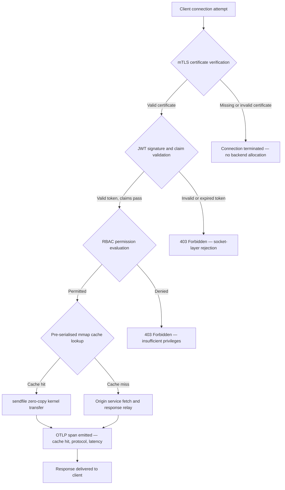

---

# Front Matter (YAML)

author: "contact@sebastienrousseau.com (Sebastien Rousseau)"
banner_alt: "Lanskap kota papan sirkuit abstrak di malam hari — memvisualisasikan tepi perbankan di mana transfer zero-copy tingkat kernel, jabat tangan mTLS, dan validasi JWT bertemu dalam satu biner yang ditautkan secara statis"
banner_height: "1597"
banner_width: "2584"
banner: "https://cloudcdn.pro/stocks/images/bit-cloud-GlqbGLCPnQ4.webp"
cdn: "https://cloudcdn.pro"
charset: "UTF-8"
cname: "sebastienrousseau.com"
copyright: "© Copyright 2025 - 2026 - Sebastien Rousseau. All rights reserved."
date: "June 20, 2026"
description: "http-handle adalah biner Rust yang ditautkan secara statis yang menghasilkan 180.000 permintaan per detik di tepi perbankan dengan nol ketergantungan runtime, validasi mTLS dan JWT terintegrasi, HTTP/2 dan HTTP/3 yang dinegosiasikan ALPN, dan observabilitas OTLP — menutup celah keamanan dan ketahanan yang ditinggalkan oleh Nginx dan Envoy."
format-detection: "telephone=no"
hreflang: "id"
icon: "https://cloudcdn.pro/clients/sebastienrousseau/v1/logos/sebastienrousseau.svg"
id: "https://sebastienrousseau.com/2026-06-20-http-handle-zero-dependency-edge-ingress-banking-rust-2026"
image_alt: "Potret Hitam Putih Sebastien Rousseau"
image_height: "162"
image_width: "162"
image: "https://cloudcdn.pro/stocks/images/sebastienrousseau.webp"
keywords: "http-handle, ingress tepi Rust, proksi tanpa ketergantungan, infrastruktur perbankan, mTLS JWT, sendfile zero-copy, ALPN HTTP3, kepatuhan DORA, Basel III, observabilitas OTLP, biner statis, perbankan ARM64, zero trust perbankan, ingress ringan, keamanan perbankan Rust"
language: "id-ID"
last_reviewed: "2026-06-20"
layout: "report"
locale: "id_ID"
logo_alt: "Logo untuk Sebastien Rousseau"
logo_height: "44"
logo_width: "44"
logo: "https://cloudcdn.pro/clients/sebastienrousseau/v1/logos/sebastienrousseau.svg"
menu: ""
measurementID: "G-169G4ET5HQ"
name: "Sebastien Rousseau"
permalink: "https://sebastienrousseau.com/2026-06-20-http-handle-zero-dependency-edge-ingress-banking-rust-2026"
rating: "general"
referrer: "no-referrer"
robots: "index, follow"
schema: "FAQPage, Article"
seo_title: "http-handle: Ingress Rust Tanpa Ketergantungan untuk Perbankan di 180k req/s"
short_name: "sebastienrousseau"
subtitle: "Bagaimana satu biner Rust yang ditautkan secara statis menghasilkan 180.000 permintaan per detik dengan mTLS, JWT, dan ALPN di tepi perbankan — dan apa artinya bagi kepatuhan DORA dan Basel III."
tags: "http-handle, Rust, banking, edge-ingress, mTLS, JWT, ALPN, HTTP3, DORA, Basel-III, zero-copy, sendfile, ARM64, zero-trust, OTLP, observability, open-source, infrastructure"
theme-color: "0, 83, 191"
title: "http-handle: Ingress Tepi Berkinerja Tinggi Tanpa Ketergantungan untuk Perbankan di 2026"
url: "https://sebastienrousseau.com/2026-06-20-http-handle-zero-dependency-edge-ingress-banking-rust-2026"
viewport: "width=device-width, initial-scale=1, shrink-to-fit=no"

# RSS - The RSS feed front matter (YAML).
atom_link: "https://sebastienrousseau.com/2026-06-20-http-handle-zero-dependency-edge-ingress-banking-rust-2026/rss.xml"
category: "Technology"
docs: https://validator.w3.org/feed/docs/rss2.html
generator: "Static Site Generator (SSG) (version 0.0.40)"
item_description: "http-handle adalah biner Rust yang ditautkan secara statis yang menghasilkan 180.000 permintaan per detik di tepi perbankan dengan nol ketergantungan runtime, validasi mTLS dan JWT terintegrasi, HTTP/2 dan HTTP/3 yang dinegosiasikan ALPN, dan observabilitas OTLP — menutup celah keamanan dan ketahanan yang ditinggalkan oleh Nginx dan Envoy."
item_guid: "https://sebastienrousseau.com/2026-06-20-http-handle-zero-dependency-edge-ingress-banking-rust-2026/rss.xml"
item_link: "https://sebastienrousseau.com/2026-06-20-http-handle-zero-dependency-edge-ingress-banking-rust-2026/rss.xml"
item_pub_date: "Sat, 20 Jun 2026 07:07:07 +0000"
item_title: "http-handle: Ingress Tepi Berkinerja Tinggi Tanpa Ketergantungan untuk Perbankan di 2026"
last_build_date: "Sat, 20 Jun 2026 07:07:07 +0000"
managing_editor: "contact@sebastienrousseau.com (Sebastien Rousseau)"
pub_date: "Sat, 20 Jun 2026 07:07:07 +0000"
ttl: "60"
type: "article"
webmaster: "contact@sebastienrousseau.com"

# Apple - The Apple front matter (YAML).
apple_mobile_web_app_orientations: "portrait"
apple_touch_icon_sizes: "192x192"
apple-mobile-web-app-capable: "yes"
apple-mobile-web-app-status-bar-inset: "black"
apple-mobile-web-app-status-bar-style: "black-translucent"
apple-mobile-web-app-title: "Tepi Perbankan Tanpa Ketergantungan"
apple-touch-fullscreen: "yes"

# MS Application - The MS Application front matter (YAML).

msapplication-navbutton-color: "0, 83, 191"

# Twitter Card - The Twitter Card front matter (YAML).

twitter_card: "summary_large_image"
twitter_creator: "@wwdseb"
twitter_description: "http-handle adalah biner Rust yang ditautkan secara statis yang menghasilkan 180.000 permintaan per detik di tepi perbankan dengan nol ketergantungan runtime, mTLS, JWT, dan observabilitas OTLP."
twitter_image: "https://cloudcdn.pro/clients/sebastienrousseau/v1/logos/sebastienrousseau.svg"
twitter_image_alt: "Logo of Sebastien Rousseau"
twitter_site: "@wwdseb"
twitter_title: "http-handle: Ingress Rust Tanpa Ketergantungan untuk Perbankan di 180k req/s"
twitter_url: "https://sebastienrousseau.com/2026-06-20-http-handle-zero-dependency-edge-ingress-banking-rust-2026"

# Humans.txt - The Humans.txt front matter (YAML).
author_website: "https://sebastienrousseau.com"
author_twitter: "@wwdseb"
author_location: "London, UK"
thanks: "Thanks for reading!"
site_last_updated: "2026-06-20"
site_standards: "HTML5, CSS3, RSS, Atom, JSON, XML, YAML, Markdown, TOML"
site_components: "Kaishi, Kaishi Builder, Kaishi CLI, Kaishi Templates, Kaishi Themes"
site_software: "Static Site Generator, Rust"

excerpt: "Tepi perbankan memiliki masalah ketergantungan. Setiap instans Nginx atau Envoy yang merutekan lalu lintas antara klien dan layanan perbankan inti membawa pohon ketergantungan: build OpenSSL, modul Lua, pustaka gRPC, dan lapisan kontainer…"
---

# http-handle: Ingress Tepi Berkinerja Tinggi Tanpa Ketergantungan untuk Perbankan di 2026

<!-- lead-start -->
<aside class="post-lead" aria-label="Ringkasan artikel">

<strong>TL;DR.</strong> http-handle adalah biner Rust yang ditautkan secara statis yang menghasilkan 180.000 permintaan per detik di tepi perbankan dengan nol ketergantungan runtime, validasi mTLS dan JWT terintegrasi, HTTP/2 dan HTTP/3 yang dinegosiasikan ALPN, dan observabilitas OTLP — menutup celah keamanan dan ketahanan yang ditinggalkan oleh Nginx dan Envoy.

<strong>Poin-poin utama</strong>

<ul class="post-lead-takeaways">
  <li><strong>Jawaban singkat.</strong> Apa itu http-handle dalam satu kalimat?</li>
  <li><strong>Ringkasan eksekutif.</strong> Bank telah menjalankan Nginx dan Envoy di tepi mereka selama satu dekade.</li>
  <li><strong>01. Masalah Proksi Berat dalam Perbankan.</strong> Nginx dan Envoy membangun tepi internet modern.</li>
  <li><strong>02. Lensa Arsitektur http-handle 2026.</strong> Biner ini terstruktur sebagai lima lapisan yang saling bergantung, masing-masing dirancang untuk mengeliminasi kategori risiko tertentu yang terakumulasi dalam arsitektur proksi tradisional.</li>
</ul>

<strong>Bacaan terkait:</strong> <a href="https://sebastienrousseau.com/2023-11-19-crystals-kyber-the-safeguarding-algorithm-in-a-quantum-age/index.html">CRYSTALS-Kyber: Algoritma Pengamanan di Era Kuantum</a>, <a href="https://sebastienrousseau.com/2026-06-20-html-generator-accessible-seo-structured-markdown-rust-2026">Mengubah Markdown menjadi HTML Terstruktur, Aksesibel, dan Siap SEO dengan Rust di 2026</a>, <a href="https://sebastienrousseau.com/2026-06-12-kyberlib-post-quantum-banking-migration-standards-code-2026">KyberLib dan Migrasi Perbankan Pasca-Kuantum di 2026: Dari Standar ke Kode</a>.

</aside>
<!-- lead-end -->

Tepi perbankan memiliki masalah ketergantungan. Setiap instans Nginx atau Envoy yang merutekan lalu lintas antara klien dan layanan perbankan inti membawa pohon ketergantungan: build OpenSSL, modul Lua, pustaka gRPC, dan lapisan kontainer — masing-masing merupakan CVE potensial, masing-masing membutuhkan siklus patching khusus, masing-masing menambahkan varians latensi yang mempersulit pengukuran SLA. Di bawah [Digital Operational Resilience Act (DORA)](https://eur-lex.europa.eu/eli/reg/2022/2554/oj), kompleksitas tersebut kini menjadi kewajiban regulasi sebanyak kewajiban operasional.

[http-handle](https://github.com/sebastienrousseau/http-handle) mengambil pendekatan berbeda. Ini adalah biner Rust tunggal yang ditautkan secara statis dengan nol ketergantungan runtime di luar `libc`. Menghasilkan 180.000 permintaan per detik pada node ARM64, menegakkan mutual TLS dan autentikasi JWT di lapisan soket jaringan, dan menegosiasikan HTTP/2 dan HTTP/3 secara otomatis — semuanya dalam jejak deployment di bawah 20 MB RAM.

## Jawaban singkat

**Apa itu http-handle dalam satu kalimat?** http-handle adalah biner Rust open-source yang ditautkan secara statis yang menggantikan kontainer proksi berat di tepi perbankan, menghasilkan 180.000 req/s pada ARM64 melalui transfer kernel zero-copy Linux `sendfile(2)`, menegakkan mTLS, JWT, dan RBAC di lapisan soket sebelum sumber daya backend mana pun disentuh, dan memancarkan metrik [OpenTelemetry](https://opentelemetry.io/) native — dengan nol ketergantungan pustaka runtime di luar `libc`.

## Ringkasan eksekutif

Bank telah menjalankan Nginx dan Envoy di tepi mereka selama satu dekade. Keduanya mampu; tidak satu pun dirancang untuk lingkungan regulasi tahun 2026. Image kontainer sarat ketergantungan menghasilkan antrian CVE yang tidak dapat dibersihkan oleh tim kepatuhan cukup cepat, dan setiap bump versi pustaka membawa risiko regresi. DORA Artikel 5 dan 6 menuntut bahwa risiko ICT dikelola berdasarkan desain, bukan ditambal setelah ditemukan. Kerangka risiko operasional Basel III menghukum arsitektur di mana titik kegagalan berkembang biak seiring kompleksitas sistem.

http-handle mengeliminasi masalah ketergantungan dari sumbernya. Biner dikompilasi sekali, secara statis, tanpa persyaratan pustaka eksternal pada saat runtime. Permukaan serangan menyusut menjadi pustaka standar Rust ditambah `libc`. Penegakan keamanan — verifikasi sertifikat mTLS, validasi klaim JWT, dan kontrol akses berbasis peran — dieksekusi di soket jaringan sebelum alokasi backend apa pun, menyusutkan perimeter Zero Trust ke ekspresi terkecilnya yang mungkin. Kinerja mengikuti arsitektur: blok cache yang dipetakan memori yang telah diserialisasi sebelumnya dikombinasikan dengan transfer kernel `sendfile(2)` menghapus data dari jalur salin CPU-ke-memori sepenuhnya, mempertahankan 180.000 req/s pada perangkat keras ARM64. Hasilnya adalah lapisan ingress yang memenuhi persyaratan ketahanan DORA, mendukung argumen pengurangan risiko operasional Basel III, dan memberi pemimpin IT senior di bawah SM&CR rantai akuntabilitas satu komponen yang dapat diverifikasi untuk infrastruktur tepi.

## Poin-poin utama

- **Biner lebih kecil, antrian CVE lebih kecil.** Biner tunggal yang ditautkan secara statis memiliki satu paket untuk ditambal, satu rilis untuk divalidasi, dan satu artefak untuk diaudit. Nginx dengan set modul standar dikirimkan dengan lebih dari 30 ketergantungan pustaka bersama; masing-masing membawa siklus kerentanannya sendiri.
- **Zero-copy bukan optimasi — ini adalah batasan desain.** Pada 180.000 req/s, salinan data user-space mana pun memperkenalkan varians latensi yang terukur. `sendfile(2)` mentransfer konten deskriptor file ke soket jaringan sepenuhnya dalam ruang kernel. Dikombinasikan dengan blok cache respons yang dipinning mmap, CPU tidak pernah menyentuh jalur data untuk respons yang di-cache.
- **Perimeter keamanan berada di soket.** Memvalidasi JWT dan sertifikat mTLS di middleware aplikasi berarti backend telah mengalokasikan thread dan memori sebelum permintaan ditolak. Validasi lapisan soket memastikan permintaan yang tidak diautentikasi tidak mengonsumsi sumber daya backend apa pun.
- **OTLP menghapus kesenjangan observabilitas.** Integrasi OpenTelemetry native berarti setiap permintaan, setiap keputusan autentikasi, dan setiap negosiasi protokol menghasilkan telemetri terstruktur tanpa agen sidecar. Dashboard bank yang ada menyerap trace OTLP secara langsung.

**Bacaan terkait:** [Mengapa YAML Membutuhkan Stack Rust yang Lebih Aman untuk AI, MCP, dan Infrastruktur Keuangan di 2026](https://sebastienrousseau.com/2026-06-18-noyalib-safe-yaml-rust-ai-mcp-financial-infrastructure-2026/), [CloudCDN: Cetak Biru Open-Source untuk Tepi AI-Native di 2026](https://sebastienrousseau.com/2026-06-11-cloudcdn-open-source-blueprint-ai-native-edge-2026/), [Arsitektur Infrastruktur Cloud Terbaik untuk Bank dan Lembaga Keuangan di 2026](https://sebastienrousseau.com/2026-05-16-best-cloud-infrastructure-architecture-2026/).

## 01. Masalah Proksi Berat dalam Perbankan

Nginx dan Envoy membangun tepi internet modern. Keduanya dapat dikonfigurasi, telah teruji dalam pertempuran, dan didukung oleh komunitas besar. Mereka juga merupakan pilihan arsitektur yang dibuat sebelum DORA ada, sebelum kerangka risiko operasional Basel III menuntut pengurangan kompleksitas yang dapat dikuantifikasi, dan sebelum node cloud ARM64 mengubah ekonomi komputasi throughput tinggi.

Konsekuensi praktisnya adalah kesenjangan antara apa yang dibutuhkan bank dan apa yang diberikan oleh kontainer proksi berat.

**Permukaan ketergantungan.** Deployment Envoy standar menarik OpenSSL, Abseil, Protobuf, gRPC, Lua, dan lusinan pustaka sekunder. Masing-masing membawa siklus CVE independen. Ketika National Vulnerability Database menerbitkan advisory OpenSSL kritis, setiap instans Envoy di estate menjadi jam kepatuhan: nilai, tambal, uji, deploy ulang, dan sertifikasi ulang — di setiap lingkungan di mana biner berjalan. Di bawah DORA Artikel 6, bank harus menunjukkan bahwa proses manajemen risiko ICT proporsional, terdokumentasi, dan dapat diverifikasi. Pohon ketergantungan multi-pustaka membuat demonstrasi itu mahal untuk dipertahankan.

**Overhead memori.** Proses pekerja Nginx yang dikonfigurasi minimal mengonsumsi 40–80 MB memori residen di bawah beban sedang. Pada skala — ratusan node ingress di seluruh sistem perdagangan, API pembayaran, dan portal yang menghadap pelanggan — overhead tersebut berkembang menjadi biaya infrastruktur yang terukur tanpa manfaat kinerja yang sesuai dibandingkan alternatif biner tunggal yang direkayasa dengan baik.

**Kecepatan patching.** Rantai pasokan image kontainer memperkenalkan lag beberapa hari antara publikasi CVE dan tambalan yang divalidasi mencapai produksi. Image dasar harus dibangun ulang, lapisan aplikasi di-layer ulang, matriks uji penuh dijalankan ulang, dan pipeline deployment dieksekusi ulang. Untuk sistem perbankan kritis yang beroperasi di bawah jendela pelaporan insiden DORA, siklus ini adalah risiko struktural.

http-handle menangani ketiganya. Satu biner. Satu permukaan CVE. Satu artefak untuk ditambal. Di bawah 20 MB RAM untuk node ingress produksi.

## 02. Lensa Arsitektur http-handle 2026

Biner ini terstruktur sebagai lima lapisan yang saling bergantung, masing-masing dirancang untuk mengeliminasi kategori risiko tertentu yang terakumulasi dalam arsitektur proksi tradisional.

### Tabel 1: Lapisan arsitektur http-handle dan mitigasi risiko

| Lapisan | Keputusan desain | Mengapa itu penting | Risiko jika salah ditangani |
| ---- | ---- | ---- | ---- |
| **Inti server** | Biner Rust tunggal, ditautkan secara statis, nol ketergantungan di luar `libc` | Satu artefak untuk ditambal; mengeliminasi propagasi CVE pustaka di seluruh estate | Serangan kebingungan ketergantungan; akumulasi kerentanan pustaka |
| **Mesin akselerasi** | Blok cache mmap yang telah diserialisasi sebelumnya dan transfer kernel zero-copy `sendfile(2)` | 180.000 req/s pada ARM64 dengan overhead proksi sub-milidetik; tidak ada data yang masuk ke user space untuk respons yang di-cache | Kebocoran memory-mapping; bottleneck kernel-space di bawah invalidasi cache |
| **Keamanan kriptografi** | mTLS native dengan dukungan hot-reload sertifikat dan negosiasi ALPN | Menjamin integritas data dan kompatibilitas protokol; rotasi sertifikat tanpa penurunan koneksi | Kedaluwarsa sertifikat menyebabkan gangguan layanan; default cipher suite yang lemah |
| **Plane kebijakan akses** | Validasi JWT lapisan soket dan evaluasi klaim RBAC | Permintaan yang tidak diautentikasi tidak mengonsumsi sumber daya backend; Zero Trust ditegakkan di batas kernel | Serangan kebingungan algoritma JWT; miskonfigurasi RBAC memberikan akses yang terlalu istimewa |
| **Observabilitas** | Integrasi [OpenTelemetry (OTLP)](https://opentelemetry.io/docs/specs/otlp/) native | Telemetri terstruktur tanpa agen sidecar; konsumsi langsung ke estate pemantauan bank yang ada | Titik buta selama gangguan; jejak audit tidak lengkap untuk pelaporan insiden DORA |

## 03. Sinyal Kinerja dan Keamanan Utama

Bank yang mengoperasikan http-handle di tepi harus menginstrumentasi lima sinyal yang dapat dikuantifikasi untuk memenuhi persyaratan pelaporan operasional DORA dan tata kelola SLA internal.

### Tabel 2: Benchmark operasional dan referensi regulasi

| Sinyal | Benchmark | Referensi regulasi | Implementasi teknis |
| ---- | ---- | ---- | ---- |
| **Throughput** | ≥ 180.000 req/s pada node ARM64 di P99 ≤ 1 ms overhead proksi | Basel III risiko operasional — pengurangan kompleksitas sistem | `sendfile(2)` + blok cache yang telah diserialisasi sebelumnya mmap; tidak ada salinan data user-space untuk cache hit |
| **Permukaan serangan** | Nol ketergantungan pustaka runtime; satu artefak biner per rilis | [DORA Artikel 6](https://eur-lex.europa.eu/eli/reg/2022/2554/oj) — manajemen risiko ICT berdasarkan desain | Kompilasi statis dengan `cargo build --release --target aarch64-unknown-linux-musl` |
| **Latensi autentikasi** | Jabat tangan mTLS + validasi JWT selesai sebelum byte pertama respons backend | [DORA Artikel 5](https://eur-lex.europa.eu/eli/reg/2022/2554/oj) — perlindungan keamanan ICT | Intersepsi lapisan soket; evaluasi klaim JWT dalam Rust yang berdekatan dengan kernel sebelum routing backend |
| **Ketersediaan sertifikat** | Hot-reload sertifikat mTLS dengan nol koneksi yang terputus selama rotasi | Akuntabilitas manajemen senior SM&CR untuk ketersediaan tepi | Pengamat sertifikat berbasis inotify; swap deskriptor file atomik selama reload |
| **Cakupan observabilitas** | 100% permintaan menghasilkan span OTLP dengan hasil autentikasi, versi protokol, dan status cache | DORA Artikel 17 — deteksi dan pelaporan insiden | Ekportir OTLP native; tidak diperlukan sidecar; transport gRPC atau HTTP/Protobuf dapat dikonfigurasi |

## 04. Mesin Zero-Copy: mmap dan sendfile(2)

Kinerja jaringan dalam perbankan frekuensi tinggi — pembayaran real-time, API data pasar, layanan token autentikasi — dibatasi oleh satu kendala lebih dari yang lain: biaya memindahkan byte dari penyimpanan ke soket jaringan.

Server HTTP konvensional membaca konten file ke dalam buffer user-space, kemudian menulis buffer tersebut ke soket. Urutan tersebut membutuhkan dua salinan memori dan dua pergantian konteks antara user space dan kernel space untuk setiap respons. Pada 180.000 permintaan per detik, overhead yang terakumulasi sangat besar.

http-handle mengeliminasi kedua salinan tersebut.

**Blok cache yang dipetakan memori.** Ketika layanan dimulai, ia menserialisasi konten respons statis ke dalam wilayah yang dipetakan memori menggunakan `mmap(2)`. Wilayah-wilayah ini dipinning dalam cache halaman kernel. Ketika permintaan tiba untuk sumber daya yang di-cache, respons sudah dipetakan ke memori kernel — tidak ada pembacaan disk, tidak ada alokasi buffer.

**Transfer kernel `sendfile(2)`.** System call Linux `sendfile(2)` mentransfer data langsung dari deskriptor file — atau wilayah yang dipetakan memori — ke deskriptor file soket jaringan, sepenuhnya dalam kernel. Tidak ada byte yang masuk ke user space. Peran CPU berkurang menjadi mengeluarkan system call dan menangani event penyelesaian. Pada node ARM64 dengan arsitektur ini, http-handle mempertahankan 180.000 req/s pada overhead proksi sub-milidetik di bawah beban berkelanjutan.

Bagi bank yang menjalankan rekonsiliasi batch akhir bulan, pelaporan likuiditas intraday, atau lalu lintas API penilaian penipuan real-time, konsekuensi rekayasanya langsung: lebih sedikit node ARM64 per tingkat lalu lintas, biaya infrastruktur lebih rendah, dan risiko ketahanan DORA yang lebih kecil dari kekurangan kapasitas.

## 05. Plane Kebijakan Akses mTLS dan JWT

Dalam perbankan, autentikasi di tepi bukan fitur — ini adalah persyaratan regulasi. DORA mengamanatkan bahwa kontrol keamanan ICT proporsional, terdokumentasi, dan dapat diverifikasi. SM&CR menempatkan akuntabilitas pribadi untuk keputusan keamanan infrastruktur pada manajer senior yang disebutkan namanya. Pertanyaannya bukan apakah akan melakukan autentikasi di tepi, tetapi di lapisan mana.

http-handle menegakkan kebijakan Zero Trust tiga tahap sebelum sumber daya backend apa pun dialokasikan.

**Tahap 1: Verifikasi sertifikat klien mTLS.** Selama jabat tangan TLS, http-handle meminta dan memvalidasi sertifikat klien terhadap trust store yang dapat dikonfigurasi. Koneksi tanpa sertifikat yang valid berakhir pada jabat tangan. Tidak ada thread aplikasi yang di-spawn, tidak ada pool memori yang dialokasikan. Backend tidak pernah melihat permintaan.

**Tahap 2: Validasi klaim JWT.** Untuk koneksi yang lulus mTLS, http-handle mengekstrak dan memvalidasi JSON Web Token dari header `Authorization` di lapisan soket. Verifikasi tanda tangan, pemeriksaan kedaluwarsa, dan validasi issuer terjadi sebelum permintaan mencapai lapisan routing. Serangan kebingungan algoritma — di mana server menerima algoritma simetris ketika kunci asimetris yang diharapkan — diblokir oleh allow-listing algoritma eksplisit dalam konfigurasi.

**Tahap 3: Evaluasi klaim RBAC.** Klaim JWT yang divalidasi dipetakan ke tabel peran dalam memori. Permintaan yang membawa izin tidak memadai menerima respons 403 di plane kebijakan akses. Layanan backend tidak pernah dipanggil untuk lalu lintas yang tidak berwenang.

Urutan ini penting secara operasional. Dalam model tradisional — di mana autentikasi berjalan di middleware aplikasi — penyerang dapat menguras pool thread backend dengan permintaan yang tidak diautentikasi sebelum satu penolakan pun diterbitkan. Autentikasi lapisan soket meruntuhkan vektor serangan tersebut sepenuhnya.

## 06. Routing ALPN dan Rantai Fallback HTTP/3

Lalu lintas perbankan tiba melalui kondisi jaringan yang beragam: serat korporat untuk meja perdagangan, 5G untuk klien perbankan mobile, konektivitas satelit untuk operasi jarak jauh, dan proksi inspeksi TLS di lingkungan yang diatur. Ingress protokol tunggal menciptakan batasan penyebut bersama terendah.

http-handle menggunakan [Application-Layer Protocol Negotiation (ALPN)](https://www.rfc-editor.org/rfc/rfc7301) untuk memilih protokol optimal untuk setiap koneksi secara otomatis.

**HTTP/2** adalah default untuk lalu lintas browser dan API melalui TCP. Stream yang dimultipleks melalui satu koneksi mengeliminasi pemblokiran head-of-line yang diperkenalkan HTTP/1.1 di bawah pola permintaan bersamaan.

**HTTP/3 (QUIC)** diaktifkan ketika jaringan mendukung UDP dan klien mengiklankan `h3` dalam ekstensi ALPN-nya. Multipleksing stream independen dan migrasi koneksi QUIC membuatnya secara material lebih baik untuk klien perbankan mobile di jaringan seluler yang padat di mana koneksi TCP sering terputus dan terhubung kembali.

**Fallback yang anggun.** Jika negosiasi ALPN gagal — karena proksi perantara menghapus ekstensi atau klien lama menghilangkannya — http-handle jatuh ke HTTP/1.1 sambil mempertahankan semua header keamanan, penegakan mTLS, dan validasi JWT. Tidak ada properti keamanan yang menurun selama fallback protokol.

## 07. Siklus Hidup Permintaan Zero-Copy

Diagram berikut menunjukkan jalur permintaan lengkap dari koneksi klien ke pengiriman respons, termasuk gate autentikasi dan titik emisi observabilitas.

Jalur kritis untuk respons cache-hit melewati tiga gate keamanan dan satu system call. Tidak ada buffer user-space yang dialokasikan untuk badan respons. Span OTLP menangkap hasil autentikasi, versi protokol yang dinegosiasikan ALPN, status cache, dan latensi end-to-end dalam satu catatan terstruktur.

## 08. Keselarasan Regulasi: DORA, Basel III, dan SM&CR

### DORA Artikel 5 dan 6 — Manajemen dan perlindungan risiko ICT

[DORA Artikel 5](https://eur-lex.europa.eu/eli/reg/2022/2554/oj) mewajibkan entitas keuangan untuk mempertahankan kerangka manajemen risiko ICT. Artikel 6 mewajibkan mereka untuk menerapkan tindakan perlindungan dan pencegahan yang proporsional dengan profil risiko sistem ICT mereka.

Biner tunggal yang ditautkan secara statis memenuhi kedua persyaratan tersebut lebih efisien daripada stack kontainer multi-pustaka. Permukaan serangan dapat dikuantifikasi — satu artefak, satu ketergantungan (`libc`), satu permukaan CVE — dan tindakan perlindungan bersifat struktural daripada prosedural: penegakan mTLS dan JWT tidak dapat dilewati oleh miskonfigurasi karena mereka dieksekusi di lapisan soket sebelum logika aplikasi yang dapat dikonfigurasi apa pun berjalan.

### Basel III — Persyaratan modal risiko operasional

[Kerangka risiko operasional Basel III](https://www.bis.org/bcbs/basel3.htm) mengaitkan persyaratan modal regulasi dengan pengurangan risiko yang dapat didemonstrasikan. Bank yang dapat mendokumentasikan penurunan yang terukur dalam kompleksitas sistem dan jumlah titik kegagalan ICT memiliki argumen yang dapat dikuantifikasi untuk alokasi modal risiko operasional yang dikurangi. Mengganti estate proksi multi-kontainer dengan node ingress biner tunggal adalah tepat jenis pengurangan kompleksitas yang mendukung argumen ini — asalkan tim rekayasa dapat menghasilkan dokumentasi atestasi.

Artefak rilis yang dapat diaudit dari http-handle — build yang dapat direproduksi, manifest ketergantungan yang kompatibel SBOM, dan log operasional berbasis OTLP — mendukung rantai dokumentasi yang diperlukan diskusi modal Basel III.

### SM&CR — Akuntabilitas manajer senior

[Senior Managers and Certification Regime (SM&CR)](https://www.fca.org.uk/firms/senior-managers-certification-regime) menempatkan kewajiban pribadi pada manajer senior yang disebutkan namanya untuk postur keamanan ICT sistem di bawah akuntabilitas mereka. Ingress biner tunggal yang hot-reload sertifikat tanpa gangguan layanan, menghasilkan log audit terstruktur melalui OTLP, dan memiliki satu artefak yang versi-nya dikunci per deployment memberi manajer senior yang disebutkan namanya rantai keamanan yang dapat diverifikasi dan didokumentasikan. Stack kontainer multi-pustaka tidak.

## 09. Apa Artinya Ini Berdasarkan Peran

### Dewan direksi dan direktur utama

Optimasi modal regulasi di bawah kerangka risiko operasional Basel III bergantung pada pengurangan kompleksitas yang dapat didemonstrasikan. Mengganti Nginx atau Envoy dengan biner tunggal yang ditautkan secara statis mengurangi jumlah titik kegagalan ICT dengan cara yang dapat diaudit dan dipresentasikan kepada regulator kehati-hatian. Permukaan CVE yang berkurang juga mendukung renegosiasi premi asuransi siber — penanggung harga berdasarkan metrik permukaan serangan yang dapat didemonstrasikan, dan biner ingress satu ketergantungan adalah titik data konkret.

### Chief information security officer dan chief risk officer

Kepatuhan DORA membutuhkan tindakan perlindungan ICT yang proporsional dan dapat diverifikasi. Penegakan mTLS dan JWT lapisan soket menyediakan gate autentikasi yang dapat diverifikasi dan tidak dapat dilewati di tepi. Hot-reload rotasi sertifikat mengeliminasi risiko jendela layanan yang dibawa oleh pembaruan sertifikat tradisional. Model kompilasi tanpa ketergantungan berarti ketika advisory `libc` kritis diterbitkan, seluruh estate dapat dibangun ulang, diuji, dan di-deploy ulang dari satu artefak sumber Rust dalam hitungan jam daripada hari.

### Manajemen rekayasa dan IT

180.000 req/s pada node ARM64 standar mengubah percakapan sizing infrastruktur untuk API pembayaran dan layanan autentikasi. Integrasi OTLP native menghilangkan kebutuhan untuk eksportir Prometheus, agen sidecar, atau log shipper kustom. Model deployment Kubernetes adalah pod standar — di bawah 20 MB RAM, tanpa izin kontainer yang diprivilegikan, tanpa akses jaringan host. Hot-reload sertifikat beroperasi tanpa overhead rolling-restart Kubernetes.

## FAQ

**Bagaimana http-handle menangani rotasi sertifikat di bawah beban?**
Biner memantau jalur file sertifikat menggunakan pengamat inotify. Ketika file sertifikat dan kunci baru terdeteksi, ia melakukan swap atomik dari konteks TLS aktif — koneksi yang ada selesai menggunakan sertifikat sebelumnya sementara koneksi baru segera menggunakan yang dirotasi. Tidak ada koneksi yang terputus. Tidak diperlukan jendela layanan.

**Bisakah http-handle berjalan di dalam cluster Kubernetes sebagai ingress controller?**
Ya. Biner berjalan sebagai pod mandiri dengan anotasi layanan ingress standar. Persyaratan sumber daya di bawah 20 MB RAM pada throughput penuh, tanpa izin kontainer yang diprivilegikan dan tanpa persyaratan akses jaringan host. Ini juga dapat berjalan sebagai sidecar dalam service mesh di mana penegakan mTLS di lapisan sidecar lebih disukai daripada autentikasi gateway terpusat.

**Apa kontribusi latensi yang terukur dari proksi itu sendiri?**
Untuk respons cache-hit, overhead proksi — dari penerimaan soket hingga penyelesaian `sendfile(2)` — adalah sub-milidetik pada perangkat keras ARM64. Untuk respons cache-miss yang membutuhkan fetch upstream, overhead adalah angka sub-milidetik yang sama ditambah waktu respons origin. Proksi itu sendiri tidak menambahkan latensi antrian karena autentikasi terjadi secara sinkron di lapisan soket tanpa alokasi thread-pool sebelum validasi kredensial selesai.

**Bagaimana http-handle masuk ke arsitektur Zero Trust bersama gateway API yang ada?**
http-handle beroperasi di batas lapisan OSI 4/7: ia menegakkan mTLS lapisan transport dan memvalidasi JWT lapisan aplikasi sebelum routing ke layanan upstream. Ia dapat berada di depan gateway API penuh — menyerap lalu lintas yang tidak diautentikasi sebelum mencapai lapisan pemrosesan gateway yang lebih mahal — atau menggantikan gateway sepenuhnya untuk layanan yang kebijakan aksesnya dapat diekspresikan sepenuhnya dalam klaim JWT.

**Apakah output biner dapat direproduksi untuk tujuan audit rantai pasokan?**
Ya. Build dapat direproduksi dengan versi toolchain Rust yang dikunci dan `Cargo.lock` yang terkunci. Generasi SBOM melalui `cargo cyclonedx` menghasilkan bill of materials yang sesuai CycloneDX untuk setiap rilis. Kedua artefak dapat dipublikasikan ke toolchain analisis komposisi perangkat lunak internal bank dan memenuhi persyaratan dokumentasi risiko rantai pasokan DORA.

## Kesimpulan

Tepi perbankan tidak membutuhkan lebih banyak fitur — ia membutuhkan lebih sedikit komponen, masing-masing melakukan lebih sedikit dan melakukannya secara dapat diverifikasi. http-handle mereduksi lapisan ingress ke minimum yang tidak dapat direduksi: satu biner Rust yang menegakkan autentikasi di soket, mentransfer data tanpa menyalinnya, dan melaporkan semua yang dilakukannya dalam telemetri terstruktur. Bagi bank yang menavigasi garis waktu kepatuhan DORA, ulasan optimasi modal Basel III, dan persyaratan akuntabilitas SM&CR, kesederhanaan itu bukan preferensi rekayasa — ini adalah argumen regulasi.

[Kode sumber http-handle](https://github.com/sebastienrousseau/http-handle) tersedia di bawah lisensi ganda MIT dan Apache 2.0.

---

*Referensi*

Basel Committee on Banking Supervision (2011). *Basel III: A global regulatory framework for more resilient banks and banking systems*. Bank for International Settlements. Available at: [https://www.bis.org/publ/bcbs189.pdf](https://www.bis.org/publ/bcbs189.pdf)

European Parliament and Council (2022). Regulation (EU) 2022/2554 on digital operational resilience for the financial sector (DORA). Available at: [https://eur-lex.europa.eu/legal-content/EN/TXT/?uri=CELEX:32022R2554](https://eur-lex.europa.eu/legal-content/EN/TXT/?uri=CELEX:32022R2554)

Financial Conduct Authority (2015). *Senior Managers and Certification Regime (SM&CR)*. Available at: [https://www.fca.org.uk/firms/senior-managers-certification-regime](https://www.fca.org.uk/firms/senior-managers-certification-regime)

Internet Engineering Task Force (2014). *RFC 7301: Transport Layer Security (TLS) Application-Layer Protocol Negotiation Extension*. Available at: [https://www.rfc-editor.org/rfc/rfc7301](https://www.rfc-editor.org/rfc/rfc7301)

OpenTelemetry Authors (2024). *OpenTelemetry Protocol Specification (OTLP)*. Available at: [https://opentelemetry.io/docs/specs/otlp/](https://opentelemetry.io/docs/specs/otlp/)

<!-- enrich-start -->
<aside class="author-card" aria-label="Tentang penulis"><strong class="author-card-name"><a href="/about/index.html">Sebastien Rousseau</a></strong>Teknolog perbankan senior yang menulis tentang AI terapan, migrasi ISO 20022, kriptografi pasca-kuantum untuk layanan keuangan, dan transformasi struktural pembayaran grosir.20+ tahun di HSBC Commercial &amp; Investment Bank, PayPal, Barclays, Shazam, AKQA, Virgin Group. <a href="/about/index.html">Profil lengkap</a> &middot; <a href="https://www.linkedin.com/in/sebastienrousseau/" rel="external noopener">LinkedIn</a> &middot; <a href="https://github.com/sebastienrousseau" rel="external noopener">GitHub</a></aside>

Terakhir ditinjau <time datetime="2026-06-20">2026-06-20</time>.

<aside class="related-posts" aria-labelledby="related-heading">
<h2 id="related-heading" class="related-heading">Bacaan terkait</h2>

<article class="related-card"><footer class="related-body"><h3><a href="https://sebastienrousseau.com/2023-11-19-crystals-kyber-the-safeguarding-algorithm-in-a-quantum-age/index.html">CRYSTALS-Kyber: Algoritma Pengamanan di Era Kuantum</a></h3>
<time datetime="2023-11-19">2023-11-19</time>
</footer></article>
<article class="related-card"><footer class="related-body"><h3><a href="https://sebastienrousseau.com/2026-06-20-html-generator-accessible-seo-structured-markdown-rust-2026">Mengubah Markdown menjadi HTML Terstruktur, Aksesibel, dan Siap SEO dengan Rust di 2026</a></h3>
<time datetime="2026-06-20">2026-06-20</time>
</footer></article>
<article class="related-card"><footer class="related-body"><h3><a href="https://sebastienrousseau.com/2026-06-12-kyberlib-post-quantum-banking-migration-standards-code-2026">KyberLib dan Migrasi Perbankan Pasca-Kuantum di 2026: Dari Standar ke Kode</a></h3>
<time datetime="2026-06-12">2026-06-12</time>
</footer></article>

</aside>
<!-- enrich-end -->
