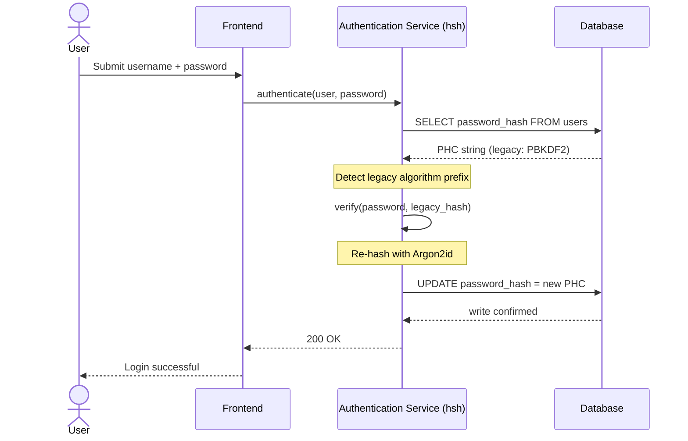
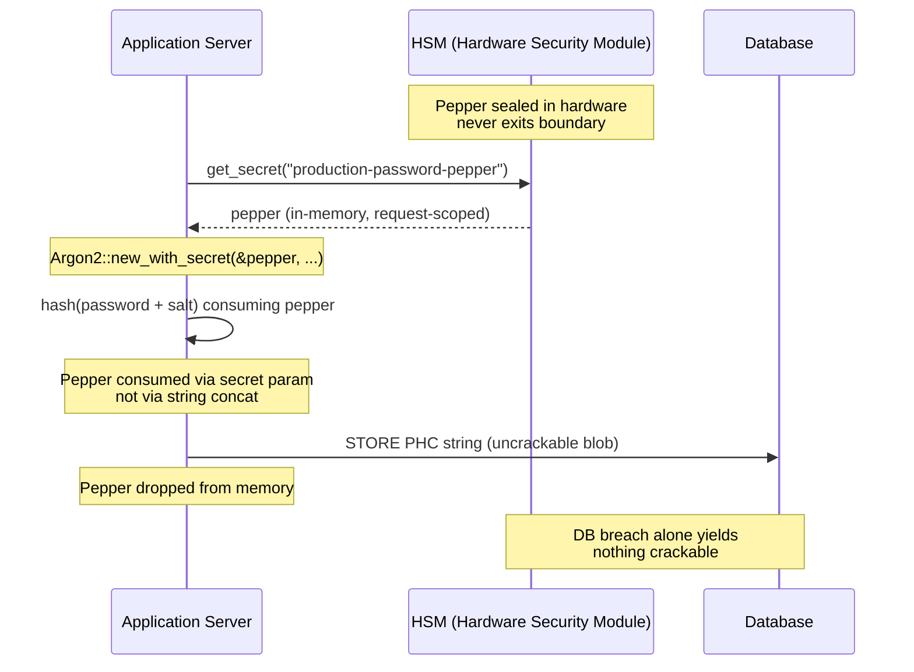

---
# Front Matter (YAML)
author: "contact@sebastienrousseau.com (Sebastien Rousseau)"
banner_alt: "Close-up terminal pengembang yang menampilkan output kompiler Rust — disiplin yang terlihat dari substrat kriptografi aman-memori dan dapat-diaudit di bawah estat autentikasi perbankan enterprise"
banner_height: "1597"
banner_width: "2584"
banner: "https://cloudcdn.pro/stocks/images/rustlogs.webp"
cdn: "https://cloudcdn.pro"
charset: "UTF-8"
cname: "sebastienrousseau.com"
copyright: "© Hak Cipta 2025 - 2026 - Sebastien Rousseau. Seluruh hak cipta dilindungi."
date: "June 22, 2026"
description: "hsh adalah kerangka kriptografi Rust murni yang memungkinkan bank tier-1 memigrasikan hash kata sandi warisan ke Argon2id tanpa downtime, mengintegrasikan peppering HSM dan menghilangkan kerentanan memori FFI berbasis C demi mandat ketahanan DORA."
format-detection: "telephone=no"
hreflang: "id"
icon: "https://cloudcdn.pro/clients/sebastienrousseau/v1/logos/sebastienrousseau.svg"
id: "https://sebastienrousseau.com/2026-06-22-hsh-zero-downtime-cryptographic-stewardship-rust-banking-2026"
image_alt: "Potret Hitam Putih Sebastien Rousseau"
image_height: "162"
image_width: "162"
image: "https://cloudcdn.pro/stocks/images/sebastienrousseau.webp"
keywords: "hsh, kriptografi Rust, hashing kata sandi, Argon2id, keamanan perbankan, interlock HSM, kepatuhan DORA, Basel III, migrasi tanpa downtime, keamanan memori, PBKDF2, scrypt, pemulihan siber"
language: "id-ID"
last_reviewed: "2026-06-22"
layout: "report"
locale: "id_ID"
logo_alt: "Logo Sebastien Rousseau"
logo_height: "44"
logo_width: "44"
logo: "https://cloudcdn.pro/clients/sebastienrousseau/v1/logos/sebastienrousseau.svg"
measurementID: "G-169G4ET5HQ"
name: "Sebastien Rousseau"
permalink: "https://sebastienrousseau.com/2026-06-22-hsh-zero-downtime-cryptographic-stewardship-rust-banking-2026"
rating: "general"
referrer: "no-referrer"
robots: "index, follow"
schema: "FAQPage, Article"
seo_title: "hsh: Stewardship Kriptografi Tanpa Downtime di Rust untuk Bank"
short_name: "sebastienrousseau"
subtitle: "Bagaimana kerangka kriptografi Rust murni memungkinkan bank meningkatkan kata sandi warisan ke Argon2id dengan interlock HSM secara mulus — dan apa artinya bagi kepatuhan DORA dan Basel III."
tags: "hsh, Rust, perbankan, kriptografi, Argon2id, HSM, DORA, Basel-III, keamanan, sumber-terbuka, ketahanan-operasional"
theme-color: "0, 83, 191"
title: "Mengamankan Manajemen Kata Sandi di Perbankan Enterprise: Hashing Multi-Algoritma dan Peningkatan dengan hsh"
url: "https://sebastienrousseau.com/2026-06-22-hsh-zero-downtime-cryptographic-stewardship-rust-banking-2026"
viewport: "width=device-width, initial-scale=1, shrink-to-fit=no"

# RSS
atom_link: "https://sebastienrousseau.com/2026-06-22-hsh-zero-downtime-cryptographic-stewardship-rust-banking-2026/rss.xml"
category: "Teknologi"
generator: "Static Site Generator (SSG) (version 0.0.40)"
item_description: "hsh adalah kerangka kriptografi Rust murni yang memungkinkan bank tier-1 memigrasikan hash kata sandi warisan ke Argon2id tanpa downtime, mengintegrasikan peppering HSM dan menghilangkan kerentanan memori FFI berbasis C demi mandat ketahanan DORA."
item_pub_date: "Mon, 22 Jun 2026 07:07:07 +0000"
item_title: "Mengamankan Manajemen Kata Sandi di Perbankan Enterprise: Hashing Multi-Algoritma dan Peningkatan dengan hsh"
pub_date: "Mon, 22 Jun 2026 07:07:07 +0000"
type: "article"

# Twitter Card
twitter_card: "summary_large_image"
twitter_creator: "@wwdseb"
twitter_description: "hsh memungkinkan bank tier-1 memigrasikan hash kata sandi warisan ke Argon2id tanpa downtime, dengan interlock HSM dan Rust aman-memori."
twitter_image: "https://cloudcdn.pro/clients/sebastienrousseau/v1/logos/sebastienrousseau.svg"
twitter_title: "hsh: Stewardship Kriptografi Tanpa Downtime di Rust"
twitter_url: "https://sebastienrousseau.com/2026-06-22-hsh-zero-downtime-cryptographic-stewardship-rust-banking-2026"

excerpt: "Di era dekripsi yang dipercepat GPU dan mandat DORA, kebusukan kriptografi adalah risiko sistemik. Setiap hash PBKDF2 atau scrypt warisan yang mengendap di basis data perbankan adalah hitung mundur menuju kompromi. hsh mengubah model ini dengan peningkatan tanpa downtime dan aman-memori..."

# Added by fix_hsh_frontmatter.py (template completeness)
apple_mobile_web_app_orientations: "portrait"
apple_touch_icon_sizes: "192x192"
apple-mobile-web-app-capable: "yes"
apple-mobile-web-app-status-bar-inset: "black"
apple-mobile-web-app-status-bar-style: "black-translucent"
apple-touch-fullscreen: "yes"
author_location: "London, United Kingdom"
author_twitter: "@wwdseb"
author_website: "https://sebastienrousseau.com"
docs: https://validator.w3.org/feed/docs/rss2.html
item_guid: "https://sebastienrousseau.com/2026-06-22-hsh-zero-downtime-cryptographic-stewardship-rust-banking-2026/rss.xml"
item_link: "https://sebastienrousseau.com/2026-06-22-hsh-zero-downtime-cryptographic-stewardship-rust-banking-2026/rss.xml"
last_build_date: "Mon, 22 Jun 2026 06:06:06 +0000"
managing_editor: "contact@sebastienrousseau.com (Sebastien Rousseau)"
menu: "active"
msapplication-navbutton-color: "0, 83, 191"
site_components: "Kaishi, Kaishi Builder, Kaishi CLI, Kaishi Templates, Kaishi Themes"
site_last_updated: "2023-07-05"
site_software: "Static Site Generator, Rust"
site_standards: "HTML5, CSS3, RSS, Atom, JSON, XML, YAML, Markdown, TOML"
ttl: "60"
twitter_site: "@wwdseb"
webmaster: "contact@sebastienrousseau.com"
apple-mobile-web-app-title: "hsh: Rust password hashing"
thanks: "Terima kasih sudah membaca!"
twitter_image_alt: "Potret Hitam Putih Sebastien Rousseau"
---

# Mengamankan Manajemen Kata Sandi di Perbankan Enterprise: Hashing Multi-Algoritma dan Peningkatan dengan hsh

<!-- lead-start: manual -->
<aside class="post-lead" aria-label="Ringkasan artikel">
<p class="post-lead-tldr"><strong>TL;DR.</strong> <a href="https://github.com/sebastienrousseau/hsh">hsh</a> adalah kerangka kriptografi Rust murni dan sumber terbuka yang memungkinkan bank tier-1 memigrasikan hash kata sandi warisan ke standar modern seperti Argon2id tanpa gangguan layanan. Dengan mengintegrasikan peppering yang didukung HSM dan menegakkan keamanan memori secara ketat tanpa pembungkus FFI berbasis C, kerangka ini menutup kerentanan kebusukan kriptografi yang secara langsung mengancam kepatuhan DORA dan Basel III.</p>
<p class="post-lead-heading"><strong>Poin utama</strong></p>
<ul class="post-lead-takeaways">
  <li><strong>Masalah kebusukan kriptografi.</strong> Algoritma warisan seperti PBKDF2 melemah secara eksponensial seiring percepatan perangkat keras, memperluas permukaan serangan untuk kampanye credential-stuffing dan brute-force offline.</li>
  <li><strong>Migrasi tanpa downtime.</strong> Pola <code>verify_and_upgrade</code> me-rehash kredensial pengguna secara transparan selama peristiwa login standar, menghilangkan risiko operasional migrasi basis data massal.</li>
  <li><strong>Interlock perangkat keras dan peppering.</strong> Hash dibungkus menggunakan Hardware Security Module (HSM) atau arsitektur KMS cloud, memastikan bahwa pelanggaran basis data saja tidak menghasilkan kandidat kata sandi yang dapat dipecahkan.</li>
  <li><strong>Keamanan memori sebagai baseline regulasi.</strong> Ditulis ulang sepenuhnya dalam Rust aman dan ditegakkan melalui higiene dependensi yang ketat, hsh menghilangkan buffer overflow dan risiko rantai pasok yang melekat pada pustaka kriptografi berbasis C warisan.</li>
</ul>
<p class="post-lead-related"><strong>Bacaan terkait:</strong> <a href="https://sebastienrousseau.com/2026-06-20-http-handle-zero-dependency-edge-ingress-banking-rust-2026">http-handle: Edge Ingress Berperforma Tinggi Tanpa Dependensi untuk Perbankan pada 2026</a>, <a href="https://sebastienrousseau.com/2026-06-07-autonomous-treasury-index-programmable-liquidity-tokenised-deposits-2026/index.html">Indeks Tresuri Otonom pada 2026</a>.</p>
</aside>
<!-- lead-end -->

> **Ringkasan eksekutif.** Autentikasi perbankan yang dibangun terhadap model ancaman 2018 sudah tidak memadai di bawah rezim regulasi 2026. Cracking yang dipercepat GPU, densitas ASIC, dan cakrawala pasca-kuantum yang mendekat telah meruntuhkan margin keamanan PBKDF2 dan scrypt parameter awal; Pasal 5 DORA telah mengubah peluruhan itu menjadi liabilitas yang dapat dipertanggungjawabkan oleh dewan. hsh, kerangka Rust murni sumber terbuka, menangani masalah ini di tiga lapisan secara paralel: dispatcher `verify_and_upgrade` yang me-rehash kredensial tersimpan ke parameter Argon2id saat ini pada setiap login berhasil tanpa jendela pemeliharaan; lapisan peppering yang ter-interlock dengan HSM atau KMS yang membuat pelanggaran basis data saja tidak menghasilkan apa pun yang dapat dipecahkan; dan rantai pasok aman-memori yang menghilangkan permukaan serangan foreign-function-interface yang melekat pada pustaka kriptografi yang didukung C. Hasilnya adalah substrat yang memenuhi DORA, disiplin risiko operasional Basel III, akuntabilitas manajer senior SM&CR, dan cakrawala migrasi pasca-kuantum NIST IR 8547 — tanpa program reset massal yang secara historis dibutuhkan untuk meningkatkan estat autentikasi.

Sebagian besar autentikasi perbankan enterprise masih bersandar pada lapisan kata sandi yang dikeraskan terhadap model ancaman 2018. Perangkat keras yang memecahkannya telah maju jauh. Seiring skala ladang GPU dan mendekatnya cryptographically relevant quantum computers (CRQCs), hashing warisan — PBKDF2, scrypt awal — meluruh pada setiap jam komputasi yang dihabiskan penyerang pada antrean crack offline. Peluruhan itu senyap: tidak ada di basis data produksi yang memberi tahu Anda bahwa hash yang kuat kemarin sudah tidak lagi kuat hari ini.

Di bawah [Digital Operational Resilience Act (DORA)](https://eur-lex.europa.eu/eli/reg/2022/2554/oj "Regulasi (EU) 2022/2554 — Digital Operational Resilience Act"), membiarkan aset kriptografi warisan yang tidak dirotasi di produksi bukan lagi utang teknis. Itu adalah liabilitas regulasi yang disebut secara eksplisit.

[hsh](https://github.com/sebastienrousseau/hsh "hsh — kerangka hashing kata sandi Rust murni") menutup celah itu. Sebagai kerangka Rust murni, ia mengelola beberapa format hash secara berdampingan dan meningkatkan kredensial lemah secara in-flight selama sesi login aktif. Infrastruktur autentikasi diselaraskan dengan mandat ketahanan 2026 tanpa jendela pemeliharaan, tanpa reset paksa, dan tanpa satu detik pun downtime.

## 01. Masalah Kebusukan Kriptografi di Perbankan

Untuk memahami perlunya kerangka seperti hsh, seseorang harus memahami siklus hidup hash kata sandi. Algoritma tidak menua dengan anggun; mereka membusuk relatif terhadap perangkat keras yang tersedia untuk memecahkannya.

**Celah akselerasi ASIC/GPU.** Algoritma seperti PBKDF2 dirancang agar mahal secara komputasi untuk CPU. Saat ini, penyerang menggunakan GPU yang sangat terparalelisasi untuk mengeksekusi serangan kamus offline. Hash warisan yang dibuat pada 2018 jauh lebih lemah terhadap musuh pada 2026.

**Risiko migrasi big-bang.** Ketika CISO memutuskan untuk meningkatkan dari PBKDF2 ke algoritma memory-hard seperti Argon2id, mereka tidak dapat membalikkan hash untuk mengenkripsi ulang. Solusi tradisional — memaksa reset kata sandi jutaan pengguna — menyebabkan friksi pelanggan dan risiko operasional yang masif.

**Rantai pasok pustaka C.** Secara historis, middleware perbankan mengandalkan pustaka seperti `argonautica` atau binding C mentah untuk hashing. Pustaka ini membawa risiko rantai pasok tersembunyi: satu buffer overflow memori di modul autentikasi dapat menyebabkan remote code execution (RCE) di lapisan paling berhak dari tumpukan perbankan.

### Perbandingan algoritma — resistensi perangkat keras dan permukaan penyetelan

Tiga algoritma yang realistis ditemui bank dalam korpus migrasi berbeda lebih sedikit dalam pilihan primitif kriptografi dan lebih banyak dalam cara mereka menua di bawah tekanan perangkat keras. Tabel di bawah merangkum postur praktisnya.

| Algorithm | Memory-hard | GPU / ASIC resistance | Tuning surface | 2026 status |
| ---- | ---- | ---- | ---- | ---- |
| **PBKDF2** | Tidak | Rendah — tervektorisasi pada GPU; sub-milidetik per tebakan pada perangkat keras komoditas. | Hanya jumlah iterasi. | Warisan. Dapat diterima hanya sebagai fallback sisi-verifikasi selama migrasi. |
| **scrypt** | Ya (sedang) | Sedang — biaya memori mengalahkan ladang GPU sederhana; dapat di-ASIC-amortisasi pada skala besar. | `N` (CPU/memori), `r` (ukuran blok), `p` (paralelisme). | Tidak disarankan untuk greenfield. Aktif di korpus migrasi. |
| **Argon2id** | Ya (tinggi) | Tinggi — memory-hard dan time-hard; menahan serangan side-channel dan TMTO. | Biaya memori (`m`), biaya waktu (`t`), paralelisme (`p`), rahasia (pepper). | Default yang direkomendasikan. OWASP, draf NIST SP 800-63B-4, FedRAMP. |

Kesimpulan untuk rencana migrasi sempit: PBKDF2 adalah keadaan *sisi-verifikasi*, bukan tujuan *sisi-tulis*. Setiap login berhasil pada catatan PBKDF2 harus menghasilkan catatan Argon2id pada jalan keluarnya.

## 02. Lensa Arsitektur hsh 2026

Kerangka ini terstruktur dalam lima lapisan inti, masing-masing direkayasa untuk memitigasi kategori risiko operasional tertentu.

### Tabel 1: Lapisan Arsitektur hsh dan Mitigasi Risiko

| Lapisan | Keputusan desain | Mengapa penting | Risiko jika salah ditangani |
| ---- | ---- | ---- | ---- |
| **Primitif kriptografi** | Format PHC String terpadu yang mendukung Argon2id, scrypt, dan PBKDF2 | Memberikan resistensi kelas terbaik terhadap serangan GPU sambil mempertahankan kompatibilitas mundur. | Silo data; algoritma lemah yang memungkinkan 100B+ tebakan/detik offline. |
| **Mesin kebijakan** | Dispatch `verify_and_upgrade` | Mengotomatiskan transisi dari kebijakan warisan ke modern secara dinamis saat login. | Kebusukan keamanan; pengguna aktif tetap pada tipe hash warisan yang mudah dipecahkan. |
| **Interlock perangkat keras** | Kapabilitas "peppering" HSM dan Cloud KMS | Memastikan pelanggaran basis data saja tidak mengekspos kandidat kata sandi. | Serangan brute-force offline berhasil setelah pelanggaran SQL injection. |
| **Higiene keamanan** | Penegakan `deny.toml` dan Rust murni | Memblokir FFI yang tidak aman dan dependensi C eksternal yang tidak tepercaya secara menyeluruh. | Serangan rantai pasok katastrofik dan CVE korupsi memori. |

## 03. Jalur Rehash Tanpa Downtime

Pola `verify_and_upgrade` menyelesaikan migrasi data melalui sistem dispatching cerdas dan sadar-keadaan yang membutuhkan nol downtime basis data.

Ketika pengguna mengirimkan kredensial mereka, hsh membaca string Password Hashing Competition (PHC) yang tersimpan. Jika berisi hash warisan (mis., konfigurasi PBKDF2 usang), sistem mengeksekusi alur berikut:

1. **Identifikasi:** Memparsing algoritma warisan dan parameter spesifiknya.
2. **Verifikasi:** Memvalidasi kandidat kata sandi terhadap hash warisan.
3. **Peningkatan Waktu-Nyata:** Setelah pencocokan berhasil, sistem mengambil kandidat kata sandi plaintext di memori dan segera menghitung hash baru menggunakan kebijakan Argon2id yang sangat aman.
4. **Persistensi:** Sistem mengembalikan string PHC baru ke aplikasi perbankan, yang menimpa catatan warisan di basis data.

Proses ini sepenuhnya transparan bagi pengguna akhir. Ia secara efektif memigrasikan akun-akun yang paling aktif ke tingkat keamanan tertinggi pada hari pertama, mengurangi permukaan serangan bank secara organik dari waktu ke waktu.

Diagram urutan di bawah ini menunjukkan apa yang terjadi selama satu peristiwa login ketika catatan yang tersimpan berada pada algoritma warisan. Pengguna tidak melihat ada yang berubah; estat autentikasi bank menguat sebanyak satu catatan.



### Pola implementasi — dispatch `verify_and_upgrade`

Permukaan integrasi di dalam layanan autentikasi kecil. Jalur kode warisan tetap sebagai fallback; jalur kode baru adalah dispatcher.

```rust
use hsh::{Hasher, UpgradeResult};

struct UserRecord {
    username: String,
    password_hash: String, // PHC string
}

async fn authenticate(user: UserRecord, password_attempt: &str) -> Result<bool, AuthError> {
    let hasher = Hasher::new();
    match hasher.verify_and_upgrade(password_attempt, &user.password_hash) {
        Ok(UpgradeResult::Verified(is_valid)) => Ok(is_valid),
        Ok(UpgradeResult::Upgraded(new_hash)) => {
            db::update_user_hash(&user.username, new_hash).await?;
            Ok(true)
        }
        Err(_) => Err(AuthError::InvalidCredentials),
    }
}
```

Tiga properti penting:

- **Kesadaran-keadaan.** `verify_and_upgrade` memeriksa prefix string PHC. Jika penanda algoritma adalah warisan, kerangka memicu re-hash secara otomatis terhadap kebijakan Argon2id yang dikonfigurasi. Tidak ada percabangan di kode pemanggil.
- **Atomisitas.** Re-hashing terjadi hanya setelah verifikasi warisan berhasil, di dalam peristiwa autentikasi yang sama. Tidak ada pekerjaan batch terpisah, tidak ada jendela migrasi terjadwal, dan tidak ada migrasi massal destruktif untuk di-rollback.
- **Persistensi.** Varian `UpgradeResult::Upgraded` membawa string PHC baru. Aplikasi mempersistensikannya melalui jalur data yang sama yang sudah ada untuk catatan warisan — tidak ada permukaan tulis paralel, tidak ada protokol tulis dua-fase.

**Mode kegagalan.** Jika tulisan basis data gagal atau KMS sesaat tidak dapat dijangkau saat tulisan peningkatan, sesi tetap berhasil terhadap hash warisan dan catatan tetap pada algoritma lama. Login berhasil berikutnya mencoba kembali peningkatan tersebut. Tidak ada keadaan setengah-termigrasi dan tidak ada kegagalan yang terlihat oleh pengguna — migrasi monoton lintas peristiwa login, dan biaya per-catatan dari peningkatan yang gagal tepat satu percobaan tambahan pada login berikutnya.

## 04. Hash Ber-Pepper melalui Interlock HSM / KMS

Hashing kata sandi standar melindungi dari kebocoran basis data langsung, tetapi jika penyerang memperoleh basis data (hash dan salt), mereka dapat mengeksekusi cracking offline.

hsh memperkenalkan lapisan keamanan "ber-pepper" yang kokoh. Dengan mengintegrasikan Hardware Security Module (HSM) atau Key Management Service (KMS) cloud-native, output Argon2id akhir dibungkus secara kriptografis dengan kunci ber-entropi tinggi yang tidak pernah meninggalkan batas perangkat keras yang aman. Jika basis data pengguna diekfiltrasi, penyerang hanya memiliki blob terenkripsi. Mereka tidak dapat mulai memecahkan kata sandi tanpa juga menembus infrastruktur HSM bank yang terisolasi secara fisik.

Diagram arsitektur di bawah ini menelusuri jalur rahasia. Pepper tidak pernah mendarat di basis data; basis data tidak pernah menyimpan apa pun yang dapat dialamatkan sendiri. Kedua penyimpanan dapat gagal secara independen — sistem hanya kehilangan kerahasiaan jika keduanya gagal bersamaan.



### Pola implementasi — Argon2id ber-pepper yang didukung HSM

Pepper bersumber dari HSM pada waktu permintaan, bukan dari file konfigurasi. `Argon2::new_with_secret` mengonsumsinya melalui parameter rahasia algoritma, bukan melalui konkatenasi string.

```rust
use argon2::{
    Argon2, Algorithm, Version, Params,
    PasswordHasher, PasswordVerifier,
    password_hash::{PasswordHash, SaltString, rand_core::OsRng},
};

async fn authenticate_with_hsm(
    user: UserRecord,
    password_attempt: &str,
) -> Result<bool, AuthError> {
    let pepper = hsm::client::get_secret("production-password-pepper").await?;
    let hasher = Argon2::new_with_secret(
        &pepper,
        Algorithm::Argon2id,
        Version::V0x13,
        Params::default(),
    )
    .map_err(|_| AuthError::Internal)?;

    let parsed = PasswordHash::new(&user.password_hash)
        .map_err(|_| AuthError::InvalidCredentials)?;
    if hasher.verify_password(password_attempt.as_bytes(), &parsed).is_ok() {
        if is_legacy_hash(&user.password_hash) {
            let new_hash = hasher
                .hash_password(
                    password_attempt.as_bytes(),
                    &SaltString::generate(&mut OsRng),
                )
                .map_err(|_| AuthError::Internal)?
                .to_string();
            db::update_user_hash(&user.username, new_hash).await?;
        }
        return Ok(true);
    }
    Err(AuthError::InvalidCredentials)
}
```

Tiga konsekuensi yang selaras dengan DORA muncul dari bentuk ini:

- **Rotasi kunci sebagai masalah manajemen-kunci.** Pepper hidup di balik batas HSM/KMS, bukan di basis data. Rotasi menjadi perubahan manajemen-kunci, bukan kampanye re-hashing di seluruh estat pengguna. Hash baru mengikat ke versi pepper saat ini; hash lama diverifikasi di bawah versi yang terikat hingga mereka meningkat secara alami.
- **Pemisahan tugas.** Identitas layanan yang membaca pepper harus dapat diaudit dan berhak-sekecil-mungkin. Eksfiltrasi basis data penuh tanpa grant HSM yang bersesuaian tidak menghasilkan apa pun yang dapat dipecahkan. Kompromi grant HSM tanpa basis data tidak menghasilkan apa pun yang dapat ditujukan. Radius ledakan dari kegagalan tunggal mana pun terbatas.
- **Menghindari bug length extension dan konkat.** Menggunakan parameter rahasia Argon2 alih-alih konkatenasi string menghilangkan seluruh kelas jebakan kriptografi — length-extension, konkatenasi UTF-8 yang salah-ketik, bug urutan salt/pepper — dari permukaan implementasi.

## 05. Penyelarasan Regulasi: DORA, Basel III, dan SM&CR

- **DORA Pasal 5 dan 6:** Mensyaratkan entitas keuangan memelihara kerangka manajemen risiko TIK. Strategi yang bergantung pada hash kata sandi yang tidak dirotasi selama satu dekade melanggar prinsip-prinsip ini. hsh menyediakan mekanisme yang terdokumentasi dan otomatis untuk terus mengangkat perlindungan kriptografi.
- **Basel III:** Menghubungkan modal regulasi dengan probabilitas dan tingkat keparahan peristiwa kerugian. Dengan mengimplementasikan Argon2id dengan interlock HSM, tingkat keparahan pelanggaran basis data berkurang drastis, mendukung argumen yang dapat dikuantifikasi untuk alokasi modal risiko operasional yang lebih rendah.
- **Akuntabilitas SM&CR:** Menyetujui arsitektur yang secara aktif memperbaiki kebusukan kriptografi memberikan manajer senior yang disebut namanya rantai pengurangan risiko yang dapat diverifikasi dan didokumentasikan.

## Pertanyaan yang sering diajukan

**Apakah hsh siap-produksi untuk jalur autentikasi perbankan tier-1?**
Pustaka ini sumber terbuka, terdokumentasi, dan menjalankan Argon2id melalui crate `argon2` yang sama yang mendasari ekosistem hashing kata sandi RustCrypto. Adopsi tier-1 mengikuti due-diligence bank itu sendiri: tinjauan kode independen, atestasi build yang dapat direproduksi, penyematan pohon dependensi, pengujian integrasi vendor HSM, dan sign-off Risiko Operasional. hsh menyediakan substrat; bank mensertifikasi penyebaran.

**Bagaimana `verify_and_upgrade` menghindari risiko migrasi massal?**
Verifier memeriksa string PHC pada waktu parse, menjalankan algoritma warisan untuk memvalidasi kata sandi, dan — jika algoritma atau set parameter yang tersimpan berada di bawah batas saat ini — me-rehash plaintext di bawah Argon2id dengan pepper HSM yang terikat dan menulis kembali string PHC baru secara atomik. Pengguna mengalami login normal. Estat menguat sebanyak satu catatan per autentikasi berhasil. Tidak ada kampanye reset, tidak ada jendela pemeliharaan, tidak ada peristiwa risiko operasional.

**Apa yang terjadi pada akun dorman yang tidak pernah login?**
Catatan yang tidak pernah berautentikasi tidak pernah di-rehash. Bank menangani ini dengan dua kebijakan komplementer: ambang dormansi yang terdokumentasi (sering 18–24 bulan) setelahnya akun dirotasi secara administratif di bawah kampanye reset terkontrol, dan run re-hash sintetis selama pemeliharaan terjadwal untuk akun dalam kohort yang ditentukan (bernilai tinggi, hak istimewa tinggi, teregulasi). Keduanya adalah kebijakan, bukan perilaku pustaka; hsh mencatat keputusan dispatch dalam telemetri audit sehingga pemilik operasional dapat membuktikan cakupan.

**Apakah pepper HSM memperkenalkan titik kegagalan tunggal pada jalur autentikasi?**
HSM yang sama yang menandatangani pesan pembayaran dan merotasi kunci yang didukung KMS berada di jalur tersebut. Risikonya identik dengan postur bank yang ada; hsh mewarisinya alih-alih memperkenalkannya. Mitigasinya standar: pasangan HSM HA, region KMS hot-spare, pengambilan pepper berlingkup-permintaan dengan fall-back circuit-breaker ke mode hanya-baca, dan runbook operasional eksplisit untuk ketidaktersediaan HSM. Pepper adalah parameter rahasia `argon2`, dikonsumsi di-proses dan dilepaskan dari memori setelah digunakan.

**Di mana hsh berada relatif terhadap migrasi pasca-kuantum?**
hsh adalah kerangka hashing kata sandi-dan-rahasia, bukan primitif key-encapsulation atau tanda tangan. Transisi PQC yang didokumentasikan dalam [NIST IR 8547](https://csrc.nist.gov/pubs/ir/8547/ipd "Transisi ke Standar Kriptografi Pasca-Kuantum") menargetkan pembentukan kunci (ML-KEM, FIPS 203) dan tanda tangan (ML-DSA, FIPS 204; SLH-DSA, FIPS 205). Lapisan hashing yang dicakup hsh sebagian besar ortogonal terhadap migrasi tersebut. Keduanya bertemu di tingkat substrat — keduanya menginginkan rantai pasok kriptografi yang aman-memori, dapat-diaudit, dan dapat-direproduksi — yang persis postur yang dimungkinkan hsh saat ini.

## Kesimpulan

Hashing kata sandi deploy-and-forget sudah usai. DORA telah memindahkan kepasifan kriptografi dari utang teknis menjadi liabilitas regulasi yang disebut secara eksplisit, dan kurva perangkat keras menjadi semakin curam setiap tahun. Kontribusi hsh bukanlah algoritma yang lebih kuat — Argon2id telah tersedia bertahun-tahun. Kontribusinya adalah mesin operasional untuk bermigrasi ke sana tanpa menjadwalkan downtime, tanpa memaksa reset pengguna, dan tanpa mempercayakan jalur autentikasi bank kepada shim FFI berbasis C.

[Kode sumber hsh](https://github.com/sebastienrousseau/hsh "hsh — kerangka hashing kata sandi Rust murni, lisensi ganda MIT dan Apache 2.0") tersedia di bawah lisensi ganda MIT dan Apache 2.0.

## Referensi

Basel Committee on Banking Supervision (2011). *Basel III: A global regulatory framework for more resilient banks and banking systems*. Bank for International Settlements. Tersedia di: [https://www.bis.org/publ/bcbs189.htm](https://www.bis.org/publ/bcbs189.htm "Basel III: Kerangka regulasi global untuk bank dan sistem perbankan yang lebih tangguh")

Biryukov, A., Dinu, D., Khovratovich, D., dan Josefsson, S. (2021). *RFC 9106: Argon2 Memory-Hard Function for Password Hashing and Proof-of-Work Applications*. Internet Engineering Task Force. Tersedia di: [https://datatracker.ietf.org/doc/html/rfc9106](https://datatracker.ietf.org/doc/html/rfc9106 "RFC 9106 — Fungsi Memory-Hard Argon2 untuk Hashing Kata Sandi")

European Parliament and Council (2022). *Regulation (EU) 2022/2554 on digital operational resilience for the financial sector (DORA)*. Tersedia di: [https://eur-lex.europa.eu/eli/reg/2022/2554/oj](https://eur-lex.europa.eu/eli/reg/2022/2554/oj "Regulasi (EU) 2022/2554 — DORA")

Financial Conduct Authority (2015). *Senior Managers and Certification Regime (SM&CR)*. Tersedia di: [https://www.fca.org.uk/firms/senior-managers-certification-regime](https://www.fca.org.uk/firms/senior-managers-certification-regime "Senior Managers and Certification Regime")

National Institute of Standards and Technology (2024). *Initial Public Draft — Transition to Post-Quantum Cryptography Standards (NIST IR 8547)*. Tersedia di: [https://csrc.nist.gov/pubs/ir/8547/ipd](https://csrc.nist.gov/pubs/ir/8547/ipd "NIST IR 8547 — Transisi ke Standar Kriptografi Pasca-Kuantum")

OWASP Foundation (2024). *Password Storage Cheat Sheet*. Tersedia di: [https://cheatsheetseries.owasp.org/cheatsheets/Password_Storage_Cheat_Sheet.html](https://cheatsheetseries.owasp.org/cheatsheets/Password_Storage_Cheat_Sheet.html "OWASP Password Storage Cheat Sheet")

<!-- enrich-start -->
<aside class="author-card" aria-label="Tentang penulis"><span class="author-card-body"><strong class="author-card-name"><a href="/about/index.html">Sebastien Rousseau</a></strong><span class="author-card-bio">Teknolog perbankan senior yang menulis tentang AI terapan, migrasi ISO 20022, kriptografi pasca-kuantum untuk layanan keuangan, dan transformasi struktural pembayaran grosir.</span><span class="author-credentials">20+ tahun di HSBC Commercial &amp; Investment Bank, PayPal, Barclays, Shazam, AKQA, Virgin Group. <a href="/about/index.html">Profil lengkap</a> &middot; <a href="https://www.linkedin.com/in/sebastienrousseau/" rel="external noopener">LinkedIn</a> &middot; <a href="https://github.com/sebastienrousseau" rel="external noopener">GitHub</a></span></span></aside>
<p class="post-reviewed">Terakhir ditinjau <time datetime="2026-06-22">2026-06-22</time>.</p>
<!-- enrich-end -->