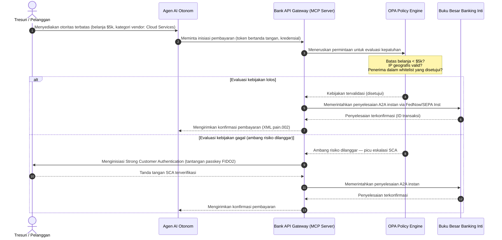

# Outlook Pembayaran Global 2026: Model Operasi, Risiko, dan Pendapatan dalam Dunia Agentik, Tertanam, dan Real-Time

Siklus pembayaran global 2026 ditentukan oleh tiga kekuatan yang berkonvergensi — perdagangan agentik, pembayaran tertanam yang tidak terlihat, dan eksekusi real-time — di atas buku besar terpadu tertokenisasi di bawah Project Agorá dan peralihan alamat terstruktur SWIFT November 2026 yang tegas.

<!-- lead-start -->
<aside class="post-lead" aria-label="Ringkasan artikel">

<strong>TL;DR.</strong> Lanskap pembayaran 2026 telah berpindah dari migrasi messaging menuju model operasi multi-dimensi di mana risiko dan pendapatan ditentukan oleh eksekusi real-time. Artikel ini mensintesis outlook 2026 dari J.P. Morgan, Global Payments, HSBC, dan Payments Association ke dalam rencana operasi G-SIB empat pilar, yang mencakup perdagangan agentik yang diinisiasi model, API tresuri selalu-aktif, buku besar terpadu tertokenisasi di bawah BIS Project Agorá, dan tenggat alamat terstruktur SWIFT 14 November 2026.

<strong>Poin-poin utama</strong>

<ul class="post-lead-takeaways">
  <li><strong>Perdagangan agentik membuka batas tanggung jawab yang didelegasikan.</strong> Agen AI otonom diproyeksikan memediasi perdagangan tahunan senilai $3-$5 triliun pada 2030. Bank harus mendefinisikan gatekeeping MCP, delegasi SCA di bawah PSD3/PSR, dan kepemilikan KYC/AML di dalam rantai pembayaran multi-agen.</li>
  <li><strong>Likuiditas selalu-aktif kini menjadi baseline operasional dan regulatori.</strong> API tresuri 24/7 dan akun virtual meminimalkan kas terjebak dan meningkatkan ambang batas ketahanan. Di bawah DORA, produk likuiditas real-time harus didukung oleh infrastruktur aktif-aktif yang terdistribusi secara geografis dengan ketersediaan 99,999%.</li>
  <li><strong>Tokenisasi telah naik kelas ke buku besar terpadu yang teregulasi.</strong> Project Agorá adalah kerangka kerja publik-privat terbesar untuk deposit tertokenisasi bank komersial dan cadangan bank sentral. Bank memerlukan perjalanan tokenisasi lima langkah, dengan perlakuan prudensial yang eksplisit.</li>
  <li><strong>Peralihan alamat terstruktur 14 November 2026 memiliki tanggal yang tegas.</strong> Field alamat pos tidak terstruktur dalam pesan CBPR+ dan SEPA akan memicu penolakan langsung. Tata kelola data yang bersih lintas tim produk, teknologi, dan kepatuhan diperlukan.</li>
</ul>

<strong>Bacaan terkait:</strong> <a href="https://sebastienrousseau.com/2026-06-23-iso-20022-pain001-programmable-liquidity-autonomic-treasury-2026">From Pain.001 to Programmable Liquidity: ISO 20022 as the Autonomic Nervous System of Treasury in 2026</a>, <a href="https://sebastienrousseau.com/2026-06-24-cross-border-iso-20022-open-finance-tokenised-deposits-treasury-2026">Cross-Border 2026: ISO 20022, Open Finance and Tokenised Deposits in Corporate Treasury</a>, <a href="https://sebastienrousseau.com/2026-06-25-quantum-dawn-cib-kyberlib-quantum-resilient-payments-stack-2026">Quantum Dawn for CIB: From KyberLib to a Quantum-Resilient Payments Stack</a>.

</aside>
<!-- lead-end -->

Bagi bank transaksi global, siklus 2026-2028 adalah jendela struktural. Infrastruktur pembayaran modern bukan lagi utilitas administratif — ia adalah inti dari strategi teknologi tingkat-bank. Di dalam G-SIB dan institusi regional besar, teknologi, regulasi, dan ekspektasi pelanggan telah berkonvergensi menjadi satu bidang operasi.

Tiga kekuatan menentukan siklus ini, dan masing-masing memetakan langsung ke kepedulian tingkat eksekutif.

- **Perdagangan agentik** — distribusi kanal, desain produk, penugasan tanggung jawab, dan Model Risk Management di bawah pengawasan supervisor.
- **Pembayaran tertanam** — pengalaman pelanggan, dengan risiko disintermediasi di mana bank gagal menyematkan buku besar mereka ke dalam front-end korporat dan pedagang.
- **Eksekusi real-time** — kecepatan modal, dengan konsekuensi perubahan pada manajemen likuiditas, risiko kredit, ketahanan operasional, dan pertahanan penipuan.

Taruhan keuangannya material. Penipuan meningkat dalam kecepatan dan kecanggihan; tenggat regulasi bersifat tegas; dan bank yang secara proaktif memodernisasi sistem inti mereka membuka peluang pendapatan biaya yang substansial. Biaya dari ketidakaktifan adalah sebaliknya: penolakan transaksi langsung, hambatan operasional, sanksi regulatori, dan erosi pangsa pasar yang cepat.

## Konvergensi otoritas pembayaran global

Laporan ini mensintesis outlook pembayaran dan perdagangan 2026 dari empat suara industri yang otoritatif — [J.P. Morgan Payments](https://www.jpmorgan.com/payments/newsroom/payments-outlook-2026-trends-report-released "J.P. Morgan Payments — Outlook 2026"), [Global Payments](https://investors.globalpayments.com/news-events/press-releases/detail/497/global-payments-releases-its-2026-commerce-and-payment "Global Payments — 2026 Commerce and Payment Trends Report"), HSBC, dan The Payments Association — dan menyamakannya dengan [Peta Jalan G20 untuk Meningkatkan Pembayaran Lintas-Batas](https://www.fsb.org/2026/03/fsb-kicks-off-new-implementation-phase-to-enhance-cross-border-payments-through-public-private-partnership/ "FSB — cross-border payments implementation phase, March 2026").

Setiap organisasi mendekati ekosistem dari sudut pasar yang berbeda, tetapi temuan mereka berkonvergensi pada tiga invarian.

1. **Rel instan yang didorong API adalah baseline.** Model pemrosesan batch warisan terpinggirkan untuk arus lintas-batas dan nilai tinggi; kecepatan transaksi pada segmen tersebut ditentukan oleh messaging real-time yang selalu-aktif.
2. **AI adalah ancaman sekaligus pertahanan.** Alat generatif dan deepfake meningkatkan penipuan transaksi, sehingga memerlukan pertahanan tandingan machine-learning berlapis dan real-time.
3. **Tokenisasi adalah infrastruktur siap produksi.** Buku besar sedang disatukan untuk menampung liabilitas komersial tertokenisasi dan mata uang digital bank sentral grosir.

| Laporan | Audiens utama | Fokus | Pilar kunci | Implikasi bank |
| --- | --- | --- | --- | --- |
| **J.P. Morgan Payments** | Tresuri korporat, G-SIB | Likuiditas real-time, penipuan | API, biometrik AI | Membangun ulang sistem likuiditas, FX, dan risiko untuk penyelesaian berkelanjutan 365 hari. |
| **Global Payments** | Pedagang, e-commerce | Evolusi POS, omnichannel | Perdagangan agentik, checkout tanpa friksi | Membangun koridor pembayaran pedagang yang aman dan ber-gerbang API untuk agen AI otonom. |
| **HSBC Insights** | Korporat multinasional | Integrasi ERP (SAP/Oracle), kas real-time | Treasury-as-a-Service, visibilitas kas | Memonetisasi suite API transaksional dan menyematkan pelaporan buku besar kas real-time pada sumbernya. |
| **The Payments Association** | Fintech, institusi pembayaran | Stablecoin, tokenisasi, regulasi global | Aset digital teregulasi, kepatuhan kebijakan | Mempersiapkan neraca untuk deposit tertokenisasi dan menavigasi struktur tanggung jawab PSD3/PSR. |

Keempat outlook secara efektif mendefinisikan tumpukan operasi sektor swasta yang berjalan di atas infrastruktur kebijakan G20 sektor publik, menerjemahkan niat kebijakan menjadi keputusan konkret tentang likuiditas, tokenisasi, data, dan kontrol penipuan di dalam bank.

## Pilar 1 — Perdagangan agentik dan pembayaran tertanam

Perdagangan agentik adalah transisi dari checkout klik-untuk-membeli yang digerakkan manusia menuju inisiasi transaksi otonom yang digerakkan model. Prakiraan industri berkonvergensi pada $3-$5 triliun perdagangan tahunan yang dimediasi oleh agen otonom pada 2030 — pangsa angka satu digit rendah dari volume pembayaran global yang dieksekusi tanpa manusia mengklik 'beli'.

Ekosistem ritel dan komersial memiliki celah yang berkorespondensi. Mayoritas konsumen kini mengharapkan pembayaran mendekati tanpa friksi, namun kurang dari setengah pedagang telah memprioritaskan checkout satu-klik atau katalog produk yang dapat diakses melalui API. Agen AI tidak dapat menavigasi layar checkout warisan multi-halaman yang dirancang untuk mata manusia; mereka memerlukan handshake API mesin-ke-mesin yang terstruktur.

### Prioritas bank dan dampak operasional

- **Kepemilikan KYC dan AML.** Bank harus mendefinisikan siapa yang memegang kewajiban kepatuhan di dalam rantai transaksi agentik. Jika agen AI pribadi konsumen menginisiasi transaksi melalui checkout agentik pedagang, bank harus memverifikasi bahwa otoritas terdelegasi yang berasal terikat secara kriptografi pada pemegang akun utama.
- **Desain ulang tanggung jawab dan chargeback.** Skema kartu dan rel A2A dirancang seputar otorisasi manusia. Ketika agen AI melakukan pembelian yang salah — misalnya, mengadakan inventaris industri yang salah karena kesalahan penguraian data — bank harus mengalokasikan tanggung jawab dengan jelas antara konsumen, penyedia agen, dan pedagang.
- **Penilaian risiko arus agentik.** Mesin perutean pembayaran harus menilai risiko pembayaran agentik secara dinamis, menerapkan persyaratan cadangan yang lebih tinggi atau tingkat interchange pada transaksi yang tidak diinisiasi manusia hingga rekam jejak penyelesaian yang stabil ada.

### Tindakan terbatas dan otoritas terbatas

Untuk memitigasi "tindakan tak terbatas" — agen pengadaan perusahaan yang menjalankan loop pembelian rekursif tak terbatas karena gangguan perangkat lunak — bank harus menerapkan **gerbang API otoritas terbatas**. Gerbang tersebut menerapkan batas tingkat-kebijakan di tiga dimensi.

1. **Batas keuangan berjenjang** — pengeluaran agen dibatasi oleh ukuran transaksi, nilai kumulatif harian, dan kategori pedagang.
2. **Perlindungan sadar-konteks** — sinyal sekunder (waktu, geolokasi IP, frekuensi transaksi) dievaluasi sebelum buku besar melepaskan dana.
3. **Eskalasi human-in-the-loop** — otorisasi manusia wajib yang dipicu via Strong Customer Authentication (SCA) di bawah PSD3 / PSR setiap kali transaksi melampaui ambang risiko.

Urutan Mermaid di bawah ini menunjukkan arsitektur target yang akan dikenali banyak bank sebagai alur pembayaran agentik otoritas terbatas.

### Model Context Protocol (MCP)

Untuk menghubungkan model AI yang terlokalisasi ke lapisan eksekusi yang dikelola bank, industri sedang menstandarisasi seputar [Model Context Protocol (MCP)](https://modelcontextprotocol.io "Model Context Protocol — open standard for LLM tool integration") — protokol terbuka yang memungkinkan LLM memanggil alat dan API yang berlingkup jelas dan dapat diaudit tanpa akses mentah ke sistem inti.

Membungkus API perbankan (inisiasi pembayaran, pertanyaan saldo, verifikasi pihak) di dalam server MCP menjauhkan LLM dari tabel basis data dan kontrol root-sistem. Model berinteraksi dengan buku besar hanya melalui endpoint yang terstruktur, teraudit, dan terbatas tingkatnya — keamanan ditegakkan di batas eksekusi alat agentik daripada terkubur di dalam model.

## Pilar 2 — Transformasi tresuri dan likuiditas dibayangkan ulang

Kecepatan transaction banking pada 2026 ditentukan oleh pergeseran dari pemrosesan batch akhir-hari menuju operasi tresuri real-time yang selalu-aktif. Korporat multinasional tidak lagi mentolerir kas terjebak — likuiditas yang menganggur di akun lokal selama akhir pekan atau hari libur karena sistem penyelesaian tutup.

### Kasus ekonomi untuk likuiditas real-time

J.P. Morgan dan HSBC keduanya melaporkan bahwa korporat dengan kapabilitas kas dan data real-time yang maju secara material lebih mungkin mengungguli rekan-rekan pada pertumbuhan pendapatan dan efisiensi modal, terutama dengan mengurangi likuiditas yang terjebak dan mengoptimalkan siklus modal kerja.

Untuk menangkap nilai tersebut, bank mengirimkan **produk API Treasury-as-a-Service (TaaS)** yang memungkinkan ERP korporat (SAP, Oracle) terhubung langsung ke buku besar bank.

- **API saldo real-time** menggunakan skema `camt.052` — menggantikan protokol transfer file dengan pelaporan posisi kas instan yang didorong-peristiwa.
- **API inisiasi pembayaran massal** menggunakan `pain.001` — eksekusi straight-through langsung untuk batch pembayaran vendor dari buku besar ERP.
- **API FX berkelanjutan** — mesin tresuri mengunci kurs valuta asing algoritmik real-time untuk penyelesaian lintas-batas, menghilangkan risiko celah-pasar semalam.
- **API akun virtual** — korporat secara dinamis membuat dan menonaktifkan ribuan sub-akun untuk pencocokan piutang otomatis dan pemisahan buku besar.

### Ketahanan operasional dan DORA

Menawarkan likuiditas selalu-aktif mengubah profil risiko bank. Platform harus mempertahankan **ketersediaan operasional 99,999%** di bawah beban real-time berkelanjutan.

Di bawah [Digital Operational Resilience Act (DORA)](https://eur-lex.europa.eu/legal-content/EN/TXT/?uri=CELEX%3A32022R2554 "Regulation (EU) 2022/2554 — Digital Operational Resilience Act"), itu bukan KPI IT — itu adalah persyaratan regulatori yang ketat. Regulator mengharapkan bank membuktikan bahwa permukaan API tresuri real-time dan basis data buku besar dapat menyerap serangan siber severe-but-plausible, pemadaman jaringan, dan gangguan hyperscaler tanpa mengganggu pembayaran kritis atau mengkompromikan likuiditas sistemik. Itu memerlukan arsitektur basis data multi-cloud aktif-aktif yang terdistribusi secara geografis, lapisan deteksi ancaman real-time, dan failover otomatis — terlihat dalam baris biaya perubahan, bukan hanya dossier audit.

### FX berkelanjutan dan inovasi lintas-batas

Tresuri real-time tidak dapat hidup di dalam batas mata uang tunggal. G-SIB sedang menerapkan infrastruktur FX berkelanjutan — platform [Wire 365](https://www.jpmorgan.com/insights/payments/fx-cross-border/wire-365-global-clearing "J.P. Morgan — Wire 365 global clearing reinvented") J.P. Morgan memproses pembayaran lintas-batas dan konversi FX setiap hari sepanjang tahun, melampaui jam RTGS bank sentral tradisional. Lapisan tersebut saling-kunci langsung dengan sistem deposit tertokenisasi dan buku besar terpadu yang dibahas di Pilar 3.

## Pilar 3 — Deposit tertokenisasi dan buku besar terpadu

Tokenisasi telah naik kelas dari pilot proof-of-concept terisolasi menuju infrastruktur moneter tingkat-bank yang berskala. Fokus telah bergeser dari stablecoin privat dan kriptoaset spekulatif menuju **deposit tertokenisasi bank komersial** dan **mata uang digital bank sentral grosir (wCBDC)** yang berjalan di buku besar terpadu programabel.

Kerangka kerja rujukannya adalah [Project Agorá](https://www.bis.org/about/bisih/topics/fmis/agora.htm "BIS Project Agorá — tokenisation of wholesale cross-border payments") — kolaborasi publik-privat utama yang dikonvensi oleh BIS dan IIF, melibatkan tujuh bank sentral dan lebih dari 40 institusi keuangan privat. Proyek tersebut mengeksplorasi bagaimana deposit tertokenisasi bank komersial berintegrasi dengan wCBDC tertokenisasi pada buku besar programabel bersama untuk menghilangkan friksi penyelesaian lintas-batas, mengoordinasi pemeriksaan kepatuhan, dan memungkinkan finalitas atomik 24/7.

### Perjalanan tokenisasi lima langkah

Bagi G-SIB dan bank regional besar, tokenisasi adalah perjalanan bertahap dari optimisasi internal menuju interoperabilitas pasar terbuka.

1. **Likuiditas tresuri internal** — mentokenisasi saldo kas korporat internal (mis. JPM Coin atau buku besar bank privat ekuivalen) untuk memungkinkan transfer dan netting lintas-batas 24/7 instan di seluruh cabang bank sendiri.
2. **Koridor multi-bank terbatas** — konsorsium tertutup yang teregulasi (sandbox Project Agorá) untuk menguji penyelesaian antarbank dan keadaan buku besar bersama di seluruh institusi yang berbeda.
3. **FX programabel berkelanjutan** — smart contract pada buku besar terpadu mengeksekusi FX Payment-versus-Payment (PvP) instan, menghilangkan risiko penyelesaian lintas zona waktu.
4. **Aset dunia nyata tertokenisasi (RWA)** — leg kas tertokenisasi berintegrasi dengan buku besar sekuritas, utang, atau perdagangan tertokenisasi untuk finalitas Delivery-versus-Payment (DvP) instan, mengurangi penguncian modal dari hari menjadi milidetik.
5. **Interoperabilitas publik/hibrida yang teregulasi** — pembungkus gerbang yang aman memungkinkan likuiditas institusional berinteraksi dengan aman dengan jaringan publik terbuka.

### Implikasi prudensial dan neraca

Kas tertokenisasi harus dinavigasi melalui kerangka kerja prudensial dengan hati-hati. Supervisor menekankan bahwa deposit tertokenisasi harus secara ekonomis ekuivalen dengan deposit bank komersial tradisional — yang berarti liabilitas tanpa jaminan pada neraca bank dengan cakupan asuransi deposit yang sama.

Secara operasional, deposit tertokenisasi memperkenalkan risiko yang tidak dibangun oleh model stres likuiditas klasik untuk disimulasikan. Smart contract mengeksekusi penarikan programabel pada kecepatan dan volume yang tidak ditangkap oleh asumsi warisan. Di bawah Basel III, bank harus memastikan mesin risiko dapat memodelkan run-off kas programabel dan bahwa buku besar tertokenisasi berinteroperasi secara bersih dengan sistem RTGS warisan melalui siklus likuiditas harian.

### Stablecoin vs deposit tertokenisasi — posisi bernuansa

Stablecoin privat dengan cadangan-penuh (USDC, dll.) terus menangkap pangsa pasar dalam remitansi lintas-batas ritel dan perdagangan terdesentralisasi, tetapi kekurangan kapasitas penciptaan-kredit dan finalitas penyelesaian dari sistem perbankan komersial.

Daripada bersaing pada rel ritel, bank transaksi sedang mendirikan custody, menerbitkan instrumen liabilitas tertokenisasi teregulasi mereka sendiri, dan membangun gerbang on-/off-ramp yang aman. Klien korporat mendapatkan fleksibilitas pemrograman sambil menjaga modal di dalam perimeter teregulasi.

### Pertanyaan yang harus diajukan dewan tentang uang tertokenisasi

- **Partisipasi buku besar terpadu.** Apa peta jalan strategis aktif kami untuk berpartisipasi dalam inisiatif buku besar terpadu publik-privat grosir seperti Project Agorá?
- **Pemodelan neraca dan risiko.** Apakah mesin risiko dan kerangka kerja kecukupan modal kami telah memperbarui stress-testing untuk memperhitungkan kecepatan run-off token yang dipicu smart-contract?
- **Segmen klien penggerak-pertama.** Segmen klien tresuri korporat dan banking komersial kami mana yang akan segera mendapat manfaat dari penyelesaian DvP/PvP yang programabel dan tertokenisasi?

## Pilar 4 — Data terstruktur dan pertahanan penipuan

Kepatuhan infrastruktur pada 2026 didominasi oleh **peralihan alamat terstruktur 14 November 2026** yang ditetapkan di bawah [SWIFT Standards Release (SR) 2026](https://www.swift.com/standards/iso-20022/removal-unstructured-address "SWIFT — Removal of unstructured address, November 2026"). Mulai dari tanggal tersebut, jaringan pembayaran CBPR+ dan SEPA berhenti menerima blok alamat pos teks-bebas yang sepenuhnya tidak terstruktur (`<AdrLine>`) dalam pesan pembayaran. Setiap pesan lintas-batas atau domestik yang membawa alamat tidak terstruktur di mana elemen terstruktur diharapkan akan tertunda atau ditolak oleh jaringan.

Sebagian besar institusi mengetahui tanggalnya. Banyak yang memperlakukannya sebagai latihan pemetaan superfisial di lapisan antarmuka. Realitasnya adalah tantangan kualitas-data dan tata kelola-data yang lebih dalam. Untuk menghindari tingkat penolakan yang katastrofis, operasi pembayaran memerlukan kerangka tata kelola lintas-fungsi yang jelas.

- **Produk dan operasi.** Pengambilan data pada sumber. Portal digital yang menghadap pelanggan, antarmuka onboarding, dan field input ERP korporat harus menegakkan field alamat terstruktur (`<StrtNm>`, `<PstCd>`, `<TwnNm>`, `<Ctry>`) pada titik inisiasi pembayaran.
- **Teknologi.** Penguraian, pemetaan, validasi skema. Mesin validasi memblokir file warisan sebelum mencapai antarmuka SWIFT. Model machine-learning yang ditempatkan secara lokal menguraikan blok alamat tidak terstruktur warisan menjadi tag yang sesuai XML di bawah `<PstlAdr>`.
- **Kepatuhan dan risiko.** Penyaringan sanksi, pemantauan transaksi, dan logika AML diperbarui untuk menyerap field XML terstruktur — menekan tingkat false-positive dan investigasi manual.

### Kasus bisnis untuk data terstruktur

Diperlakukan sebagai biaya kepatuhan, program data-terstruktur mahal. Diperlakukan sebagai pengaktif pendapatan, ia membayar dirinya sendiri.

1. **Pengambilan keputusan kredit yang maju.** Data faktur, remitansi, dan debitur akhir yang terstruktur memungkinkan bank membangun program pembiayaan modal-kerja dan factoring faktur rantai-pasok yang otomatis dan presisi untuk klien korporat.
2. **Pencocokan piutang otomatis.** Mengekspos pengenal pihak dan faktur yang terstruktur mendukung produk rekonsiliasi kas premium dan pooling akun-virtual, menghasilkan pendapatan biaya transaksi baru.
3. **Analitik transaksi yang dapat dimonetisasi.** Bank mengemas dan menjual dashboard analitik likuiditas real-time granular dan pola pembelian kepada CFO korporat dan tresuri.

### Pertahanan penipuan AI berlapis

Saat kecepatan transaksi mempercepat ke real-time, teknik penipuan telah berskala. Riset terkini menunjukkan deepfake menyumbang sekitar 40% upaya penipuan biometrik, dengan media sintetis semakin digunakan untuk mengalahkan kontrol pengenalan suara dan wajah dalam alur onboarding dan pembayaran.

Pertahanannya adalah **model penipuan AI tiga-lapisan**.

1. **Lapisan identitas.** Passkey [FIDO2](https://fidoalliance.org/fido2/ "FIDO Alliance — FIDO2 specification") yang terverifikasi secara biometrik, pengikatan-perangkat keras yang ditandatangani secara kriptografi, dan dompet ID digital terdesentralisasi untuk mengamankan akses pembayaran.
2. **Lapisan perilaku.** Biometrik perilaku berkelanjutan — laju navigasi sesi, irama pengetikan, orientasi perangkat — untuk mendeteksi eksekusi bot otomatis atau upaya pembajakan sesi.
3. **Lapisan transaksi.** Field terstruktur ISO 20022 memberi makan mesin risiko machine-learning real-time, mereferensikan-silang metadata transaksi dengan kecerdasan konsorsium tingkat-jaringan bersama untuk mengidentifikasi transaksi mencurigakan dalam milidetik sejak inisiasi.

Untuk memuaskan supervisor, model AI lapisan-transaksi memasukkan **parameter keterjelasan** yang ketat dan beroperasi di bawah program Model Risk Management (MRM) yang berdedikasi. Regulator mengharapkan bank menjelaskan poin-poin data spesifik dan logika algoritmik yang memicu blok otomatis atau peringatan penipuan, sejalan dengan [US Federal Reserve SR 11-7](https://www.federalreserve.gov/frrs/guidance/supervisory-guidance-on-model-risk-management.htm "US Federal Reserve — Supervisory Guidance on Model Risk Management, SR 11-7") dan [PRA SS1/23](https://www.bankofengland.co.uk/prudential-regulation/publication/2023/may/model-risk-management-principles-for-banks-ss "Bank of England PRA SS1/23 — Model Risk Management principles for banks") Bank of England.

## Agenda ruang dewan 2026-2028

Untuk mengeksekusi di seluruh empat pilar, badan manajemen G-SIB dan bank regional harus mengorganisir investasi operasional dan teknologi sepanjang peta jalan tiga-horizon yang jelas.

### Horizon 1 — Kepatuhan langsung dan pengerasan inti (0-12 bulan)

- **Fokus.** Menstandarisasi kualitas data ISO 20022 dan mengamankan jalur transaksi real-time dasar.
- **Indikator keberhasilan (KPI).** Nol penolakan alamat tidak terstruktur pada SWIFT dan SEPA setelah peralihan 14 November 2026.
- **Pemilik eksekutif.** Chief Operating Officer / Head of Payment Operations.
- **Tipe deliverable.** Langkah tanpa-penyesalan. Pembaruan skema basis data inti dan mesin validasi SWIFT SR 2026.

### Horizon 2 — Otomasi dan pengamanan agentik (12-24 bulan)

- **Fokus.** Gerbang API agentik terbatas dan arsitektur pertahanan-penipuan berkelanjutan.
- **Indikator keberhasilan (KPI).** 100% transaksi API mesin-ke-mesin dan yang diinisiasi-AI tervalidasi melalui pengikatan perangkat keras FIDO2 dan mesin kebijakan otoritas-terbatas.
- **Pemilik eksekutif.** Chief Information Officer / Chief Risk Officer.
- **Tipe deliverable.** Langkah tanpa-penyesalan (pertahanan penipuan) ditambah opsi strategis (perdagangan agentik). Penyebaran MCP dan AI penipuan tiga-lapisan.

### Horizon 3 — Tokenisasi platform dan buku besar terpadu (24-36 bulan)

- **Fokus.** Transisi aset tresuri ke deposit tertokenisasi dan berpartisipasi dalam buku besar lintas-batas bersama.
- **Indikator keberhasilan (KPI).** Setidaknya 15% volume penyelesaian tresuri korporat nilai-tinggi diproses secara native via instrumen deposit tertokenisasi atau pengaturan buku besar terpadu (mis. koridor Project Agorá).
- **Pemilik eksekutif.** Group Treasurer / Head of Transaction Banking.
- **Tipe deliverable.** Opsi strategis. Infrastruktur buku besar programabel, aturan likuiditas smart-contract, adapter penyelesaian DvP/PvP.

## FAQ

**Akankah perdagangan agentik benar-benar mencapai $3-$5 triliun pada 2030?**
Baseline McKinsey menunjukkan $5 triliun penjualan perdagangan agentik pada 2030, dengan rentang prakiraan independen mengelompok antara $3 triliun dan $5 triliun. Varians mencerminkan seberapa agresif pedagang mengirimkan API checkout yang dapat dibaca mesin dan seberapa cepat bank membiarkan agen bertransaksi di bawah delegasi SCA — kemacetannya ada di sisi bank dan pedagang, bukan di sisi kapabilitas agen.

**Apakah peralihan SWIFT 14 November 2026 berlaku untuk arus SEPA domestik juga?**
Ya. Persyaratan alamat terstruktur berlaku untuk lintas-batas CBPR+ dan untuk pesan pembayaran SEPA. Bank yang menjalankan kedua rel memerlukan skema alamat kanonis tunggal di hulu antarmuka SWIFT, bukan dua pemetaan paralel.

**Apakah deposit tertokenisasi sama dengan stablecoin?**
Tidak. Deposit tertokenisasi adalah liabilitas tanpa jaminan pada neraca bank teregulasi, dengan cakupan asuransi-deposit yang sama dengan deposit tradisional. Stablecoin biasanya merupakan instrumen dengan cadangan-penuh yang diterbitkan oleh non-bank, tanpa kapasitas penciptaan-kredit. Desain Project Agorá mengasumsikan deposit tertokenisasi duduk bersama wCBDC pada buku besar programabel bersama; stablecoin tidak tampil di leg penyelesaian grosir.

**Bagaimana Project Agorá berhubungan dengan pilot wCBDC yang ada?**
Agorá adalah kerangka integrasi. Eksperimen wCBDC nasional mencakup leg uang-bank-sentral; Agorá membawa deposit komersial tertokenisasi ke buku besar programabel yang sama sehingga penyelesaian lintas-batas bersifat atomik di kedua jenis uang. Tujuh bank sentral yang berpartisipasi dan 40+ institusi privat menjadikannya lahan desain publik-privat terbesar untuk arsitektur uang tertokenisasi grosir.

**Apa postur kepatuhan DORA minimum untuk API TaaS?**
Penyebaran aktif-aktif yang terdistribusi secara geografis, skenario siber severe-but-plausible terdokumentasi dengan pemilik yang dinamai di bawah SM&CR (UK), dan failover yang teruji yang tidak mengganggu pembayaran kritis. Tanpa itu, produk TaaS adalah liabilitas regulatori sebelum menjadi baris pendapatan.

## Referensi

- Bank for International Settlements (BIS) Innovation Hub. (2026). *Project Agorá: exploring tokenisation of wholesale cross-border payments*. [BIS Project Agorá](https://www.bis.org/about/bisih/topics/fmis/agora.htm).
- Deutsche Bank. (2026). *Digital Money: a perspective on stablecoins, tokenised deposits and CBDCs*. [Deutsche Bank Flow](https://flow.db.com/publications/flow-white-papers-and-guides/digital-money-a-perspective-on-stablecoins-tokenised-deposits-and-cbdcs).
- European Parliament and Council. (2022). *Regulation (EU) 2022/2554 on Digital Operational Resilience (DORA)*. [DORA Regulation](https://eur-lex.europa.eu/legal-content/EN/TXT/?uri=CELEX%3A32022R2554).
- Financial Stability Board. (2026). *FSB kicks off new implementation phase to enhance cross-border payments*. [FSB statement](https://www.fsb.org/2026/03/fsb-kicks-off-new-implementation-phase-to-enhance-cross-border-payments-through-public-private-partnership/).
- Global Payments. (2025). *2026 Commerce and Payment Trends Report — press release*. [Global Payments press release](https://investors.globalpayments.com/news-events/press-releases/detail/497/global-payments-releases-its-2026-commerce-and-payment).
- J.P. Morgan Payments. (2026). *Payments Outlook 2026 Trends Report Released*. [J.P. Morgan Newsroom](https://www.jpmorgan.com/payments/newsroom/payments-outlook-2026-trends-report-released).
- J.P. Morgan Insights. (2026). *5 Payment Trends to Watch for in 2026*. [J.P. Morgan Trends](https://www.jpmorgan.com/insights/payments/trends-innovation/five-payment-trends-in-2026).
- J.P. Morgan FX & Cross-Border. (2026). *Wire 365: Global Clearing Reinvented*. [J.P. Morgan FX Wire 365](https://www.jpmorgan.com/insights/payments/fx-cross-border/wire-365-global-clearing).
- SWIFT. (2026). *ISO 20022 milestone for November 2026: unstructured addresses to be removed*. [SWIFT ISO 20022 Milestone](https://www.swift.com/news-events/news/iso-20022-milestone-november-2026-unstructured-addresses-be-removed).
- SWIFT Standards. (2026). *Removal of unstructured address*. [SWIFT Standards](https://www.swift.com/standards/iso-20022/removal-unstructured-address).
- Bank of England. (2023). *Supervisory Statement (SS1/23) — Model Risk Management principles for banks*. [Bank of England PRA SS1/23](https://www.bankofengland.co.uk/prudential-regulation/publication/2023/may/model-risk-management-principles-for-banks-ss).
- US Federal Reserve. (2011). *Supervisory Guidance on Model Risk Management (SR 11-7)*. [SR 11-7](https://www.federalreserve.gov/frrs/guidance/supervisory-guidance-on-model-risk-management.htm).
- McKinsey & Company. (2025). *McKinsey forecast: $5 trillion in agentic commerce sales by 2030* (via Digital Commerce 360). [McKinsey agentic forecast](https://www.digitalcommerce360.com/2025/10/20/mckinsey-forecast-5-trillion-agentic-commerce-sales-2030/).
- HSBC Business. (2026). *HSBC Business Insights*. [HSBC Insights](https://www.business.hsbc.com/en-gb/insights).
- Bright Defense. (2026). *Deepfake Statistics: A Growing Security Concern*. [Deepfake fraud statistics](https://www.brightdefense.com/resources/deepfake-statistics/).
- European Banking Authority. (2019). *Guidelines on outsourcing arrangements (EBA/GL/2019/02)*. [EBA Outsourcing Guidelines](https://www.eba.europa.eu/regulation-and-policy/internal-governance/guidelines-on-outsourcing-arrangements).

<!-- enrich-start -->
<aside class="author-card" aria-label="Tentang penulis"><strong class="author-card-name"><a href="/about/index.html">Sebastien Rousseau</a></strong>Teknolog perbankan senior yang menulis tentang AI terapan, migrasi ISO 20022, kriptografi pasca-kuantum untuk jasa keuangan, dan transformasi struktural pembayaran grosir.20+ tahun di HSBC Commercial &amp; Investment Bank, PayPal, Barclays, Shazam, AKQA, Virgin Group. <a href="/about/index.html">Profil lengkap</a> &middot; <a href="https://www.linkedin.com/in/sebastienrousseau/" rel="external noopener">LinkedIn</a> &middot; <a href="https://github.com/sebastienrousseau" rel="external noopener">GitHub</a></aside>

Terakhir ditinjau <time datetime="2026-06-25">2026-06-25</time>.

<!-- enrich-end -->
