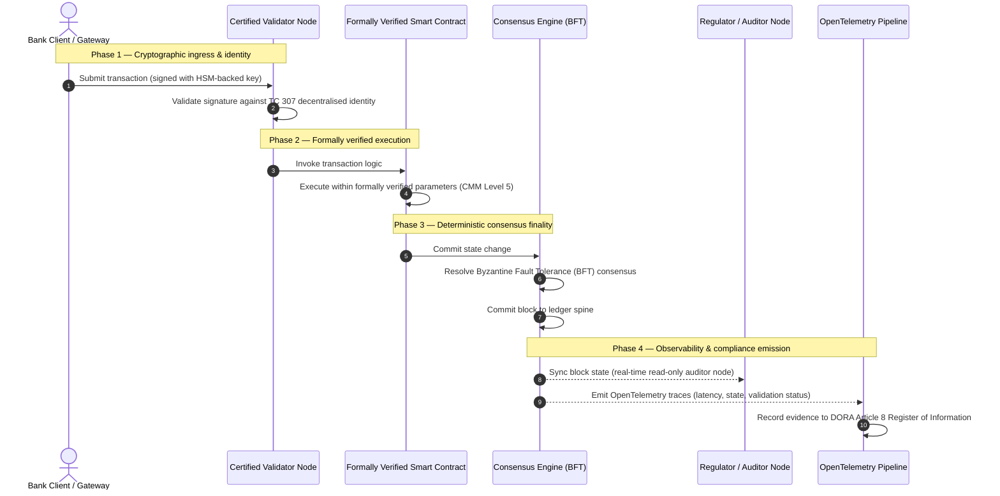

# Dari bukti menuju kebenaran: mengapa blockchain bersertifikat akan menentukan era berikutnya dari kepercayaan perbankan

## Ringkasan strategis (intinya)

Perbankan grosir dan transaksi global pada 2026 berada di titik balik bersejarah. Seiring layanan keuangan beralih ke jaringan kliring digital asli dan real-time, dan seiring kecerdasan buatan memperkenalkan non-determinisme probabilistik, model jaminan tradisional yang analog dan retrospektif (seperti audit statis berbasis entitas) tidak lagi memenuhi tuntutan modern akan manajemen risiko dan kewajiban fidusia.

Komite Teknis ISO/IEC TC 307 telah menetapkan dasar yang terstandardisasi untuk teknologi buku besar terdistribusi. Namun, adopsi institusional yang sesungguhnya menuntut peralihan dari panduan deskriptif ke jaminan blockchain yang preskriptif dan dapat disertifikasi secara independen. Dengan menilai tata kelola buku besar, integritas konsensus, keamanan kontrak pintar, dan kelincahan kriptografis terhadap Model Kematangan Kapabilitas (CMM) lima tingkat yang ketat, bank dapat beralih dari asumsi yang terfragmentasi dan spesifik pemasok menuju kebenaran finansial yang dapat disertifikasi dan diaudit oleh dewan.

## Poin-poin utama

* **Kesenjangan gesekan fidusia**: hari ini kita dapat menyertifikasi bank (Basel III), cloud (ISO 27001), dan sistem tata kelola AI (ISO 42001), tetapi belum dapat menyertifikasi buku besar terdistribusi yang semakin menentukan apa yang benar. Asimetri ini adalah kerentanan operasional yang besar.  
* **DORA memberlakukan tanggung jawab fidusia langsung**: berdasarkan Pasal 5 DORA, dewan direksi bank memikul tanggung jawab pribadi langsung yang tidak dapat didelegasikan atas ketahanan operasional semua penerapan pihak ketiga dan buku besar, dengan sanksi pribadi yang berat dalam rezim SM&CR atas kegagalan.  
* **Tulang punggung audit AI**: di mana pembelajaran mesin menghasilkan hasil probabilistik yang tidak dapat direproduksi, blockchain bersertifikat memberikan penangkapan keadaan yang deterministik. Mencatat versi model, masukan, dan keputusan validasi di rantai memenuhi ISO 42001 dan standar manajemen risiko model.  
* **Indeks Blockchain Bersertifikat**: indeks ini memformalkan tata kelola, konsensus, kontrak pintar, dan keteramatan menjadi kartu skor yang dapat diverifikasi dan siap audit pada skala CMM 0 hingga 5, menerjemahkan metrik rekayasa menjadi pernyataan selera risiko yang disetujui dewan.

## 01. Kesenjangan gesekan fidusia dalam perbankan digital

Dalam perbankan klasik, kepercayaan bersifat relasional, institusional, dan retrospektif. Ia bergantung pada auditor pihak ketiga independen yang meninjau keadaan keuangan pada titik waktu tetap, merekonsiliasi perbedaan antar silo buku besar bilateral. Di pasar real-time yang digerakkan API pada 2026, model ini memperkenalkan latensi yang menghambat dan risiko struktural.

Ketika transaksi diselesaikan seketika, kumpulan likuiditas intrahari dikelola secara dinamis oleh gerbang API, dan kepemilikan aset ditokenisasi di buku besar bersama, audit retrospektif menjadi latihan forensik alih-alih kontrol preventif. Fidusiari tidak lagi dapat hanya mengandalkan sertifikasi entitas hukum. Mereka harus menyertifikasi substrat digital itu sendiri.

Saat ini, bank beroperasi di bawah asimetri arsitektural yang mencolok:

1. **Infrastruktur cloud bersertifikat**: node perangkat keras, kontainer tervirtualisasi, dan pusat data fisik divalidasi terhadap kontrol ISO/IEC 27001 dan SOC 2 Type II.  
2. **Proses manajemen bersertifikat**: kebijakan risiko operasional, rencana kelangsungan bisnis, dan penerapan algoritmik diatur oleh kerangka risiko yang ketat.  
3. **Mesin buku besar tidak bersertifikat**: mekanisme konsensus terdistribusi, rantai pasok node validator, batas kontrak pintar, dan model tata kelola jaringan dibiarkan pada asumsi yang tidak bersertifikat, khusus, atau spesifik konsorsium.

Asimetri ini adalah titik kegagalan kritis. Sebuah bank dapat menjalankan aplikasi yang tervalidasi di dalam kontainer cloud yang aman dan bersertifikat ISO 27001, tetapi jika kontainer itu menulis ke buku besar terdistribusi dengan kontrol validator terpusat, parameter konsensus yang rentan, atau kontrak pintar yang tidak diaudit, integritas transaksi terkompromi. Untuk menjembatani kesenjangan ini, mesin buku besar itu sendiri harus menjadi objek jaminan yang dapat disertifikasi.

## 02. Dasar standardisasi ISO/IEC TC 307

Pekerjaan fundamental yang diperlukan untuk menstandardisasi buku besar terdistribusi sedang ditetapkan oleh Komite Teknis ISO/IEC TC 307 (Teknologi blockchain dan buku besar terdistribusi). Alih-alih memperlakukan blockchain sebagai protokol teknis yang terisolasi, TC 307 mendekatinya sebagai infrastruktur kepercayaan institusional, mengatur pekerjaannya di sekitar lima pilar inti:

1. **Taksonomi dan kosakata (ISO 22739)**: menetapkan nomenklatur bersama, memastikan definisi hukum dan operasional yang konsisten antar yurisdiksi, skema keuangan, dan institusi.  
2. **Arsitektur referensi (ISO/TR 23245)**: mendefinisikan batas, lapisan, aliran data, dan komponen fungsional dari sistem buku besar terdistribusi yang patuh.  
3. **Keamanan, privasi, dan kontrak pintar (ISO/TR 23244 / ISO 23613)**: menetapkan pedoman keamanan dasar untuk sistem aset digital dan merinci praktik terbaik untuk mitigasi kerentanan kontrak pintar dan tata kelola siklus hidup.  
4. **Kerangka interoperabilitas**: menangani mekanisme pertukaran data dan aset antar jaringan buku besar yang heterogen, mencegah terbentuknya silo tertokenisasi yang terisolasi.  
5. **Identitas terdesentralisasi dan jangkar kepercayaan**: mengintegrasikan pengenal kriptografis berbasis buku besar dengan infrastruktur kunci publik (PKI) formal dan registri yang diberi wewenang negara.

Secara kolektif, TC 307 menandakan transisi DLT dari pilihan rekayasa khusus menjadi disiplin arsitektural yang terstandardisasi. Namun, TC 307 tetap sebagian besar deskriptif. Ia mendefinisikan seperti apa keunggulan itu (panduan), tetapi tidak menyediakan protokol verifikasi preskriptif (jaminan) yang dibutuhkan pejabat risiko dan pengawas untuk mengotorisasi penerapan produksi fungsi kritis atau penting (CIF).

## 03. Panduan versus jaminan: perbedaan fidusia

Pelaku pasar keuangan tidak menerapkan teknologi karena inovatif atau elegan; mereka menerapkannya ketika dapat ditata kelola, diaudit, dipertahankan, dan direkonsiliasi dengan persyaratan cadangan modal. Itulah mengapa standardisasi dalam perbankan secara alami terurai menjadi dua lapisan:

* **Panduan (kerangka)**: menguraikan praktik terbaik, target referensi, dan pedoman arsitektural (mis. ISO/IEC TC 307, kerangka NIST).  
* **Jaminan (bukti)**: menyediakan bukti independen, berkelanjutan, dan dapat diverifikasi pihak ketiga bahwa kerangka telah diterapkan dan berjalan sesuai rancangan (mis. sertifikasi ISO 27001, audit SOC 2, pemeriksaan regulasi).

Mengandalkan konsensus buku besar yang tidak bersertifikat sambil menyertifikasi infrastruktur cloud adalah celah regulasi yang kritis. Sebuah blockchain yang "tidak dapat diubah" belum tentu "dipercaya secara institusional". Ketidakubahan hanya menjamin bahwa data yang dimasukkan tetap tidak berubah; ia tidak memverifikasi apakah node validator aman, apakah protokol konsensus tahan terhadap kolusi, apakah logika kontrak pintar benar secara matematis, atau apakah manajemen kunci kriptografis mematuhi mandat pasca-kuantum.

Untuk menutup celah ini, Indeks Blockchain Bersertifikat 2026 memformalkan persyaratan ini menjadi Model Kematangan Kapabilitas (CMM) yang dapat dikuantifikasi, dipetakan ke regulasi perbankan global.

## 04. Indeks Blockchain Bersertifikat 2026

Agar manajemen senior dapat mengevaluasi dan menyertifikasi platform buku besar mereka, indeks ini menstrukturkan infrastruktur buku besar terdistribusi menjadi lima lapisan operasional yang dapat diaudit, dinilai pada skala CMM 0 hingga 5.

## Tabel 1: arsitektur Indeks Blockchain Bersertifikat

| Lapisan indeks | Tingkat kematangan (CMM) | Metrik teknis dan operasional | Referensi kontrol regulasi / fidusia |
| ---- | ---- | ---- | ---- |
| **Tata kelola buku besar** | **Tingkat 0**: konsorsium ad hoc**Tingkat 3**: penyaringan dan rotasi validator otomatis**Tingkat 5**: penjangkaran identitas kriptografis terdesentralisasi, multipihak | % node validator yang dioperasikan oleh entitas keuangan yang telah disaring; waktu rata-rata penyelesaian sengketa validator; sebaran geografis node | **DORA Pasal 5** (Tata kelola dan organisasi); **CPMI-IOSCO PFMI Prinsip 2** (Tata kelola) dan **Prinsip 3** (Kerangka manajemen risiko menyeluruh) |
| **Integritas konsensus** | **Tingkat 0**: node tunggal atau PoW buram**Tingkat 3**: BFT teraudit dengan finalitas deterministik**Tingkat 5**: konsensus multi-yurisdiksi, terverifikasi formal, dengan pemantauan latensi berkelanjutan | latensi konsensus maksimum yang dapat ditoleransi; ambang ketahanan kolusi; SLA ketersediaan pada partisi node tersimulasi | **DORA Pasal 6** (Kerangka manajemen risiko TIK); **CPMI-IOSCO PFMI Prinsip 8** (Finalitas penyelesaian) |
| **Identitas dan kriptografi** | **Tingkat 0**: kunci RSA / ECDSA lemah**Tingkat 3**: multi-tanda tangan dengan manajemen kunci berbasis HSM**Tingkat 5**: kunci hibrida aman kuantum (FIPS 203 ML-KEM) dan gerbang privasi tanpa pengetahuan | % transaksi buku besar yang ditandatangani dengan kunci berbasis HSM; skor kesiapan migrasi PQC; latensi bukti ZK | **NIST FIPS 203 / 204**; **ISO/IEC 27001** (Manajemen keamanan informasi) |
| **Jaminan kontrak pintar** | **Tingkat 0**: skrip Solidity tidak diaudit**Tingkat 3**: validasi kompilator otomatis dan audit eksternal**Tingkat 5**: kontrak pintar tidak dapat diubah, terverifikasi formal, dengan pemutakhiran tipe pemutus sirkuit | % kontrak pintar dengan verifikasi formal matematis; jumlah peringatan kompilator; cakupan pemindaian kerentanan | **Pedoman EBA tentang alih daya** (paragraf 81, 113-117); **DORA Pasal 30** (Klausul kontraktual minimum) |
| **Audit dan keteramatan** | **Tingkat 0**: pengorekan log manual**Tingkat 3**: jejak OTel terstruktur dan node auditor hanya-baca**Tingkat 5**: rekonsiliasi otomatis dan berkelanjutan dengan register Pasal 8 | % transaksi yang tercakup oleh jejak OpenTelemetry; latensi dari komit blok hingga sinkronisasi node auditor | **BCBS 239** (Agregasi data risiko); **DORA Pasal 8** (Register informasi / skema ITS) |

## Tabel 2: sinyal kepercayaan utama yang dipetakan ke standar perbankan global

| Sinyal / tolok ukur | Metrik | Dampak pada platform perbankan | Sumber regulasi |
| ---- | ---- | ---- | ---- |
| **Kemajuan ISO/IEC TC 307** | Peralihan dari laporan teknis ISO/TR ke skema sertifikasi formal | Menetapkan kerangka terstandardisasi pertama untuk menyertifikasi mesin buku besar terdistribusi | **ISO/IEC JTC 1 / SC 44** (Teknologi buku besar terdistribusi) |
| **Fase prototipe Proyek Agorá** | Lebih dari 40 bank komersial peserta; pengujian buku besar terpadu untuk simpanan tertokenisasi | Menggeser kliring lintas batas dari pesan (SWIFT) ke penyelesaian tertokenisasi atomik | **Pusat Inovasi Bank for International Settlements (BIS)** |
| **Audit pihak ketiga DORA Pasal 30** | 100% penyedia node dan host infrastruktur diaudit terhadap kriteria keamanan | Menghapus "node validator bayangan"; mewajibkan transparansi rantai pasok penuh | **Otoritas Pengawas Eropa (ESA)** |
| **ISO/IEC 42001 (tata kelola AI)** | Log model dan pelatihan AI dijadikan tidak dapat diubah secara kriptografis di rantai | Menggunakan blockchain sebagai register bukti yang tidak dapat diubah ("tulang punggung audit") untuk pembelajaran mesin | **ISO/IEC 42001:2023** (Teknologi informasi — Kecerdasan buatan) |
| **Kecukupan modal Basel III** | Pengurangan penyangga modal risiko operasional berdasarkan pengurangan kompleksitas yang terdokumentasi | Kerangka risiko operasional terstandardisasi secara langsung memperhitungkan ketahanan buku besar yang terverifikasi | **Komite Basel untuk Pengawasan Perbankan (BCBS)** |

## 05. "Tulang punggung audit" AI: kecerdasan probabilistik di atas infrastruktur deterministik

Salah satu peran strategis paling kuat dari blockchain bersertifikat pada 2026 adalah bertindak sebagai **"tulang punggung audit"** untuk penerapan kecerdasan buatan. Sistem keuangan modern semakin probabilistik. Penilaian kredit, deteksi penipuan real-time, perdagangan algoritmik, dan interaksi pelanggan otonom digerakkan oleh model pembelajaran mesin yang berevolusi, menyimpang, dan beradaptasi dari waktu ke waktu. Model-model ini tidak deterministik: dengan masukan yang sama pada dua waktu berbeda, mereka dapat menghasilkan keluaran berbeda karena bobot dinamis dan pelatihan berkelanjutan.

Non-determinisme ini menimbulkan tantangan tata kelola yang mendalam di bawah **ISO/IEC 42001 (tata kelola AI)** dan standar manajemen risiko model (MRM) (seperti **SR 11-7 Federal Reserve AS** dan **SS1/23 PRA Inggris**): *bagaimana Anda mengaudit, menjelaskan, dan mempertahankan keputusan yang tidak dapat direproduksi secara ketat?*

Buku besar terdistribusi yang bersertifikat memberikan penyeimbang deterministik. Di mana model AI beroperasi secara probabilistik, blockchain bersertifikat mencatat parameternya secara deterministik, menetapkan tulang punggung bukti yang tidak dapat diubah:

* **Pemversian model dan penjangkaran bobot**: setiap versi model yang diterapkan, bobot terkaitnya, dan checksum data pelatihannya di-hash dan ditulis ke buku besar pada waktu build, memenuhi persyaratan rantai pasok **SLSA Level 3**.  
* **Pencatatan masukan kontekstual**: ketika model AI menjalankan keputusan kritis (mis. menyetujui pinjaman atau menandai transaksi), masukan kontekstual yang tepat dan hash model ditulis ke buku besar, menciptakan riwayat yang tahan-rusak.  
* **Kemampuan audit tanpa akses kode**: jika regulator bertanya "mengapa model Anda menolak permohonan kredit ini pada 3 Juni?", bank tidak perlu mengekspos kode kepemilikannya atau mencoba menciptakan ulang keadaan model yang tepat. Ia menyajikan catatan di rantai yang ditandatangani secara kriptografis tentang masukan, bobot, dan keadaan validasi.

Dengan menjangkarkan keputusan probabilistik model pembelajaran mesin ke konsensus deterministik blockchain bersertifikat, institusi menciptakan garis waktu tindakan otomatis yang dapat dipertahankan, direkonstruksi, dan diverifikasi secara independen.

## 06. Memvisualisasikan alur bersertifikat dari konsensus ke audit

Diagram urutan berikut mengilustrasikan siklus hidup transaksi yang melewati platform blockchain bersertifikat, menunjukkan bagaimana gerbang validasi, integritas konsensus, eksekusi kontrak pintar, dan emisi telemetri saling mengunci untuk menghasilkan bukti regulasi yang siap untuk dewan:

Jalur kritis dari urutan transaksional ini menuntut agar setiap langkah validasi, eksekusi, dan konsensus ditandatangani secara kriptografis, memastikan asal-usul ujung-ke-ujung. Node auditor regulator menyinkronkan keadaan blok secara real-time, menghilangkan kebutuhan rekonsiliasi keuangan manual dan retrospektif.

## 07. Buku pedoman dewan untuk manajer senior

Untuk berhasil menavigasi transisi dari kepercayaan organisasional ke kepercayaan infrastruktural, eksekutif bank dan manajer senior harus segera menjalankan empat arahan utama:

1. **Mewajibkan audit buku besar dalam manajemen risiko perusahaan (ERM)**: memberlakukan kebijakan bahwa tidak ada platform buku besar terdistribusi — privat, publik, atau konsorsium — yang boleh diterapkan untuk fungsi kritis atau penting (CIF) tanpa diaudit terhadap **arsitektur Indeks Blockchain Bersertifikat** lima lapisan (minimum CMM Tingkat 3).  
2. **Mengintegrasikan blockchain sebagai tulang punggung bukti AI ISO 42001**: mengarahkan Chief Risk Officer dan Arsitek AI Utama untuk mengintegrasikan semua model pembelajaran mesin berdampak tinggi dengan blockchain bersertifikat, menciptakan register audit tahan-rusak tentang versi model, bobot, masukan, dan keputusan.  
3. **Mengaudit rantai pasok node validator (DORA Pasal 30)**: mewajibkan divisi pengadaan mengaudit semua entitas pihak ketiga yang menghosting node validator atau mengelola hosting cloud untuk jaringan DLT, memberlakukan standar keamanan siber dan ketahanan operasional yang sama seperti yang diterapkan pada node cloud internal bank.  
4. **Menyelaraskan arsitektur buku besar dengan CPMI-IOSCO dan BCBS 239**: mengarahkan tim rekayasa platform untuk menyelaraskan telemetri keluaran buku besar langsung dengan persyaratan pelaporan data **BCBS 239**, dan memastikan parameter konsensus dan finalitas penyelesaian secara ketat mematuhi **Prinsip 8 dan 9 CPMI-IOSCO**.

## 08. Pertanyaan yang sering diajukan

**Apakah ISO/IEC TC 307 merupakan standar sertifikasi?**  
Tidak. ISO/IEC TC 307 adalah komite teknis yang menetapkan kosakata, arsitektur referensi, dan pedoman keamanan. Meskipun mendefinisikan "seperti apa keunggulan itu" (panduan), industri harus mengoperasionalkan dokumen-dokumen ini menjadi skema sertifikasi formal yang dapat diaudit (jaminan) untuk memuaskan pengawas perbankan.

**Bagaimana blockchain bersertifikat mendukung kepatuhan DORA?**  
Berdasarkan Pasal 5 DORA, dewan bank memikul tanggung jawab pribadi langsung atas ketahanan teknologi. Blockchain bersertifikat menyediakan bukti kriptografis yang dapat diverifikasi tentang integritas konsensus, kontrol rantai pasok validator, dan keamanan kontrak pintar, memberi anggota dewan "langkah-langkah wajar" yang dapat didokumentasikan yang diperlukan untuk mempertahankan diri terhadap klaim tanggung jawab pribadi di bawah SM&CR.

Apa perbedaan antara audit buku besar tradisional dan audit blockchain bersertifikat?  
Audit tradisional bersifat retrospektif: ia memverifikasi entri manual dan berkas statis setelah transaksi diselesaikan. Audit blockchain bersertifikat bersifat berkelanjutan dan real-time; node validator, mesin konsensus BFT, dan kontrak pintar terverifikasi formal disertifikasi untuk menjalankan transaksi secara deterministik, memancarkan telemetri terstruktur (OpenTelemetry) yang terus-menerus memvalidasi kesehatan sistem.

Dapatkah blockchain publik disertifikasi untuk penggunaan perbankan?  
Di sebagian besar yurisdiksi, blockchain publik murni tanpa izin gagal memenuhi regulasi perbankan karena tidak adanya verifikasi identitas validator, biaya transaksi yang tak terduga, dan finalitas non-deterministik (mis. percabangan probabilistik proof-of-work/stake). Blockchain bersertifikat dalam perbankan biasanya menggunakan arsitektur perusahaan berizin atau arsitektur publik-hibrida yang sangat diregulasi, di mana operator node validator adalah entitas keuangan yang teridentifikasi dan teraudit.

## 09. Referensi

* Komite Basel untuk Pengawasan Perbankan (BCBS), 2013. *Principles for effective risk data aggregation and reporting (BCBS 239)*. Basel: Bank for International Settlements. Tersedia di: [https://www.bis.org/publ/bcbs239.pdf](https://www.bis.org/publ/bcbs239.pdf).  
* Committee on Payments and Market Infrastructures dan Technical Committee of the International Organization of Securities Commissions (CPMI-IOSCO), 2012. *Principles for financial market infrastructures*. Basel: Bank for International Settlements. Tersedia di: [https://www.bis.org/cpmi/publ/d101a.pdf](https://www.bis.org/cpmi/publ/d101a.pdf).  
* Otoritas Perbankan Eropa (EBA), 2019. *EBA/GL/2019/02 — Guidelines on outsourcing arrangements*. Paris: EBA. Tersedia di: [https://www.eba.europa.eu/regulation-and-policy/internal-governance/guidelines-on-outsourcing-arrangements](https://www.eba.europa.eu/regulation-and-policy/internal-governance/guidelines-on-outsourcing-arrangements).  
* Parlemen Eropa dan Dewan Uni Eropa, 2022. *Regulasi (UE) 2022/2554 tentang ketahanan operasional digital untuk sektor keuangan (DORA)*. Brussels: Jurnal Resmi Uni Eropa. Tersedia di: [https://eur-lex.europa.eu/legal-content/EN/TXT/?uri=CELEX%3A32022R2554](https://eur-lex.europa.eu/legal-content/EN/TXT/?uri=CELEX%3A32022R2554).  
* ISO/IEC JTC 1/SC 42, 2023. *ISO/IEC 42001:2023 — Information technology — Artificial intelligence — Management system*. Jenewa: Organisasi Internasional untuk Standardisasi. Tersedia di: [https://www.iso.org/standard/81230.html](https://www.iso.org/standard/81230.html).  
* Komite Teknis ISO/IEC 307, 2020. *ISO/IEC 22739:2020 — Blockchain and distributed ledger technologies — Vocabulary*. Jenewa: Organisasi Internasional untuk Standardisasi. Tersedia di: [https://www.iso.org/standard/73771.html](https://www.iso.org/standard/73771.html).  
* National Institute of Standards and Technology (NIST), 2026. *First Three Finalized Post-Quantum Encryption Standards (FIPS 203, 204, and 205)*. Gaithersburg: U.S. Department of Commerce. Tersedia di: [https://www.nist.gov/news-events/news/2024/08/nist-releases-first-3-finalized-post-quantum-encryption-standards](https://www.nist.gov/news-events/news/2024/08/nist-releases-first-3-finalized-post-quantum-encryption-standards).
